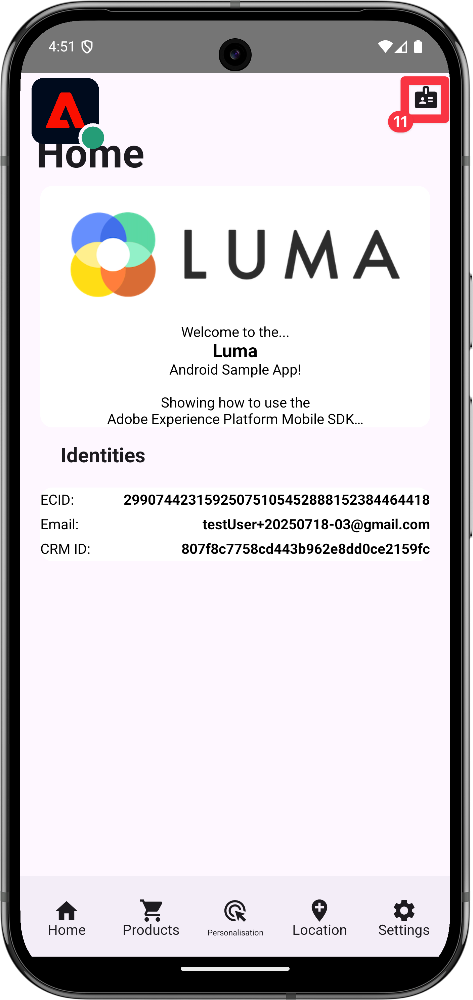
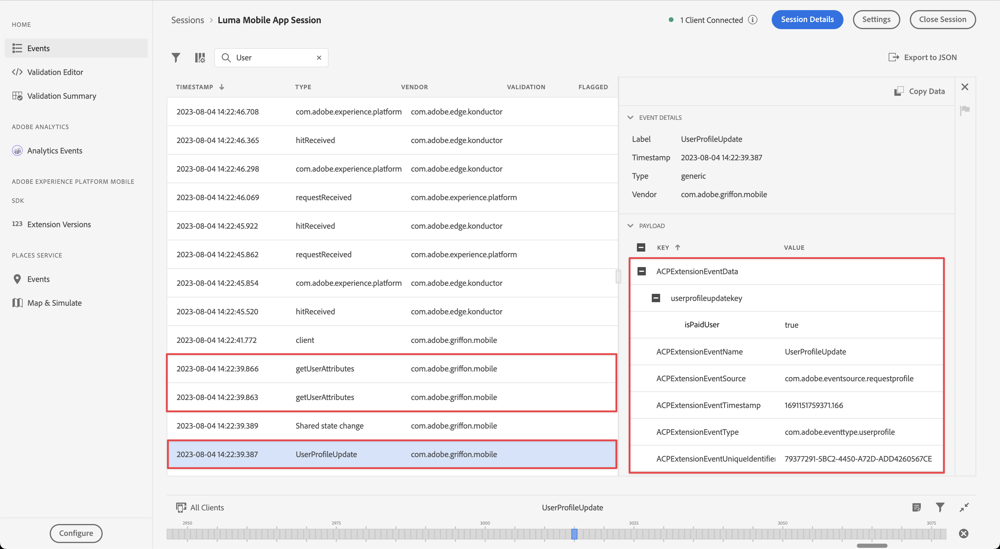

# プロファイルデータの収集

モバイルアプリでプロファイルデータを収集する方法を説明します。

プロファイル拡張機能を使用して、クライアント上のユーザーに関する属性を保存できます。 この情報を後で使用すると、最適なパフォーマンスを得るためにサーバーに接続することなく、オンラインまたはオフラインのシナリオ中にメッセージをターゲットにしてパーソナライズできます。

プロファイル拡張機能は、クライアントサイド操作プロファイル（CSOP）の管理、API への対応方法の提供、ユーザープロファイル属性の更新、生成されたイベントとしてのシステムのその他の部分とのユーザープロファイル属性の共有を行います。

プロファイルデータは、他の拡張機能でプロファイル関連のアクションを実行する際に使用されます。 例えば、プロファイルデータを使用し、プロファイルデータに基づいてルールを実行するルールエンジン拡張機能があります。 [ プロファイル拡張機能 ](https://developer.adobe.com/client-sdks/documentation/profile/) について詳しくは、ドキュメントを参照してください

>[!IMPORTANT]
>
>このレッスンで説明するプロファイル機能は、Adobe Experience Platformおよびプラットフォームベースのアプリケーションのリアルタイム顧客プロファイル機能とは別の機能です。


## 前提条件

* SDK がインストールおよび設定された状態で、アプリケーションが正常に構築および実行されました。

## 学習目標

このレッスンでは、次の操作を行います。

* ユーザー属性を設定または更新します。
* ユーザー属性を取得します。


## ユーザー属性の設定と更新

これは、ユーザーが過去または最近に購入を行ったかどうかをアプリ内ですばやく把握できるので、ターゲティングとパーソナライゼーションに役立ちます。 これを Luma アプリで設定しましょう。

>[!BEGINTABS]

>[!TAB iOS]

1. Xcode プロジェクトナビゲーターで **[!DNL Luma]**/**[!DNL Luma]**/**[!DNL Utils]**/**[!DNL MobileSDK]** に移動し、`func updateUserAttribute(attributeName: String, attributeValue: String)` 関数を見つけます。 次のコードを追加します。

   ```swift
   // Create a profile map, add attributes to the map and update profile using the map
   var profileMap = [String: Any]()
   profileMap[attributeName] = attributeValue
   UserProfile.updateUserAttributes(attributeDict: profileMap)
   ```

   このコード：

   1. `profileMap` という名前の空の辞書を設定します。

   1. `attributeName` （例：`isPaidUser`）および `attributeValue` （例：`yes`）を使用して、要素を辞書に追加します。

   1. `profileMap` ディクショナリを `attributeDict`[`UserProfile.updateUserAttributes` API 呼び出しの ](https://developer.adobe.com/client-sdks/documentation/profile/api-reference/#updateuserattributes) パラメーターへの値として使用します。

1. Xcode プロジェクトナビゲーターで **[!DNL Luma]**/**[!DNL Luma]**/**[!DNL Views]**/**[!DNL Products]**/**[!DNL ProductView]** に移動し、（購入のコード `updateUserAttributes`CreditCard への呼び出しを見つけます。 次のコードを追加します。

   ```swift
   // Update attributes
   MobileSDK.shared.updateUserAttribute(attributeName: "isPaidUser", attributeValue: "yes")
   ```

>[!TAB Android]

1. Android Studio ナビゲーターで **[!UICONTROL Android]** /**[!DNL app]**/**[!DNL kotlin+java]**/**[!DNL com.adobe.luma.tutorial.android]**/**[!UICONTROL models]**/**[!UICONTROL MobileSDK]** に移動し、`func updateUserAttribute(attributeName: String, attributeValue: String)` 関数を見つけます。 次のコードを追加します。

   ```kotlin
   // Create a profile map, add attributes to the map and update profile using the map
   val profileMap = mapOf(attributeName to attributeValue)
   UserProfile.updateUserAttributes(profileMap)
   ```

   このコード：

   1. `profileMap` という名前の空のマップを設定します。

   1. `attributeName` （例：`isPaidUser`）および `attributeValue` （例：`yes`）を使用して、マップに要素を追加します。

   1. `profileMap` マップを、`attributeDict`[`UserProfile.updateUserAttributes` API 呼び出しの ](https://developer.adobe.com/client-sdks/documentation/profile/api-reference/#updateuserattributes) パラメーターへの値として使用します。

1. **[!UICONTROL Android]** /**[!DNL app]**/**[!DNL kotlin+java]**/**[!DNL com.adobe.luma.tutorial.android]**/**[!UICONTROL views]**/**[!UICONTROL ProductView.kt]** に移動し、（購入 `updateUserAttributes`CreditCard の呼び出しを見つけます。 次のコードを追加します。

   ```kotlin
   // Update attributes
   MobileSDK.shared.updateUserAttribute("isPaidUser", "yes")
   ```

>[!ENDTABS]

## ユーザー属性の取得

ユーザーの属性を更新すると、他のAdobe SDK で使用できるようになりますが、属性を明示的に取得して、アプリが思いどおりに動作するようにすることもできます。

>[!BEGINTABS]

>[!TAB iOS]

1. Xcode プロジェクトナビゲーターで **[!DNL Luma]** / **[!DNL Luma]** / **[!DNL Views]** / **[!DNL General]** / **[!DNL HomeView]** に移動し、`.onAppear` 修飾子を見つけます。 次のコードを追加します。

   ```swift
   // Get attributes
   UserProfile.getUserAttributes(attributeNames: ["isPaidUser"]) { attributes, error in
       if attributes?.count ?? 0 > 0 {
           if attributes?["isPaidUser"] as? String == "yes" {
               showBadgeForUser = true
           }
           else {
               showBadgeForUser = false
           }
       }
   }
   ```

   このコード：

   1. [`UserProfile.getUserAttributes` の属性名を持つ ](https://developer.adobe.com/client-sdks/documentation/profile/api-reference/#getuserattributes)`isPaidUser` API を `attributeNames` 配列の単一の要素として呼び出します。
   1. 次に、`isPaidUser` 属性の値をチェックし、`yes` 定すると、右上のツールバーにある  アイコンにバッジが付きます。

>[!TAB Android]

1. Android Studio プロジェクトナビゲーターで **[!UICONTROL Android]** /**[!DNL app]**/**[!DNL kotlin+java]**/**[!DNL com.adobe.luma.tutorial.androi]**/**[!DNL views]**/**[!DNL HomeView.kt]** に移動し、`.onAppear` 修飾子を見つけます。 次のコードを追加します。

   ```kotlin
   // Get attributes
   UserProfile.getUserAttributes(listOf("isPaidUser")) { attributes ->
       showBadgeForUser = attributes?.get("isPaidUser") == "yes"
   }
   ```

   このコード：

   1. [`UserProfile.getUserAttributes` の属性名を持つ ](https://developer.adobe.com/client-sdks/documentation/profile/api-reference/#getuserattributes)`isPaidUser` API を `attributeNames` 配列の単一の要素として呼び出します。
   1. 次に、`isPaidUser` 属性の値を確認します。 `yes` の場合、コードは右上のツールバーにある人物アイコンをバッジアイコンに置き換えます。

>[!ENDTABS]

詳しくは、[API リファレンス ](https://developer.adobe.com/client-sdks/documentation/profile/api-reference/#getuserattributes) を参照してください。

## Assurance での検証

1. [ 設定手順 ](assurance.md#connecting-to-a-session) の節を参照して、シミュレーターまたはデバイスをAssuranceに接続します。
1. アプリを実行してログインし、製品とやり取りします。

>[!BEGINTABS]

>[!TAB iOS]

1. タブバーの **[!UICONTROL ホーム]** を選択します。
1. Assurance アイコンを左に移動します。
1. ログインシートを開くには、「」ボタンを選択します。

   

1. ランダムなメールと顧客 ID を挿入するには、**[!UICONTROL A |]** ボタン。
1. **[!UICONTROL ログイン]** を選択します。

   

1. タブバーで「**[!DNL Products]**」を選択します。
1. 製品を 1 つ選択します。
1.  を選択します。
1.  を選択します。
1.  を選択します。

   

1. **[!UICONTROL ホーム]** 画面に戻ります。 バッジが追加された  ことがわかります。

   


>[!TAB Android]

1. タブバーの **[!UICONTROL ホーム]** を選択します。
1. Assurance アイコンを左に移動します。
1. ログインシートを開くには、「」ボタンを選択します。

   

1. ランダムなメールと顧客 ID を挿入するには、「**[!UICONTROL ランダムなメールを生成]**」を選択します。
1. **[!UICONTROL ログイン]** を選択します。

   

1. タブバーで「**[!DNL Products]**」を選択します。
1. 製品を 1 つ選択します。
1. 「」を選択します。
1.  を選択します。
1.  を選択します。

   

1. **[!UICONTROL ホーム]** 画面に戻ります。 人物アイコンが更新されていることがわかります。

   

>[!ENDTABS]


Assurance UI に、更新された **[!UICONTROL 値を持つ]** UserProfileUpdate **[!UICONTROL および]** getUserAttributes`profileMap` イベントが表示されます。

{zoomable="yes"}

>[!SUCCESS]
>
>これで、Edge Network内および（設定時に）Adobe Experience Platformでプロファイルの属性を更新するアプリの設定が完了しました。
>
>Adobe Experience Platform Mobile SDKの学習にご協力いただき、ありがとうございます。 ご不明な点がある場合や、一般的なフィードバックをお寄せになる場合、または今後のコンテンツに関するご提案がある場合は、この [Experience League Community Discussion の投稿 ](https://experienceleaguecommunities.adobe.com/t5/adobe-experience-platform-data/tutorial-discussion-implement-adobe-experience-cloud-in-mobile/td-p/443796?profile.language=ja) でお知らせください。

次のトピック：**[場所を使用](places.md)**
