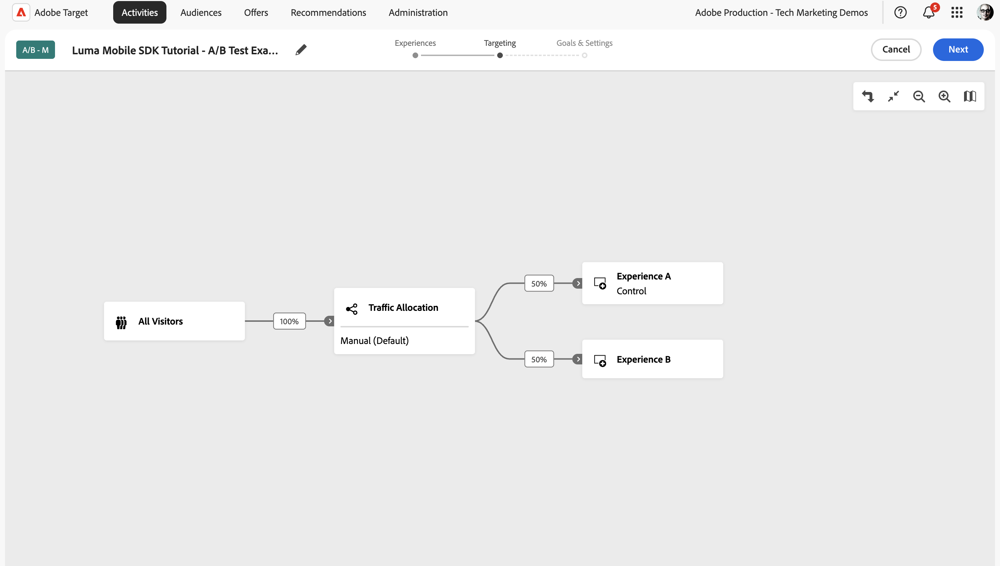

# Adobe Targetを使用した最適化とパーソナライズ

Platform Mobile SDKとAdobe Targetを使用して、モバイルアプリのエクスペリエンスを最適化およびパーソナライズする方法について説明します。

Target は、顧客体験をカスタマイズおよびパーソナライズするために必要なすべてを提供します。 Target は、Web サイト、モバイルサイト、アプリ、ソーシャルメディア、その他のデジタルチャネルの売上高を最大化するのに役立ちます。 Target は、A/B テスト、多変量分析テスト、製品とコンテンツのレコメンデーション、コンテンツのターゲット設定、AI を使用したコンテンツの自動パーソナライズなどを実行できます。 このレッスンでは、Target の A/B テスト機能に焦点を当てます。 詳しくは、[A/B テストの概要 ](https://experienceleague.adobe.com/ja/docs/target/using/activities/abtest/test-ab) 参照してください。

{zoomable="yes"}

Target で A/B テストを実行する前に、設定と統合が適切に行われていることを確認する必要があります。

>[!NOTE]
>
>このレッスンはオプションで、A/B テストの実施を検討しているAdobe Target ユーザーにのみ適用されます。


## 前提条件

* SDK がインストールおよび設定された状態で、アプリケーションが正常に構築および実行されました。
* [ 権限、適切に設定された役割、ワークスペース、プロパティ ](https://experienceleague.adobe.com/ja/docs/target/using/administer/manage-users/enterprise/property-channel) を使用して、Adobe Targetにアクセスします。


## 学習目標

このレッスンでは、次の操作を行います。

* Target 統合のデータストリームを更新します。
* Offer Decisioningと Target の拡張機能を使用してタグプロパティを更新します。
* 提案イベントを取り込むようにスキーマを更新します。
* Assuranceの設定を検証します。
* Target で簡単な A/B テストを作成します。
* アプリを更新して、Optimizer 拡張機能を登録します。
* アプリに A/B テストを実装します。
* Assuranceでの実装を検証します。


## セットアップ

>[!TIP]
>
>アプリを [Journey Optimizer オファー ](journey-optimizer-offers.md) レッスンの一部として既に設定している場合は、この設定の節の手順のいくつかが既に実行されている可能性があります。

### データストリーム設定を更新

#### Adobe Target

モバイルアプリからExperience Platform Edge NetworkAdobe Targetにデータが確実に転送されるようにするには、データストリーム設定を更新する必要があります。

1. データ収集 UI で「**[!UICONTROL データストリーム]**」を選択し、データストリームを選択します（例：**[!DNL Luma Mobile App]**）。
1. **[!UICONTROL サービスを追加]** を選択してから、{ サービス **[!UICONTROL リストから]** 2 **[!UICONTROL Adobe Target} を選択してください。]**
1. Target Premium ユーザーがプロパティトークンを使用する場合は、この統合に使用する Target **[!UICONTROL プロパティトークン]** 値を入力します。 Target Standard ユーザーは、この手順をスキップできます。

   Target UI の **[!UICONTROL 管理]**/**[!UICONTROL プロパティ]** で、プロパティを確認できます。 「」を選択して、使用するプロパティのプロパティトークンを表示します。 プロパティトークンには `"at_property": "xxxxxxxx-xxxx-xxxxx-xxxx-xxxxxxxxxxxx"` のような形式があります。値 `xxxxxxxx-xxxx-xxxxx-xxxx-xxxxxxxxxxxx` のみを入力する必要があります。

   オプションで、ターゲット環境 ID を指定できます。 Target では、環境を使用してサイトと実稼動前の環境を整理し、管理を容易にし、レポートを個別に作成できます。 プリセットされた環境には、実稼働、ステージング、開発が含まれます。 詳しくは、[ 環境 ](https://experienceleague.adobe.com/ja/docs/target/using/administer/environments) および [ ターゲット環境 ID](https://experienceleague.adobe.com/ja/docs/platform-learn/implement-web-sdk/applications-setup/setup-target) を参照してください。

   オプションで、Target サードパーティ ID 名前空間を指定して、ID 名前空間（例：CRM ID）でのプロファイル同期をサポートすることができます。 詳しくは、[Target サードパーティ ID 名前空間 ](https://experienceleague.adobe.com/ja/docs/platform-learn/implement-web-sdk/applications-setup/setup-target) を参照してください。

1. 「**[!UICONTROL 保存]**」を選択します。

   {zoomable="yes"}


#### Adobe Journey Optimizer

モバイルアプリからEdge Networkに送信されるデータがJourney Optimizer - Decision Management に転送されるようにするには、データストリーム設定を更新します。

1. データ収集 UI で「**[!UICONTROL データストリーム]**」を選択し、データストリームを選択します（例：**[!DNL Luma Mobile App]**）。
1.  の「詳細 **[!UICONTROL 」を選択し、コンテキストメニューから]** 編集  編集 **[!UICONTROL を選択します。]**
1. **[!UICONTROL データストリーム]**//**[!UICONTROL Adobe Experience Platform]** 画面で、「**[!UICONTROL Offer Decisioning]**」、「**[!UICONTROL Edge セグメント化]**」、「**[!UICONTROL Personalizationの宛先]**」が選択されていることを確認します。 Journey Optimizerのレッスンにも従う場合は、「**[!UICONTROL Adobe Journey Optimizer]**」を選択します。 詳しくは、[Adobe Experience Platform](https://experienceleague.adobe.com/ja/docs/experience-platform/datastreams/configure) 設定を参照してください。
1. データストリーム設定を保存するには、「**[!UICONTROL 保存]**」を選択します。

   {zoomable="yes"}


### Offer Decisioningと Target のタグ拡張機能のインストール

このレッスンでは、Target での A/B テストについて説明しますが、テスト結果はオファーと見なされ、Adobe Offer Decisioningと Target タグ拡張機能を使用してAdobe インフラストラクチャに実装されます。 この拡張機能では、Journey Optimizerと Target の両方が提供するオファーを処理します。

1. **[!UICONTROL Tags]** に移動し、モバイルタグプロパティを見つけて、プロパティを開きます。
1. **[!UICONTROL 拡張機能]** を選択します。
1. **[!UICONTROL カタログ]** を選択します。
1. **[!UICONTROL Offer Decisioningと Target]** 拡張機能を検索します。
1. 拡張機能をインストールします。 拡張機能では、追加の設定は必要ありません。

   {zoomable="yes"}


### スキーマを更新

1. データ収集インターフェイスに移動し、左パネルから **[!UICONTROL スキーマ]** を選択します。
1. 上部のバーから **[!UICONTROL 参照]** を選択します。
1. スキーマを選択して開きます。
1. スキーマエディターで、「フィールドグループ  追加 **&#x200B;**&#x200B;**[!UICONTROL 追加]** を選択します。
1. **[!UICONTROL フィールドグループの追加]** ダイアログで、`proposition` を検索し、**[!UICONTROL エクスペリエンスイベント – 提案インタラクション]** および **[!UICONTROL フィールドグループの追加]** を選択します。
   {zoomable="yes"}
1. スキーマへの変更を保存するには、「**[!UICONTROL 保存]**」を選択します。


### Assuranceでの設定の検証

Assuranceの設定を検証するには：

1. Assurance UI に移動します。
1. 左側のパネルで **[!UICONTROL 設定]** を選択し、&lbrace;6 の下にある **[!UICONTROL 設定を検証]** の横にある「追加 **[!UICONTROL を選択します。]**
1. 「**[!UICONTROL 保存]**」を選択します。
1. 左パネルで **[!UICONTROL 設定を検証]** を選択します。 データストリームの設定と、アプリケーションでのSDKの設定の両方が検証されます。
   {zoomable="yes"}

## A/B テストの作成

概要で説明したように、Adobe Targetで作成してモバイルアプリに実装できるアクティビティには、多くの種類があります。 このレッスンでは、A/B テストを実装します。

1. Target UI の上部バーで「**[!UICONTROL アクティビティ]**」をクリックします。
1. **[!UICONTROL アクティビティを作成]** と **[!UICONTROL A/B テスト]** をコンテキストメニューから選択します。
1. **[!UICONTROL A/B テストアクティビティを作成]** ダイアログで、**[!UICONTROL タイプ]** として **[!UICONTROL モバイル]** を選択し、**[!UICONTROL Workspaceを選択]** リストからワークスペースを選択します。 Target Premium ユーザーで、データストリームでプロパティトークンを指定した場合は、**[!UICONTROL プロパティを選択]** リストからプロパティを選択します。
1. 「**[!UICONTROL 作成]**」を選択します。
   {zoomable="yes"}

1. **[!UICONTROL 名称未設定アクティビティ]** 画面の **[!UICONTROL エクスペリエンス]** ステップで、次の操作を行います。

   1. `luma-mobileapp-abtest` 場所 1 **[!UICONTROL の下の]** 場所を選択 **[!UICONTROL に]** を入力します。 この場所名（mbox と呼ばれることが多い）は、アプリの実装で後で使用されます。
   1.  の横にある **[!UICONTROL 詳細]** を選択し、コンテキストメニューから **[!UICONTROL JSON オファーを作成]** を選択します。
   1. **[!UICONTROL JSON オファーを作成]** ダイアログに、次の JSON を貼り付けます。

      ```json
      { 
          "title": "Luma Anaolog Watch",
          "text": "Designed to stand up to your active lifestyle, this women's Luma Analog Watch features a tasteful brushed chrome finish and a stainless steel, water-resistant construction for lasting durability.", 
          "image": "https://luma.enablementadobe.com/content/dam/luma/en/products/gear/watches/Luma_Analog_Watch.jpg" 
      }
      ```

      {zoomable="yes"}

      「**[!UICONTROL 作成]**」を選択します。

   1. **[!UICONTROL エクスペリエンス]** の横にある「**[!UICONTROL +]**」を選択して、**[!UICONTROL エクスペリエンス B]** を追加します。


   1. エクスペリエンス B に対して手順 b と c を繰り返しますが、代わりに `Aim Analog Watch` をタイトルとして使用し、次の JSON を貼り付けます。

      ```json
      { 
          "title": "Aim Analog Watch",
          "text": "The flexible, rubberized strap is contoured to conform to the shape of your wrist for a comfortable all-day fit. The face features three illuminated hands, a digital read-out of the current time, and stopwatch functions.", 
          "image": "https://luma.enablementadobe.com/content/dam/luma/en/products/gear/watches/Aim_Watch.jpg" 
      }
      ```


1. **[!DNL Targeting]** のステップでは、A/B テストの設定をレビューします。 デフォルトでは、両方のオファーがすべての訪問者に均等に割り当てられます。 「**[!UICONTROL 次へ]**」をクリックして続行します。

   {zoomable="yes"}

1. **[!UICONTROL 目標と設定]** 手順で、次の操作を行います。

   1. 名称未設定アクティビティの名前を `Luma Mobile SDK Tutorial - A/B Test Example` などに変更します。
   1. A/B テストの **[!UICONTROL 目的]** を入力します（例：`A/B Test for Luma mobile app tutorial`）。
   1. **[!UICONTROL 目標指標]**/**[!UICONTROL 自分のプライマリ目標]** タイルで **[!UICONTROL コンバージョン]**、**[!UICONTROL mbox を表示]** を選択し、`luma-mobileapp-abtest` などの場所（mbox）名を入力します。
   1. **[!UICONTROL 保存して閉じる]** を選択します。

      {zoomable="yes"}

1. **[!UICONTROL すべてのアクティビティ]** 画面に戻ります。

   1. アクティビティで  を選択します。
   1. **[!UICONTROL アクティベート]** を選択して、A/B テストをアクティベートします。

   {zoomable="yes"}


## アプリへの Target の実装

前のレッスンで説明したように、モバイルタグ拡張機能をインストールしても、設定のみが提供されます。 次に、Optimize SDKをインストールして登録する必要があります。 これらの手順が明確でない場合は、「SDK のインストール [ の節を参照し ](install-sdks.md) ください。

>[!NOTE]
>
>[SDK のインストール ](install-sdks.md) の節を完了した場合、SDKは既にインストールされているので、この手順をスキップできます。
>

>[!BEGINTABS]

>[!TAB iOS]

1. Xcode で、[AEP Optimize](https://github.com/adobe/aepsdk-messaging-ios) がパッケージの依存関係のパッケージの一覧に追加されていることを確認します。 [Swift パッケージマネージャー ](install-sdks.md#swift-package-manager) を参照してください。
1. Xcode プロジェクトナビゲーターで **[!DNL Luma]**/**[!DNL Luma]**/**[!DNL AppDelegate]** に移動します。
1. `AEPOptimize` が読み込みのリストに含まれていることを確認します。

   `import AEPOptimize`

1. `Optimize.self` が、登録している拡張機能の配列の一部であることを確認します。

   ```swift
   let extensions = [
       AEPIdentity.Identity.self,
       Lifecycle.self,
       Signal.self,
       Edge.self,
       AEPEdgeIdentity.Identity.self,
       Consent.self,
       UserProfile.self,
       Places.self,
       Messaging.self,
       Optimize.self,
       Assurance.self
   ]
   ```

1. Xcode プロジェクトナビゲーターで **[!DNL Luma]**/**[!DNL Luma]**/**[!DNL Utils]**/**[!DNL MobileSDK]** に移動します。 ` func updatePropositionAT(ecid: String, location: String) async` 関数を検索します。 次のコードを追加します。

   ```swift
   // set up the XDM dictionary, define decision scope and call update proposition API
   Task {
       let ecid = ["ECID" : ["id" : ecid, "primary" : true] as [String : Any]]
       let identityMap = ["identityMap" : ecid]
       let xdmData = ["xdm" : identityMap]
       let decisionScope = DecisionScope(name: location)
       Optimize.clearCachedPropositions()
       Optimize.updatePropositions(for: [decisionScope], withXdm: xdmData) { data, error in
           if let error = error {
               Logger.aepMobileSDK.error("MobileSDK - updatePropositionsAT: Error updating propositions: \(error.localizedDescription)")
           }
       }
   }
   ```

   この関数：

   * a/B テストを提示する必要があるプロファイルを識別する ECID を含む、XDM 辞書 `xdmData` ードを設定します。
   * a/B テストを提示する場所の `decisionScope` 配列を定義します。

   次に、関数は [`Optimize.clearCachedPropositions`](https://developer.adobe.com/client-sdks/documentation/adobe-journey-optimizer-decisioning/api-reference/#clearpropositions) と [`Optimize.updatePropositions`](https://developer.adobe.com/client-sdks/documentation/adobe-journey-optimizer-decisioning/api-reference/#updatepropositions) の 2 つの API を呼び出します。 これらの関数は、キャッシュされた提案をすべてクリアし、このプロファイルの提案を更新します。 このコンテキストでの提案は、Target アクティビティ（A/B テスト）から選択され、[A/B テストの作成 ](#create-an-ab-test) で定義したエクスペリエンス（オファー）です。

1. Xcode プロジェクトナビゲーターで **[!DNL Luma]**/**[!DNL Luma]**/**[!DNL Views]**/**[!DNL Personalization]**/**[!DNL TargetOffersView]** に移動します。 `func onPropositionsUpdateAT(location: String) async {` 関数を見つけて、この関数のコードを調べます。 この関数の最も重要な部分は、[`Optimize.onPropositionsUpdate`](https://developer.adobe.com/client-sdks/documentation/adobe-journey-optimizer-decisioning/api-reference/#onpropositionsupdate) API 呼び出しです。この呼び出しは、次のような特徴があります。
   * 決定範囲（A/B テストで定義した場所）に基づいて、現在のプロファイルの提案を取得します。
   * 提案からオファーを取得します。
   * オファーのコンテンツを展開して、アプリで適切に表示できるようにします。
   * オファーが表示されたことを通知するイベントを Platform Edge Networkに送り返す、オファーの `displayed()` アクションをトリガーに設定します。

1. **[!DNL TargetOffersView]** のまま、次のコードを `.onFirstAppear` 修飾子に追加します。 このコードにより、オファーを更新するコールバックが 1 回だけ登録されるようになります。

   ```swift
   // Invoke callback for offer updates
   Task {
       await self.onPropositionsUpdateAT(location: location)
   }
   ```

1. **[!DNL TargetOffersView]** のまま、次のコードを `.task` 修飾子に追加します。 このコードは、ビューが更新されると、オファーを更新します。

   ```swift
   // Clear and update offers
   await self.updatePropositionsAT(ecid: currentEcid, location: location)
   ```

>[!TAB Android]

1. Android Studio で、[aepsdk-optimize-android](https://github.com/adobe/aepsdk-optimize-android) が **[!UICONTROL Android]** **[!UICONTROL ChevronDown]** >  の **[!UICONTROL build.gradle.kts]** の依存関係に含まれていることを確認します。 [Gradle](install-sdks.md#gradle) を参照。
1. Android Studio ナビゲーターで **[!DNL app]**/**[!DNL kotlin+java]**/**[!UICONTROL com.adobe.luma.tutorial.android]**/**[!UICONTROL MainActivity]** に移動します。
1. `Optimize` が読み込みのリストに含まれていることを確認します。

   ```kotlin
   import com.adobe.marketing.mobile.optimize.Optimize
   ```

1. `Optimize.EXTENSION` が、登録している拡張機能の配列の一部であることを確認します。

   ```kotlin
   val extensions = listOf(
      Identity.EXTENSION,
      Lifecycle.EXTENSION,
      Signal.EXTENSION,
      Edge.EXTENSION,
      Consent.EXTENSION,
      UserProfile.EXTENSION,
      Places.EXTENSION,
      Messaging.EXTENSION,
      Optimize.EXTENSION,
      Assurance.EXTENSION
   )
   ```

1. Android Studio ナビゲーターで **[!UICONTROL Android]** /**[!DNL app]**/**[!DNL kotlin+java]**/**[!DNL com.adobe.luma.tutorial.android]**/**[!DNL models]**/**[!UICONTROL MobileSDK]** に移動します。 ` suspend fun updatePropositionsAT(ecid: String, location: String)` 関数を検索します。 次のコードを追加します。

   ```kotlin
   // set up the XDM dictionary, define decision scope and call update proposition API
   withContext(Dispatchers.IO) {
       val ecidMap = mapOf("ECID" to mapOf("id" to ecid, "primary" to true))
       val identityMap = mapOf("identityMap" to ecidMap)
       val xdmData = mapOf("xdm" to identityMap)
       val decisionScope = DecisionScope(location)
       Optimize.clearCachedPropositions()
       Optimize.updatePropositions(listOf(decisionScope), xdmData, null, object :
           AdobeCallbackWithOptimizeError<MutableMap<DecisionScope?, OptimizeProposition?>?> {
           override fun fail(optimizeError: AEPOptimizeError?) {
               val responseError = optimizeError
               Log.i("MobileSDK", "updatePropositionsAT error: ${responseError}")
           }
           override fun call(propositionsMap: MutableMap<DecisionScope?, OptimizeProposition?>?) {
               val responseMap = propositionsMap
               Log.i("MobileSDK", "updatePropositionsOD call: ${responseMap}")
           }
       })
   }
   ```

   この関数：

   * a/B テストを提示する必要があるプロファイルを識別する ECID を含む、XDM 辞書 `xdmData` ードを設定します。
   * a/B テストを提示する場所の `decisionScope` 配列を定義します。

   次に、関数は 2 つの API （[`Optimize.clearCachedPropositions`](https://developer.adobe.com/client-sdks/documentation/adobe-journey-optimizer-decisioning/api-reference/#clearpropositions) と [`Optimize.updatePropositions`](https://developer.adobe.com/client-sdks/documentation/adobe-journey-optimizer-decisioning/api-reference/#updatepropositions)）を呼び出します。 これらの関数は、キャッシュされた提案をすべてクリアし、このプロファイルの提案を更新します。 このコンテキストでの提案は、Target アクティビティ（A/B テスト）から選択され、[A/B テストの作成 ](#create-an-ab-test) で定義したエクスペリエンス（オファー）です。

1. Android Studio ナビゲーターで **[!DNL app]**/**[!DNL kotlin+java]**/**[!DNL com.adobe.luma.tutorial.android]**/**[!DNL views]**/**[!DNL TargetOffers.kt]** に移動します。 `fun onPropositionsUpdateAT(location: String): List<OfferItem>` 関数を見つけて、この関数のコードを調べます。 この関数の最も重要な部分は、[`Optimize.onPropositionsUpdate`](https://developer.adobe.com/client-sdks/documentation/adobe-journey-optimizer-decisioning/api-reference/#onpropositionsupdate) API 呼び出しです。この呼び出しは、次のような特徴があります。
   * 決定範囲（A/B テストで定義した場所）に基づいて、現在のプロファイルの提案を取得します。
   * 提案からオファーを取得します。
   * オファーのコンテンツを展開して、アプリで適切に表示できるようにします。
   * オファーを返します。

1. 引き続き **[!DNL TargetOffers.kt]** で、「Personalization」タブを起動したときにオファーが確実に更新されるように、`LaunchedEffect` 関数を追加します。

   ```kotlin
   // recompose the view when the number of received offers changes
   LaunchedEffect(offersAT.count()) {
       updatePropositionsAT(currentEcid, MobileSDK.shared.targetLocation.value)
       offersAT = onPropositionsUpdateAT(MobileSDK.shared.targetLocation.value)
   }
   ```

>[!ENDTABS]

[`Optimize.updatePropositions`](https://developer.adobe.com/client-sdks/documentation/adobe-journey-optimizer-decisioning/api-reference/#updatepropositions) API の呼び出し時にデータディクショナリに追加することで、パーソナライゼーションクエリリクエストで追加の Target パラメーター（mbox、プロファイル、製品、注文パラメーターなど）を Experience Edge Network に送信できます。 詳細については、「ターゲット・パラメータ [ を参照 ](https://developer.adobe.com/client-sdks/documentation/adobe-journey-optimizer-decisioning/#target-parameters) てください。


## アプリを使用した検証

>[!BEGINTABS]

>[!TAB iOS]

1.  を使用して、シミュレータまたは Xcode の物理デバイスでアプリを再構築して実行します。

1. 「**[!UICONTROL Personalization]**」タブに移動します

1. 一番下までスクロールすると、A/B テストで定義した 2 つのオファーのいずれかが **[!UICONTROL TARGET]** タイルに表示されます。

   


>[!TAB Android]

1.  を使用して、シミュレーターまたはAndroid Studio の物理デバイスでアプリを再構築して実行します。

1. 「**[!DNL Personalization]**」タブに移動します。

1. A/B テストで定義した 2 つのオファーのいずれかが **[!UICONTROL TARGET]** タイルの下部のボックスに表示されます。

   


>[!ENDTABS]

## Assuranceでの実装の検証

Assuranceで A/B テストを検証するには：

1. [ 設定手順 ](assurance.md#connecting-to-a-session) の節を参照して、シミュレーターまたはデバイスをAssuranceに接続します。
1. 左側のパネルで **[!UICONTROL 設定]** を選択し、 OFFER DECSIONING AND TARGET **[!UICONTROL の下の]** レビューとシミュレート **[!UICONTROL の横にある「追加]** を選択します。
1. 「**[!UICONTROL 保存]**」を選択します。
1. 左パネルで **[!UICONTROL レビューとシミュレート]** を選択します。 データストリームの設定と、アプリケーションでのSDKの設定の両方が検証されます。
1. 上部のバーで「**[!UICONTROL リクエスト]**」を選択します。 **[!DNL Target]** リクエストが表示されます。
   {zoomable="yes"}

1. 「**[!UICONTROL シミュレート]**」タブと「**[!UICONTROL イベントリスト]**」タブを探索して、Target オファーの設定を検証するのに役立つ追加機能を確認できます。

## 次の手順

これで、関連する場合および該当する場合に、A/B テストまたはその他の Target アクティビティ（エクスペリエンスのターゲット設定、多変量分析テストなど）のアプリへの追加を開始するためのすべてのツールが用意できました。 Optimize 拡張機能の [GitHub リポジトリーでは ](https://github.com/adobe/aepsdk-optimize-ios)Adobe Target オファーのトラッキング方法に関する専用の [ チュートリアル ](https://opensource.adobe.com/aepsdk-optimize-ios/#/tutorials/README) へのリンクも確認できます。

>[!SUCCESS]
>
>A/B テストに対してアプリを有効にし、Adobe Experience Platform Mobile SDKのOffer Decisioningおよび Target 拡張機能を使用した A/B テストの結果を表示しました。
>
>Adobe Experience Platform Mobile SDKの学習にご協力いただき、ありがとうございます。 ご不明な点がある場合や、一般的なフィードバックをお寄せになる場合、または今後のコンテンツに関するご提案がある場合は、この [Experience League Community Discussion の投稿 ](https://experienceleaguecommunities.adobe.com/t5/adobe-experience-platform-data/tutorial-discussion-implement-adobe-experience-cloud-in-mobile/td-p/443796?profile.language=ja) でお知らせください。

次のトピック：**[結論と次のステップ](conclusion.md)**
