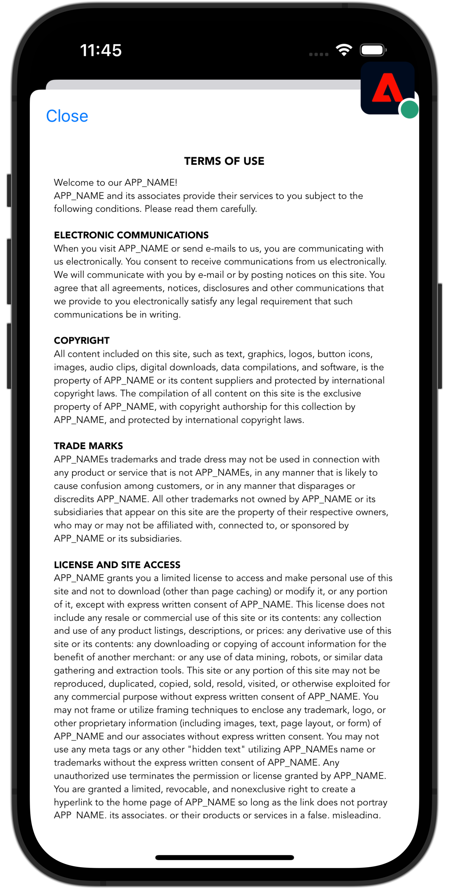
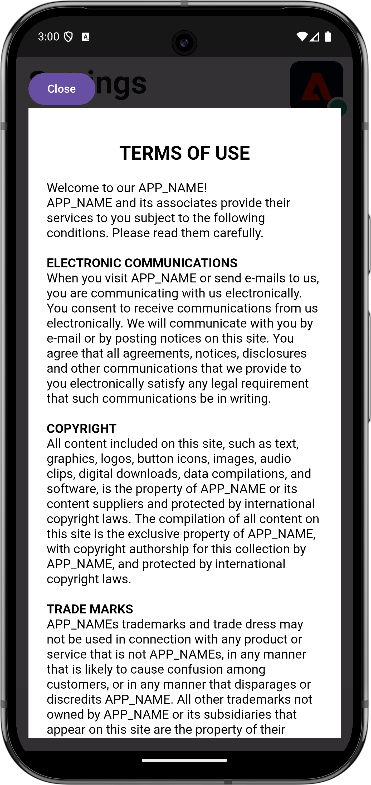

# Web ビューの処理

モバイルアプリで WebView を使用してデータ収集を処理する方法を説明します。

## 前提条件

* SDK がインストールおよび設定された状態で、アプリケーションが正常に構築および実行されました。

## 学習目標

このレッスンでは、次の操作を行います。

* アプリの web ビューに関して特別に考慮する必要がある理由を理解します。
* トラッキングの問題を防ぐために必要なコードを理解します。

## 潜在的なトラッキングの問題

個別（Experience Cloud ID）の ECID は、アプリのネイティブ部分と、アプリ内の WebView からデータを送信する際に生成されます。 これらの別々の ECID により、ヒットが切断され、訪問および訪問者データが水増しされます。 ECID について詳しくは、[ECID の概要 ](https://experienceleague.adobe.com/en/docs/experience-platform/identity/features/ecid) を参照してください。

切断されたヒットと水増しされたデータを解決するには、アプリのネイティブ部分から、アプリで使用する可能性のある WebView にユーザーの ECID を渡す必要があります。

WebView 内で使用されるAEP Edge ID 拡張機能は、現在の ECID を収集し、新しい ID のリクエストをAdobeに送信する代わりに URL に追加します。 次に、実装はこの ECID を使用して URL をリクエストします。

## 実装

Web 表示を実装するには：

>[!BEGINTABS]

>[!TAB iOS]

**[!DNL Luma]**/**[!DNL Luma]**/**[!DNL Views]**/**[!DNL Info]**/**[!DNL TermsOfServiceSheet]** に移動し、`func loadUrl()` クラス内の `final class SwiftUIWebViewModel: ObservableObject` 関数を探します。 Web ビューを処理する次の呼び出しを追加します。

```swift
// Handle web view
AEPEdgeIdentity.Identity.getUrlVariables {(urlVariables, error) in
    if let error = error {
        print("Error with Webview", error)
        return;
    }
    
    if let urlVariables: String = urlVariables {
        urlString.append("?" + urlVariables)
        guard let url = URL(string: urlString) else {
            return
        }
        DispatchQueue.main.async {
            self.webView.load(URLRequest(url: url))
        }
    }
    Logger.aepMobileSDK.info("Successfully retrieved urlVariables for WebView, final URL: \(urlString)")
}
```

[`AEPEdgeIdentity.Identity.getUrlVariables`](https://developer.adobe.com/client-sdks/documentation/identity-for-edge-network/api-reference/#geturlvariables) API は、ECID などのすべての関連情報を含むように URL の変数を設定します。 この例では、ローカルファイルを使用していますが、同じ概念がリモートページにも適用されます。

`Identity.getUrlVariables` API について詳しくは、[Edge Network拡張機能 API リファレンスガイド ](https://developer.adobe.com/client-sdks/documentation/identity-for-edge-network/api-reference/#geturlvariables) を参照してください。


>[!TAB Android]

**[!UICONTROL Android]** /**[!DNL app]**/**[!DNL kotlin+java]**/**[!DNL com.adobe.luma.tutorial.android]**/**[!DNL views]**/**[!DNL WebViewModel]** に移動し、`fun loadUrl()` で `class WebViewModel: ViewModel()` 関数を探します。 Web ビューを処理する次の呼び出しを追加します。

```kotlin
// Handle web view
Identity.getUrlVariables {
    urlVariables = it
    val baseUrl = getHtmlFileUrl("tou.html")

    val finalUrl = if (urlVariables.isNotEmpty()) {
        "$baseUrl?$urlVariables"
    } else {
        baseUrl
    }

    Handler(Looper.getMainLooper()).post {
        webView.loadUrl(finalUrl)
    }
    MobileSDK.shared.logInfo("TermsOfServiceSheet - loadUrl: Successfully loaded WebView with URL: $finalUrl")
}
```

[`Identity.getUrlVariables`](https://developer.adobe.com/client-sdks/documentation/identity-for-edge-network/api-reference/#geturlvariables) API は、ECID などのすべての関連情報を含むように URL の変数を設定します。 この例では、ローカルファイルを使用していますが、同じ概念がリモートページにも適用されます。

`Identity.getUrlVariables` API について詳しくは、[Edge Network拡張機能 API リファレンスガイド ](https://developer.adobe.com/client-sdks/documentation/identity-for-edge-network/api-reference/#geturlvariables) を参照してください。

>[!ENDTABS]

## アプリでの検証

コードを実行するには：

1. [ 設定手順 ](assurance.md#connecting-to-a-session) の節を参照して、シミュレーターまたはデバイスをAssuranceに接続します。
1. アプリの **[!UICONTROL 設定]** に移動します
1. 「**[!DNL View...]**」ボタンをタップして **[!DNL Terms of Use]** を表示します。

>[!BEGINTABS]

>[!TAB iOS]

 

>[!TAB Android]

 

>[!ENDTABS]


## Assurance での検証

1. Assurance UI で、{com.adobe.griffon.mobile **[!UICONTROL ベンダーの {0]** Edge ID 応答 URL 変数 **[!UICONTROL イベントを探します。]**
1. イベントを選択し、**[!UICONTROL ACPExtensionEventData]** オブジェクトの **[!UICONTROL urlvariable]** フィールドを確認し、URL に `adobe_mc`、`mcmid` および `mcorgid` のパラメーターが存在することを確認します。

   {zoomable="yes"}

   `urvariables` フィールドの例を以下に示します。

   * オリジナル （エスケープ文字付き）

     ```html
     adobe_mc=TS%3D1636526122%7CMCMID%3D79076670946787530005526183384271520749%7CMCORGID%3D7ABB3E6A5A7491460A495D61%40AdobeOrg
     ```

   * 美しい

     ```html
     adobe_mc=TS=1636526122|MCMID=79076670946787530005526183384271520749|MCORGID=7ABB3E6A5A7491460A495D61@AdobeOrg
     ```

残念ながら、web セッションのデバッグには制限があります。 例えば、ブラウザーでAdobe Experience Platform Debuggerを使用して webview セッションのデバッグを続行することはできません。

>[!NOTE]
>
>これらの URL パラメーターを使用した訪問者のステッチは、Platform Web SDK（バージョン 2.11.0 以降）および `VisitorAPI.js` の使用時にサポートされます。


>[!SUCCESS]
>
>これで、Adobe Experience Platform Mobile SDKで既に発行されている ECID と同じ ECID を使用して、Web ビュー内の URL に基づいたコンテンツを表示するように、アプリを設定しました。
>
>Adobe Experience Platform Mobile SDKの学習にご協力いただき、ありがとうございます。 ご不明な点がある場合や、一般的なフィードバックをお寄せになる場合、または今後のコンテンツに関するご提案がある場合は、この [Experience League Community Discussion の投稿でお知らせください ](https://experienceleaguecommunities.adobe.com/t5/adobe-experience-platform-data/tutorial-discussion-implement-adobe-experience-cloud-in-mobile/td-p/443796)

次のトピック：**[ID](identity.md)**
