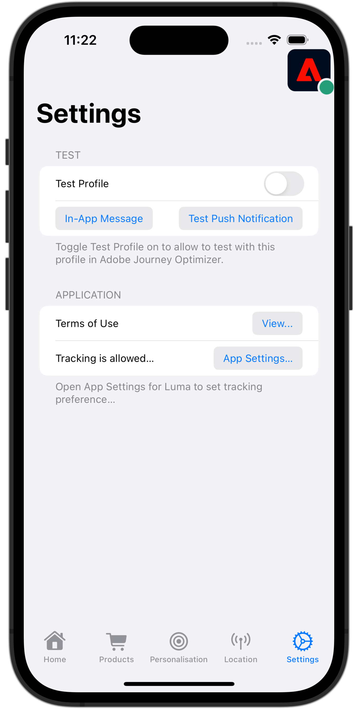

# Web ビューの処理

モバイルアプリで WebView を使用してデータ収集を処理する方法を説明します。

## 前提条件

* SDK がインストールおよび設定された状態で、アプリケーションが正常に構築および実行されました。

## 学習目標

このレッスンでは、次の操作を行います。

* アプリの web ビューに関して特別に考慮する必要がある理由を理解します。
* トラッキングの問題を防ぐために必要なコードを理解します。

## 潜在的なトラッキングの問題

アプリのネイティブ部分とアプリ内の WebView からデータを送信すると、それぞれが独自のExperience CloudID （ECID）を生成し、その結果、切断されたヒットと水増しされた訪問/訪問者データが生じます。 ECID について詳しくは、[ECID の概要 ](https://experienceleague.adobe.com/docs/experience-platform/identity/ecid.html?lang=en) を参照してください。

この望ましくない状況を解決するには、アプリのネイティブ部分から、アプリで使用する可能性のある WebView にユーザーの ECID を渡すことが重要です。

WebView 内で使用される AEP Edge ID 拡張機能は、新しい ID のリクエストをAdobeに送る代わりに、現在の ECID を収集して URL に追加します。 次に、実装はこの ECID を使用して URL をリクエストします。

## 実装

**[!DNL Luma]**/**[!DNL Luma]**/**[!DNL Views]**/**[!DNL Info]**/**[!DNL TermsOfServiceSheet]** に移動し、`final class SwiftUIWebViewModel: ObservableObject` クラス内の `func loadUrl()` 関数を探します。 Web ビューを処理する次の呼び出しを追加します。

```swift
// Handle web view
AEPEdgeIdentity.Identity.getUrlVariables {(urlVariables, error) in
    if let error = error {
        print("Error with Webview", error)
        return;
    }
    
    if let urlVariables: String = urlVariables {
        urlString.append("?" + urlVariables)
        guard let url = URL(string: urlString) else {
            return
        }
        DispatchQueue.main.async {
            self.webView.load(URLRequest(url: url))
        }
    }
    Logger.aepMobileSDK.info("Successfully retrieved urlVariables for WebView, final URL: \(urlString)")
}
```

[`AEPEdgeIdentity.Identity.getUrlVariables`](https://developer.adobe.com/client-sdks/documentation/identity-for-edge-network/api-reference/#geturlvariables) API は、ECID などのすべての関連情報を含むように URL の変数を設定します。 この例では、ローカルファイルを使用していますが、同じ概念がリモートページにも適用されます。

`Identity.getUrlVariables` API について詳しくは、[Edge Network拡張機能 API リファレンスガイド ](https://developer.adobe.com/client-sdks/documentation/identity-for-edge-network/api-reference/#geturlvariables) を参照してください。

## 検証

コードを実行するには：

1. シミュレーターまたはデバイスを Assurance に接続するには、「[ 設定手順 ](assurance.md#connecting-to-a-session)」セクションを確認してください。
1. アプリの **[!UICONTROL 設定]** に移動します
1. 「**[!DNL View...]**」ボタンをタップして **[!DNL Terms of Use]** を表示します。

    

1. Assurance UI で、&lbrace;com.adobe.griffon.mobile **ベンダーの &lbrace;0**&#x200B;[!UICONTROL &#x200B; Edge Identity Response URL Variables &#x200B;]&#x200B;**イベントを探します。**
1. イベントを選択し、**[!UICONTROL ACPExtensionEventData]** オブジェクトの **[!UICONTROL urlvariable]** フィールドを確認し、URL に `adobe_mc`、`mcmid` および `mcorgid` のパラメーターが存在することを確認します。

   

   `urvariables` フィールドの例を以下に示します。

   * オリジナル （エスケープ文字付き）

     ```html
     adobe_mc=TS%3D1636526122%7CMCMID%3D79076670946787530005526183384271520749%7CMCORGID%3D7ABB3E6A5A7491460A495D61%40AdobeOrg
     ```

   * 美しい

     ```html
     adobe_mc=TS=1636526122|MCMID=79076670946787530005526183384271520749|MCORGID=7ABB3E6A5A7491460A495D61@AdobeOrg
     ```

残念ながら、web セッションのデバッグには制限があります。 例えば、ブラウザーでAdobe Experience Platform Debuggerーを使用して webview セッションのデバッグを続行することはできません。

>[!NOTE]
>
>これらの URL パラメーターを使用した訪問者のステッチは、Platform Web SDK （バージョン 2.11.0 以降）および `VisitorAPI.js` の使用時にサポートされます。


>[!SUCCESS]
>
>これで、Adobe Experience Platform Mobile SDK で既に発行されている ECID と同じ ECID を使用して、Web ビューの URL に基づいたコンテンツを表示するようにアプリを設定しました。
>
>Adobe Experience Platform Mobile SDK の学習に時間を費やしていただき、ありがとうございます。 ご不明な点がある場合や、一般的なフィードバックをお寄せになる場合、または今後のコンテンツに関するご提案がある場合は、この [Experience League コミュニティ ディスカッションの投稿でお知らせください ](https://experienceleaguecommunities.adobe.com/t5/adobe-experience-platform-data/tutorial-discussion-implement-adobe-experience-cloud-in-mobile/td-p/443796)

次のトピック：**[ID](identity.md)**
