# 1.1.1 Agent Orchestratorの概要

## ビデオ

このビデオでは、この演習に関連するすべての手順の説明とデモを行います。

>[!VIDEO](https://video.tv.adobe.com/v/3477257?quality=12&learn=on)

## Agent Orchestratorの1.1.1.1 Set Context

[https://experience.adobe.com/#/@experienceplatform/ai-assistant/chat](https://experience.adobe.com/#/@experienceplatform/ai-assistant/chat)に移動します。

そうすると、これが表示されます。 組織&#x200B;**Experience Platform インターナショナル**&#x200B;にいることを確認してください。

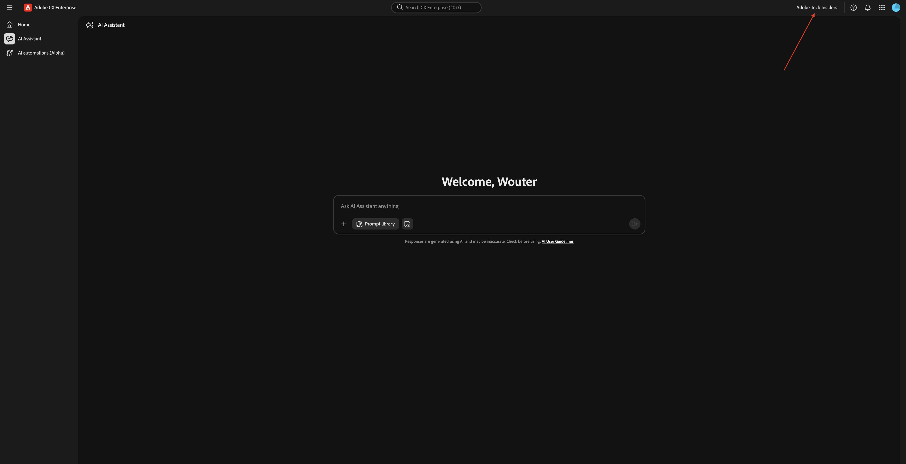

**context** ウィンドウをクリックします。

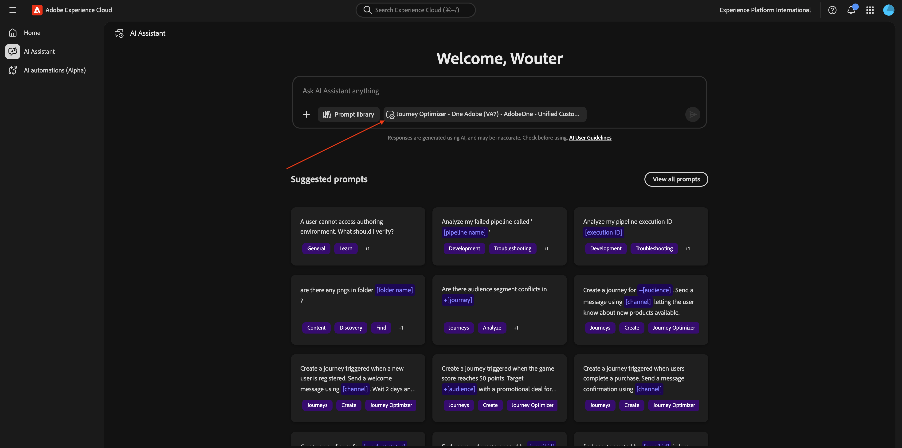

コンテキストを次のように設定します。

- **ドキュメント Source**: **Journey Optimizer**

Documentation Source設定を使用すると、製品情報/Experience Leagueに関連する質問を確認するExperience League ドキュメントのセットを優先できます。

- **サンドボックス**: **製品 – 高速化（VA7）**

サンドボックス設定は、質問を行う際にAI アシスタントがどのサンドボックスを確認すべきかを特定するのに役立ちます。

- **データビュー**: **Accelerate 2026 B2C**

データビュー設定は、質問を行う際にAI アシスタントが参照するデータビューを特定するのに役立ちます。

「**コンテキストを設定**」をクリックします。

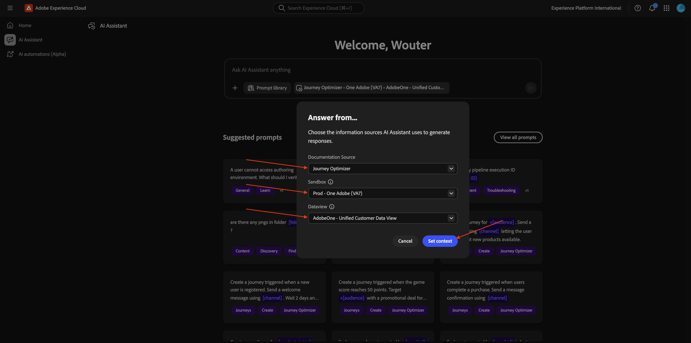

## 1.1.1.2最初に全体的な購入傾向を把握して、コンテキストを固定し、ファイバーにズームインします

**インテント**

モバイル、固定電話、インターネット、テレビ、ファイバーなど、過去60日間のカテゴリー別需要を詳細に把握できます。 これにより、ニューヨークのロールアウト後の季節性、プロモ – ション効果、地域のバリエーションのベースラインを設定できます。

次の&#x200B;**プロンプト**&#x200B;を入力し、**送信** ボタンをクリックします。

```javascript
Show me purchases by mainCategory over the last 2 months.
```


次の画面が表示されます。

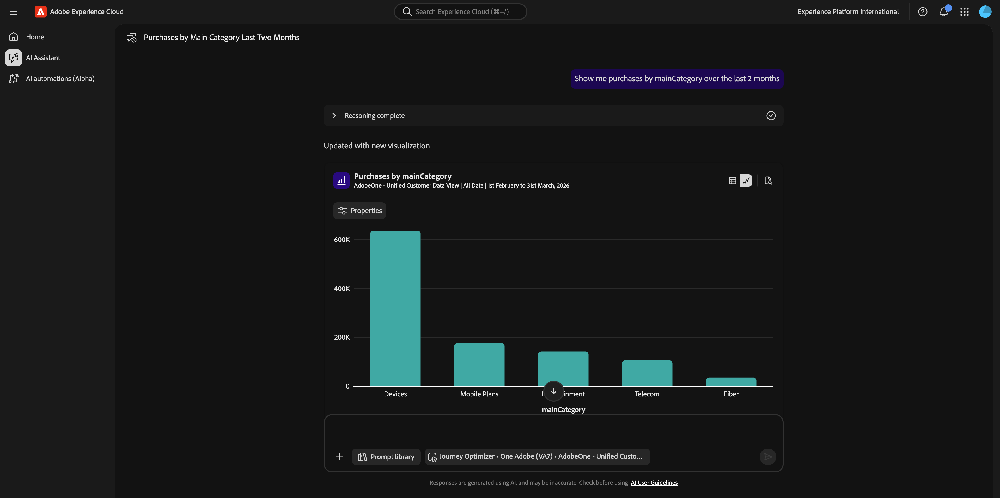

次の&#x200B;**プロンプト**&#x200B;を入力し、**送信** ボタンをクリックします。

```javascript
Show me purchases by mainCategory = Fiber over the last 2 months per week
```


次に、これが表示され、ファイバー固有の傾向をドリルダウンします。


## 1.1.1.3注文をコンテンツ設定と関連付ける

**インテント**

特定のジャンル（SciFi、スポーツ、ドラマなど）に対する嗜好が、ブロードバンドのアップグレード行動、特に高帯域幅のニーズを予測するという仮説をテストします。

まず、ジャンルの環境設定を保存するために使用されるフィールドを見つける必要があります。

次の&#x200B;**プロンプト**&#x200B;を入力し、**送信** ボタンをクリックします。

```javascript
Which field is used to store the preferred genre?
```

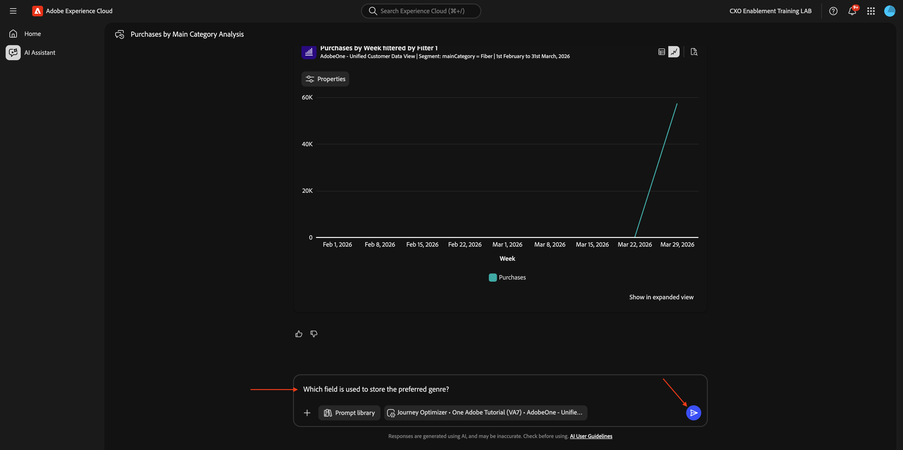

次に、このフィールドが表示されます。これは、ジャンルに使用されるフィールドが&#x200B;**_experienceplatform.individualCharacteristics.preferences.preferredGenre**&#x200B;であることを示しています。

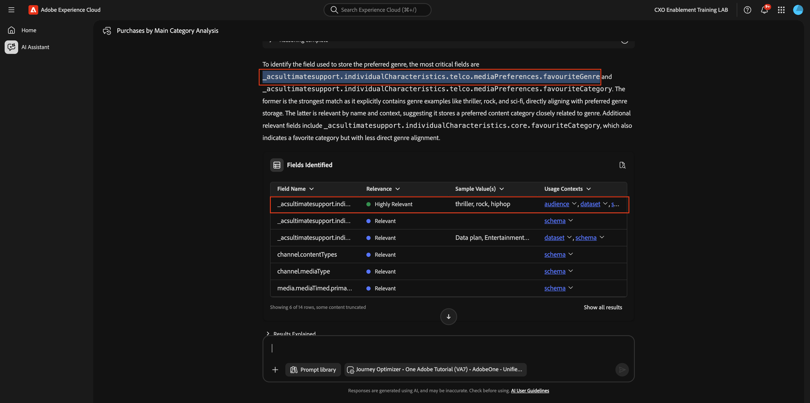

この情報があれば、購入データをドリルダウンできます。

次の&#x200B;**プロンプト**&#x200B;を入力し、**送信** ボタンをクリックします。

```javascript
Show me ordersYTD by preferredGenre for the last 2 months
```

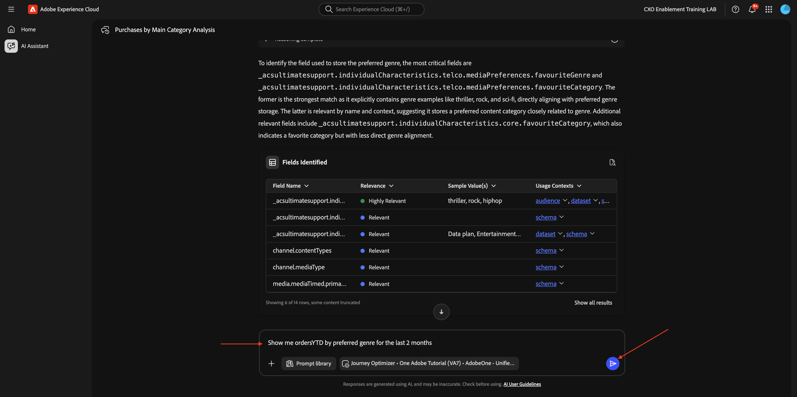

そうすると、これが表示されます。 「**推論完了**」ブロックのアイコンをクリックして、Agent Orchestratorの舞台裏で何が起こっているのかを把握します。


同様の説明が表示されます。

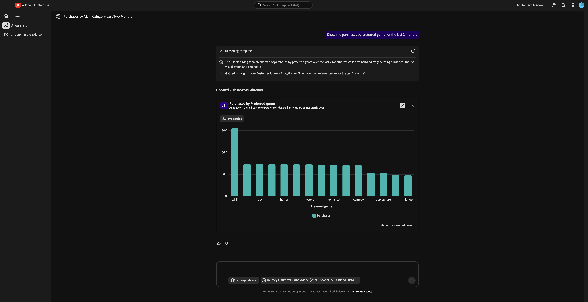

## 1.1.1.4既存のファイバージャーニーの特定

**インテント**

アクティブなジャーニーまたは最近完了したジャーニーのタイトルに「Fiber」が含まれていることを確認します（例：「Fiber Upgrade NYC - Sept」、「Fiber Trial - Streaming Bundle」）。

次の&#x200B;**プロンプト**&#x200B;を入力し、**送信** ボタンをクリックします。

```javascript
What journeys exist? 
```

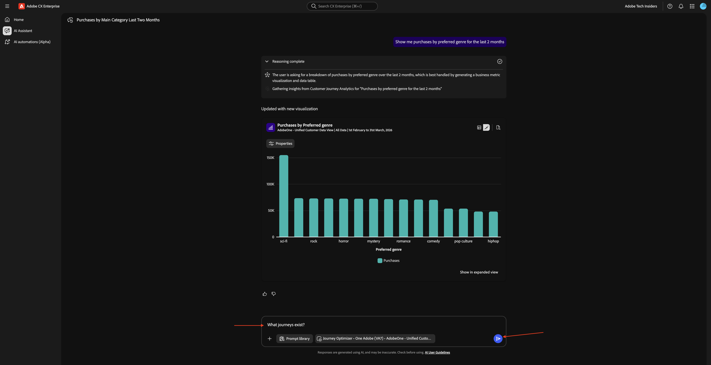

そうすると、これが表示されます。 **詳細を表示**&#x200B;をクリックします。


アクティブなジャーニーまたは過去のジャーニーのリストが表示されます。 これらのジャーニーのリストをダウンロードするには、**ダウンロード** アイコンをクリックします。


これにより、AI アシスタントからのすべての出力を含むCSV ファイルが生成されます。


クリックして右側のペインを閉じます。 次の&#x200B;**プロンプト**&#x200B;を入力し、**送信** ボタンをクリックします。

```javascript
Which of these journeys has 'Fiber' in its name?
```

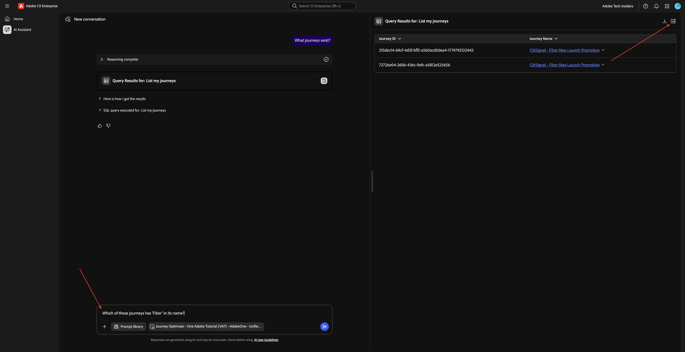

そうすると、これが表示されます。 ジャーニーの1つのリンクをクリックし、**ジャーニーの詳細**&#x200B;を選択します。

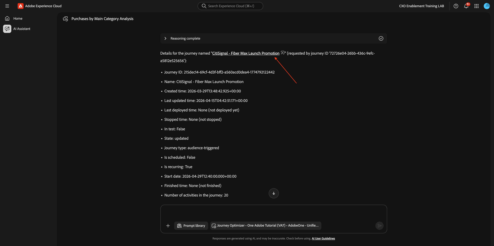

新しいウィンドウが開き、すぐにジャーニーの詳細ページが表示されます。

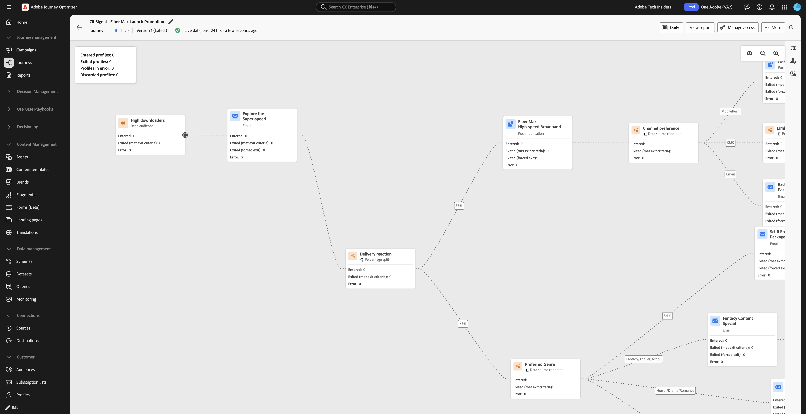

## 1.1.1.5使用されているオーディエンスを確認してください

**インテント**:

「CitiSignal - Fiber Max Launch Promotion」ジャーニーのシード定義を理解します。どのような特性がターゲティングを促進したのか（「SciFi Genre Preference」、「4+ デバイス」、「stream ≥ 300 GB/month」など）。

次の&#x200B;**プロンプト**&#x200B;を入力します。

```javascript
What was the initial audience in the journey named 
```

次に、`+CitiSignal fib`を手動で入力して、オートコンプリートを有効にします。 ジャーニー&#x200B;**CitiSignal - Fiber Max Launch Promotion**&#x200B;を選択します。

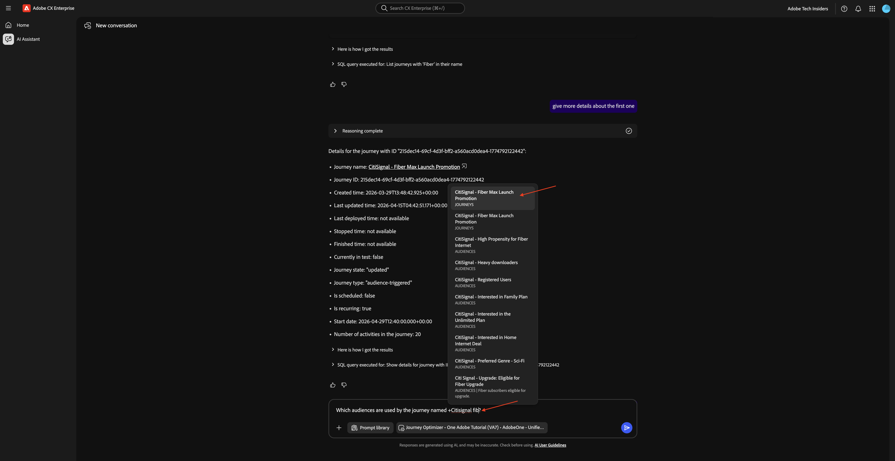

そうすると、これが表示されます。 「**送信**」ボタンをクリックします。


そうすると、これが表示されます。

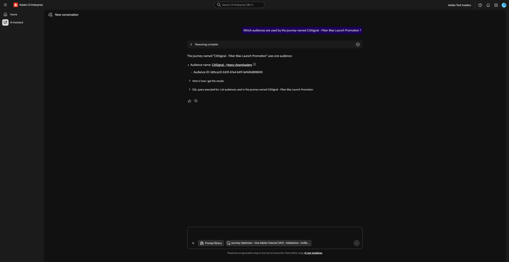

## 1.1.1.6 フォールアウト分析によるジャーニーのパフォーマンスの検証

**インテント**

ジャーニーのパフォーマンスのフォールアウトを把握して、ジャーニー内で多数のプロファイルがドロップされているノードや条件があるかどうかを確認します。 これは、ジャーニーで追加の調整が必要かどうかを把握するのに役立ちます。

次の&#x200B;**プロンプト**&#x200B;を入力し、**送信** ボタンをクリックします。

```javascript
Create a fall-out report on the "CitiSignal - Fiber Max Launch Promotion" journey
```

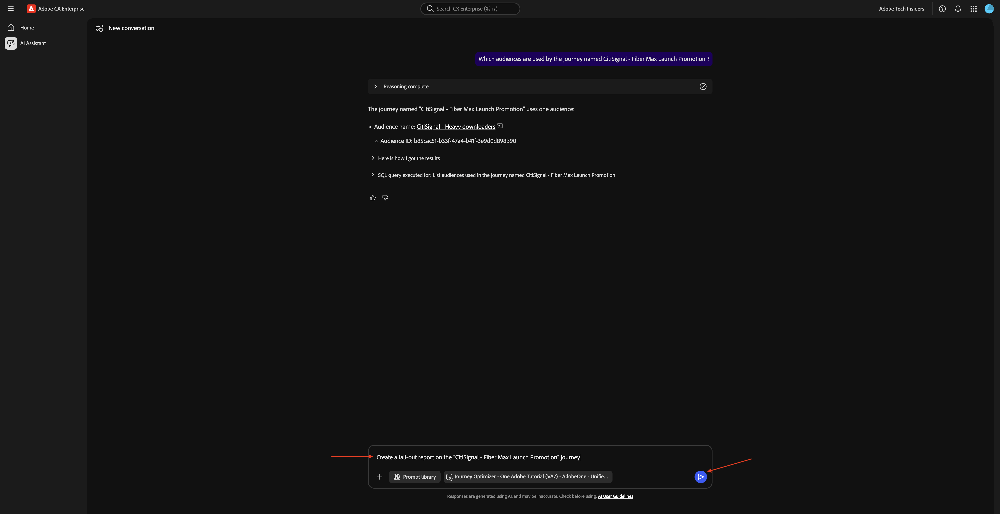

そうすると、これが表示されます。


少し下にスクロールします。 各ノードとそれぞれの入力ノードの数値、フォールアウト数、フォールアウト率を調べることで、テーブルを確認できるようになりました。

AI アシスタントが観察とレコメンデーションを提供します。

文章「**」をクリックすると、結果が表示されます**。

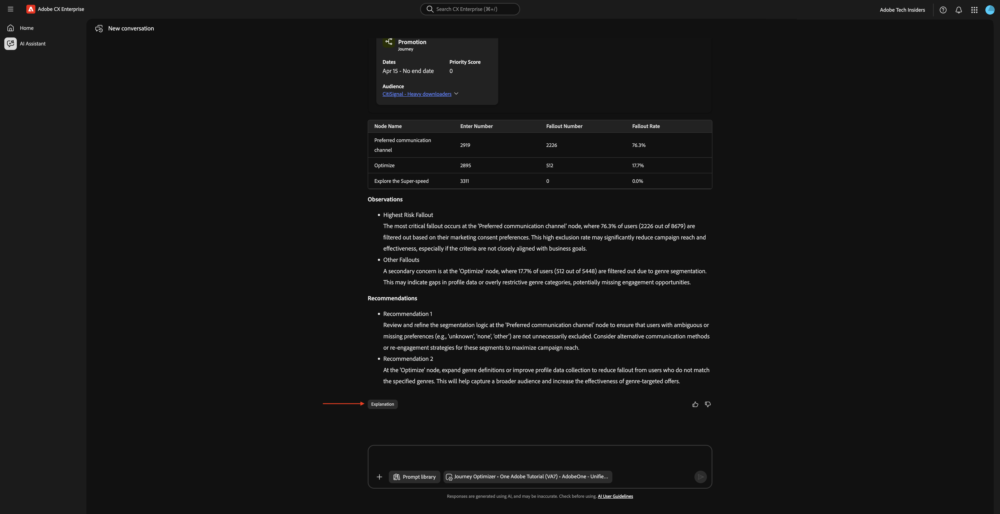

そして、その後に続くステップと、AI アシスタントが表示されて結果が得られます。

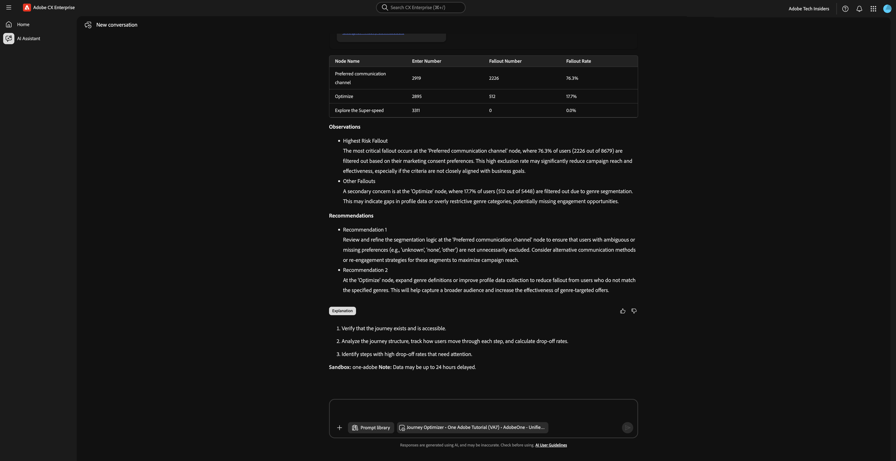

## 1.1.1.7新しいオーディエンスを作成

**インテント**

以上の調査結果と調査を踏まえると、データを多く消費する顧客と、SFやファンタジーの好みのジャンルを持つ顧客との間には相関関係があります。 これらの属性をオーディエンスで組み合わせます。

次の&#x200B;**プロンプト**&#x200B;を入力し、**送信** ボタンをクリックします。

```javascript
Create an audience that combines people with an average download usage per month of over 2000 GB and a preferred genre of sci-fi or fantasy.
```

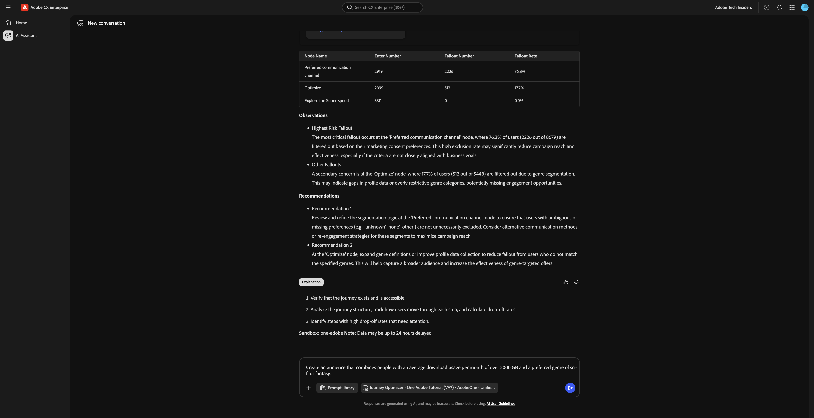

計画の見直し： `yes`と入力し、**send**&#x200B;をクリックします。

>[!NOTE]
>
>このプランは、システム内のリファレンスガイドに基づいて生成されます。 顧客は最終的にはプランをカスタマイズし、独自のプランを追加することができますが、今のところは静的です。

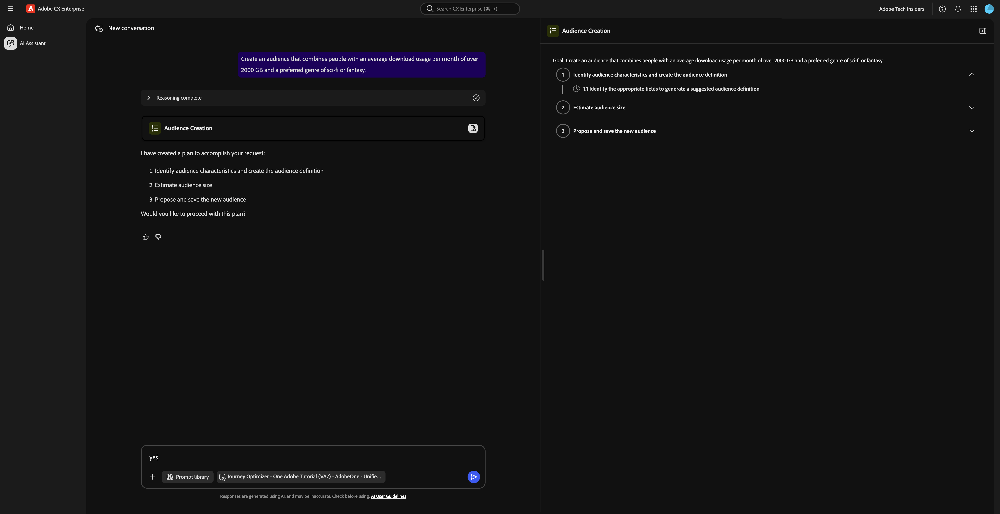

セグメントクエリ式を確認します。 `yes`と入力し、**送信** ボタンをクリックします。

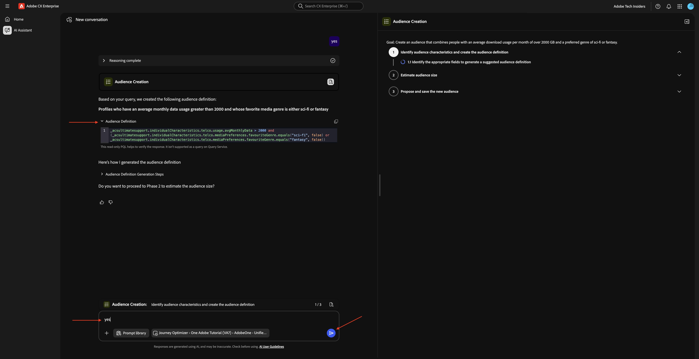

セグメントサイズの見積もりを確認しましょう。 `yes`と入力し、**送信** ボタンをクリックします。

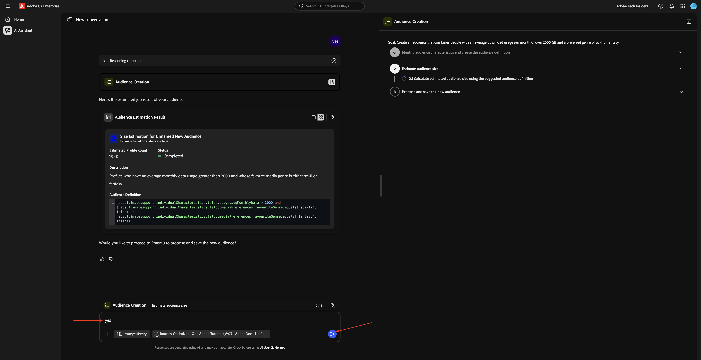

「**レビュー**」をクリックします。

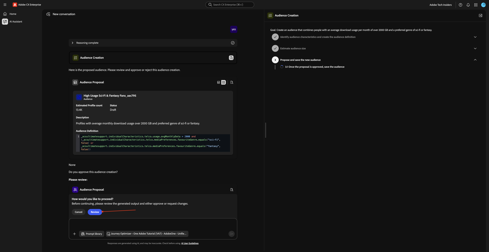

セグメント定義の見直し： 「**作成**」をクリックします。

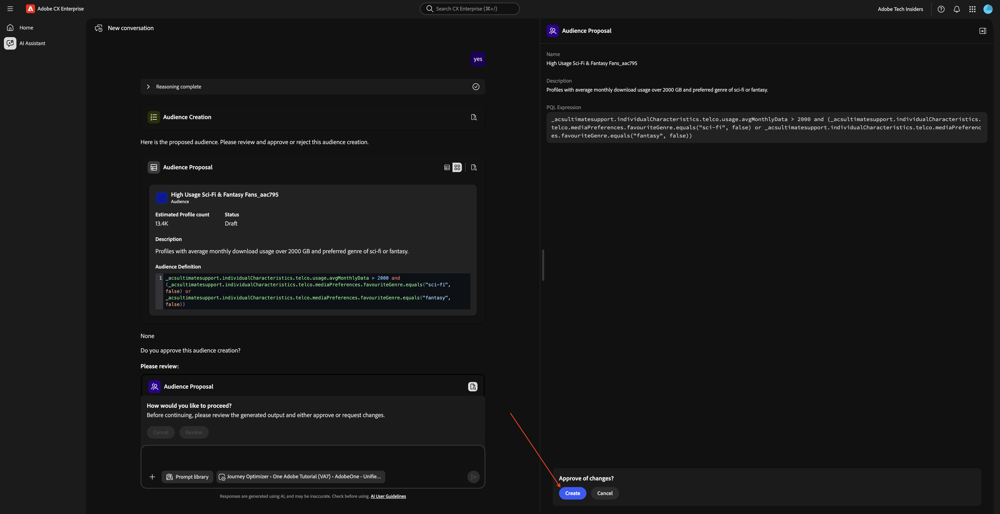

オーディエンスが作成されました。


>[!NOTE]
>
>新しいオーディエンスを作成する場合、オーディエンスをさらに活用するためにAI アシスタントが利用できるようになるまでに24時間かかります。

## 1.1.1.8使用率の高い既存オーディエンスを検索し、使用率が高いかどうかを確認します

**インテント**:

毎月のデータ使用しきい値で定義される「ヘビーダウンローダー」という名前のオーディエンスを探します。

>[!NOTE]
>
>新しいオーディエンスを作成した前の手順では、オーディエンスをさらに使用するためにAI アシスタントがオーディエンスを使用できるようになるまでに24時間かかることを覚えておいてください。 既存の別のオーディエンスを代わりに使用してください。

次の&#x200B;**プロンプト**&#x200B;を入力し、**送信** ボタンをクリックします。

```javascript
Is there an audience that has "heavy downloaders" in the title?
```


そうすると、これが表示されます。 これで、すべてのオーディエンスと、過去数日間でどれくらい変化したかを確認できます。

次の&#x200B;**プロンプト**&#x200B;を入力し、**送信** ボタンをクリックします。

```javascript
List how much these audiences changed over the last few days.
```


そうすると、これが表示されます。 **詳細を表示**&#x200B;をクリックします。


そうすると、これが表示されます。 クリックして右側のペインを閉じます。


少し下にスクロールして、AI アシスタントが実行したステップを確認します。


「ヘビーダウンローダー」には、すでに既存のオーディエンスがいくつかあります。 既に使っているかどうか見てみましょう。

次の&#x200B;**プロンプト**&#x200B;を入力し、**送信** ボタンをクリックします。

```javascript
Which of the above are used in a journey? 
```


次に、同様のものが表示されます。

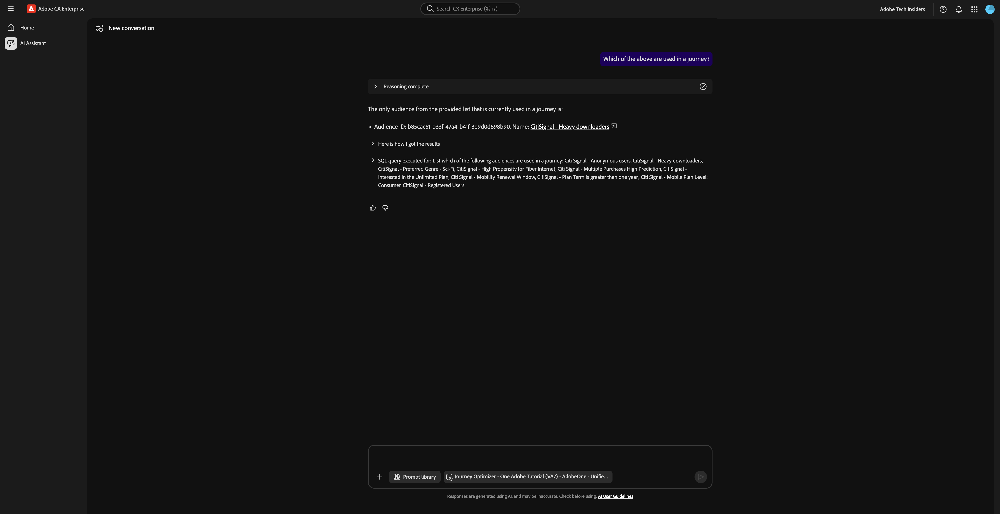

ここで、そのジャーニーがアクティブかどうかを確認する必要があります。 次の&#x200B;**プロンプト**&#x200B;を入力し、**送信** ボタンをクリックします。

```javascript
Are these journeys active? 
```

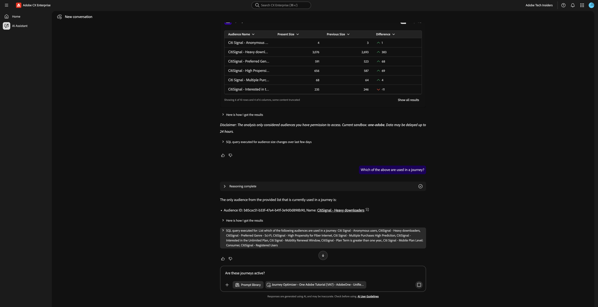

次に、同様のものが表示されます。 これらのジャーニーは現在実行中ではありません。


Fiber Maxの今後のローンチでは、新しいジャーニーを作成する必要があります。

## 1.1.1.9 Fiber Max Launchの新しいジャーニーを作成

**インテント**:

複合オーディエンスをターゲットとする新しいジャーニーを作成します。

ヘビーダウンローダー∩SciFi環境設定。

次の&#x200B;**プロンプト**&#x200B;を入力し、**送信** ボタンをクリックします。

```javascript
Create a  journey towards the audience Heavy Downloaders - Sci-Fi Preference_kbaa_5207bf. The journey is for the rollout of fiber broadband. There will 2 versions of an email  based on  a split of the audience based on who is in the "Eligble for Fiber upgrade" audience.  After 3 days, profiles from both email treatments who have not purchased fibre max will be sent a follow up email. 
```


そうすると、これが表示されます。 `yes`と入力し、「生成」をクリックします。


そうすると、これが表示されます。 `yes`と入力し、「生成」をクリックします。


そうすると、これが表示されます。 `The first one`と入力し、「送信」をクリックします。


そうすると、これが表示されます。 `yes`と入力し、「送信」をクリックします。


応答を確認します。 `yes`と入力し、「送信」をクリックします。


「**レビュー**」をクリックします。


ジャーニー名をLDAPで更新して、一意にします。 「**保存**」をクリックします。


これで、ジャーニーがドラフトモードで作成されました。

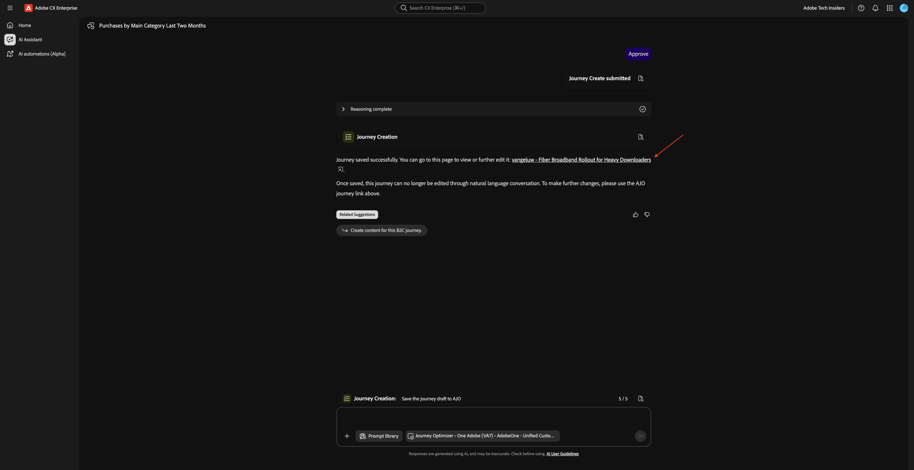

## 1.1.1.10件のジャーニーの競合管理

次の&#x200B;**プロンプト**&#x200B;を入力し、**送信** ボタンをクリックします。

```javascript
How can I manage journey conflicts?
```


情報の確認：


下にスクロールして「**ソース**」を選択し、Experience Leagueから取得されていることを確認します。

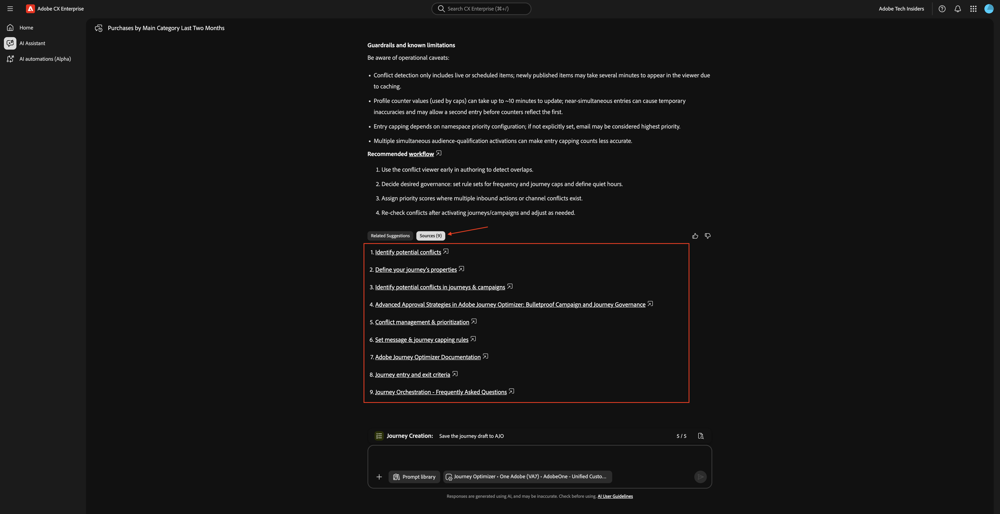

次の&#x200B;**プロンプト**&#x200B;を入力し、**送信** ボタンをクリックします。

```javascript
List any conflicts for the journey +CitiSignal Fiber Max
```

次に、リストからジャーニー&#x200B;**CitiSignal - Fiber Max Launch Promotion**&#x200B;を手動で選択します。


そうすると、これが表示されます。 **send**&#x200B;をクリックします。


ジャーニーの競合情報を確認します。


下にスクロールして、ジャーニーの競合の詳細を確認します。


## 1.1.1.11件の実験

次の&#x200B;**プロンプト**&#x200B;を入力し、**送信** ボタンをクリックします。

```javascript
How are the experiments performing for the journey named 'CitiSignal - Fiber Max Launch Promotion'?
```

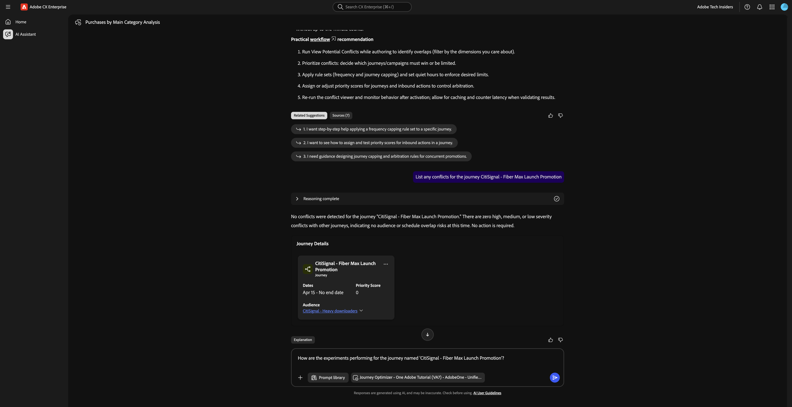

次の画面が表示されます。


下にスクロールして、候補の1つをクリックします。 **send**&#x200B;をクリックします。

>[!NOTE]
>
>提案は動的であるため、応答が生成されるたびに異なる提案が表示されることを想定しておく必要があります。 あなたの提案は、このスクリーンショットに示されている提案とは異なる可能性があります。


選択した提案に関連する詳細な回答が表示されます。

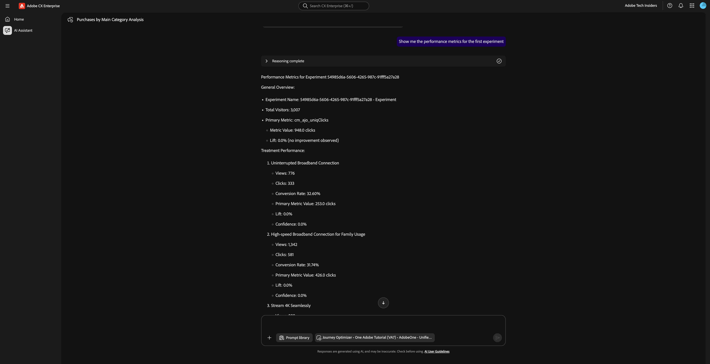

これで、このラボは完了しました。

## 次の手順

[ChatGPT Enterprise向けAdobe Marketing Agent](./ex2.md){target="_blank"}に移動

[Agent Orchestrator](./agentorchestrator.md){target="_blank"}に戻る

[すべてのモジュールに戻る](./../../../overview.md){target="_blank"}
