# 1.1.2 ChatGPT Enterprise用Adobe Marketing Agent

[!BADGE Beta]

+++Betaの詳細
お客様は、ChatGPT Enterprise Beta用Adobe Marketing Agentを使用することにより、Betaが一切の保証なしに「現状のまま」提供されることを了承するものとします。 Adobeは、Betaを維持、修正、更新、変更、その他の方法でサポートする義務を負いません。 このようなBetaおよび/または付随資料の正しい機能や性能に依存しないように、慎重に使用することをお勧めします。 BetaはAdobeの機密情報と見なされます。  お客様がアドビに提供するあらゆる「フィードバック」（ベータ版の使用中に発生した問題や欠陥、提案、改善、レコメンデーションを含むがこれに限定されないベータ版に関する情報）は、このようなフィードバックに含まれる、およびフィードバックに対するすべての権利、所有権、利益を含め、アドビに帰属します。

+++

## ビデオ

このビデオでは、この演習に関連するすべての手順の説明とデモを行います。

>[!VIDEO](https://video.tv.adobe.com/v/3478410?quality=12&learn=on)

## 1.1.2.1 ChatGPT Enterprise for Adobe Marketing Agentでカスタムアプリを作成

>[!NOTE]
>
>ChatGPTでAdobe Marketing Agentを使用するには、次の操作が必要です。
>- openAIのChatGPT Enterpriseの有料版
>- ChatGPT Enterprise web クライアントの使用

[https://chatgpt.com/](https://chatgpt.com/){target="_blank"}に移動し、アカウントの詳細を使用してログインします。 ログインしたら、これを確認してください。 ユーザー名をクリックします。


**設定**&#x200B;を選択します。

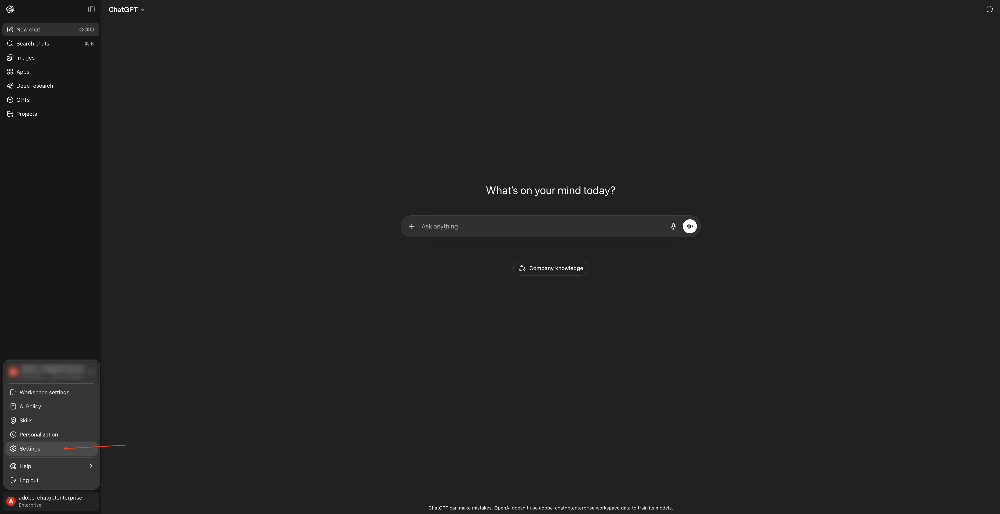

**アプリ**&#x200B;に移動し、**詳細設定**&#x200B;を選択します。


**開発者モード**&#x200B;をオンにして、**戻る**&#x200B;をクリックします。


「**アプリを作成**」をクリックします。


次のようにフィールドに入力します。

- **名前**: `Adobe Marketing Agent`
- **MCP Server URL**:Adobe担当者にお問い合わせください
- **認証**: `OAuth`

「**理解して続行したい**」のチェックボックスをオンにします。

「**作成**」をクリックします。

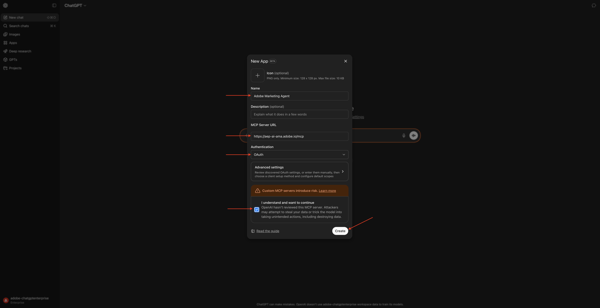

ChatGPTがAdobe アカウントへの接続を試みます。 「**アクセスを許可**」を選択すると、Adobe アカウントでログインする必要があります。


正常にログインすると、Adobe Marketing Agentが正常に接続されたことを確認できます。

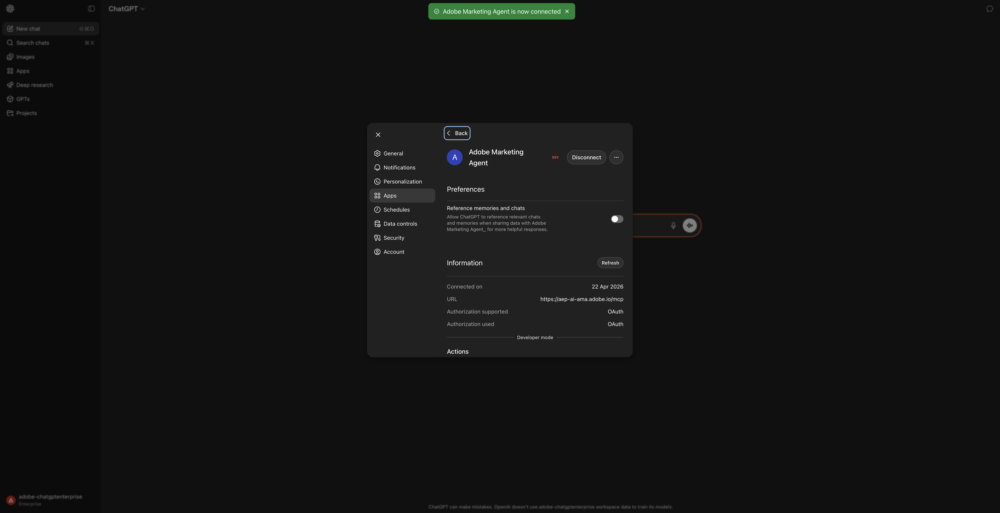

## 1.1.2.2 Adobe Marketing Agentでコンテキストを設定

このウィンドウを閉じます。


そうすると、これが表示されます。 **+** アイコンをクリックし、**詳細**&#x200B;に移動して、**Adobe Marketing Agent**&#x200B;を選択します。


ChatGPTを通じてAdobe Adobe Marketing Agentをさらに活用する前に、必要なコンテキストを設定します。

この演習では、コンテキストを次のように設定する必要があります。

- **サンドボックス**: **製品 – 高速化（VA7）**

サンドボックス設定は、質問を行う際にChatGPTがどのサンドボックスを参照すべきかを特定するのに役立ちます。

- **データビュー**: **Accelerate 2026 B2C**

データビュー設定は、質問を行う際にChatGPTがどのデータビューを参照すべきかを特定するのに役立ちます。

次の&#x200B;**プロンプト**&#x200B;を入力し、**送信** ボタンをクリックします。

```javascript
list sandboxes
```


使用可能なサンドボックスのリストが表示されます。 この例の現在のサンドボックスは&#x200B;**prod**&#x200B;に設定されています。

これを使用する必要のあるサンドボックスに変更するには、次の&#x200B;**プロンプト**&#x200B;を入力し、**送信** ボタンをクリックします。

```javascript
switch to sandbox accelerate
```


そうすると、これが表示されます。 「**Set Context**」をクリックします。

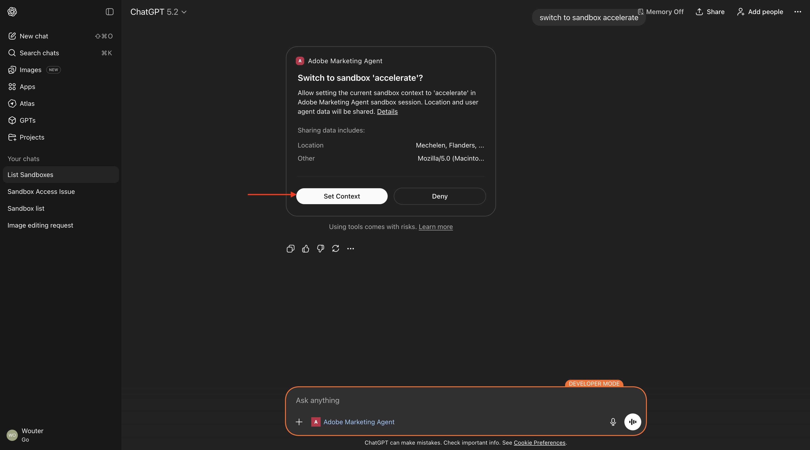

そうすると、これが表示されます。 次の&#x200B;**プロンプト**&#x200B;を入力し、**send** ボタンをクリックして、使用するデータビューを設定します。

```javascript
list dataviews
```

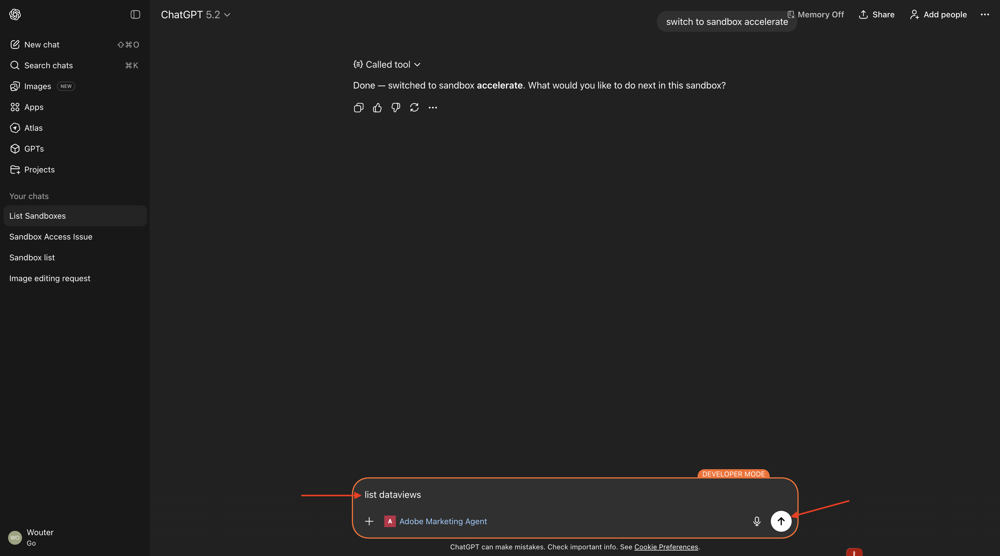

使用可能なデータビューのリストが表示されます。

使用する必要があるデータビューを設定するには、次の&#x200B;**プロンプト**&#x200B;を入力し、**送信** ボタンをクリックします。

```javascript
switch to Accelerate 2026 B2C
```

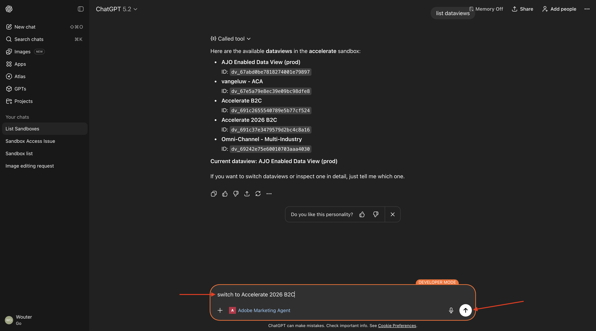

そうすると、これが表示されます。 「**Set Context**」をクリックします。

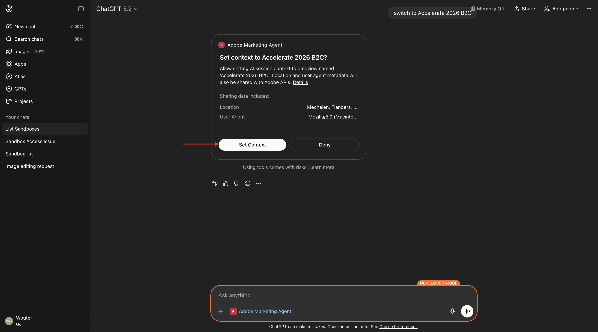

そうすると、これが表示されます。

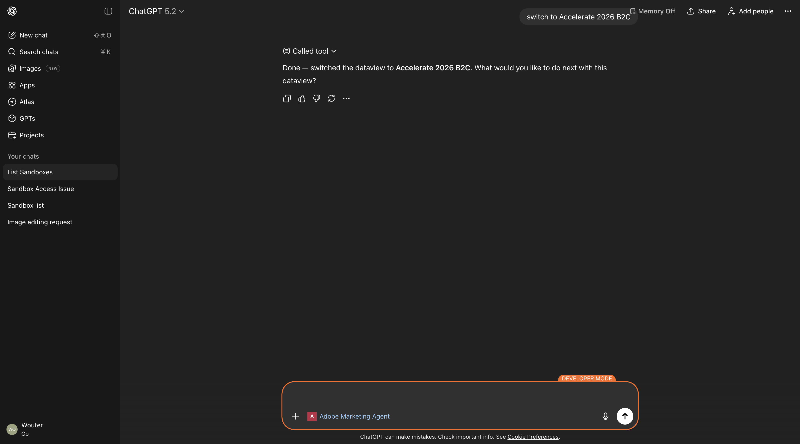

これでコンテキストがプロパティセットになったので、次に特定のプロンプトの送信を開始できます。

## 1.1.2.3最初に全体的な購入傾向を把握して、コンテキストを固定し、ファイバーにズームインします

**インテント**

モバイル、固定電話、インターネット、テレビ、ファイバーなど、過去60日間のカテゴリー別需要を詳細に把握できます。 これにより、ニューヨークのロールアウト後の季節性、プロモ – ション効果、地域のバリエーションのベースラインを設定できます。

次の&#x200B;**プロンプト**&#x200B;を入力し、**送信** ボタンをクリックします。

```javascript
Show me purchases by mainCategory over the last 7 months.
```

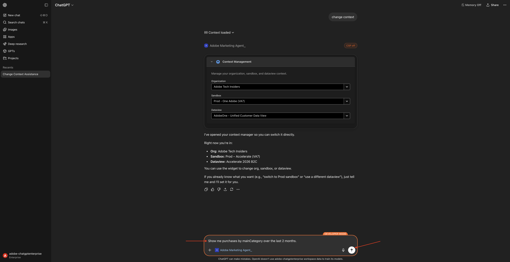

次の画面が表示されます。


次の&#x200B;**プロンプト**&#x200B;を入力し、**送信** ボタンをクリックします。

```javascript
Show me purchases by mainCategory = Fiber over the last 7 months per week
```


次に、これが表示され、ファイバー固有の傾向をドリルダウンします。


## 1.1.2.4注文をコンテンツ設定と関連付ける

**インテント**

特定のジャンル（SciFi、スポーツ、ドラマなど）に対する嗜好が、ブロードバンドのアップグレード行動、特に高帯域幅のニーズを予測するという仮説をテストします。

まず、ジャンルの環境設定を保存するために使用されるフィールドを見つける必要があります。

次の&#x200B;**プロンプト**&#x200B;を入力し、**送信** ボタンをクリックします。

```javascript
Which field is used to store the preferred genre in the sandbox accelerate?
```


次に、このフィールドが表示されます。これは、ジャンルに使用されるフィールドが&#x200B;**_experienceplatform.individualCharacteristics.preferences.preferredGenre**&#x200B;であることを示しています。


この情報があれば、購入データをドリルダウンできます。

次の&#x200B;**プロンプト**&#x200B;を入力し、**送信** ボタンをクリックします。

```javascript
Show me ordersYTD by preferredGenre for the last 7 months
```


そうすると、これが表示されます。 「**調査**」をクリックします。


そうすると、これが表示されます。

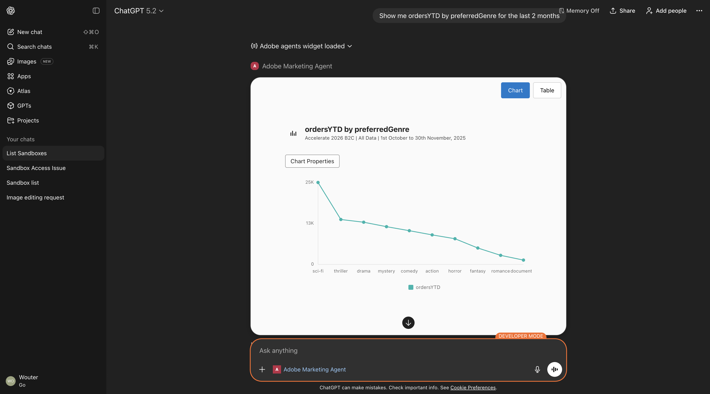

下にスクロールして詳細を表示します。

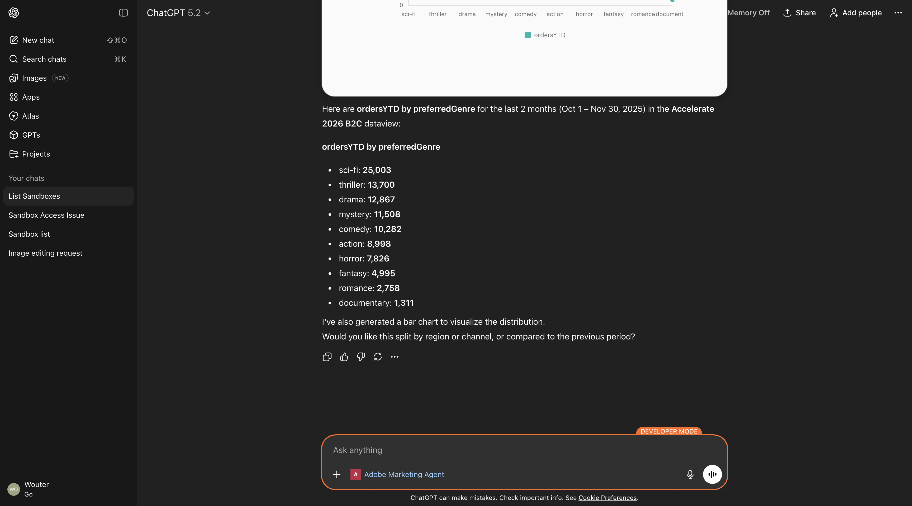

## 1.1.2.5既存のファイバージャーニーの特定

**インテント**

アクティブなジャーニーまたは最近完了したジャーニーのタイトルに「Fiber」が含まれていることを確認します（例：「Fiber Upgrade NYC - Sept」、「Fiber Trial - Streaming Bundle」）。

次の&#x200B;**プロンプト**&#x200B;を入力し、**送信** ボタンをクリックします。

```javascript
What journeys exist? 
```


そうすると、これが表示されます。 「**調査**」をクリックします。


そうすると、ジャーニーのリストが表示されます。

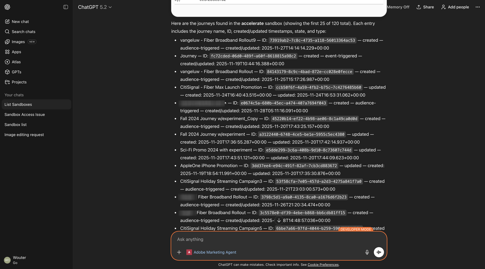

次の&#x200B;**プロンプト**&#x200B;を入力し、**送信** ボタンをクリックします。

```javascript
Which of these journeys has 'Fiber' in its name?
```


そうすると、これが表示されます。 「**調査**」をクリックします。

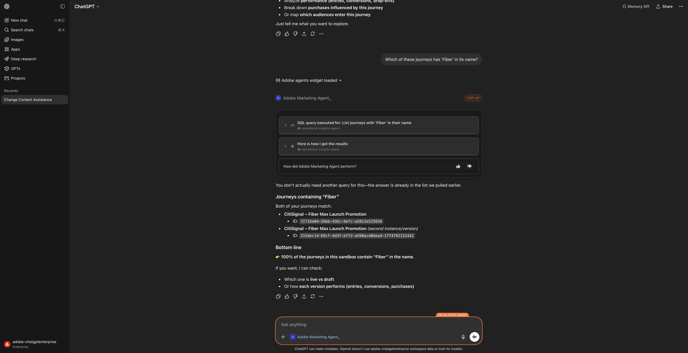

そうすると、これが表示されます。

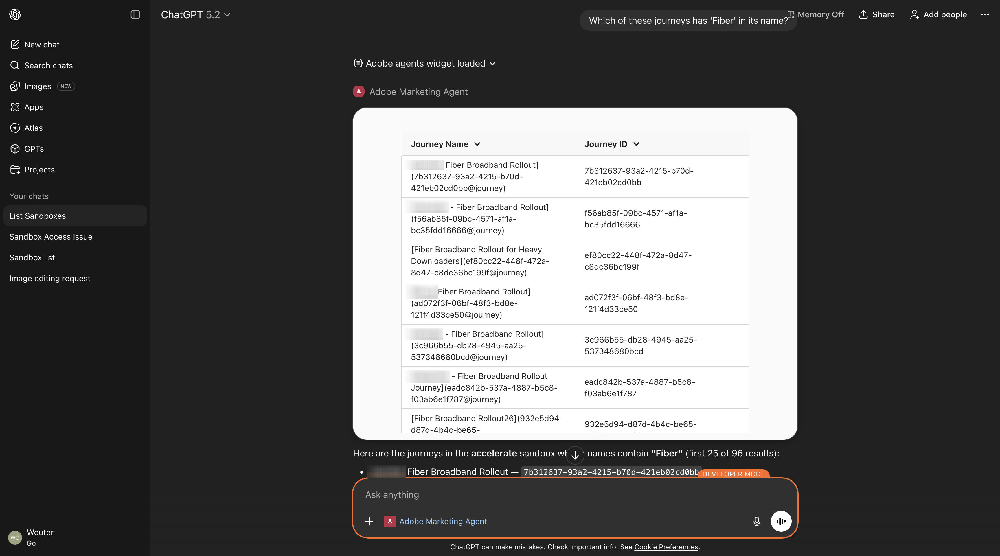

下にスクロールして詳細を表示します。

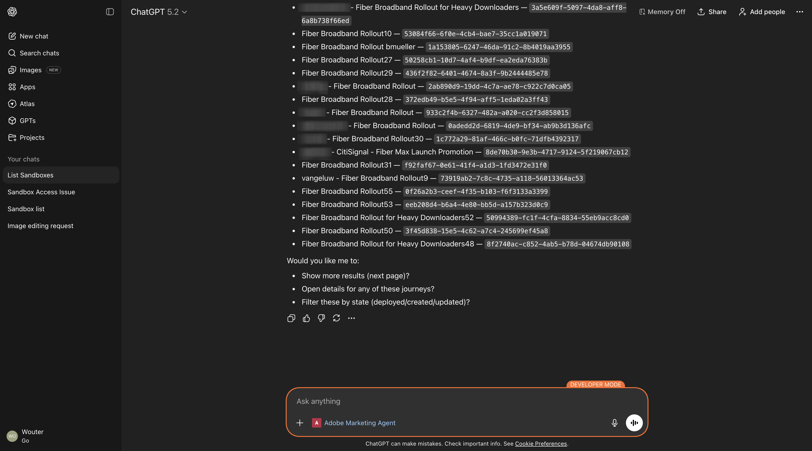

次の&#x200B;**プロンプト**&#x200B;を入力し、**送信** ボタンをクリックします。

```javascript
show me the details of the journey 'CitiSignal - Fiber Max Launch Promotion'
```

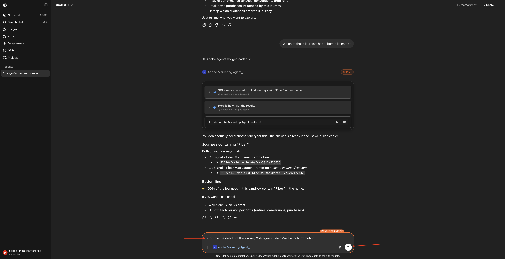

そうすると、これが表示されます。

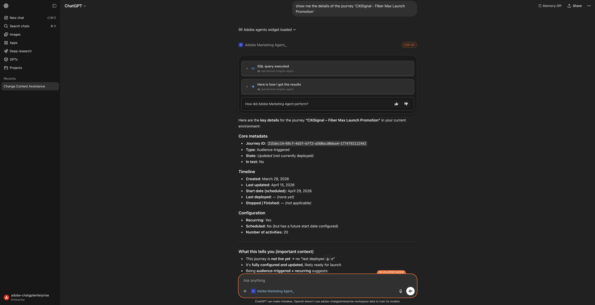

## 1.1.2.6 フォールアウト分析によるジャーニーのパフォーマンスの検証

**インテント**

ジャーニーのパフォーマンスのフォールアウトを把握して、ジャーニー内で多数のプロファイルがドロップされているノードや条件があるかどうかを確認します。 これは、ジャーニーで追加の調整が必要かどうかを把握するのに役立ちます。

次の&#x200B;**プロンプト**&#x200B;を入力し、**送信** ボタンをクリックします。

```javascript
Create a fall-out report on the "CitiSignal - Fiber Max Launch Promotion" journey
```


そうすると、これが表示されます。

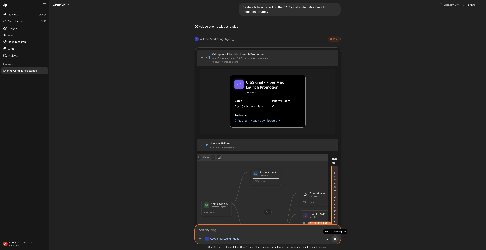

少し下にスクロールします。 各ノードとそれぞれの入力ノードの数値、フォールアウト数、フォールアウト率を調べることで、テーブルを確認できるようになりました。


もう少し下にスクロールして、観察と推奨事項を確認します。


これで、このラボは完了しました。

## 次の手順

[Adobe Marketing Agent for Microsoft 365 Copilot](./ex3.md){target="_blank"}に移動

[Agent Orchestrator](./agentorchestrator.md){target="_blank"}に戻る

[すべてのモジュールに戻る](./../../../overview.md){target="_blank"}
