# 1.1.3 Adobe Marketing Agent for Microsoft 365 Copilot

[!BADGE Beta]

+++Betaの詳細
Adobe Marketing AgentとMicrosoft 365 Copilot Betaを併用することにより、お客様は、Betaが何らの保証も受けることなく「現状のまま」提供されることを了承するものとします。 Adobeは、Betaを維持、修正、更新、変更、その他の方法でサポートする義務を負いません。 このようなBetaおよび/または付随資料の正しい機能や性能に依存しないように、慎重に使用することをお勧めします。 BetaはAdobeの機密情報と見なされます。  お客様がアドビに提供するあらゆる「フィードバック」（ベータ版の使用中に発生した問題や欠陥、提案、改善、レコメンデーションを含むがこれに限定されないベータ版に関する情報）は、このようなフィードバックに含まれる、およびフィードバックに対するすべての権利、所有権、利益を含め、アドビに帰属します。

+++

## 前提条件

このラボの手順に従うには、次のアクセスが必要です。

- Real-Time CDP、Journey Optimizer、Customer Journey Analyticsへのアクセス
- Adobe Experience CloudのAI アシスタントを利用すれば
- AEP Agent Orchestratorへのアクセス
- Microsoft 365 Copilot

## ビデオ

このビデオでは、この演習に関連するすべての手順の説明とデモを行います。

>[!VIDEO](https://video.tv.adobe.com/v/3479158?quality=12&learn=on)

## 1.1.3.1 Adobe Marketing AgentをMicrosoft 365 TeamsおよびCopilotに追加

Microsoft Teamsを開き、アカウントの詳細を使用してログインします。 ログインしたら、これを確認してください。

「**アプリ**」をクリックします。


**アプリの管理**&#x200B;を選択します。

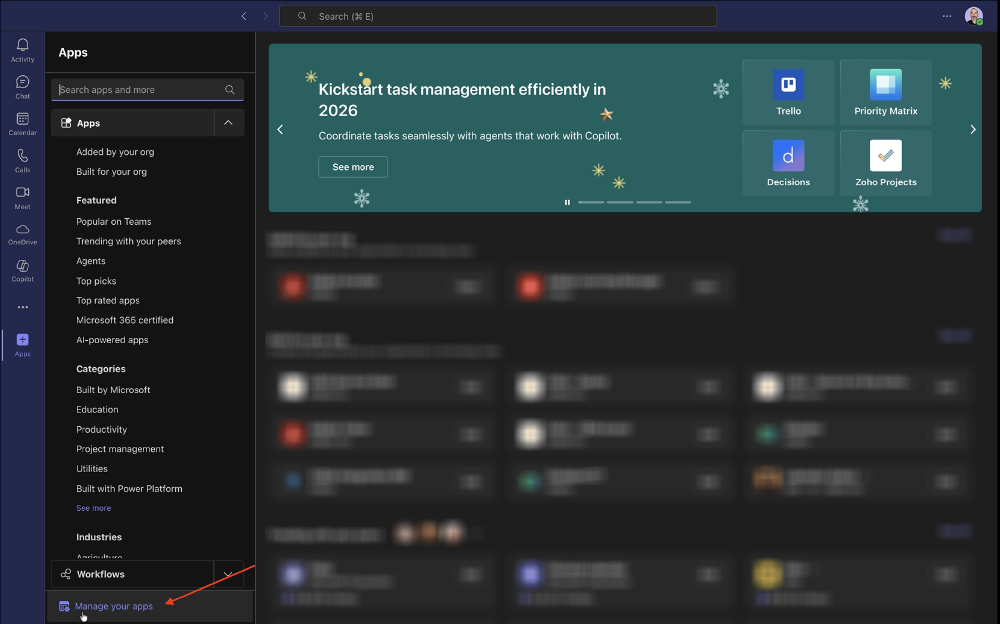

**アプリをアップロード**&#x200B;を選択します。


**カスタムアプリをアップロード**&#x200B;を選択します。

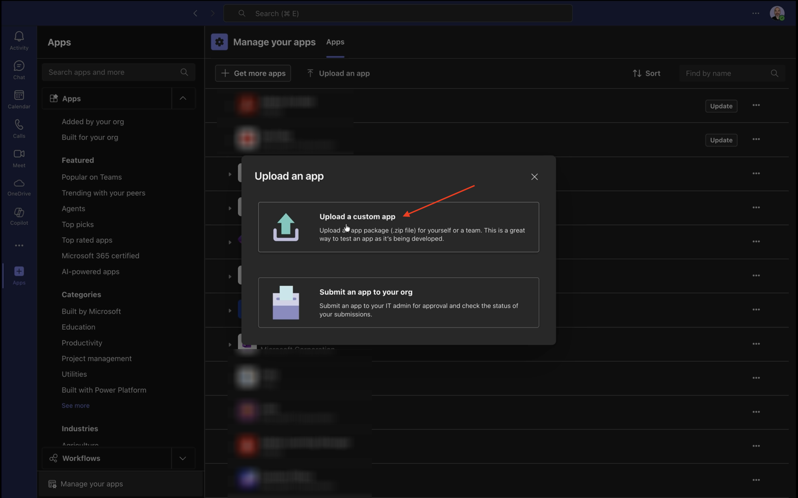

インストラクターから提供されたマニフェストファイルを選択し、**開く**&#x200B;をクリックします。

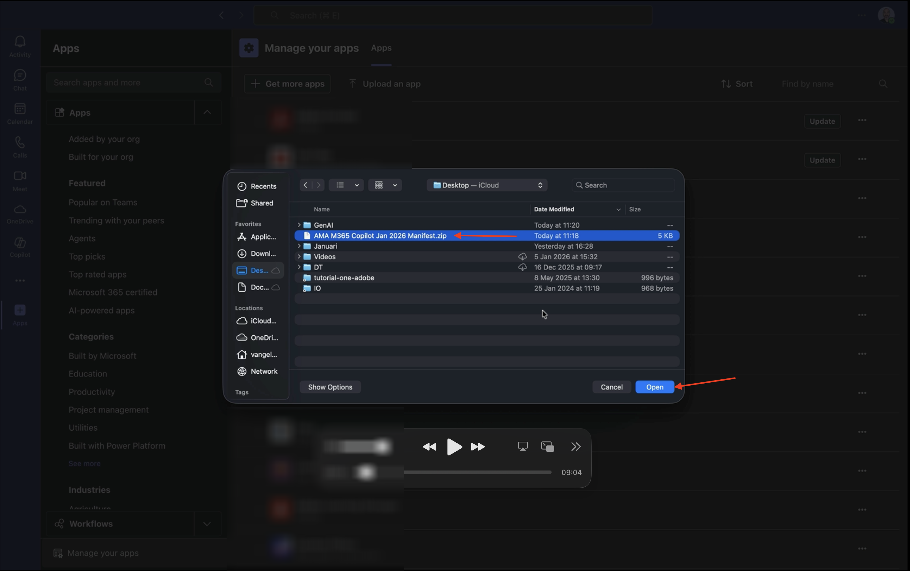

「**追加**」をクリックします。

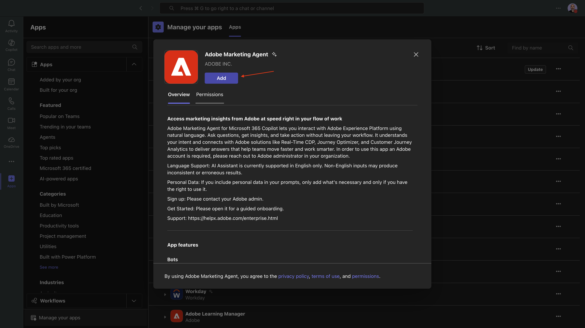

「**コパイロットで開く**」をクリックします。


Adobe Marketing Agentが正常に読み込まれました。


プロンプト `login`を入力し、**送信** ボタンをクリックします。

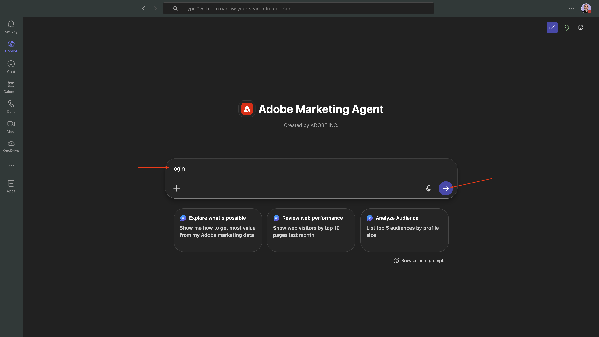

**Adobe Marketing Agentにログイン**&#x200B;をクリックします。


新しいウィンドウが開き、Adobe アカウントの資格情報を使用してログインするよう求められます。


認証が成功した後、使用する特定のインスタンスを選択する必要がある場合があります。 この画面が表示された場合は、—aepImsOrgName— インスタンスを選択してください。

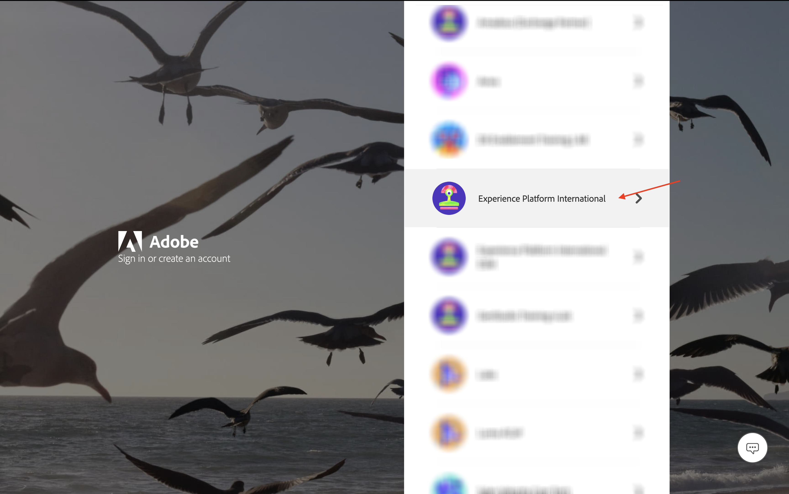

同じようなコードが生成されます。 「**コピー**」をクリックして、コードをコピーします。


CopilotのAdobe Marketing Agent ウィンドウにコードを貼り付け、**send** ボタンをクリックします。


次に、同様のものが表示されます。 Microsoft 365 CopilotでAdobe Marketing Agentに正常にログインできるようになりました。

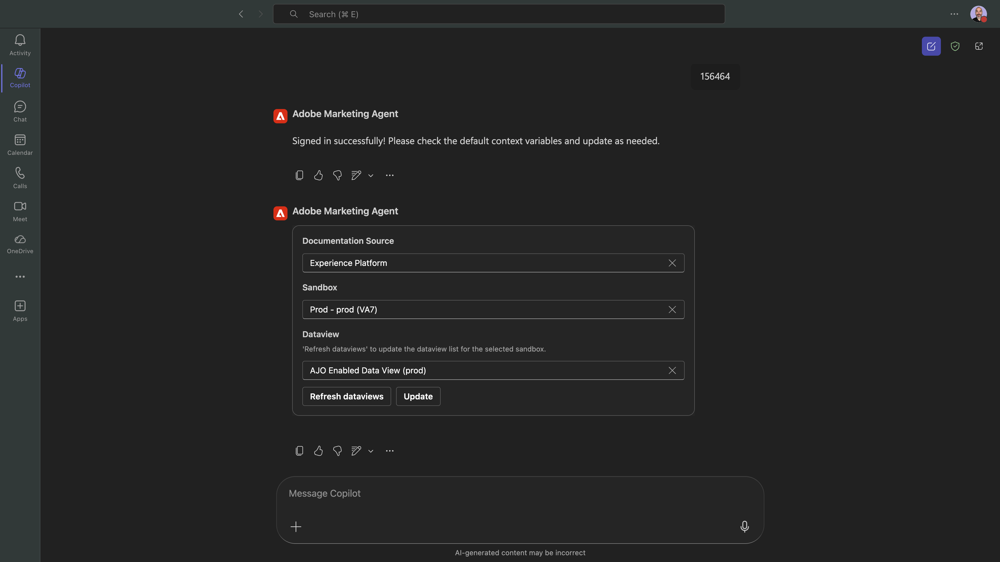

## 1.1.3.2 Adobe Marketing Agentでコンテキストを設定

Copilotを通じてAdobe Marketing Agentをさらに操作する前に、コンテキストを設定する必要があります。

この演習では、コンテキストを次のように設定する必要があります。

- **サンドボックス**: **製品 – 高速化（VA7）**

  サンドボックス設定は、質問を行う際にAI アシスタントがどのサンドボックスを確認すべきかを特定するのに役立ちます。

- **データビュー**: **Accelerate 2026 B2C**

  データビューの設定は、質問を行う際にAI アシスタントが確認すべきデータビューを特定するのに役立ちます。


サンドボックスを変更するには、次のコマンドを入力し、**send** ボタンをクリックします。

```javascript
change sandbox
```


次に、同様のものが表示されます。 使用するサンドボックスを選択し、**select**&#x200B;をクリックします。

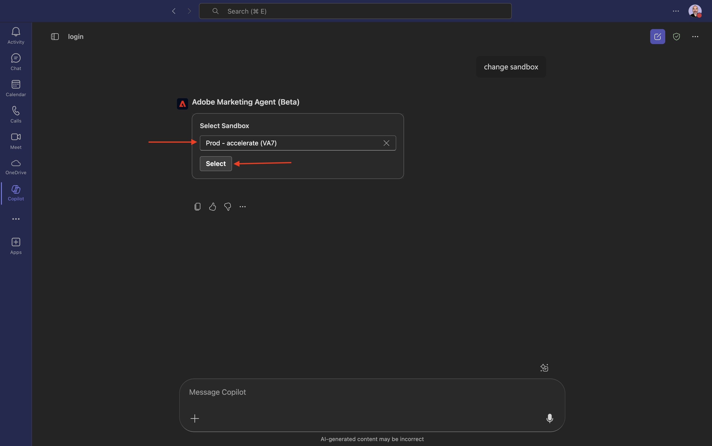

そうすると、これが表示されます。 データビューを変更するには、次のコマンドを入力し、**send** ボタンをクリックします。

```javascript
change dataview
```

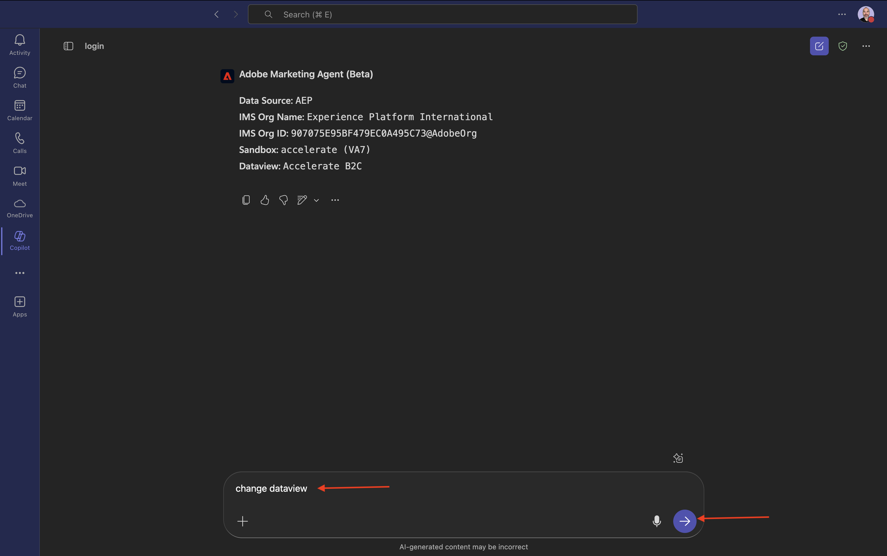

次に、同様のものが表示されます。 使用するデータビューを選択し、**select**&#x200B;をクリックします。

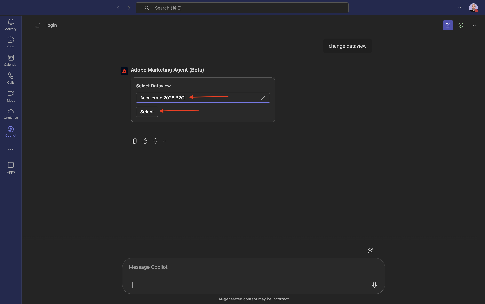

そうすると、これが表示されます。 これでコンテキストが正しく設定され、次に特定のプロンプトの送信を開始できます。


## 1.1.3.3最初に全体的な購入傾向を把握して、コンテキストを固定し、ファイバーにズームインします

**インテント**

モバイル、固定電話、インターネット、テレビ、ファイバーなど、過去60日間のカテゴリー別需要を詳細に把握できます。 これにより、ニューヨークのロールアウト後の季節性、プロモ – ション効果、地域のバリエーションのベースラインを設定できます。

次の&#x200B;**プロンプト**&#x200B;を入力し、**送信** ボタンをクリックします。

```javascript
Show me purchases by mainCategory over the last 4 months.
```


次の画面が表示されます。


次の&#x200B;**プロンプト**&#x200B;を入力し、**送信** ボタンをクリックします。

```javascript
Show me purchases by mainCategory = Fiber over the last 4 months broken down by week
```

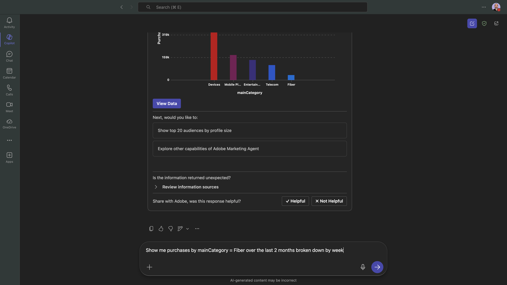

次に、これが表示され、ファイバー固有の傾向をドリルダウンします。


## 1.1.3.4注文をコンテンツ設定と関連付ける

**インテント**

特定のジャンル（SciFi、スポーツ、ドラマなど）に対する嗜好が、ブロードバンドのアップグレード行動、特に高帯域幅のニーズを予測するという仮説をテストします。

まず、ジャンルの環境設定を保存するために使用されるフィールドを見つける必要があります。

次の&#x200B;**プロンプト**&#x200B;を入力し、**送信** ボタンをクリックします。

```javascript
Which field is used to store the preferred genre
```


次に、このフィールドが表示されます。これは、ジャンルに使用されるフィールドが&#x200B;**_experienceplatform.individualCharacteristics.preferences.preferredGenre**&#x200B;であることを示しています。

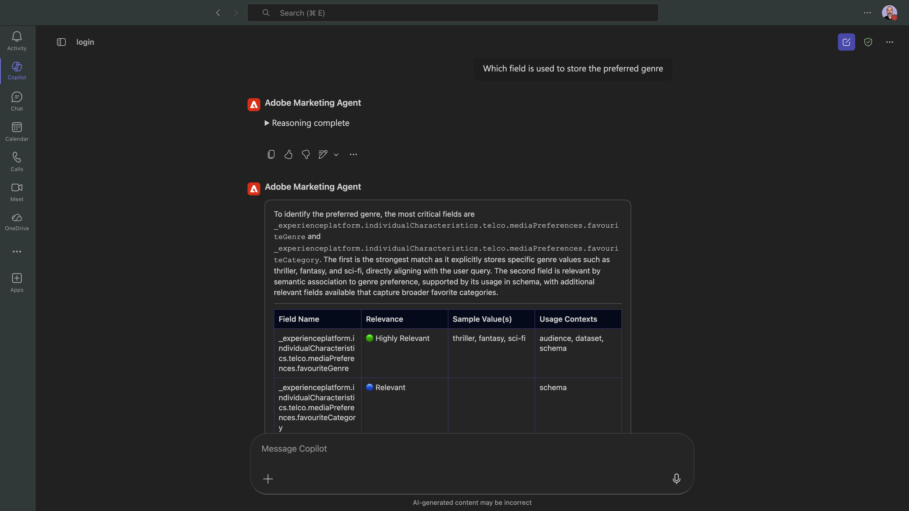

この情報があれば、購入データをドリルダウンできます。

次の&#x200B;**プロンプト**&#x200B;を入力し、**送信** ボタンをクリックします。

```javascript
Show me ordersYTD by preferredGenre for the last 4 months
```

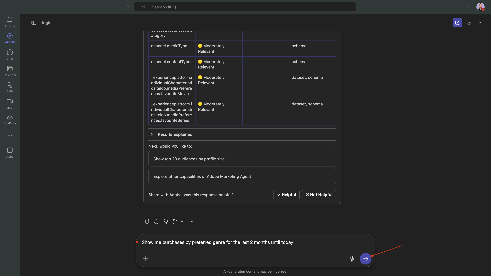

そうすると、これが表示されます。 「**データを表示**」をクリックします。


そうすると、これが表示されます。


## 1.1.3.5既存のファイバージャーニーの特定

**インテント**

アクティブなジャーニーまたは最近完了したジャーニーのタイトルに「Fiber」が含まれていることを確認します（例：「Fiber Upgrade NYC - Sept」、「Fiber Trial - Streaming Bundle」）。

次の&#x200B;**プロンプト**&#x200B;を入力し、**送信** ボタンをクリックします。

```javascript
What journeys exist? 
```


そうすると、ジャーニーのリストが表示されます。


次の&#x200B;**プロンプト**&#x200B;を入力し、**送信** ボタンをクリックします。

```javascript
Which of these journeys has 'Fiber' in its name?
```


そうすると、これが表示されます。


次の&#x200B;**プロンプト**&#x200B;を入力し、**送信** ボタンをクリックします。

```javascript
Show me the details of the journey 'CitiSignal - Fiber Max Launch Promotion'
```


そうすると、これが表示されます。

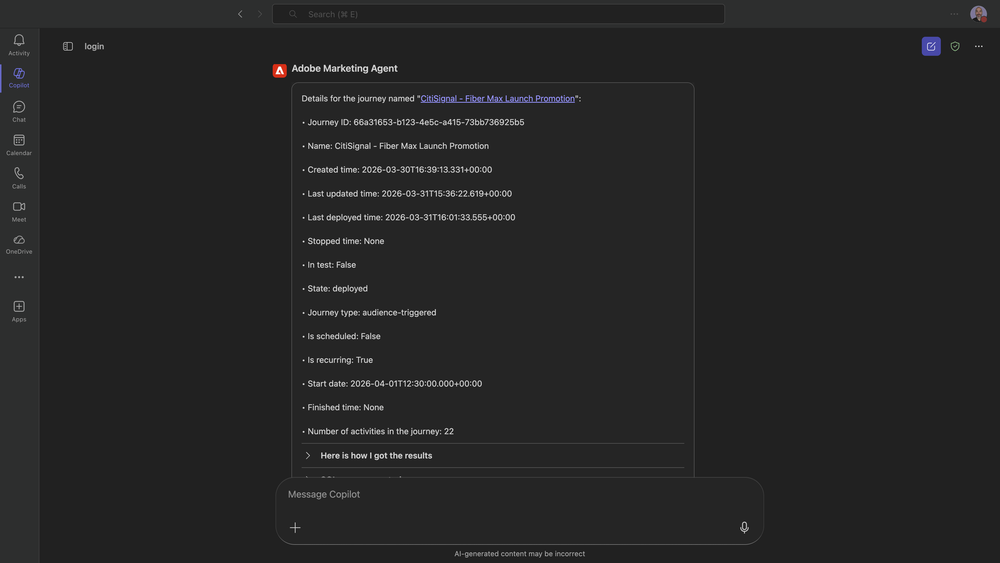

## 1.1.3.6 フォールアウト分析によるジャーニーのパフォーマンスの検証

**インテント**

ジャーニーのパフォーマンスのフォールアウトを把握して、ジャーニー内で多数のプロファイルがドロップされているノードや条件があるかどうかを確認します。 これは、ジャーニーで追加の調整が必要かどうかを把握するのに役立ちます。

次の&#x200B;**プロンプト**&#x200B;を入力し、**送信** ボタンをクリックします。

```javascript
Create a fall-out report on the "CitiSignal - Fiber Max Launch Promotion" journey
```


そうすると、これが表示されます。


もう少し下にスクロールして、観察と推奨事項を確認します。 3つのドット **...**&#x200B;をクリックし、**ジャーニーの詳細**&#x200B;を選択して、Adobe Journey Optimizerで特定のジャーニーを開きます。


そうすると、これが表示されます。

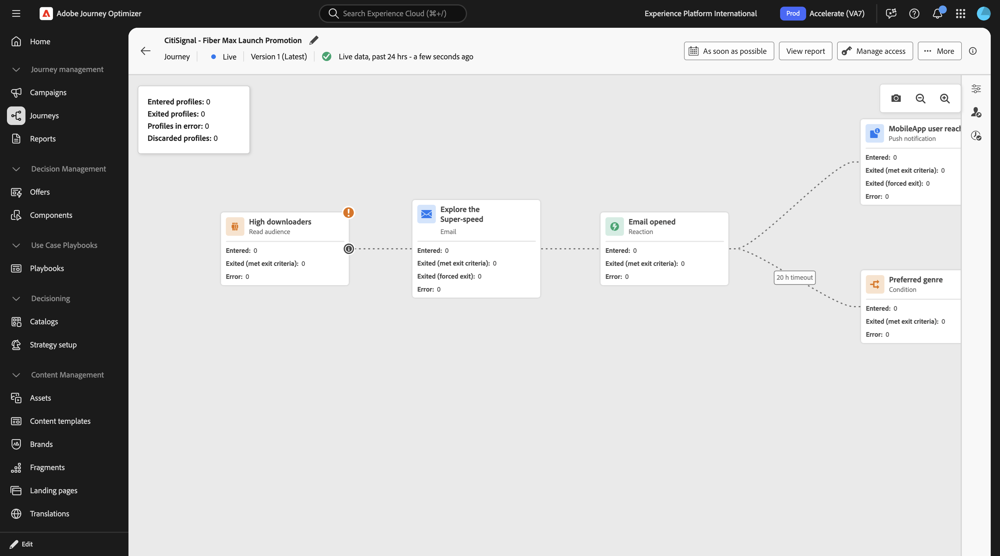

これで、このラボは完了しました。

## 次の手順

[Google Gemini Enterprise向けAdobe Marketing Agent](./ex4.md){target="_blank"}に移動

[Agent Orchestrator](./agentorchestrator.md){target="_blank"}に戻る

[すべてのモジュールに戻る](./../../../overview.md){target="_blank"}
