# 1.1.4 Google Gemini Enterprise向けAdobe Marketing Agent

[!BADGE Beta]

+++Betaの詳細
Google Gemini Enterprise BetaでAdobe Marketing Agentを使用することにより、お客様は、Betaが一切の保証なしに「現状のまま」提供されることを了承するものとします。 Adobeは、Betaを維持、修正、更新、変更、その他の方法でサポートする義務を負いません。 このようなBetaおよび/または付随資料の正しい機能や性能に依存しないように、慎重に使用することをお勧めします。 BetaはAdobeの機密情報と見なされます。  お客様がアドビに提供するあらゆる「フィードバック」（ベータ版の使用中に発生した問題や欠陥、提案、改善、レコメンデーションを含むがこれに限定されないベータ版に関する情報）は、このようなフィードバックに含まれる、およびフィードバックに対するすべての権利、所有権、利益を含め、アドビに帰属します。

+++

## 前提条件

このラボの手順に従うには、次のアクセスが必要です。

- Real-Time CDP、Journey Optimizer、Customer Journey Analyticsへのアクセス
- Adobe Experience CloudのAI アシスタントを利用すれば
- AEP Agent Orchestratorへのアクセス
- Google Gemini Enterpriseへのアクセス

## ビデオ

このビデオでは、この演習に関連するすべての手順の説明とデモを行います。

>[!VIDEO](https://video.tv.adobe.com/v/3481322?quality=12&learn=on)

## Google Gemini Enterpriseへの1.1.4.1 アクセス

[https://cloud.google.com/gemini-enterprise](https://cloud.google.com/gemini-enterprise)に移動します。 「**30日間の無料体験を開始**」をクリックします。


Google アカウントの電子メールアドレスを入力し、**電子メールで続行**&#x200B;をクリックします。


姓と名を入力し、**同意して開始**&#x200B;をクリックします。


「**後で行います**」をクリックします。

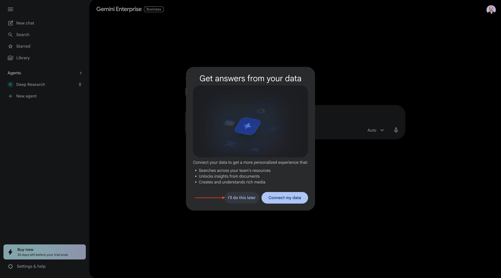

そうすると、これが表示されます。


[https://cloud.google.com/gemini-enterprise](https://cloud.google.com/gemini-enterprise)に移動します。

このような表示になります。 また、最初に請求先アカウントを作成し、その後ここで選択する必要がある場合もあります。

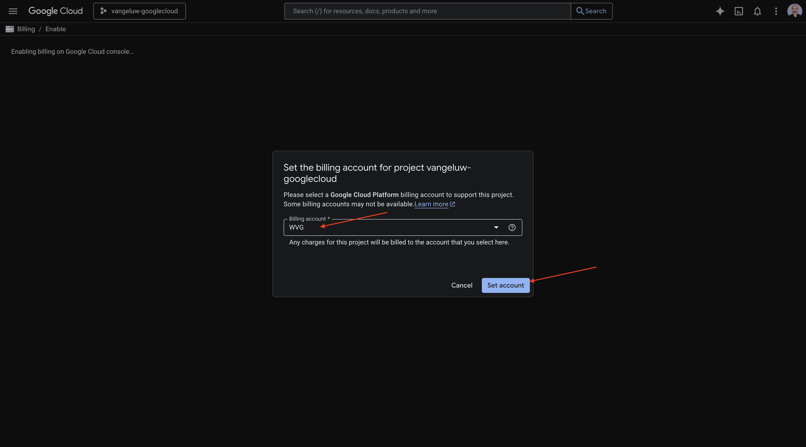

「**30日間の無料試用版を開始**」をクリックします。

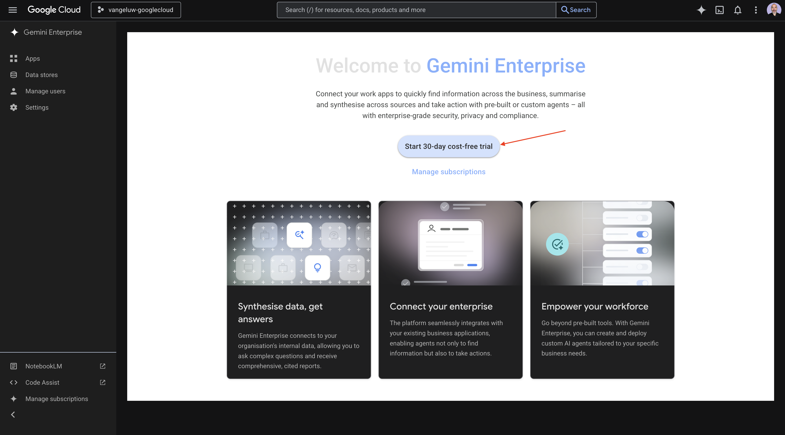

「**続行」をクリックして、API**&#x200B;をアクティブ化します。


「**作成**」をクリックします。


そうすると、これが表示されます。


## 1.1.4.2 A2Aを使用してカスタムエージェントを作成します

[https://console.cloud.google.com/gemini-enterprise](https://console.cloud.google.com/gemini-enterprise)に移動します。 「**Agents**」をクリックします。


「**+エージェントを追加**」をクリックします。


A2A **経由で** カスタムエージェントを選択します。


**エージェントカード JSON**&#x200B;を貼り付けます。

>[!NOTE]
>
>Adobe担当者に問い合わせて、**Agent Card JSON**&#x200B;情報を取得してください。

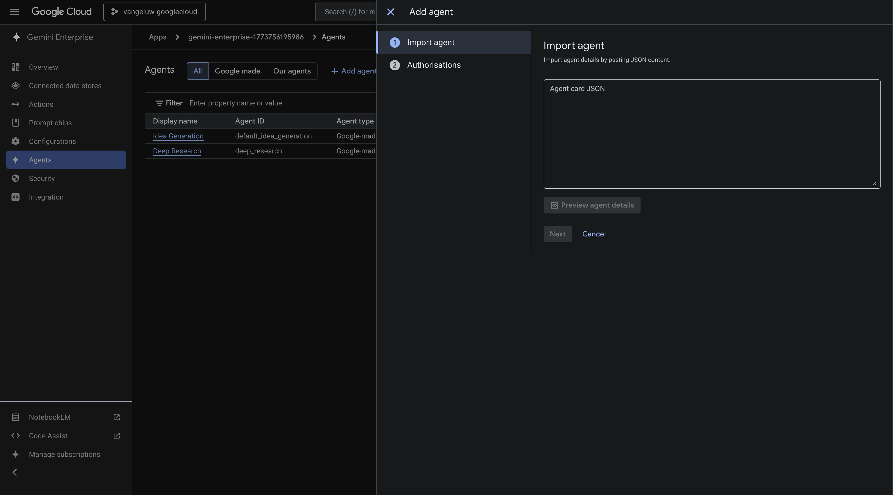

**エージェントカード JSON**&#x200B;をペーストしたら、**エージェントの詳細をプレビュー**&#x200B;をクリックします。


このような表示になります。 下にスクロールして、**次へ**&#x200B;をクリックします。

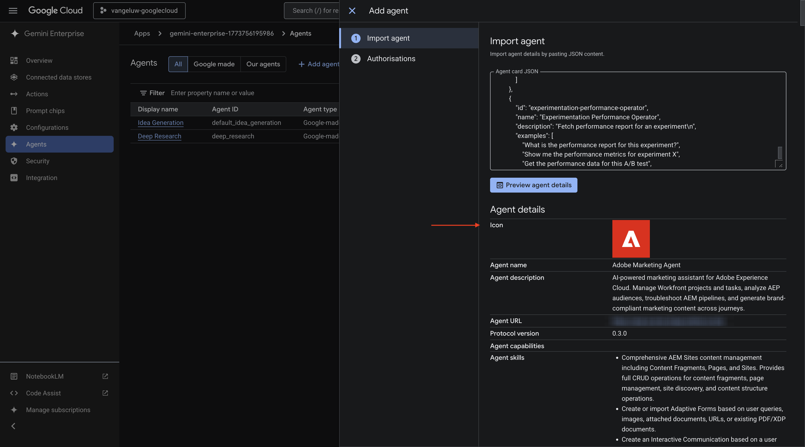

このような表示になります。

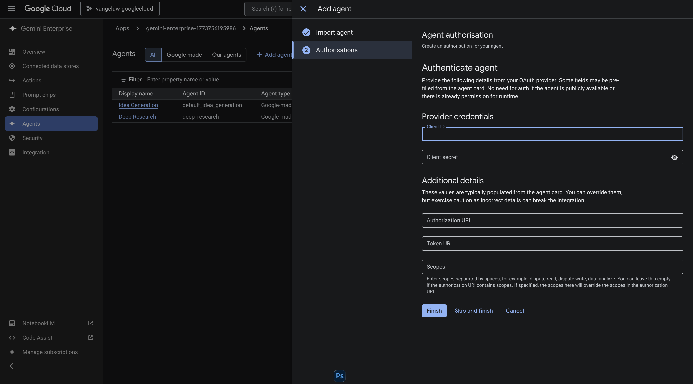

インスタンスのフィールドに入力します。

- **クライアント ID**:

```
--aepImsOrgId--
```

- **クライアントシークレット**:

```
AdobeMarketingAgent
```

- **認証URL**:

```
https://XXX.adobe.io/authorize
```

- **トークン URL**:

```
https://XXX.adobe.io/token
```

- **範囲**:

```
openid email profile
```

「**完了**」をクリックします。


そうすると、これが表示されます。

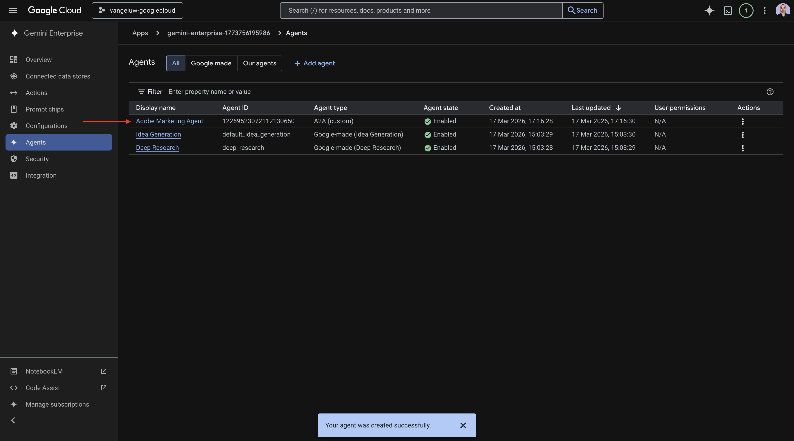

## 1.1.4.3 Adobe Marketing Agentにログイン

**概要**&#x200B;に移動し、**プレビュー**&#x200B;をクリックします。


「**開始する**」をクリックします


**Agents**&#x200B;に移動します。 **Adobe Marketing Agent**&#x200B;が表示されます。


3つのドット **...**&#x200B;をクリックし、**ピン**&#x200B;を選択します。


**新しいチャット**&#x200B;に移動し、チャットに記号&#x200B;**@**&#x200B;を入力します。 **Adobe Marketing Agent**&#x200B;をクリックします。

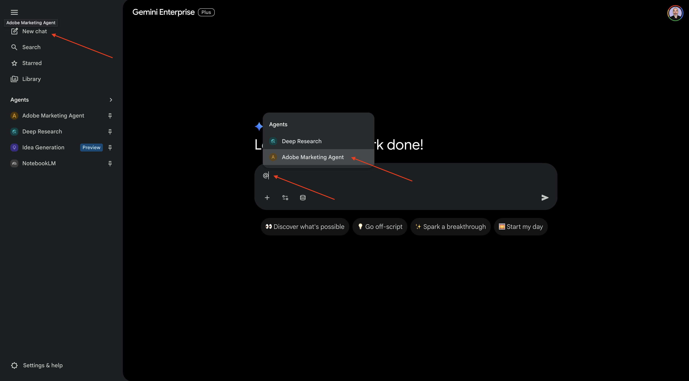

コマンド `login`を入力し、**送信**&#x200B;をクリックします。

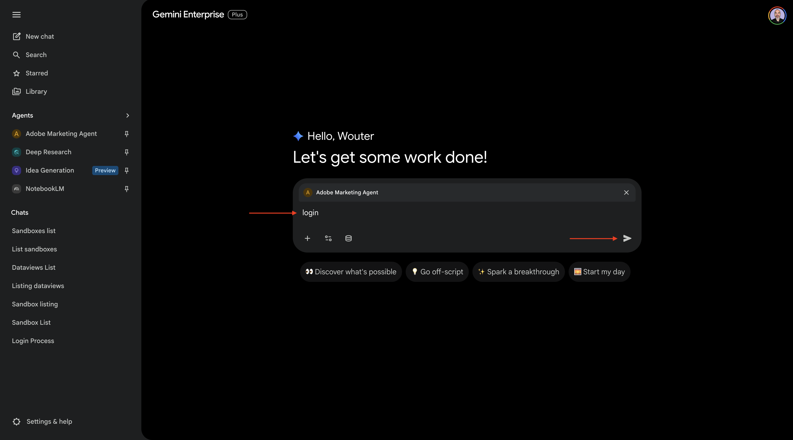

そうすると、これが表示されます。 **認証**&#x200B;をクリックします。


**アクセスを許可**&#x200B;をクリックし、Adobe IDを使用してログインを完了し、プロンプトが表示されたらインスタンス `--aepImsOrgName--`を選択します。


そうすると、これが表示されます。


## 1.1.4.4 Adobe Marketing Agentでコンテキストを設定

Copilotを通じてAdobe Marketing Agentをさらに操作する前に、コンテキストを設定する必要があります。

この演習では、コンテキストを次のように設定する必要があります。

- **サンドボックス**: **製品 – 高速化（VA7）**

  サンドボックス設定は、質問を行う際にAI アシスタントがどのサンドボックスを確認すべきかを特定するのに役立ちます。

- **データビュー**: **Accelerate 2026 B2C**

データビューの設定は、質問を行う際にAI アシスタントが確認すべきデータビューを特定するのに役立ちます。

サンドボックスを変更するには、次のコマンドを入力し、**send** ボタンをクリックします。

```javascript
list sandboxes
```


次に、同様のものが表示されます。 コマンド `switch to sandbox accelerate`を入力し、**送信** ボタンをクリックします。


そうすると、これが表示されます。 データビューを変更するには、次のコマンドを入力し、**send** ボタンをクリックします。

```javascript
list dataviews
```


次に、同様のものが表示されます。 コマンド `switch dataview to Accelerate 2026 B2C`を入力し、**送信** ボタンをクリックします。


そうすると、これが表示されます。 これでコンテキストが正しく設定され、次に特定のプロンプトの送信を開始できます。


## 1.1.4.5最初に全体的な購入傾向を把握して、コンテキストを固定し、ファイバーにズームインします

**インテント**

モバイル、固定電話、インターネット、テレビ、ファイバーなど、過去60日間のカテゴリー別需要を詳細に把握できます。 これにより、ニューヨークのロールアウト後の季節性、プロモ – ション効果、地域のバリエーションのベースラインを設定できます。

次の&#x200B;**プロンプト**&#x200B;を入力し、**送信** ボタンをクリックします。

```javascript
Show me purchases by mainCategory over the last 7 months.
```

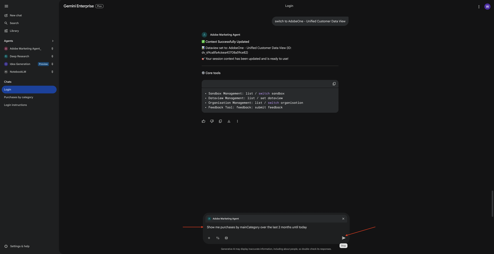

次の画面が表示されます。

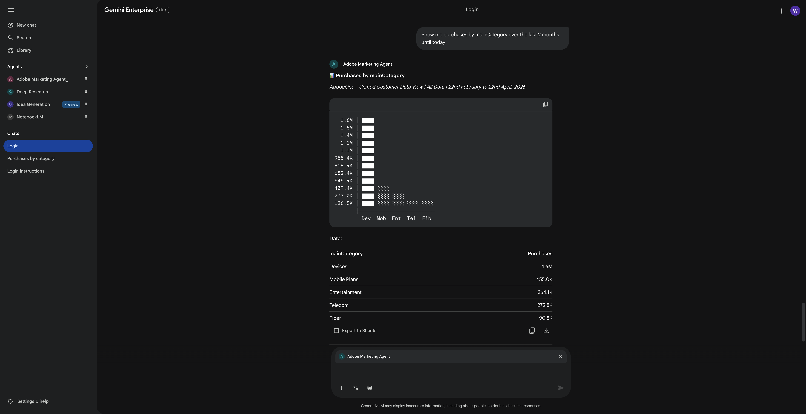

次の&#x200B;**プロンプト**&#x200B;を入力し、**送信** ボタンをクリックします。

```javascript
Show me purchases by mainCategory = Fiber over the last 7 months broken down by week
```

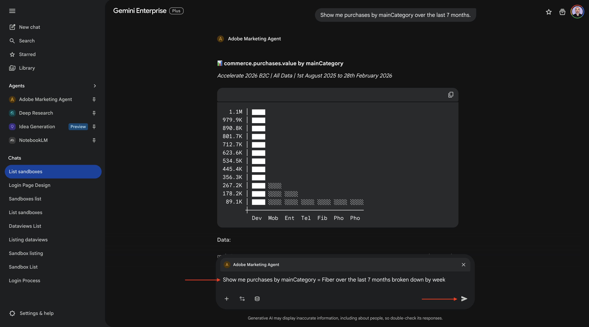

次に、これが表示され、ファイバー固有の傾向をドリルダウンします。


## 1.1.4.6注文をコンテンツ設定と関連付ける

**インテント**

特定のジャンル（SciFi、スポーツ、ドラマなど）に対する嗜好が、ブロードバンドのアップグレード行動、特に高帯域幅のニーズを予測するという仮説をテストします。

まず、ジャンルの環境設定を保存するために使用されるフィールドを見つける必要があります。

次の&#x200B;**プロンプト**&#x200B;を入力し、**送信** ボタンをクリックします。

```javascript
Which field is used to store the preferred genre
```


次に、このフィールドが表示されます。これは、ジャンルに使用されるフィールドが&#x200B;**_experienceplatform.individualCharacteristics.preferences.preferredGenre**&#x200B;であることを示しています。


この情報があれば、購入データをドリルダウンできます。

次の&#x200B;**プロンプト**&#x200B;を入力し、**送信** ボタンをクリックします。

```javascript
Show me ordersYTD by preferredGenre for the last 7 months
```


そうすると、これが表示されます。

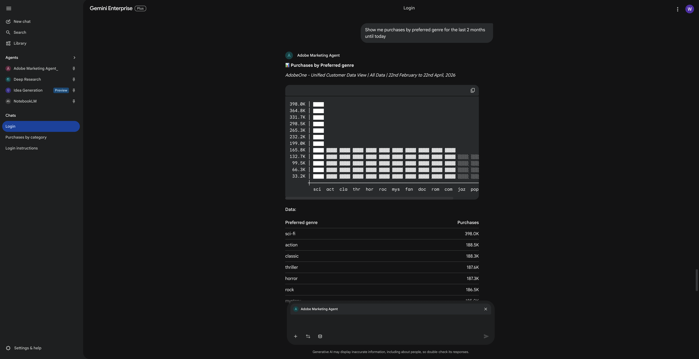

## 1.1.4.7既存のファイバージャーニーの特定

**インテント**

アクティブなジャーニーまたは最近完了したジャーニーのタイトルに「Fiber」が含まれていることを確認します（例：「Fiber Upgrade NYC - Sept」、「Fiber Trial - Streaming Bundle」）。

次の&#x200B;**プロンプト**&#x200B;を入力し、**送信** ボタンをクリックします。

```javascript
What journeys exist? 
```


そうすると、ジャーニーのリストが表示されます。


次の&#x200B;**プロンプト**&#x200B;を入力し、**送信** ボタンをクリックします。

```javascript
Which of these journeys has 'Fiber' in its name?
```

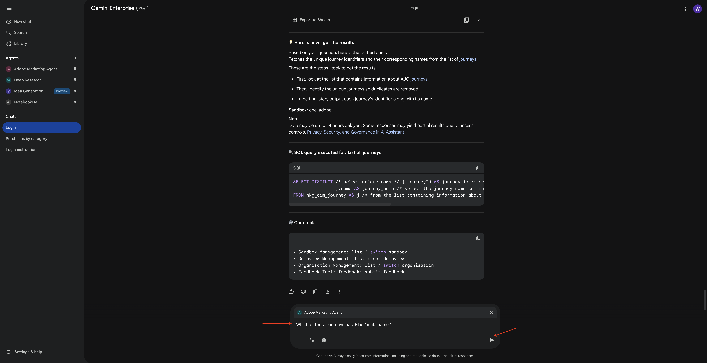

そうすると、これが表示されます。


次の&#x200B;**プロンプト**&#x200B;を入力し、**送信** ボタンをクリックします。

```javascript
Show me the details of the journey 'CitiSignal - Fiber Max Launch Promotion'
```


そうすると、これが表示されます。


## 1.1.4.8 フォールアウト分析によるジャーニーのパフォーマンスの検証

**インテント**

ジャーニーのパフォーマンスのフォールアウトを把握して、ジャーニー内で多数のプロファイルがドロップされているノードや条件があるかどうかを確認します。 これは、ジャーニーで追加の調整が必要かどうかを把握するのに役立ちます。

次の&#x200B;**プロンプト**&#x200B;を入力し、**送信** ボタンをクリックします。

```javascript
Create a fall-out report on the "CitiSignal - Fiber Max Launch Promotion" journey
```


そうすると、これが表示されます。


これで、このラボは完了しました。

## 次の手順

Claude[の](./ex5.md){target="_blank"}1.1.5 Adobe Marketing Agentに移動

[Agent Orchestrator](./agentorchestrator.md){target="_blank"}に戻る

[すべてのモジュールに戻る](./../../../overview.md){target="_blank"}
