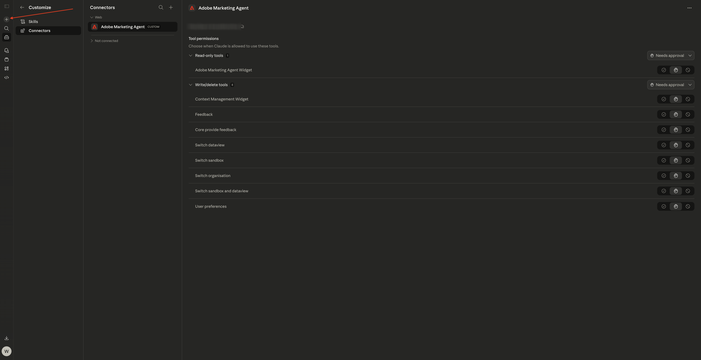
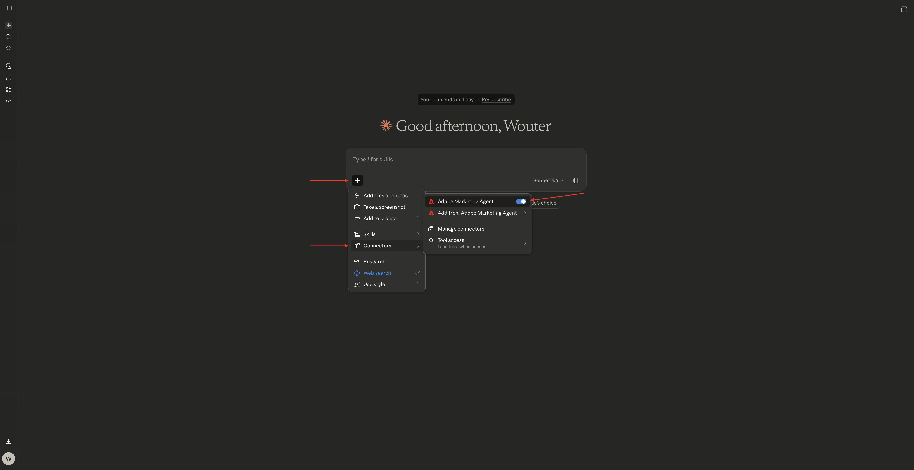
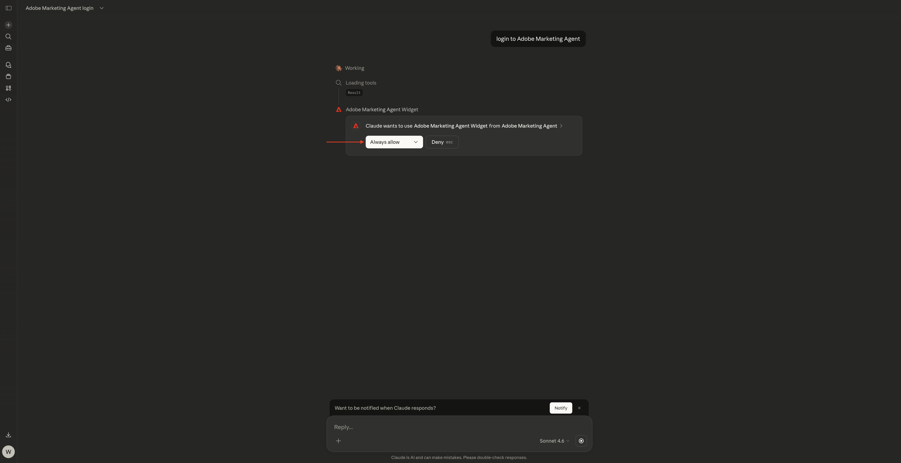
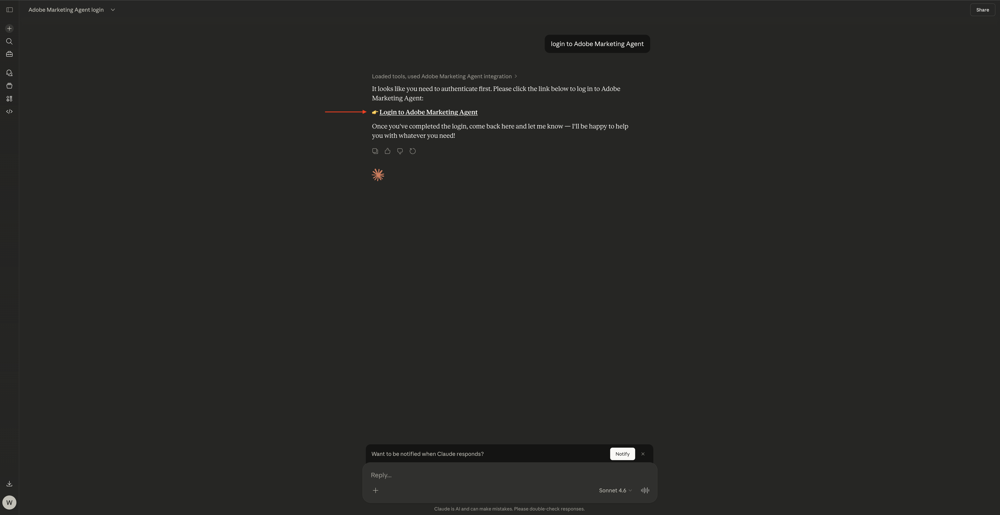
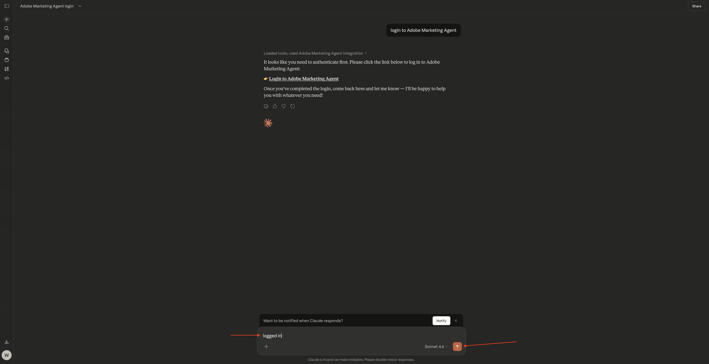
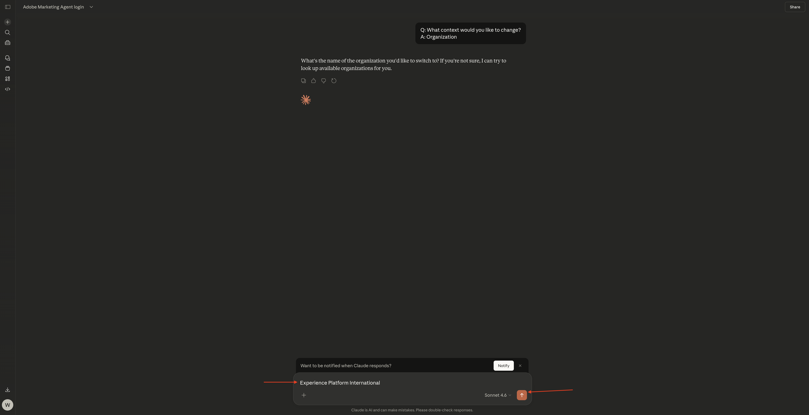
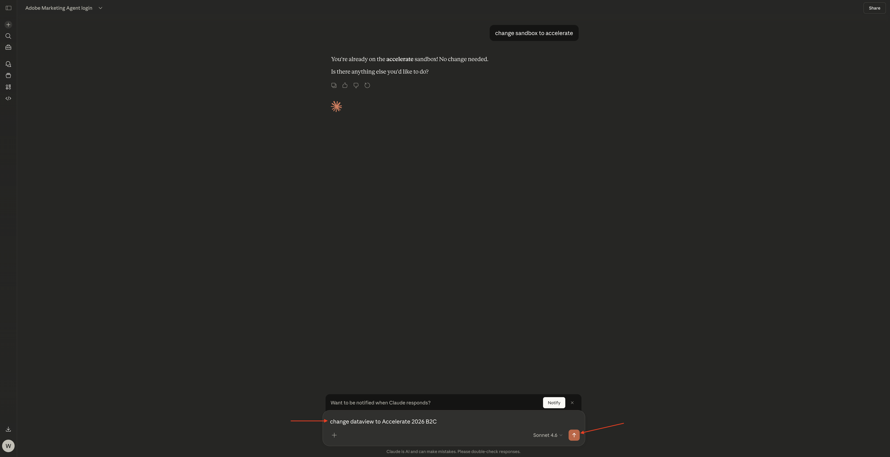

# 1.1.5 Adobe Marketing Agent for Claude

[!BADGE Beta]

+++Betaの詳細
お客様は、Adobe Marketing AgentをClaude Betaとともに使用することにより、Betaが何らの保証もなしに「現状のまま」提供されることを認めます。 Adobeは、Betaを維持、修正、更新、変更、その他の方法でサポートする義務を負いません。 このようなBetaおよび/または付随資料の正しい機能や性能に依存しないように、慎重に使用することをお勧めします。 BetaはAdobeの機密情報と見なされます。  お客様がアドビに提供するあらゆる「フィードバック」（ベータ版の使用中に発生した問題や欠陥、提案、改善、レコメンデーションを含むがこれに限定されないベータ版に関する情報）は、このようなフィードバックに含まれる、およびフィードバックに対するすべての権利、所有権、利益を含め、アドビに帰属します。

+++

## 前提条件

このラボの手順に従うには、次のアクセスが必要です。

- Real-Time CDP、Journey Optimizer、Customer Journey Analyticsへのアクセス
- Adobe Experience CloudのAI アシスタントを利用すれば
- AEP Agent Orchestratorへのアクセス
- Claudeへのアクセス

## ビデオ

このビデオでは、この演習に関連するすべての手順の説明とデモを行います。

>[!VIDEO](https://video.tv.adobe.com/v/3482212?quality=12&learn=on)

このラボは開発中です。

## 1.1.5.1 CJA用Claude.aiでカスタムアプリを作成

>[!NOTE]
>
>Claude.aiでAdobe Marketing Agentを使用するには、次の操作が必要です。
>- claude.aiの有料版

[https://claude.ai/](https://claude.ai/){target="_blank"}に移動し、アカウントの詳細を使用してログインします。 ログインしたら、これを確認してください。


クリックしてアカウントを開き、**設定**&#x200B;を選択します。


**コネクタ**&#x200B;に移動し、**カスタマイズに移動**&#x200B;をクリックします。


**+**&#x200B;をクリックし、**カスタムコネクタを追加**&#x200B;を選択します。


次のようにフィールドに入力します。

- **名前**: `Adobe Marketing Agent`
- **MCP Server URL**: Adobe担当者にお問い合わせください

「**追加**」をクリックします。


そうすると、これが表示されます。 **+**&#x200B;をクリックして、新しいチャットを開始します。



**+** アイコンをクリックし、**コネクタ**&#x200B;に移動して、**Adobe Marketing Agent**&#x200B;が有効になっていることを確認します。



## 1.1.5.2認証してコンテキストを設定

Claude.aiを通じてAdobe Marketing Agentをさらに操作する前に、ログインしてコンテキストを設定する必要があります。

次のプロンプトを入力し、**send**&#x200B;をクリックします。

```
login to Adobe Marketing Agent
```


「**常に許可**」を選択します。



Adobe Marketing agent**にログインするには、リンクをクリックします。



「**リンクを開く**」をクリックします。


「**アクセスを許可**」をクリックします。


正常に認証された後、これを確認する必要があります。 Claudeに戻ります。


次のコマンドを入力し、**send**&#x200B;をクリックします。

```javascript
logged in
```



これで正常にログインしました。 次のステップはコンテキストを設定します。 次のプロンプトを入力し、**send**&#x200B;をクリックします。


```javascript
change context
```


**組織**&#x200B;を選択します。 このコマンドを繰り返して、後でサンドボックスとデータビューを変更することもできます。


インスタンスの名前を入力し、**send**&#x200B;をクリックします。



「**常に許可**」を選択します。


このような表示になります。


サンドボックスがまだ正しく設定されていない場合は、次のコマンドを使用して、使用する必要のあるサンドボックスに変更できます。 **send**&#x200B;をクリックします。 または、上記のコマンド `change context`を使用して、**サンドボックス**&#x200B;を選択することもできます

```javascript
change sandbox to --aepSandboxName--
```


データビューがまだ正しく設定されていない場合は、次のコマンドを使用して、使用する必要があるサンドボックスに変更できます（以下のコマンドのXXXをデータビューの名前に置き換えます）。 **send**&#x200B;をクリックします。 または、上記のコマンド `change context`を使用して、**dataview**&#x200B;を選択することもできます

```javascript
change dataview to XXX
```



**組織**、**サンドボックス**&#x200B;および&#x200B;**データビュー**&#x200B;が正しく設定されたら、Adobe Marketing Agentに質問を開始する準備が整います。

## 次の手順

[Agent Orchestrator](./agentorchestrator.md){target="_blank"}に戻る

[すべてのモジュールに戻る](./../../../overview.md){target="_blank"}
