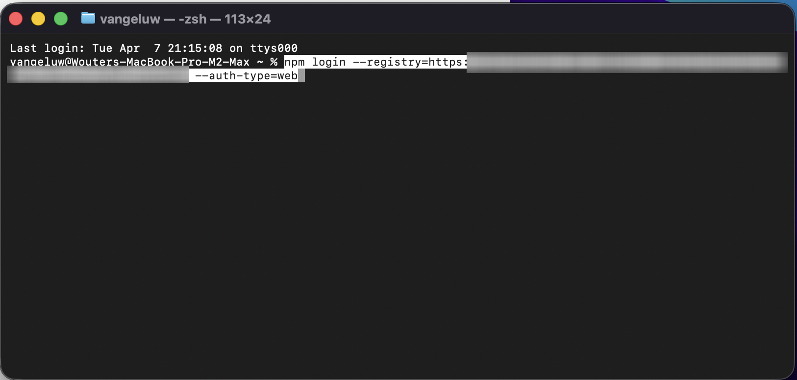
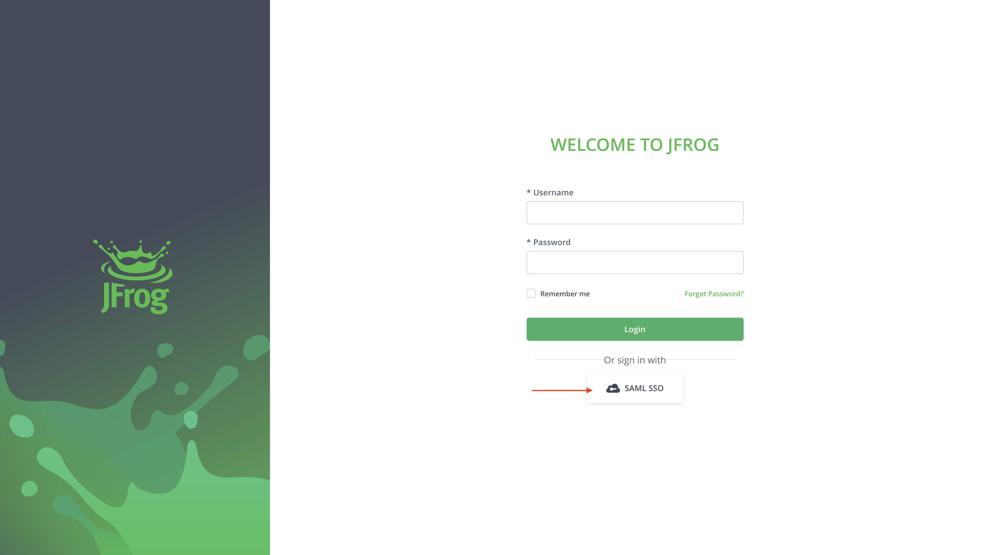
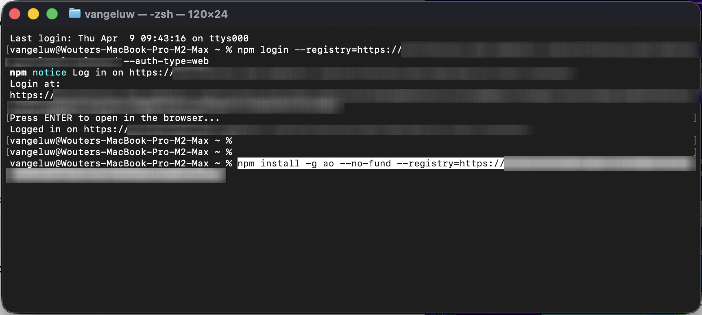
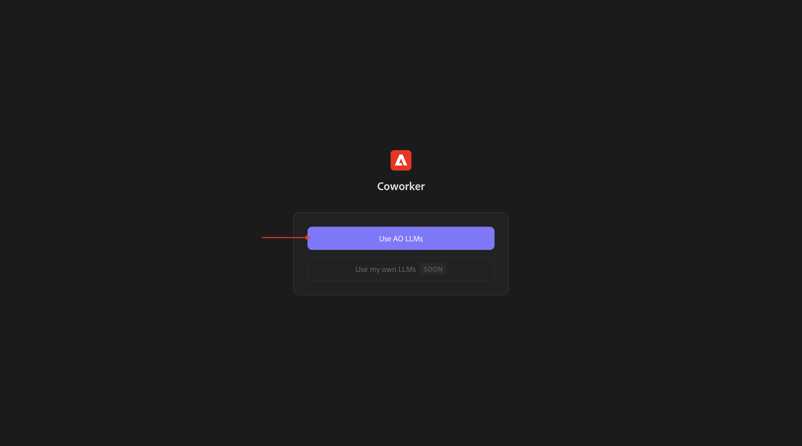
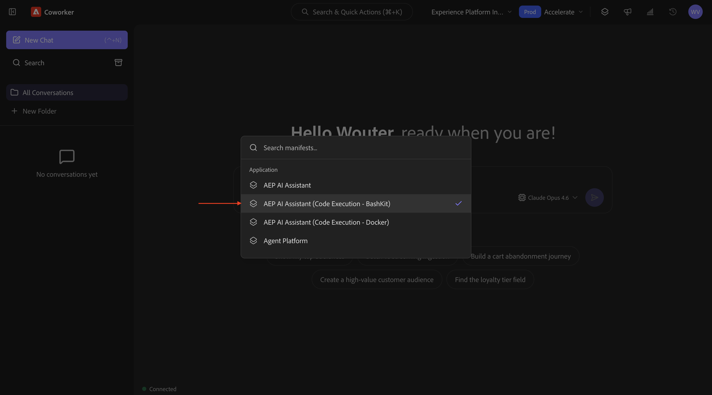
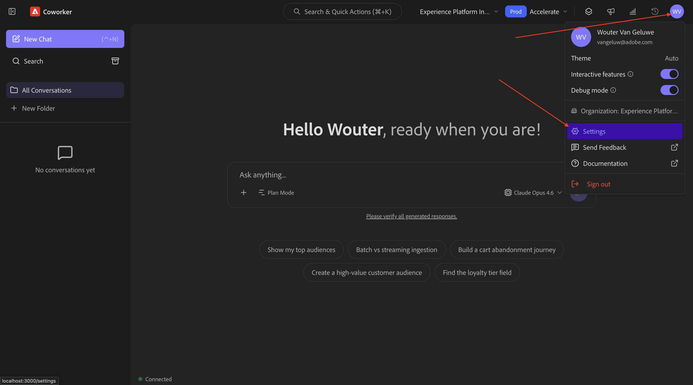
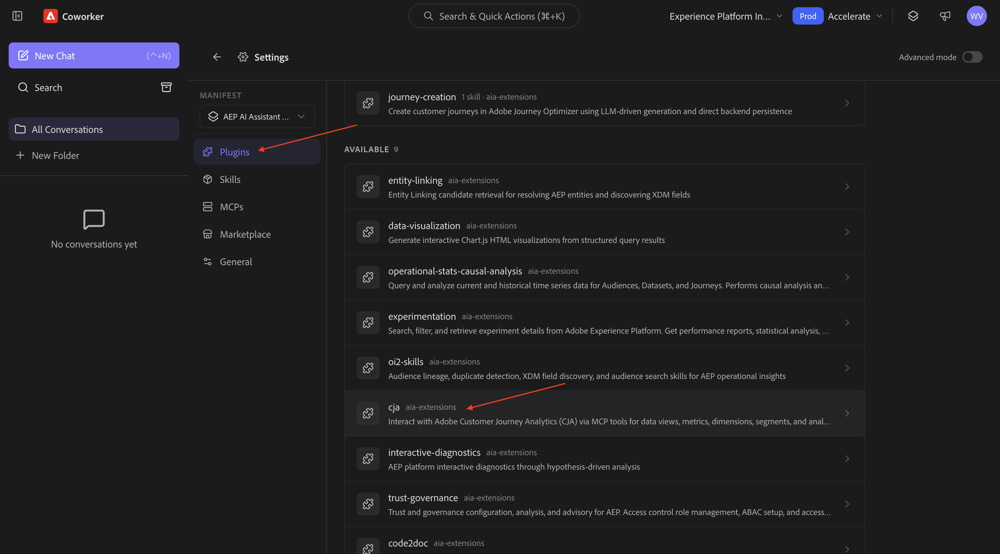
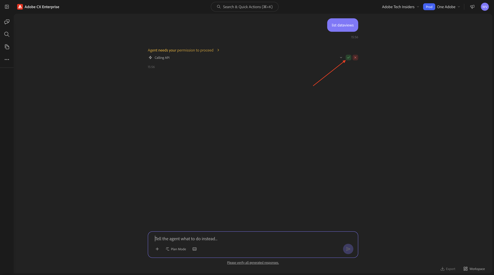
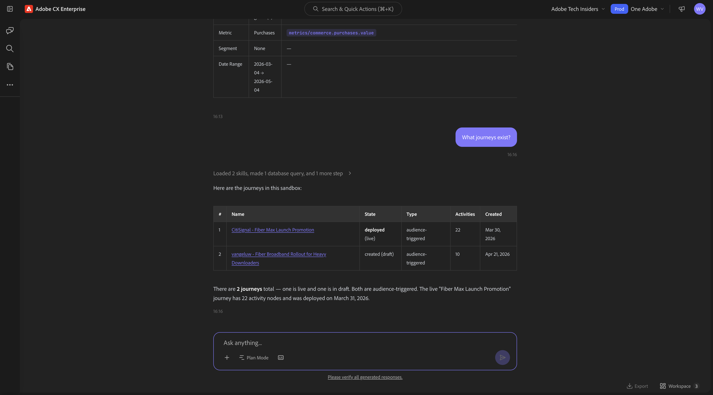
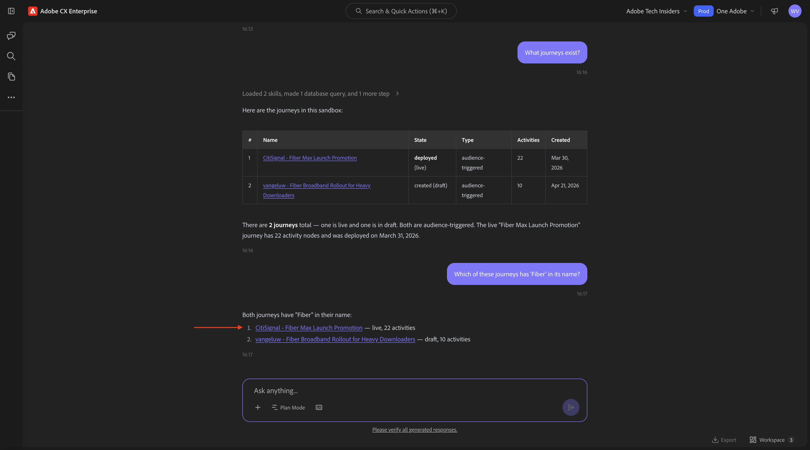

# 1.1.6 Agent Orchestrator v2

[!BADGE Beta]

+++Betaの詳細
Agent Orchestrator v2 Betaを使用することにより、お客様は、Betaが何らの保証も受けることなく「現状のまま」提供されることを了承するものとします。 Adobeは、Betaを維持、修正、更新、変更、その他の方法でサポートする義務を負いません。 このようなBetaおよび/または付随資料の正しい機能や性能に依存しないように、慎重に使用することをお勧めします。 BetaはAdobeの機密情報と見なされます。  お客様がアドビに提供するあらゆる「フィードバック」（ベータ版の使用中に発生した問題や欠陥、提案、改善、レコメンデーションを含むがこれに限定されないベータ版に関する情報）は、このようなフィードバックに含まれる、およびフィードバックに対するすべての権利、所有権、利益を含め、アドビに帰属します。

+++

## 前提条件

このラボの手順に従うには、次のアクセスが必要です。

- Real-Time CDP、Journey Optimizer、Customer Journey Analyticsへのアクセス
- Adobe Experience CloudのAI アシスタントを利用すれば
- AEP Agent Orchestrator v2へのアクセス
- Node.js 18以降をシステムにインストールする必要があります

## 1.1.6.1 Agent Orchestrator v2の設定

### IAM

IAMを使用して以下のグループに自分自身を追加し、LLM資格情報にアクセスします。

>[!NOTE]
>
>以下の手順の一部は、Adobeに固有のものです。 使用するGRPについて、Adobeの担当者にお問い合わせください。

```
GRP-XXX
```

### Agent Orchestrator v2のインストール

コンピューターで新しいターミナルウィンドウを開きます。


>[!NOTE]
>
>以下のコマンドでは、特定のURLを使用する必要があります。 使用するURLについては、Adobe担当者にお問い合わせください。

次のコマンドを実行します。

```
npm login --registry=https://XXX/ --auth-type=web
```



そうすると、これが表示されます。 「**Enter**」をクリックします。


**SAML SSO**&#x200B;を選択します。



**はい**&#x200B;をクリックします。


そうすると、これが表示されます。


次のコマンドを実行します。

```
npm install -g ao --no-fund --registry=https://XXX/
```



そうすると、これが表示されます。 次のコマンドを実行します。

```
ao --help
```


Agent Orchestrator v2がインストールされました。 次のコマンドを実行して、**Agent Orchestrator v2**&#x200B;を起動します。

```
ao web
```

そうすると、これが表示されます。 「**Enter**」をクリックして、Agent Orchestrator v2 Web UIを開きます。


## 1.1.6.2 Agent Orchestrator v2の設定

「**AO LLMを使用**」をクリックします。



「**本番環境にログイン**」をクリックします。


**layers** アイコンをクリックします。


**AEP AI アシスタント （Code Execution - BashKit）**&#x200B;を選択します。



**プロファイル** アイコンをクリックし、**設定**&#x200B;を選択します。



**Plugins**&#x200B;に移動し、**cja**&#x200B;をクリックします。



「**インストール**」をクリックします。


## 1.1.6.3 コンテキストを設定

**新規チャット**&#x200B;をクリックします。

インスタンス **Experience Platform International**&#x200B;とサンドボックス **Accelerate**&#x200B;を使用するようにインスタンスが設定されていることを確認します。

次のコマンドを入力し、**送信**&#x200B;をクリックします。

```
list dataviews
```


次のコマンドを入力し、**送信**&#x200B;をクリックします。

```
switch to dataview Accelerate 2026 B2C
```


そうすると、これが表示されます。



## 1.1.6.4最初に全体的な購入傾向を把握して、コンテキストを固定し、ファイバーにズームインします

**インテント**

モバイル、固定電話、インターネット、テレビ、ファイバーなど、過去60日間のカテゴリー別需要を詳細に把握できます。 これにより、ニューヨークのロールアウト後の季節性、プロモ – ション効果、地域のバリエーションのベースラインを設定できます。

次の&#x200B;**プロンプト**&#x200B;を入力し、**送信** ボタンをクリックします。

```javascript
Show me purchases by mainCategory over the last 7 months.
```


次の画面が表示されます。


次の&#x200B;**プロンプト**&#x200B;を入力し、**送信** ボタンをクリックします。

```javascript
Show me purchases by mainCategory = Fiber over the last 7 months per week
```


次に、これが表示され、ファイバー固有の傾向をドリルダウンします。


## 1.1.6.5注文をコンテンツ設定と関連付ける

**インテント**

特定のジャンル（SciFi、スポーツ、ドラマなど）に対する嗜好が、ブロードバンドのアップグレード行動、特に高帯域幅のニーズを予測するという仮説をテストします。

まず、ジャンルの環境設定を保存するために使用されるフィールドを見つける必要があります。

次の&#x200B;**プロンプト**&#x200B;を入力し、**送信** ボタンをクリックします。

```javascript
Which field is used to store the preferred genre?
```


次に、このフィールドが表示されます。これは、ジャンルに使用されるフィールドが&#x200B;**_experienceplatform.individualCharacteristics.preferences.preferredGenre**&#x200B;であることを示しています。


この情報があれば、購入データをドリルダウンできます。

次の&#x200B;**プロンプト**&#x200B;を入力し、**送信** ボタンをクリックします。

```javascript
Show me ordersYTD by preferredGenre for the last 7 months
```


そうすると、これが表示されます。


## 1.1.6.6既存のファイバージャーニーの特定

**インテント**

アクティブなジャーニーまたは最近完了したジャーニーのタイトルに「Fiber」が含まれていることを確認します（例：「Fiber Upgrade NYC - Sept」、「Fiber Trial - Streaming Bundle」）。

次の&#x200B;**プロンプト**&#x200B;を入力し、**送信** ボタンをクリックします。

```javascript
What journeys exist? 
```


そうすると、これが表示されます。



次の&#x200B;**プロンプト**&#x200B;を入力し、**送信** ボタンをクリックします。

```javascript
Which of these journeys has 'Fiber' in its name?
```


そうすると、これが表示されます。 ジャーニーの1つのリンクをクリックします。



新しいウィンドウが開き、すぐにジャーニーの詳細ページが表示されます。


## 1.1.6.7使用されているオーディエンスを確認してください

**インテント**:

「CitiSignal - Fiber Max Launch Promotion」ジャーニーのシード定義を理解します。どのような特性がターゲティングを促進したのか（「SciFi Genre Preference」、「4+ デバイス」、「stream ≥ 300 GB/month」など）。

次の&#x200B;**プロンプト**&#x200B;を入力し、**送信** ボタンをクリックします。

```javascript
What was the initial audience in the journey named CitiSignal - Fiber Max Launch Promotion Winter 2026?
```


そうすると、これが表示されます。


## 1.1.6.8 フォールアウト分析によるジャーニーのパフォーマンスの検証

**インテント**

ジャーニーのパフォーマンスのフォールアウトを把握して、ジャーニー内で多数のプロファイルがドロップされているノードや条件があるかどうかを確認します。 これは、ジャーニーで追加の調整が必要かどうかを把握するのに役立ちます。

次の&#x200B;**プロンプト**&#x200B;を入力し、**送信** ボタンをクリックします。

```javascript
Create a fall-out report on the "CitiSignal - Fiber Max Launch Promotion" journey
```


そうすると、これが表示されます。


## 1.1.6.9新しいオーディエンスを作成

**インテント**

以上の調査結果と調査を踏まえると、データを多く消費する顧客と、SFやファンタジーの好みのジャンルを持つ顧客との間には相関関係があります。 これらの属性をオーディエンスで組み合わせます。

次の&#x200B;**プロンプト**&#x200B;を入力し、**送信** ボタンをクリックします。

```javascript
Create an audience that combines people with an average download usage per month of over 2000 GB and a preferred genre of sci-fi or fantasy.
```


計画の見直し： 「**計画を承諾**」をクリックします。


オーディエンスが作成されました。


>[!NOTE]
>
>新しいオーディエンスを作成する場合、オーディエンスをさらに活用するためにAI アシスタントが利用できるようになるまでに24時間かかります。

## 1.1.6.10使用率の高い既存オーディエンスを検索し、使用率が高いかどうかを確認します

**インテント**:

毎月のデータ使用しきい値で定義される「ヘビーダウンローダー」という名前のオーディエンスを探します。

>[!NOTE]
>
>新しいオーディエンスを作成した前の手順では、オーディエンスをさらに使用するためにAI アシスタントがオーディエンスを使用できるようになるまでに24時間かかることを覚えておいてください。 既存の別のオーディエンスを代わりに使用してください。

次の&#x200B;**プロンプト**&#x200B;を入力し、**送信** ボタンをクリックします。

```javascript
Is there an audience that has "heavy downloaders" in the title?
```


そうすると、これが表示されます。 これで、すべてのオーディエンスと、過去数日間でどれくらい変化したかを確認できます。

次の&#x200B;**プロンプト**&#x200B;を入力し、**送信** ボタンをクリックします。

```javascript
List how much these audiences changed over the last few days.
```


そうすると、これが表示されます。 **詳細を表示**&#x200B;をクリックします。


そうすると、これが表示されます。 クリックして右側のペインを閉じます。


少し下にスクロールして、AI アシスタントが実行したステップを確認します。


「ヘビーダウンローダー」には、すでに既存のオーディエンスがいくつかあります。 既に使っているかどうか見てみましょう。

次の&#x200B;**プロンプト**&#x200B;を入力し、**送信** ボタンをクリックします。

```javascript
Which of the above are used in a journey? 
```


次に、同様のものが表示されます。


ここで、そのジャーニーがアクティブかどうかを確認する必要があります。 次の&#x200B;**プロンプト**&#x200B;を入力し、**送信** ボタンをクリックします。

```javascript
Are these journeys active? 
```


次に、同様のものが表示されます。 これらのジャーニーは現在実行中ではありません。


Fiber Maxの今後のローンチでは、新しいジャーニーを作成する必要があります。

## 1.1.6.11 Fiber Max Launchの新しいジャーニーを作成

**インテント**:

複合オーディエンスをターゲットとする新しいジャーニーを作成します。

ヘビーダウンローダー∩SciFi環境設定。

次の&#x200B;**プロンプト**&#x200B;を入力し、**送信** ボタンをクリックします。

```javascript
Create a  journey towards the audience Heavy Downloaders - Sci-Fi Preference_kbaa_5207bf. The journey is for the rollout of fiber broadband. There will 2 versions of an email  based on  a split of the audience based on who is in the "Eligble for Fiber upgrade" audience.  After 3 days, profiles from both email treatments who have not purchased fibre max will be sent a follow up email. 
```


そうすると、これが表示されます。 `yes`と入力し、「生成」をクリックします。


そうすると、これが表示されます。 `yes`と入力し、「生成」をクリックします。


そうすると、これが表示されます。 `The first one`と入力し、「送信」をクリックします。


そうすると、これが表示されます。 `yes`と入力し、「送信」をクリックします。


応答を確認します。 `yes`と入力し、「送信」をクリックします。


「**レビュー**」をクリックします。


ジャーニー名をLDAPで更新して、一意にします。 「**保存**」をクリックします。


これで、ジャーニーがドラフトモードで作成されました。


## 1.1.6.12件のジャーニーの競合管理

次の&#x200B;**プロンプト**&#x200B;を入力し、**送信** ボタンをクリックします。

```javascript
How can I manage journey conflicts?
```


情報の確認：


下にスクロールして「**ソース**」を選択し、Experience Leagueから取得されていることを確認します。


次の&#x200B;**プロンプト**&#x200B;を入力し、**送信** ボタンをクリックします。

```javascript
List any conflicts for the journey +CitiSignal Fiber Max
```

次に、リストからジャーニー&#x200B;**CitiSignal - Fiber Max Launch Promotion**&#x200B;を手動で選択します。


そうすると、これが表示されます。 **send**&#x200B;をクリックします。


ジャーニーの競合情報を確認します。


下にスクロールして、ジャーニーの競合の詳細を確認します。


## 1.1.6.13件の実験

次の&#x200B;**プロンプト**&#x200B;を入力し、**送信** ボタンをクリックします。

```javascript
How are the experiments performing for the journey named 'CitiSignal - Fiber Max Launch Promotion'?
```


次の画面が表示されます。


下にスクロールして、候補の1つをクリックします。 **send**&#x200B;をクリックします。

>[!NOTE]
>
>提案は動的であるため、応答が生成されるたびに異なる提案が表示されることを想定しておく必要があります。 あなたの提案は、このスクリーンショットに示されている提案とは異なる可能性があります。


選択した提案に関連する詳細な回答が表示されます。


これで、このラボは完了しました。

## 次の手順

[Agent Orchestrator](./agentorchestrator.md){target="_blank"}に戻る

[すべてのモジュールに戻る](./../../../overview.md){target="_blank"}
