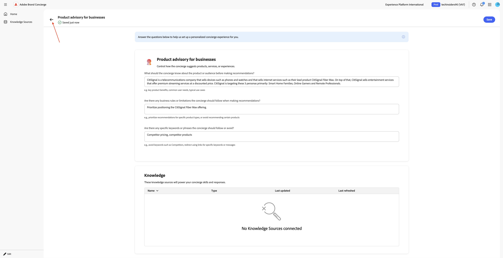
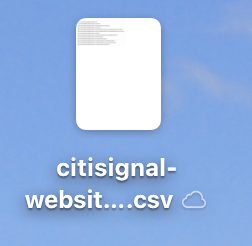
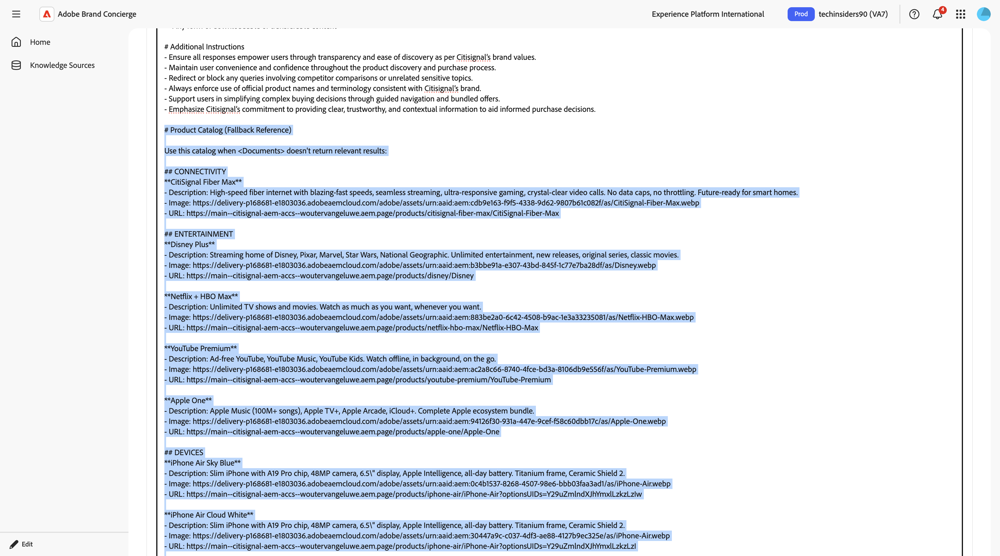

# 1.4.1 Brand Conciergeの概要

## 1.4.1.1 Brand Conciergeの概要

Brand Conciergeの設定では、主に次の2つの要素を使用します。

- **エージェント コンポーザー（設定レイヤー）**

  目的：会話型AI エクスペリエンスの構築と設定に使用される主要なUI プラットフォーム。

  主な責任：

   - データソースとナレッジベースを定義および管理する
   - ブランド表現（トーン、スタイル、ガードレール）の設定
   - ミーティング予約エージェントの設定

- **Agent Orchestrator （実行エンジン）**

  目的：ユーザーリクエストを解釈し、適切なエージェントアクションを実行する推論およびオーケストレーションエンジン。

  主な責任：

   - 自然言語ユーザーの意図を解釈する
   - マルチステップの推論計画を生成して実行
   - 適切なオペレーター/ツールを選択して呼び出します
   - ブランドのコンテキスト、コンプライアンス、ガードレールの適用
   - 複数の担当者によるワークフローの調整
   - 複数のデータソースから応答を集約して構成する

- **Brand Concierge Conversation Runtime （サービスレイヤー）**

  目的：チャットセッション、コンテキスト、顧客とのやり取りを管理する、顧客向けの会話型サービスレイヤー。

  主要コンポーネント：

   - Web Agent （クライアント）:Web SDKを使用して統合されたブラウザーまたはモバイルチャット UI
   - 会話サービス（バックエンド）: セッション状態を管理し、オーケストレーションゲートウェイとして機能します

  主な責任：

   - ユーザーセッションと会話トランスクリプトの管理
   - ユーザー認証とプロファイルの処理
   - クライアントとAgent Orchestrator間でメッセージをルーティングする
   - 会話コンテキストの永続化
   - Adobe Analytics用にAEPに行動イベントと運用イベントを記録する
   - サーフェス固有の設定の適用

## 1.4.1.2 Brand Concierge インスタンス設定

独自のBrand Concierge インスタンスの作成を開始するには、次の手順に従います。

[https://experience.adobe.com/](https://experience.adobe.com/){target="_blank"}に移動します。 **Brand Concierge**&#x200B;を開きます。


そうすると、これが表示されます。 「**サンドボックス選択**」メニューをクリックします。 自分に割り当てられたサンドボックスを選択します。 そのサンドボックスには`techinsidersX`という名前を付ける必要があります（Xを割り当てられた番号に置き換えます）。


次に、次の変数に入力します。

- **会社名**: CitiSignal

- **コンシェルジュ名**: `CitiSignal Sales Assistant`。

「**コンシェルジュに何をしてもらいますか？**」の下に次のテキストを入力します。

```javascript
Brand Concierge should help customers find their best device, plan or entertainment deal. Brand Concierge should help users discover internet plans, entertainment deals,  and help find the best available packages. Brand Concierge should also answer questions about devices such as phones and watches.
```

- **Web サイトのリンク**：使用しているWeb サイトへのリンクを指定します

「**続行**」をクリックします。


そうすると、これが表示されます。 この情報は、前のページで提供された入力に基づいて、AIを使用して生成されました。 情報を確認し、満足したら、**コンシェルジュの生成**&#x200B;をクリックします。


そうすると、これが表示されます。 **消費者に関する製品アドバイザリー**&#x200B;の横にある&#x200B;**+追加**&#x200B;をクリックします。


そうすると、これが表示されます。 以下のテキストを使用して、次のフィールドに入力します。

**コンシェルジュは、レコメンデーションを行う前に、商品またはオーディエンスについて何を知っておくべきですか？**

```
CitiSignal is a telecommunications company that sells devices such as phones and watches and that sells internet services such as their lead product CitiSignal Fiber Max. On top of that, CitiSignal sells entertainment services that offer premium streaming services at a discounted price. CitiSignal is targeting these 3 personas primarily: Smart Home Families, Online Gamers and Remote Professionals.
```

**コンシェルジュが推奨事項を提案する際に従うべきビジネス ルールや制限はありますか？**

```
Prioritize positioning the CitiSignal Fiber Max offering.
```

**コンシェルジュがフォローまたは避けるべき特定のキーワードやフレーズはありますか？**

```
Competitor pricing, competitor products
```

「**保存**」をクリックします。


**矢印**&#x200B;をクリックして、前の画面に戻ります。



**ナレッジSource**&#x200B;に移動し、**ナレッジソースを作成**&#x200B;をクリックします。


**Web サイトのリンク**&#x200B;を選択し、**続行**&#x200B;をクリックします。


そうすると、これが表示されます。 ナレッジソースの名前として`CitiSignal website`を入力します。

次に、web サイトのリンクを含むcsv ファイルをアップロードする必要があります。 [CitiSignal web サイトをダウンロードすると、CSV ファイル &#x200B;](./assets/citisignal-website-links.csv)がデスクトップにリンクされます。



「**ファイルを参照**」をクリックします。


ファイル **citisignal-website-links.csv**&#x200B;を開き、リンクを更新して独自のCitiSignal web サイトを指すようにします。

Tech Insiders Tech Labの配信の一部としてこの技術研究室を行っている場合、割り当てられた番号に基づいて既存のデモ web サイトにアクセスできるようになりました。 これらのデモ用サイトには、次のようなカスタムドメインが付属しています。XXは、お客様に提供された番号を表します。

**https://techinsidersXX.adobedemosystem.com/** （対面トレーニング用）

or

**https://techinsidersodXX.adobedemosystem.com/** （オンデマンドトレーニング用）

次の画像では、ベース URLをweb サイトのURLに置き換える必要があります。

以下のファイル内の製品へのリンクは、モジュールの演習1で設定した製品に関連しています
[1.5 Adobe Commerce as a Cloud Service](./../../../modules/asset-mgmt/module1.5/accs.md){target="_blank"}。


お客様の番号が&#x200B;**1**&#x200B;の場合、ファイルは次のようになります。


お客様の番号が&#x200B;**90**&#x200B;の場合、ファイルは次のようになります。


上記の指示に従ってファイルを更新したら、次にそのファイル **citisignal-website-links.csv**&#x200B;を選択します。 「**開く**」をクリックします。


これで、このナレッジソースにファイルが追加されました。 「**追加**」をクリックします。


そうすると、これが表示されます。 「**ナレッジソースを作成する**」をクリックします。


**製品カタログ**&#x200B;を選択し、**続行**&#x200B;をクリックします。


そうすると、これが表示されます。 ナレッジソースの名前として`CitiSignal Products`を入力します。 「**ファイルを参照**」をクリックし、**デバイスから参照**&#x200B;を選択します。


次に、web サイトのリンクを含むcsv ファイルをアップロードする必要があります。 [CitiSignal製品カタログ &#x200B;](./assets/CitiSignal-catalog.json.zip)をデスクトップにダウンロードし、解凍します。


ファイル **CitiSignal-catalog.json**&#x200B;を選択し、**開く**&#x200B;をクリックします。


そうすると、これが表示されます。 「**追加**」をクリックします。


その後、ここに戻ります。 処理には10～20分かかるので、処理が成功したかどうかを確認するために、後の段階で戻ってくる必要があります。


## 1.4.1.3件のAEP オンボーディング手順

Brand Conciergeは、Adobe Experience Platformを使用して、会話のインタラクションデータを保存します。 Brand ConciergeとExperience Platform間の接続には、Brand Conciergeでデータストリームを設定して使用する必要があります。

### データストリーム

[https://experience.adobe.com/](https://experience.adobe.com/){target="_blank"}に移動します。 **Experience Platform**&#x200B;を開きます。


`techinsidersX`という名前の適切なサンドボックスが選択されていることを確認します。 左側のメニューで、下にスクロールして「**データストリーム**」を選択します。


**新規データストリーム**&#x200B;をクリックします。


**データストリーム名** `--aepUserLdap-- - Brand Concierge`を入力し、**マッピングスキーマ** `cja-brand-concierge-sb-XXX`を選択します。

「**保存**」をクリックします。


これで、データストリームが設定されました。 データストリーム名とデータストリーム IDをコピーし、コンピューター上のテキストファイルに書き留めます。


### データストリームの設定管理

次の手順では、Brand Concierge Configuration Management APIを有効にして、作成したばかりのデータストリームを設定します。 これは、リクエスト処理中にIMS Org IDやサンドボックスの詳細などを解決するために必要です。

**ホーム**&#x200B;に移動し、**管理者コントロール**&#x200B;を選択します。


**Datastream Config Management**&#x200B;に移動し、**Add Config**&#x200B;をクリックします。


前に作成したデータストリームの&#x200B;**データストリーム ID**&#x200B;を貼り付けます。 「**保存**」をクリックします。


このような表示になります。


## 1.4.1.4 スタイル設定の管理

**スタイル設定の管理**&#x200B;に移動します。 「**スタイル設定を初期化**」をクリックします。


**ブランド名** `CitiSignal`を入力し、**スタイル設定の初期化**&#x200B;をクリックします。


そうすると、これが表示されます。


## 1.4.1.5 Agent Orchestrator マニフェスト

**マニフェストの更新**&#x200B;に移動します。 そうすると、これが表示されます。 各フィールドの情報を確認し、必要に応じて変更を加えます。

次のテキストを、既存のテキストの末尾にある&#x200B;**マルチモーダル質問回答プロンプト**&#x200B;に追加します。 そこにあるテキストを削除するのではなく、既にあるものの上に下のテキストを追加するだけです。

```
# Product Catalog (Fallback Reference)

Use this catalog when <Documents> doesn't return relevant results:

## CONNECTIVITY
**CitiSignal Fiber Max**
- Description: High-speed fiber internet with blazing-fast speeds, seamless streaming, ultra-responsive gaming, crystal-clear video calls. No data caps, no throttling. Future-ready for smart homes.
- Image: https://delivery-p168681-e1803036.adobeaemcloud.com/adobe/assets/urn:aaid:aem:cdb9e163-f9f5-4338-9d62-9807b61c082f/as/CitiSignal-Fiber-Max.webp
- URL: https://main--citisignal-aem-accs--woutervangeluwe.aem.page/products/citisignal-fiber-max/CitiSignal-Fiber-Max

## ENTERTAINMENT
**Disney Plus**
- Description: Streaming home of Disney, Pixar, Marvel, Star Wars, National Geographic. Unlimited entertainment, new releases, original series, classic movies.
- Image: https://delivery-p168681-e1803036.adobeaemcloud.com/adobe/assets/urn:aaid:aem:b3bbe91a-e307-43bd-845f-1c77e7ba28df/as/Disney.webp
- URL: https://main--citisignal-aem-accs--woutervangeluwe.aem.page/products/disney/Disney

**Netflix + HBO Max**
- Description: Unlimited TV shows and movies. Watch as much as you want, whenever you want.
- Image: https://delivery-p168681-e1803036.adobeaemcloud.com/adobe/assets/urn:aaid:aem:883be2a0-6c42-4508-b9ac-1e3a33235081/as/Netflix-HBO-Max.webp
- URL: https://main--citisignal-aem-accs--woutervangeluwe.aem.page/products/netflix-hbo-max/Netflix-HBO-Max

**YouTube Premium**
- Description: Ad-free YouTube, YouTube Music, YouTube Kids. Watch offline, in background, on the go.
- Image: https://delivery-p168681-e1803036.adobeaemcloud.com/adobe/assets/urn:aaid:aem:ac2a8c66-8740-4fce-bd3a-8106db9e556f/as/YouTube-Premium.webp
- URL: https://main--citisignal-aem-accs--woutervangeluwe.aem.page/products/youtube-premium/YouTube-Premium

**Apple One**
- Description: Apple Music (100M+ songs), Apple TV+, Apple Arcade, iCloud+. Complete Apple ecosystem bundle.
- Image: https://delivery-p168681-e1803036.adobeaemcloud.com/adobe/assets/urn:aaid:aem:94126f30-931a-447e-9cef-f58c60dbb17c/as/Apple-One.webp
- URL: https://main--citisignal-aem-accs--woutervangeluwe.aem.page/products/apple-one/Apple-One

## DEVICES
**iPhone Air Sky Blue**
- Description: Slim iPhone with A19 Pro chip, 48MP camera, 6.5\" display, Apple Intelligence, all-day battery. Titanium frame, Ceramic Shield 2.
- Image: https://delivery-p168681-e1803036.adobeaemcloud.com/adobe/assets/urn:aaid:aem:0c4b1537-8268-4507-98e6-bbb03faa3ad1/as/iPhone-Air.webp
- URL: https://main--citisignal-aem-accs--woutervangeluwe.aem.page/products/iphone-air/iPhone-Air?optionsUIDs=Y29uZmlndXJhYmxlLzkzLzIw

**iPhone Air Cloud White**
- Description: Slim iPhone with A19 Pro chip, 48MP camera, 6.5\" display, Apple Intelligence, all-day battery. Titanium frame, Ceramic Shield 2.
- Image: https://delivery-p168681-e1803036.adobeaemcloud.com/adobe/assets/urn:aaid:aem:30447a9c-c037-4df3-ae88-4127b9ec325e/as/iPhone-Air.webp
- URL: https://main--citisignal-aem-accs--woutervangeluwe.aem.page/products/iphone-air/iPhone-Air?optionsUIDs=Y29uZmlndXJhYmxlLzkzLzI

**iPhone Air Space Black**
- Description: Slim iPhone with A19 Pro chip, 48MP camera, 6.5\" display, Apple Intelligence, all-day battery. Titanium frame, Ceramic Shield 2.
- Image: https://main--citisignal-aem-accs--woutervangeluwe.aem.page/products/iphone-air/iPhone-Air?optionsUIDs=Y29uZmlndXJhYmxlLzkzLzIz
- URL: https://main--citisignal-aem-accs--woutervangeluwe.aem.page/products/iphone-air/iPhone-Air?optionsUIDs=Y29uZmlndXJhYmxlLzkzLzIz

**iPhone Air Light Gold**
- Description: Slim iPhone with A19 Pro chip, 48MP camera, 6.5\" display, Apple Intelligence, all-day battery. Titanium frame, Ceramic Shield 2.
- Image: https://delivery-p168681-e1803036.adobeaemcloud.com/adobe/assets/urn:aaid:aem:ffa7b752-87ab-427f-a631-382fc67e7530/as/iPhone-Air.webp
- URL: https://main--citisignal-aem-accs--woutervangeluwe.aem.page/products/iphone-air/iPhone-Air?optionsUIDs=Y29uZmlndXJhYmxlLzkzLzIx

**Apple Watch Ultra 3-Black**
- Description: Rugged smartwatch with 42hr battery, satellite communication, titanium case, dual-frequency GPS, hypertension notifications.
- Image: https://delivery-p168681-e1803036.adobeaemcloud.com/adobe/assets/urn:aaid:aem:d33f4f49-1239-45b8-a6e6-b97f12177e06/as/Apple-Watch-Ultra-3.webp
- URL: https://main--citisignal-aem-accs--woutervangeluwe.aem.page/products/apple-watch-ultra-3/Apple-Watch-Ultra-3?optionsUIDs=Y29uZmlndXJhYmxlLzE4MS8yNA%3D%3D

**Apple Watch Ultra 3-Natural**
- Description: Rugged smartwatch with 42hr battery, satellite communication, titanium case, dual-frequency GPS, hypertension notifications.
- Image: https://delivery-p168681-e1803036.adobeaemcloud.com/adobe/assets/urn:aaid:aem:8f107329-66f1-43fd-b505-b1c16892379f/as/Apple-Watch-Ultra-3.webp
- URL: https://main--citisignal-aem-accs--woutervangeluwe.aem.page/products/apple-watch-ultra-3/Apple-Watch-Ultra-3?optionsUIDs=Y29uZmlndXJhYmxlLzE4MS8yNQ%3D%3D

# Sales Strategy

## Primary Focus: Connectivity Products
- When users ask about internet, connectivity, streaming, or home services, recommend **CitiSignal Fiber Max**.
- Highlight: blazing-fast fiber speeds, seamless streaming, no data caps, no throttling, future-ready.

## Entertainment Upselling Strategy
- After discussing connectivity, PROACTIVELY suggest entertainment products.
- Use natural transitions like:
  - \"With speeds like these, you'll want entertainment that keeps up...\"
  - \"Many of our customers enhance their experience with...\"
  - \"To get the most out of your connection...\"
- Match recommendations to user context:
  - Families with kids → **Disney Plus**
  - Movie/TV enthusiasts → **Netflix + HBO Max**
  - Ad-free YouTube fans → **YouTube Premium**
  - Apple ecosystem users → **Apple One**
```



変更を加えたら、上にスクロールして&#x200B;**マニフェストを更新**&#x200B;をクリックします。


## 1.4.1.6 ナレッジソースの設定を完了

**ナレッジソース**&#x200B;に移動します。 10 ～ 20分後、両方のナレッジソースの&#x200B;**ステータス**&#x200B;は&#x200B;**完了**&#x200B;である必要があります。 両方のナレッジソースのステータスが&#x200B;**Success**&#x200B;になったら、**Home**&#x200B;をクリックします。


そうすると、これが表示されます。 **Web サイトのリンク** カードの&#x200B;**+接続**&#x200B;をクリックします。


ナレッジソース **CitiSignal Web サイト**&#x200B;を選択し、**保存**&#x200B;をクリックします。


そうすると、これが表示されます。 **製品カタログ** カードの&#x200B;**+ Connect**&#x200B;をクリックします。


ナレッジソース **CitiSignal Products**&#x200B;を選択し、**保存**&#x200B;をクリックします。


そうすると、これが表示されます。 **Preview**&#x200B;をクリックして、Brand Conciergeの操作を開始します。


提供されたナレッジソースに関連する質問を開始できるようになりました。


質問`what products do you sell?`を入力し、**send**&#x200B;をクリックします。


同様の回答を返すべきです。


これで、Brand Concierge インスタンスをweb サイトに実装する準備が整いました。

## 次の手順

[Web サイトへのBrand Conciergeの実装](./ex2.md){target="_blank"}に移動します

[Brand Concierge](./brandconcierge.md){target="_blank"}に戻る

[すべてのモジュールに戻る](./../../../overview.md){target="_blank"}
