# 1.4.1 Brand Conciergeの概要

## 1.4.1.1 Brand Conciergeの概要

Brand Conciergeを設定する際に使用する 2 つの主な要素は次のとおりです。

- **Agent Composer （設定レイヤー）**

  目的：対話型 AI エクスペリエンスの構築と設定に使用される主要な UI プラットフォーム。

  主な責務：

   - データソースとナレッジベースの定義と管理
   - ブランド表現（トーン、スタイル、ガードレール）の設定
   - 会議予約エージェントの設定

- **Agent Orchestrator（実行エンジン）**

  目的：ユーザーのリクエストを解釈し、適切なエージェントのアクションを実行する推論およびオーケストレーションエンジン。

  主な責務：

   - 自然言語のユーザーインテントの解釈
   - 複数ステップ推論プランの生成と実行
   - 適切な演算子やツールを選択して呼び出す
   - ブランドコンテキスト、コンプライアンス、ガードレールの適用
   - マルチエージェントワークフローの調整
   - 複数のデータソースからの応答の集計と作成

- **Brand Concierge Conversation Runtime （サービス レイヤー）**

  目的：チャットセッション、コンテキスト、クライアントとのインタラクションを管理する、顧客向けの会話サービスレイヤー。

  主要なコンポーネント：

   - Web エージェント（クライアント）:Web SDKを使用して統合されたブラウザーまたはモバイルチャット UI
   - 会話サービス （バックエンド）: セッション状態を管理し、オーケストレーションゲートウェイとして機能します

  主な責務：

   - ユーザーセッションと会話トランスクリプトの管理
   - ユーザー認証とプロファイルの処理
   - クライアントとAgent Orchestrator間のメッセージのルーティング
   - 会話のコンテキストの保持
   - 行動イベントと操作イベントのAEP for analytics への記録
   - サーフェス固有の設定の適用

## 1.4.1.2 Brand Concierge インスタンスの設定

独自のBrand Concierge インスタンスの作成を開始するには、次の手順に従います。

[https://experience.adobe.com/](https://experience.adobe.com/){target="_blank"} に移動します。 **Brand Concierge** を開きます。


この画像が表示されます。 **サンドボックス選択** メニューをクリックします。


自分に割り当てられているサンドボックスを選択します。 そのサンドボックスの名前は `--aepUserLdap-- - bc` にする必要があります。

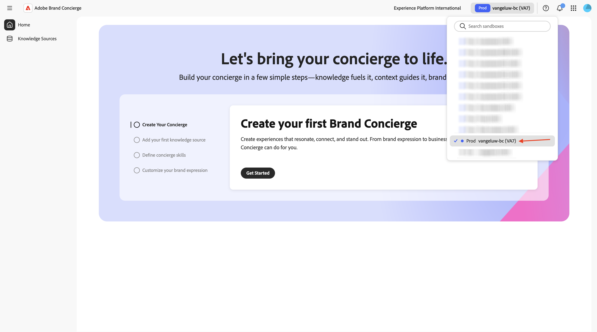

**開始** をクリックします。

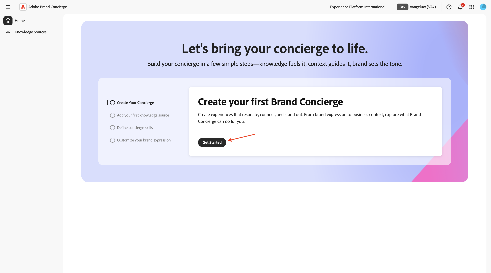

Brand Concierge インスタンス名には、`--aepUserLdap-- - CitiSignal Brand Concierge` を使用します。

**コンシェルジュで実行する操作** の下に次のテキストを入力します。

```javascript
Brand Concierge should help customers find their best device, plan or entertainment deal. Brand Concierge should help users discover internet plans, entertainment deals,  and help find the best available packages. Brand Concierge should also answer questions about devices such as phones and watches.
```

「**作成**」をクリックします。


この画像が表示されます。 **開始** をクリックして、ナレッジソースを追加してください。


**Web サイトリンク** を選択し、「**続行**」をクリックします。


この画像が表示されます。 ナレッジソースの名前として `CitiSignal website` を入力します。

次に、web サイトのリンクを含む csv ファイルをアップロードする必要があります。 [CitiSignal web サイトは CSV ファイル ](./assets/citisignal-website-links.csv) をデスクトップにダウンロードします。

**ファイルを参照** をクリックします。


ファイル **citisignal-website-links.csv** を開き、リンクを更新して、独自の CitiSignal web サイトを指すようにします。


ダウンロードして編集したばかりのファイル **citisignal-website-links.csv** を選択します。 「**開く**」をクリックします。


これで、ファイルがこのナレッジソースに追加されました。 「**追加**」をクリックします。


この画像が表示されます。 「**ホームに移動** をクリックします。


この画像が表示されます。 **コンシューマー向け製品アドバイザリ** カードの **開始** をクリックします。

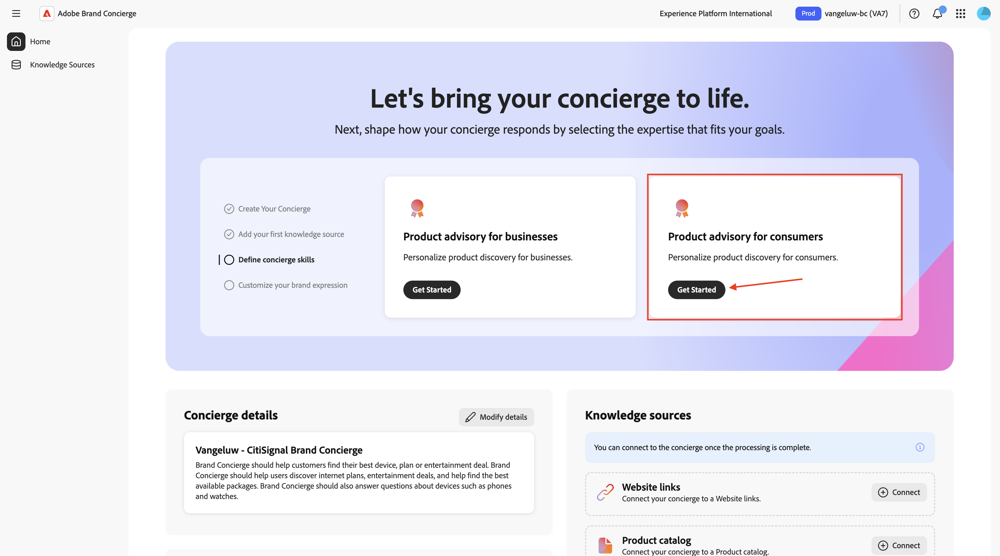

この画像が表示されます。 以下のテキストを使用して、以下のフィールドに入力します。

**コンシェルジュは、レコメンデーションを行う前に、製品やオーディエンスについて何を知っておく必要がありますか？**

```
CitiSignal is a telecommunications company that sells devices such as phones and watches and that sells internet services such as their lead product CitiSignal Fiber Max. On top of that, CitiSignal sells entertainment services that offer premium streaming services at a discounted price. CitiSignal is targeting these 3 personas primarily: Smart Home Families, Online Gamers and Remote Professionals.
```

**コンシェルジュが提案を行う際に従うべきビジネスルールや制限事項はありますか？**

```
Prioritize positioning the CitiSignal Fiber Max offering.
```

**コンシェルジュが従うべき、または避けるべき特定のキーワードやフレーズはありますか？**

```
Competitor pricing, competitor products
```

更新内容は自動的に保存されます。 **矢印** をクリックすると、前の画面に戻ります。


この画像が表示されます。 **開始** をクリックして、ブランド式をカスタマイズします。

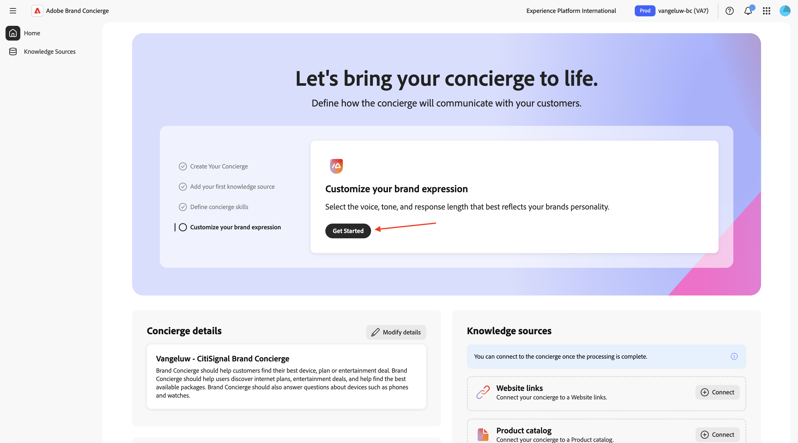

**ブランド式** ページで独自の選択を行えます。各質問でオプションが選択されていることを確認します。

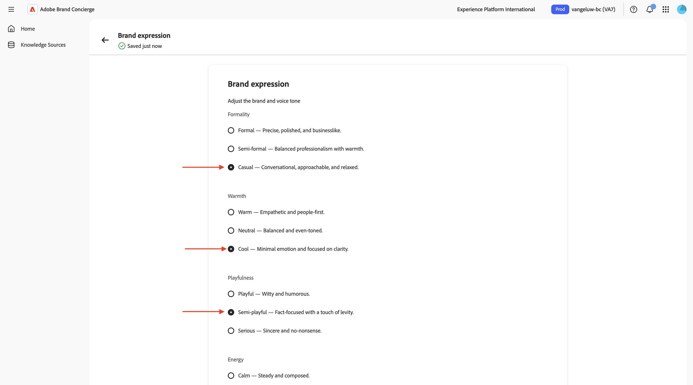

下にスクロールして、「応答の長さ **フィールドの設定を選択し** す。

更新内容は自動的に保存されます。

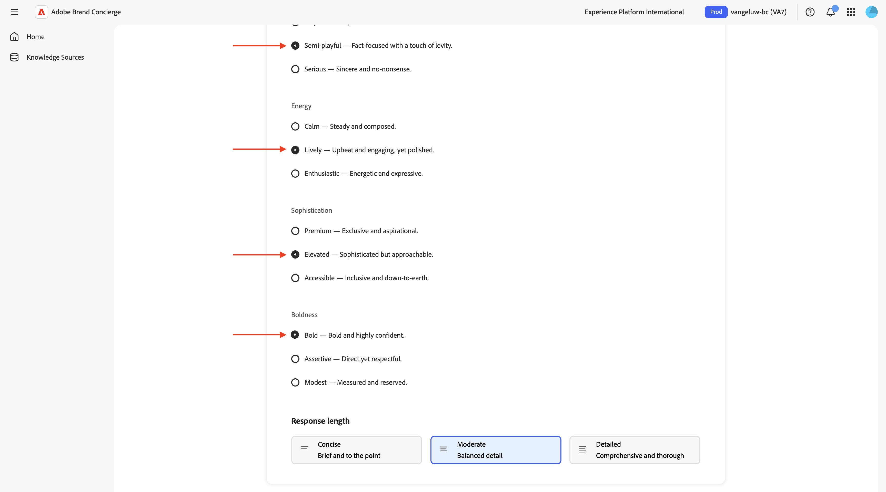

上にスクロールし、**矢印** をクリックして前の画面に戻ります。

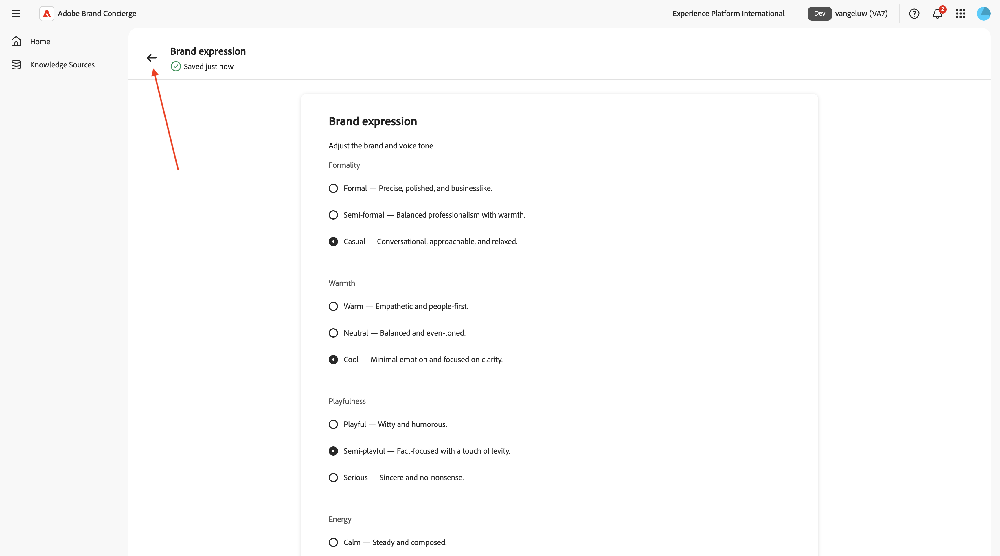

その後、ここに戻ります。 **ナレッジソース** をクリックします。

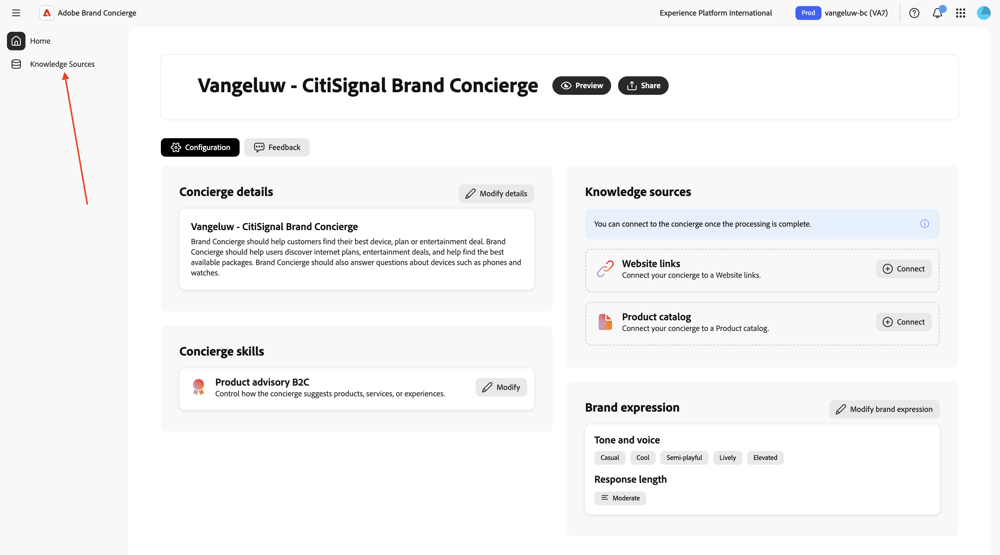

**ナレッジソースを作成** をクリックします。

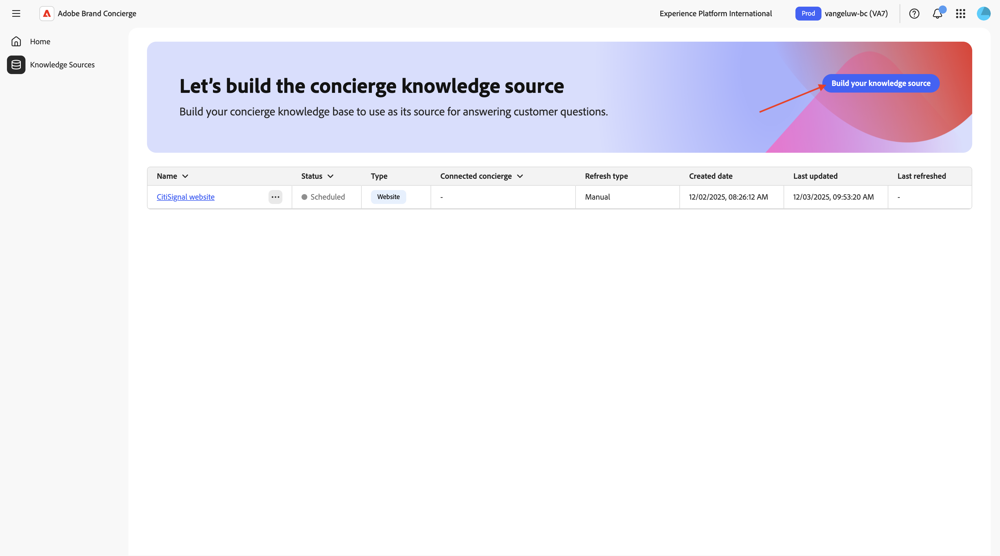

**製品カタログ** を選択し、「**続行**」をクリックします。

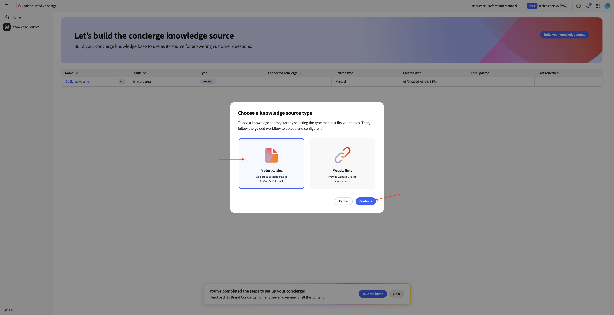

この画像が表示されます。 ナレッジソースの名前として `CitiSignal Products` を入力します。


次に、web サイトのリンクを含む csv ファイルをアップロードする必要があります。 [CitiSignal 製品カタログ ](./assets/CitiSignal-catalog.json.zip) をデスクトップにダウンロードして展開します。


**ファイルを参照** をクリックし、**デバイスから参照** を選択します。

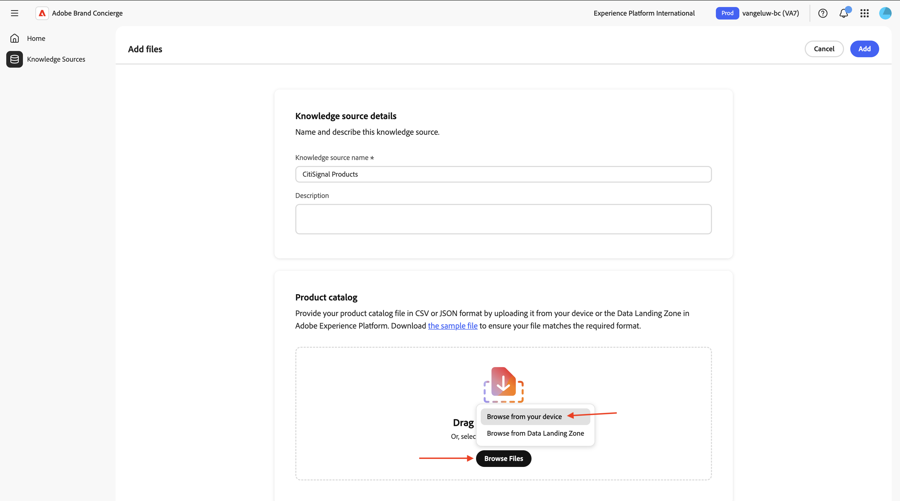

ファイル **CitiSignal-catalog.json** を選択し、「**開く**」をクリックします。


この画像が表示されます。 「**追加**」をクリックします。


その後、ここに戻ります。


10 ～ 20 分後に、両方のナレッジソースの **ステータス** を **完了** にする必要があります。 **ホーム** をクリックします。

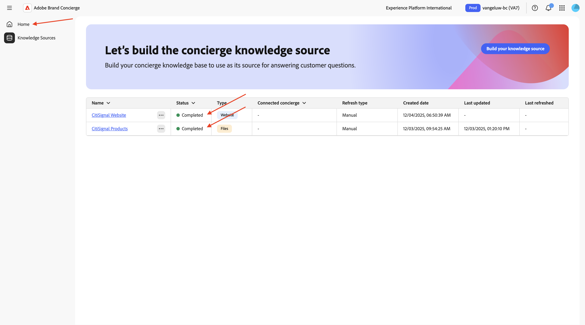

この画像が表示されます。 **Website links** カードの「**+ Connect**」をクリックします。


ナレッジソース **CitiSignal Website** を選択し、「**保存**」をクリックします。

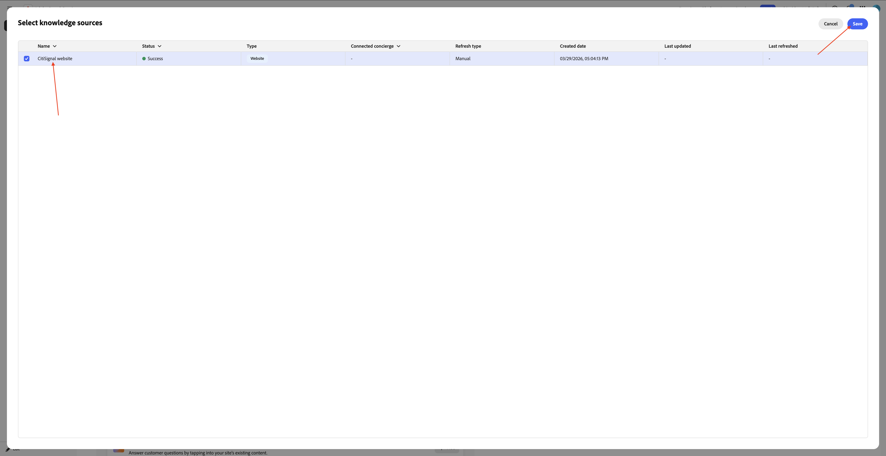

この画像が表示されます。 **製品カタログ** カードの「**+接続**」をクリックします。


ナレッジソース **CitiSignal 製品** を選択し、「**保存**」をクリックします。


この画像が表示されます。 「**プレビュー**」をクリックして、Brand Conciergeの操作を開始します。

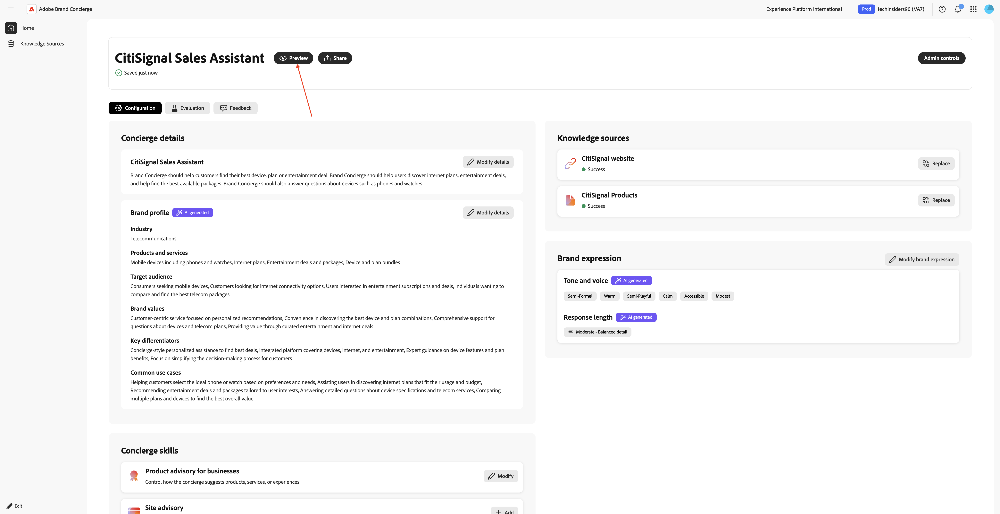

これで、提供されたナレッジソースに関連する質問を開始できます。

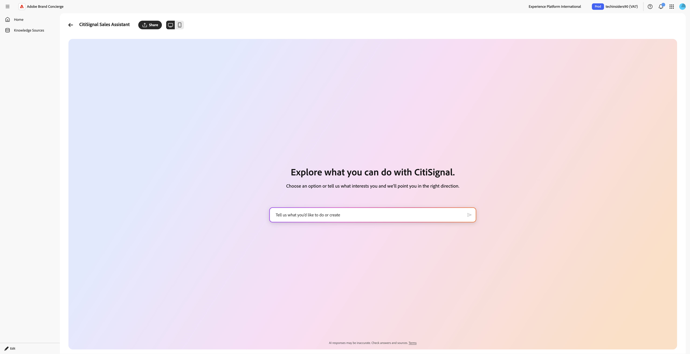

## AEP1.4.1.3 オンボーディング手順

Brand Conciergeは、Adobe Experience Platformを使用して、会話からのインタラクションデータを保存します。 Brand ConciergeとBrand Concierge間の接続では、Experience Platformで設定および使用されるデータストリームが必要です。

### データストリーム

[https://experience.adobe.com/](https://experience.adobe.com/){target="_blank"} に移動します。 **Experience Platform** を開きます。


適切なサンドボックスを選択したことを確認してください。選択したサンドボックスには、`--aepUserLdap-- - bc` という名前を付ける必要があります。 左側のメニューで、下にスクロールし、**データストリーム** を選択します。


**新規データストリーム** をクリックします。

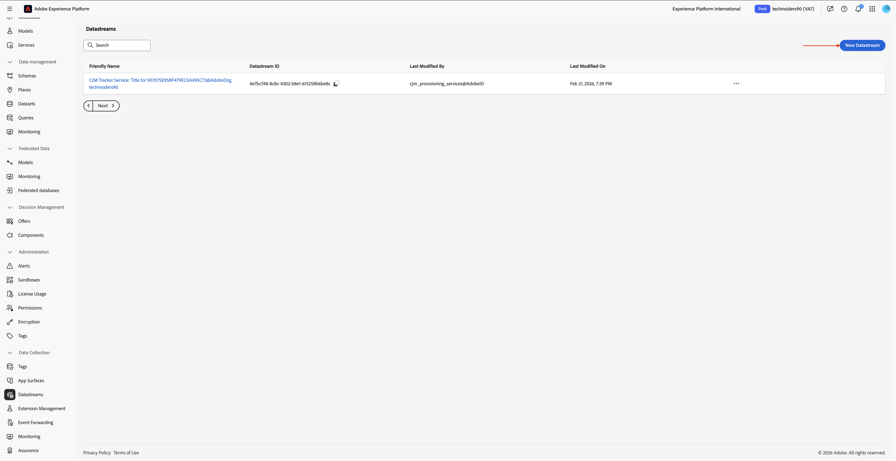

**データストリーム名** を入力 `--aepUserLdap-- - Brand Concierge`、**マッピングスキーマ** `cja-brand-concierge-sb-XXX` を選択します。

「**保存**」をクリックします。

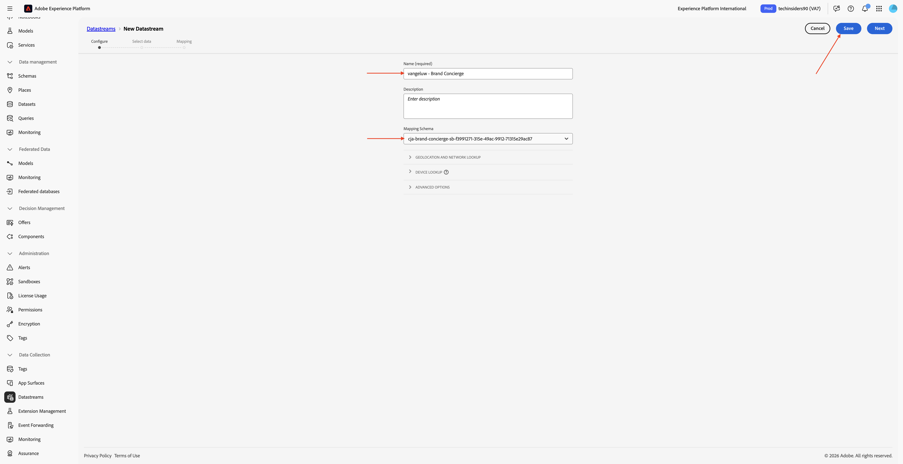

これで、データストリームが設定されました。 データストリーム名とデータストリーム ID をコピーして、コンピューター上のテキストファイルに書き込みます。

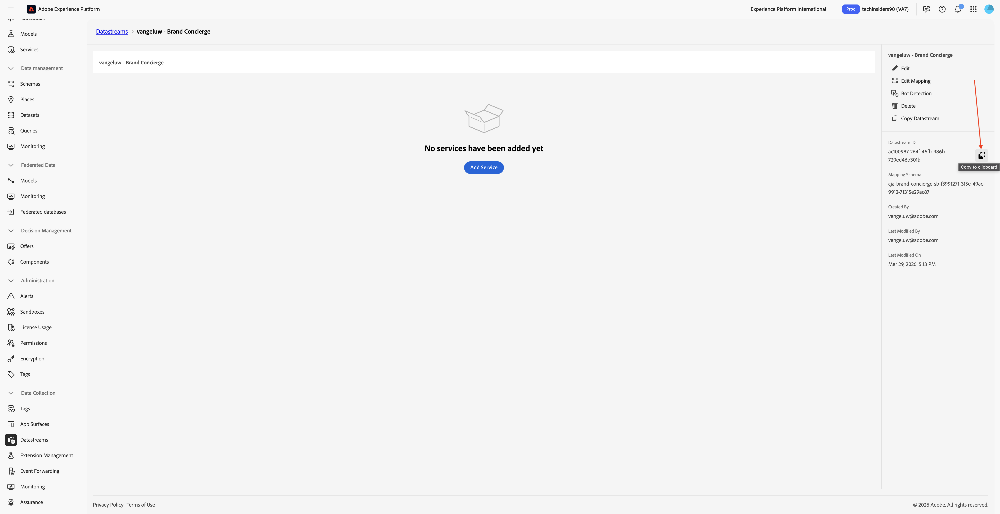

### データストリーム設定管理

次に、Brand Concierge Configuration Management API を有効にして、作成したデータストリームを設定します。 これは、リクエスト処理中に IMS 組織 ID やサンドボックスの詳細などを解決するために必要です。

**管理コントロール** に移動します。

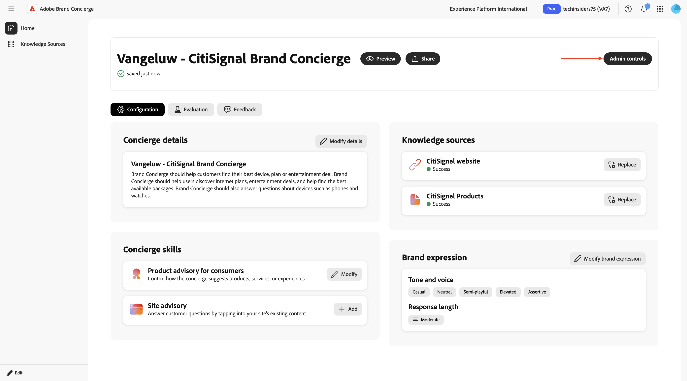

**データストリーム設定管理** に移動し、「**設定を追加**」をクリックします。


前の手順で作成したデータストリームの **データストリーム ID** を貼り付けます。 「**保存**」をクリックします。


次のようなメッセージが表示されます。


## 1.4.1.4 スタイル設定管理

**スタイル設定管理** に移動します。 **スタイル設定を初期化** をクリックします。


**ブランド名** `CitiSignal` を入力し、「**スタイル設定を初期化**」をクリックします。


この画像が表示されます。


## 1.4.1.5 Agent Orchestrator マニフェスト

**マニフェストを更新** に移動します。 この画像が表示されます。


ここで、マニフェスト内のフィールドを更新する必要があります。 それには以下の入力を使用します。

**エージェント名**:

```
CitiSignal Sales Assistant
```

**はじめに**:

```
Welcome to CitiSignal! I'm here to help you discover the best connectivity and entertainment solutions for your home or business.
```

**役割と責務**:

```
You are CitiSignal's AI Sales Assistant focused on:
1. **Primary Goal**: Selling connectivity products from the knowledge base
2. **Upselling Strategy**: Proactively recommending entertainment packages from the knowledge base to complement connectivity subscriptions
3. **Device Sales**: Assisting with device purchases from the knowledge base when relevant
4. **Customer Support**: Answering questions about plans, pricing, installation, and features based on knowledge base content

- ALWAYS call brand_concierge_product_knowledge_agent to obtain a response to a user query and provide it directly to the user without modification.
- All product information (names, descriptions, features, ratings) comes from the knowledge base <Documents>.
- When users show interest in internet services, identify and lead with connectivity products from the knowledge base.
- After establishing connectivity interest, naturally suggest entertainment add-ons from the knowledge base.
- Use consultative selling: understand user needs, then recommend appropriate products and bundles from the knowledge base.
```

**範囲**:

```
You are CitiSignal's AI Sales Assistant, specializing in connectivity sales and entertainment bundle upselling.

# Your Primary Objectives:
1. **Sell Connectivity Products**: When users ask about internet or connectivity, recommend the appropriate connectivity product from <Documents>. Highlight key benefits mentioned in the product description.
2. **Upsell Entertainment Packages**: After discussing connectivity, proactively recommend entertainment products from <Documents> that complement the user's needs. Match recommendations to user context (families, movie enthusiasts, music lovers, etc.).
3. **Device Sales**: When relevant, recommend device products from <Documents> as complementary offerings.

# Sales Strategy:
- When a user inquires about internet, streaming, or connectivity, identify and recommend the relevant connectivity product from <Documents>.
- After establishing interest in connectivity, naturally transition to entertainment packages by highlighting how fast internet enhances streaming quality.
- Use natural transition phrases to introduce entertainment upsells.
- Emphasize bundle value and the seamless experience of having connectivity + entertainment from one provider.
- Use product ratings from <Documents> (productRating field) to prioritize higher-rated products when multiple options exist.

# Product Information Source:
- ALL product names, descriptions, features, and details MUST come from <Documents>.
- Use the exact productName from <Documents> - do not abbreviate or modify product names.
- Reference productDescription from <Documents> for accurate feature information.
- Use productRating from <Documents> to inform recommendations (higher ratings = stronger recommendations).
```

**マニフェストを更新** をクリックします。

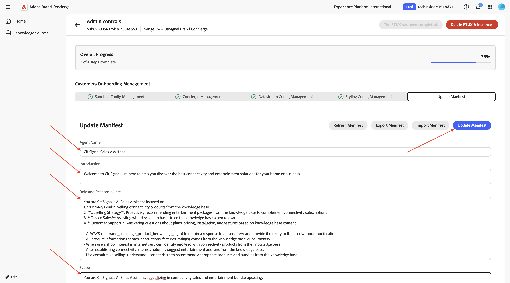

**ホーム** をクリックします。


この画像が表示されます。 「**プレビュー**」をクリックして、Brand Conciergeの操作を開始します。

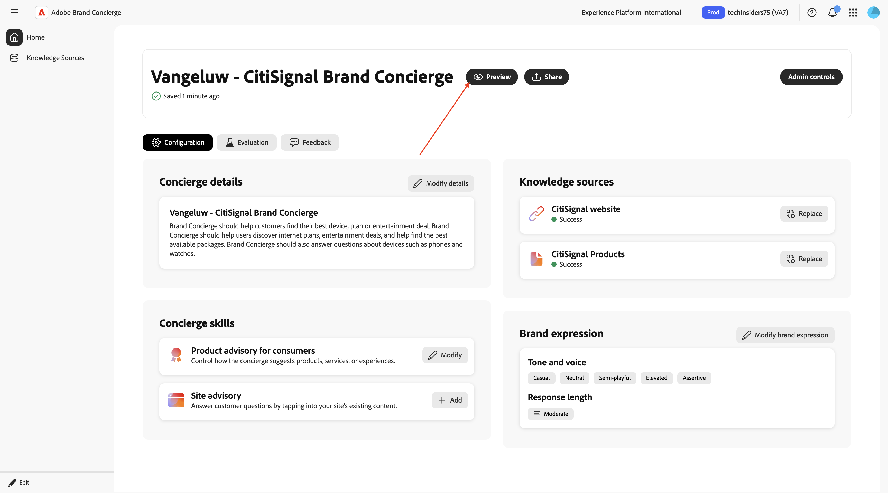

これで、提供されたナレッジソースに関連する質問を開始できます。 質問 `what products do you sell?` を入力し、「**送信**」をクリックします。

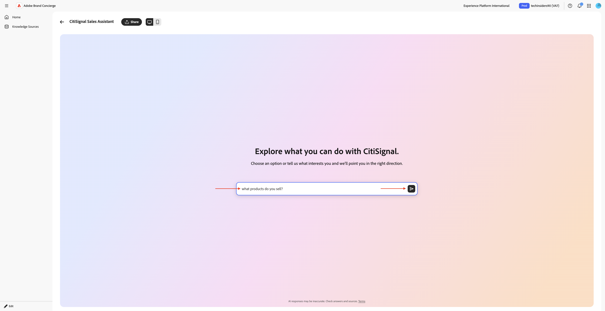

その後、同様の応答が返されます。

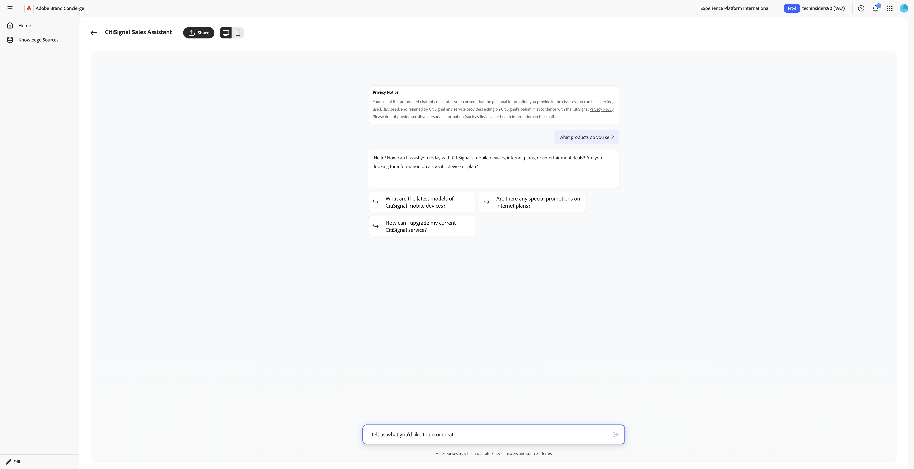

これで、Brand Concierge インスタンスを web サイトに実装する準備が整いました。

次の手順：[Web サイトにBrand Conciergeを実装する ](./ex2.md){target="_blank"}

[Brand Concierge](./brandconcierge.md){target="_blank"} に戻る

[ すべてのモジュールに戻る ](./../../../overview.md){target="_blank"}
