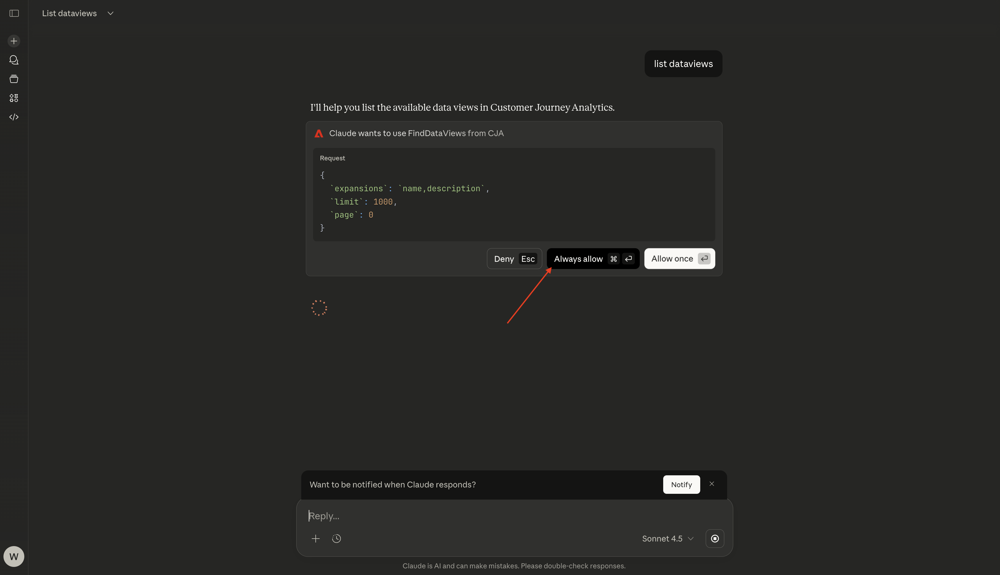
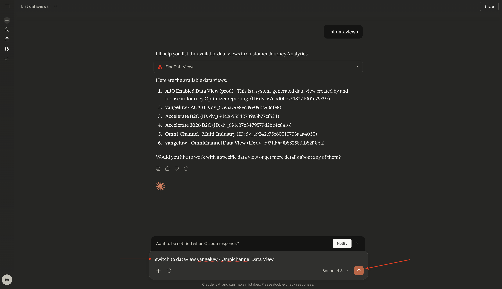
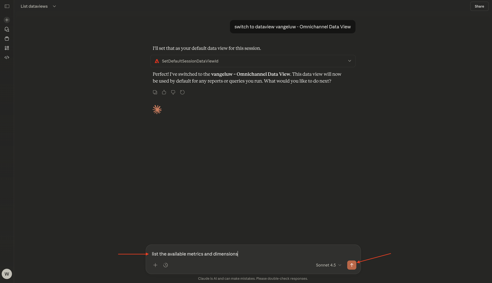
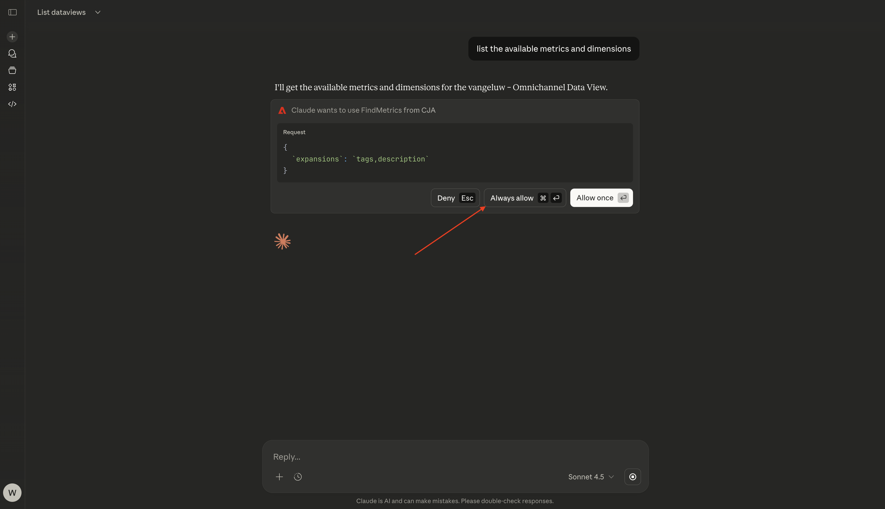
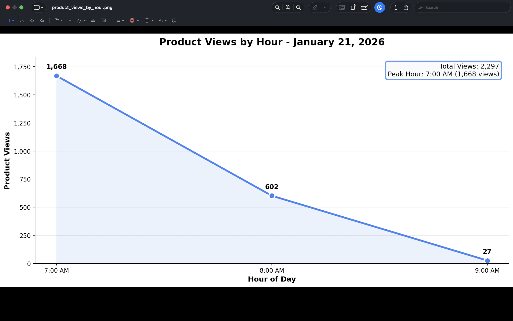
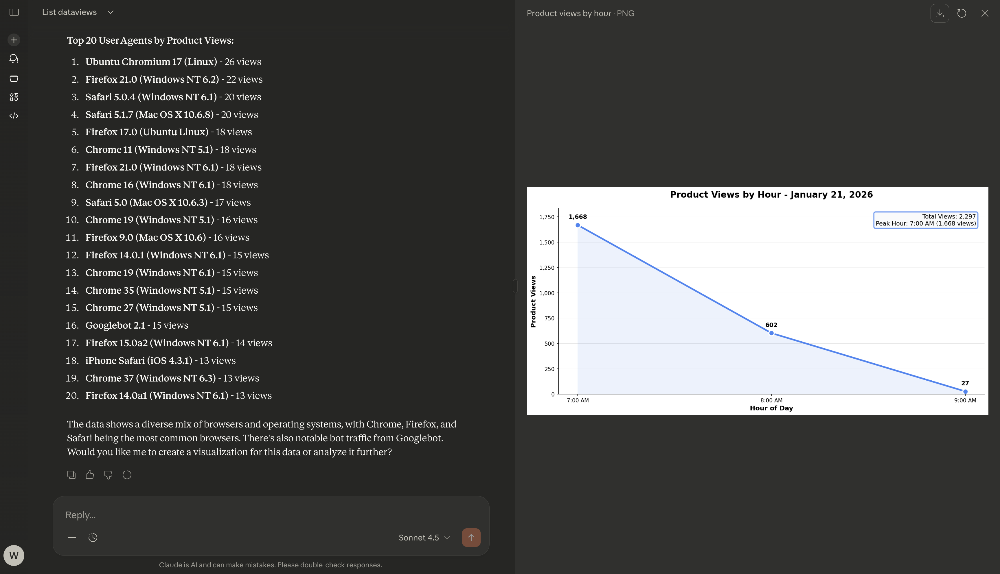

# 1.5.2 MCP サーバを搭載したCJAおよび Claude.ai

[!BADGE Alpha]

+++Alphaの詳細
CJAおよび Claude.ai を MCP サーバーAlphaと併用することにより、お客様は、Alphaが「現状のまま」でいかなる保証もなく提供されていることを承諾します。 Adobeは、Alphaを維持、修正、更新、変更、修正、またはその他の方法でサポートする義務を負いません。 このようなAlphaおよび付属の資料の正しい機能やパフォーマンスに対して、注意を払い、いかなる形でも依存しないことをお勧めします。 AlphaはAdobeの機密情報と見なされます。 お客様がAdobeに提供するあらゆる「フィードバック」（Alphaの使用中に発生した問題や欠陥、提案、改善点、推奨事項を含むがこれに限定されないAlphaに関する情報）は、かかるフィードバックに関するすべての権利、所有権、利益を含め、Adobeに帰属します。

+++


>[!NOTE]
>
>Claude.ai を使用した MCP サーバーの設定とCJAへの接続に関するこの演習は、この演習 [1.1 Customer Journey Analytics:Adobe Experience Platform上でAnalysis Workspaceを使用してダッシュボードを作成する &#x200B;](./../../../modules/reporting-insights/cja-b2c/cjab2c-1/customer-journey-analytics-build-a-dashboard.md) に関連しています。 以下の演習で使用しているCJA データビューと接続は、その演習で設定したデータビューと接続です。 以下の結果をレプリケートする場合は、最初にその手順に従う必要があります。

## ビデオ

このビデオでは、この演習に関係するすべての手順の説明とデモを行います。

>[!VIDEO](https://video.tv.adobe.com/v/3479159?quality=12&learn=on)

## CJA用 1.5.1.1Claude.ai でカスタムアプリを作成する

>[!NOTE]
>
>Claude.ai でCJAを使用するには、次が必要です。
>- Claude.ai の有料版
>- Cloud.ai web クライアントの使用

[https://claude.ai/](https://claude.ai/){target="_blank"} に移動し、アカウントの詳細を使用してログインします。 ログインすると、このが表示されます。 **+** アイコンをクリックします。


**コネクタを追加** を選択します。


「**カスタムオブジェクトを追加**」をクリックします。


次のようにフィールドに入力します。

- **名前**: `CJA`
- **MCP サーバー URL**: Adobe担当者にお問い合わせください

「**追加**」をクリックします。


この画像が表示されます。 「**追加**」をクリックします。


正常に認証されると、次のメッセージが表示されます。 **+** アイコンをクリックして、新しいチャットを開始します。


**+**、**コネクタ** に移動すると、**CJA** コネクタが有効になっていることがわかります。


これで、データ分析を開始する準備が整いました。


## CJAでのコンテキストの 1.5.1.2 定

Cloud.ai を通じてCJAとさらに対話する前に、コンテキストを設定する必要があります。

この演習では、以下を使用するようにコンテキストを設定する必要があります。

- **Dataview**: **—aepUserLdap— - オムニチャネルデータビュー**

データビュー設定は、質問をする際に Cloud.ai が調べるデータビューを特定するのに役立ちます。

次の **プロンプト** を入力し、「**送信**」ボタンをクリックします。

```javascript
list dataviews
```


「**常に許可**」を選択します。



使用可能なデータビューの同様のリストが表示されます。


これを使用する必要があるデータビューに変更するには、次の **プロンプト** を入力し、「**送信**」ボタンをクリックします。

```javascript
switch to dataview --aepUserLdap-- - Omnichannel Data View
```



「**常に許可**」を選択します。


この画像が表示されます。


これでコンテキストが正しく設定され、次に特定のプロンプトの送信を開始できます。

## 1.5.1.3 データビューの調査

>[!NOTE]
>
>ここで使用するデータビューは、演習 [&#x200B; データビューの作成 &#x200B;](./../../../modules/reporting-insights/cja-b2c/cjab2c-1/ex3.md) の一部として設定されています。

次の **プロンプト** を入力し、「**送信**」ボタンをクリックして、使用可能な指標とディメンションを調べます。

```javascript
list the available metrics and dimensions
```



「**常に許可**」を 2 回選択します。1 回目は **指標**、2 回目は **ディメンション** を取得します。



次に、この応答が表示されます。この応答には、演習 [&#x200B; データビューの作成 &#x200B;](./../../../modules/reporting-insights/cja-b2c/cjab2c-1/ex3.md) の一部として設定された指標とディメンションが含まれています。


## 1.5.1.4 フリーフォームテーブル – 製品表示

これで、データの調査を開始できます。 以下のプロンプトを入力して開始し、「**送信**」をクリックして報告書要求を送信します。

```javascript
how many product views happened on January 21, 2026?
```


「**常に許可**」を選択します。


すると、次のような応答が表示されます。


ディメンションを追加することで、応答を分類できるようになりました。 次の **プロンプト** を入力し、「**送信**」ボタンをクリックします。

```javascript
break down product views by product name
```


すると、次のような応答が表示されます。


また、ビジュアライゼーションを作成できるようになりました。 次の **プロンプト** を入力し、「**送信**」ボタンをクリックします。

```javascript
create a line visualization by hour for product views on January 21
```


この画像が表示されます。


この折れ線グラフもダウンロードできるようになりました。 次の **プロンプト** を入力し、「**送信**」ボタンをクリックします。

```javascript
export this chart to PNG
```


この画像が表示されます。 **ダウンロード** をクリックします。


その後、ダウンロードした PNG を開いて、他のドキュメントで使用できます。



次の **プロンプト** を入力し、「**送信**」ボタンをクリックします。

```javascript
can you breakdown product views by user agent?
```


この画像が表示されます。



## 1.5.1.5 フォールアウトビジュアライゼーション

次の **プロンプト** を入力し、「**送信**」ボタンをクリックします。

```javascript
can you create a fallout visualization for the product interaction funnel, starting with all traffic and then in the next steps add Product Views, Add to Cart and purchases?
```


次に、Customer Journey Analyticsから提供されたデータに基づいて Claude.ai によって生成されたビジュアライゼーションを含む、次のようになります。


[Analytics とエージェント &#x200B;](./analyticsagents.md){target="_blank"} に戻る

[&#x200B; すべてのモジュールに戻る &#x200B;](./../../../overview.md){target="_blank"}