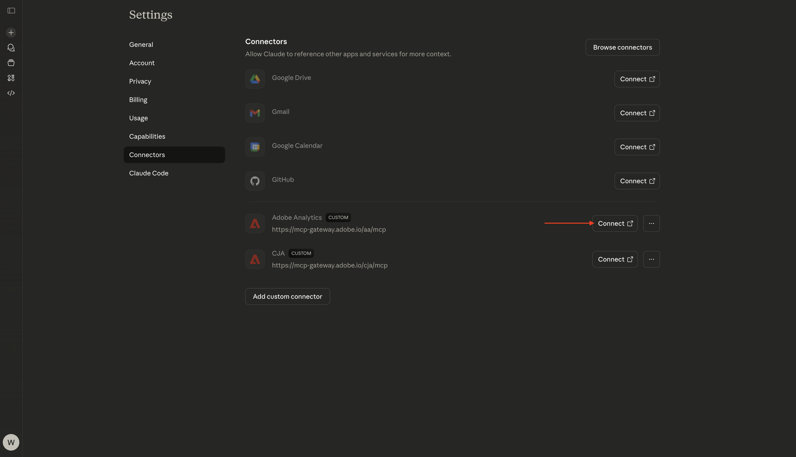
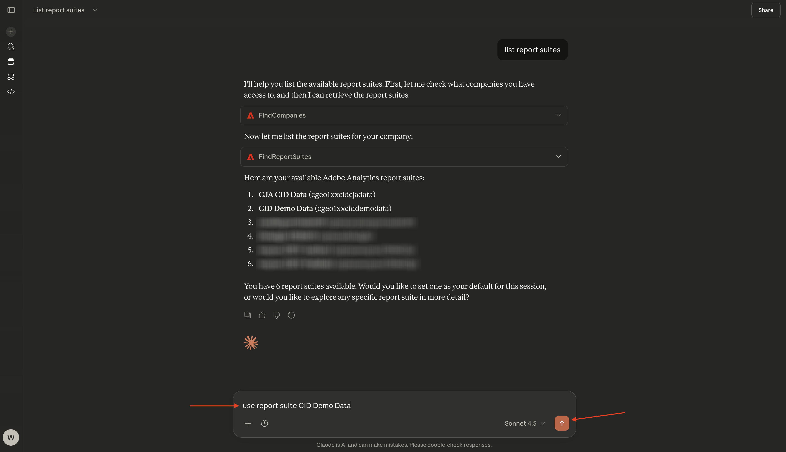
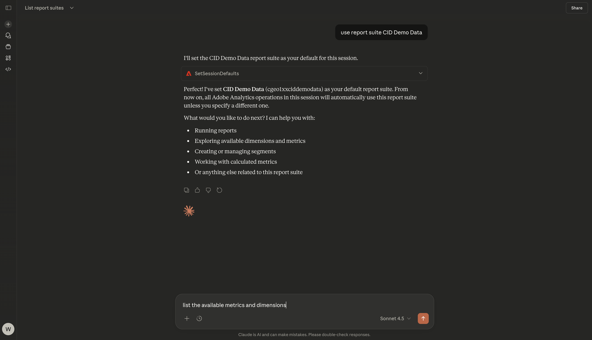
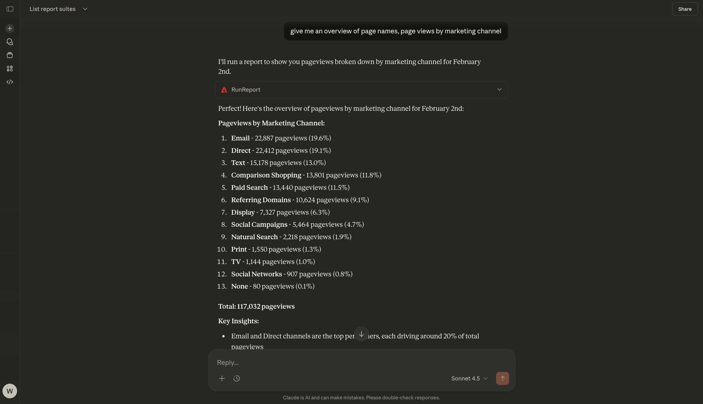

# 1.5.3 MCP サーバを搭載したAdobe Analyticsおよび Claude.ai

[!BADGE Alpha]

+++Alphaの詳細
CJAおよび Claude.ai を MCP サーバーAlphaと併用することにより、お客様は、Alphaが「現状のまま」でいかなる保証もなく提供されていることを承諾します。 Adobeは、Alphaを維持、修正、更新、変更、修正、またはその他の方法でサポートする義務を負いません。 このようなAlphaおよび付属の資料の正しい機能やパフォーマンスに対して、注意を払い、いかなる形でも依存しないことをお勧めします。 AlphaはAdobeの機密情報と見なされます。 お客様がAdobeに提供するあらゆる「フィードバック」（Alphaの使用中に発生した問題や欠陥、提案、改善点、推奨事項を含むがこれに限定されないAlphaに関する情報）は、かかるフィードバックに関するすべての権利、所有権、利益を含め、Adobeに帰属します。

+++

## ビデオ

このビデオでは、この演習に関係するすべての手順の説明とデモを行います。

>[!VIDEO](https://video.tv.adobe.com/v/3479562?quality=12&learn=on)

## Adobe Analytics用 1.5.3.1Claude.ai でカスタムアプリを作成する

>[!NOTE]
>
>Claude.ai でAdobe Analyticsを使用するには、次が必要です。
>- Claude.ai の有料版
>- Cloud.ai web クライアントの使用

[https://claude.ai/](https://claude.ai/){target="_blank"} に移動し、アカウントの詳細を使用してログインします。 ログインすると、このが表示されます。 **+** アイコンをクリックします。


**コネクタを追加** を選択します。


「**カスタムオブジェクトを追加**」をクリックします。


次のようにフィールドに入力します。

- **名前**: `CJA`
- **MCP サーバー URL**: Adobe担当者にお問い合わせください

「**追加**」をクリックします。


この画像が表示されます。 「**接続**」をクリックします。



正常に認証されると、次のメッセージが表示されます。 **+** アイコンをクリックして、新しいチャットを開始します。


**+**、**コネクタ** に移動すると、**Adobe Analytics** コネクタが有効になっていることがわかります。


これで、データ分析を開始する準備が整いました。


## Adobe Analyticsでのコンテキストの 1.5.3.2 定

Cloud.ai を通じてCJAとさらに対話する前に、コンテキストを設定する必要があります。

この演習では、以下を使用するようにコンテキストを設定する必要があります。

- **レポートスイート**:**CID - デモデータ**

レポートスイートの設定は、質問をする際に Cloud.ai が調べるデータを特定するのに役立ちます。

次の **プロンプト** を入力し、「**送信**」ボタンをクリックします。

```javascript
list report suites
```


「**常に許可**」を選択します。


「**常に許可**」を選択します。


次のようなメッセージが表示されます。


次の **プロンプト** を入力し、「**送信**」ボタンをクリックします。

```javascript
use report suite CID Demo Data
```



「**常に許可**」を選択します。


これで、レポートスイートが選択されました。


## 1.5.2.3 レポートスイートの参照

次の **プロンプト** を入力し、「**送信**」ボタンをクリックして、使用可能な指標とディメンションを調べます。

```javascript
list the available metrics and dimensions
```



「**常に許可**」を選択します。


「**常に許可**」を再度選択します。


この応答が表示されます。この応答には、このレポートスイートで設定された指標とディメンションが含まれています。


## 1.5.2.4 Reports

これで、データの調査を開始できます。 以下のプロンプトを入力して開始し、「**送信**」をクリックして報告書要求を送信します。

```javascript
show me pageviews for Feb 2?
```


次のようなメッセージが表示されます。


次の **プロンプト** を入力し、「**送信**」ボタンをクリックします。

```javascript
break down pageviews by page name
```


この画像が表示されます。


次の **プロンプト** を入力し、「**送信**」ボタンをクリックします。

```javascript
give me an overview of page names, page views by marketing channel
```


次のようなメッセージが表示されます。



少し下にスクロールして、分析を確認します。


次の **プロンプト** を入力し、「**送信**」ボタンをクリックします。

```javascript
Analyze different metrics by marketing channel
```


次のようなメッセージが表示されます。


これで、この演習が完了しました。

[Analytics とエージェント &#x200B;](./analyticsagents.md){target="_blank"} に戻る

[&#x200B; すべてのモジュールに戻る &#x200B;](./../../../overview.md){target="_blank"}