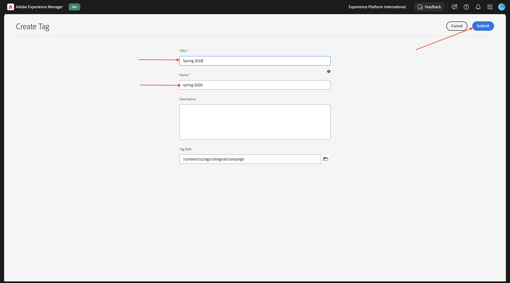
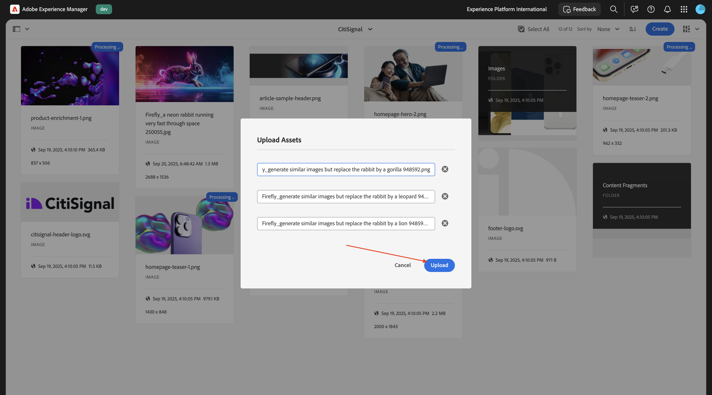
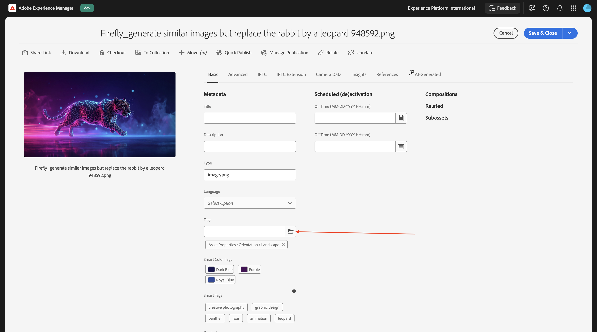
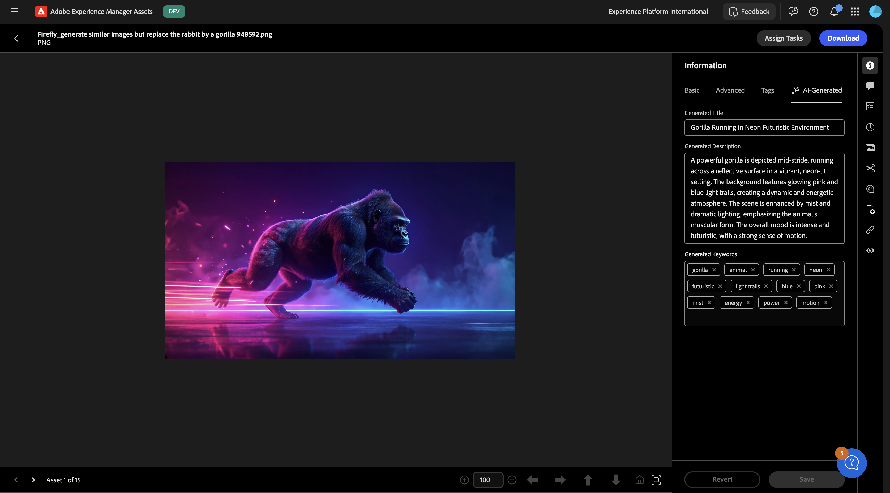
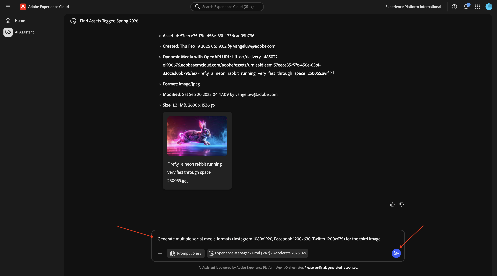
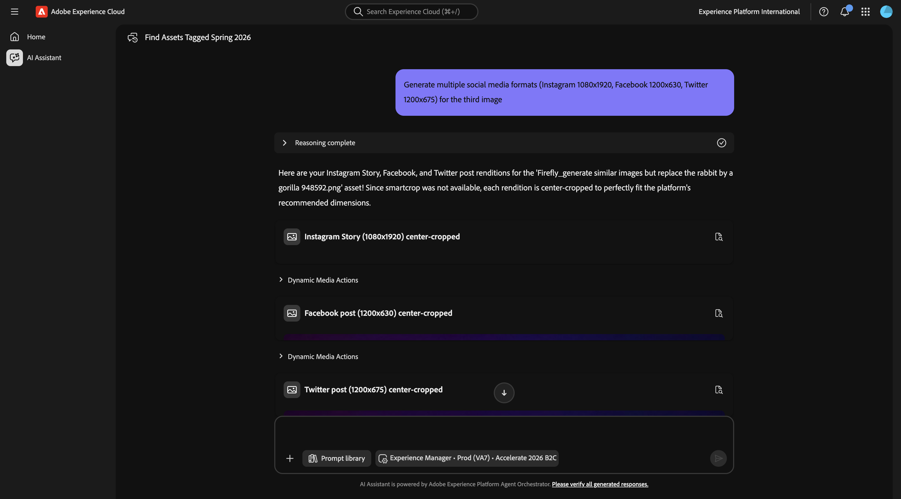

# 1.6.1 AEM Agents の概要

>[!IMPORTANT]
>
>この演習を行うには、EDS 環境で動作するAEM SitesとAssets CS にアクセスし、使用している IMS 組織で様々なAEM エージェントを有効にする必要があります。
>
>そのような環境がまだない場合は、[Adobe Experience Manager、Cloud Service、Edge Delivery Services](./../../../modules/asset-mgmt/module2.1/aemcs.md){target="_blank"} の演習に進んでください。 指示に従うと、そのような環境にアクセスできます。

>[!IMPORTANT]
>
>以前、AEM CS プログラムをAEM SitesとAssets CS 環境で設定したことがある場合は、AEM CS サンドボックスが休止状態になっている可能性があります。 このようなサンドボックスの休止解除には 10～15 分かかるので、後で待つ必要がないように、今すぐ休止解除プロセスを開始することをお勧めします。

## 1.6.1.1 Discovery Agent

Adobe Experience Manager（AEM） Discovery Agent は、AEM as a Cloud Service内の AI を活用したツールで、自然言語プロンプトを使用して（Assets、コンテンツフラグメント、アダプティブFormsなどの）コンテンツを検索、取得、利用できます。 リポジトリ全体の目的を把握して検索することで、手動、クリックが多い、複雑なフィルタリングの必要性がなくなります。

**Discovery Agent** を使用するには、まずAdobe Experience Managerでいくつかのタグを作成し、次にそれらのタグを使用して一部のアセットにタグを付けます。 その後、AI アシスタントを使用して、ビジネスに適した簡単な方法でアセットを検出できます。

[https://my.cloudmanager.adobe.com](https://my.cloudmanager.adobe.com){target="_blank"} に移動します。 選択する組織は `--aepImsOrgName--` です。

### Assetsでのタグの作成と使用

クリックすると、Cloud Manager プログラムが開きます。このプログラムは `--aepUserLdap-- - CitiSignal AEM+ACCS` と呼ばれます。


環境の URL をクリックして開きます。


**ハンマー** アイコンをクリックします。


**一般** の下の **タグ付け** をクリックします。


この画像が表示されます。 **作成** をクリックし、「**名前空間を作成**」を選択します。


**タイトル** フィールドに、`CitiSignal` と入力します。 「**作成**」をクリックします。


名前空間 **CitiSignal** をクリックしてドリルダウンします。 **作成** をクリックし、「**タグを作成**」を選択します。


**タイトル** フィールドに、`Campaign` と入力します。 「**送信**」をクリックします。


タグ **Campaign** をクリックして選択します。 **作成** をクリックし、「**タグを作成**」を選択します。


**タイトル** フィールドに、`Winter 2026` と入力します。 「**送信**」をクリックします。


タグ **Campaign** をクリックして選択します。 **作成** をクリックし、「**タグを作成**」を選択します。


**タイトル** フィールドに、`Spring 2026` と入力します。 「**送信**」をクリックします。



これで、このが得られます。


**Adobe Experience Manager**&#x200B;**Assets&rbrace; の順にクリックし** す。


**ファイル** をクリックします。


フォルダー **CitiSignal** をダブルクリックして開きます。


**作成** をクリックし、**ファイル** を選択します。


ファイル [citisignal-images-campaign.zip](./assets/citisignal-images-campaign.zip) をダウンロードし、デスクトップに解凍します。


を選択します。 ダウンロードした 3 つのファイルをクリックして **開く**。


**アップロード** をクリックします。



この画像が表示されます。


最初の画像を選択し、「**プロパティ**」をクリックします。


タグの下にある **folder**-icon をクリックします。



タグ **Spring 2026** を選択し、[**選択**] をクリックします。 これらの画像に対して、同じ手順を繰り返します。

- citisignal_lion.png
- citisignal_leopard.png
- citisignal_gorilla.png
- citisignal_rabbit.png


すべての画像に対してそのタグを選択したら、**Experience Manager Assets** に移動します。


使用しているリポジトリを選択します。


**Assets** に移動し、フォルダー **CitiSignal** を開きます。


最初の画像を開きます。


「**承認済み**」を選択し、「**保存**」をクリックします。


**タグ** の下に、以前に選択したタグが表示されます。


このプロセスを繰り返して、4 つの画像がすべて承認されるようにします。


次に、**マイワークスペース** に移動し、クリックして **AI アシスタント** を開きます。


次のプロンプトを入力し、「**送信**」をクリックします。

```javascript
find all assets tagged with 'Spring 2026'
```


複数のAEM Assets CS 環境にアクセスできる場合は、次のように表示されます。 使用する環境の提案された回答をクリックし、「**送信**」をクリックします。


その後、同様の回答が表示されます。 アイコンをクリックして、AI アシスタントを全画面表示に展開します。


回答を確認します。


AI アシスタント ウィンドウ内から、これらのアセットをクリックして表示できます。


その後、AEM Assets CS に直接移動します。


その後、使用可能な他のメタデータも確認できます。



## 1.6.1.2 Experience 実稼動エージェント

### コンテンツ更新

コンテンツ更新スキルは、コンテンツフラグメント、ページ、フォーム、アセットなどの既存のコンテンツを簡単に更新できます。 エージェントは、コンテンツ要素の更新、削除、置換、追加などのアクションを実行して、エクスペリエンスを正確かつ最新の状態に保つことができます。 入力は自然言語による説明にすることができます。Jira PDF やスクリーンショットで使用する場合は、入力も指定できます。

AI アシスタント画面に戻ります。


次のプロンプトを入力し、「**送信**」をクリックします。

`Generate multiple social media formats (Instagram 1080x1920, Facebook 1200x630, Twitter 1200x675) for the third image`



数分後、同様の応答が表示されます。



生成された画像を確認します。


### フォームの作成

フォーム作成スキルを使用すると、開発チームや IT チームに依存することなく、自然言語プロンプトを通じてアダプティブフォームを作成できます。 この機能は、ブランドの一貫性を維持しながらフォームの開発を促進し、ビジネスユーザーが技術的な深い知識がなくてもフォームを作成できるようにします。


## 次の手順

[AEMとエージェント &#x200B;](./aemagents.md){target="_blank"} に戻る

[&#x200B; すべてのモジュールに戻る &#x200B;](./../../../overview.md){target="_blank"}
