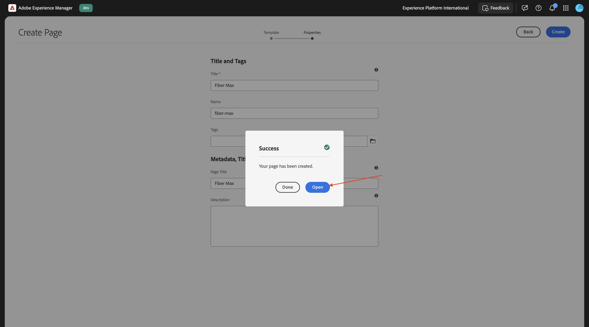
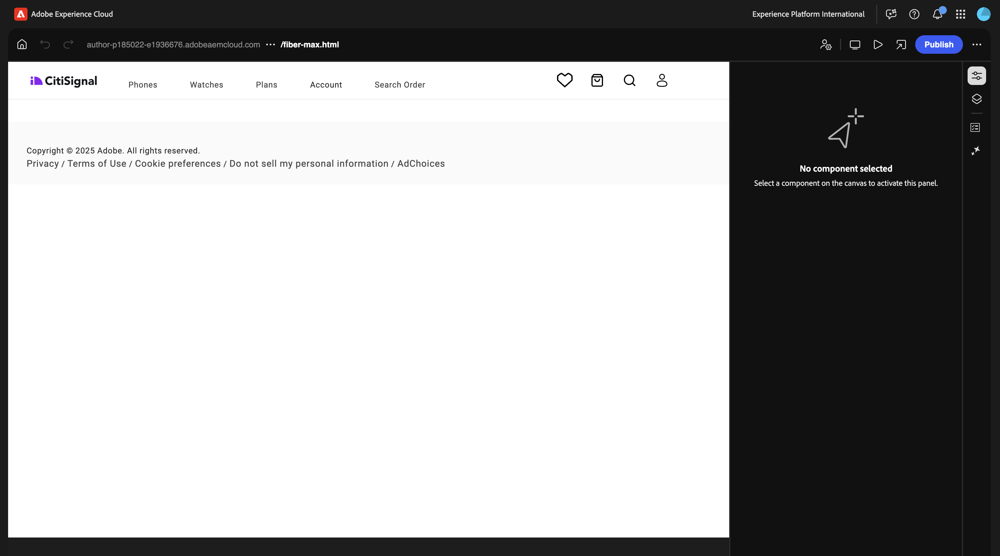
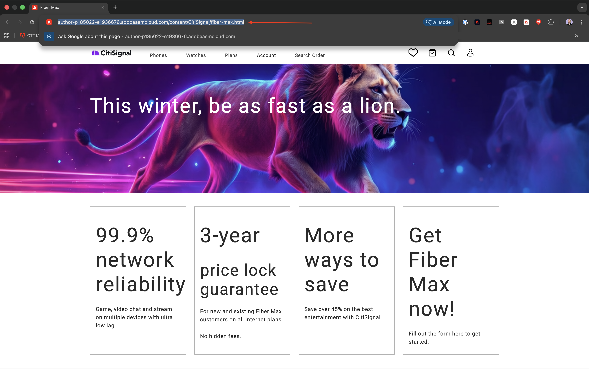
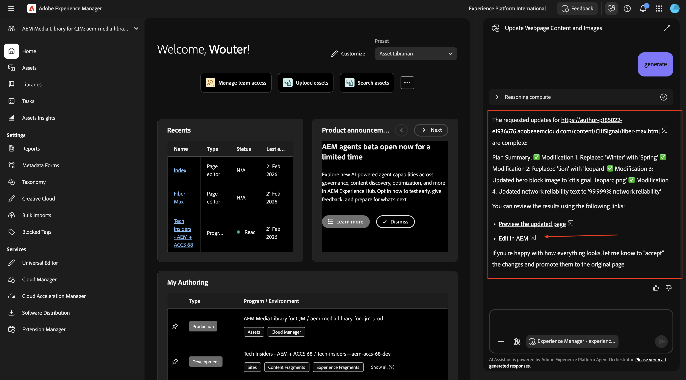
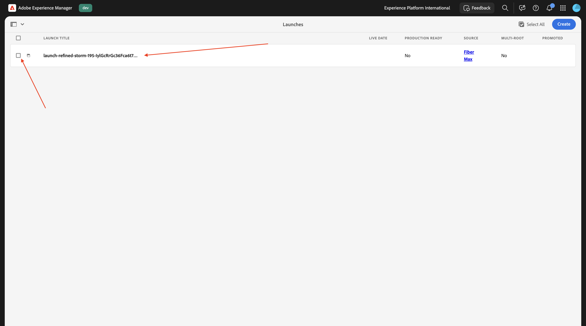
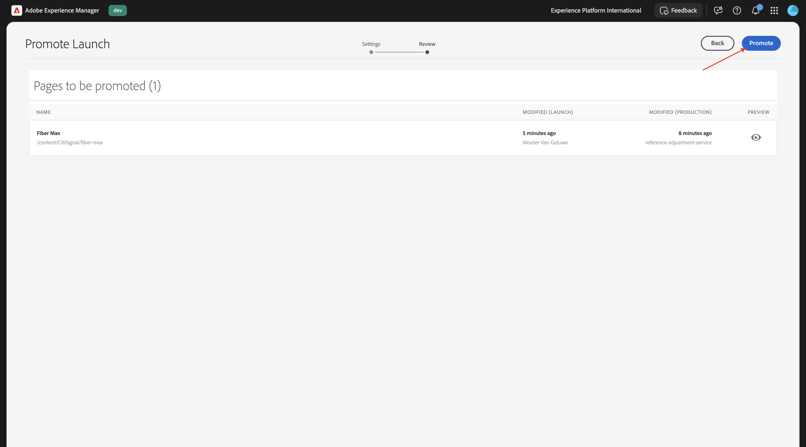
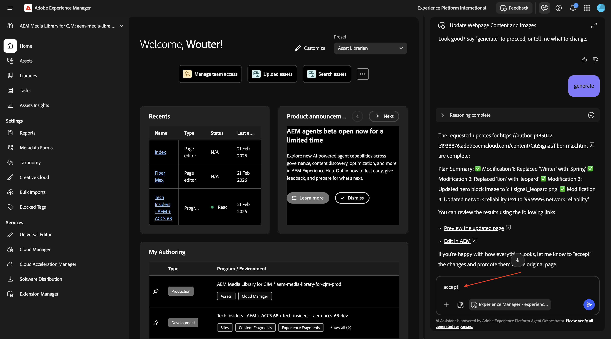

# 1.6.1 AEM Agents の概要

>[!IMPORTANT]
>
>この演習を行うには、EDS 環境で動作するAEM SitesとAssets CS にアクセスし、使用している IMS 組織で様々なAEM エージェントを有効にする必要があります。
>
>そのような環境がまだない場合は、[Adobe Experience Manager、Cloud Service、Edge Delivery Services](./../../../modules/asset-mgmt/module2.1/aemcs.md){target="_blank"} の演習に進んでください。 指示に従うと、そのような環境にアクセスできます。

>[!IMPORTANT]
>
>以前、AEM CS プログラムをAEM SitesとAssets CS 環境で設定したことがある場合は、AEM CS サンドボックスが休止状態になっている可能性があります。 このようなサンドボックスの休止解除には 10～15 分かかるので、後で待つ必要がないように、今すぐ休止解除プロセスを開始することをお勧めします。

## 1.6.1.1 Discovery Agent

Adobe Experience Manager（AEM） Discovery Agent は、AEM as a Cloud Service内の AI を活用したツールで、自然言語プロンプトを使用して（Assets、コンテンツフラグメント、アダプティブFormsなどの）コンテンツを検索、取得、利用できます。 リポジトリ全体の目的を把握して検索することで、手動、クリックが多い、複雑なフィルタリングの必要性がなくなります。

**Discovery Agent** を使用するには、まずAdobe Experience Managerでいくつかのタグを作成し、次にそれらのタグを使用して一部のアセットにタグを付けます。 その後、AI アシスタントを使用して、ビジネスに適した簡単な方法でアセットを検出できます。

[https://my.cloudmanager.adobe.com](https://my.cloudmanager.adobe.com){target="_blank"} に移動します。 選択する組織は `--aepImsOrgName--` です。

### Assetsでのタグの作成と使用

クリックすると、Cloud Manager プログラムが開きます。このプログラムは `--aepUserLdap-- - CitiSignal AEM+ACCS` と呼ばれます。


環境の URL をクリックして開きます。


**ハンマー** アイコンをクリックします。


**一般** の下の **タグ付け** をクリックします。


この画像が表示されます。 **作成** をクリックし、「**名前空間を作成**」を選択します。


**タイトル** フィールドに、`CitiSignal` と入力します。 「**作成**」をクリックします。


名前空間 **CitiSignal** をクリックしてドリルダウンします。 **作成** をクリックし、「**タグを作成**」を選択します。


**タイトル** フィールドに、`Campaign` と入力します。 「**送信**」をクリックします。


タグ **Campaign** をクリックして選択します。 **作成** をクリックし、「**タグを作成**」を選択します。


**タイトル** フィールドに、`Winter 2026` と入力します。 「**送信**」をクリックします。


タグ **Campaign** をクリックして選択します。 **作成** をクリックし、「**タグを作成**」を選択します。


**タイトル** フィールドに、`Spring 2026` と入力します。 「**送信**」をクリックします。


これで、このが得られます。


**Adobe Experience Manager**&#x200B;**Assets&rbrace; の順にクリックし** す。


**ファイル** をクリックします。


フォルダー **CitiSignal** をダブルクリックして開きます。


**作成** をクリックし、**ファイル** を選択します。


ファイル [citisignal-images-campaign.zip](./assets/citisignal-images-campaign.zip) をダウンロードし、デスクトップに解凍します。


を選択します。 ダウンロードした 3 つのファイルをクリックして **開く**。


**アップロード** をクリックします。


この画像が表示されます。


最初の画像を選択し、「**プロパティ**」をクリックします。


タグの下にある **folder**-icon をクリックします。


タグ **Spring 2026** を選択し、[**選択**] をクリックします。 これらの画像に対して、同じ手順を繰り返します。

- citisignal_lion.png
- citisignal_leopard.png
- citisignal_gorilla.png
- citisignal_rabbit.png


すべての画像に対してそのタグを選択したら、**Experience Manager Assets** に移動します。


使用しているリポジトリを選択します。


**Assets** に移動し、フォルダー **CitiSignal** を開きます。


最初の画像を開きます。


「**承認済み**」を選択し、「**保存**」をクリックします。


**タグ** の下に、以前に選択したタグが表示されます。


このプロセスを繰り返して、4 つの画像がすべて承認されるようにします。


次に、**マイワークスペース** に移動し、クリックして **AI アシスタント** を開きます。


次のプロンプトを入力し、「**送信**」をクリックします。

```javascript
find all assets tagged with 'Spring 2026'
```


複数のAEM Assets CS 環境にアクセスできる場合は、次のように表示されます。 使用する環境の提案された回答をクリックし、「**送信**」をクリックします。


その後、同様の回答が表示されます。 アイコンをクリックして、AI アシスタントを全画面表示に展開します。


回答を確認します。


AI アシスタント ウィンドウ内から、これらのアセットをクリックして表示できます。


その後、AEM Assets CS に直接移動します。


その後、使用可能な他のメタデータも確認できます。


## 1.6.1.2 Experience 実稼動エージェント

### コンテンツ更新 – Assets

コンテンツ更新スキルは、コンテンツフラグメント、ページ、フォーム、アセットなどの既存のコンテンツを簡単に更新できます。 エージェントは、コンテンツ要素の更新、削除、置換、追加などのアクションを実行して、エクスペリエンスを正確かつ最新の状態に保つことができます。 入力は自然言語による説明にすることができます。Jira PDF やスクリーンショットで使用する場合は、入力も指定できます。

AI アシスタント画面に戻ります。


次のプロンプトを入力し、「**送信**」をクリックします。

`Generate multiple social media formats (Instagram 1080x1920, Facebook 1200x630, Twitter 1200x675) for the third image`


数分後、同様の応答が表示されます。


生成された画像を確認します。


### コンテンツ更新 – ページ

Adobe Experience Manager オーサー環境に戻り、**Sites** に移動します。


**CitiSignal** に移動します。 **作成** をクリックし、「**ページ**」を選択します。


**ページ** を選択し、「**次へ**」をクリックします。


次の値を入力します。

- タイトル：**Fibre Max**
- 名前：**fiber-max**
- ページタイトル：**Fibre Max**

「**作成**」をクリックします。


**開く** を選択します。



この画像が表示されます。



空白領域をクリックして、「**セクション**」コンポーネントを選択します。 次に、右側のメニューでプラス **+** アイコンをクリックし、「**ヒーロー**」を選択します。


この画像が表示されます。 「**+追加**」をクリックして画像を追加します。


アセットリポジトリを選択します。 次に、フォルダー **CitiSignal** を開きます。


前にアップロードしたライオンの画像を選択します。 「**選択**」をクリックします。


この画像が表示されます。 **テキスト** 領域をクリックして、テキストを変更します。


このテキストをに貼り付けます。

```
This winter, be as fast as a lion.
```

**見出し 1** を選択し、「**完了**」をクリックします。


この画像が表示されます。 **コンテンツツリー** に移動し、領域 **セクション** を選択します。


**+** アイコンをクリックし、「**カード**」を選択します。


この画像が表示されます。 **コンテンツツリー** で **カード** が選択されていることを確認します。

次に、ボタンを **+** 4 回クリックします。


**Cards** オブジェクトに 4 つの **Card** オブジェクトがあるところを確認します。


最初の **カード** を選択します。 **テキスト** 領域をクリックして、テキストを変更します。


次のテキストを貼り付けます。 テキストの 1 行目に **見出し 1** が使用されていることを確認します。 「**完了**」をクリックします。

```
99.9% network reliability

Game, video chat and stream on multiple devices with ultra low lag.
```


2 番目の **カード** を選択します。 **テキスト** 領域をクリックして、テキストを変更します。


次のテキストを貼り付けます。 テキストの 1 行目に **見出し 1** が使用されていることを確認します。 「**完了**」をクリックします。

```
3-year

price lock guarantee

For new and existing Fiber Max customers on all internet plans.

No hidden fees.
```


3 番目の **カード** を選択します。 **テキスト** 領域をクリックして、テキストを変更します。


次のテキストを貼り付けます。 テキストの 1 行目に **見出し 1** が使用されていることを確認します。 「**完了**」をクリックします。

```
More ways to save

Save over 45% on the best entertainment with CitiSignal
```


4 番目の **カード** を選択します。 **テキスト** 領域をクリックして、テキストを変更します。


次のテキストを貼り付けます。 テキストの 1 行目に **見出し 1** が使用されていることを確認します。 「**完了**」をクリックします。

```
Get Fiber Max now!

Fill out the form here to get started.
```


これで、このが得られます。 「**公開**」をクリックします。


もう一度 **公開** をクリックします。


**ページを開く** をクリックします。


次に必要になるので、ページの URL をコピーします。

URL は次のようになります。`https://author-pXXXXXX-eXXXXXXX.adobeaemcloud.com/content/CitiSignal/fiber-max.html`



[https://experience.adobe.com/#/experiencemanager/](https://experience.adobe.com/#/experiencemanager/) に移動します。 クリックすると **AI アシスタント** が開きます。


次のプロンプトを貼り付け、「**送信**」をクリックします。 このプロンプトで XXX を、前の手順でコピーした URL に置き換えます。

```
On the page XXX, please make the following changes:

- change the word 'winter' to 'spring'
- change the word 'lion' to 'leopard'
- change the image in the hero block to use the image 'citisignal_leopard.png'
- change the text '99.9% network reliability' to '99.999% network reliability'
```


1～2 分後、これが表示されます。 プロンプト `generate` を入力し、「**送信**」をクリックします。


数分後、変更が実行されたことを示す、次のような確認が表示されます。 **更新されたページをプレビュー** をクリックします。


完了した変更が視覚的に確認できるようになりました。 このプレビューページは情報提供だけを目的としています。このページからアクションを実行することはできません。


アクションを実行するには、「**AEMで編集**」をクリックします。



ユニバーサルエディターには、すべての変更が詳細に表示され、変更機能も備わっています。 ページを確認したら、「**公開**」をクリックします。


もう一度 **公開** をクリックします。 加えた変更は、まだ実稼動環境に公開されていません。 代わりに、AEMの **ローンチ** で公開されています。

ローンチを使用すると、今後のリリース用にコンテンツを効率的に開発できます。 ローンチを作成すると、現在のページを維持しながら、今後の公開に備えて変更を加えることができます。 つまり、現在公開されているページと、今後公開するページのバージョンの 2 つのバージョンを同時に効果的に編集しているということです。 その時間が来たら、元のページを置き換えて、新しいバージョンを公開できます。


今後のリリースで保留中の変更を **昇格** するには、AEMに戻ります。 ページ上部の **Adobe Experience Manager** をクリックし、「**ハンマー** アイコンをクリックして、「**ローンチ**」を選択します。


これで、保留中の **ローンチ** が表示されます。 保留中の **起動** の前にあるチェックボックスをオンにします。



**昇格** をクリックします。


「**すべてのローンチを昇格**」を選択し、「**次へ**」をクリックします。


**昇格** をクリックします。



これが表示されます。 変更は現在実稼動環境にあります。


ページを更新すると、公開されたページにすべての変更が表示されます。


または、手動のプロモーション プロセスを実行する代わりに、AI アシスタントでプロンプト `accept` を入力することもできます。



すると、変更が公開されたことを示す確認メッセージが表示されます。


### コンテンツの更新 – フォームの作成

Edge Delivery ServicesのAdobe Experience Manager Forms モジュール [&#x200B; では &#x200B;](./../../asset-mgmt/module1.3/aemforms.md){target="_blank"} フォームを手動で作成する手順を確認できます。

このフォーム作成スキルにより、ユーザーは、開発チームや IT チームに依存することなく、自然言語プロンプトを使用してアダプティブフォームを作成できるようになりました。 この機能は、ブランドの一貫性を維持しながらフォームの開発を促進し、ビジネスユーザーが技術的な深い知識がなくてもフォームを作成できるようにします。

[https://experience.adobe.com/#/ai-assistant/chat](https://experience.adobe.com/#/ai-assistant/chat) に移動します。


次のプロンプトを入力し、「**送信**」をクリックします。

```
Create a new adaptive form using Edge Delivery Services and the existing CitiSignal site, with the following details:
- Form name: "citisignal-fiber-max-interest-2"
- Form fields: 4 text input fields are needed, for "first-name", "last-name", "email" and "city"
- When the form is submitted, send the submission to a spreadsheet, with this URL: https://docs.google.com/spreadsheets/d/1WwKrcM8mZ2d_W3sMheUAw3nFhP_OFk05TsqxhHkudfQ/edit?usp=sharing.
```

## 次の手順

[1.6.2 AEM MCP Servers &amp; Cursor](./ex2.md){target="_blank"}

[AEMとエージェント &#x200B;](./aemagents.md){target="_blank"} に戻る

[&#x200B; すべてのモジュールに戻る &#x200B;](./../../../overview.md){target="_blank"}
