# 1.6.1 AEM Agentsの概要

>[!IMPORTANT]
>
>AEM CS サンドボックスが休止状態になる可能性があります。 サンドボックスの休止解除に10～15分かかることを考えると、後で待つ必要がないように、今すぐ休止解除プロセスを開始することをお勧めします。

## 1.6.1.1探索エージェント

Adobe Experience Manager（AEM） Discovery Agentは、AEM as a Cloud Service内のAIを搭載したツールで、Assets、コンテンツフラグメント、アダプティブFormsなどのコンテンツを自然言語プロンプトを使用して検索、取得、利用できます。 リポジトリ全体の意図を把握し、検索を行うことで、手作業やクリックを多用するフィルタリング、複雑なフィルタリングなどの必要がなくなります。

**Discovery Agent**&#x200B;を使用するには、まずAdobe Experience Managerでタグをいくつか作成し、そのタグを使用してアセットをいくつかタグ付けします。 これが完了すれば、AI アシスタントを利用して、ビジネスが使いやすい方法でアセットを発見できるようになります。

[https://my.cloudmanager.adobe.com](https://my.cloudmanager.adobe.com){target="_blank"}に移動します。 選択する組織は`--aepImsOrgName--`です。

### Assetsでのタグの作成と使用

クリックしてCloud Manager プログラムを開きます。以下の命名オプションを使用する必要があります。

- **`Tech Insiders - AEM + ACCS X`** （Xは割り当てられた番号を表します）。
- **`Tech Insiders On Demand - AEM + ACCS X`** （Xは割り当てられた番号を表します）。
- **`--aepUserLdap-- - CitiSignal AEM+ACCS`**。この場合、自分で作成した独自のAEM プログラムを使用しているため、番号がありません。

この例では、プログラム **Tech Insiders - AEM + ACCS 100**&#x200B;が使用されます。 独自のプログラムを使用する必要があります。

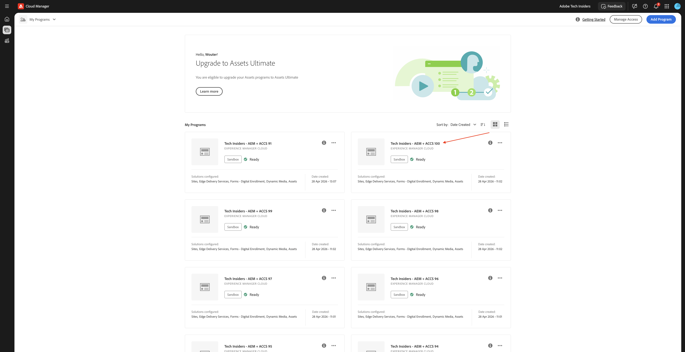

環境のURLをクリックして開きます。


**ツール** アイコンをクリックします。


**一般**&#x200B;で、**タグ付け**&#x200B;をクリックします。


そうすると、これが表示されます。 **Create**&#x200B;をクリックし、**Create Namespace**&#x200B;を選択します。

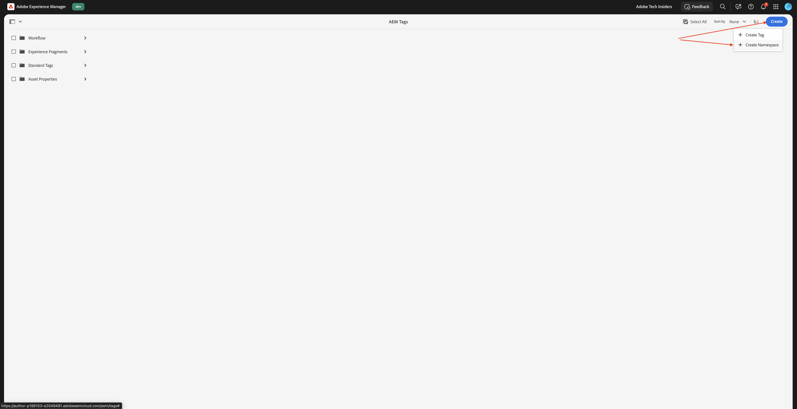

フィールド **タイトル**&#x200B;に次のように入力します：`--aepUserLdap-- - CitiSignal`。 「**作成**」をクリックします。


名前空間&#x200B;**`--aepUserLdap-- - CitiSignal`**&#x200B;をクリックしてドリルダウンします。 「**Create**」をクリックし、「**タグを作成**」を選択します。


フィールド **タイトル**&#x200B;に次のように入力します：`--aepUserLdap-- - Campaign`。 「**送信**」をクリックします。

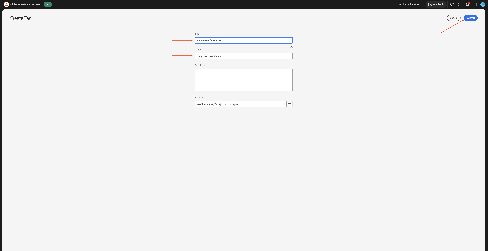

タグ **`--aepUserLdap-- - Campaign`**&#x200B;をクリックして選択します。 「**Create**」をクリックし、「**タグを作成**」を選択します。

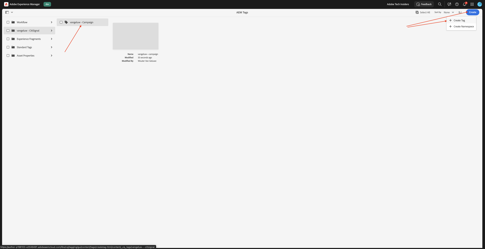

フィールド **タイトル**&#x200B;に次のように入力します：`--aepUserLdap-- - Winter 2026`。 「**送信**」をクリックします。


タグ **Campaign**&#x200B;をクリックして選択します。 「**Create**」をクリックし、「**タグを作成**」を選択します。


フィールド **タイトル**&#x200B;に次のように入力します：`--aepUserLdap-- - Spring 2026`。 「**送信**」をクリックします。


これで、これで完了です。


**Adobe Experience Manager**&#x200B;をクリックし、**Assets**&#x200B;をクリックします。


**ファイル**&#x200B;をクリックします。


フォルダー&#x200B;**CitiSignal**&#x200B;をクリックして開きます。


**作成**&#x200B;をクリックし、**ファイル**&#x200B;を選択します。


ファイル [citisignal-images-campaign.zip](./assets/citisignal-images-campaign.zip)をダウンロードし、デスクトップに展開します。


ダウンロードした3つのファイルを選択し、**開く**&#x200B;をクリックします。


「**アップロード**」をクリックします。


そうすると、これが表示されます。


最初の画像（citisignal_lion.png）を選択し、**プロパティ**&#x200B;をクリックします。


タグの下にある&#x200B;**フォルダー** – アイコンをクリックします。


タグ **`--aepUserLdap-- - Spring 2026`**&#x200B;を選択し、**選択**&#x200B;をクリックします。

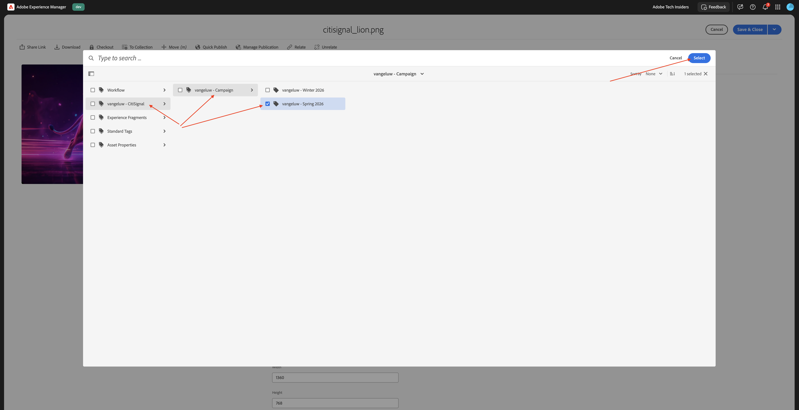

「**保存して閉じる**」をクリックします。


これらの画像に対して次の操作を繰り返します。

- `citisignal_leopard.png`
- `citisignal_gorilla.png`
- `citisignal_neon_rabbit.png`

すべての画像のタグを選択したら、**Experience Manager Assets**&#x200B;に移動します。

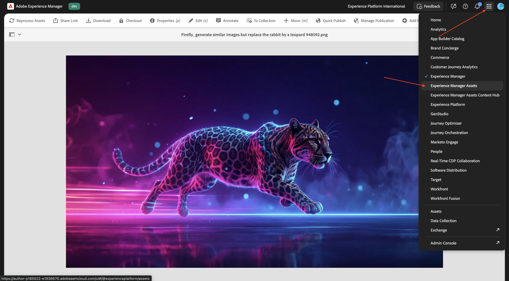

画面の右上にある「**プロファイル**」アイコンをクリックします。 「**ビューを切り替え**」をクリックします。


そうすると、これが表示されます。


ダブルクリックして、最初の画像を開きます。


**Approved**&#x200B;を選択し、**保存**&#x200B;をクリックします。


**タグ**&#x200B;の下に、以前に選択したタグが表示されます。


このプロセスを繰り返して、4つの画像がすべて承認されるようにします。

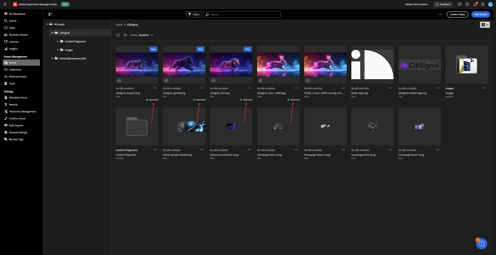

次に、**My workspace**&#x200B;に移動し、クリックして&#x200B;**AI Assistant**&#x200B;を開きます。


次のプロンプトを入力し、**送信**&#x200B;をクリックします。

```javascript
find all assets tagged with '--aepUserLdap-- - Spring 2026'
```


複数のAEM Assets CS環境にアクセスできる場合は、このようになります。 使用する環境に対して提案された回答をクリックし、**送信**&#x200B;をクリックします。


類似した回答が表示されます。 アイコンをクリックして、AI アシスタントを全画面に展開します。


回答を確認する：


任意のアセットで「**情報を表示**」アイコンをクリックします。

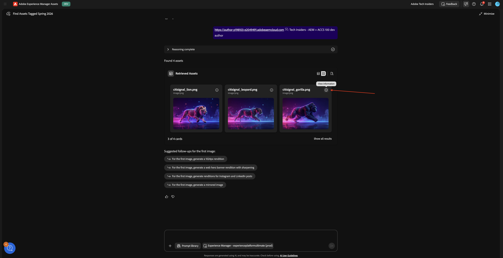

選択したアセットが、メタデータを含む拡大表示されます。

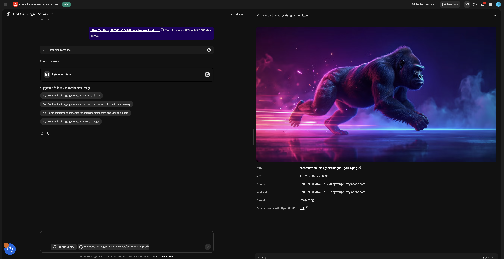

## 1.6.1.2 Experience Production エージェント

### コンテンツの更新 – Assets

コンテンツアップデート機能は、コンテンツフラグメントやページ、フォーム、アセットなど、既存のコンテンツを容易に更新できます。 担当者は、コンテンツ要素の更新、削除、置換、追加などのアクションを実行し、エクスペリエンスを正確かつ最新の状態に保つことができます。 入力は自然言語の説明にすることができ、Jira PDFやスクリーンショットを使用して使用する場合も入力を提供できます。

AI アシスタント画面に戻ります。 サイドパネルを閉じます。


提案されたプロンプトのいずれかを選択し、**送信**&#x200B;をクリックします。

`For the first image, generate renditions for Instagram and LinkedIn posts`


数分後、同様の応答が表示されます。


生成された画像を確認します。


他のプロンプトを自由に試すことができます。 上にスクロールして、他の提案されたプロンプトのいずれかを選択するか、独自のプロンプトを入力し、**送信**&#x200B;をクリックします。

`For the first image, generate a mirrored image`

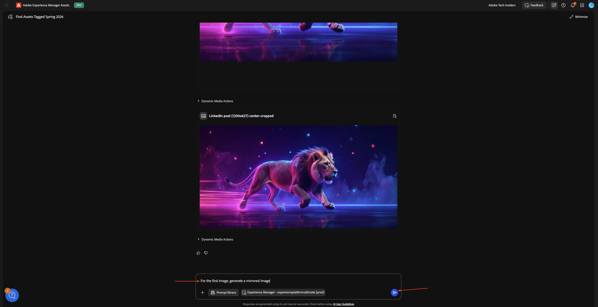

生成された画像を確認します。


### コンテンツ更新 – ページ

Adobe Experience Manager オーサー環境に戻り、**Sites**&#x200B;に移動します。


**CitiSignal**&#x200B;に移動します。 **作成**&#x200B;をクリックし、**ページ**&#x200B;を選択します。


**ページ**&#x200B;を選択し、**次へ**&#x200B;をクリックします。

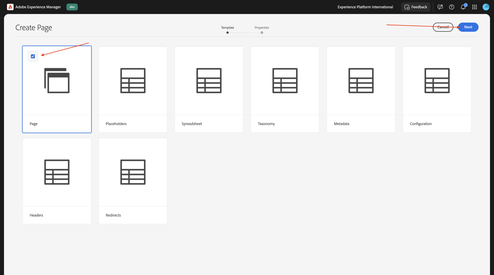

次の値を入力します。

- タイトル：**最大ファイバー**
- 名前：**fiber-max**
- ページタイトル：**最大ファイバー**

「**作成**」をクリックします。

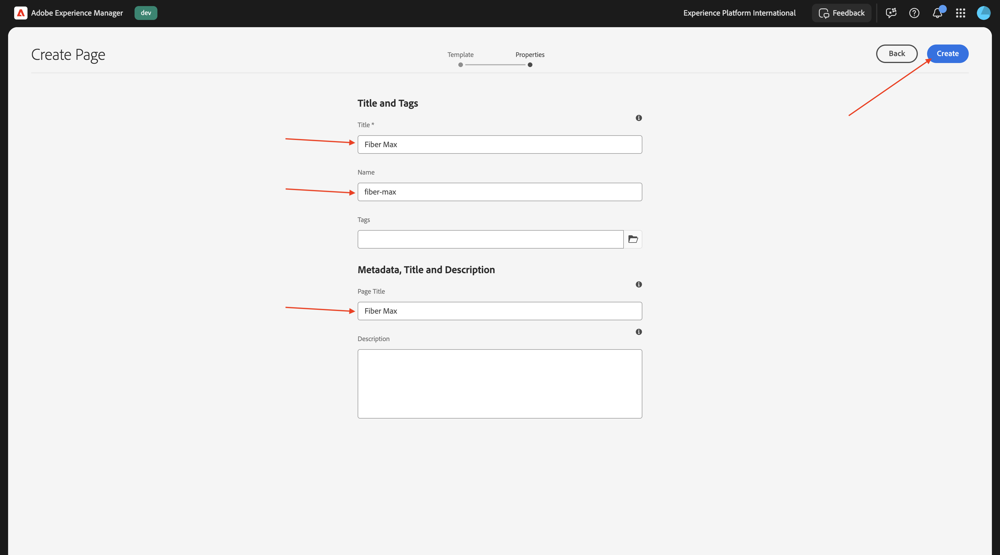

「**開く**」を選択します。

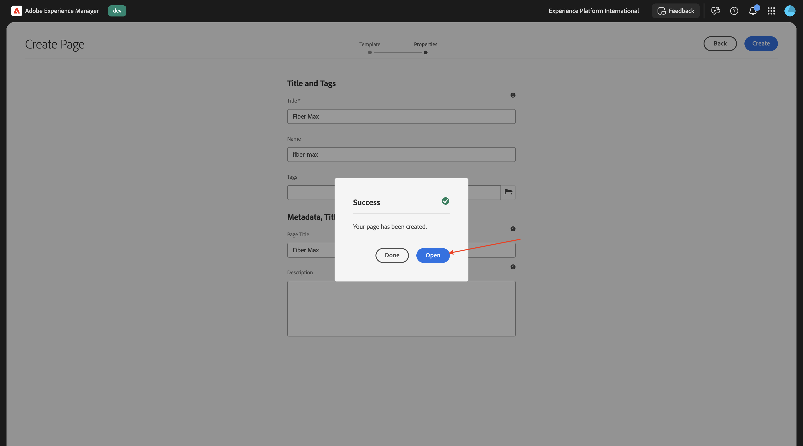

そうすると、これが表示されます。


空白の領域をクリックして、**セクション** コンポーネントを選択します。 次に、右側のメニューのプラス **+** アイコンをクリックし、**ヒーロー**&#x200B;を選択します。

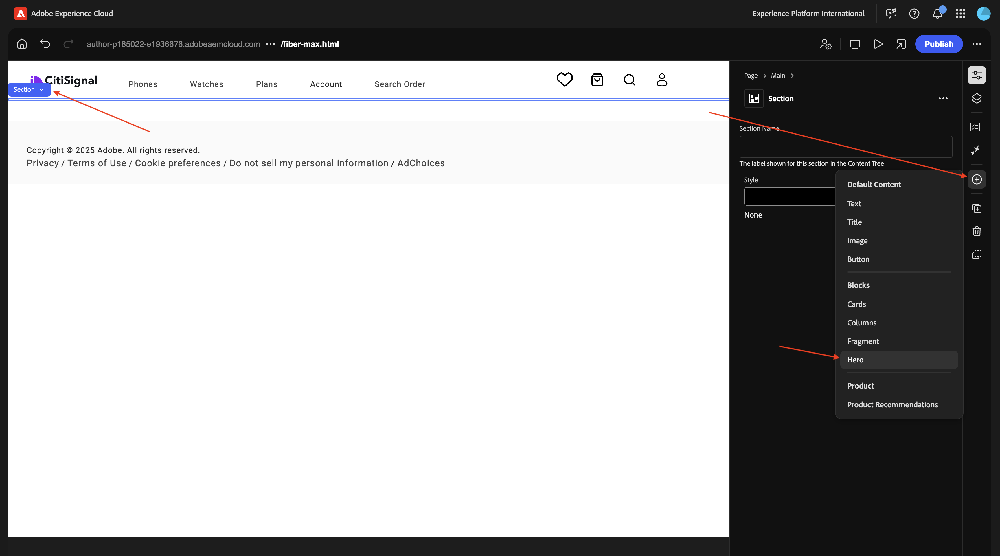

そうすると、これが表示されます。 「**+ Add**」をクリックして、画像を追加します。


アセットリポジトリを選択します。 次に、フォルダー&#x200B;**CitiSignal**&#x200B;を開きます。


先ほどアップロードしたライオンの画像を選択します。 「**選択**」をクリックします。


そうすると、これが表示されます。 **text**&#x200B;領域をクリックして、テキストを変更します。

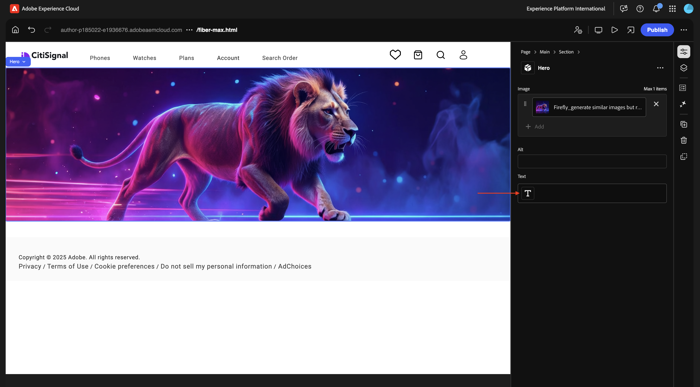

このテキストをに貼り付けます：

```
This winter, be as fast as a lion.
```

**見出し1**&#x200B;を選択し、**完了**&#x200B;をクリックします。


そうすると、これが表示されます。 **コンテンツツリー**&#x200B;に移動し、領域&#x200B;**セクション**&#x200B;を選択します。


**+** アイコンをクリックし、**カード**&#x200B;を選択します。


そうすると、これが表示されます。 **コンテンツツリー**&#x200B;で、**カード**&#x200B;が選択されていることを確認してください。

次に、**+** ボタンを4回クリックします。


これで、**Cards** オブジェクトに4つの&#x200B;**Card** オブジェクトが含まれています。


最初の&#x200B;**カード**&#x200B;を選択します。 **text**&#x200B;領域をクリックして、テキストを変更します。


次のテキストを貼り付けます。 テキストの最初の行が&#x200B;**見出し1**&#x200B;を使用していることを確認してください。 「**完了**」をクリックします。

```
99.9% network reliability

Game, video chat and stream on multiple devices with ultra low lag.
```

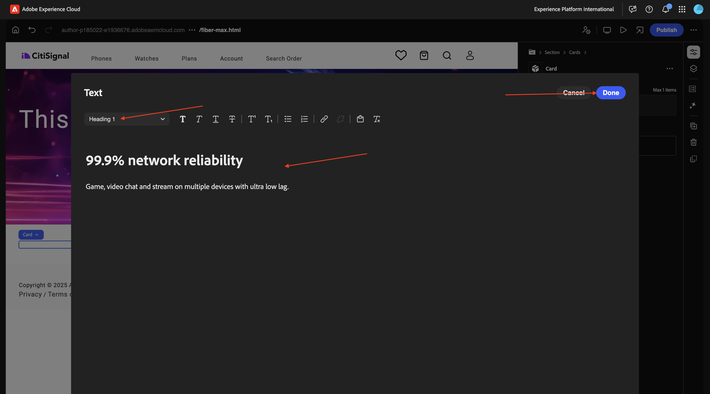

2番目の&#x200B;**Card**&#x200B;を選択します。 **text**&#x200B;領域をクリックして、テキストを変更します。


次のテキストを貼り付けます。 テキストの最初の行が&#x200B;**見出し1**&#x200B;を使用していることを確認してください。 「**完了**」をクリックします。

```
3-year

price lock guarantee

For new and existing Fiber Max customers on all internet plans.

No hidden fees.
```


3枚目の&#x200B;**カード**&#x200B;を選択します。 **text**&#x200B;領域をクリックして、テキストを変更します。


次のテキストを貼り付けます。 テキストの最初の行が&#x200B;**見出し1**&#x200B;を使用していることを確認してください。 「**完了**」をクリックします。

```
More ways to save

Save over 45% on the best entertainment with CitiSignal
```


4番目の&#x200B;**Card**&#x200B;を選択します。 **text**&#x200B;領域をクリックして、テキストを変更します。


次のテキストを貼り付けます。 テキストの最初の行が&#x200B;**見出し1**&#x200B;を使用していることを確認してください。 「**完了**」をクリックします。

```
Get Fiber Max now!

Fill out the form here to get started.
```


これで、これで完了です。 「**公開**」をクリックします。


**公開**&#x200B;をもう一度クリックします。


「**ページを開く**」をクリックします。


必要に応じて、ページのURLをコピーします。

URLは次のようにする必要があります：`https://author-pXXXXXX-eXXXXXXX.adobeaemcloud.com/content/CitiSignal/fiber-max.html`。


[https://experience.adobe.com/#/experiencemanager/](https://experience.adobe.com/#/experiencemanager/)に移動します。 クリックして&#x200B;**AI アシスタント**&#x200B;を開きます。

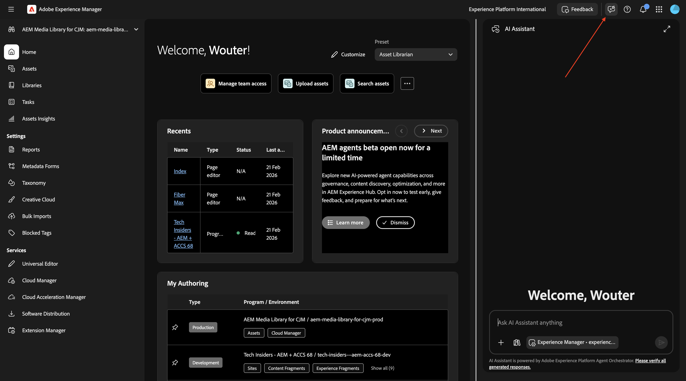

次のプロンプトを貼り付け、**send**&#x200B;をクリックします。 このプロンプトのXXXを、前の手順でコピーしたURLに置き換えます。

```
On the page XXX, please make the following changes:

- change the word 'winter' to 'spring'
- change the word 'lion' to 'leopard'
- change the image in the hero block to use the image 'citisignal_leopard.png'
- change the text '99.9% network reliability' to '99.999% network reliability'
```


1～2分後、あなたはこれを見るべきです。 プロンプト `generate`を入力し、**送信**&#x200B;をクリックします。


数分後、変更が実行されたことを確認するメッセージが表示されます。 「**更新されたページをプレビュー**」をクリックします。


これで、完了した変更を視覚的に確認できます。 このプレビューページは情報提供のみを目的としているため、このページからアクションを実行することはできません。


アクションを実行するには、**AEMで編集**&#x200B;をクリックします。

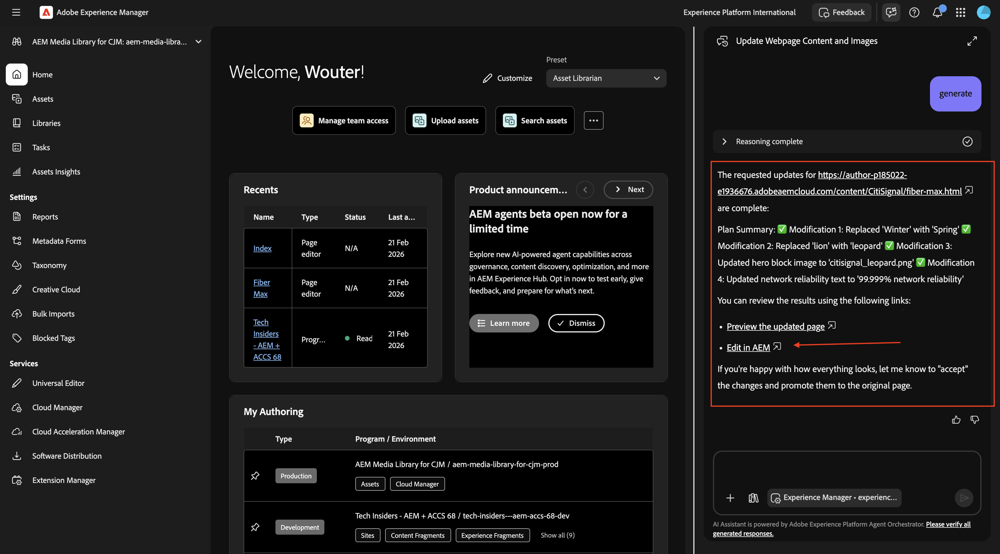

ユニバーサルエディターでは、すべての変更点が詳細に表示され、何かを変更する機能が表示されます。 ページを確認したら、**公開**&#x200B;をクリックします。

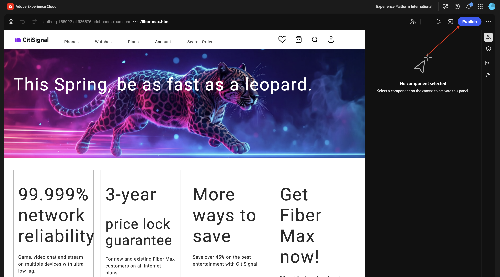

**公開**&#x200B;をもう一度クリックします。 変更はまだ本番環境に公開されていません。 代わりに、AEMの&#x200B;**Launches**&#x200B;に公開されています。

ローンチ機能を使用すると、今後のリリースに向けてコンテンツを効率的に開発できます。 ローンチは、現在のページを維持すると同時に、今後の公開に備えて変更を加えることができるように作成されます。 つまり、現在公開されているページと、それらのページのバージョンを、将来公開するバージョンの2つのバージョンを同時に効果的に編集しています。 その時点で、元のページを置き換え、新しいバージョンを公開できます。

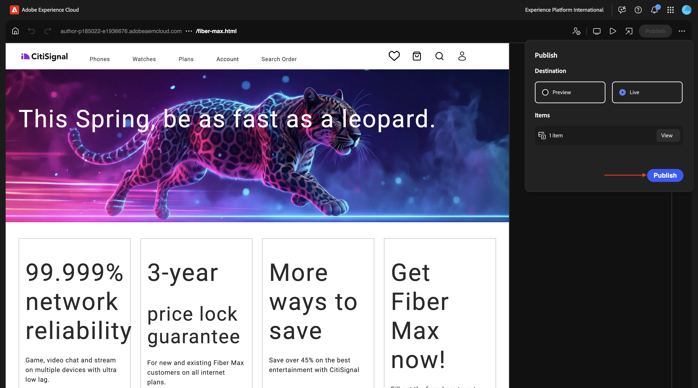

今後のリリース用に保留中の変更内容を&#x200B;**プロモーション**&#x200B;するには、AEMに戻ります。 ページ上部の&#x200B;**Adobe Experience Manager**&#x200B;をクリックし、**ハンマー** アイコンをクリックしてから、**起動**&#x200B;を選択します。


保留中の&#x200B;**Launch**&#x200B;が表示されます。 保留中の&#x200B;**起動**&#x200B;の前にあるチェックボックスをオンにします。


「**プロモーション**」をクリックします。

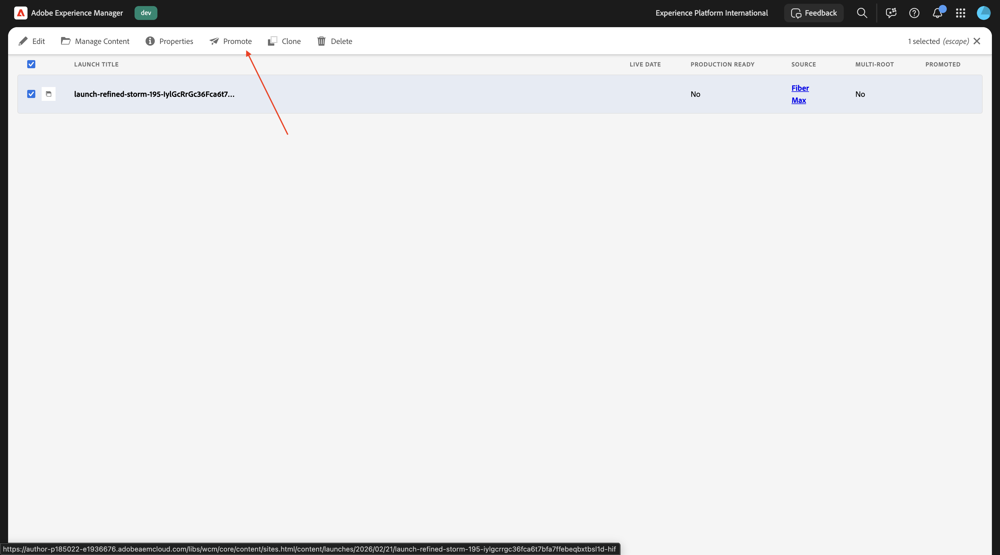

**完全なローンチを促進**&#x200B;を選択し、**次へ**&#x200B;をクリックします。


「**プロモーション**」をクリックします。


今これを見るべきです。 変更内容は現在本番稼動中です。


ページを更新すると、公開されたページにすべての変更が表示されます。


または、手作業でプロモーションプロセスを実行する代わりに、AI アシスタントにプロンプト `accept`を入力することもできます。


その後、変更が公開されていることを確認する必要があります。

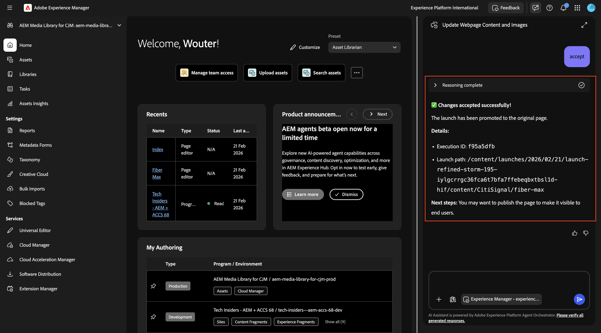

### コンテンツの更新 – フォーム作成

モジュール [Adobe Experience Manager Forms Edge Delivery Services](./../../asset-mgmt/module1.3/aemforms.md){target="_blank"}では、手作業でフォームを作成する手順を確認できます。

フォーム作成スキルにより、開発チームやIT部門に依存することなく、自然言語によるプロンプトを通じてアダプティブフォームを作成できるようになりました。 この機能により、ブランドの一貫性を維持しながらフォームの開発が加速し、ビジネスユーザーは技術的な知識がなくてもフォームを作成できます。

[https://experience.adobe.com/#/ai-assistant/chat](https://experience.adobe.com/#/ai-assistant/chat)に移動します。

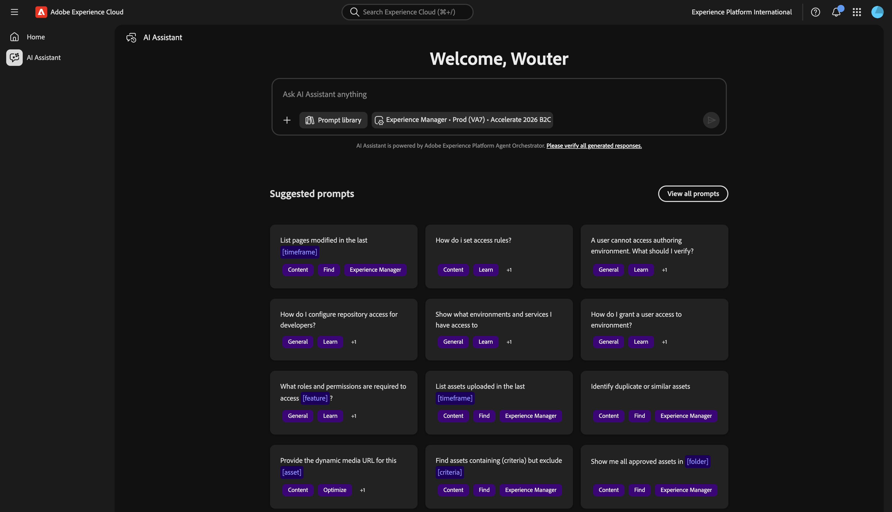

次のプロンプトを入力し、**send**&#x200B;をクリックします。

```
Create a new adaptive form using Edge Delivery Services and the existing CitiSignal site, with the following details:
- Form name: "citisignal-fiber-max-interest-2"
- Form fields: 4 text input fields are needed, for "first-name", "last-name", "email" and "city"
- When the form is submitted, send the submission to a spreadsheet, with this URL: https://docs.google.com/spreadsheets/d/1WwKrcM8mZ2d_W3sMheUAw3nFhP_OFk05TsqxhHkudfQ/edit?usp=sharing.
```

## 次の手順

[1.6.2 AEM MCP Servers &amp; Cursor](./ex2.md){target="_blank"}に移動

[AEM &amp; Agents](./aemagents.md){target="_blank"}に戻る

[すべてのモジュールへ戻る](./../../../overview.md){target="_blank"}
