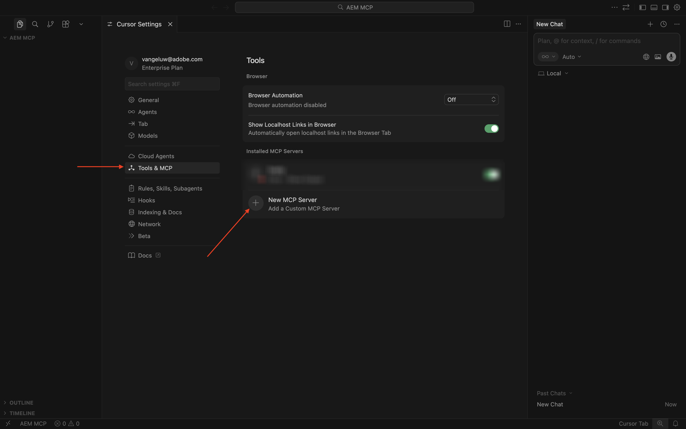
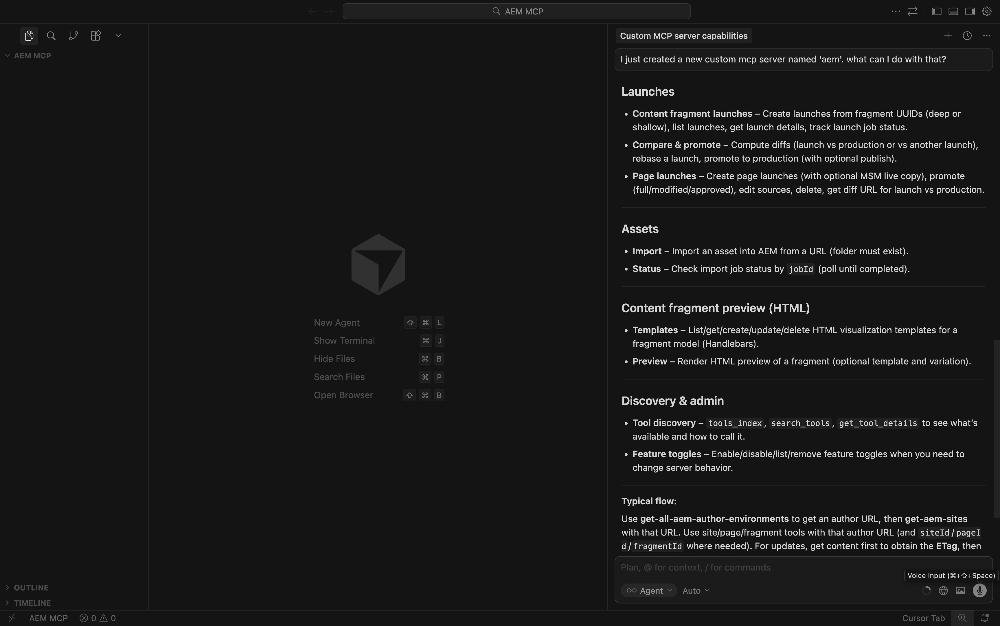
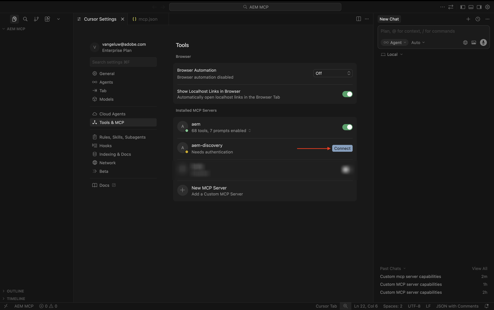

# 1.6.2 AEM MCP サーバとカーソル

>[!IMPORTANT]
>
>この演習を行うには、EDS 環境で動作するAEM SitesとAssets CS にアクセスし、使用している IMS 組織で様々なAEM エージェントを有効にする必要があります。
>
>そのような環境がまだない場合は、[Adobe Experience Manager、Cloud Service、Edge Delivery Services](./../../../modules/asset-mgmt/module2.1/aemcs.md){target="_blank"} の演習に進んでください。 指示に従うと、そのような環境にアクセスできます。

>[!IMPORTANT]
>
>以前、AEM CS プログラムをAEM SitesとAssets CS 環境で設定したことがある場合は、AEM CS サンドボックスが休止状態になっている可能性があります。 このようなサンドボックスの休止解除には 10～15 分かかるので、後で待つ必要がないように、今すぐ休止解除プロセスを開始することをお勧めします。


使用可能なすべてのAEM MCP サーバーを次に示します。

- https://mcp.adobeaemcloud.com/adobe/mcp/content
- https://mcp.adobeaemcloud.com/adobe/mcp/content-readonly （読み取り専用コンテンツ操作）
- https://mcp.adobeaemcloud.com/adobe/mcp/content-updater （対応するスキルを Experience Production エージェントから公開します）
- https://mcp.adobeaemcloud.com/adobe/mcp/experience-governance （ページのブランドポリシーを取得および確認するスキルを公開します）
- https://mcp.adobeaemcloud.com/adobe/mcp/discovery（AEM環境でコンテンツを検出するスキルを公開します）

この演習では、これらの特定の MCP サーバの使用方法について説明します。

- https://mcp.adobeaemcloud.com/adobe/mcp/content
- https://mcp.adobeaemcloud.com/adobe/mcp/discovery

プロセスはよく似ているので、以下の手順を使用して、利用可能な他のAEM MCP サーバーに同様の MCP サーバーを設定することができます。

## 1.6.2.1 Experience Production Agent Cursor MCP サーバーのセットアップ

デスクトップに新しい空のフォルダーを作成します。


カーソルを開きます。 **プロジェクトを開く** をクリックします。


前に作成したフォルダーを選択し、「**開く**」をクリックします。


**はい、作成者を信頼します** をクリックします。


この画像が表示されます。 キーボードショートカット `Cmd + Shift + J` を使用して、カーソル設定を開きます。 この画像が表示されます。 **ツールと MCP** に移動します。


[**+ New MCP Server**] をクリックします。



次の MCP サーバーをファイル **mcp.json** に追加します。 このファイルには既に他の MCP サーバが指定されている可能性があります。これらを削除せずに、以下の新しい行を追加してください。 変更を保存します。

```json
"aem": {
	"url": "https://mcp.adobeaemcloud.com/adobe/mcp/content"
	}
```


タブ **カーソル設定** に戻ります。 **aem** というツールが MCP サーバーのリストに追加されました。 **接続** をクリックして、Adobe アカウントを使用して認証します。


このメッセージが表示されたら、「**開く**」をクリックします。 次に、ブラウザーで認証する必要があります。


認証が成功すると、次のように表示されます。


**Cursor Settings** タブと **mcp.json** タブを閉じます。 次のプロンプトをチャットに貼り付けて、「**送信**」をクリックします。

```
I just created a new custom mcp server named 'aem'. what can I do with that?
```


**実行** をクリックします。


その後、同様の応答が表示されます。




ご覧のように、前の演習で AI アシスタントを使用して可能だったものと比較して、カーソルの MCP サーバーを通じて同様の機能が公開されます。

次のプロンプトを入力し、「**送信**」をクリックします。

```javascript
List AEM Author instances
```


次のようなメッセージが表示されます。 使用する環境を検索し、次のプロンプトを入力して「**送信**」をクリックします。

```javascript
use environment number X
```


この画像が表示されます。


次のプロンプトを貼り付け、「**送信**」をクリックします。 このプロンプトで XXX を、前の演習でコピーした URL に置き換えます。

```
On the page https://author-p185022-e1936676.adobeaemcloud.com/content/CitiSignal/fiber-max.html, please make the following changes:

- change the word 'winter' to 'summer'
- change the text 'be as fast as a leopard' to 'dominate your internet like a gorilla'
- change the image in the hero block to use the image 'citisignal_gorilla.png'
- change the text '99.9% network reliability' to '99.998% network reliability'
```


1～2 分後、同様の応答が得られます。 URL をコピーし、ブラウザーでページを開きます。


この画像が表示されます。


次のプロンプトを入力し、「**送信**」をクリックします。

```javascript
promote the changes by creating a new launch and promoting it
```


1～2 分後、変更が昇格されました。


これで、変更が web サイトにライブで表示されるようになります。


AEM MCP サーバーのその他の機能については、ご自由に参照してください。

## 1.6.2.2 Discovery Agent Cursor MCP Server のセットアップ

キーボードショートカット `Cmd + Shift + J` を使用して、カーソル設定を開きます。 この画像が表示されます。 **ツールと MCP** に移動します。 [**+ New MCP Server**] をクリックします。


次の MCP サーバーをファイル **mcp.json** に追加します。 このファイルには既に他の MCP サーバが指定されている可能性があります。これらを削除せずに、以下の新しい行を追加してください。 変更を保存します。

```
,
"aem-discovery": {
	"url": "https://mcp.adobeaemcloud.com/adobe/mcp/discovery"
}
```


タブ **カーソル設定** に戻ります。 **aem** というツールが MCP サーバーのリストに追加されました。 **接続** をクリックして、Adobe アカウントを使用して認証します。



認証後、このメッセージが表示されます。


**Cursor Settings** タブと **mcp.json** タブを閉じます。 次のプロンプトをチャットに貼り付けて、「**送信**」をクリックします。

```
I just created a new custom mcp server named 'aem-discovery'. what can I do with that?
```


```
for the environment https://author-pXXXXXX-eXXXXXXX.adobeaemcloud.com/, list all assets tagged with 'Spring 2026'
```


次のようなメッセージが表示されます。


## 次の手順

[AEMとエージェント &#x200B;](./aemagents.md){target="_blank"} に戻る

[&#x200B; すべてのモジュールに戻る &#x200B;](./../../../overview.md){target="_blank"}