# 1.6.3 ChatGPT および MCP サーバーを使用したコンテンツフラグメントの拡張

>[!IMPORTANT]
>
>この演習を行うには、EDS 環境で動作するAEM SitesとAssets CS にアクセスし、使用している IMS 組織で様々なAEM エージェントを有効にする必要があります。
>
>そのような環境がまだない場合は、[Adobe Experience Manager、Cloud Service、Edge Delivery Services](./../../../modules/asset-mgmt/module2.1/aemcs.md){target="_blank"} の演習に進んでください。 指示に従うと、そのような環境にアクセスできます。

>[!IMPORTANT]
>
>以前、AEM CS プログラムをAEM SitesとAssets CS 環境で設定したことがある場合は、AEM CS サンドボックスが休止状態になっている可能性があります。 このようなサンドボックスの休止解除には 10～15 分かかるので、後で待つ必要がないように、今すぐ休止解除プロセスを開始することをお勧めします。

## 1.6.3.1 コンテンツフラグメントモデルを作成する

Adobe Experience Manager オーサー環境の **ツール** に戻り、**設定ブラウザー** に移動します。


「**作成**」をクリックします。


フィールド `Content Fragments` タイトル **と** 名前 **に** を使用します。

オプション **コンテンツフラグメントモデル** と **GraphQL永続クエリ** の両方が有効になっていることを確認します。

「**作成**」をクリックします。


Adobe Experience Manager オーサー環境に戻り、**コンテンツフラグメント** に移動します。

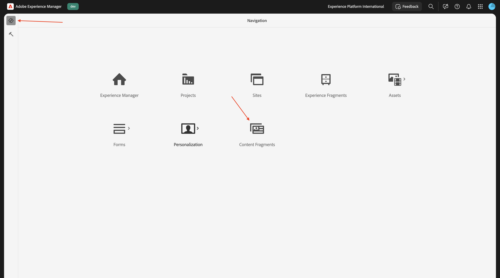

**コンテンツフラグメントモデル** に移動し、設定 **コンテンツフラグメント** を選択して **作成** をクリックします。

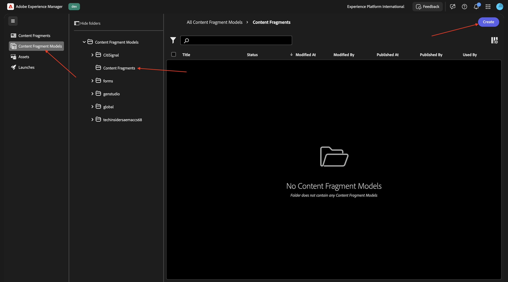

`--aepUserLdap-- - CitiSignal CFM` という名前を使用します。 **作成して開く** をクリックします。


この画像が表示されます。 **1 行のテキスト** フィールドをキャンバスにドラッグ&amp;ドロップします。


フィールド **フィールドラベル** を `Header` に変更します。


**データタイプ** に戻ります。 **1 行のテキスト** フィールドをキャンバスにドラッグ&amp;ドロップします。


フィールド **フィールドラベル** を `Subheader` に変更します。


**データタイプ** に戻ります。 **複数行テキスト** フィールドをキャンバスにドラッグ&amp;ドロップします。


フィールド **フィールドラベル** を `Detail Description` に変更します。

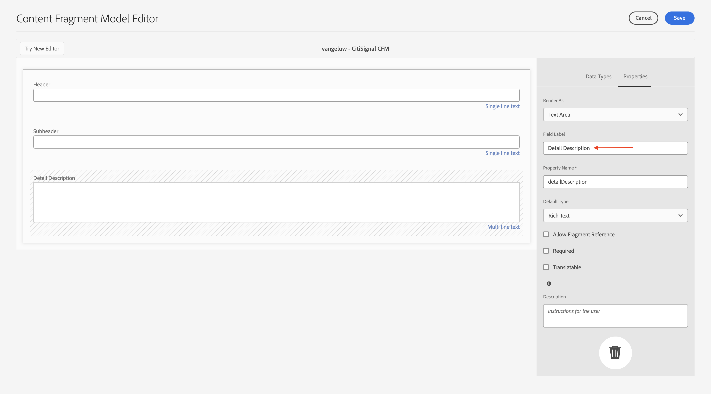

**データタイプ** に戻ります。 **1 行のテキスト** フィールドをキャンバスにドラッグ&amp;ドロップします。

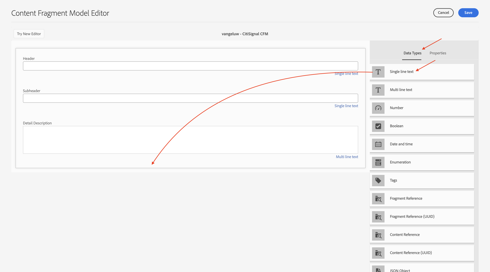

フィールド **フィールドラベル** を `CTA Text` に変更します。

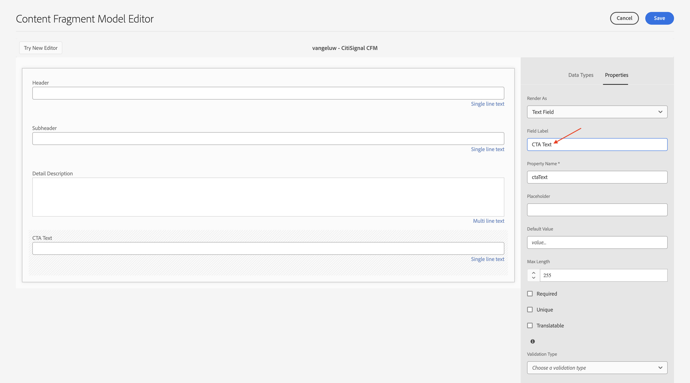

**データタイプ** に戻ります。 **1 行のテキスト** フィールドをキャンバスにドラッグ&amp;ドロップします。

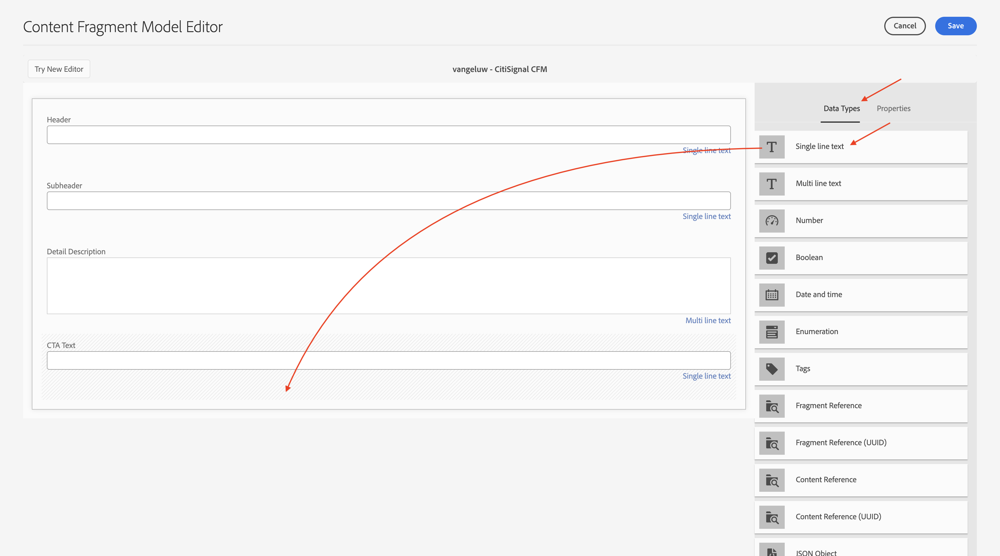

フィールド **フィールドラベル** を `CTA Link` に変更します。 「**保存**」をクリックします。


この画像が表示されます。

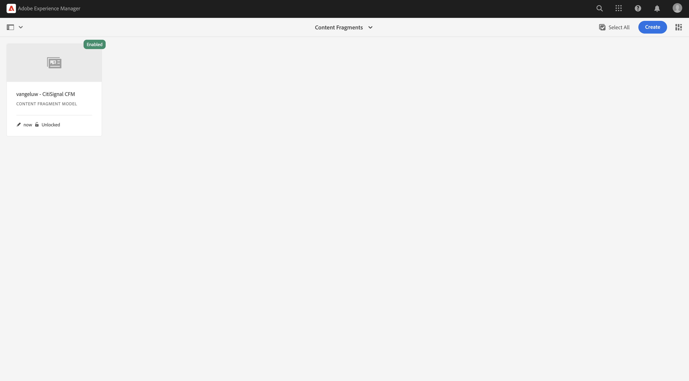

コンテンツフラグメントモデルを選択し、「**公開**」をクリックします。

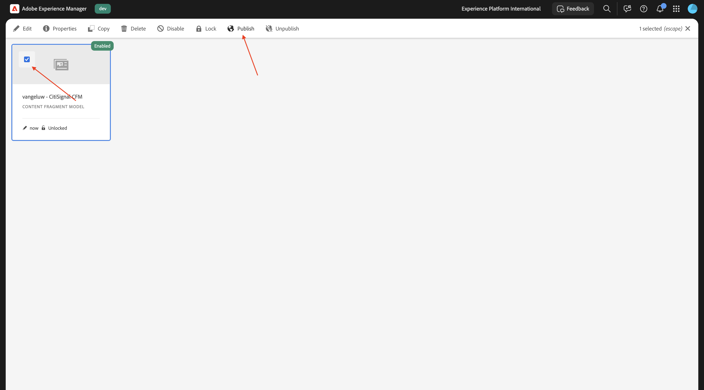

「**公開**」をクリックします。

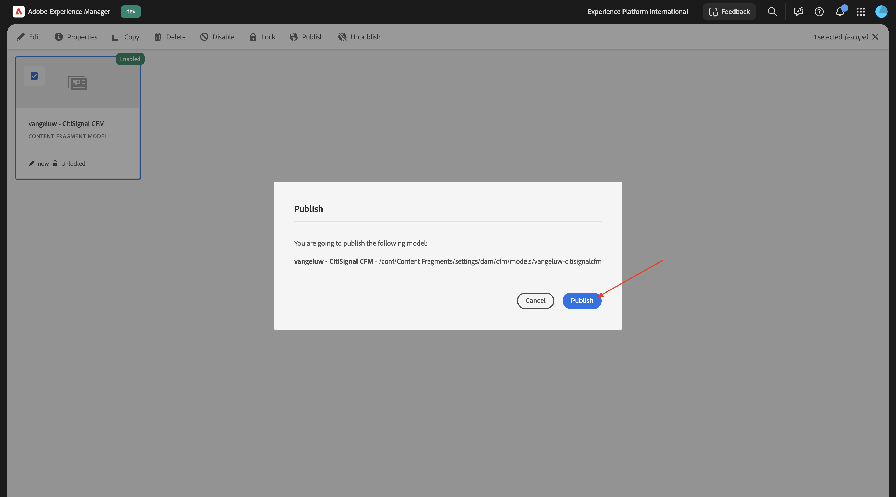

## 1.6.3.2 コンテンツフラグメントの作成

Adobe Experience Manager オーサー環境に戻り、**コンテンツフラグメント** に移動します。


この画像が表示されます。 **作成** をクリックし、「**フォルダー**」を選択します。


タイトルを「`--aepUserLdap-- - CF`」と入力します。 「**作成**」をクリックします。

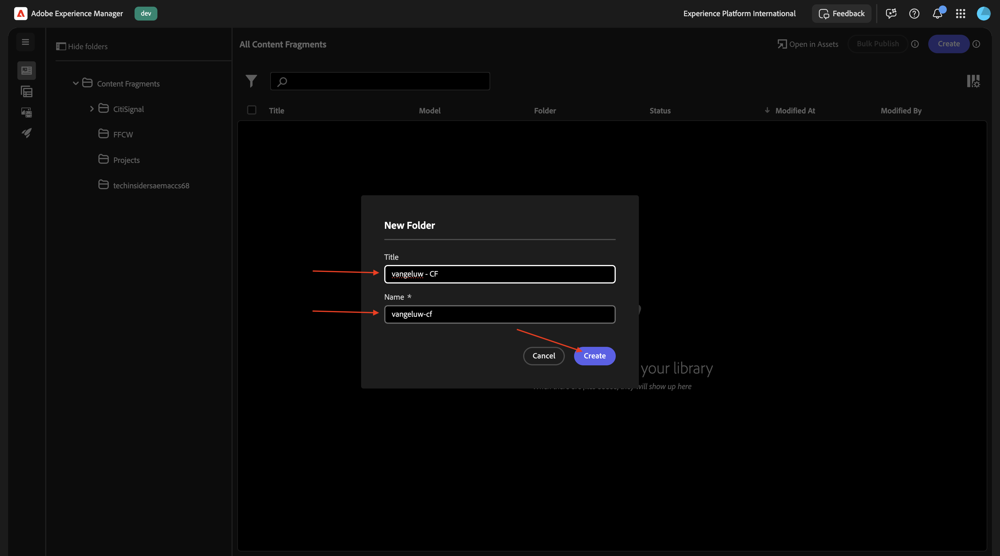

Adobe Experience Manager オーサー環境に戻り、**Assets** に移動します。


**ファイル** に移動します。

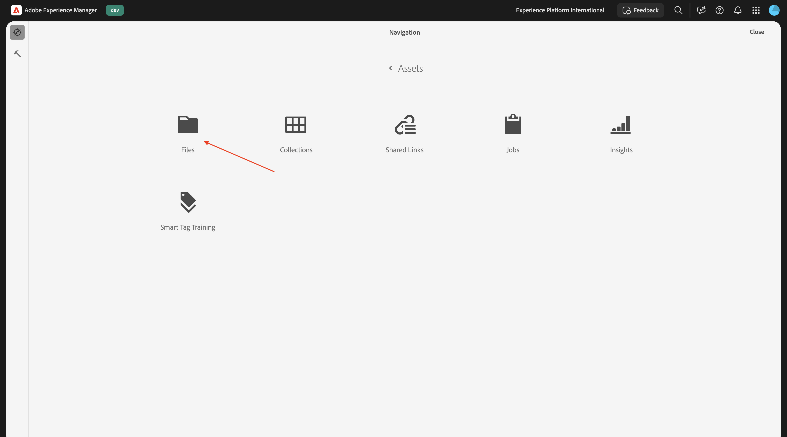

作成したフォルダー（`--aepUserLdap-- - CF` という名前）を選択し、「**プロパティ**」をクリックします。


**クラウドサービス** に移動し、「**フォルダー**」アイコンをクリックします。


前に作成したクラウド設定を選択します。名前は **コンテンツフラグメント** にする必要があります。 「**選択**」をクリックします。

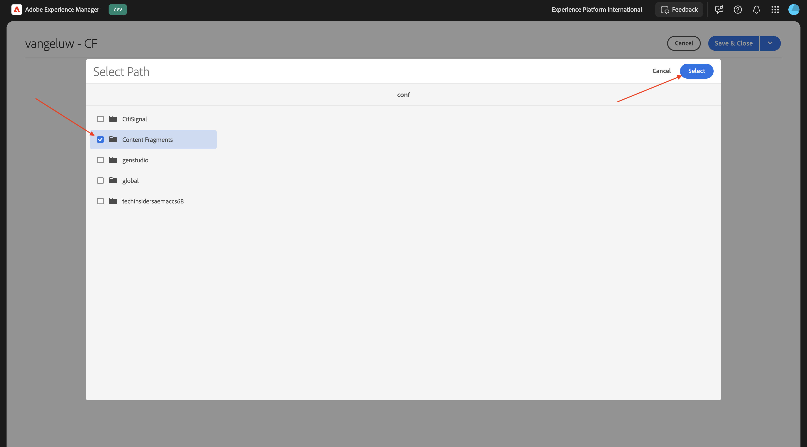

これを確認する必要があります。 「**保存して閉じる**」をクリックします。


Adobe Experience Manager オーサー環境に戻り、**コンテンツフラグメント** に移動します。


この画像が表示されます。 **作成** をクリックし、「**コンテンツフラグメント**」を選択します。

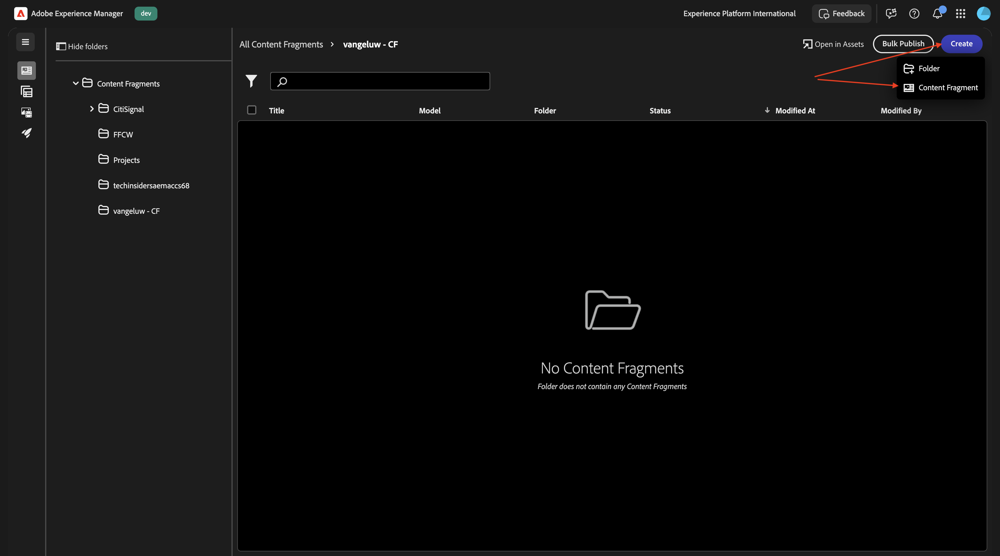

前に作成した **コンテンツフラグメントモデル** を選択します。`--aepUserLdap-- - CitiSignal CFM` という名前を付ける必要があります。 `--aepUserLdap-- CitiSignal Fiber Max` という名前を使用します。

**作成して開く** をクリックします。

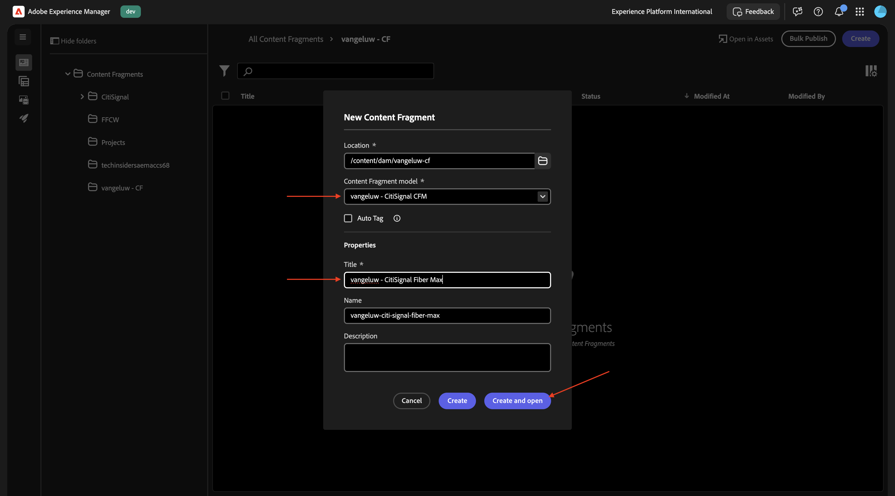

この画像が表示されます。


次のようにフィールドに入力します。

- **ヘッダー**: `CitiSignal Fiber Max`
- **サブヘッダー**: `Experience high speed internet now`
- **詳細説明**:

```
Experience the future of connectivity with CitiSignal Fiber Max, the ultimate solution for high-speed internet. Designed for homes and businesses that demand performance, Fiber Max delivers blazing-fast fiber speeds, ensuring seamless streaming, ultra-responsive gaming, and crystal-clear video calls.

Key Features:

Unmatched Speed: Enjoy lightning-fast downloads and uploads powered by cutting-edge fiber technology.
Reliable Performance: Consistent connectivity for work, entertainment, and everything in between.
Future-Ready: Built to handle the growing demands of smart homes and digital lifestyles.
Unlimited Potential: No data caps, no throttling—just pure speed.
Why Choose CitiSignal Fiber Max? Stay ahead with internet that works as hard as you do. Whether you’re powering a remote office or streaming in 4K, Fiber Max ensures you never miss a beat.
```

**CTA テキスト**: `Upgrade now by signing your new contract!`
**CTA リンク**: `https://techinsiders68.adobedemosystem.com/`

「**公開**」をクリックし、「**今すぐ**」を選択します。

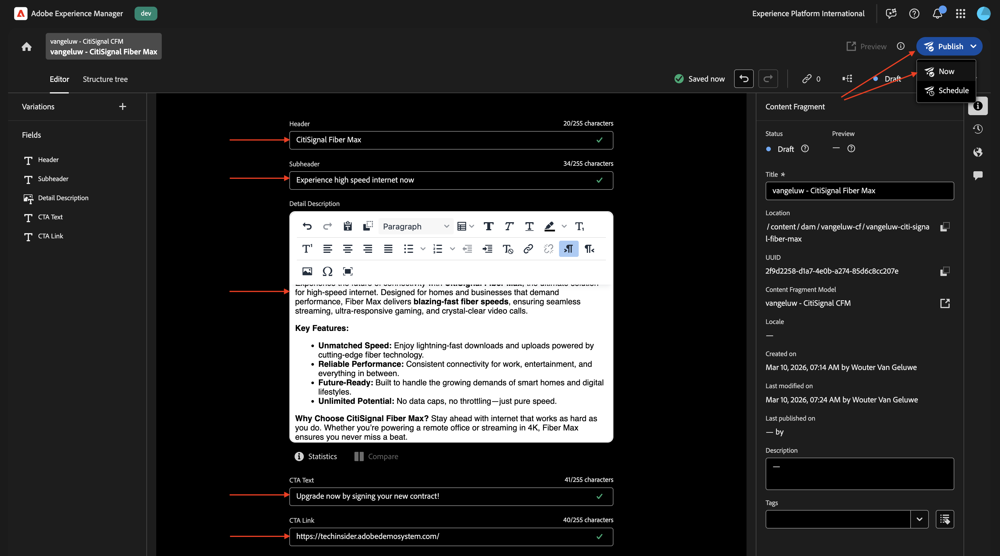

「**公開**」をクリックします。

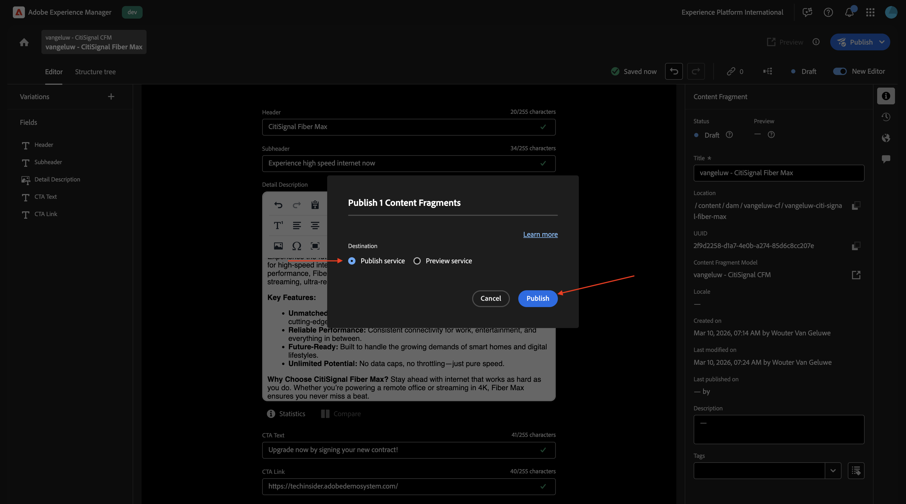

## 1.6.3.3 ChatGPT での MCP サーバーの設定

>[!NOTE]
>
>ChatGPT でAdobe Marketing Agentを使用するには、次が必要です。
>- openai の ChatGPT Enterprise の有料版
>- chatGPT Enterprise web クライアントの使用

[https://chatgpt.com/](https://chatgpt.com/){target="_blank"} に移動し、アカウントの詳細を使用してログインします。 ログインすると、このが表示されます。 ユーザー名をクリックし、「**設定**」を選択します。

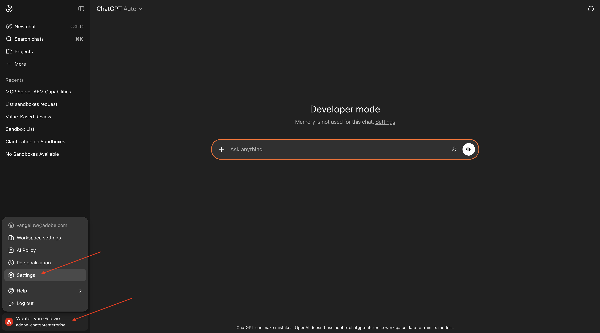

**アプリ** に移動し、**詳細設定** を選択します。


**開発者モード** をオンにしてから、[ 戻る **をクリック** します。


**アプリを作成** をクリックします。


次のようにフィールドに入力します。

- **名前**: `aem`
- **MCP サーバー URL**: `https://mcp.adobeaemcloud.com/adobe/mcp/content`
- **認証**: `OAuth`

**理解して続行する** のチェックボックスをオンにします。

「**作成**」をクリックします。


ChatGPT はAdobe アカウントへの接続を試みます。 **アクセスを許可** を選択すると、Adobe アカウントでログインする必要があります。

正常にログインすると、Adobe Marketing Agentが正常に接続されたことがわかります。

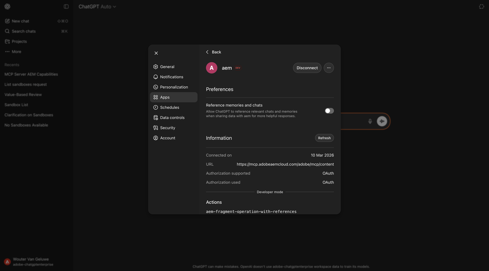

## 1.6.3.4 ChatGPT でAEM MCP サーバーを使用するには

このウィンドウを閉じます。


この画像が表示されます。 「**+**」アイコンをクリックし、「**詳細**」に移動して「**aem**」を選択します。

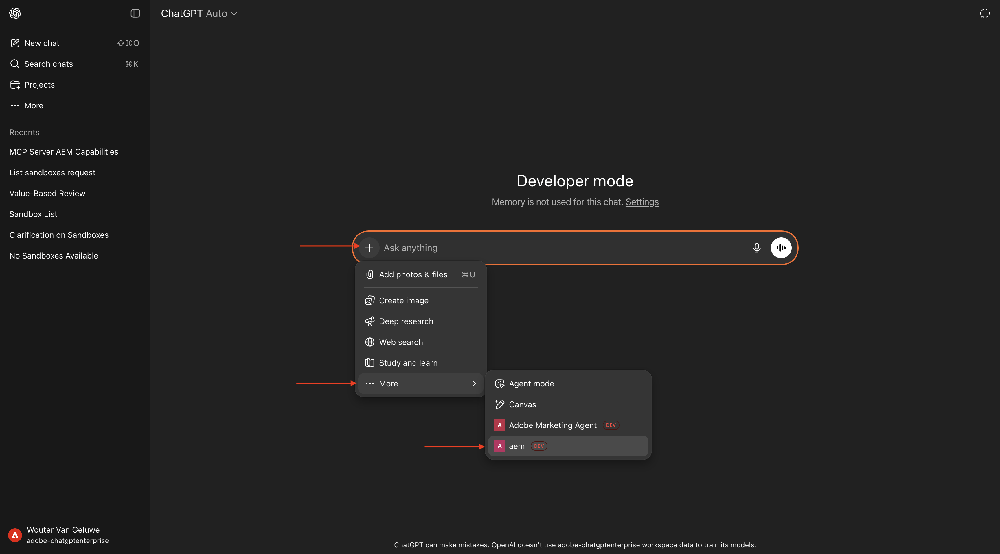

次のプロンプトを入力し、「**送信**」をクリックします。

```
I just created a new custom mcp server named 'aem'. what can I do with that?
```


次のようなメッセージが表示されます。 次のプロンプトを入力し、「**送信**」をクリックします。

```
use the author url https://author-pXXXXXX-eXXXXXXX.adobeaemcloud.com/ from now on
```


次のようなメッセージが表示されます。 次のプロンプトを入力し、「**送信**」をクリックします。

```
find the content fragment --aepUserLdap-- - CitiSignal Fiber Max and make a variation called --aepUserLdap-- - CitiSignal Fiber Max (FR), then translate all fields into french
```

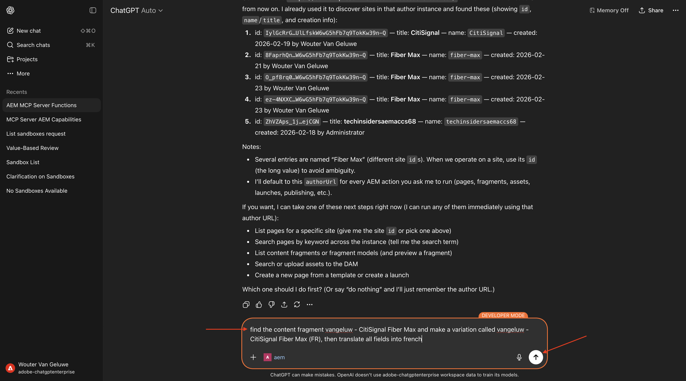

**CreateFragmentVariation** をクリックします。

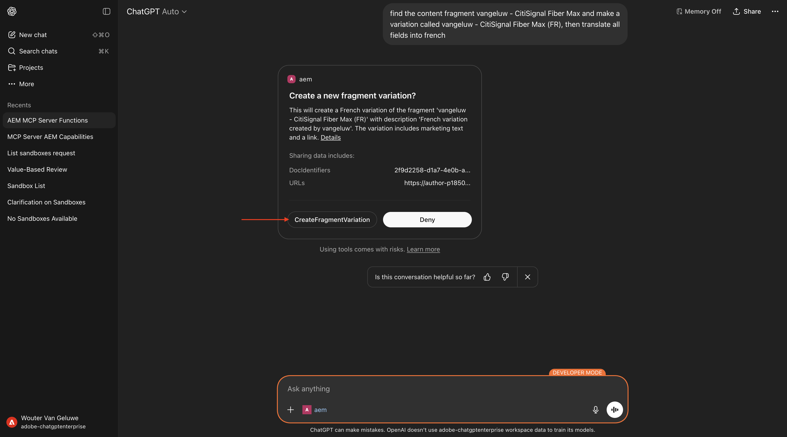

**UpdateFragment** をクリックします。

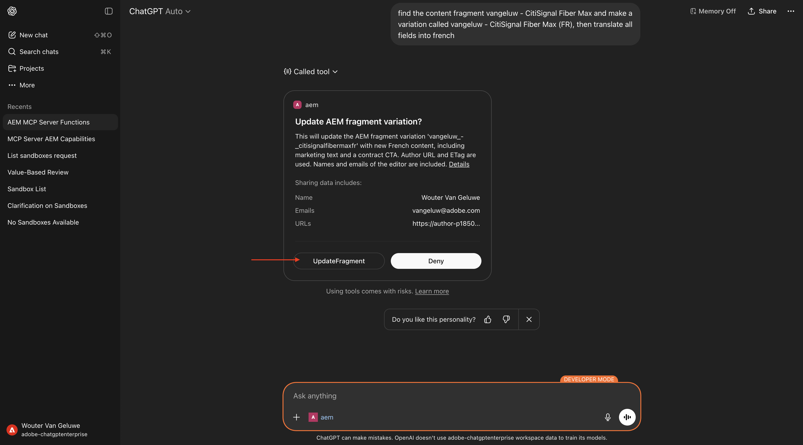

この画像が表示されます。 フラグメントバリエーションが正常に作成されました。

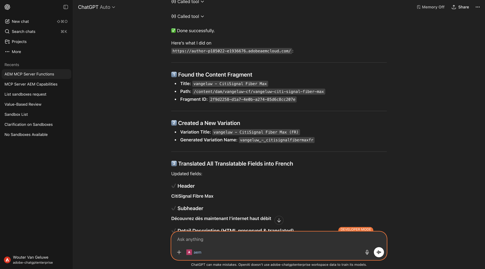

AEM UI でも新しいバリエーションを表示できるようになりました。


## 次の手順

[AEMとエージェント ](./aemagents.md){target="_blank"} に戻る

[ すべてのモジュールに戻る ](./../../../overview.md){target="_blank"}