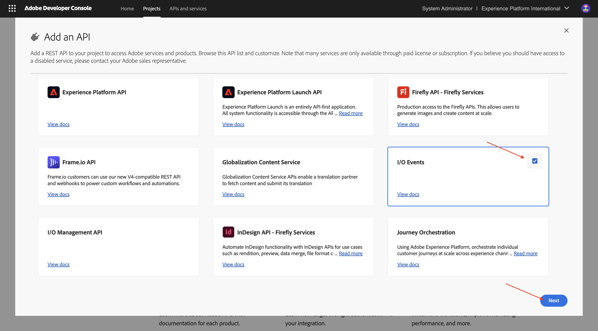
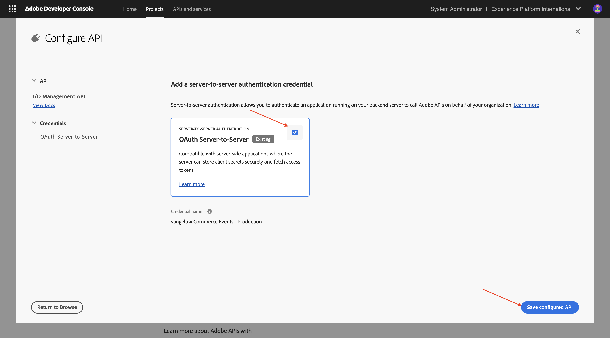
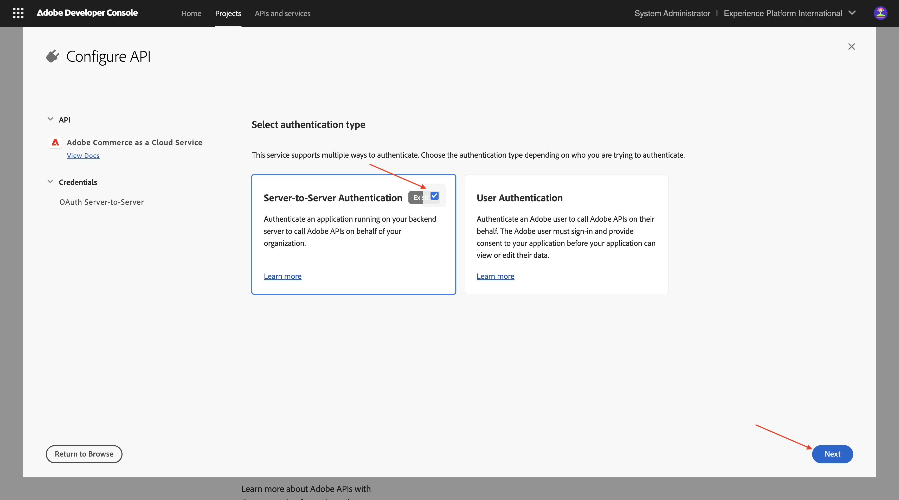
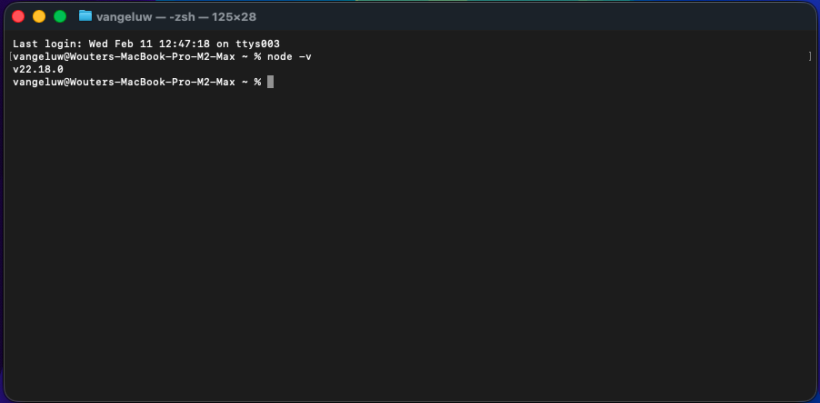
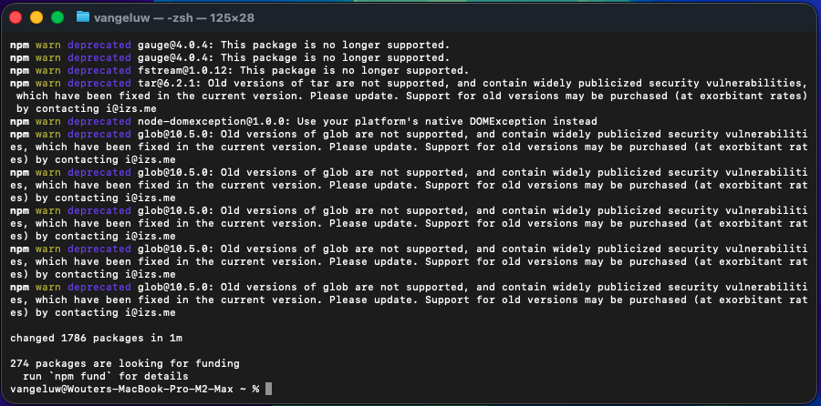

# 1.7.1 開発環境のセットアップ

## Adobe I/O プロジェクトの 1.7.1.1 作成

[https://developer.adobe.com/console/home](https://developer.adobe.com/console/home){target="_blank"} に移動します。

画面の右上隅で正しいインスタンスを選択してください。 インスタンスは `--aepImsOrgName--` です。

>[!NOTE]
>
> 次のスクリーンショットは、特定の組織が選択されていることを示しています。 このチュートリアルを進めていくと、組織の名前が異なる可能性が非常に高くなります。 このチュートリアルに登録したときに、使用する環境の詳細が提供されました。これらの手順に従ってください。

次に、「**テンプレートからプロジェクトを作成**」を選択します。

「**App Builder**」を選択します。

`--aepUserLdap-- vangeluw Commerce Events` という名前を入力します。 「**保存**」をクリックします。

次のようなメッセージが表示されます。

「**+ サービスを追加」をクリックし** 「**API**」を選択します。

API **I/O イベント** を検索して選択します。 「**次へ**」をクリックします。

資格情報の名前を `vangeluw Commerce Events - Production` に変更します。 **設定済み API を保存** をクリックします。

この画像が表示されます。 「**+ サービスを追加」をクリックし** 「**API**」を選択します。

API **I/O Management API** を検索して選択します。 「**次へ**」をクリックします。

**設定済み API を保存** をクリックします。

この画像が表示されます。 「**+ サービスを追加」をクリックし** 「**API**」を選択します。

API **Adobe Commerce as a Cloud Service** を検索して選択します。 「**次へ**」をクリックします。

「**サーバー間認証**」を選択します。 「**次へ**」をクリックします。

「**次へ**」をクリックします。

**デフォルト - Cloud Manager** を選択します。 **設定済み API を保存** をクリックします。

この画像が表示されます。 「**+ サービスを追加」をクリックし** 「**API**」を選択します。

Adobe Commerceの API **Adobe I/O Events** を検索して選択します。 「**次へ**」をクリックします。

**設定済み API を保存** をクリックします。

これで、プロジェクトが設定され、使用できるようになりました。

## 開発環境 1.7.1.2 設定するには

拡張可能なアプリを作成、送信、およびデプロイするには、コンピューター上のローカル開発環境に次のアプリケーションおよびパッケージがインストールされている必要があります。

- Node.js （バージョン 20.x 以降）
- npm （Node.js とともにパッケージ化）
- Adobe Developer コマンドラインインターフェイス（CLI）

これらのアプリケーションやパッケージがまだコンピューターにインストールされていない場合は、次の手順に従います。

### Node.js および npm

[https://nodejs.org/en/download](https://nodejs.org/en/download) に移動します。 Node.js と npm をインストールするために実行する必要がある多数のターミナルコマンドが表示されます。 ここに示すコマンドは、MacBook に適用できます。

まず、新しいターミナルウィンドウを開きます。 スクリーンショットの 2 行目で示されているコマンドを貼り付けて実行します。

`curl -o- https://raw.githubusercontent.com/nvm-sh/nvm/v0.40.3/install.sh | bash`

次に、スクリーンショットの 5 行目でコマンドを実行します。

`\. "$HOME/.nvm/nvm.sh"`

両方のコマンドを正常に実行したら、次のコマンドを実行します。

`node -v`

返されるバージョン番号が表示されます。

次に、次のコマンドを実行します。

`npm -v`

NPM がまだインストールされていない場合は、次のコマンドを使用してインストールできます：`npm install -g npm@11.9.0`。

返されるバージョン番号が表示されます。

最後の 2 つのコマンドが正常にバージョン番号を返した場合、これらの 2 つの機能の設定は成功しています。

### Adobe Developer コマンドラインインターフェイス（CLI）

Adobe Developer コマンドラインインターフェイス（CLI）をインストールするには、ターミナルウィンドウで次のコマンドを実行します。

`npm install -g @adobe/aio-cli`

このコマンドの実行には数分かかることがあります。最終的な結果は次のようになります。

これで、Adobe Developer コマンドラインインターフェイス（CLI）も正常にインストールされました。

### Commerce用Adobe Developer コマンドラインインターフェイス（CLI）SDK拡張機能

Adobe I/O SDK extension for Commerceをインストールするには、ターミナルウィンドウで次のコマンドを実行します。

`npm install @adobe/aio-commerce-sdk`

### Adobe I/O CLI 用のAdobe Commerce プラグイン

Adobe I/O CLI 用のAdobe Commerce プラグインをインストールするには、ターミナルウィンドウで次のコマンドを実行します。

`aio plugins:install https://github.com/adobe-commerce/aio-cli-plugin-commerce @adobe/aio-cli-plugin-app-dev @adobe/aio-cli-plugin-runtime`

これで、Adobe Commerce、Adobe I/O Events、Adobe I/O Runtimeと組み合わせて、App Builder プロジェクトを実行できる基本的な要素を設定しました。

## 次の手順

[Cursor.ai を使用してプロジェクトを開発 ](./ex2.md){target="_blank"} に移動します

[Intelligent Developer Tools for Adobe Commerce](./aiassisteddev.md){target="_blank"} に戻る

[ すべてのモジュールに戻る ](./../../../overview.md){target="_blank"}
