# 1.7.2 Cursor を使用してプロジェクトを開発する

## 1.7.2.1 ディレクトリとツールの設定

デスクトップで、`--aepUserLdap---commerce` という名前で新しいディレクトリを作成します。

フォルダを右クリックし、**フォルダに新しいターミナル** を選択します。

この画像が表示されます。

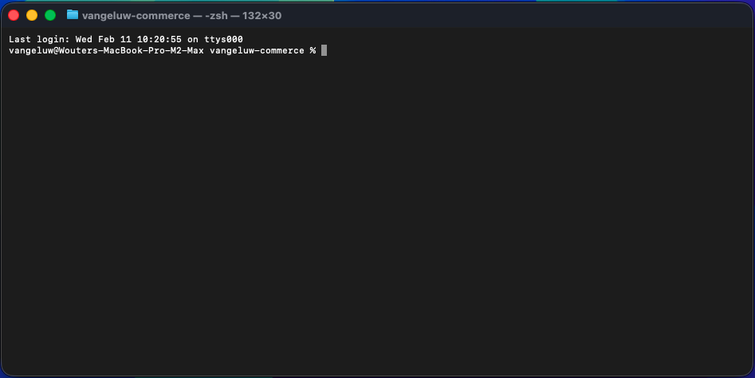

次に、既存の Github リポジトリを複製する必要があります。これは、[https://github.com/adobe/commerce-integration-starter-kit](https://github.com/adobe/commerce-integration-starter-kit) で確認できます。

このリポジトリーは、Adobeを使用したAdobe Developer App Builder統合スターターキットで、リアルタイムの接続信頼性を高め、Adobe Commerceと ERP、CRM、PIM などの他のバックオフィスシステムとの統合の市場投入までの時間を短縮します。

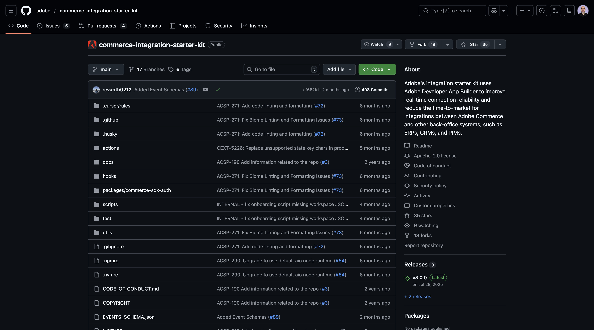

このリポジトリを複製する方法はいくつかあります。この例では、ターミナルが使用されます。

ターミナルウィンドウに次のコマンドを入力して実行します。

`git clone https://github.com/adobe/commerce-integration-starter-kit`

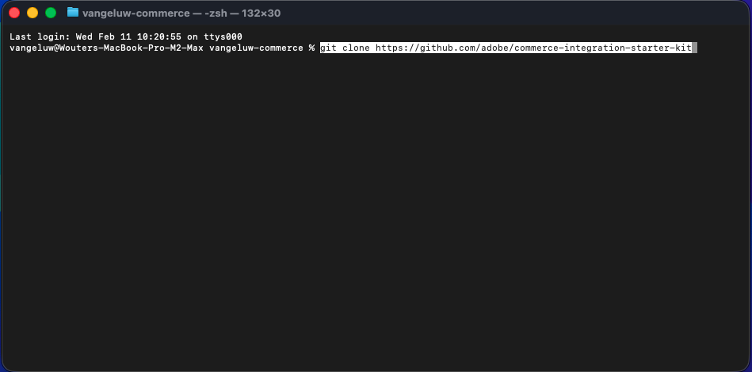

数秒後、この結果が表示されます。

次に、先ほど作成したフォルダーに移動します。 次のコマンドを入力して実行します。

`cd commerce-integration-starter-kit`

この画像が表示されます。

次に、Cursor のCommerce拡張ツールを設定する必要があります。 次のコマンドを入力して実行します。

`aio commerce extensibility tools-setup`

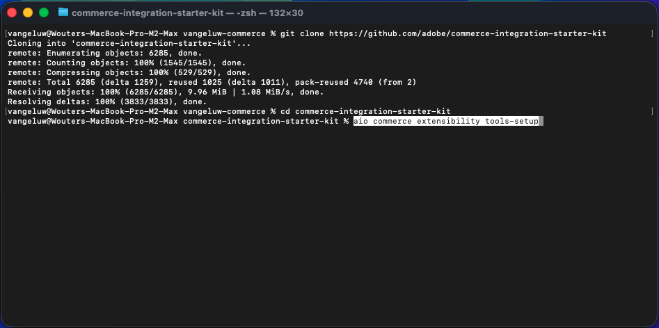

**現在のディレクトリ** を選択します。

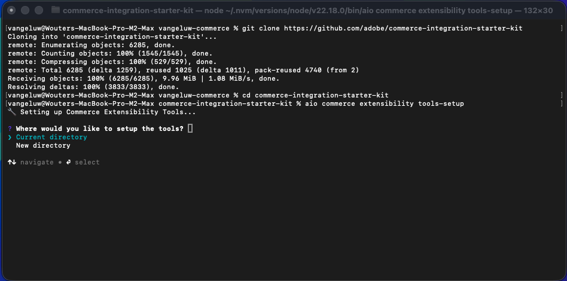

**カーソル** を選択します。

**npm** を選択します。

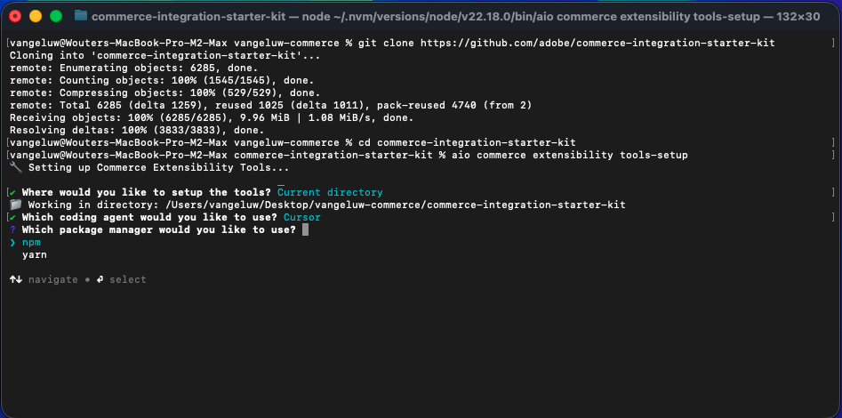

数分後、これが表示されます。

Cursor 用のCommerce拡張ツールをインストールすると、Cursor 環境の一部として MCP サーバーを使用できるようになります。 次の演習では、その MCP サーバーを使用して、App Builder プロジェクトの開発とデプロイを支援します。

## 1.7.2.2 Webhook の設定

この演習では、注文を作成したときに注文イベントをその Webhook にストリーミングできるように、設定する必要がある Webhook が必要です。 この演習では、[https://pipedream.com/requestbin](https://pipedream.com/requestbin) を使用してサンプルエンドポイントを使用します。

[https://pipedream.com/requestbin](https://pipedream.com/requestbin) に移動し、アカウントを作成してから、ワークスペースを作成します。 ワークスペースを作成すると、次のような情報が表示されます。

「**コピー**」をクリックして、URL をコピーします。 次の演習では、この URL を指定する必要があります。 この例の URL は `https://eodts05snjmjz67.m.pipedream.net` です。

## 1.7.2.3 Cursor でアプリを作成

カーソルを開きます。 **プロジェクトを開く** をクリックします。

作成したフォルダーに移動します。`--aepUserLdap---commerce` という名前を付ける必要があります。 そのフォルダーで、`commerce-integration-starter-kit` という名前のフォルダーを選択します。 「**開く**」をクリックします。

この画像が表示されます。 続行する前に、Cursor で開いている最上位フォルダーが `commerce-integration-starter-kit` であることを確認します。

キーボードショートカット `Cmd + Shift + J` を使用して、カーソル設定を開きます。 この画像が表示されます。 **ツールと MCP** に移動します。

MCP サーバーを有効にします **commerce-extensibility**。 完了したら、「**X**」をクリックしてウィンドウを閉じます。

次のプロンプトをコピーして、カーソルに貼り付けます。 次に、「**送信** ボタンをクリックします。

`I would like to build an app that subscribes to order created events and sends them to a configurable URL with basic authentication`

カーソルが推論と実行を開始します。 カーソルは数回確認を求められます。 その場合は、「実行 **をクリックし** す。 これは、推論と設定に応じて、5～10 回発生する可能性があります。

数分後、次のようなメッセージが表示されます。

次の手順は、Cursor で指定されているように、`.env` という名前のファイルを作成し、そこに必要な変数を指定します。

## 1.7.2.4.env ファイルの作成

ファイル **env.dist** を選択します。 コマンド `Cmd + C` を入力し、次にコマンド `Cmd + V` を入力します。

新しく作成したファイルの名前を `.env` に変更します。

次に、**.env** ファイル内のすべての変数の値を指定する必要があります。

ここでは、必要なすべての情報を見つけることができます。

### Commerce エンドポイント

これらの変数は、[https://experience.adobe.com](https://experience.adobe.com) で確認できます。 **Commerce** をクリックします。

この画像が表示されます。 ACCS 環境の横にある **information** アイコンをクリックします。このアイコンには `--aepUserLdap-- - ACCS` という名前を付ける必要があります。 REST エンドポイントとGraphQL エンドポイントの値をコピーします。

この例では、これらがコピーする値です。 ファイル **.env** の 6 行目と 7 行目で、以下の変数の横にペーストします。

- **COMMERCE_BASE_URL** = https://na1-sandbox.api.commerce.adobe.com/Lkp3U7tvTBNAmpFvwnZJ4B/
- **COMMERCE_GRAPHQL_ENDPOINT** = https://na1-sandbox.api.commerce.adobe.com/Lkp3U7tvTBNAmpFvwnZJ4B/graphql

すると、これは **.env** ファイルに含まれます。

### Adobe I/O プロジェクト変数

これらの変数は、[https://developer.adobe.com/console](https://developer.adobe.com/console) で確認できます。 **プロジェクト** に移動し、クリックして、前の演習で作成したAdobe I/O プロジェクトを開きます。`--aepUserLdap-- Commerce Events` という名前が付いている必要があります。

**実稼動** に移動します。

**OAuth サーバー間** に移動します。 この画像が表示されます。

**クライアント ID**、**クライアントシークレット**、**テクニカルアカウント ID**、**テクニカルアカウントメール**、**組織 ID** のフィールドの値をコピーして、13～17 行目の **.env** ファイルで以下の変数の横に貼り付けます。

- **OAUTH_CLIENT_ID**= **クライアント ID**
- **OAUTH_CLIENT_SECRET**= **クライアント秘密鍵**
- **OAUTH_TECHNICAL_ACCOUNT_ID**= **テクニカルアカウント ID**
- **OAUTH_TECHNICAL_ACCOUNT_EMAIL**= **テクニカルアカウントメール**
- **OAUTH_ORG_ID**= **組織 ID**

すると、これは **.env** ファイルに含まれます。

### COMMERCE_ADOBE_IO_EVENTS_MERCHANT_ID

フィールド **COMMERCE_ADOBE_IO_EVENTS_MERCHANT_ID=** については、`--aepUserLdap--_commerce_events`.env **ファイルの 34 行目に** という値を入力します。

すると、これは **.env** ファイルに含まれます。

### Workspaceの設定

これらの変数を取得するには、Adobe I/O プロジェクトに戻って、**Workspace overview** をクリックします。

**Workspaceの概要** に移動して、URL を確認します。URL は **https://developer.adobe.com/console/projects/133309/4566206088345586770/workspaces/4566206088345619105/details** のようになります。

この例の最初の数値 133309 は、フィールド **IO_CONSUMER_ID** に使用する値です。
この例の 2 番目の番号 4566206088345586770 は、フィールド **IO_PROJECT_ID** に使用する値です。
この例の 3 番目の数値 4566206088345619105 は、フィールド **IO_WORKSPACE_ID** に使用する値です。

- **IO_CONSUMER_ID**= 133309
- **IO_PROJECT_ID**= 4566206088345586770
- **IO_WORKSPACE_ID**= 4566206088345619105

これらの値をコピーして、ファイル **.env** の 42～44 行目の以下の変数の横に貼り付けます。

### EVENT_PREFIX

**EVENT_PREFIX =** フィールドには、`--aepUserLdap--_`.env **ファイルの 47 行目に** る値を入力します。

すると、これは **.env** ファイルに含まれます。

### Webhook

**ORDER_WEBHOOK_URL** フィールドには、この演習で前に作成した Webhook の URL を貼り付ける必要があります。URL は次のようになります。`https://eodts05snjmjz67.m.pipedream.net`

すると、これは **.env** ファイルに含まれます。

### App Builder資格情報

54～55 行目の **.env** ファイルで次の変数を更新する必要があります。

- **AIO_RUNTIME_NAMESPACE**=
- **AIO_RUNTIME_AUTH**=

これらの変数の値は、Adobe I/O プロジェクトに戻って取得できます。 **Workspaceの概要に移動し** 「**すべてダウンロード**」をクリックします。

次のようなファイルがダウンロードされます。 テキストエディターを使用してそのファイルを開きます。

**runtime** が表示されるまで右にスクロールします。 次に、**AIO_RUNTIME_NAMESPACE** の値を含む **name** フィールドが表示されます。

さらに右にスクロールして **auth** を表示します。この中には、**AIO_RUNTIME_AUTH** の値が含まれています。

両方の値をファイル **.env** の 54～55 行目に貼り付けると、これが表示されます。

これで、**.env** ファイルの設定が完了しました。

## 1.7.2.5 workspace.json

前の手順では、次のようなファイルをAdobe I/O プロジェクトからダウンロードしました。

そのファイルの名前を変更し、`workspace.json` という名前を使用します。

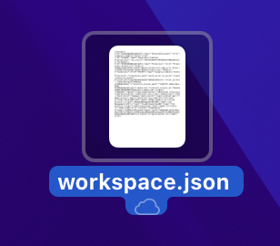

ファイルをディレクトリ **scripts**>**onboarding**>**config** にコピーします。

## 1.7.2.6 Adobe I/O ログイン

以前に使用したターミナルウィンドウに戻ります。 コマンド `aio login` を入力します。

ブラウザーにログインすると、これが表示されます。

## 1.7.2.7 のデプロイ準備が完了しました

次のプロンプトをコピーして、カーソルに貼り付けます。 次に、「**送信** ボタンをクリックします。

`Please deploy this code to Adobe I/O`

**実行** をクリックしてアクションを許可すると、カーソルからアクションの確認を何度も求められる場合があります。

デプロイメントは数分後に終了します。

次のプロンプトをコピーして、カーソルに貼り付けます。 次に、「**送信** ボタンをクリックします。

`run the onboarding to commerce`

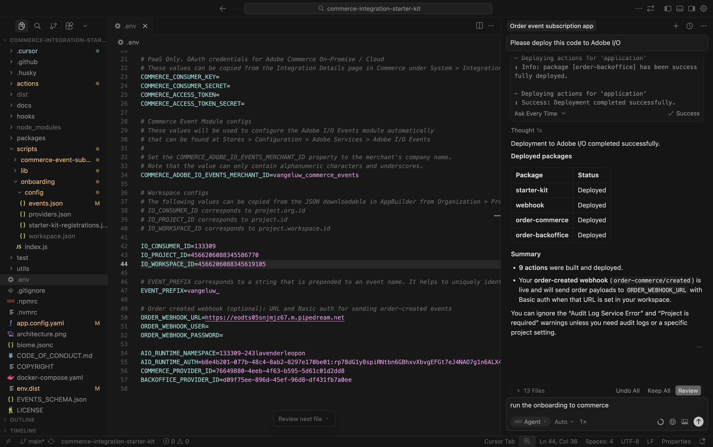

数分後、これが表示されます。

次のプロンプトをコピーして、カーソルに貼り付けます。 次に、「**送信** ボタンをクリックします。

`subscribe to commerce events`

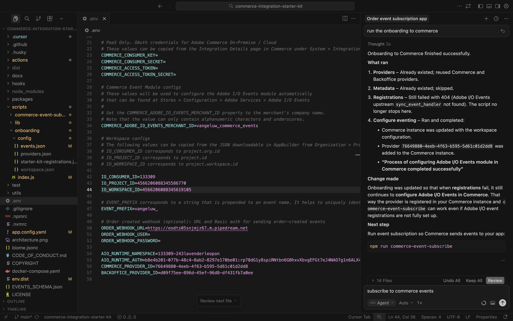

数分後、これが表示されます。

## 1.7.2.8 Adobe Commerce as a Cloud Serviceでの設定の検証

[https://experience.adobe.com](https://experience.adobe.com) に移動します。 **Commerce** をクリックします。

Adobe Commerce as a Cloud Service環境をクリックして開き、ログインします。

**システム** に移動し、**イベント購読** に移動します。

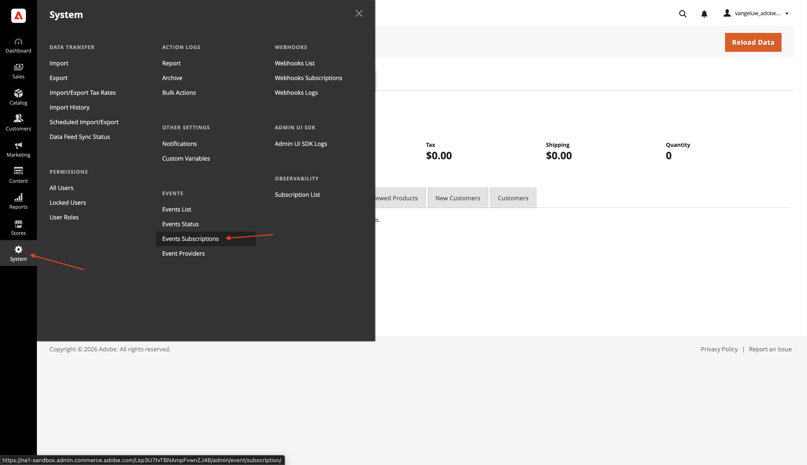

このイベント購読のリストが表示されます。

**ストア** に移動し、**設定** に移動します。

**「Adobe サービス」に移動し** 「**Adobe I/O Events**」を選択します。 フィールド **Adobe I/O Workspace Configuration** の値は 2 つのアスタリスクであり、フィールド **マーチャント ID** の値も `--aepUserLdap--_commerce_events` のようになります。

この設定を行ったら、設定をテストできます。

## 1.7.2.9 シナリオをテストする

Web サイトを開きます。

**ウォッチ** に移動し、任意の製品をクリックします。

製品を設定し、「**買い物かごに追加**」をクリックします。

**買い物かご** アイコンをクリックし、「**チェックアウト**」を選択します。

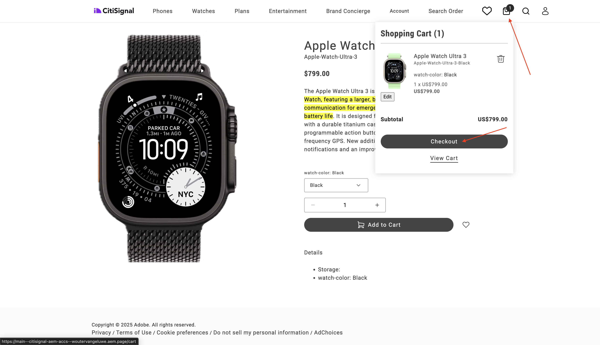

詳細を入力し、**注文** をクリックします。

その後、注文確認が表示されます。

Webhook アプリケーションに切り替えます。 確認されたばかりの注文の受信イベントが表示されます。

## 1.7.2.10 Adobe I/Oのデバッグ

Adobe I/O プロジェクトに戻ります。 **Workspaceの概要** に移動します。 これに似た情報が表示されます。 少し下にスクロールします。

クリックして **Commerce Order Sync** を開きます。

**トレースのデバッグ** に移動します。 最新の受信イベントとそのペイロードを確認できます。 これは、処理されたイベントと、それらのイベントが正常に処理されたかどうかを理解するのに役立ちます。

## 次の手順

[Adobe Commerce用のインテリジェント開発者ツール ](./aiassisteddev.md){target="_blank"} に戻る

[ すべてのモジュールに戻る ](./../../../overview.md){target="_blank"}
