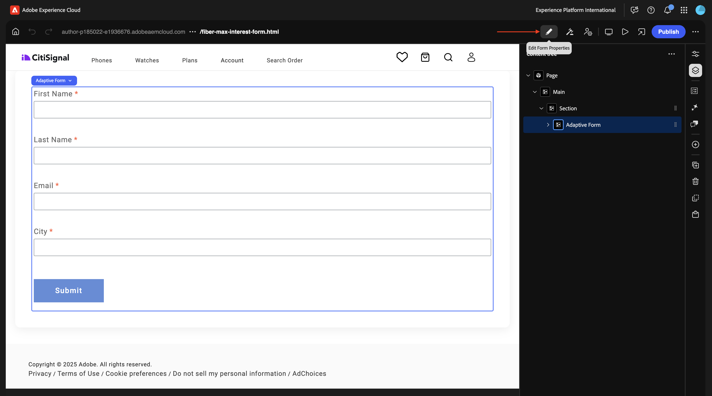

# 1.3.1 最初のフォームを作成する

>[!IMPORTANT]
>
>この演習を行うには、AEM Assets Dynamic Media が有効になっている、動作中のAEM Assets CS オーサー環境にアクセスできる必要があります。
>
>そのような環境がない場合は、[Adobe Experience Manager Cloud ServiceおよびEdge Delivery Services](./../../../modules/asset-mgmt/module2.1/aemcs.md){target="_blank"} に移動します。 指示に従うと、そのような環境にアクセスできます。

>[!IMPORTANT]
>
>以前にAEM CS プログラムをAEM Assets CS 環境で設定している場合は、AEM CS サンドボックスが休止状態になっている可能性があります。 このようなサンドボックスの休止解除には 10～15 分かかるので、後で待つ必要がないように、今すぐ休止解除プロセスを開始することをお勧めします。

## AEM FormsをEdge Delivery Servicesと共に使用するための 1.3.1.1 環境要件

最初のフォームを設定する前に、次の手順に従う前に満たす必要のある要件がいくつかあります。

### プログラム設定

Cloud Manager プログラムの **ソリューションとアドオン** で、**Forms** を有効にする必要があります。


### ブロック

Github リポジトリで、次のブロックを使用できる必要があります。

- **form**
- **embed-adaptive-form**


### スクリプト

Github リポジトリで、次のスクリプトを使用できる必要があります。

- **form-editor-support.css**
- **form-editor-support.js**


さらに、ユニバーサルエディターでフォームの編集を有効にするには、ファイル **editor-support.js** で、次の変更を行う必要があります。

- **function attachEventListners （main）** から **async function attachEventListners （main）** への関数宣言の変更
- 152 行目と 153 行目を追加します。

```
const module = await import('./form-editor-support.js');
module.attachEventListners(main);
```


また、ファイル **editor-support.js** で、90～92 行目を次のように変更します。

```
if (block.dataset.aueModel === 'form') {
        return true;
      } else if (newBlock) {
```


### paths.json

特に **paths.json** ファイルで、Github リポジトリ設定を確認してください。 ファイルには、次の行が必要です。

- マッピングの下：**&quot;/content/forms/af/:/forms/&quot;**
- 次を含む：**&quot;/content/forms/af/&quot;**

```json
{
  "mappings": [
    "/content/CitiSignal/:/",
    "/content/CitiSignal/configuration:/.helix/config.json",
    "/content/CitiSignal/headers:/.helix/headers.json",
    "/content/CitiSignal/metadata:/metadata.json",
    "/content/CitiSignal.resource/enrichment/enrichment.json:/enrichment/enrichment.json",
    "/content/forms/af/:/forms/"
  ],
  "includes": [
    "/content/CitiSignal/",
    "/content/forms/af/"
  ]
}
```


これらの要件を満たしたら、最初のフォームを作成できます。

## 1.3.1.2 フォームを作成

[https://my.cloudmanager.adobe.com](https://my.cloudmanager.adobe.com){target="_blank"} に移動します。 選択する組織は `--aepImsOrgName--` です。 環境を開きます。


**Forms** に移動します。


**Formsとドキュメント** に移動します。


**作成** をクリックして、「**アダプティブフォーム**」を選択します。


「**Edge Delivery Services**」を選択し、「**空白のページ**」を選択します。 「**作成**」をクリックします。


この画像が表示されます。 次のフィールドに入力します。

- **タイトル**: `Fiber Max Interest Form`
- **名前**: フィールド **タイトル** に基づいて自動的に入力される必要があります。
- **Github URL**:web サイトにリンクされている Github リポジトリーへのパスを指定します

「**作成**」をクリックします。


「**作成**」をクリックすると、**ユニバーサルエディター** が自動的に開き、次のようなメッセージが表示されます。 アイコンをクリックして **コンテンツツリー** を開きます。


**コンテンツツリー** で、オブジェクト **アダプティブフォーム** を選択します。


次に、「**+**」アイコンをクリックして新しい要素を追加し、「**テキスト入力**」を選択します。


**コンテンツツリー** で、「**テキスト入力**」フィールドを選択します。


**基本** ビューに移動します。 これが表示されます。

次のフィールドに入力します。

- **名前**: `first-name`
- **タイトル**: `First Name`

次に、**検証** に移動します。


これを必須フィールドにするには、スイッチを切り替えます。 次のフィールドに入力します。

- **エラーメッセージ**: `Enter your first name`
- **パターン**: `[A-Za-z][A-Za-z ]+`
- **パターンのエラーメッセージ**: `Letters only!`


**コンテンツツリー** で、「**アダプティブフォーム**」フィールドを選択します。 **+** アイコンをクリックし、「**テキスト入力**」を選択します。


**コンテンツツリー** で、新しく作成したフィールド **テキスト入力** を選択します。 **プロパティ** に移動します。


**基本** ビューに移動します。 これが表示されます。

次のフィールドに入力します。

- **名前**: `last-name`
- **タイトル**: `Last Name`

次に、**検証** に移動します。


これを必須フィールドにするには、スイッチを切り替えます。 次のフィールドに入力します。

- **エラーメッセージ**: `Enter your last name`
- **パターン**: `[A-Za-z][A-Za-z ]+`
- **パターンのエラーメッセージ**: `Letters only!`


**コンテンツツリー** で、「**アダプティブフォーム**」フィールドを選択します。 **+** アイコンをクリックし、「**テキスト入力**」を選択します。


**コンテンツツリー** で、新しく作成したフィールド **テキスト入力** を選択します。 **プロパティ** に移動します。


**基本** ビューに移動します。 これが表示されます。

次のフィールドに入力します。

- **名前**: `email`
- **タイトル**: `Email`

次に、**検証** に移動します。


これを必須フィールドにするには、スイッチを切り替えます。 次のフィールドに入力します。

- **エラーメッセージ**: `Enter your email address`
- **パターン**: `^[^@]+@[^@]+\.[^@]+$`
- **パターンのエラーメッセージ**: `Please verify your email address!`


**コンテンツツリー** で、「**アダプティブフォーム**」フィールドを選択します。 **+** アイコンをクリックし、「**テキスト入力**」を選択します。


**コンテンツツリー** で、新しく作成したフィールド **テキスト入力** を選択します。


**基本** ビューに移動します。 これが表示されます。

次のフィールドに入力します。

- **名前**: `city`
- **タイトル**: `city`

次に、**検証** に移動します。


これを必須フィールドにするには、スイッチを切り替えます。 次のフィールドに入力します。

- **エラーメッセージ**: `Enter your city`
- **パターン**: `[A-Za-z][A-Za-z ]+`
- **パターンのエラーメッセージ**: `Letters only!`


「**公開**」をクリックします。


もう一度 **公開** をクリックします。


クリックしてフォームを開きます。


その後、フォームに入力できますが、まだ送信できません。


フォームを公開すると、Edge Delivery Services ドメインでも次のように使用できるようになります。

`https://main--techinsidersXX-citisignal-aem-accs--woutervangeluwe.aem.page/forms/fiber-max-interest-form`


## 1.3.1.3 送信フォーム

フォームを送信するには、次の 2 つが必要です。

- **送信** ボタン
- **送信** アクション

また、この演習では、Google スプレッドシートを使用してこのフォームの送信を記録する必要があります。

### Google スプレッドシート

[https://drive.google.com](https://drive.google.com) に移動して、新しい空のスプレッドシートを作成します。


ファイルに `citisignal-fiber-max-interest` という名前を付けます。

1 行目のセル A-B-C-D に、次のフィールド名を入力します：

- 名
- 姓
- メール
- 都市

次に、「**共有**」をクリックします。


**エディター** レベルのアクセス権を持つ **0&rbrace;forms@adobe.com&rbrace; とファイルを共有します。**

次に、「**リンクをコピー**」をクリックします。

「**送信**」をクリックします。


次の手順では、コピーしたリンクを使用する必要があります。

### 送信ボタン

「**送信**」ボタンを設定するには、**コンテンツツリー** に移動し、「**アダプティブフォーム**」を選択し、「**+**」アイコンをクリックしてから、「**送信**」を選択します。


この画像が表示されます。


### 送信アクション

送信アクションは、ユニバーサルエディターの拡張機能の一部です。

>[!NOTE]
>
>**フォームプロパティを編集** アイコンが表示されない場合は、この拡張機能がまだ環境で有効になっていないことを意味します。 この拡張機能を有効にするには、[https://experience.adobe.com/#/aem/extension-manager](https://experience.adobe.com/#/aem/extension-manager) に移動して、「**フォームプロパティを編集** 拡張機能を有効にします。
>
>

**フォームプロパティを編集** アイコンをクリックします。



**スプレッドシートに送信** を選択します。 先ほど作成したGoogle シートの URL を貼り付けます。

「**保存して閉じる**」をクリックします。


>[!NOTE]
>
>「401 - Unauthorized」というエラーが表示される場合は、次の可能性があります。 お使いの環境では、Google シートとの連携が有効になっていないためです。 環境を有効にするには、Adobeの担当者にお問い合わせください。

「**公開**」をクリックします。


もう一度 **公開** をクリックします。


次に、サイトを更新し、フォームに入力して、「**送信**」をクリックします。


送信が成功します。


Googleのシートを見ると、そこに送信が成功したことが表示されます。


この演習は正常に完了しました。

## 次の手順

Edge Delivery Servicesで [Adobe Experience Manager Formsに戻る &#x200B;](./aemforms.md){target="_blank"}

[&#x200B; すべてのモジュールに戻る &#x200B;](./../../../overview.md){target="_blank"}
