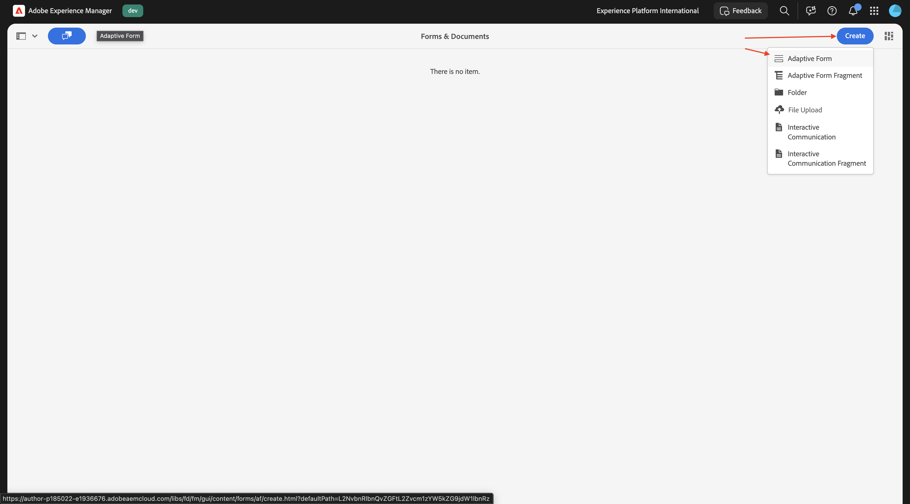
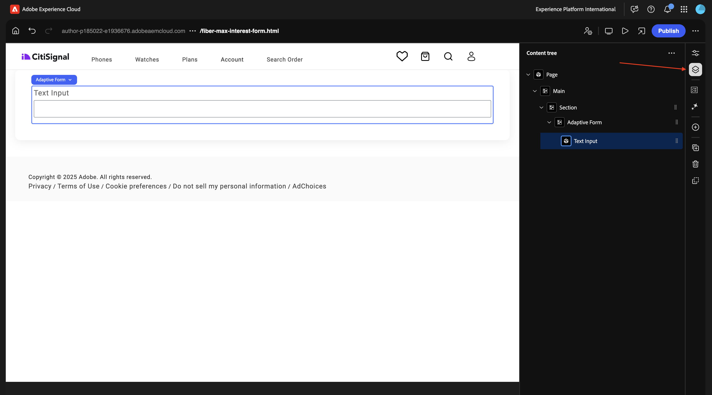

# 1.3.1 最初のフォームを作成する

>[!IMPORTANT]
>
>この演習を行うには、AEM Assets Dynamic Media が有効になっている、動作中のAEM Assets CS オーサー環境にアクセスできる必要があります。
>
>そのような環境がない場合は、[Adobe Experience Manager Cloud ServiceおよびEdge Delivery Services](./../../../modules/asset-mgmt/module2.1/aemcs.md){target="_blank"} に移動します。 指示に従うと、そのような環境にアクセスできます。

>[!IMPORTANT]
>
>以前にAEM CS プログラムをAEM Assets CS 環境で設定している場合は、AEM CS サンドボックスが休止状態になっている可能性があります。 このようなサンドボックスの休止解除には 10～15 分かかるので、後で待つ必要がないように、今すぐ休止解除プロセスを開始することをお勧めします。

## 1.3.1.1 -

[https://my.cloudmanager.adobe.com](https://my.cloudmanager.adobe.com){target="_blank"} に移動します。 選択する組織は `--aepImsOrgName--` です。 環境を開きます。

**Forms** に移動します。

**Formsとドキュメント** に移動します。

**作成** をクリックして、「**アダプティブフォーム**」を選択します。

「**Edge Delivery Services**」を選択し、「**空白のページ**」を選択します。 「**作成**」をクリックします。

この画像が表示されます。 次のフィールドに入力します。

- **タイトル**: `Fiber Max Interest Form`
- **名前**: フィールド **タイトル** に基づいて自動的に入力される必要があります。
- **Github URL**:web サイトにリンクされている Github リポジトリーへのパスを指定します

「**作成**」をクリックします。

「**作成**」をクリックすると、**ユニバーサルエディター** が自動的に開き、次のようなメッセージが表示されます。 アイコンをクリックして **コンテンツツリー** を開きます。

**コンテンツツリー** で、オブジェクト **アダプティブフォーム** を選択します。

次に、「**+**」アイコンをクリックして新しい要素を追加し、「**テキスト入力**」を選択します。

**コンテンツツリー** で、「**テキスト入力**」フィールドを選択します。

**基本** ビューに移動します。 これが表示されます。

次のフィールドに入力します。

- **名前**: `first-name`
- **タイトル**: `First Name`

次に、**検証** に移動します。

これを必須フィールドにするには、スイッチを切り替えます。 次のフィールドに入力します。

- **エラーメッセージ**: `Enter your first name`
- **パターン**: `[A-Za-z][A-Za-z ]+`
- **パターンのエラーメッセージ**: `Letters only!`

**コンテンツツリー** で、「**アダプティブフォーム**」フィールドを選択します。 **+** アイコンをクリックし、「**テキスト入力**」を選択します。

**コンテンツツリー** で、新しく作成したフィールド **テキスト入力** を選択します。 **プロパティ** に移動します。

**基本** ビューに移動します。 これが表示されます。

次のフィールドに入力します。

- **名前**: `last-name`
- **タイトル**: `Last Name`

次に、**検証** に移動します。

これを必須フィールドにするには、スイッチを切り替えます。 次のフィールドに入力します。

- **エラーメッセージ**: `Enter your last name`
- **パターン**: `[A-Za-z][A-Za-z ]+`
- **パターンのエラーメッセージ**: `Letters only!`

**コンテンツツリー** で、「**アダプティブフォーム**」フィールドを選択します。 **+** アイコンをクリックし、「**テキスト入力**」を選択します。

**コンテンツツリー** で、新しく作成したフィールド **テキスト入力** を選択します。 **プロパティ** に移動します。

**基本** ビューに移動します。 これが表示されます。

次のフィールドに入力します。

- **名前**: `email`
- **タイトル**: `Email`

次に、**検証** に移動します。

これを必須フィールドにするには、スイッチを切り替えます。 次のフィールドに入力します。

- **エラーメッセージ**: `Enter your email address`
- **パターン**: `^[^@]+@[^@]+\.[^@]+$`
- **パターンのエラーメッセージ**: `Please verify your email address!`

**コンテンツツリー** で、「**アダプティブフォーム**」フィールドを選択します。 **+** アイコンをクリックし、「**テキスト入力**」を選択します。

**コンテンツツリー** で、新しく作成したフィールド **テキスト入力** を選択します。

**基本** ビューに移動します。 これが表示されます。

次のフィールドに入力します。

- **名前**: `city`
- **タイトル**: `city`

次に、**検証** に移動します。

これを必須フィールドにするには、スイッチを切り替えます。 次のフィールドに入力します。

- **エラーメッセージ**: `Enter your city`
- **パターン**: `[A-Za-z][A-Za-z ]+`
- **パターンのエラーメッセージ**: `Letters only!`

「**公開**」をクリックします。

もう一度 **公開** をクリックします。

クリックしてフォームを開きます。

その後、フォームに入力できますが、まだ送信できません。

## 次の手順

次の手順：[-](./ex1.md){target="_blank"}

Edge Delivery Servicesで [Adobe Experience Manager Formsに戻る ](./aemforms.md){target="_blank"}

[ すべてのモジュールに戻る ](./../../../overview.md){target="_blank"}
