# 1.4.1 アセットと dynamic media テンプレートの作成

>[!IMPORTANT]
>
>この演習を行うには、AEM Assets Dynamic Media が有効になっている、動作中のAEM Assets CS オーサー環境にアクセスできる必要があります。
>
>そのような環境がない場合は、[Adobe Experience Manager Cloud ServiceおよびEdge Delivery Services](./../../../modules/asset-mgmt/module2.1/aemcs.md){target="_blank"} に移動します。 指示に従うと、そのような環境にアクセスできます。

>[!IMPORTANT]
>
>以前にAEM CS プログラムをAEM Assets CS 環境で設定している場合は、AEM CS サンドボックスが休止状態になっている可能性があります。 このようなサンドボックスの休止解除には 10～15 分かかるので、後で待つ必要がないように、今すぐ休止解除プロセスを開始することをお勧めします。

## Dynamic Media の会社 1.4.1.1 作成するには

[https://my.cloudmanager.adobe.com](https://my.cloudmanager.adobe.com){target="_blank"} に移動します。 選択する組織は `--aepImsOrgName--` です。

**Dynamic Media 会社** までスクロールします。 **+** アイコンをクリックして、Dynamic Media の新しい会社を作成します。

次の情報を入力します。

- **会社名**: `--aepUserLdap---CitiSignal`。
- **会社地域**：最も近い地域を選択します。
- **会社の管理者メール**：管理者メールを入力します。

「**作成**」をクリックします。

この画像が表示されます。

次のようなメールが届きます。このメールには、一時パスワードが記載されています。 パスワードを変更する場合や、メールを受信しなかった場合にパスワードを取得する場合は、**Adobe Dynamic Media Classic デスクトップアプリ** をインストールしてください。 インストール手順については、[https://experienceleague.adobe.com/en/docs/dynamic-media-classic/using/intro/dynamic-media-classic-desktop-app](https://experienceleague.adobe.com/en/docs/dynamic-media-classic/using/intro/dynamic-media-classic-desktop-app) を参照してください。

手順に従い、アプリケーションをシステムにインストールしたら、ここに戻ります。

**Adobe Dynamic Media Classic デスクトップアプリ** を開きます。 パスワードを知っている場合は、ここに入力し、手順に従って最初のログイン時に変更してください。

パスワードがわからない場合は、**パスワードを忘れた場合** リンクをクリックし、指示に従ってパスワードをリセットしてください。その後、ここに戻ってログインします。

ログインに成功すると、次のような画面が表示されます。

## AEM1.4.1.2Dynamic Media を設定するには

[https://my.cloudmanager.adobe.com](https://my.cloudmanager.adobe.com){target="_blank"} に移動します。 選択する組織は `--aepImsOrgName--` です。

クリックすると、Cloud Manager プログラムが開きます。このプログラムは `--aepUserLdap-- - CitiSignal AEM+ACCS` と呼ばれます。

環境をクリックします。

環境の URL をクリックします。

**ツール**/**クラウドサービス**/**Dynamic Media 設定** に移動します。

「**グローバル**」を選択し（「グローバル」チェックボックスをオフ）、「**作成**」をクリックします。

次の情報を入力します。

- **タイトル**:`--aepUserLdap-- - CitiSignal` というタイトルを使用します。
- **メール**：メールアドレスを入力します。
- **パスワード**:Dynamic Media アカウントのパスワードを入力します
- **地域**:Dynamic Media 会社を作成する際に選択した地域を選択します。この例では、「**ヨーロッパ** です。

**Dynamic Media に接続** をクリックします。

この画像が表示されます。 以下を設定します。

- **会社**: `--aepUserLdap-- - CitiSignal` を選択します。
- **Assetsを公開** を **即時** に設定します。
- 「すべてのコンテンツを同期 **するチェックボックスをオン** します。

「**保存**」をクリックします。

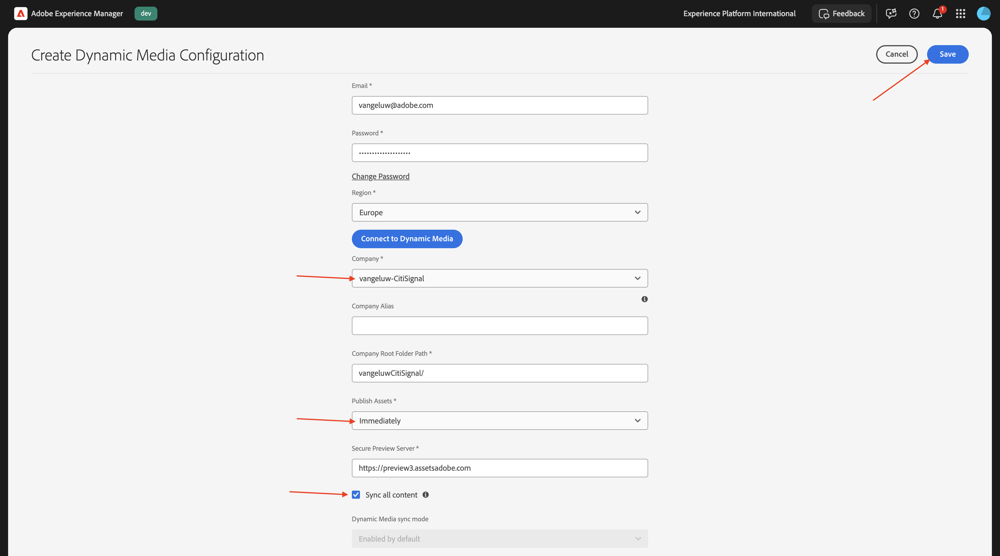

これで、Dynamic Media の設定が完了しました。 「**OK**」をクリックします。

## 1.4.1.3 アセットを書き出す

このファイル [citisignal-fiber-max-is-coming.psd](./assets/citisignal-fiber-max-is-coming.psd){target="_blank"} をダウンロードし、Adobe Photoshopで開きます。

この画像が表示されます。 CitiSignal は、ニューヨーク、パリ、ドバイの 3 都市で Fiber Max の展開を計画しています。

特定のレイヤーを表示または非表示にすることで、デザイナーが作成した画像を表示できます。

Photoshop PSD テンプレートから画像ファイルを書き出す手順は次のとおりです。 必要に応じて、完成した画像をこちら [citignal-dm-email-assets.zip](./assets/citisignal-dm-email-assets.zip){target="_blank"} からダウンロードして、デスクトップにファイルを解凍することもできます。

これはニューヨークの物だ。

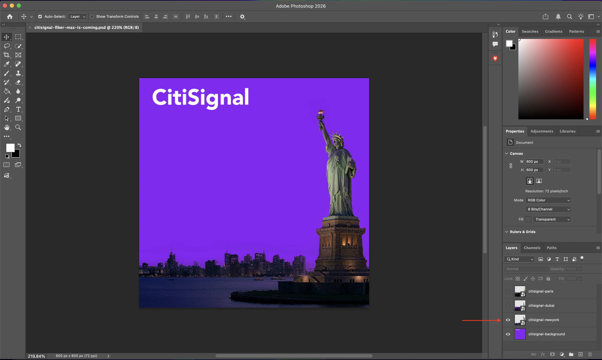

これはドバイのバージョンです。

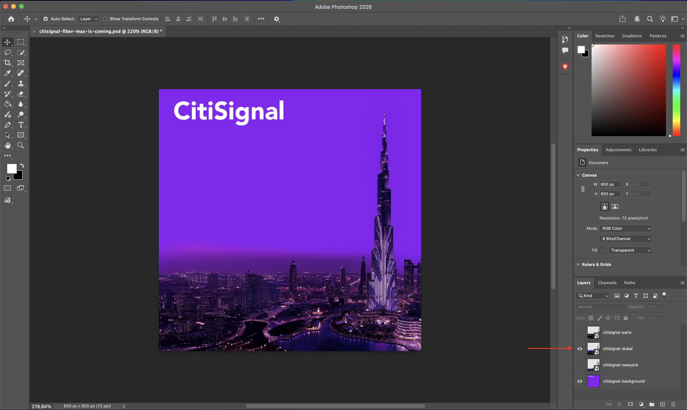

これはパリのバージョンです。

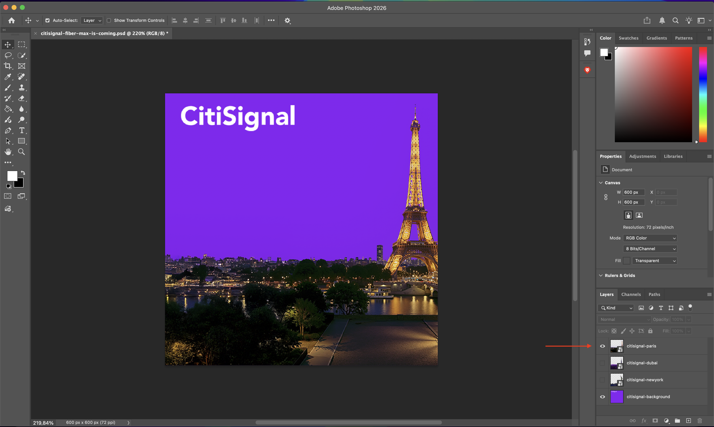

CitiSignal が Fiber Max をロールアウトする他の都市も多くなる可能性があるため、将来、このファイルに新しいレイヤーが作成される可能性があります。 今のところ、先に述べた 3 つの都市に焦点を当てています。

これらのバリエーションをAEM Assets Dynamic Media と組み合わせて使用するには、各都市のレイヤーを背景ファイルなしで個別に画像として書き出し、別の書き出しは、都市を含まない背景レイヤーに行う必要があります。

これで、1 つのレイヤーのみの表示/非表示が切り替わりました。 最初に表示するレイヤーは **Paris** レイヤーで、その他のレイヤーはすべて非表示にする必要があります。

そのレイヤーを書き出すには、**ファイル**/**書き出し**/**別名で書き出し** に移動します。

この画像が表示されます。 ファイルタイプ **PNG** を選択し、**透明度** が有効になっていることを確認して、「**書き出し**」をクリックします。

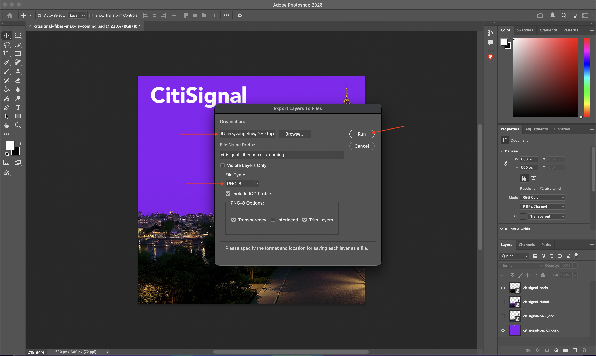

ファイル名を `citisignal-fiber-max-is-coming-paris.png` に変更し、**書き出し** をクリックします。

次に表示するレイヤーは **ドバイ** レイヤーで、他のすべてのレイヤーは非表示にする必要があります。

そのレイヤーを書き出すには、**ファイル**/**書き出し**/**別名で書き出し** に移動します。

この画像が表示されます。 ファイルタイプ **PNG** を選択し、**透明度** が有効になっていることを確認して、「**書き出し**」をクリックします。

ファイル名を `citisignal-fiber-max-is-coming-dubai.png` に変更し、**書き出し** をクリックします。

次に表示するレイヤーは **New York** レイヤーで、その他のレイヤーはすべて非表示にする必要があります。

そのレイヤーを書き出すには、**ファイル**/**書き出し**/**別名で書き出し** に移動します。

この画像が表示されます。 ファイルタイプ **PNG** を選択し、**透明度** が有効になっていることを確認して、「**書き出し**」をクリックします。

ファイル名を `citisignal-fiber-max-is-coming-newyork.png` に変更し、**書き出し** をクリックします。

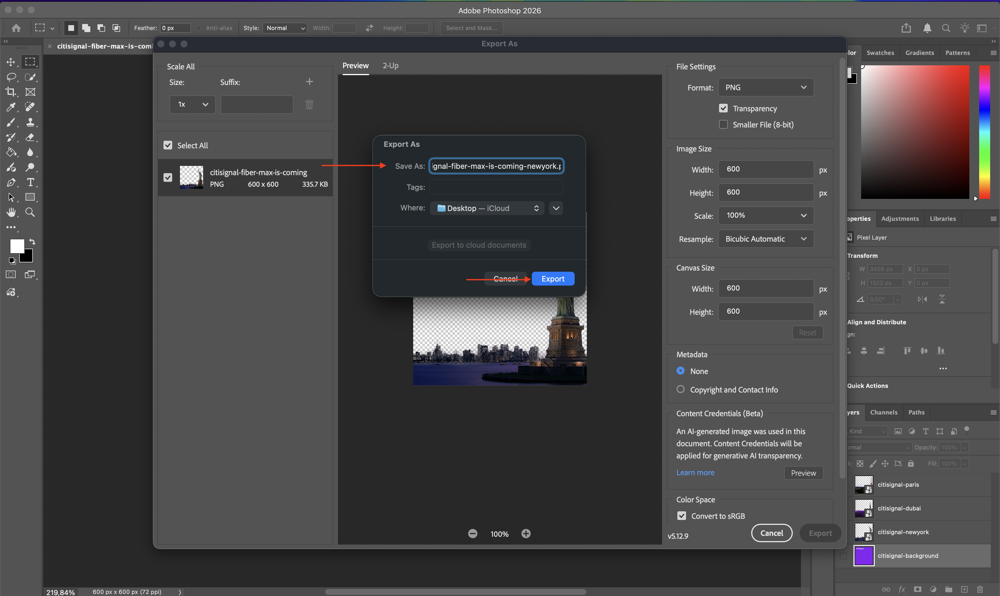

次に表示するレイヤーは **背景** レイヤーで、その他のレイヤーはすべて非表示にする必要があります。

そのレイヤーを書き出すには、**ファイル**/**書き出し**/**別名で書き出し** に移動します。

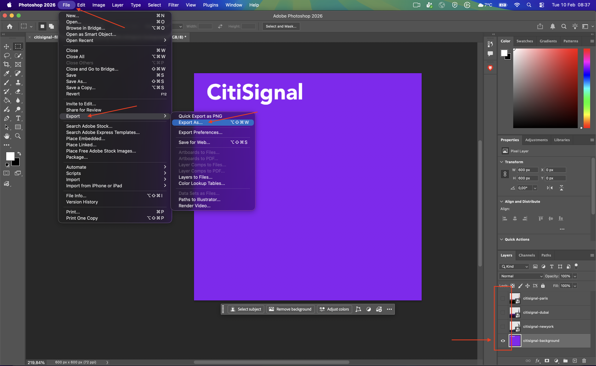

この画像が表示されます。 ファイルタイプ **PNG** を選択し、**透明度** が有効になっていることを確認して、「**書き出し**」をクリックします。

ファイル名を `citisignal-fiber-max-is-coming-background` に変更し、**書き出し** をクリックします。

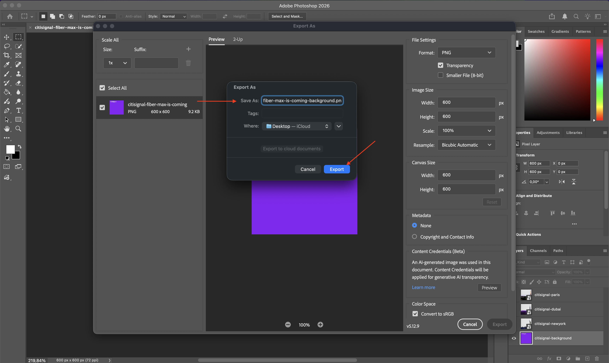

その後、選択した書き出し場所でこれらのファイルを使用できるようになります。

## 1.4.1.4 AEM Assets CS へのアセットのアップロード

[https://experience.adobe.com/](https://experience.adobe.com/){target="_blank"} に移動します。 **Experience Manager Assets** に移動します。

リポジトリを選択します。これは、`--aepUserLdap-- - CitiSignal AEM + ACCS` という名前にする必要があります。

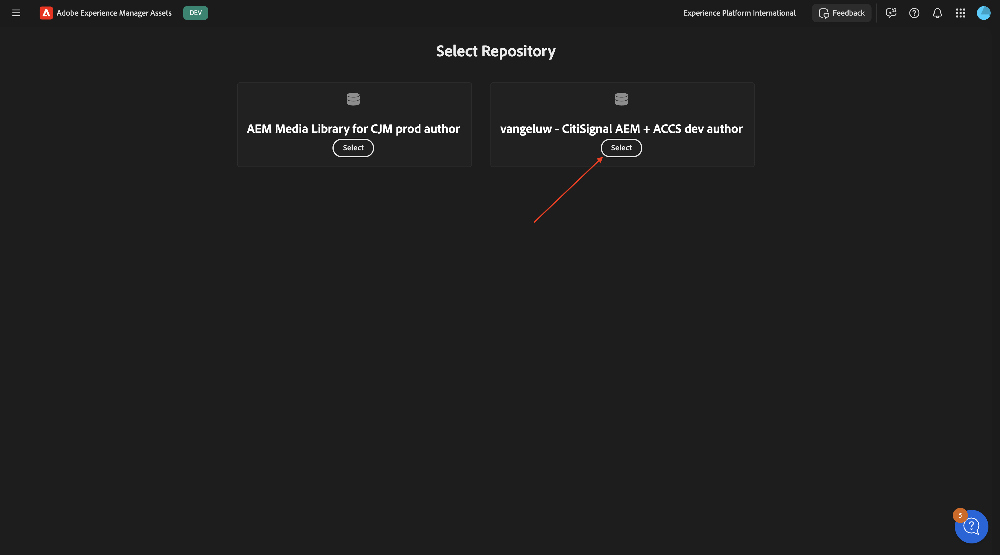

**Assets** に移動し、「**フォルダーを作成**」をクリックします。

フォルダーには、名前 `--aepUserLdap-- - CitiSignal Dynamic Media` を使用します。 「**作成**」をクリックします。

ダブルクリックして、作成したフォルダーを開きます。

**Assetsを追加** をクリックします。

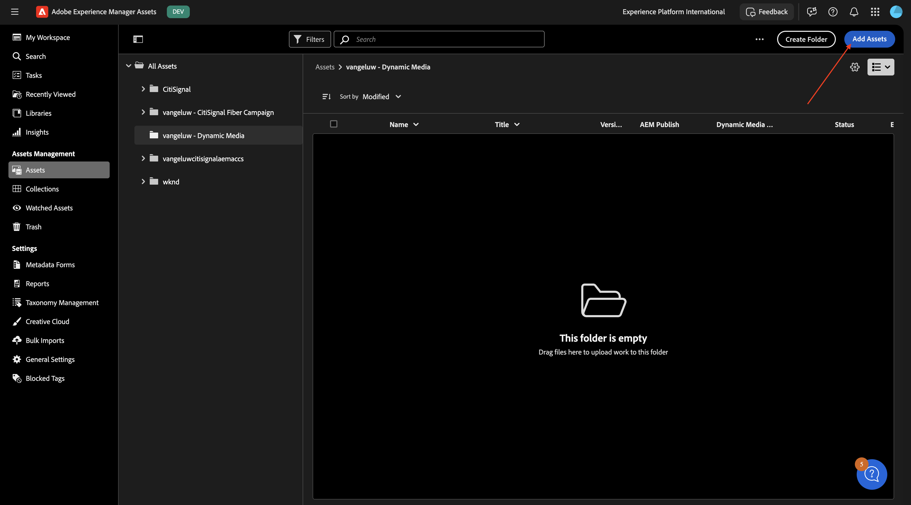

**参照** をクリックし、「**ファイルを参照** を選択します。

前の手順で書き出した 4 つの PNG ファイルを選択します。

**アップロード** をクリックします。

画像をAEM Assets CS で使用できるようになりました。

数分待ってから **Adobe Dynamic Media Classic デスクトップアプリ** を開くと、アップロードされた画像が Dynamic Media 内でも使用できるようになります。

## Dynamic Media テンプレートを設定 1.4.1.5 るには

左側のメニューで、**Dynamic Media Assets** に移動します。 クリックしてフォルダー `--aepUserLdap-- - CitiSignal Dynamic Media` を開きます。 次に、「**テンプレートを作成**」をクリックします。

次の情報を入力します。

- **テンプレート名**: `--aepUserLdap-- - CitiSignal Fiber Max Launch Email Assets`
- **キャンバスの幅**: `600px`
- **キャンバスの高さ**: `600px`

「**作成**」をクリックします。

この画像が表示されます。 **画像を追加** アイコンをクリックします。

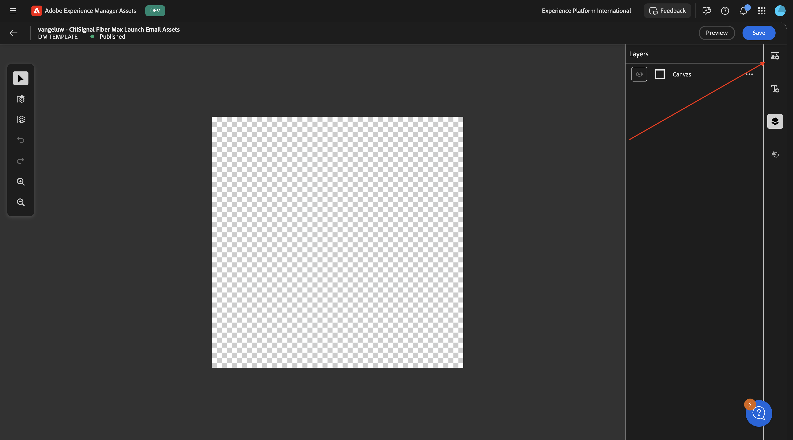

ファイル **citisignal-fiber-max-is-coming_citisignal-background.png** をキャンバスにドラッグして、キャンバスに収まるようにします。

次に、ファイル **citisignal-fiber-max-is-coming_citisignal-newyork.png** をキャンバスにドラッグして、キャンバスに収まるようにします。

次に、ファイル **citignal-fiber-max-is-coming_citignal-dubai.png** をキャンバスにドラッグして、キャンバスに収まるようにします。

次に、ファイル **citisignal-fiber-max-is-coming_citisignal-paris.png** をキャンバスにドラッグし、キャンバスに合わせます。

これで、テンプレートの 3 つのバリエーションすべてが同時に個別のレイヤーとして作成されます。 **レイヤー** アイコンをクリックすると、特定のレイヤーの表示/非表示を切り替えることができます。このアイコンは、現在、すべてのレイヤーが表示されていることを示します。

いくつかのレイヤーを非表示にすると、画像の外観を制御できます。 この例では、「パリ **のレイヤーと背景レイヤーのみ** 表示されています。

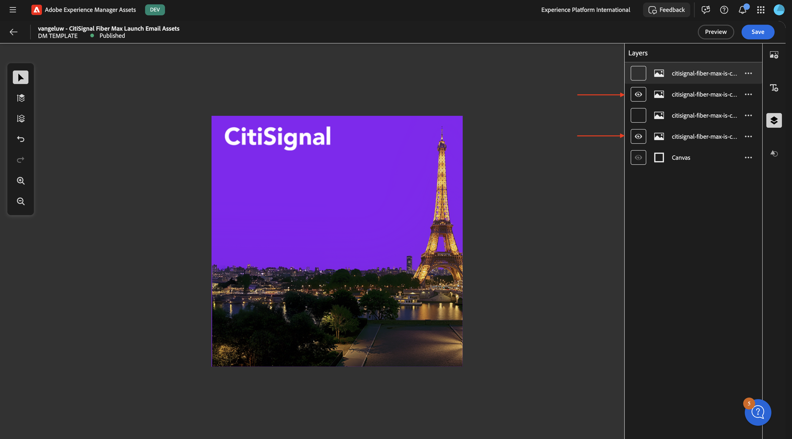

次に、テキストレイヤーを追加する必要があります。 **テキストレイヤー** アイコンをクリックします。

この画像が表示されます。

自由にテキストフィールドを適合させる方法を選択してください。次に例を示します。 後の段階で挿入した実際のテキストが正常に表示されるように、オプション **スマートテキストのサイズ変更** を必ず有効にしてください。

2 つ目のテキストレイヤーを追加して、次のように表示します。 後の段階で挿入した実際のテキストが正常に表示されるように、オプション **スマートテキストのサイズ変更** を必ず有効にしてください。

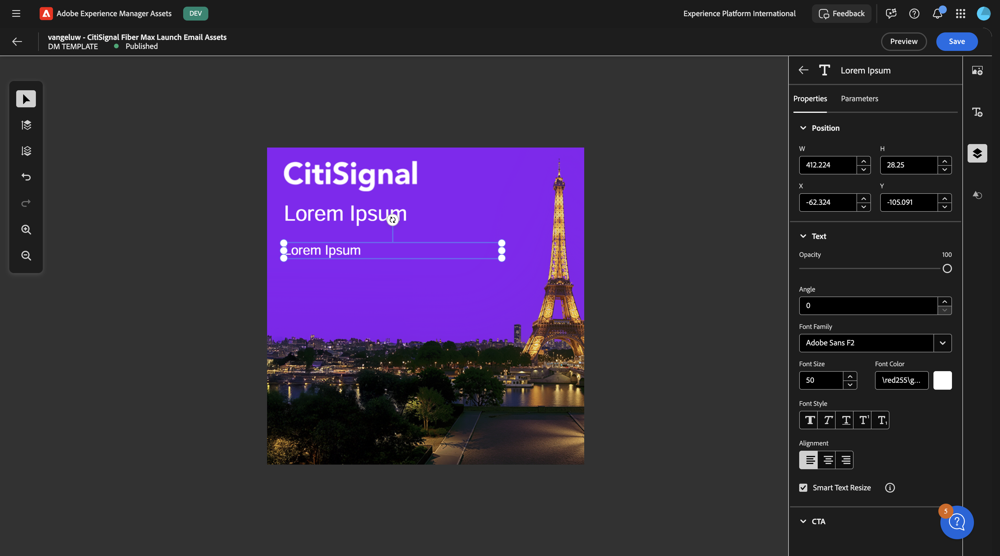

最初のテキストレイヤーを選択します。 3 つのドット **...** をクリックし、「**編集**」を選択します。

この画像が表示されます。 下にスクロールします。

**スイッチャー** アイコンをクリックして、フィールド **テキスト** を有効にします。 **パラメーター名** を `title` に変更します。

2 番目のテキストレイヤーを選択します。 3 つのドット **...** をクリックし、「**編集**」を選択します。

この画像が表示されます。 下にスクロールします。

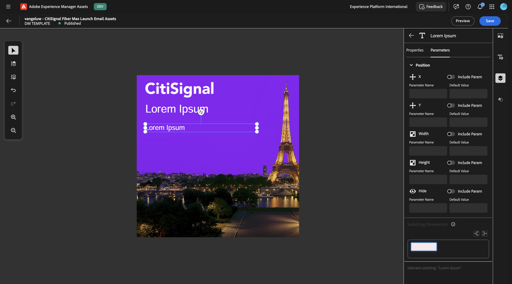

**スイッチャー** アイコンをクリックして、フィールド **テキスト** を有効にします。 **パラメーター名** を `body` に変更します。

**パリ** のレイヤーを選択します。 3 つのドット **...** をクリックし、「**編集**」をクリックします。

**Paramaters** に移動します。 「**非表示**」フィールドを有効にし、**パラメーター名** を `city_paris` と入力します。 「**保存**」をクリックします。

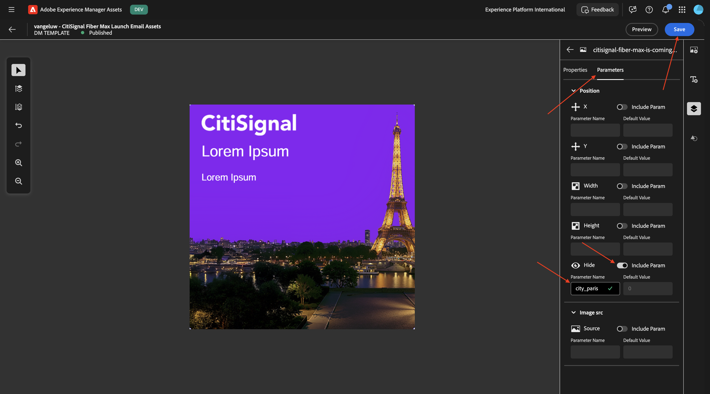

**ドバイ** のレイヤーを選択します。 3 つのドット **...** をクリックし、「**編集**」をクリックします。

**Paramaters** に移動します。 「**非表示**」フィールドを有効にし、**パラメーター名** を `city_dubai` と入力します。 「**保存**」をクリックします。

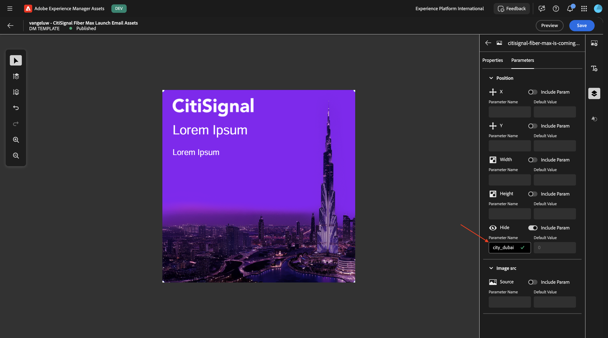

**ニューヨーク** の画層を選択します。 3 つのドット **...** をクリックし、「**編集**」をクリックします。

**Paramaters** に移動します。 「**非表示**」フィールドを有効にし、**パラメーター名** を `city_ny` と入力します。 「**保存**」をクリックします。

「**プレビュー**」をクリックします。

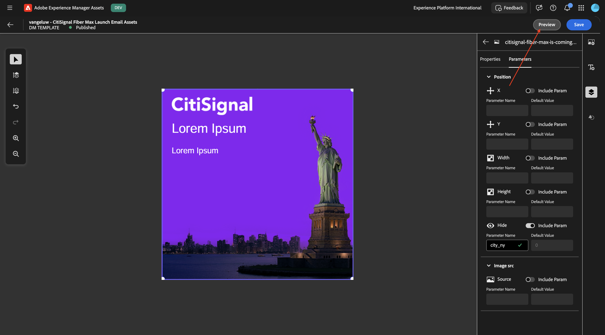

**すべてのパラメーターを含める** スイッチャーを有効にし、スクリーンショットに示されているように入力変数を変更します。 指定された入力に基づいて画像が動的に変更されているのが確認できます。 **city_paris**、**city_dubai** および **city_ny** フィールドの場合、値 0 はこの画像が非表示にされないことを意味し、値 1 はこの画像が非表示になることを意味します。

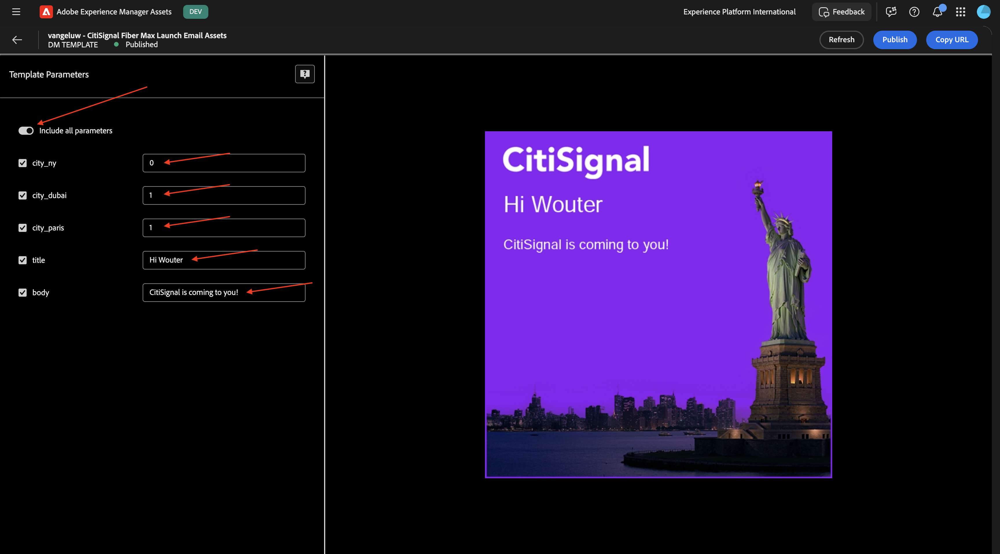

一部の変数を変更すると、別の画像が表示されるようになります。

変数を増やすと、別の画像が表示されるようになります。

このテンプレートをAdobe Journey Optimizerで使用し、このユースケースの要件を満たすには、Adobe Experience Platformのリアルタイム顧客プロファイルの一部であるフィールドに基づいて、表示する必要があるファイルのパスを動的に変更するために使用されるレイヤーをもう 1 つ追加する必要があります。

dataprep 中、顧客の **最も近いロールアウト都市** を保存するためのフィールドをAdobe Experience Platform スキーマ内に作成しました。 フィールドのパスは `--aepTenantId--.individualCharacteristics.fiber_rollout.closest_rollout_city` です。

>[!NOTE]
>
>Adobe Experience Platform スキーマの以下のスクリーンショットは情報提供のみを目的としています。 これを自分で視覚化するためにAEPに移動する必要はありません。

次の演習では、そのフィールドを使用して、どの顧客に表示する画像を動的に選択します。

それには、新しい画像レイヤーを追加する必要があります。

まず、ロールアウト都市用の画像を含む他のレイヤーを非表示にします。

次に、**画像** に移動し、都市のランダム画像を選択してキャンバスに追加し、キャンバス全体に合っていることを確認します。 次の演習では、パスがAJOによって動的に変更されるので、選択する市区町村の画像は関係ありません。

**パラメーター** に移動します。

**スイッチャー** アイコンをクリックして、「非表示 **フィールドを有効に** ます。 **パラメーター名** を `dynamic_city_hide` に変更します。

**スイッチャー** アイコンをクリックして、「非表示 **フィールドを有効に** ます。 **パラメーター名** を `dynamic_city_image` に変更します。

「**保存**」をクリックします。

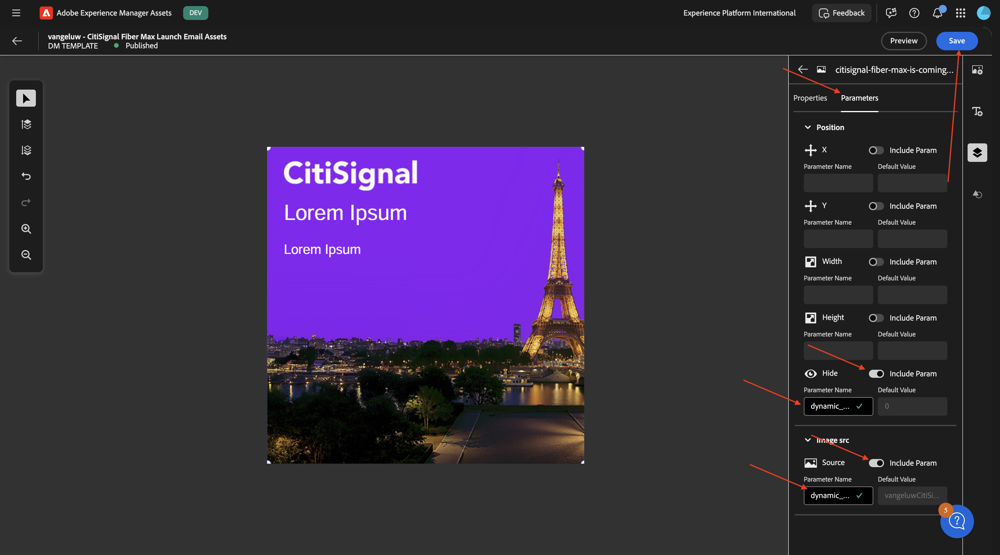

「**プレビュー**」をクリックします。

この画像が表示されます。 スイッチャーアイコンを有効にして **すべてのパラメーターを含める** します。 スクリーンショットに示されているように、いくつかの入力変数を変更します。 指定された入力に基づいて画像が動的に変更されているのが確認できます。 静的フィールド **city_paris**、**city_dubai** および **city_ny** は 1 に設定する必要があります。つまり、これらの画像は非表示になります。

フィールド **dynamic_city_hide** は、表示されることを意味する 0 に設定する必要があります。

フィールド **dynamic_city_image** に、パリの画像への URL が設定されました。これは次のようになります。`vangeluwCitiSignalDM/citisignal-fiber-max-is-coming_citisignal-paris-1`

URL で **paris** という単語を選択します。

**paris** を `newyork` に変更し、UI の別の場所をクリックして、画像がニューヨーク市の画像に変更されることを確認します。

「**newyork**」という単語を選択して「`dubai`」に変更し、UI の別の場所をクリックして、ドバイの街の画像に対する変更を確認します。

最後に、「**公開**」をクリックします。

この画像が表示されます。 **はい** をクリックします。

これで、Dynamic Media テンプレートが正常に設定され、公開されました。 次の演習では、このテンプレートをAdobe Journey Optimizerのメールキャンペーンと組み合わせて使用します。

## 次の手順

次の手順：[Adobe Journey Optimizerで dynamic media テンプレートを使用する ](./ex2.md){target="_blank"}

[Adobe Experience Manager Assetsと Dynamic Media](./aemassetsdm.md){target="_blank"} に戻る

[ すべてのモジュールに戻る ](./../../../overview.md){target="_blank"}
