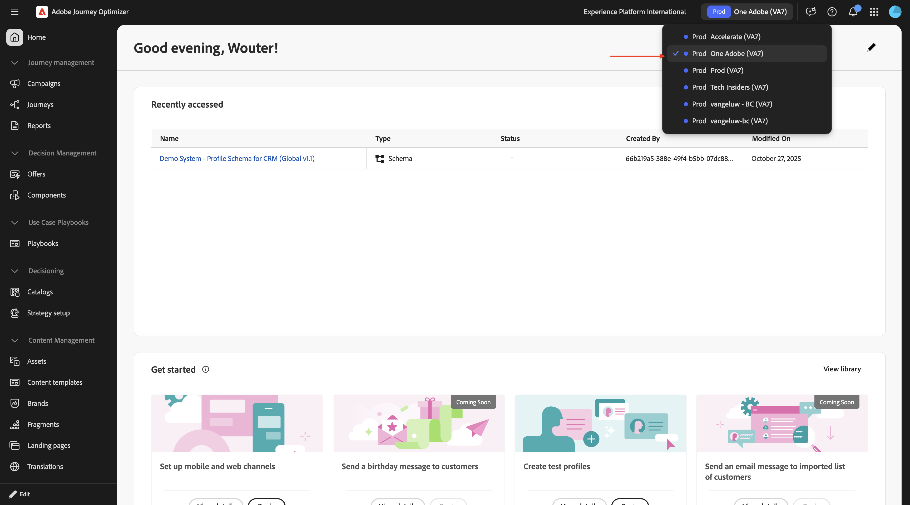
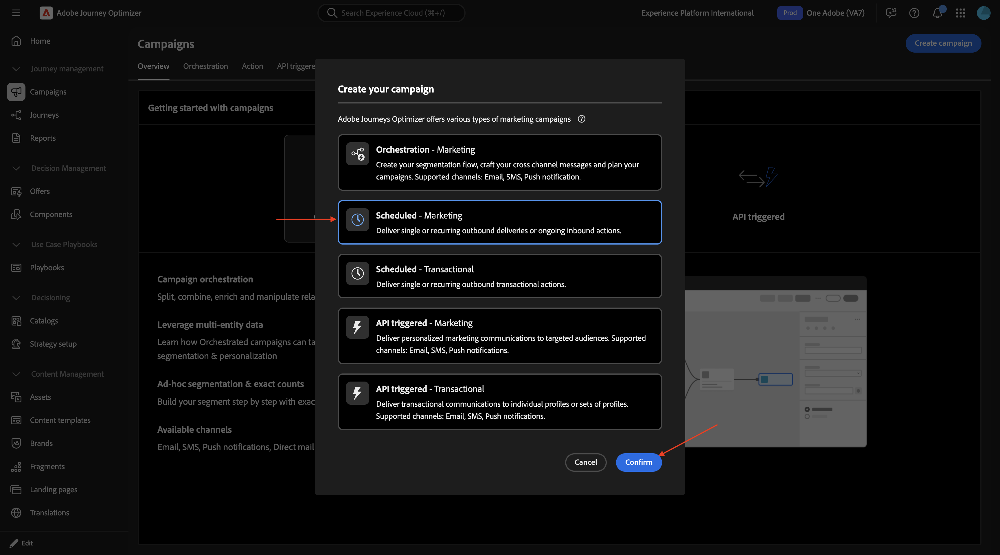
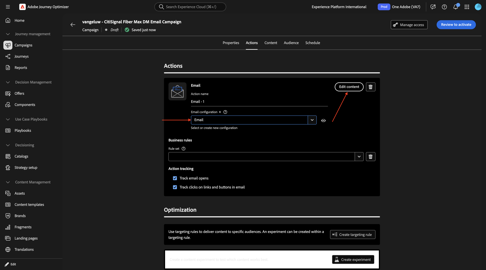

# 1.4.2 Adobe Journey Optimizerで dynamic media テンプレートを使用する

## Adobe Journey Optimizer1.4.2.1 キャンペーンを作成するには

[Adobe Experience Cloud](https://experience.adobe.com) に移動して、Adobe Journey Optimizerにログインします。 **Journey Optimizer** をクリックします。


Journey Optimizerの **ホーム** ビューにリダイレクトされます。 最初に、正しいサンドボックスを使用していることを確認します。 使用するサンドボックスは `--aepSandboxName--` です。 その後、サンドボックス **ージの** ホーム `--aepSandboxName--` ビューに移動します。



次に、キャンペーンを作成します。 前の演習のイベントベースのジャーニーは、受信エクスペリエンスイベントやオーディエンスの入口または出口に依存して 1 人の特定顧客のジャーニーをトリガーにするのとは異なり、キャンペーンは、ニュースレター、1 回限りのプロモーション、一般的な情報などの一意のコンテンツで 1 回、またはインスタンスの誕生日キャンペーンやリマインダーなどの定期的に送信される同様のコンテンツで、オーディエンス全体をターゲットにします。

メニューで、「**キャンペーン**」に移動し、「**キャンペーンを作成**」をクリックします。


**スケジュール型 – マーケティング** を選択し、「**作成**」をクリックします。



キャンペーンの作成画面で、以下を設定します。

- **名前**:`--aepUserLdap-- - CitiSignal Fiber Max DM Email Campaign`。

**アクション** をクリックします。


「**+アクションを追加**」をクリックし、「**メール**」を選択します。


次に、既存の **メール設定** を選択し、「**コンテンツを編集**」をクリックします。



その後、これが表示されます。 **件名** には、次を使用します。

```
{{profile.person.name.firstName}}, say hello to CitiSignal Fiber Max!
```

次に、「**コンテンツを編集**」をクリックします。


「**ゼロからデザイン**」を選択します。


この画像が表示されます。


キャンバスに 2x **1:1 列** を追加します。


**フラグメント** に移動し、**ヘッダー** フラグメントを最初の 1:1 列にドラッグしてから、**フッター** フラグメントを 2 番目の 1:1 列にドラッグします。


2 つのフラグメントの間に新しい 1:1 列を追加し、その 1 **列に** 画像 :1 を追加します。 次に、「参照 **をクリック** ます。


Dynamic Media テンプレートを保存したフォルダーに移動します。 Dynamic Media テンプレートを選択し、「**選択** をクリックします。


この画像が表示されます。 あなたも。 dynamic media テンプレートのパラメーターを変更できる **パラメーター** に注意してください。


## 1.4.2.2 Dynamic Media テンプレートのパーソナライズ

前の演習で説明したように、AJOでは、Dynamic Media テンプレートの一部になる値を動的に決定する必要があります。

前の演習の **プレビュー** 手順と同様に、フィールド **city_paris**、**city_dubai** および **city_ny** は 1 に設定する必要があります。つまり、これらの画像は非表示になります。

フィールド **タイトル** で、パーソナライゼーションアイコンをクリックします。


既定のテキストを `Hi {{profile.person.name.firstName}}` に置き換えます。 「**保存**」をクリックします。


フィールド **本文** で、パーソナライゼーションアイコンをクリックします。


既定のテキストを `CitiSignal is coming to {{profile.homeAddress.city}}!` に置き換えます。 「**保存**」をクリックします。


フィールド **`dynamic_city_hide`** が 0 に設定されていることを確認します。 フィールド **`dynamic_city_image`** のパーソナライゼーションアイコンをクリックします。


既定のテキストを `--aepUserLdap--CitiSignalDM/citisignal-fiber-max-is-coming_citisignal-{{profile._experienceplatform.individualCharacteristics.fiber_rollout.closest_rollout_city}}-1` に置き換えます。 「**保存**」をクリックします。


この画像が表示されます。 画像は、メールエディターのコンテキストで動的変数が使用できないので、ここではレンダリングされません。

「**保存**」をクリックします。


上部テスト設定、「**コンテンツをシミュレート**」の順にクリックし、「**コンテンツをシミュレート**」を選択します。


次のようなメッセージが表示されます。 使用可能なテストプロファイルがない場合は、「**テストプロファイルの管理**」に移動して追加できます。

このユースケースのテストに必要なデータを含んだテストプロファイルを使用可能にしたら、プロファイルを切り替えて、変更が動的に行われることを確認できます。

ロールアウト都市ニューヨークにリンクされているプロファイルを以下に示します。


ロールアウト都市パリにリンクされているプロファイルを次に示します。


ロールアウト都市ドバイにリンクされているプロファイルを以下に示します。

「**閉じる**」をクリックします。


これで、この演習が完了しました。 メールキャンペーンを公開する必要はありません。

## 次の手順

[Adobe Experience Manager Assetsと Dynamic Media](./aemassetsdm.md){target="_blank"} に戻る

[ すべてのモジュールに戻る ](./../../../overview.md){target="_blank"}