# 1.5.1 Adobe Commerce as a Cloud Serviceの概要

[https://experience.adobe.com/](https://experience.adobe.com/){target="_blank"}に移動します。 正しい環境であることを確認してください。名前は`--aepImsOrgName--`にする必要があります。 **Commerce**&#x200B;をクリックします。


## 1.5.1.1 ACCS インスタンスを作成します

そうすると、これが表示されます。 「**+ インスタンスを追加**」をクリックします。


次のようにフィールドに入力します。

- **インスタンス名**:

```
--aepUserLdap-- - ACCS
```

- **環境**: `Sandbox`
- **地域**: `North America`

「**インスタンスを追加**」をクリックします。


インスタンスが作成中です。 これには5～10分かかる場合があります。


インスタンスの準備ができたら、インスタンスをクリックして開きます。


## 1.5.1.2 CitiSignal ストアを設定

そうすると、これが表示されます。 「**Adobe IDでログイン**」をクリックし、ログインします。


ログインすると、このホームページが表示されます。 まず、CommerceでCitiSignal ストアを設定します。 「**店舗**」をクリックします。

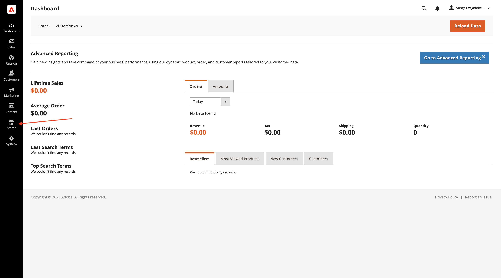

**すべてのストア**&#x200B;をクリックします。


「**Web サイトを作成**」をクリックします。


次のようにフィールドに入力します。

- **名前**:

```
CitiSignal
```

- **コード**:

```
citisignal
```

「**Web サイトを保存**」をクリックします。

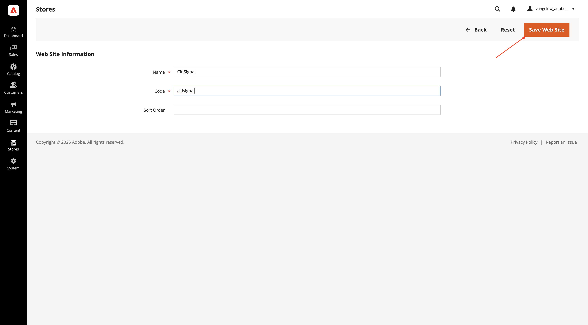

あなたはここに戻るべきだ。 「**ストアを作成**」をクリックします。


次のようにフィールドに入力します。

- **Web サイト**:

```
CitiSignal
```

- **名前**:

```
CitiSignal
```

- **コード**:

```
citisignal
```

- **ルートカテゴリ**: `Default Category`

「**ストアを保存**」をクリックします。


あなたはここに戻るべきだ。 「**ストアビューを作成**」をクリックします。

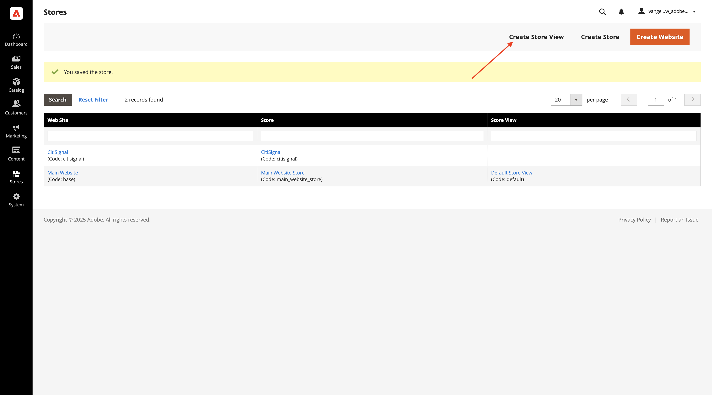

次のようにフィールドに入力します。

- **店舗**:

```
CitiSignal
```

- **名前**:

```
CitiSignal
```

- **コード**:

```
citisignal
```

- **ステータス**: `Enabled`

「**ストアビューを保存**」をクリックします。

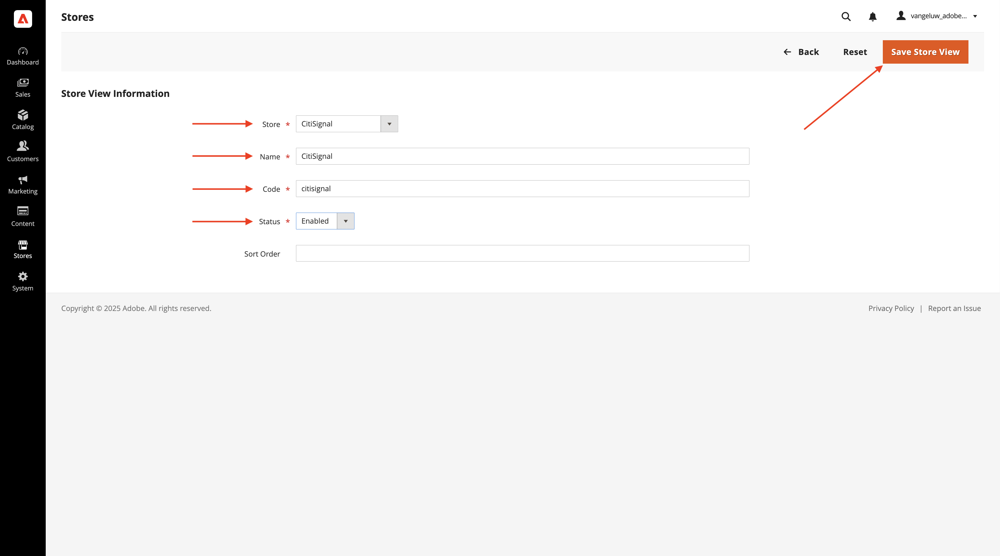

その後、このメッセージが表示されます。 「**OK**」をクリックします。

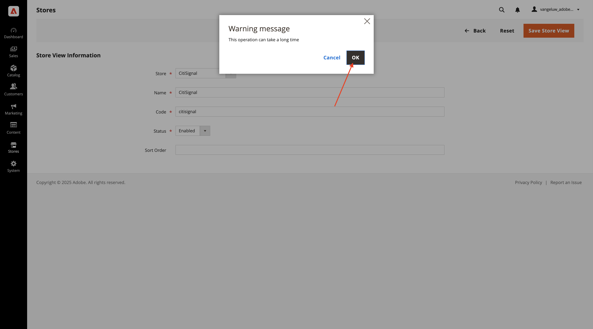

あなたはここに戻るべきだ。 **CitiSignal** web サイトをクリックして開きます。

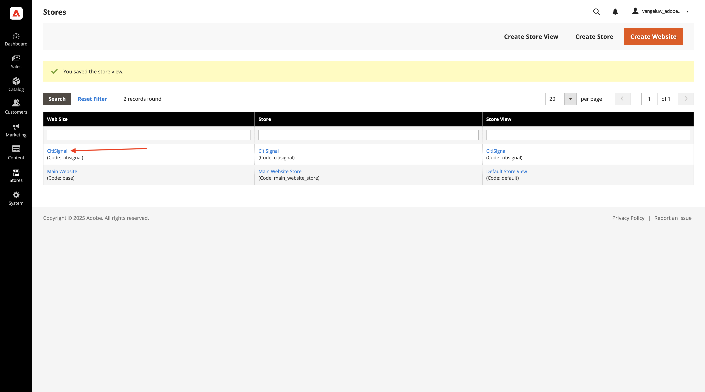

チェックボックスをオンにして、このWeb サイトを既定のWeb サイトとして設定します。

「**Web サイトを保存**」をクリックします。

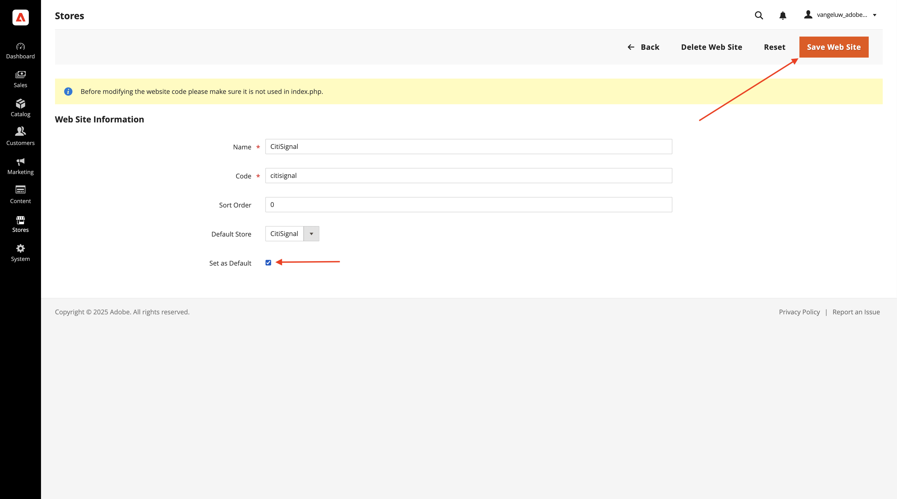

あなたはここに戻るべきだ。


## 1.5.1.3 カテゴリと製品の設定

**カタログ**&#x200B;に移動し、**カテゴリー**&#x200B;を選択します。


**既定のカテゴリ**&#x200B;を選択し、**サブカテゴリを追加**&#x200B;をクリックします。

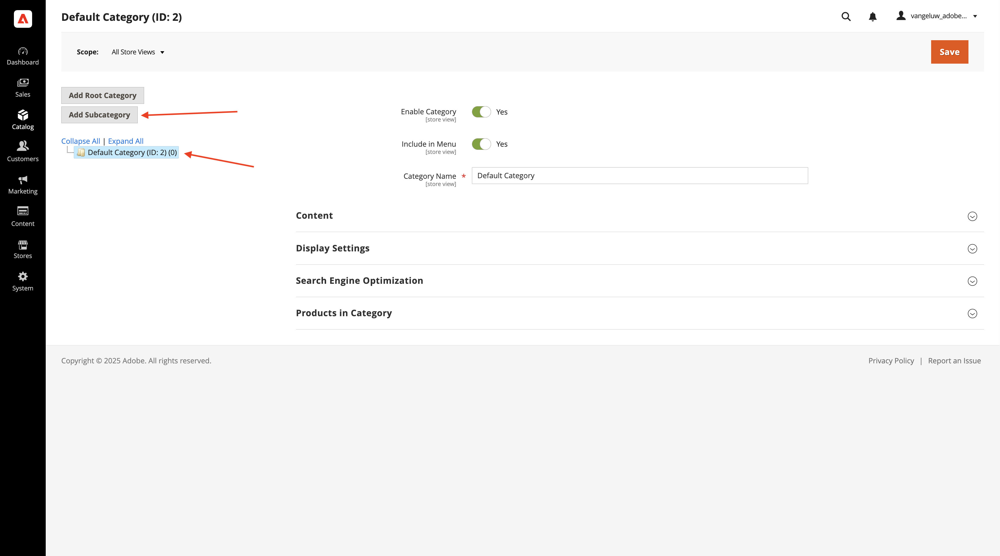

次の名前を入力し、**保存**&#x200B;をクリックします。

```
Phones
```


**既定のカテゴリ**&#x200B;を選択し、**サブカテゴリを追加**&#x200B;をもう一度クリックします。

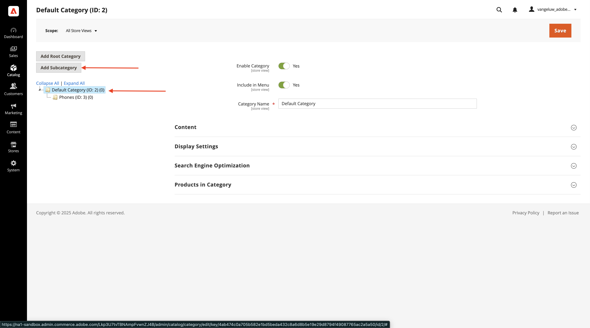

次の名前を入力し、**保存**&#x200B;をクリックします。

```
Watches
```


**既定のカテゴリ**&#x200B;を選択し、**サブカテゴリを追加**&#x200B;をもう一度クリックします。


次の名前を入力し、**保存**&#x200B;をクリックします。

```
Plans
```

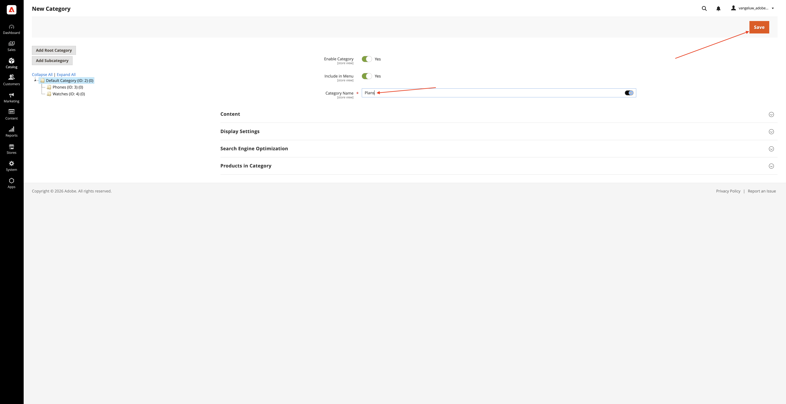

**既定のカテゴリ**&#x200B;を選択し、**サブカテゴリを追加**&#x200B;をもう一度クリックします。

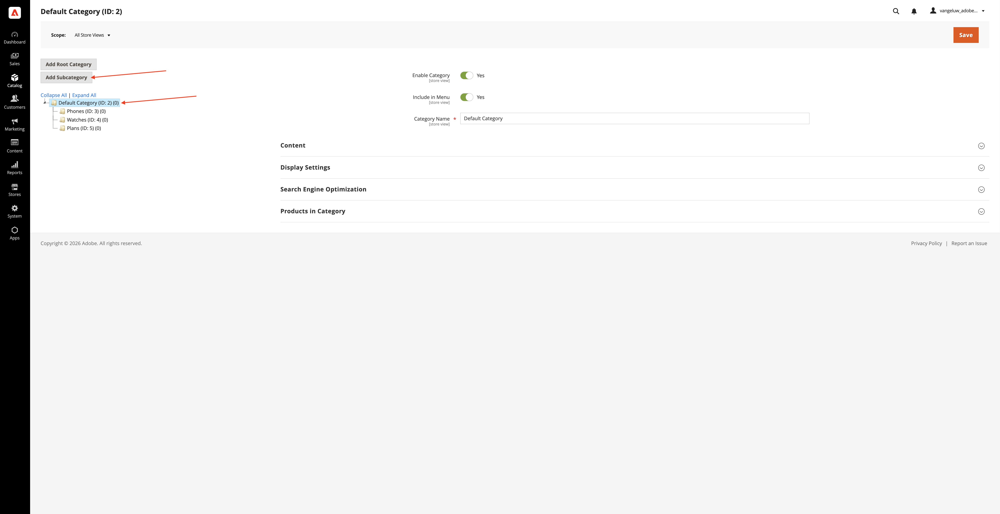

次の名前を入力し、**保存**&#x200B;をクリックします。

```
Entertainment
```

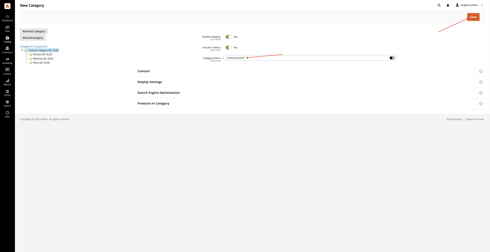

4つのカテゴリが作成されます。


次に、**カタログ**&#x200B;に移動し、**製品**&#x200B;を選択します。

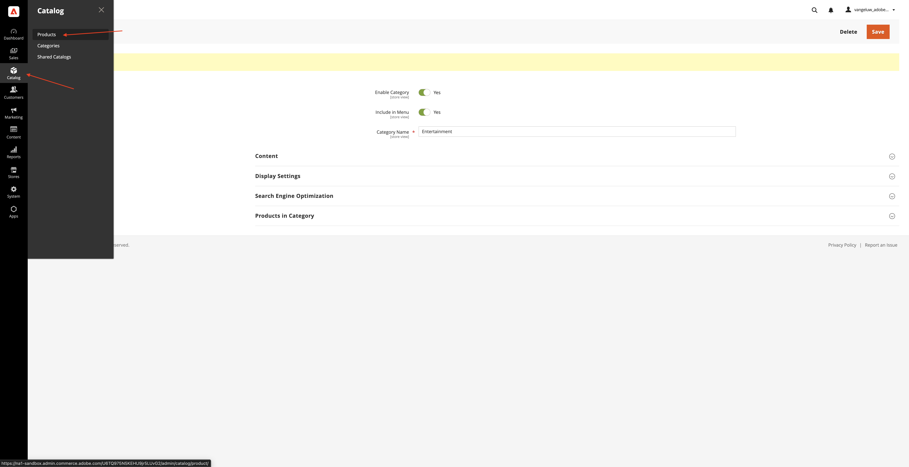

そうすると、これが表示されます。 「**製品を追加**」をクリックします。


次のように製品を設定します。

- **製品名**:

```
iPhone Air
```

- **SKU**:

>[!NOTE]
>
>SKU フィールドが以下の値と同じであることを確認し、このフィールドにスペースがないことを確認してください。

```
iPhone-Air
```

- **価格**:

```
999
```

- **数量**:

```
10000
```

- **カテゴリ**: `Phones`を選択

「**保存**」をクリックします。


**設定**&#x200B;までスクロールし、**設定の作成**&#x200B;をクリックします。

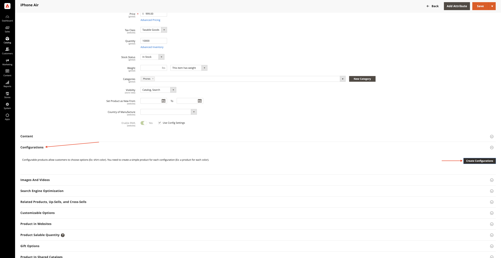

そうすると、これが表示されます。 **新規属性の作成**&#x200B;をクリックします。

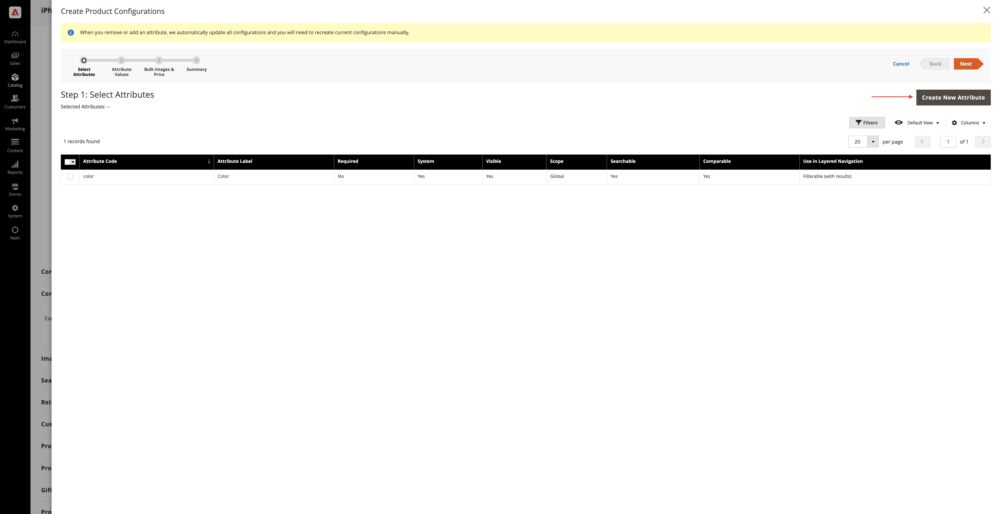

**デフォルトラベル**&#x200B;を以下の値に設定し、**オプションの管理**&#x200B;で「**オプションを追加**」をクリックします。

```
Storage
```


3列すべてで以下の値を使用して最初のオプションを設定し、**オプションを追加**&#x200B;をもう一度クリックします。

```
256GB
```


3列すべてで次の値を使用して2番目のオプションを設定し、**オプションを追加**&#x200B;をもう一度クリックします。

```
512GB
```


3つ目のオプションは、3つの列すべてで以下の値を使用して設定します。

```
1TB
```


**ストアフロントのプロパティ**&#x200B;までスクロールします。 次のオプションを&#x200B;**Yes**&#x200B;に設定します。

- **検索で使用**
- **ストアフロントでHTML タグを許可**
- **ストアフロントのカタログページに表示**
- **製品リストでの使用**


上にスクロールして、**属性を保存**&#x200B;をクリックします。

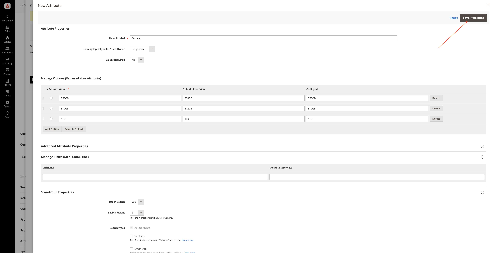

そうすると、これが表示されます。 **color**&#x200B;と&#x200B;**storage**&#x200B;の両方の属性を選択し、**Next**&#x200B;をクリックします。


そうすると、これが表示されます。 次に、使用可能なカラーオプションを追加する必要があります。 これを行うには、**新しい値を作成**&#x200B;をクリックします。


値`Sky-Blue`を入力し、**新しい値を作成**&#x200B;をクリックします。


値`Light-Gold`を入力し、**新しい値を作成**&#x200B;をクリックします。


値`Cloud-White`を入力し、**新しい値を作成**&#x200B;をクリックします。


値`Space-Black`を入力します。 **すべてを選択**&#x200B;をクリック

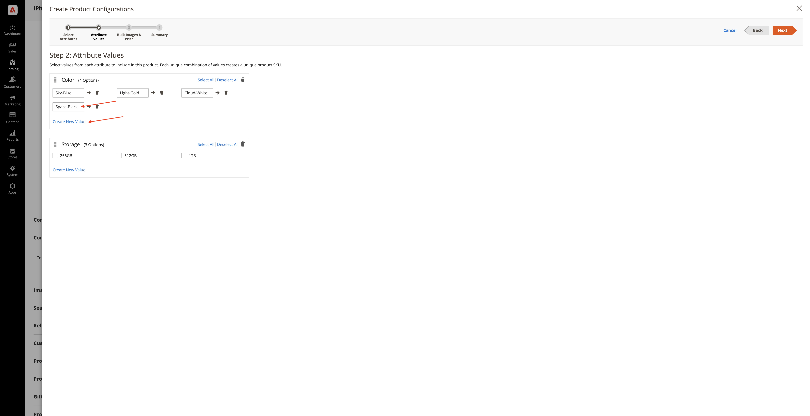

**ストレージ**&#x200B;の下にある3つのオプションをすべて選択し、**次へ**&#x200B;をクリックします。

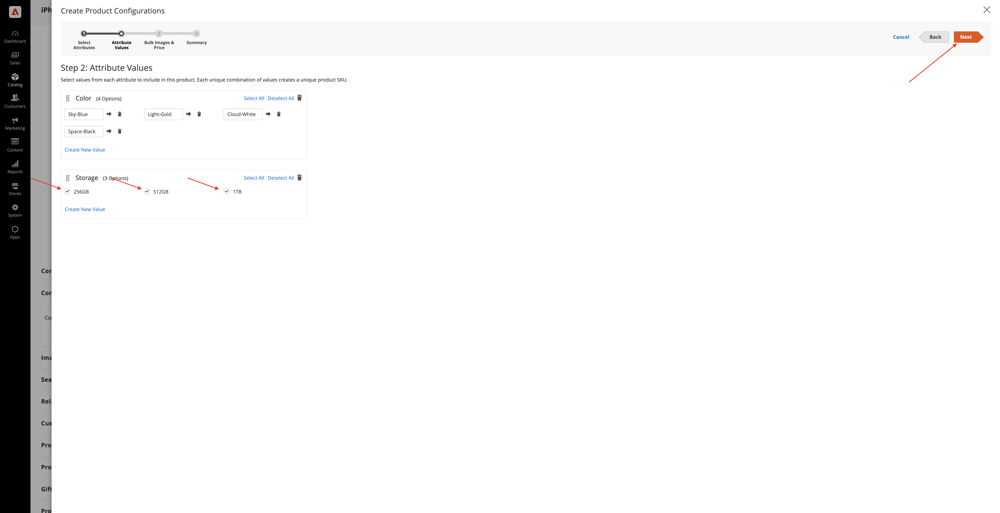

既定の設定を残し、**次へ**&#x200B;をクリックします。

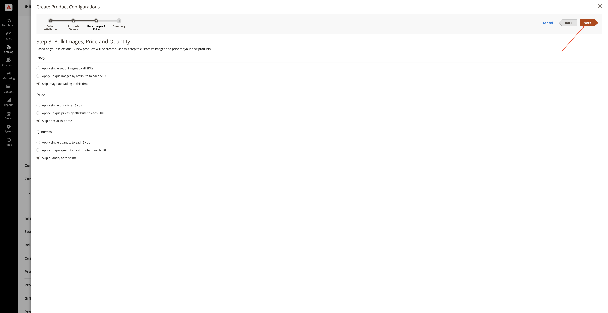

そうすると、これが表示されます。 「**製品を生成**」をクリックします。


各商品の&#x200B;**数量**&#x200B;を`10000`に設定します。 また、列&#x200B;**SKU**&#x200B;にSKUのいずれのスペースも含まれていないことを確認してください。

「**保存**」をクリックします。


「**確認**」をクリックします。

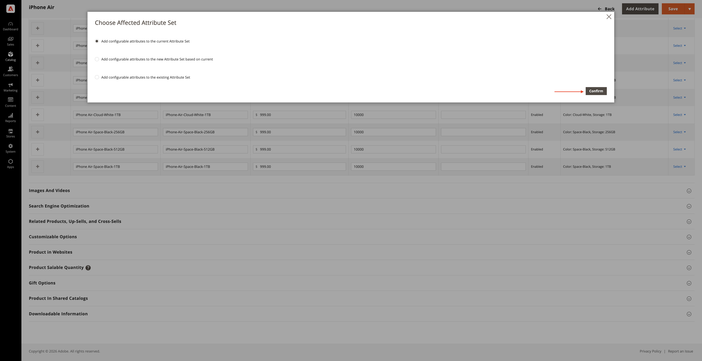

Web サイト **の**&#x200B;製品までスクロールし、**CitiSignal**&#x200B;のチェックボックスをオンにします。

「**保存**」をクリックします。


そうすると、これが表示されます。 「**戻る**」をクリックします。


商品カタログに商品&#x200B;**iPhone Air**&#x200B;とそのバリエーションが表示されました。


## 1.5.1.4製品のインポート

CitiSignalはより多くの製品を販売するため、製品カタログに残りの製品を作成するには、それらをインポートする必要があります。

**システム**&#x200B;に移動し、**読み込み**&#x200B;に移動します。

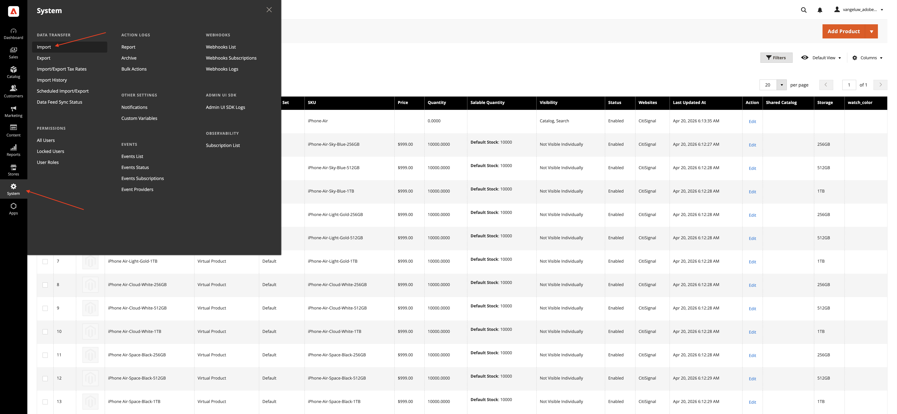

次の値を選択します。

- **エンティティの種類**: `Products`
- **ビヘイビアー**&#x200B;の読み込み：`Add/Update`
- **検証戦略**: `Skip error entries`

「**ファイルを選択**」をクリックします。

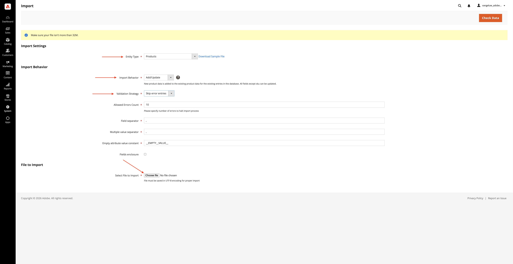

このファイルをコンピューターにダウンロードします：[product_catalog_import.csv.zip](./assets/product_catalog_import.csv.zip)。 デスクトップ上のファイルを抽出します。

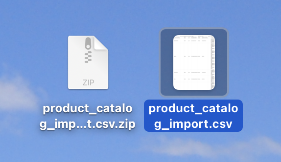

ファイル **`product_catalog_import.csv`**&#x200B;を選択し、**開く**&#x200B;をクリックします。

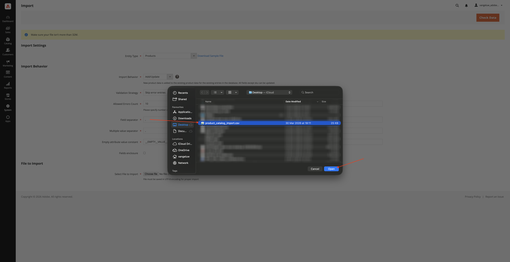

そうすると、これが表示されます。 「**データを確認**」をクリックします。


そうすると、これが表示されます。 「**インポート**」をクリックします。


そうすると、これが表示されます。


**カタログ**&#x200B;に移動し、次に&#x200B;**製品**&#x200B;に移動します。


下にスクロールして、インポートした商品を探します。


次の手順：[ACCSをAEM Sites CS/EDS ストアフロントに接続](./ex2.md){target="_blank"}

[Adobe Commerce as a Cloud Service](./accs.md){target="_blank"}に戻る

[すべてのモジュールに戻る](./../../../overview.md){target="_blank"}
