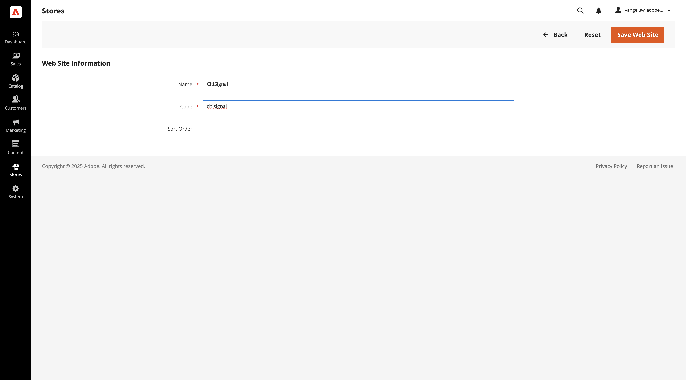
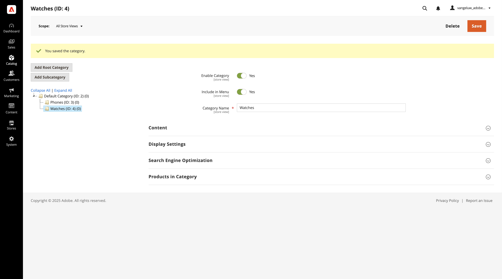
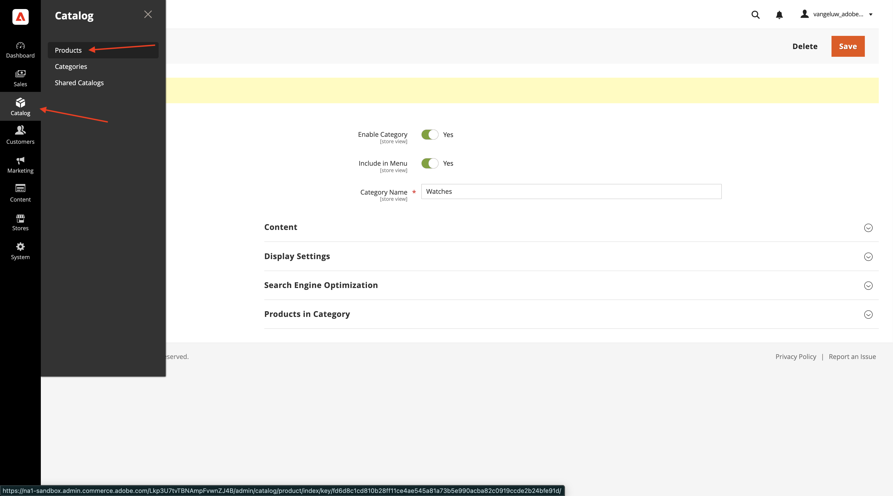
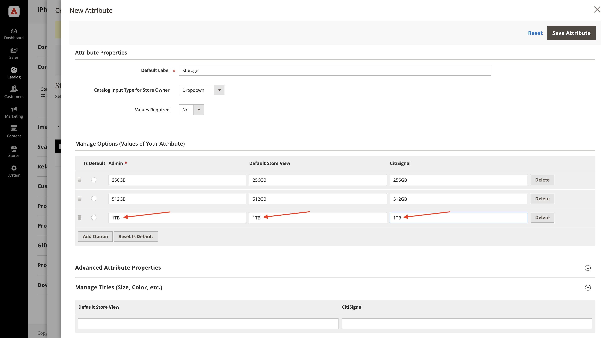

# 1.5.1 Adobe Commerce as a Cloud Serviceの概要

[https://experience.adobe.com/](https://experience.adobe.com/){target="_blank"} に移動します。 `--aepImsOrgName--` という名前の環境が正しいことを確認します。 **Commerce** をクリックします。

## 1.5.1.1 ACCS インスタンスの作成

この画像が表示されます。 「**+ インスタンスを追加**」をクリックします。

次のようにフィールドに入力します。

- **インスタンス名**: `--aepUserLdap-- - ACCS`
- **環境**: `Sandbox`
- **地域**: `North America`

**インスタンスを追加** をクリックします。

インスタンスを作成中です。 これには 5～10 分かかることがあります。

インスタンスの準備が整ったら、インスタンスをクリックして開きます。

## 1.5.1.2 CitiSignal ストアのセットアップ

この画像が表示されます。 **Adobe IDでログイン** をクリックしてログインします。

ログインすると、このホームページが表示されます。 最初のステップは、Commerceで CitiSignal ストアを設定することです。 **ストア** をクリックします。

**すべてのストア** をクリックします。

**Web サイトを作成** をクリックします。

次のようにフィールドに入力します。

- **名前**: `CitiSignal`
- **コード**: `citisignal`

**Web サイトを保存** をクリックします。

その後、あなたはここに戻るべきです。 **ストアを作成** をクリックします。

次のようにフィールドに入力します。

- **Web サイト**: `CitiSignal`
- **名前**: `CitiSignal`
- **コード**: `citisignal`
- **ルートカテゴリ**: `Default Category`

**ストアを保存** をクリックします。

その後、あなたはここに戻るべきです。 **ストア表示を作成** をクリックします。

次のようにフィールドに入力します。

- **Store**: `CitiSignal`
- **名前**: `CitiSignal`
- **コード**: `citisignal`
- **状態**: `Enabled`

**ストア表示を保存** をクリックします。

このメッセージが表示されます。 「**OK**」をクリックします。

その後、あなたはここに戻るべきです。

## カテゴリ 1.5.1.3 製品の設定

**カタログ** に移動し、「**カテゴリ**」を選択します。

**既定のカテゴリ** を選択し、[**サブカテゴリを追加**] をクリックします。

`Phones` という名前を入力して、「**保存**」をクリックします。

**デフォルトのカテゴリ** を選択し、もう一度 **サブカテゴリを追加** をクリックします。

`Watches` という名前を入力して、「**保存**」をクリックします。

次に、2 つのカテゴリを作成します。

次に、**カタログ** に移動し、**製品** を選択します。

この画像が表示されます。 **製品を追加** をクリックします。

次のように製品を設定します。

- **製品名**: `iPhone Air`
- **SKU**: `iPhone-Air`
- **価格**:`999`
- **数量**:`10000`
- **カテゴリ**:`Phones` を選択します

「**保存**」をクリックします。

**設定** までスクロールし、「**設定を作成**」をクリックします。

この画像が表示されます。 **新しい属性を作成** をクリックします。

**デフォルトのラベル** を `Storage` に設定し、「**オプションを管理**」の「**オプションを追加** をクリックします。

3 列すべてに `256GB` という名前を使用して最初のオプションを設定してから、もう一度 **オプションを追加** をクリックします。

3 列すべてに `512GB` という名前を使用して 2 つ目のオプションを設定し、もう一度 **オプションを追加** をクリックします。

3 列すべてに `1TB` という名前を使用して 3 つ目のオプションを設定し、もう一度 **オプションを追加** をクリックします。

**Storefront プロパティ** までスクロールします。 次のオプションを「はい **に設定し** す。

- **検索での使用**
- **ストアフロントでのHTML タグの許可**
- **ストアフロントのカタログページに表示**
- **製品リストでの使用**

上にスクロールして、**属性を保存** をクリックします。

この画像が表示されます。 **カラー** と **ストレージ** の両方の属性を選択し、「**次へ**」をクリックします。

この画像が表示されます。 ここで、使用可能なカラーオプションを追加する必要があります。 それには、「**新しい値を作成**」をクリックします。

値 `Sky-Blue` を入力し、「**新しい値を作成**」をクリックします。

値 `Light-Gold` を入力し、「**新しい値を作成**」をクリックします。

値 `Cloud-White` を入力し、「**新しい値を作成**」をクリックします。

値 `Space-Black` を入力します。 「**すべてを選択**」をクリックします。

「**ストレージ**」の下の 3 つのオプションをすべて選択し、「**次へ**」をクリックします。

デフォルト設定のままにし、「**次へ**」をクリックします。

この画像が表示されます。 **製品を生成** をクリックします。

「**保存**」をクリックします。

**Web サイトの製品** までスクロールし、「**CitiSignal**」のチェックボックスをオンにします。

「**保存**」をクリックします。

「**確認**」をクリックします。

この画像が表示されます。 **戻る** をクリックします。

これで、商品カタログに商品 **0}iPhone Air} とそのバリエーションが表示されます。**

次の手順：[ACCS をAEM Sites CS/EDS ストアフロントに接続する ](./ex2.md){target="_blank"}

[Adobe Commerce as a Cloud Service](./accs.md){target="_blank"} に戻る

[ すべてのモジュールに戻る ](./../../../overview.md){target="_blank"}
