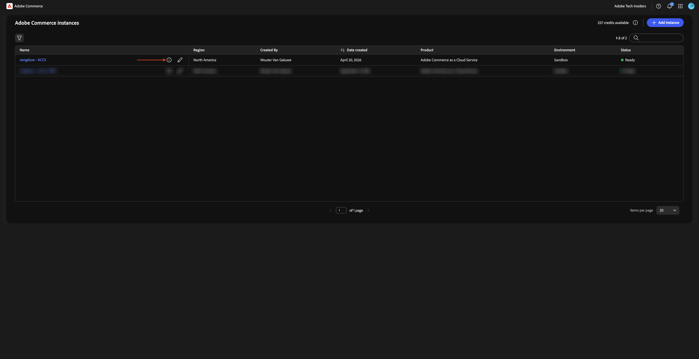
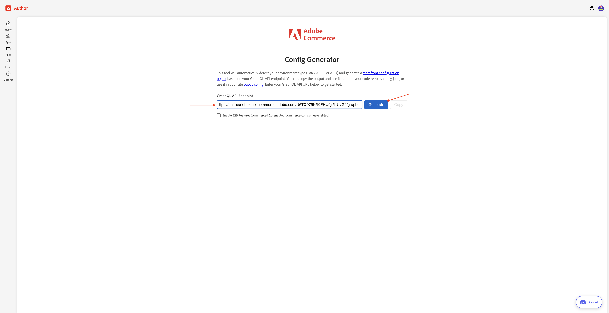
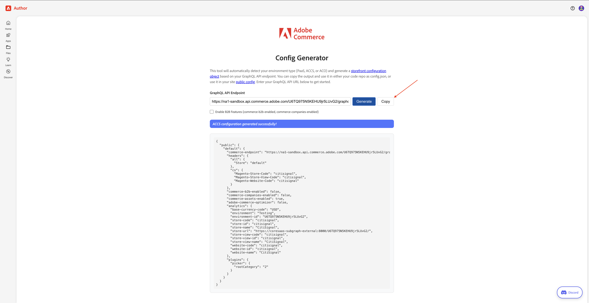
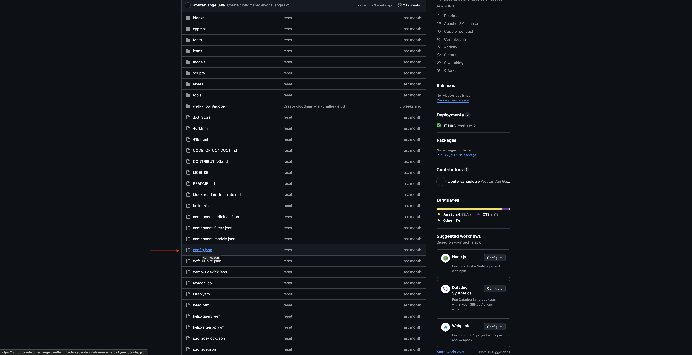
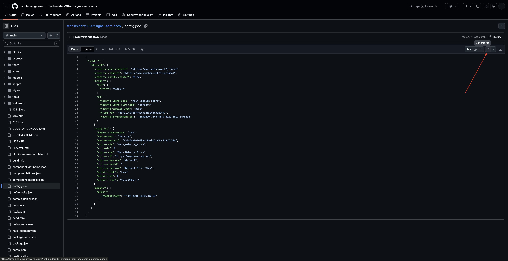
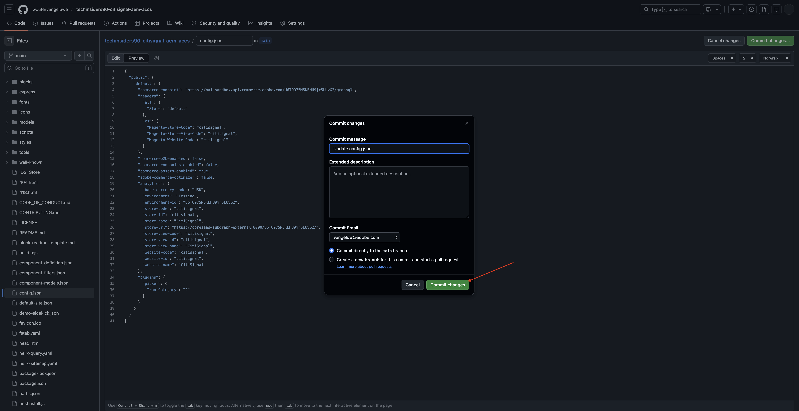
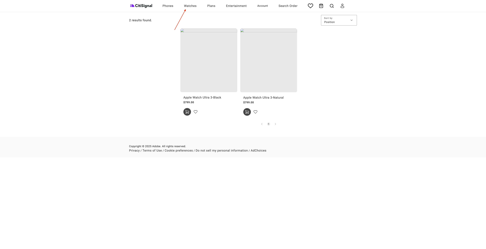
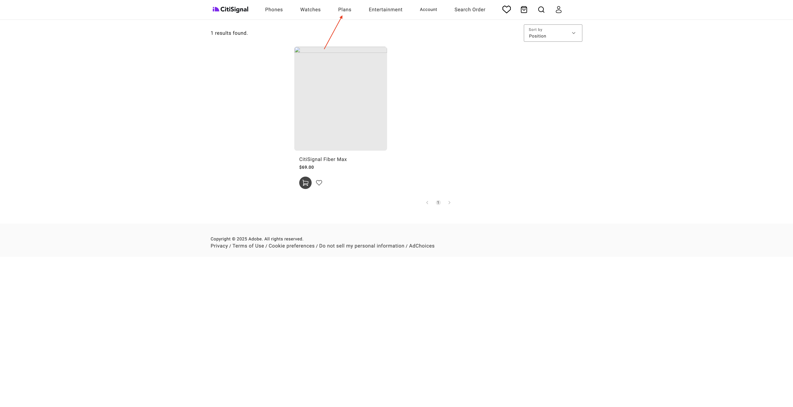

# 1.5.2 ACCSをAEM Sites CS/EDS Storefrontに接続する

>[!IMPORTANT]
>
>この演習を完了するには、動作するAEM SitesおよびAssets CS with EDS環境にアクセスする必要があります。
>
>まだ環境がない場合は、[Adobe Experience Manager Cloud ServiceとEdge Delivery Services](./../../../modules/asset-mgmt/module2.1/aemcs.md){target="_blank"}の演習に進みます。 そこに記載されている手順に従うと、そのような環境にアクセスできるようになります。

>[!IMPORTANT]
>
>AEM SitesおよびAssets CS環境でAEM CS プログラムを既に設定している場合は、AEM CS サンドボックスが休止状態になっている可能性があります。 このようなサンドボックスの休止解除には10～15分かかることを考えると、後で待つ必要がないように、今すぐ休止解除プロセスを開始することをお勧めします。

この演習では、AEM Sites CS/EDS StorefrontをACCS バックエンドにリンクします。 現時点では、AEM Sites CS/EDS ストアフロントを開いて&#x200B;**Phone**&#x200B;の商品リストページに移動すると、まだ商品が表示されません。

この演習の最後に、前の演習で設定した製品が、AEM Sites CS/EDS ストアフロントの&#x200B;**電話/時計/プラン/エンターテイメント**&#x200B;製品リストページに表示されます。

[https://experience.adobe.com/](https://experience.adobe.com/){target="_blank"}に移動します。 正しい環境であることを確認してください。名前は`--aepImsOrgName--`にする必要があります。 **Commerce**&#x200B;をクリックします。

**という名前のACCS インスタンスの横にある** info`--aepUserLdap-- - ACCS` アイコンをクリックします。

そうすると、これが表示されます。 **GraphQL エンドポイント**&#x200B;をコピーします。

[https://da.live/app/adobe-commerce/storefront-tools/tools/config-generator/config-generator](https://da.live/app/adobe-commerce/storefront-tools/tools/config-generator/config-generator)に移動します。 次に、AEM Sites CS StorefrontをACCS バックエンドにリンクするために使用するconfig.json ファイルを生成する必要があります。

**Config Generator** ページで、コピーした&#x200B;**GraphQL エンドポイント** URLを貼り付けます。

「**Generate**」をクリックします。

**コピー**&#x200B;をクリックして、完全に生成されたJSON ペイロードをコピーします。

AEM Sites CS/EDS環境の設定時に作成されたGitHub リポジトリに移動します。 このリポジトリは演習[1.1.2 Setup your AEM CS environment](./../../../modules/asset-mgmt/module2.1/ex3.md){target="_blank"}で作成されたもので、**citisignal-aem-accs**&#x200B;または&#x200B;**techinsidersodXX-citisignal-aem-accs**&#x200B;という名前にする必要があります。また、ライブの対面トレーニングに参加する場合は、**techinsidersXX-citisignal-aem-accs**&#x200B;という名前にする必要があります。

ルートディレクトリで、下にスクロールしてをクリックし、ファイル **config.json**&#x200B;を開きます。

**編集**&#x200B;アイコンをクリックします。

現在のテキストをすべて削除し、**Config Generator** ページにコピーしたJSON ペイロードを貼り付けて置き換えます。

「**変更をコミット…**」をクリックします。

「**変更をコミット**」をクリックします。

**config.json** ファイルが更新されました。 数分以内にweb サイトに変更内容が表示されるはずです。 変更が正常にピックアップされたかどうかを確認するには、**電話**&#x200B;製品ページに移動します。 これで、**iPhone Air**&#x200B;がページに表示されます。

**.page**&#x200B;または&#x200B;**.live** URLを使用してweb サイトを開き、**電話**&#x200B;に移動します。 ぜひ一度ご覧ください。

**Watches**&#x200B;に移動します。 ぜひ一度ご覧ください。

**プラン**&#x200B;に移動します。 ぜひ一度ご覧ください。

**エンターテイメント**&#x200B;に移動します。 ぜひ一度ご覧ください。

現在、製品は正常に表示されていますが、これらの製品で利用できる画像はまだありません。 次の演習では、製品画像のリンクをAEM Assets CSで設定します。

次の手順：[ACCSをAEM Assets CS](./ex3.md){target="_blank"}に接続

[Adobe Commerce as a Cloud Service](./accs.md){target="_blank"}に戻る

[すべてのモジュールに戻る](./../../../overview.md){target="_blank"}
