# 1.5.3 ACCSをAEM Assets CSに接続する

>[!IMPORTANT]
>
>この演習を完了するには、動作するAEM SitesおよびAssets CS with EDS環境にアクセスする必要があります。
>
>まだ環境がない場合は、[Adobe Experience Manager Cloud ServiceとEdge Delivery Services](./../../../modules/asset-mgmt/module2.1/aemcs.md){target="_blank"}の演習に進みます。 そこに記載されている手順に従うと、そのような環境にアクセスできるようになります。

>[!IMPORTANT]
>
>AEM SitesおよびAssets CS環境でAEM CS プログラムを既に設定している場合は、AEM CS サンドボックスが休止状態になっている可能性があります。 このようなサンドボックスの休止解除には10～15分かかることを考えると、後で待つ必要がないように、今すぐ休止解除プロセスを開始することをお勧めします。

前の演習を完了すると、ACCSからweb サイトに返送される製品が表示されましたが、まだ画像がありません。 この演習の最後に、画像も返されます。


## 1.5.3.1 パイプライン設定の更新

[https://my.cloudmanager.adobe.com](https://my.cloudmanager.adobe.com){target="_blank"}に移動します。 選択する組織は`--aepImsOrgName--`です。

クリックしてCloud Manager プログラムを開きます。次のいずれかの名前を付ける必要があります。

- `--aepUserLdap-- - CitiSignal AEM+ACCS`
- 対面テクニカルラボセッションの場合：**Tech Insiders - AEM + ACCS XX** （XXを割り当てられた番号に置き換える）
- ガイド付きオンデマンドセッションの場合：**Tech Insiders On Demand - AEM + ACCS XX** （XXを割り当てられた番号に置き換える）


少し下にスクロールして、「**パイプライン**」タブの「**リポジトリ情報にアクセス**」をクリックします。


そうすると、これが表示されます。 「**パスワードを生成**」をクリックします。

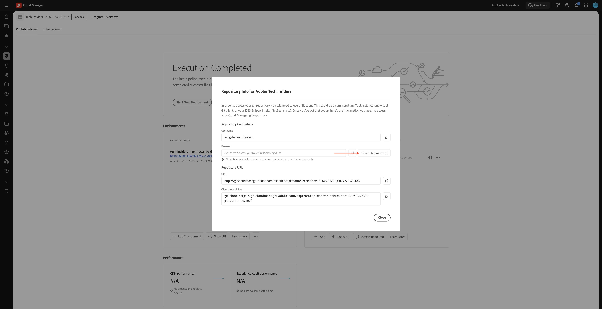

「**パスワードを生成**」をもう一度クリックします。

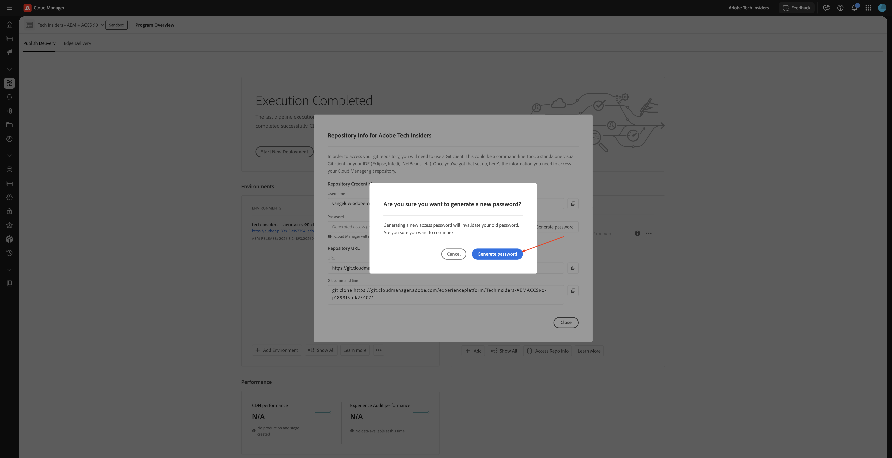

次に、パスワードを利用できるようにします。 次に、**Git コマンドライン** フィールドの横にある&#x200B;**copy** アイコンをクリックします。

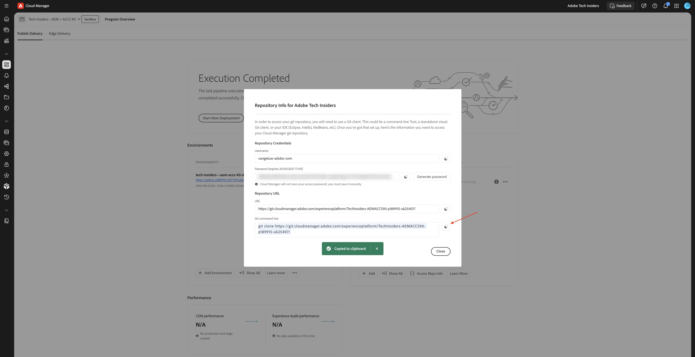

コンピューター上の任意の場所に新しいディレクトリを作成し、**AEM Pipeline GitHub**&#x200B;という名前を付けます。

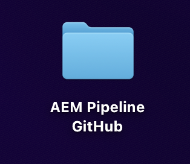

フォルダーを右クリックし、**フォルダーの新しいターミナル**&#x200B;を選択します。

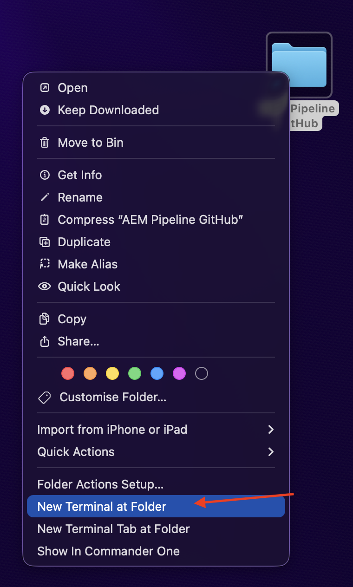

そうすると、これが表示されます。


前にコピーした&#x200B;**Git コマンドライン** コマンドをターミナルウィンドウに貼り付けます。


ユーザー名を入力する必要があります。 Cloud Managerのプログラムパイプライン **リポジトリ情報**&#x200B;にアクセスし、**enter**&#x200B;をクリックして、ユーザー名をコピーします。

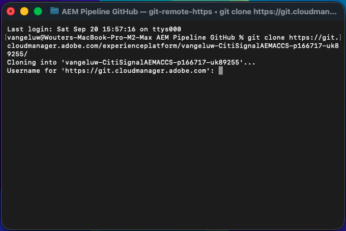

次に、パスワードを入力する必要があります。 Cloud Managerのプログラムパイプライン **リポジトリ情報**&#x200B;にアクセスし、**enter**&#x200B;をクリックして、パスワードをコピーします。


これには少し時間がかかることがあります。 完了すると、プログラムのパイプラインにリンクされたGit リポジトリのローカルコピーが作成されます。

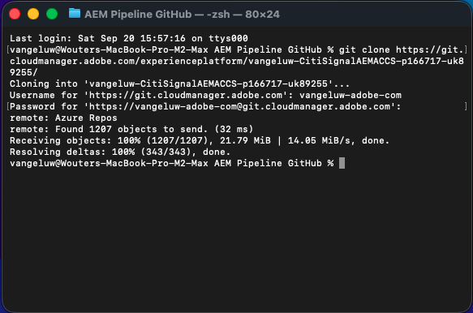

新しいディレクトリが&#x200B;**AEM パイプライン GitHub** ディレクトリに表示されます。 そのディレクトリを開きます。


そのディレクトリ内のすべてのファイルを選択し、それらをすべて削除します。

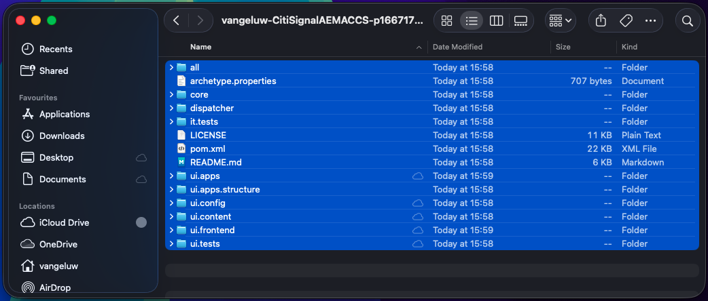

ディレクトリが空であることを確認します。


[https://github.com/ankumalh/assets-commerce](https://github.com/ankumalh/assets-commerce)に移動します。 「**&lt;> Code**」をクリックし、「**ZIP**&#x200B;をダウンロード」を選択します。 ファイルをダウンロードし、デスクトップにドロップします。

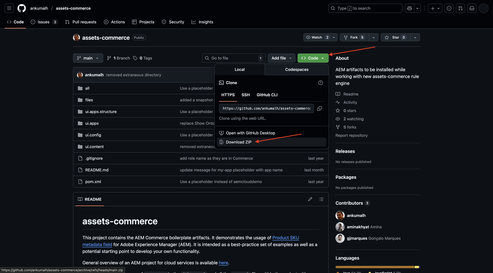

次に、ファイル **assets-commerce-main.zip**&#x200B;をデスクトップにコピーし、解凍します。 フォルダー&#x200B;**assets-commerce-main**&#x200B;を開きます。


ディレクトリ **assets-commerce-main**&#x200B;のすべてのファイルを、プログラムのパイプラインリポジトリディレクトリの空のディレクトリにコピーします。


次に、**Microsoft Visual Studio Code**&#x200B;を開き、**Microsoft Visual Studio Code**&#x200B;でプログラムのパイプラインリポジトリを含むフォルダーを開きます。

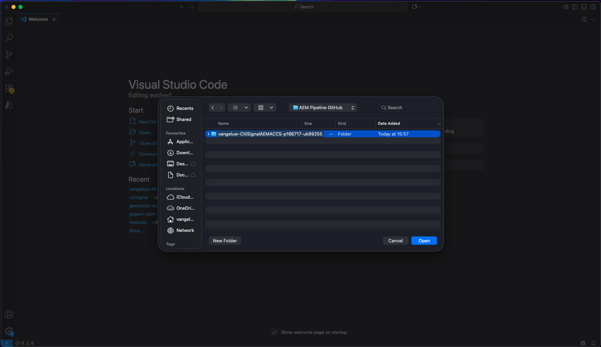

左側のメニューの&#x200B;**検索**&#x200B;に移動し、`<my-app>`を検索します。 `<my-app>`のすべてのオカレンスを`techinsiderscitisignalaemaccs`で置き換える必要があります。

「**すべて置換**」アイコンをクリックします。


「**置換**」をクリックします。


これで、新しいファイルを、プログラムのパイプラインリポジトリにリンクされているGit リポジトリにアップロードする準備が整いました。 これを行うには、**AEM Pipeline GitHub** フォルダーを開き、新しいファイルが含まれているフォルダーを右クリックします。 フォルダー&#x200B;**の**&#x200B;新しいターミナルを選択します。


そうすると、これが表示されます。 次のコマンドを貼り付け、**enter**&#x200B;を押します。

```
git add .
```


そうすると、これが表示されます。 次のコマンドを貼り付け、**enter**&#x200B;を押します。

```
git commit -m "add assets integration"
```

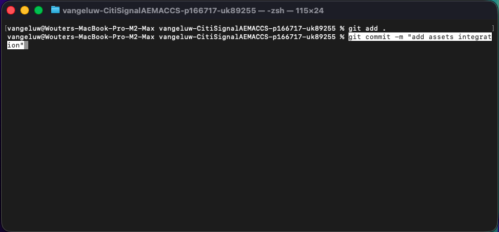

そうすると、これが表示されます。 次のコマンドを貼り付け、**enter**&#x200B;を押します。

```
git push origin main
```

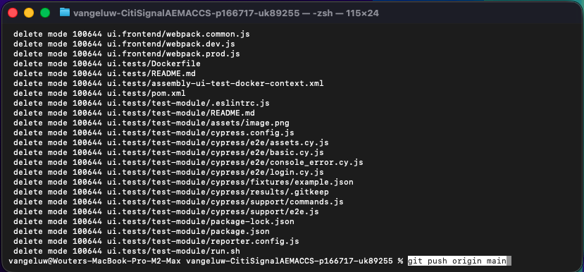

そうすると、これが表示されます。 これで、変更がプログラムのパイプライン Git リポジトリにデプロイされました。


Cloud Managerに戻り、**閉じる**&#x200B;をクリックします。

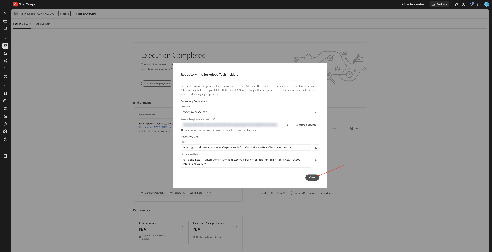

パイプラインのGit リポジトリに変更を加えた後、**Deploy to Dev** パイプラインを再度実行する必要があります。 3つのドット **...**&#x200B;をクリックし、**実行**&#x200B;を選択します。


「**実行**」をクリックします。 パイプラインのデプロイメントを実行するには、10～15分かかる場合があります。 パイプラインのデプロイメントが正常に完了するまで待ってから、続行する必要があります。


## 1.5.3.2 ACCSでのAEM Assets統合の有効化

ACCS インスタンスに戻ります。 左側のメニューで、**ストア**&#x200B;に移動し、**設定**&#x200B;を選択します。


メニューを下にスクロールして&#x200B;**ADOBE サービス**&#x200B;し、**AEM Assets統合**&#x200B;を開きます。 そうすると、これが表示されます。

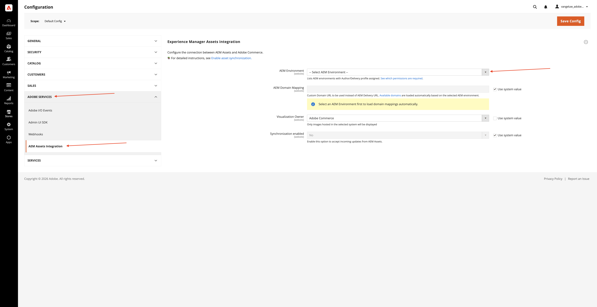

**AEM Environment**&#x200B;のドロップダウンリストから、お使いの環境を選択します。

次に、**ビジュアライゼーションオーナー**&#x200B;を`AEM Assets`に設定します（必要に応じて&#x200B;**システム値**&#x200B;のチェックボックスを無効にします）。

次に、**同期を有効にする**&#x200B;を`Yes`に設定します（必要に応じて、**システム値を使用** チェックボックスを無効にします）。

これらの設定が次のように設定されていることを確認します。

- **アセット一致ルール**: `Match by product SKU`
- **製品SKU属性名**&#x200B;で一致：`commerce:skus`

「**設定を保存**」をクリックします。


そうすると、これが表示されます。

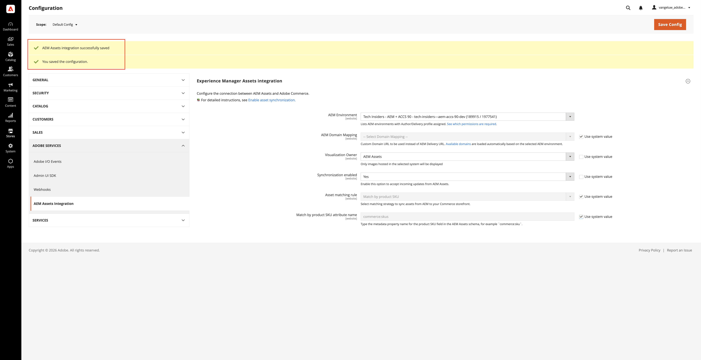

## 1.5.3.3 config.jsonの更新

AEM Sites CS/EDS環境の設定時に作成されたGitHub リポジトリに移動します。

ルートディレクトリで、下にスクロールしてをクリックし、ファイル **config.json**&#x200B;を開きます。

**config.json** ファイル （この画像の17行目）に次の行が表示されます。この行が&#x200B;**true**&#x200B;に設定されていることを確認してください。

```json
 "commerce-assets-enabled": "true",
```


**commerce-assets-enabled**&#x200B;の値が&#x200B;**false**&#x200B;に設定されている場合は、ファイルを更新し、値を&#x200B;**true**&#x200B;に設定します。 次に、変更をコミットします。

## 1.5.3.4 AEM Assets CSでのCommerce フィールドの検証

AEM CS オーサー環境にログインし、**Assets**&#x200B;に移動します。

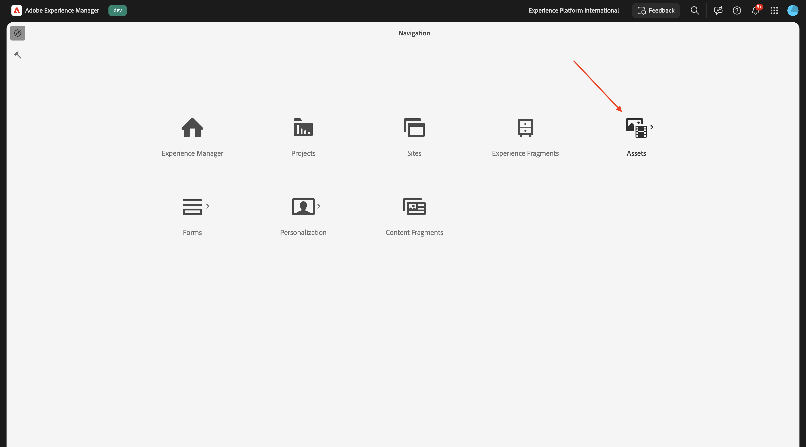

**ファイル**&#x200B;に移動します。


**CitiSignal** フォルダーを開きます。

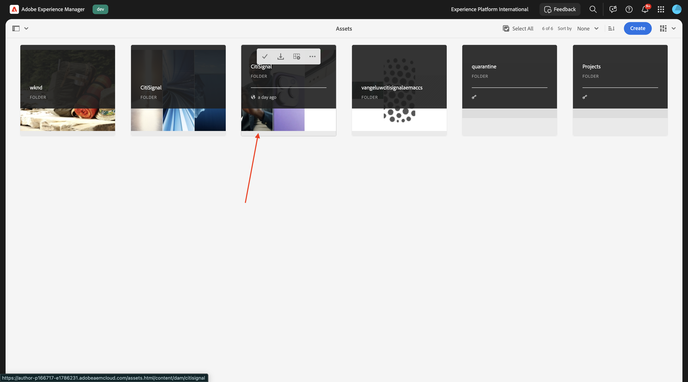

アセットにカーソルを合わせて、**info** アイコンをクリックします。

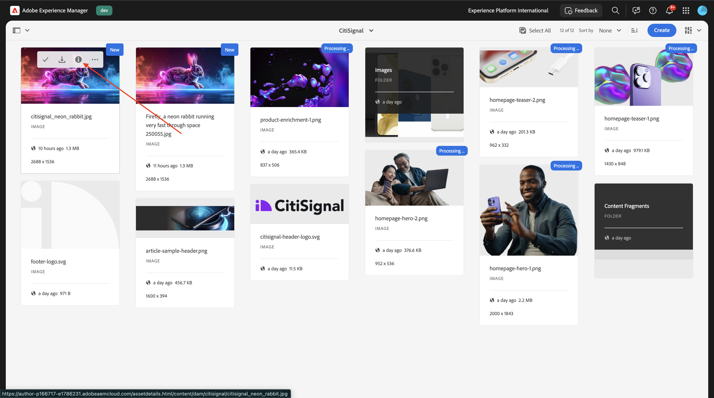

2つの新しいメタデータ属性を含む&#x200B;**Commerce** タブが表示されます。


AEM Assets CS環境でCommerce統合がサポートされるようになりました。 製品画像のアップロードを開始できるようになりました。

## 1.5.3.4製品Assetsのアップロードと製品へのリンク

[製品画像をこちらからダウンロード &#x200B;](./images/Product_Images.zip)。 ダウンロードしたら、ファイルをデスクトップに書き出します。


**作成**&#x200B;をクリックし、**フォルダー**&#x200B;を選択します。


フィールド **タイトル**&#x200B;および&#x200B;**名前**&#x200B;に値&#x200B;**Product_Images**&#x200B;を入力します。 「**作成**」をクリックします。

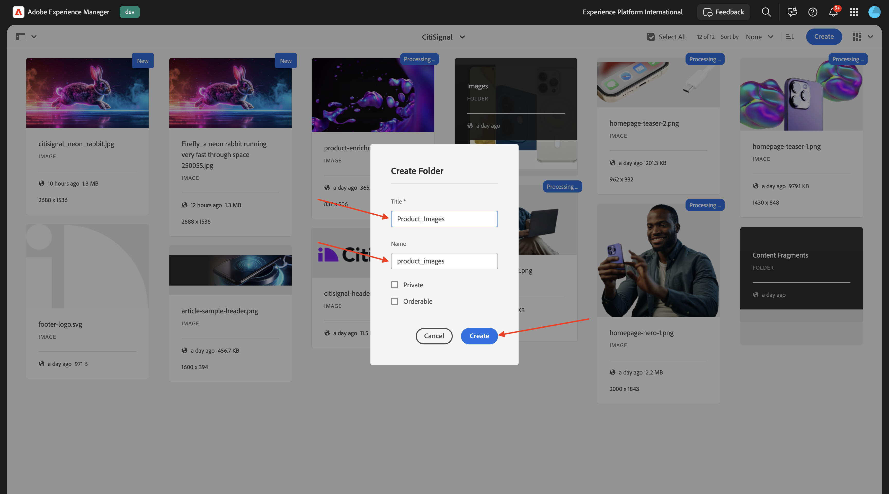

クリックして、作成したフォルダーを開きます。

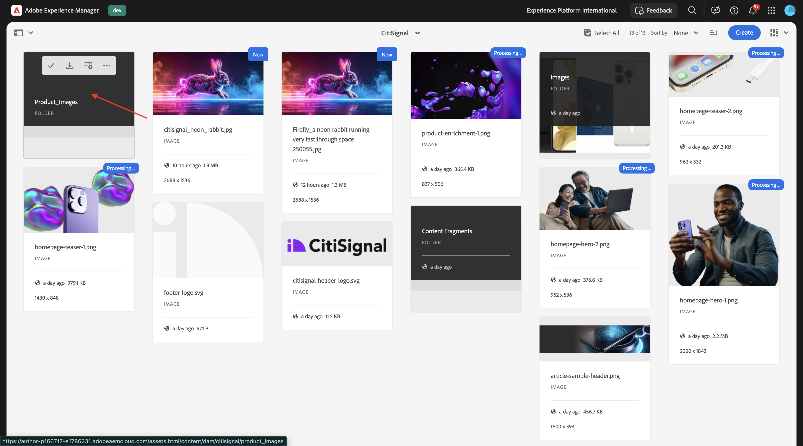

**作成**&#x200B;をクリックし、**ファイル**&#x200B;を選択します。

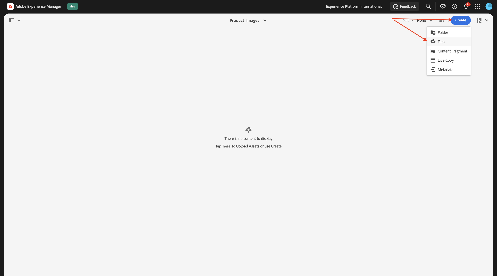

デスクトップ上の&#x200B;**Product_Images** フォルダーに移動し、すべてのファイルを選択して、**開く**&#x200B;をクリックします。

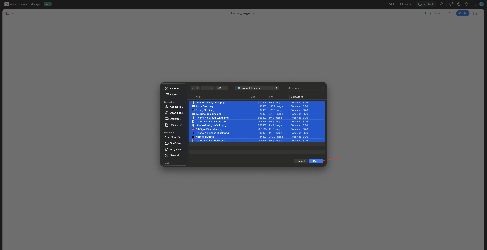

「**アップロード**」をクリックします。


その後、画像はフォルダーで利用できるようになります。 商品&#x200B;**iPhone-Air-Light-Gold.png**&#x200B;にカーソルを合わせ、**プロパティ** アイコンをクリックします。


下にスクロールして、フィールド **Review Status**&#x200B;を&#x200B;**Approved**&#x200B;に設定します。 AEM Assets CS - ACCS統合は、承認済み画像に対してのみ機能します。

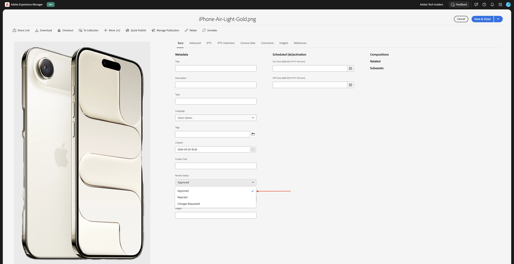

上にスクロールして、**Commerce** タブに移動し、**製品skus**&#x200B;の下の&#x200B;**Add**&#x200B;をクリックします。

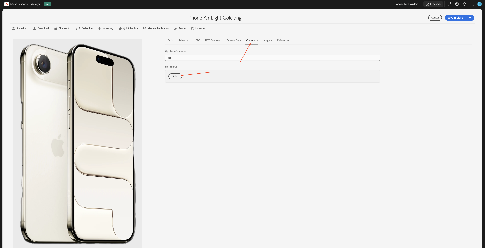

この製品に次のSKUを追加します。

| キー | 値 | 用途 |
|:-------------:| :---------------:| :---------------:|
| `iPhone-Air-Light-Gold` | `1` | `thumbnail, image, swatch_image, small_image` |
| `iPhone-Air-Light-Gold-256GB` | `1` | `thumbnail, image, swatch_image, small_image` |
| `iPhone-Air-Light-Gold-512GB` | `1` | `thumbnail, image, swatch_image, small_image` |
| `iPhone-Air-Light-Gold-1TB` | `1` | `thumbnail, image, swatch_image, small_image` |

では、これを使ってください。 「**保存して閉じる**」をクリックします。


商品&#x200B;**iPhone-Air-Space-Black.png**&#x200B;にカーソルを合わせ、**プロパティ** アイコンをクリックします。


下にスクロールして、フィールド **Review Status**&#x200B;を&#x200B;**Approved**&#x200B;に設定します。 AEM Assets CS - ACCS統合は、承認済み画像に対してのみ機能します。


上にスクロールして、**Commerce** タブに移動し、**製品skus**&#x200B;の下の&#x200B;**Add**&#x200B;をクリックします。

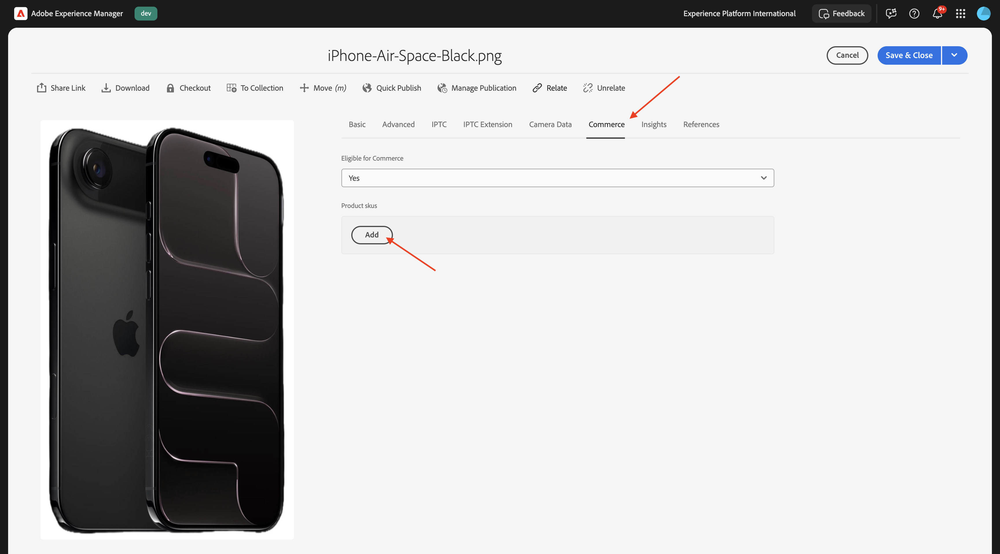

この製品に次のSKUを追加します。

| キー | 値 | 用途 |
|:-------------:| :---------------:| :---------------:|
| `iPhone-Air-Space-Black` | `1` | `thumbnail, image, swatch_image, small_image` |
| `iPhone-Air-Space-Black-256GB` | `1` | `thumbnail, image, swatch_image, small_image` |
| `iPhone-Air-Space-Black-512GB` | `1` | `thumbnail, image, swatch_image, small_image` |
| `iPhone-Air-Space-Black-1TB` | `1` | `thumbnail, image, swatch_image, small_image` |
| `iPhone-Air` | `1` | `thumbnail, image, swatch_image, small_image` |

では、これを使ってください。 「**保存して閉じる**」をクリックします。

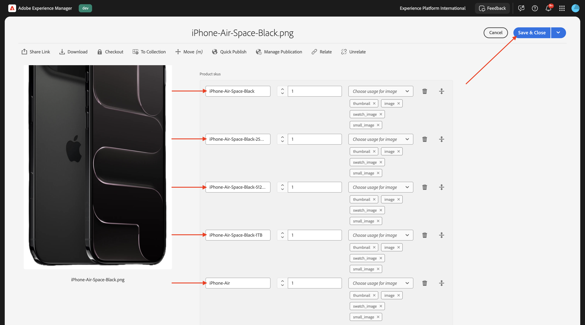

商品&#x200B;**iPhone-Air-Sky-Blue.png**&#x200B;にカーソルを合わせ、**プロパティ** アイコンをクリックします。

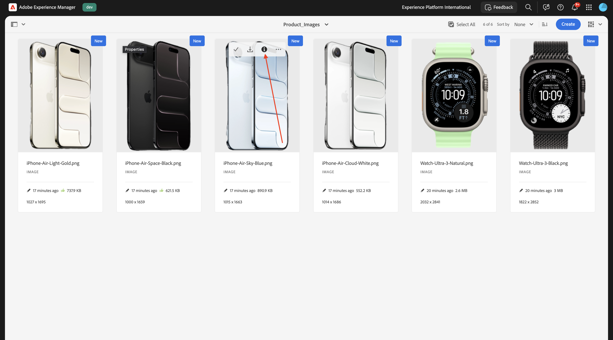

下にスクロールして、フィールド **Review Status**&#x200B;を&#x200B;**Approved**&#x200B;に設定します。 AEM Assets CS - ACCS統合は、承認済み画像に対してのみ機能します。


上にスクロールして、**Commerce** タブに移動し、**製品skus**&#x200B;の下の&#x200B;**Add**&#x200B;をクリックします。


この製品に次のSKUを追加します。

| キー | 値 | 用途 |
|:-------------:| :---------------:| :---------------:|
| `iPhone-Air-Sky-Blue` | `1` | `thumbnail, image, swatch_image, small_image` |
| `iPhone-Air-Sky-Blue-256GB` | `1` | `thumbnail, image, swatch_image, small_image` |
| `iPhone-Air-Sky-Blue-512GB` | `1` | `thumbnail, image, swatch_image, small_image` |
| `iPhone-Air-Sky-Blue-1TB` | `1` | `thumbnail, image, swatch_image, small_image` |

では、これを使ってください。 「**保存して閉じる**」をクリックします。


商品&#x200B;**iPhone-Air-Cloud-White.png**&#x200B;にカーソルを合わせ、**プロパティ** アイコンをクリックします。

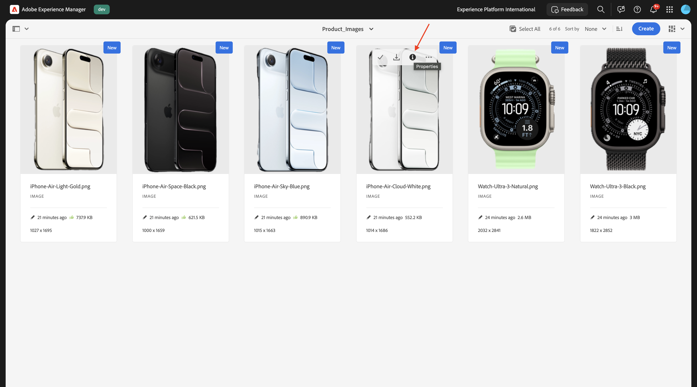

下にスクロールして、フィールド **Review Status**&#x200B;を&#x200B;**Approved**&#x200B;に設定します。 AEM Assets CS - ACCS統合は、承認済み画像に対してのみ機能します。

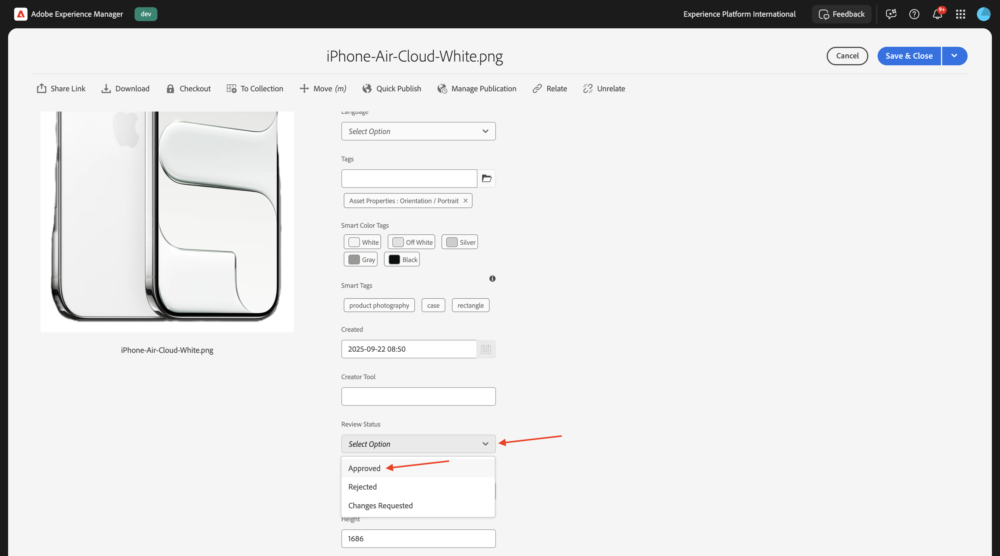

上にスクロールして、**Commerce** タブに移動し、**製品skus**&#x200B;の下の&#x200B;**Add**&#x200B;をクリックします。


この製品に次のSKUを追加します。

| キー | 値 | 用途 |
|:-------------:| :---------------:| :---------------:|
| `iPhone-Air-Cloud-White` | `1` | `thumbnail, image, swatch_image, small_image` |
| `iPhone-Air-Cloud-White-256GB` | `1` | `thumbnail, image, swatch_image, small_image` |
| `iPhone-Air-Cloud-White-512GB` | `1` | `thumbnail, image, swatch_image, small_image` |
| `iPhone-Air-Cloud-White-1TB` | `1` | `thumbnail, image, swatch_image, small_image` |

では、これを使ってください。 「**保存して閉じる**」をクリックします。

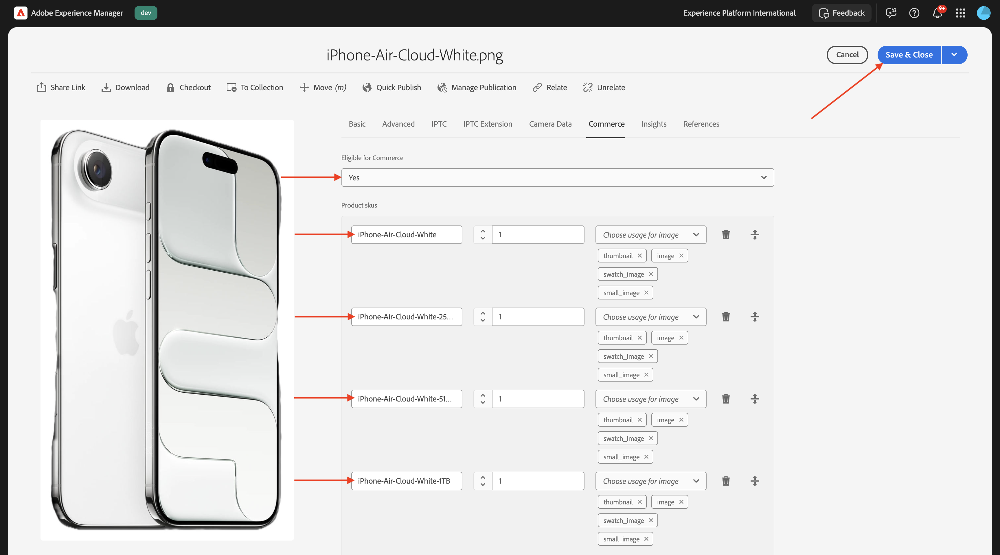

**iPhone Air**&#x200B;の画像ごとに&#x200B;**緑の親指が上がり**&#x200B;になり、アセットが承認されたことを示します。


次の表を使用して、残りの製品に対してこれらの手順を繰り返す必要があります。 各イメージを承認してから、を設定することを忘れないでください。 **Commerce** タブのSKU設定の下にあります。

| 製品名 | キー | 値 | 用途 |
|:-------------:|:-------------:| :---------------:| :---------------:|
| Apple Watch Ultra 3-Black | `Apple-Watch-Ultra-3-Black` | `1` | `thumbnail, image, swatch_image, small_image` |
| Apple Watch Ultra 3-Natural | `Apple-Watch-Ultra-3-Natural` | `1` | `thumbnail, image, swatch_image, small_image` |
| CitiSignal Fiber Max | `CitiSignal-Fiber-Max` | `1` | `thumbnail, image, swatch_image, small_image` |
| Apple One | `Apple-One` | `1` | `thumbnail, image, swatch_image, small_image` |
| YouTube Premium | `YouTube-Premium` | `1` | `thumbnail, image, swatch_image, small_image` |
| Disney Plus | `Disney` | `1` | `thumbnail, image, swatch_image, small_image` |
| Netflix + HBO Max | `Netflix-HBO-Max` | `1` | `thumbnail, image, swatch_image, small_image` |

画像はすべて承認する必要があります。

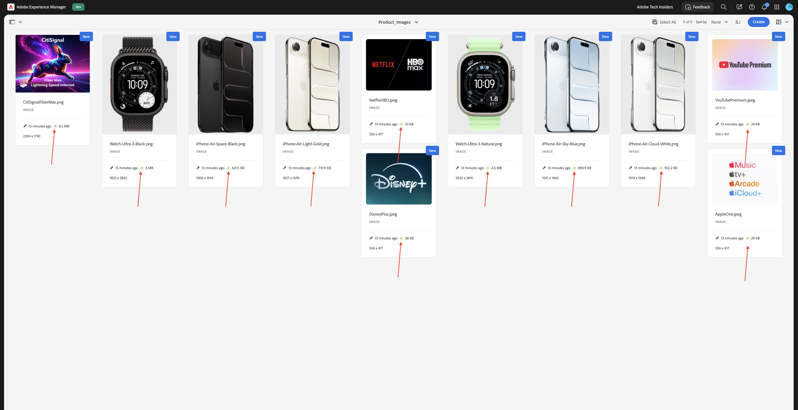

## 1.5.3.5 AEM Sites CS/EDS Storefrontでの商品画像の検証

>[!NOTE]
>
>上記の変更が正常にデプロイされるまでに最大15分かかる場合があります。 画像がまだ表示されていない場合は、15分待ってから、もう一度試してください。

統合が機能していることを確認するには、CitiSignal web サイトを開く必要があります。

そうすると、これが表示されます。 **電話**&#x200B;に移動します。


**iPhone Air**&#x200B;の製品画像が表示されます。 **iPhone Air**&#x200B;をクリックします。


そうすると、これが表示されます。 カラーとストレージのオプションを変更すると、選択した内容に応じて画像が動的に変更されます。


色を&#x200B;**ライトゴールド**&#x200B;に、ストレージサイズを&#x200B;**256GB**&#x200B;に変更する例を次に示します。


[Adobe Commerce as a Cloud Service](./accs.md){target="_blank"}に戻る

[すべてのモジュールに戻る](./../../../overview.md){target="_blank"}
