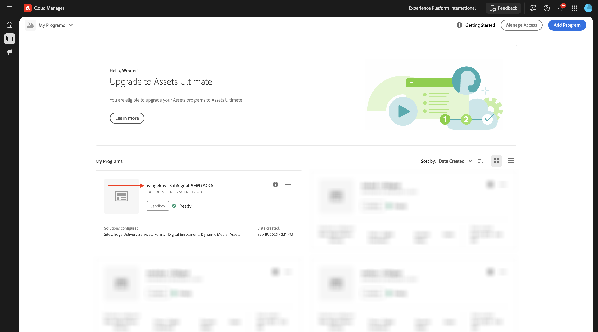
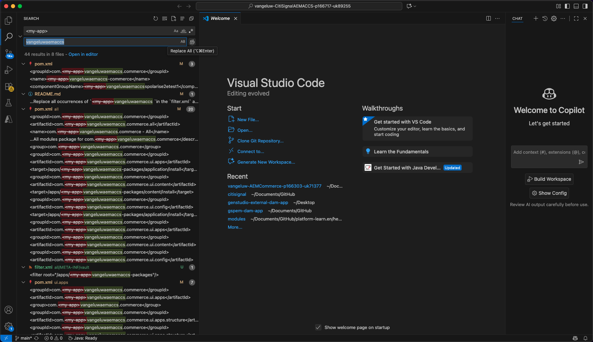
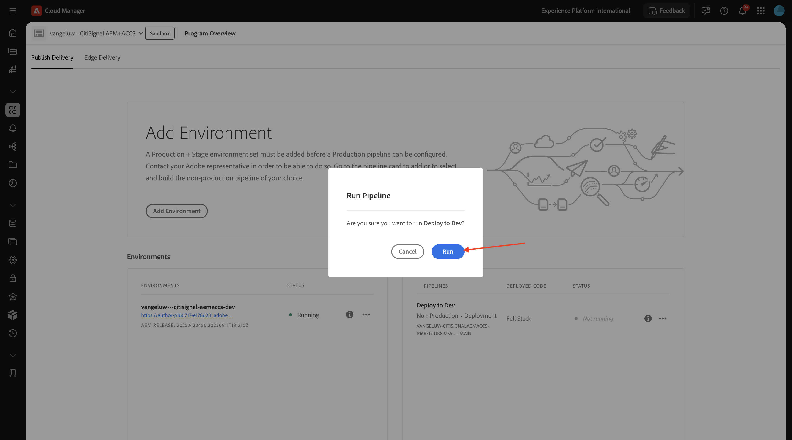
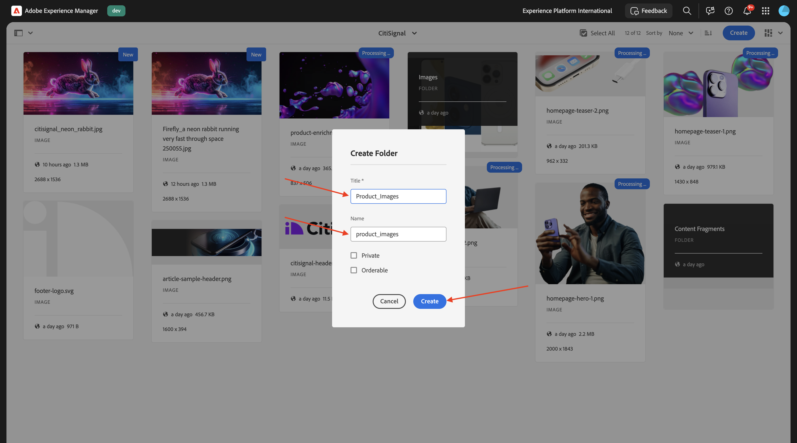
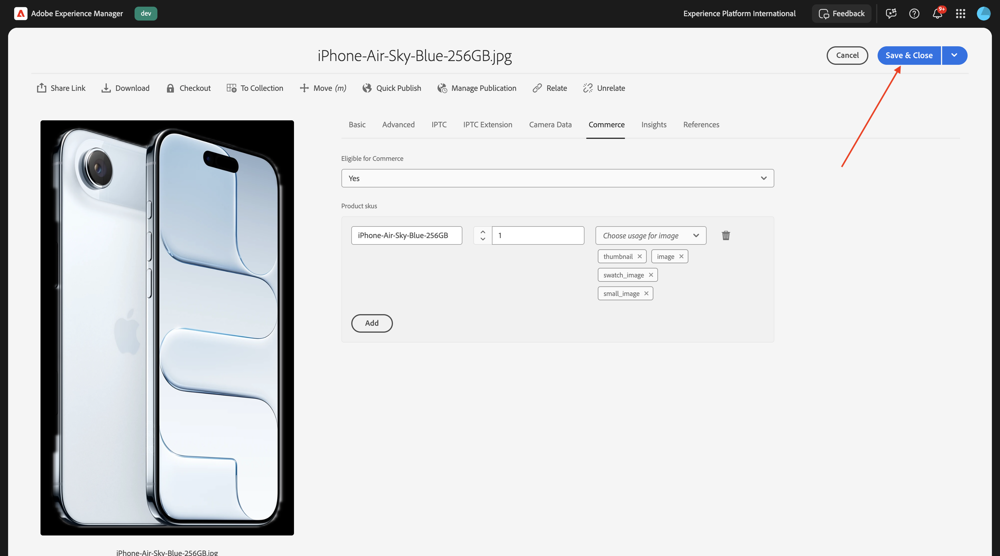
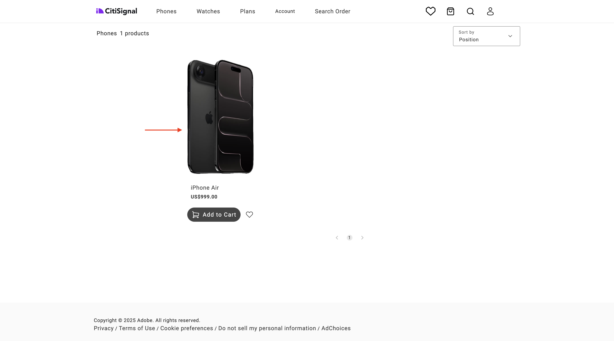

# 1.5.3 ACCS をAEM Assets CS に接続する

>[!IMPORTANT]
>
>この演習を完了するには、EDS 環境を使用して動作するAEM SitesとAssets CS にアクセスできる必要があります。
>
>そのような環境がまだない場合は、[Adobe Experience Manager、Cloud Service、Edge Delivery Services](./../../../modules/asset-mgmt/module2.1/aemcs.md){target="_blank"} の演習に進んでください。 指示に従うと、そのような環境にアクセスできます。

>[!IMPORTANT]
>
>以前、AEM CS プログラムをAEM SitesとAssets CS 環境で設定したことがある場合は、AEM CS サンドボックスが休止状態になっている可能性があります。 このようなサンドボックスの休止解除には 10～15 分かかるので、後で待つ必要がないように、今すぐ休止解除プロセスを開始することをお勧めします。

前の演習を完了すると、ACCS から web サイトに製品が返されるのがわかりますが、まだ画像がありません。 この演習の最後では、画像が返されることも確認できます。


## 1.5.3.1 パイプライン設定を更新

[https://my.cloudmanager.adobe.com](https://my.cloudmanager.adobe.com){target="_blank"} に移動します。 選択する組織は `--aepImsOrgName--` です。

クリックすると、Cloud Manager プログラムが開きます。このプログラムは `--aepUserLdap-- - CitiSignal AEM+ACCS` と呼ばれます。



少しスクロールして、「**パイプライン**」タブの **リポジトリ情報にアクセス** をクリックします。


この画像が表示されます。 「**パスワードの生成**」をクリックします。


もう一度 **パスワードを生成** をクリックします。


すると、パスワードが使用可能になります。 次に、「**Git コマンドライン** フィールドの横にある「**コピー** アイコンをクリックします。


コンピューター上の任意の場所に新しいディレクトリを作成し、**AEM パイプライン GitHub** という名前を付けます。


フォルダーを右クリックして、「**フォルダーに新しいターミナル**」を選択します。


この画像が表示されます。


以前にコピーした **Git コマンドライン** コマンドをターミナルウィンドウに貼り付けます。


ユーザー名を入力してください。 Cloud Managerのプログラムパイプラインからユーザー名をコピーし **リポジトリ情報にアクセス**、**Enter** を押します。


次に、パスワードを入力する必要があります。 Cloud Manager プログラムパイプラインからパスワードをコピーし **リポジトリ情報にアクセス**、**Enter** を押します。


これには数分かかることがあります。 完了すると、プログラムのパイプラインにリンクされた Git リポジトリーのローカルコピーが作成されます。


**AEM パイプライン GitHub** ディレクトリに新しいディレクトリが表示されます。 そのディレクトリを開きなさい。


そのディレクトリ内のすべてのファイルを選択し、それらをすべて削除します。


ディレクトリが空であることを確認します。


[https://github.com/ankumalh/assets-commerce](https://github.com/ankumalh/assets-commerce) に移動します。

次に、ファイル **assets-commerce-main.zip** をデスクトップにコピーし、解凍します。 フォルダー **assets-commerce-main** を開きます。


ディレクトリ **assets-commerce-main** からプログラムのパイプラインリポジトリーディレクトリの空のディレクトリにすべてのファイルをコピーします。


次に、**Microsoft Visual Studio Code を開き****Microsoft Visual Studio Code} でプログラムのパイプラインリポジトリを含むフォルダーを開き** す。


左側のメニューで **検索** に移動し、`<my-app>` を検索します。 `<my-app>` のすべての箇所を `--aepUserLdap--citisignalaemaccs` で置き換える必要があります。

**すべてを置換** アイコンをクリックします。



**置換** をクリックします。


これで、プログラムのパイプラインリポジトリにリンクされている Git リポジトリに、新しいファイルをアップロードして戻す準備が整いました。 それには、フォルダー **AEM Pipeline GitHub} を開き** 新しいファイルを含むフォルダーを右クリックします。 **フォルダーに新しいターミナル** を選択します。


この画像が表示されます。 コマンド `git add .` を貼り付けて、**enter** キーを押します。


この画像が表示されます。 コマンド `git commit -m "add assets integration"` を貼り付けて、**enter** キーを押します。


この画像が表示されます。 コマンド `git push origin main` を貼り付けて、**enter** キーを押します。


この画像が表示されます。 これで、変更がプログラムのパイプライン Git リポジトリにデプロイされました。


Cloud Managerに戻り、「**閉じる** をクリックします。


パイプラインの Git リポジトリーに変更を加えた後、**開発環境にデプロイ** パイプラインを再度実行する必要があります。 3 つのドット **...** をクリックし、「**実行**」を選択します。


**実行** をクリックします。 パイプラインのデプロイメントの実行には 10～15 分かかる場合があります。 続行するには、パイプラインのデプロイメントが正常に完了するまで待つ必要があります。



## 1.5.3.2 ACCS でのAEM Assets統合の有効化

ACCS インスタンスに戻ります。 左側のメニューで、**ストア** に移動し、「**設定**」を選択します。


メニューを下にスクロールして **ADOBE サービスを表示し****AEM Assets Integration** を開きます。 この画像が表示されます。


次の変数を入力します。

- **AEM Assets プログラム ID**: プログラム ID は、AEM CS オーサーの URL から取得できます。 この例では、プログラム ID は `166717` です。


- **AEM Assets環境 ID**：環境 ID は、AEM CS オーサーの URL から取得できます。 この例では、環境 ID は `1786231` です。


- **アセットセレクター IMS クライアント ID**:`1` に設定
- **同期有効**: `Yes` に設定
- **ビジュアライゼーション所有者**:`AEM Assets` に設定します
- **アセット一致ルール**: `Match by product SKU`
- **製品 SKU 属性名で一致**: `commerce:skus`

「**設定を保存**」をクリックします。


この画像が表示されます。


## config.json の 1.5.3.3 更新

AEM Sites CS/EDS 環境の設定時に作成した GitHub リポジトリに移動します。 このリポジトリは、演習 [1.1.2 AEM CS 環境の設定で作成し ](./../../../modules/asset-mgmt/module2.1/ex3.md){target="_blank"}**citisignal-aem-accs** という名前にする必要があります。

ルートディレクトリで、下にスクロールしてクリックし、**config.json** ファイルを開きます。 **編集** アイコンをクリックして、ファイルを変更します。


5 行目の `"commerce-endpoint": "https://na1-sandbox.api.commerce.adobe.com/XXX/graphql",` の下に次のコードスニペットを追加します。

```json
 "commerce-assets-enabled": "true",
```

「**変更をコミット…**」をクリックします。


「**変更をコミット**」をクリックします。


変更は保存されました。間もなく公開されます。 変更がストアフロントに表示されるまでに数分かかる場合があります。


## AEM Assets CS1.5.3.4Commerce フィールドを検証するには

AEM CS オーサー環境にログインし、**Assets** に移動します。


**ファイル** に移動します。


**CitiSignal** フォルダーを開きます。


任意のアセットの上にマウスポインターを置いて、「**info**」アイコンをクリックします。


2 つの新しいメタデータ属性を含む **0}Commerce} タブが表示されます。**


お使いのAEM Assets CS 環境で、Commerce統合がサポートされるようになりました。 これで、製品画像のアップロードを開始できます。

## 1.5.3.4 製品のAssetsをアップロードして製品にリンク

[ 製品画像はこちらからダウンロードできます ](./images/Product_Images.zip)。 ダウンロードが完了したら、ファイルをデスクトップに書き出します。


**作成** をクリックし、「**フォルダー**」を選択します。


「**タイトル**」フィールドと「**名前**」フィールドに値 **Product_Images** を入力します。 「**作成**」をクリックします。



クリックして、作成したフォルダーを開きます。


**作成** をクリックし、**ファイル** を選択します。


デスクトップ上の **Product_Images** フォルダーに移動し、すべてのファイルを選択して **開く** をクリックします。


**アップロード** をクリックします。


その後、画像はフォルダーで使用できるようになります。 商品 **iPhone-Air-Light-Gold.png** にポインタを合わせて、「**プロパティ** アイコンをクリックします。


下にスクロールして、フィールド **レビューステータス** を **承認済み** に設定します。 AEM Assets CS - ACCS 統合は、承認済み画像に対してのみ機能します。


上にスクロールして、「**Commerce**」タブに移動し、「**製品 SKU** の下の **追加** をクリックします。


この製品に次の SKU を追加します：

| キー | 値 | 用途 |
|:-------------:| :---------------:| :---------------:| 
| `iPhone-Air-Light-Gold` | `1` | `thumbnail, image, swatch_image, small_image` |
| `iPhone-Air-Light-Gold-256GB` | `1` | `thumbnail, image, swatch_image, small_image` |
| `iPhone-Air-Light-Gold-512GB` | `1` | `thumbnail, image, swatch_image, small_image` |
| `iPhone-Air-Light-Gold-1TB` | `1` | `thumbnail, image, swatch_image, small_image` |

これで完了です。 **保存して閉じる** をクリックします。


商品 **iPhone-Air-Space-Black.png にポインタを合わせ** 「プロパティ **アイコンをクリック** ます。



下にスクロールして、フィールド **レビューステータス** を **承認済み** に設定します。 AEM Assets CS - ACCS 統合は、承認済み画像に対してのみ機能します。


上にスクロールして、「**Commerce**」タブに移動し、「**製品 SKU** の下の **追加** をクリックします。


この製品に次の SKU を追加します：

| キー | 値 | 用途 |
|:-------------:| :---------------:| :---------------:| 
| `iPhone-Air-Space-Black` | `1` | `thumbnail, image, swatch_image, small_image` |
| `iPhone-Air-Space-Black-256GB` | `1` | `thumbnail, image, swatch_image, small_image` |
| `iPhone-Air-Space-Black-512GB` | `1` | `thumbnail, image, swatch_image, small_image` |
| `iPhone-Air-Space-Black-1TB` | `1` | `thumbnail, image, swatch_image, small_image` |
| `iPhone-Air` | `1` | `thumbnail, image, swatch_image, small_image` |

これで完了です。 **保存して閉じる** をクリックします。


商品 **iPhone-Air-Sky-Blue.png にポインタを合わせ** 「プロパティ **アイコンをクリック** ます。


下にスクロールして、フィールド **レビューステータス** を **承認済み** に設定します。 AEM Assets CS - ACCS 統合は、承認済み画像に対してのみ機能します。


上にスクロールして、「**Commerce**」タブに移動し、「**製品 SKU** の下の **追加** をクリックします。


この製品に次の SKU を追加します：

| キー | 値 | 用途 |
|:-------------:| :---------------:| :---------------:| 
| `iPhone-Air-Sky-Blue` | `1` | `thumbnail, image, swatch_image, small_image` |
| `iPhone-Air-Sky-Blue-256GB` | `1` | `thumbnail, image, swatch_image, small_image` |
| `iPhone-Air-Sky-Blue-512GB` | `1` | `thumbnail, image, swatch_image, small_image` |
| `iPhone-Air-Sky-Blue-1TB` | `1` | `thumbnail, image, swatch_image, small_image` |

これで完了です。 **保存して閉じる** をクリックします。


商品 **iPhone-Air-Cloud-White.png にポインタを合わせ** 「プロパティ **アイコンをクリック** ます。


下にスクロールして、フィールド **レビューステータス** を **承認済み** に設定します。 AEM Assets CS - ACCS 統合は、承認済み画像に対してのみ機能します。


上にスクロールして、「**Commerce**」タブに移動し、「**製品 SKU** の下の **追加** をクリックします。


この製品に次の SKU を追加します：

| キー | 値 | 用途 |
|:-------------:| :---------------:| :---------------:| 
| `iPhone-Air-Cloud-White` | `1` | `thumbnail, image, swatch_image, small_image` |
| `iPhone-Air-Cloud-White-256GB` | `1` | `thumbnail, image, swatch_image, small_image` |
| `iPhone-Air-Cloud-White-512GB` | `1` | `thumbnail, image, swatch_image, small_image` |
| `iPhone-Air-Cloud-White-1TB` | `1` | `thumbnail, image, swatch_image, small_image` |

これで完了です。 **保存して閉じる** をクリックします。


すべての **iPhone Air** の画像に、アセットが承認されたことを示す **緑のサムズアップ** が表示されるようになりました。


## AEM Sites CS/EDS ストアフロントでの製品イメージの 1.5.3.5 検証

>[!NOTE]
>
>上記の変更が正常にデプロイされるまでに、最大 15 分かかる場合があります。 画像がまだ表示されていない場合は、15 分待ってから再試行してください。

統合が機能していることを確認するには、CitiSignal の Web サイトを開く必要があります。

Web サイトにアクセスするには、XXX を GitHub ユーザーアカウント（この例では `main--citisignal-aem-accs--XXX.aem.page`）に置き換えた後、`main--citisignal-aem-accs--XXX.aem.live` や `woutervangeluwe` に移動します。

この例では、完全な URL は次のようになります。
`https://main--citisignal-aem-accs--woutervangeluwe.aem.page` や `https://main--citisignal-aem-accs--woutervangeluwe.aem.live`。

この画像が表示されます。 **電話** に移動します。


**iPhone Air** の商品画像が表示されます。 **iPhone Air** をクリックします。



この画像が表示されます。 カラーおよびストレージオプションを変更すると、選択内容に応じて画像が動的に変化します。


色を **ライトゴールド** に、保存サイズを **256 GB** に変更する例を以下に示します。


次の手順：[ 概要とメリット ](./summary.md){target="_blank"}

[Adobe Commerce as a Cloud Service](./accs.md){target="_blank"} に戻る

[ すべてのモジュールに戻る ](./../../../overview.md){target="_blank"}
