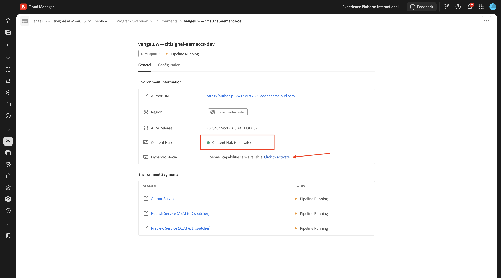
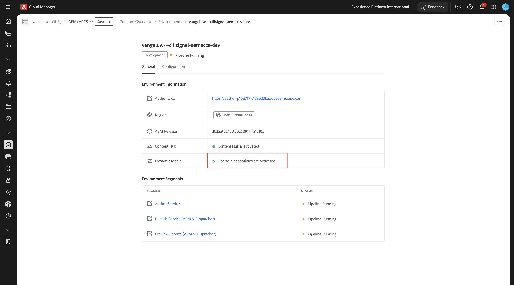

# 1.1.1 Cloud Manager プログラムを作成する

[https://my.cloudmanager.adobe.com](https://my.cloudmanager.adobe.com){target="_blank"} に移動します。 選択する組織は `--aepImsOrgName--` です。 次のようなメッセージが表示されます。 「**プログラムを追加**」をクリックします。

**プログラム名** には、`--aepUserLdap-- - CitiSignal AEM+ACCS` を使用します。 「**サンドボックスを設定**」オプションを選択します。 「**続行**」をクリックします。

次のオプションが選択されていることを確認します。

- サイト
- フォーム
- アセット

**Assets** の矢印をクリックして、オプションのリストを開きます。

次のオプションが選択されていることを確認します。

- Content Hub

リストを下にスクロールします。

次のオプションが選択されていることを確認します。

- Edge 配信サービス
- Dynamic Media

「**作成**」をクリックします。

環境の作成には時間がかかります（10 ～ 20 分）。

環境が作成され、使用する準備が整うと、確認のメールが届きます。その後、ここに戻ることができます。

メールによる確認を受け取ったら、[https://my.cloudmanager.adobe.com](https://my.cloudmanager.adobe.com){target="_blank"} に戻ります。 その後、プログラムのステータスが **準備完了** に変更されたことがわかります。 プログラムをクリックして開きます。

「パイプライン **タブを確認し** す。 3 つのドット **...** をクリックし、「**実行** をクリックします。

**実行** をクリックします。

次に、「**環境**」タブの 3 つのドット **...** をクリックし、「**詳細を表示**」をクリックします。

次の演習で必要とする **オーサー** 環境の URL など、環境の詳細が表示されます。

**Content Hub** の行を見て、「**クリックして有効化**」を選択します。

**アクティブ化** をクリックします。

**Content Hub** のライセンス認証が開始されました。 これには 10 分以上かかる場合があります。

約 10 分後に、**Content Hub** のライセンス認証が行われます。
次に、「**Dynamic Media**」行を見て、「**クリックして有効化**」を選択します。

**アクティブ化** をクリックします。

**Dynamic Media** のアクティベーションが開始されました。 これには 10 分以上かかる場合があります。

約 10 分後、**Dynamic Media** のアクティベーションが行われます。

パイプラインの実行が完了したら、次の演習に進むことができます。

次の手順：[AEM CS 環境のセットアップ &#x200B;](./ex2.md){target="_blank"}

[Adobe Experience Manager Cloud ServiceとEdge Delivery Services](./aemcs.md){target="_blank"} に戻る

[&#x200B; すべてのモジュールに戻る &#x200B;](./../../../overview.md){target="_blank"}
