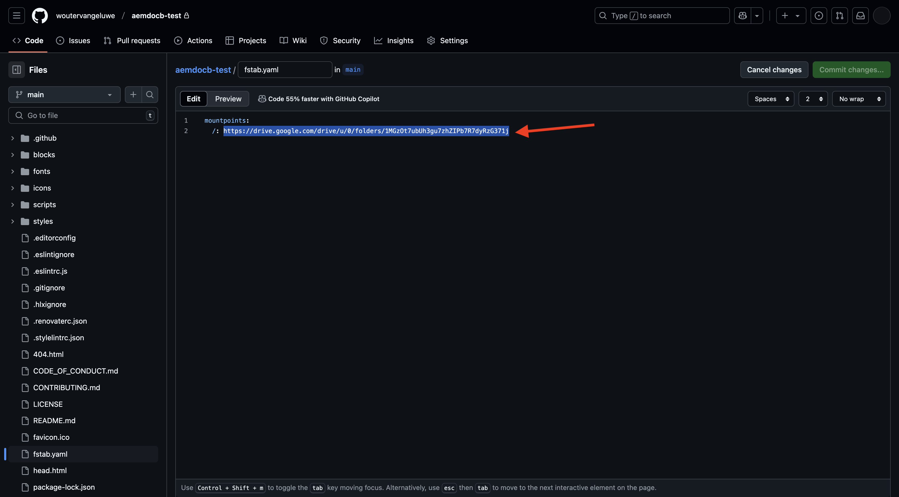
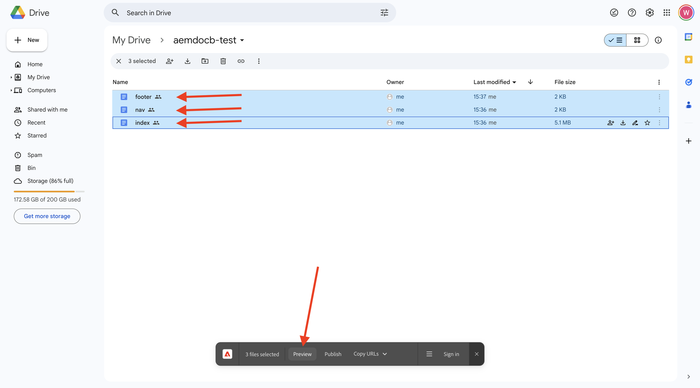
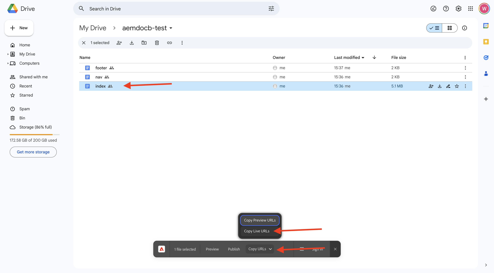

# 1.1.2 ドキュメントベースの web サイトの作成

Cloud Manager プログラムが作成されるのを待っている間、最初のドキュメントベースのオーサリング web サイトを設定するのに十分な時間があります。 以下の演習は、[aem.live 開発者向けチュートリアル ](https://www.aem.live/developer/tutorial){target="_blank"} に基づいています。 開始するには、次の手順に従います。

## 1.1.2.1 Google ドライブの設定

[https://drive.google.com](https://drive.google.com){target="_blank"} に移動します。 **+新規をクリックし** 次に **新規フォルダー** をクリックします。

{zoomable="yes"}

フォルダーに `aemdocb-test` という名前を付けます。 「**作成**」をクリックします。

{zoomable="yes"}

ファイル [aemboilerplate.zip](./../../../assets/aem/aemboilerplate.zip){target="_blank"} をダウンロードし、コンピューターに抽出します。

{zoomable="yes"}

そのフォルダーには 3 つのファイルが表示されます。 これらのファイルを新しいGoogle Drive フォルダーにコピーします。

{zoomable="yes"}

次に、これらのファイルをネイティブのGoogle ファイルに変換する必要があります。 これをおこなうには、各ファイルを開き、**ファイル**/**Google Docsとして保存** に移動します。

{zoomable="yes"}

3 つのファイルすべてに対してこの操作を行うと、Google Drive フォルダーに 6 つのファイルが表示されます。

{zoomable="yes"}

その後、これをフォルダーに入れます。

{zoomable="yes"}

ドキュメントベースのオーサリングのデモを機能させるには、Google Drive フォルダーをメールアドレス **helix@adobe.com** と共有する必要があります。 フォルダー名をクリックし、「**共有**」をクリックしてから、もう一度 **共有** をクリックします。

{zoomable="yes"}

メールアドレス **helix@adobe.com** を入力し、「**送信**」をクリックします。

{zoomable="yes"}

次に、Google Drive フォルダーの URL をコピーして、次の演習で必要になるので書き留めます。 フォルダー名をクリックし、「**共有**」をクリックして、「**リンクをコピー**」をクリックします。

{zoomable="yes"}

`https://drive.google.com/drive/folders/1PNIOFeptIfszSebawT-Y_bwB4_anQWk5?usp=drive_link`

URL が次のようになるように、クエリ文字列パラメーター `?usp=drive_link` を削除する必要があります。

`https://drive.google.com/drive/folders/1PNIOFeptIfszSebawT-Y_bwB4_anQWk5`

## 1.1.2.2 GitHub リポジトリのセットアップ

[https://github.com](https://github.com){target="_blank"} に移動します。 「**ログイン**」をクリックします。

{zoomable="yes"}

資格情報を入力します。 「**ログイン**」をクリックします。

{zoomable="yes"}

ログインすると、GitHub ダッシュボードが表示されます。

{zoomable="yes"}

[https://github.com/adobe/aem-boilerplate](https://github.com/adobe/aem-boilerplate){target="_blank"} に移動します。 その後、これが表示されます。 「**このテンプレートを使用**」をクリックし、「**新しいリポジトリを作成**」をクリックします。

{zoomable="yes"}

**リポジトリ名** には、`aemdocb-test` を使用します。 表示を **プライベート** に設定します。 **リポジトリを作成** をクリックします。

{zoomable="yes"}

数秒後に、リポジトリが作成されます。

{zoomable="yes"}

次に、[https://github.com/apps/aem-code-sync](https://github.com/apps/aem-code-sync){target="_blank"} に移動します。 **設定** をクリックします。

{zoomable="yes"}

GitHub アカウントをクリックします。

{zoomable="yes"}

**リポジトリのみを選択** をクリックし、作成したリポジトリを追加します。 次に、「**インストール**」をクリックします。

{zoomable="yes"}

この確認が表示されます。

{zoomable="yes"}

## 1.1.2.3 ファイル fstab.yaml の更新

GitHub リポジトリで、をクリックしてファイル `fstab.yaml` を開きます。

{zoomable="yes"}

**編集** アイコンをクリックします。

{zoomable="yes"}

ここで、2 行目のフィールド **url** の値を更新する必要があります。

{zoomable="yes"}

GitHub リポジトリの設定と組み合わせて、特定のAEM CS 環境の URL で現在の値を置き換える必要があります。

URL の現在の値：`https://drive.google.com/drive/u/0/folders/1MGzOt7ubUh3gu7zhZIPb7R7dyRzG371j`。

その値を、Google Drive フォルダーからコピーした URL （`https://drive.google.com/drive/folders/1PNIOFeptIfszSebawT-Y_bwB4_anQWk5`）に置き換えます。 「**変更をコミット…**」をクリックします。

{zoomable="yes"}

「**変更をコミット**」をクリックします。

{zoomable="yes"}

## 1.1.2.4 AEM Sidekick拡張機能のインストール

[https://chromewebstore.google.com/detail/aem-sidekick/ccfggkjabjahcjoljmgmklhpaccedipo](https://chromewebstore.google.com/detail/aem-sidekick/ccfggkjabjahcjoljmgmklhpaccedipo){target="_blank"} に移動します。 **Chromeに追加** をクリックします。

{zoomable="yes"}

**AEM Sidekick** 拡張機能をピン留めします。

{zoomable="yes"}

## 1.1.2.5 ドキュメントベースの web サイトのプレビューと公開

Googleのドライブに戻ります。 タスクバーで、**AEM Sidekick** 拡張機能をクリックします。 フォルダーにAEM Sidekick バーのポップアップが表示されます。

{zoomable="yes"}

Google Drive フォルダー内の 3 つのファイルを選択します。 「**プレビュー**」をクリックします。

{zoomable="yes"}

もう一度 **プレビュー** をクリックします。

{zoomable="yes"}

クリックして、緑色のダイアログポップアップを閉じます。

{zoomable="yes"}

Google Drive フォルダー内の 3 つのファイルを再度選択します。 ここで、「**公開**」をクリックします。

{zoomable="yes"}

「**公開**」をクリックします。

{zoomable="yes"}

をクリックして、緑色のダイアログをもう一度閉じます。 ファイル **インデックス** を選択し、「**URL をコピー**」をクリックしてから、「**ライブ URL をコピー**」をクリックします。

{zoomable="yes"}

コピーされた URL は、`https://main--aemdocb-test--woutervangeluwe.aem.live/` のようになります。

上記の URL で：

- **main** は、GitHub リポジトリ上のブランチを参照します
- **aemdocb-test** は GitHub リポジトリ名を指します
- **woutervangeluwe** は、GitHub ユーザーアカウント名を指します
- **.live** は、AEM インスタンスのライブ環境を指します
- **.live を**.page **に置き換えて** AEM インスタンスのプレビュー環境を開くことができます

新規ブラウザーウィンドウを開き、URL に移動します。

{zoomable="yes"}

## 1.1.2.6 変更を加えて公開

Google ドライブに戻り、Googleでファイラー **インデックス** を開きます。

{zoomable="yes"}

テキスト **テスト** を他の任意のテキストに置き換えます。 「**プレビュー**」をクリックします。

{zoomable="yes"}

Web サイトのプレビューバージョンが開きます。 変更を確認し、「**公開**」をクリックします。

{zoomable="yes"}

その後、web サイトのライブバージョンが表示されます。

{zoomable="yes"}

上記の演習は、基本を学び、自分でドキュメントベースのオーサリングを体験するための良い方法でした。 次の演習では、CitiSignal をデモブランドとして使用して独自のデモ Web サイトを設定します。

次の手順：[1.1.3 AEM CS 環境をセットアップする ](./ex3.md){target="_blank"}

[Adobe Experience Manager Cloud ServiceとEdge Delivery Services](./aemcs.md){target="_blank"} に戻る

[ すべてのモジュールに戻る ](./../../../overview.md){target="_blank"}
