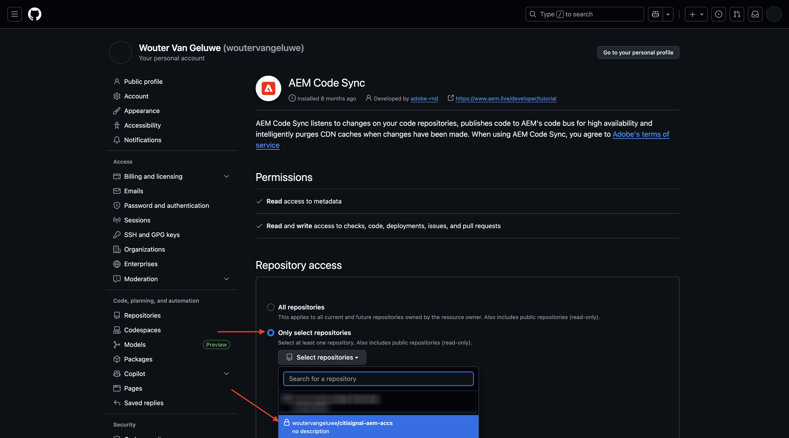
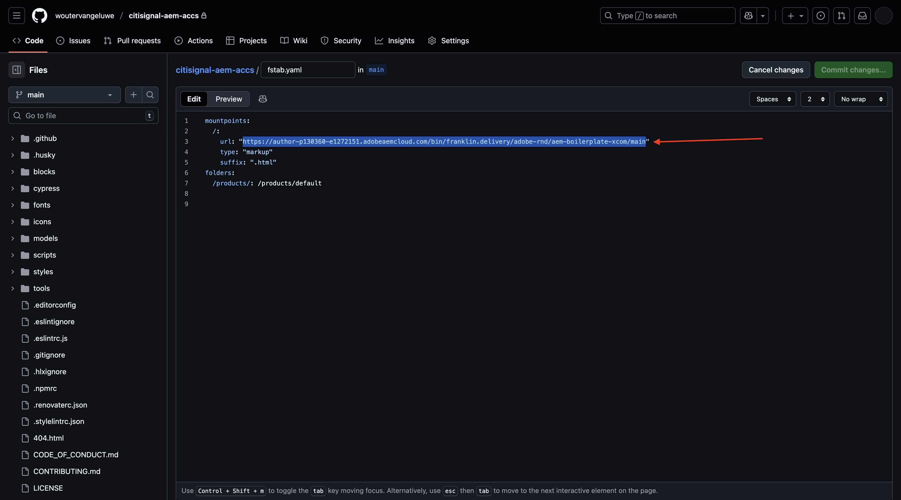
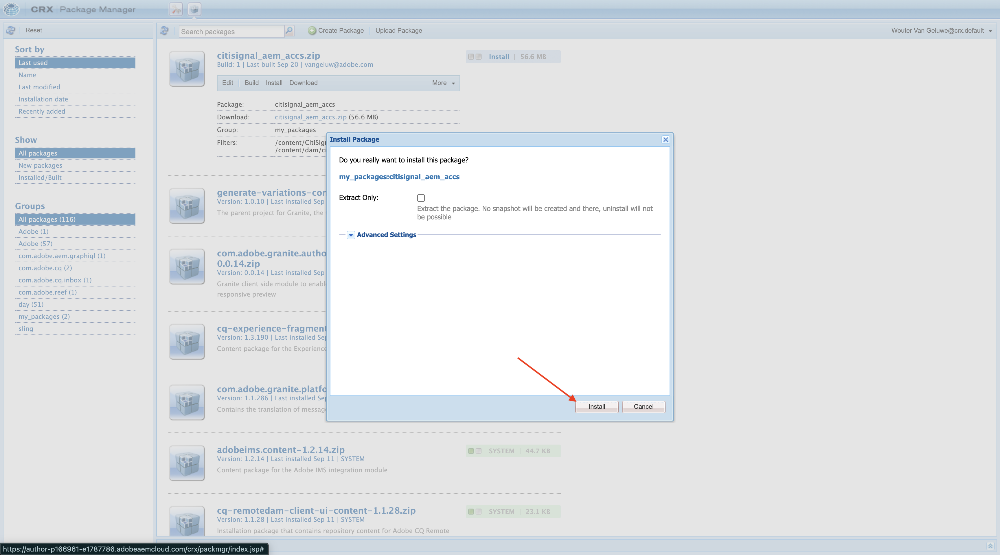
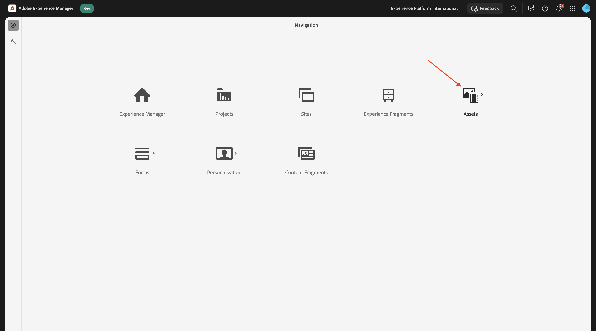
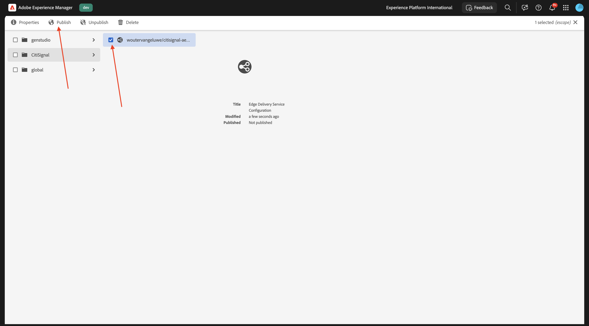
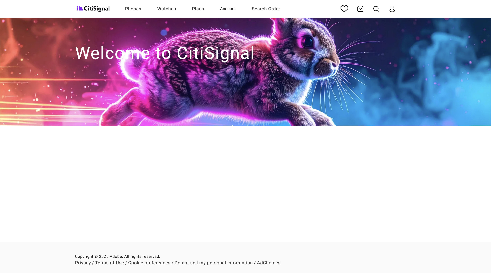

# 1.1.2 AEM CS 環境のセットアップ

## 1.1.2.1 GitHub リポジトリの設定

[https://github.com](https://github.com){target="_blank"} に移動します。 「**ログイン**」をクリックします。

資格情報を入力します。 「**ログイン**」をクリックします。

ログインすると、GitHub ダッシュボードが表示されます。

[https://github.com/adobe-rnd/aem-boilerplate-xcom](https://github.com/adobe-rnd/aem-boilerplate-xcom){target="_blank"} に移動します。 その後、これが表示されます。 「**このテンプレートを使用**」をクリックし、「**新しいリポジトリを作成**」をクリックします。

**リポジトリ名** には、`citisignal-aem-accs` を使用します。 表示を **プライベート** に設定します。 **リポジトリを作成** をクリックします。

数秒後に、リポジトリが作成されます。

次に、[https://github.com/apps/aem-code-sync](https://github.com/apps/aem-code-sync){target="_blank"} に移動します。 **インストール** または **設定** をクリックします。

GitHub ユーザーアカウントの横にある **続行** ボタンをクリックします。

GitHub ユーザーアカウントの横にある **設定** をクリックします。

**リポジトリのみを選択** をクリックし、作成したリポジトリを追加します。

下にスクロールして、「**保存**」をクリックします。

この確認が表示されます。

## 1.1.2.2 更新ファイル fstab.yaml

GitHub リポジトリで、をクリックしてファイル `fstab.yaml` を開きます。

**編集** アイコンをクリックします。

ここで、3 行目のフィールド **url** の値を更新する必要があります。

GitHub リポジトリの設定と組み合わせて、特定のAEM Sites CS 環境の URL で現在の値を置き換える必要があります。

URL の現在の値：`https://author-p130360-e1272151.adobeaemcloud.com/bin/franklin.delivery/adobe-rnd/aem-boilerplate-xcom/main`。

URL には、更新が必要な 3 つの部分があります

`https://XXX/bin/franklin.delivery/YYY/ZZZ/main`

XXX は、AEM CS オーサー環境の URL に置き換える必要があります。

YYY は GitHub ユーザーアカウントに置き換える必要があります。

ZZZ は、前の演習で使用した GitHub リポジトリの名前に置き換える必要があります。

AEM CS オーサー環境の URL は、[https://my.cloudmanager.adobe.com](https://my.cloudmanager.adobe.com){target="_blank"} で確認できます。 **プログラム** をクリックして開きます。

次に、「**環境**」タブの 3 つのドット **...** をクリックし、「**詳細を表示**」をクリックします。

**オーサー** 環境の URL など、環境の詳細が表示されます。 URL をコピーします。

XXX = `author-p166717-e1786231.adobeaemcloud.com`

GitHub ユーザーアカウント名の場合は、ブラウザーの URL で簡単に見つけることができます。 この例では、ユーザーアカウント名は `woutervangeluwe` です。

YYY = `woutervangeluwe`

GitHub リポジトリ名については、GitHub で開いたブラウザーウィンドウでも見つけることができます。 この場合、リポジトリ名は `citisignal` です。

ZZZ = `citisignal-aem-accs`

これらの 3 つの値を組み合わせると、この新しい URL が表示されます。この URL はファイル `fstab.yaml` で設定する必要があります。

`https://author-p166717-e1786231.adobeaemcloud.com/bin/franklin.delivery/woutervangeluwe/citisignal-aem-accs/main`

「**変更をコミット…**」をクリックします。

「**変更をコミット**」をクリックします。

ファイル `fstab.yaml` が更新されました。

## 1.1.2.3 CitiSignal アセットのアップロード

[https://my.cloudmanager.adobe.com](https://my.cloudmanager.adobe.com){target="_blank"} に移動します。 **プログラム** をクリックして開きます。

次に、オーサー環境の URL をクリックします。

**Adobeでログイン** をクリックします。

その後、オーサー環境が表示されます。

URL は次のようになります：`https://author-p166717-e1786231.adobeaemcloud.com/ui#/aem/aem/start.html?appId=aemshell`

次に、AEMの **CRX パッケージマネージャー** 環境にアクセスする必要があります。 それには、URL から `ui#/aem/aem/start.html?appId=aemshell` を削除し、`crx/packmgr` に置き換えます。つまり、URL は次のようになります。
`https://author-p166717-e1786231.adobeaemcloud.com/crx/packmgr`。
**Enter** キーを押して、パッケージマネージャー環境を読み込みます

次に、「**パッケージをアップロード**」をクリックします。

**参照** をクリックして、アップロードするパッケージを探します。

アップロードするパッケージは **citisignal-assets.zip** と呼ばれ、次の場所でダウンロードできます。[https://tech-insiders.s3.us-west-2.amazonaws.com/one-adobe/citisignal-assets.zip](https://tech-insiders.s3.us-west-2.amazonaws.com/one-adobe/citisignal-assets.zip){target="_blank"}

パッケージを選択して **開く** をクリックします。

次に、「**OK**」をクリックします。

その後、パッケージがアップロードされます。

次に、アップロードしたパッケージの **インストール** をクリックします。

**インストール** をクリックします。

数分後、パッケージがインストールされます。

これで、このウィンドウを閉じることができます。

## CitiSignal アセッ 1.1.2.4 の公開

[https://my.cloudmanager.adobe.com](https://my.cloudmanager.adobe.com){target="_blank"} に移動します。 **プログラム** をクリックして開きます。

次に、オーサー環境の URL をクリックします。

**Adobeでログイン** をクリックします。

その後、オーサー環境が表示されます。 **Assets** をクリックします。

**ファイル** をクリックします。

フォルダ **CitiSignal** をクリックして選択し、[ 公開の管理 ]**をクリック** ます。

「**次へ**」をクリックします。

「**公開**」をクリックします。

アセットが公開されました。

## 1.1.2.5 Create CitiSignal web サイト

[https://my.cloudmanager.adobe.com](https://my.cloudmanager.adobe.com){target="_blank"} に移動します。 **プログラム** をクリックして開きます。

次に、オーサー環境の URL をクリックします。

**Adobeでログイン** をクリックします。

その後、オーサー環境が表示されます。 **サイト** をクリックします。

**作成** をクリックし、**テンプレートからのサイト** をクリックします。

**インポート** をクリックします。

次に、事前設定済みのテンプレートをサイトに読み込む必要があります。 テンプレートは [ こちら ](./../../../assets/aem/citisignal-aem-sites-commerce-with-edge-delivery-services-template-0.4.0.zip){target="_blank"} からダウンロードできます。 ファイルをデスクトップに保存します。

次に、ファイル `citisignal-aem-sites-commerce-with-edge-delivery-services-template-0.4.0.zip` を選択し、「**開く** をクリックします。

その後、これが表示されます。 アップロードしたテンプレートをクリックして選択し、「**次へ**」をクリックします。

ここで、いくつかの詳細を入力する必要があります。

- サイトのタイトル：**CitiSignal** を使用
- サイト名：**CitiSignal** を使用
- GitHub URL：以前に使用していた GitHub リポジトリの URL をコピーします

これで完了です。 「**作成**」をクリックします。

現在、サイトを作成しています。 これには数分かかることがあります。 「**OK**」をクリックします。

数分後に画面を更新すると、新しく作成した CitiSignal Web サイトが表示されます。

## 1.1.2.6 ファイル paths.json の更新

GitHub リポジトリで、をクリックしてファイル `paths.json` を開きます。

**編集** アイコンをクリックします。

次に、3、4、5、6、7、10 行目の `aem-boilerplate-commerce` で、置き換えテキスト `CitiSignal` を更新する必要があります。

「**変更をコミット**」をクリックします。

「**変更をコミット**」をクリックします。

ファイル `paths.json` が更新されました。

## 1.1.2.7 CitiSignal web サイトの公開

次に、**CitiSignal** の前にあるチェックボックスをクリックします。 次に、「**公開を管理**」をクリックします。

「**次へ**」をクリックします。

**子を含める設定** をクリックします。

チェックボックス **子を含める** をクリックして選択し、他のチェックボックスをクリックして選択解除します。 「**OK**」をクリックします。

「**公開**」をクリックします。

その後、あなたはここに送り返されます。 **CitiSignal** をクリックし、**index** の前にあるチェックボックスを選択して、**編集** をクリックします。

Web サイトは **ユニバーサルエディター** で開きます。

XXX を GitHub ユーザーアカウント（この例では `main--citisignal-aem-accs--XXX.aem.page`）に置き換えた後、`main--citisignal-aem-accs--XXX.aem.live` や `woutervangeluwe` に移動して、web サイトにアクセスできるようになりました。

この例では、完全な URL は次のようになります。
`https://main--citisignal-aem-accs--woutervangeluwe.aem.page` や `https://main--citisignal-aem-accs--woutervangeluwe.aem.live`。

最初に公開する必要があるので、すべてのアセットが正しく表示されるまでには時間がかかる場合があります。

次の画面が表示されます。

## 1.1.2.8 テストページのパフォーマンス

[https://pagespeed.web.dev/](https://pagespeed.web.dev/){target="_blank"} に移動します。 URL を入力し、「**分析**」をクリックします。

次に、モバイルとデスクトップの両方のビジュアライゼーションで、web サイトのスコアが高くなることがわかります。

**モバイル**:

**デスクトップ**:

次の手順：[ カスタムブロックの開発 ](./ex4.md){target="_blank"}

[Adobe Experience Manager Cloud ServiceとEdge Delivery Services](./aemcs.md){target="_blank"} に戻る

[ すべてのモジュールに戻る ](./../../../overview.md){target="_blank"}
