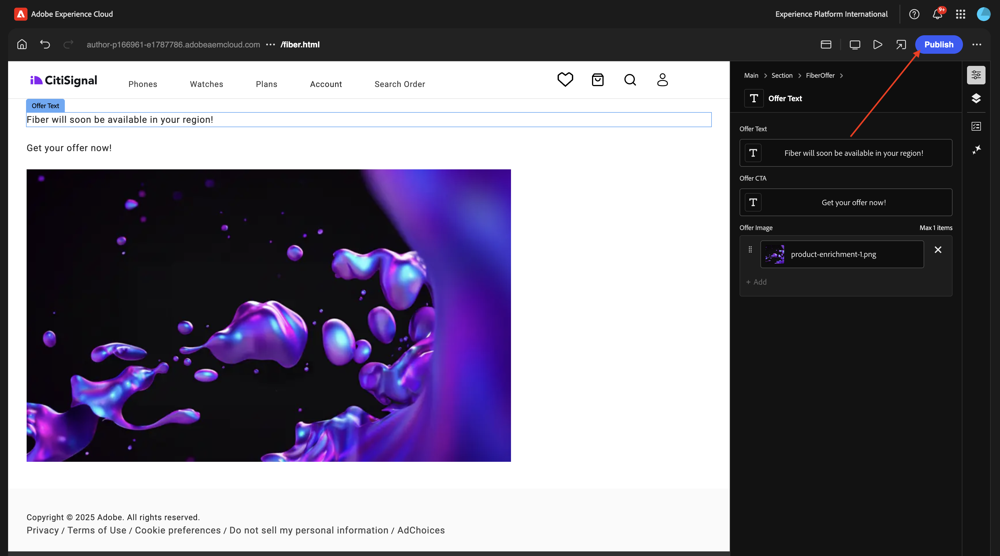
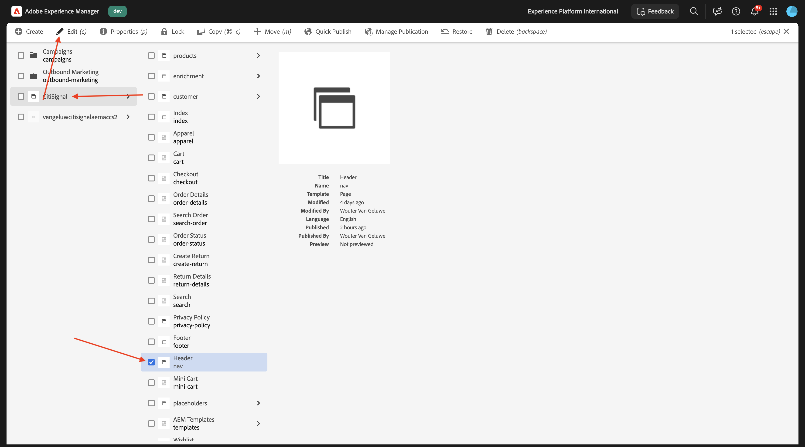
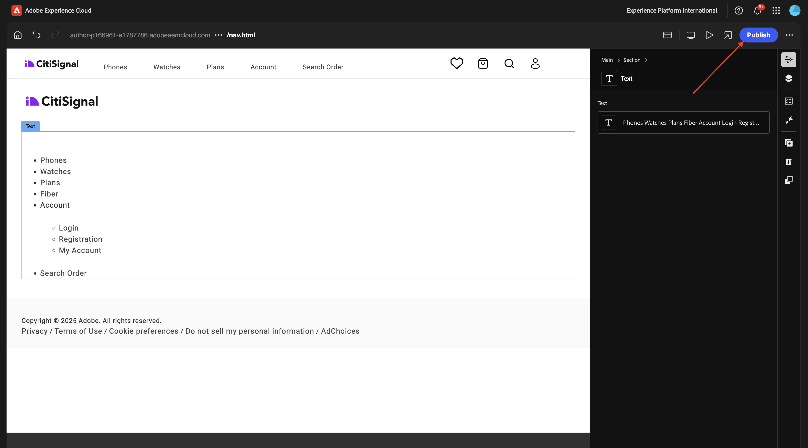
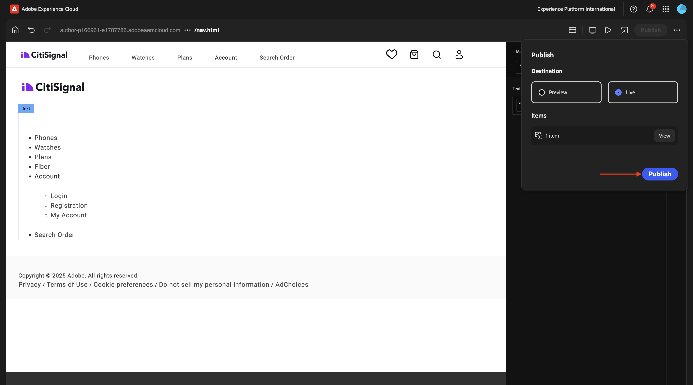

# 1.1.3 基本的なカスタムブロックの作成

## 1.1.3.1ローカル開発環境のセットアップ

[https://desktop.github.com/download/](https://desktop.github.com/download/){target="_blank"} に移動し、**Github デスクトップ** をダウンロードしてインストールします。


Github デスクトップがインストールされたら、前の演習で作成した GitHub リポジトリに移動します。 「**&lt;> コード」をクリックしてから** 「**GitHub デスクトップで開く**」をクリックします。


GitHub リポジトリは、GitHub デスクトップで開かれます。 **ローカルパス** を自由に変更できます。 **クローン** をクリックします。


これで、ローカルフォルダーが作成されます。


Visual Studio Code を開きます。 **File**/**Open Folder** に移動します。


GitHub の設定で使用されるフォルダーを選択します **citisignal-aem-accs**。


Visual Studio Code でそのフォルダーが開いていることが確認できます。新しいブロックを作成する準備が整いました。


## 1.1.3.2 基本カスタムブロックの作成

Adobeでは、次の 3 つの段階アプローチでブロックを開発することをお勧めします。

- ブロックの定義とモデルを作成し、レビューして、実稼動環境に取り込みます。
- 新しいブロックでコンテンツを作成します。
- 新しいブロックの装飾とスタイルを実装します。

### component-definition.json

Visual Studio Code で、ファイル **component-definition.json** を開きます。


**ブロック** が表示されるまで下にスクロールします。 カーソルをコンポーネントの閉じブラケットの下に置きます **カード**


このコードを貼り付け、コードのブロックの後にコンマ **,** を入力します。

```json
{
  "title": "FiberOffer",
  "id": "fiberoffer",
  "plugins": {
    "xwalk": {
      "page": {
        "resourceType": "core/franklin/components/block/v1/block",
        "template": {
          "name": "FiberOffer",
          "model": "fiberoffer",
          "offerText": "<p>Fiber will soon be available in your region!</p>",
          "offerCallToAction": "Get your offer now!",
          "offerImage": ""
        }
      }
    }
  }
}
```

変更を保存します。


### component-models.json

Visual Studio Code で、ファイル **component-models.json** を開きます。


最後の項目が表示されるまで下にスクロールします。 最後のコンポーネントの閉じブラケットの隣にカーソルを置きます。


コンマ **,** を入力し、enter キーを押して、次の行に次のコードをペーストします。

```json
{
  "id": "fiberoffer",
  "fields": [
     {
       "component": "richtext",
       "name": "offerText",
       "value": "",
       "label": "Offer Text",
       "valueType": "string"
     },
     {
       "component": "richtext",
       "valueType": "string",
       "name": "offerCallToAction",
       "label": "Offer CTA",
       "value": ""
     },
     {
       "component": "reference",
       "valueType": "string",
       "name": "offerImage",
       "label": "Offer Image",
        "multi": false
     }
   ]
}
```

変更を保存します。


### component-filters.json

Visual Studio Code で、ファイル **component-filters.json** を開きます。


**セクション** の下で、コンマ `,` を入力し、現在の最後の行の後にコンポーネント `"fiberoffer"` の ID を貼り付けます。

変更を保存します。


## 1.1.3.3 変更をコミットします

これで、プロジェクトで、GitHub リポジトリにコミットして戻す必要のある変更をいくつか加えました。 それには、**GitHub デスクトップ** を開きます。

編集した 3 つのファイルが「変更 **の下に表示され** す。 変更をレビューします。


PR、`Fiber Offer custom block` の名前を入力します。 「**メインにコミット**」をクリックします。


この画像が表示されます。 **接触チャネルをプッシュ** をクリックします。


数秒後に、変更が GitHub リポジトリにプッシュされます。


ブラウザーで、GitHub アカウントと、CitiSignal 用に作成したリポジトリに移動します。 変更を受け取ったことを示す、次のようなメッセージが表示されます。


## 1.1.3.4 ページにブロックを追加

基本的な引用ブロックが定義され、CitiSignal プロジェクトにコミットされたので、既存のページに **fiberoffer** ブロックを追加できます。

[https://my.cloudmanager.adobe.com](https://my.cloudmanager.adobe.com){target="_blank"} に移動します。 **プログラム** をクリックして開きます。


次に、「**環境**」タブの 3 つのドット **...** をクリックし、「**詳細を表示**」をクリックします。


その後、環境の詳細が表示されます。 **オーサー** 環境の URL をクリックします。

>[!NOTE]
>
>環境が休止状態になっている可能性があります。 その場合は、まず環境の休止状態を解除する必要があります。


AEM オーサー環境が表示されます。 **サイト** に移動します。


**CitiSignal** に移動します。 **作成** をクリックし、「**ページ**」を選択します。


**ページ** を選択し、「**次へ**」をクリックします。


次の値を入力します。

- タイトル：**Fiber**
- 名前：**fiber**
- ページタイトル：**ファイバ**

「**作成**」をクリックします。


**開く** を選択します。


この画像が表示されます。


空白領域をクリックして、「**セクション**」コンポーネントを選択します。 次に、右側のメニューのプラス **+** アイコンをクリックします。


カスタムブロックが、使用可能なブロックのリストに表示されます。 クリックして選択します。


**オファーテキスト**、**オファーCTA**、**オファー画像** などのフィールドがエディターに追加されます。 **オファー画像** フィールドの「**+追加** をクリックして、画像を選択します。


この画像が表示されます。 クリックしてフォルダー **citisignal** を開きます。


画像 **product-enrichment-1.png** を選択します。 「**選択**」をクリックします。


これで完了です。 「**公開**」をクリックします。



もう一度 **公開** をクリックします。


これで、新しいページが公開されました。

## 1.1.3.5 ナビゲーション メニューに新しいページを追加する

AEM Sitesの概要で **CitiSignal** に移動し、「Header/nav **ファイルのチェックボックスをオンに** ます。 「**編集**」をクリックします。



プレビュー画面で **テキスト** フィールドを選択し、画面の右側にある **テキスト** フィールドをクリックして編集します。


テキスト `Fiber` を使用して、ナビゲーションメニューにメニューオプションを追加します。 テキスト **Fibre** を選択し、「**リンク**」アイコンをクリックします。


**URL** `/content/CitiSignal/fiber.html` に対してこれを入力し、**V** アイコンをクリックして確認します。


これで完了です。 「**完了**」をクリックします。


これで完了です。 「**公開**」をクリックします。



もう一度 **公開** をクリックします。



XXX を GitHub ユーザーアカウント（この例では `main--citisignal--XXX.aem.page/us/en/`）に置き換えた後、`main--citisignal--XXX.aem.live/us/en/` や `woutervangeluwe` に移動して、web サイトの変更を表示できるようになりました。

この例では、完全な URL は次のようになります。
`https://main--citisignal--woutervangeluwe.aem.page/us/en/` や `https://main--citisignal--woutervangeluwe.aem.live/us/en/`。

この画像が表示されます。 **ファイバ** をクリックします。


これが基本的なカスタムブロックですが、web サイトにレンダリングされています。


次の手順：[&#x200B; 詳細カスタムブロック &#x200B;](./ex4.md){target="_blank"}

[Adobe Experience Manager Cloud ServiceとEdge Delivery Services](./aemcs.md){target="_blank"} に戻る

[&#x200B; すべてのモジュールに戻る &#x200B;](./../../../overview.md){target="_blank"}
