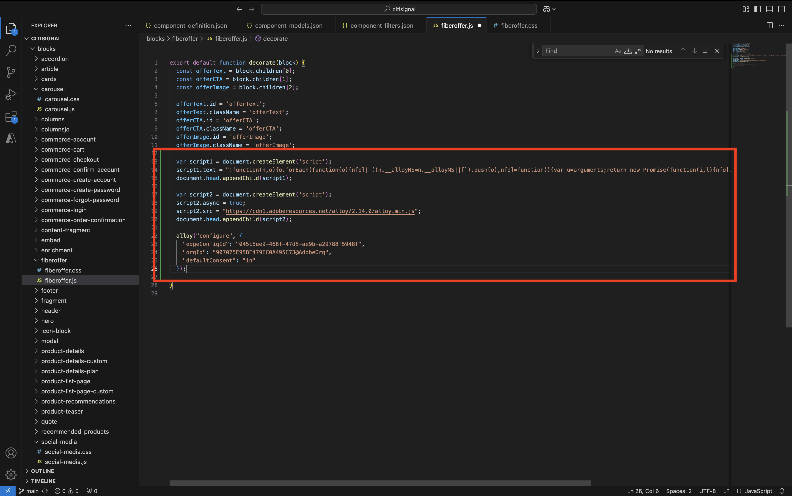

# 1.1.4 高度なカスタムブロック

前の演習では、**オファーテキスト**、**オファーCTA**、**オファー画像** などのフィールドを表示する **ファイバーオファー** という基本的なカスタムブロックを Web サイトに設定しました。

これで、このブロックで作業を続行できます。

{zoomable="yes"}

## 1.1.4.1 ブロックのスタイル設定

作業する **fiberoffer** ブロックができたので、スタイルを適用できます。

Visual Studio Code に戻り、フォルダー **blocks** を開きます。 これで、それぞれが特定のブロックを参照する複数のフォルダーが表示されます。 **fiberoffer** ブロックをより高度なものにするには、カスタムブロックのフォルダーを作成する必要があります。

{zoomable="yes"}

フォルダー **ブロック** を選択し、「**新規フォルダーを作成**」アイコンをクリックします。

{zoomable="yes"}

フォルダーに `fiberoffer` という名前を付け、**enter** キーを押します。

{zoomable="yes"}

新しい **fiberoffer** フォルダーを選択し、「**新しいファイルを作成**」アイコンをクリックします。

{zoomable="yes"}

これで、新しいファイルが作成されました。 名前 **fiberoffer.js** を入力して、Enter キーを押します。

{zoomable="yes"}

次のJavaScriptをファイル **fiberoffer.js** に追加することで、ブロックデコレーションを実装できるようになりました。

ファイルを保存します。

```js
export default function decorate(block) {
  const offerText = block.children[0];
  const offerCTA = block.children[1];
  const offerImage = block.children[2];

  offerText.id = 'offerText';
  offerText.className = 'offerText';
  offerCTA.id = 'offerCTA';
  offerCTA.className = 'offerCTA';
  offerImage.id = 'offerImage';
  offerImage.className = 'offerImage';
}
```

{zoomable="yes"}

新しい **fiberoffer** フォルダーを選択し、「**新しいファイルを作成**」アイコンを再度クリックします。

{zoomable="yes"}

これで、新しいファイルが作成されました。 名前 **fiberoffer.css** を入力して、Enter キーを押します。

{zoomable="yes"}

次の CSS コードをコピーして、新しく作成したファイルに貼り付けます。

```js
.offerText, .offerCTA, .offerImage{
    color: #14161A;
    font-size: 30px;
    padding: 0 0 24px;
    display: flex;
    flex-direction: column;
    margin: 1rem 0;
    text-align: center;
}
```

変更を保存します。

{zoomable="yes"}

これで、プロジェクトで、GitHub リポジトリにコミットして戻す必要のある変更をいくつか加えました。 それには、**GitHub デスクトップ** を開きます。

編集した 2 つのファイルが「変更 **の下に表示され** す。 変更をレビューします。

PR、`js css` の名前を入力します。 「**メインにコミット**」をクリックします。

{zoomable="yes"}

この画像が表示されます。 **接触チャネルをプッシュ** をクリックします。

{zoomable="yes"}

ブラウザーで、GitHub アカウントと、CitiSignal 用に作成したリポジトリに移動します。 変更を受け取ったことを示す、次のようなメッセージが表示されます。

{zoomable="yes"}

XXX を GitHub ユーザーアカウント（この例では `main--citisignal--XXX.aem.page/us/en/`）に置き換えた後、`main--citisignal--XXX.aem.live/us/en/` や `woutervangeluwe` に移動して、web サイトの変更を表示できるようになりました。

この例では、完全な URL は次のようになります。
`https://main--citisignal--woutervangeluwe.aem.page/us/en/` や `https://main--citisignal--woutervangeluwe.aem.live/us/en/`。

ページにスタイルが適用されたことがわかります。

{zoomable="yes"}

## 1.1.4.2 外部エンドポイントからのロジックの追加とデータの読み込み

この演習では、Adobeの web SDKの「生」設定を行い、Adobe Journey Optimizer Offer Decisioningから次善のオファーをリクエストします。

ただし、これはAEM as a Cloud Serviceの web SDKのベストプラクティス実装を意図したものではありません。 次の演習では、このために開発された特定のプラグインを使用してデータ収集を実装します。

この演習の目的は、外部 JS ライブラリの読み込み、**alloy.js** ライブラリの使用、リクエストの送信など、JavaScriptの基本的な操作をいくつか示すことです。

ライブラリ **alloy.js** は、web SDKに接続するライブラリで、web サイトからAdobeのEdge Network、およびそこからAdobe Experience Platform、Adobe Analytics、Adobe Targetなどのアプリケーションにリクエストを送信できます。

ブロックのスタイル設定用に追加した前のコードの下に、次のコードを追加します。

```javascript
var script1 = document.createElement('script');
  script1.text = "!function(n,o){o.forEach(function(o){n[o]||((n.__alloyNS=n.__alloyNS||[]).push(o),n[o]=function(){var u=arguments;return new Promise(function(i,l){n[o].q.push([i,l,u])})},n[o].q=[])})}(window,['alloy']);"
  document.head.appendChild(script1);

  var script2 = document.createElement('script');
  script2.async = true;
  script2.src = "https://cdn1.adoberesources.net/alloy/2.14.0/alloy.min.js";
  document.head.appendChild(script2);

  alloy("configure", {
    "edgeConfigId": "045c5ee9-468f-47d5-ae9b-a29788f5948f",
    "orgId": "907075E95BF479EC0A495C73@AdobeOrg",
    "defaultConsent": "in"
  });
```

これで完了です。

最初に追加したスクリプトタグ（script1）は、Web SDKで使用される関数で、**alloy** という名前のウィンドウオブジェクトを作成します。

2 つ目のスクリプトタグ（script2）は、Adobeの CDN から alloy.js ライブラリを非同期で読み込みます。

コードの 3 番目のブロックは、基本的に、特定のAdobe IMS組織およびデータストリームにデータを送信するように alloy オブジェクトを設定します。

**はじめに** モジュールでは、`--aepUserLdap-- - One Adobe Datastream` というデータストリームが既に設定されています。 上記コードのフィールド **edgeConfigId** は、設定されたデータストリームの ID を参照します。

現時点では、「**edgeConfigId** フィールドを変更する必要はありません。 次の演習では、**MarTech** プラグインを使用してこれを行うことができます。

{zoomable="yes"}

これで、このが得られます。

{zoomable="yes"}

次に、このブロックを、追加した前のコードの下に追加します。

```javascript
var ECID = "";

  alloy("getIdentity")
    .then(function (result) {
      // The command succeeded.
      console.log("ECID:", result.identity.ECID);
      ECID = result.identity.ECID;
      getOffer(ECID);

    })
    .catch(function (error) {
      // The command failed.
      // "error" will be an error object with additional information.
    });
```

このコードブロックは、Experience Cloud ID （ECID）の値を取得するために使用されます。 ECID は、ブラウザーの一意のデバイス ID です。

上記のコードでわかるように、ECID が取得されると、別の関数が呼び出されます。 この関数は **getOffer （）と呼ばれ** 次に追加します。

{zoomable="yes"}

次に、の下に以下のコードを追加します。

```javascript
async function getOffer(ECID) {
  var url = "https://edge.adobedc.net/ee/irl1/v1/interact?configId=045c5ee9-468f-47d5-ae9b-a29788f5948f";

  var timestamp = new Date().toISOString();

  var offerRequest = {
    "events": [
      {
        "xdm": {
          "eventType": "decisioning.propositionDisplay",
          "timestamp": timestamp,
          "_experienceplatform": {
            "identification": {
              "core": {
                "ecid": ECID
              }
            }
          },
          "identityMap": {
            "ECID": [
              {
                "id": ECID
              }
            ]
          }
        },
        "query": {
          "personalization": {
            "schemas": [
              "https://ns.adobe.com/personalization/default-content-item",
              "https://ns.adobe.com/personalization/html-content-item",
              "https://ns.adobe.com/personalization/json-content-item",
              "https://ns.adobe.com/personalization/redirect-item",
              "https://ns.adobe.com/personalization/ruleset-item",
              "https://ns.adobe.com/personalization/message/in-app",
              "https://ns.adobe.com/personalization/message/content-card",
              "https://ns.adobe.com/personalization/dom-action"
            ],
            "decisionScopes": [
              "eyJ4ZG06YWN0aXZpdHlJZCI6ImRwczpvZmZlci1hY3Rpdml0eToxYTI3ODk3NzAzYTY5NWZmIiwieGRtOnBsYWNlbWVudElkIjoiZHBzOm9mZmVyLXBsYWNlbWVudDoxYTI0ZGM2MWJmYjJlMjIwIn0=",
              "eyJ4ZG06YWN0aXZpdHlJZCI6ImRwczpvZmZlci1hY3Rpdml0eToxYTI3ODk3NzAzYTY5NWZmIiwieGRtOnBsYWNlbWVudElkIjoiZHBzOm9mZmVyLXBsYWNlbWVudDoxYTI0ZGM0MzQyZjJlMjFlIn0="
            ]
          }
        }
      }
    ]
  }

  try {
    const response = await fetch(url, {
      method: "POST",
      headers: {
        "Content-Type": "application/json"
      },
      body: JSON.stringify(offerRequest),
    });

    if (response.status === 200) {
      var body = await response.json();
      console.log("Offer Decisioning Response: ", body);

      const decisions = body["handle"];

      decisions.forEach(decision => {
        if (decision["type"] == "personalization:decisions") {
          console.log("Offer Decisioning decision detail: ", decision);
          const payloads = decision["payload"];

          if (payloads === undefined || payloads.length == 0) {
            //do nothing
          } else {
            payloads.forEach(payload => {
              if (payload["placement"]["name"] == "Web - Image") {
                console.log("Web-Image payload");
                const items = payload["items"];
                items.forEach(item => {
                  if (item["id"].includes("dps:fallback-offer")) {
                    console.log("Item details: ", item);
                    const deliveryURL = item["data"]["deliveryURL"];

                    document.querySelector("#offerImage").innerHTML = "";
                  } else if (item["id"].includes("dps:personalized-offer")) {
                    console.log("Item details: ", item);
                    const deliveryURL = item["data"]["deliveryURL"];
                    console.log("Web-Image Personalized Offer Content: ", deliveryURL)

                    document.querySelector("#offerImage").innerHTML = "";
                  }
                });
              } else if (payload["placement"]["name"] == "Web - JSON") {
                console.log("Web-JSON payload");
                const items = payload["items"];
                items.forEach(item => {
                  if (item["id"].includes("dps:fallback-offer")) {
                    const content = JSON.parse(item["data"]["content"]);

                    console.log("Web-JSON Fallback Content: ", content)

                    document.querySelector("#offerText").innerHTML = content.text;
                    document.querySelector("#offerCTA").innerHTML = content.cta;
                  } else if (item["id"].includes("dps:personalized-offer")) {
                    const content = JSON.parse(item["data"]["content"]);

                    console.log("Web-JSON Personalized Offer Content: " + content);

                    document.querySelector("#offerText").innerHTML = content.text;
                    document.querySelector("#offerCTA").innerHTML = content.cta;
                  }
                });
              }
            });
          }
          document.querySelector("#offerImage").style.display = "block";
          document.querySelector("#offerText").style.display = "block";
          document.querySelector("#offerCTA").style.display = "block";
        }
      });
    } else {
      console.warn("Offer Decisioning Response unsuccessful:", response.body);
    }
  } catch (error) {
    console.error("Error when getting Offer Decisioning Response:", error);
  }
}
```

このコードブロックは、この例の 42 行目に表示される閉じブラケットの下に貼り付けることが非常に重要です。 先ほど貼り付けたコードは、このファイル内に独自の場所を必要とする別の関数であり、上記の **デフォルトの関数** 内にネストすることはできません。

{zoomable="yes"}

先ほど貼り付けたコードブロックは、通常 Web SDK/alloy.jsがおこなうリクエストをシミュレートします。 この例では、**fetch** リクエストが **edge.adobedc.net** に対して行われます。

リクエストでは、2 つの **決定範囲** が指定され、この ECID で確認する必要があるオファーに関する判断をAdobe Journey Optimizer Offer Decisioningに求めます。

応答を受け取ると、このコードは応答を解析し、表示する必要がある画像の URL や、オファーテキストやオファーCTAなどを含んだ JSON 応答をフィルターで除外し、その後、これらを Web サイトに表示します。

このアプローチは、イネーブルメント目的でのみ使用され、データ収集を実装するベストプラクティス方法ではありません。

変更を保存します。次に、**Github デスクトップ** を開き、PR に名前を付けて、「**メインにコミット**」をクリックします。

{zoomable="yes"}

次に、「**接触チャネルをプッシュ**」をクリックします。

{zoomable="yes"}

XXX を GitHub ユーザーアカウント（この例では `main--citisignal--XXX.aem.page/us/en/`）に置き換えた後、`main--citisignal--XXX.aem.live/us/en/` や `woutervangeluwe` に移動して、web サイトの変更を表示できるようになりました。

この例では、完全な URL は次のようになります。
`https://main--citisignal--woutervangeluwe.aem.page/us/en/` や `https://main--citisignal--woutervangeluwe.aem.live/us/en/`。

この画像が表示されます。

{zoomable="yes"}

次の手順：[AEM Edge Delivery Services MarTech プラグイン &#x200B;](./ex5.md){target="_blank"}

[Adobe Experience Manager Cloud ServiceとEdge Delivery Services](./aemcs.md){target="_blank"} に戻る

[&#x200B; すべてのモジュールに戻る &#x200B;](./../../../overview.md){target="_blank"}
