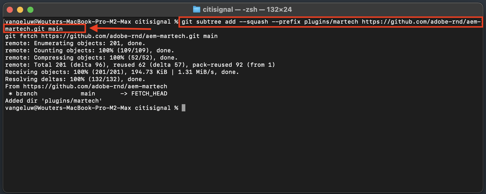

# 1.1.6 AEM Edge Delivery Services MarTech プラグイン

AEM MarTech プラグインを使用すると、AEM プロジェクトの完全な MarTech スタックをすばやく設定できます。

>[!NOTE]
>
>現在、このプラグインは、共同開発プロジェクトを通じてAEMエンジニアリングと連携しているお客様が利用できます。 詳細については、[https://github.com/adobe-rnd/aem-martech](https://github.com/adobe-rnd/aem-martech) を参照してください。

## 1.1.6.1 リポジトリへのプラグインの追加

**citignal** GitHub リポジトリに使用しているフォルダーに移動します。 フォルダ名を右クリックし、[**フォルダに新しいターミナル**] を選択します。

{zoomable="yes"}

その後、これが表示されます。 次のコマンドを貼り付けて、**enter** キーを押します。

```
git subtree add --squash --prefix plugins/martech https://github.com/adobe-rnd/aem-martech.git main
```

この画像が表示されます。

{zoomable="yes"}

**citignal** GitHub リポジトリに使用しているフォルダーに移動し、フォルダー **plugins** を開きます。 **martech** という名前のフォルダーが表示されます。

{zoomable="yes"}

## 1.1.6.2 head.html

Visual Studio Code で、ファイル **head.html** を開きます。 以下のコードをコピーして、ファイル **head.html** に貼り付けます。

```javascript
<link rel="preload" as="script" crossorigin="anonymous" href="/plugins/martech/src/index.js"/>
<link rel="preload" as="script" crossorigin="anonymous" href="/plugins/martech/src/alloy.min.js"/>
<link rel="preconnect" href="https://edge.adobedc.net"/>
<!-- change to adobedc.demdex.net if you enable third party cookies -->
```

変更を保存します。

{zoomable="yes"}

## 1.1.6.3 scripts.js

Visual Studio Code で、**scripts** フォルダーに移動し、**scripts.js** ファイルを開きます。 以下のコードをコピーして、既存のインポートスクリプトの下の **scripts.js** ファイルに貼り付けます。

```javascript
import {
  initMartech,
  updateUserConsent,
  martechEager,
  martechLazy,
  martechDelayed,
} from '../plugins/martech/src/index.js';
```

変更を保存します。

{zoomable="yes"}

Visual Studio Code の **scripts.js** ファイルで、次のコードを見つけます。

```javascript
const AUDIENCES = {
  mobile: () => window.innerWidth < 600,
  desktop: () => window.innerWidth >= 600,
  // define your custom audiences here as needed
};
```

**const AUDIENCES = {...}；の下に** 次のコードを貼り付けます。

```javascript
  const isConsentGiven = true;
  const martechLoadedPromise = initMartech(
    // The WebSDK config
    // Documentation: https://experienceleague.adobe.com/ja/docs/experience-platform/web-sdk/commands/configure/overview#configure-js
    {
      datastreamId: "XXX",
      orgId: "XXX",
      defaultConsent: 'in',
      onBeforeEventSend: (payload) => {
        // set custom Target params 
        // see doc at https://experienceleague.adobe.com/ja/docs/platform-learn/migrate-target-to-websdk/send-parameters#parameter-mapping-summary
        payload.data.__adobe.target ||= {};

        // set custom Analytics params
        // see doc at https://experienceleague.adobe.com/ja/docs/analytics/implementation/aep-edge/data-var-mapping
        payload.data.__adobe.analytics ||= {};
      },

      // set custom datastream overrides
      // see doc at:
      // - https://experienceleague.adobe.com/ja/docs/experience-platform/web-sdk/commands/datastream-overrides
      // - https://experienceleague.adobe.com/ja/docs/experience-platform/datastreams/overrides
      edgeConfigOverrides: {
        // Override the datastream id
        // datastreamId: '...'

        // Override AEP event datasets
        // com_adobe_experience_platform: {
        //   datasets: {
        //     event: {
        //       datasetId: '...'
        //     }
        //   }
        // },

        // Override the Analytics report suites
        // com_adobe_analytics: {
        //   reportSuites: ['...']
        // },

        // Override the Target property token
        // com_adobe_target: {
        //   propertyToken: '...'
        // }
      },
    },
    // The library config
    {
      launchUrls: ["XXX"],
      personalization: !!getMetadata('target') && isConsentGiven,
    },
  );
```

{zoomable="yes"}

上記のコードでは、いくつかの変数を、独自の環境の変数で置き換える必要があります。

- `datastreamId: "XXX"`
- `orgId: "XXX"`
- `launchUrls: ["XXX"]`

これらの変数は、次の手順に従って確認できます。

### datastreamId

[https://platform.adobe.com/](https://platform.adobe.com/) に移動し、左メニューで **データストリーム** に移動します。 正しいサンドボックスにいることを確認します。これは `--aepSandboxName--` です。 このチュートリアルのはじめにの節で作成した、`--aepUserLdap-- - One Adobe Datastream` という名前のデータストリームを検索します。 「**コピー**」アイコンをクリックして **データストリーム ID** をコピーし、Visual Studio Code の **scripts.js** ファイルに、`datastreamId:` の横にあるプレースホルダー値 `XXX` を置き換えて貼り付けます。

{zoomable="yes"}

### orgId

[https://platform.adobe.com/](https://platform.adobe.com/) に移動し、左メニューの **クエリ** に移動します。 **資格情報** の下に、**IMS 組織 ID** が **ユーザー名** として表示されます。 **コピー** アイコンをクリックして **IMS 組織 ID** をコピーし、Visual Studio Code の **scripts.js** ファイルに貼り付けます。`orgId:` の横にあるプレースホルダー値 `XXX` を置き換えます。

{zoomable="yes"}

### launchUrls

[https://platform.adobe.com/](https://platform.adobe.com/) に移動し、左メニューの **タグ** に移動します。 LDAP を使用してプロパティを検索します。これは `--aepUserLdap--` である必要があります。 Web プロパティを開きます。

{zoomable="yes"}

左側のメニューで、**環境** に移動し、**開発** 環境の **インストール** アイコンをクリックします。

{zoomable="yes"}

その後、必要な URL がHTML `<script></script>` タグ内に表示されます。 `https` から `.min.js` までの部分のみをコピーしてください。

{zoomable="yes"}

URL は次のようになります。`https://assets.adobedtm.com/b754ed1bed61/b9f7c7c484de/launch-5fcd90e5b482-development.min.js` エラーの原因となる他のテキストがコピーされていないことを確認してください。 Visual Studio Code の **scripts.js** ファイルで、`launchUrls:` 配列のプレースホルダー値 `XXX` を置き換えます。

これで、必要な 3 つの変数が作成されました。 ファイル `scripts.js` は次のようになります。

{zoomable="yes"}

次に、検索して、次のコードブロックを見つけます。

```javascript
const main = doc.querySelector('main');
  if (main) {
    decorateMain(main);
    document.body.classList.add('appear');
    await loadSection(main.querySelector('.section'), waitForFirstImage);	
  }
```

{zoomable="yes"}

次のコードブロックで置き換えます。

```javascript
const main = doc.querySelector('main');
  if (main) {
    decorateMain(main);
    document.body.classList.add('appear');
    await Promise.all([
      martechLoadedPromise.then(martechEager),
      loadSection(main.querySelector('.section'), waitForFirstImage)
    ]);
  }
```

{zoomable="yes"}

次に、を検索し、下にスクロールして `async function loadLazy(doc) {` を表示します。

{zoomable="yes"}

行 `autolinkModals(doc);` の下に、次のコード行を追加します。

```javascript
await martechLazy();
```

{zoomable="yes"}

次に、を検索し、行 `function loadDelayed() {` まで下にスクロールします。

{zoomable="yes"}

このコードブロックを行 `// load anything that can be postponed to the latest here` の下に追加します。

```javascript
window.setTimeout(() => {
    martechDelayed();
    return import('./delayed.js');
  }, 3000);
```

{zoomable="yes"}

次に、を検索して、`window.adobeDataLayer.push` を含む行に移動します。

{zoomable="yes"}

このようにオブジェクト `pageContext` 定義されていることがわかります。 ここで、`pageContext` の下に 2 つのオブジェクトを追加する必要があります。

```javascript
	pageContext: {
      pageType,
      pageName: document.title,
      eventType: 'visibilityHidden',
      maxXOffset: 0,
      maxYOffset: 0,
      minXOffset: 0,
      minYOffset: 0,
    }
```

追加する必要があるコードは次のとおりです。

```javascript
	,
    _experienceplatform: {
      identification:{
        core:{
          ecid: sessionStorage.getItem("com.adobe.reactor.dataElements.ECID")
        }
      }
    },
    web: {
      webPageDetails:{
        name: document.title,
        URL: window.location.href
      }
    }
```

**window.adobeDataLayer.push** は次のようになります。

```javascript
  window.adobeDataLayer.push({
    pageContext: {
      pageType,
      pageName: document.title,
      eventType: 'visibilityHidden',
      maxXOffset: 0,
      maxYOffset: 0,
      minXOffset: 0,
      minYOffset: 0,
    },
    _experienceplatform: {
      identification:{
        core:{
          ecid: sessionStorage.getItem("com.adobe.reactor.dataElements.ECID")
        }
      }
    },
    web: {
      webPageDetails:{
        name: document.title,
        URL: window.location.href
      }
    }
  });
```

{zoomable="yes"}

これで、ファイル **scripts.js** で必要な変更をすべて行いました。

GitHub デスクトップクライアントを開き、変更をコミットします。

{zoomable="yes"}

**接触チャネルをプッシュ** をクリックして、変更を GitHub リポジトリにプッシュします。

{zoomable="yes"}

## 1.1.6.4 タグプロパティの ACDL 拡張機能

AEM Edge Delivery Services MarTech プラグインを正しく機能させるには、以下の拡張子を追加する必要があります。

[https://experience.adobe.com/#/data-collection/](https://experience.adobe.com/#/data-collection/) に移動します。 Web のタグプロパティ（`--aepUserLdap-- - One Adobe (DD/MM/YYYY)`）を検索して開きます。

{zoomable="yes"}

**拡張機能**、**カタログ** に移動します。 拡張子 **Adobe Client Data Layer をクリックしてから**&#x200B;**インストール** をクリックします。

{zoomable="yes"}

この画像が表示されます。 現時点では何も変更する必要はありません。 **ライブラリに保存** をクリックします。

{zoomable="yes"}

拡張機能がタグプロパティに追加されます。

{zoomable="yes"}

**公開フロー** に移動し、**メイン** ライブラリを開きます。 「**変更されたリソースをすべて追加**」をクリックし、「**開発用に保存およびビルド**」をクリックします。

{zoomable="yes"}

これで、変更がデプロイされました。

## 1.1.6.5 Adobe Experience Platform Edge Networkへのデータの送信

XXX を GitHub ユーザーアカウント（この例では `woutervangeluwe`）に置き換えた後、`main--citisignal--XXX.aem.page/us/en` や `main--citisignal--XXX.aem.live/us/en` に移動して、web サイトの変更を表示できるようになりました。

この例では、完全な URL は次のようになります。
`https://main--citisignal--woutervangeluwe.aem.page/us/en` や `https://main--citisignal--woutervangeluwe.aem.live/us/en`。

>[!NOTE]
>
>匿名 Web ページを開いて、新しいクリーンなプロファイルでデータ収集を開始することを検討してください。 デバッグやトラブルシューティングが容易になりました。

{zoomable="yes"}

Chromeで、**その他のツール**/**デベロッパーツール** に移動して **デベロッパーツール** を開きます。

{zoomable="yes"}

**コンソール** ビューには、`[alloy]` で始まる行が多数表示されます。 リクエストを見てください。そのうちの 1 つは次のようになり、画像に示されているリクエスト本文を持っている必要があります。

`[alloy] Request 55a9ddbc-0521-4ba3-b527-3da2cb35328a: Sending request.`

ペイロードを開き、フィールド `events[0].xdm._experienceplatform.identification.core.ecid` にドリルダウンして、ECID をコピーします。

{zoomable="yes"}

## 1.1.6.6 Adobe Experience Platformで顧客プロファイルを表示する

URL:[https://experience.adobe.com/platform](https://experience.adobe.com/platform) に移動して、Adobe Experience Platformにログインします。

ログインすると、Adobe Experience Platformのホームページが表示されます。

{zoomable="yes"}

続行する前に、**サンドボックス** を選択する必要があります。 選択するサンドボックスの名前は ``--aepSandboxName--`` です。 適切なサンドボックスを選択すると、画面が変更され、専用のサンドボックスが表示されます。

{zoomable="yes"}

左側のメニューで、**顧客**/**プロファイル**/**参照** に移動します。 **ECID** の **ID 名前空間** を選択し、前の手順でコピーした **ECID** を超えます。 **表示** をクリックします。 すると、リストにプロファイルが表示されます。 クリックして開きます。

{zoomable="yes"}

次に、ECID を示す **プロファイルダッシュボード** の概要が表示されます。 次に、**イベント** に移動します。

{zoomable="yes"}

**イベント** の下に、eventType が **web.webpagedetails.pageViews** であるイベントを含む、複数のエクスペリエンスイベントが表示されます。 **JSON を表示** をクリックして、収集されたすべてのイベントを表示します。

{zoomable="yes"}

**JSON** ビューで、eventType **web.webpagedetails.pageViews** を使用してイベントを検証し、**ページ名** や **ページ URL** などを確認します。

{zoomable="yes"}

これで、この演習が完了しました。

次の手順：[ 概要とメリット ](./summary.md){target="_blank"}

[Adobe Experience Manager Cloud ServiceとEdge Delivery Services](./aemcs.md){target="_blank"} に戻る

[ すべてのモジュールに戻る ](./../../../overview.md){target="_blank"}
