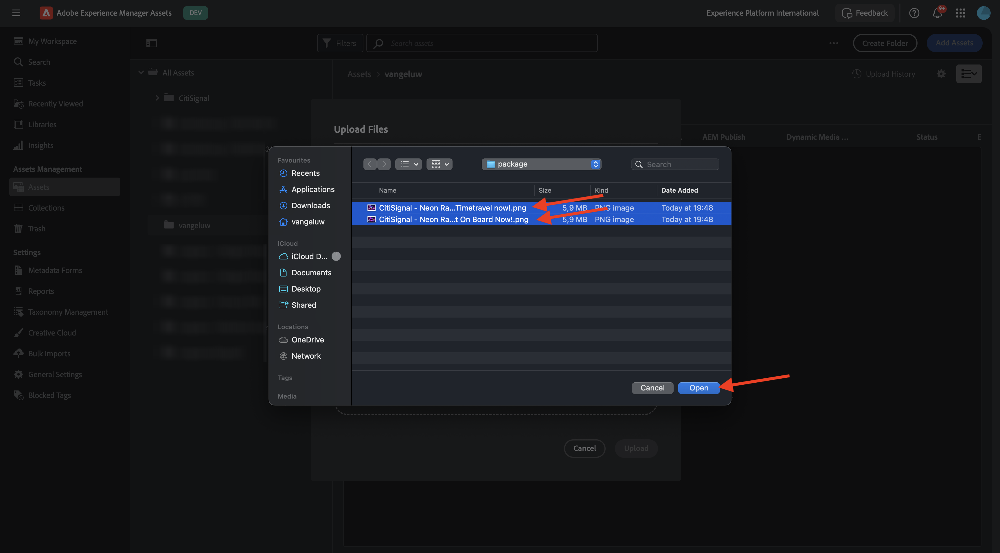
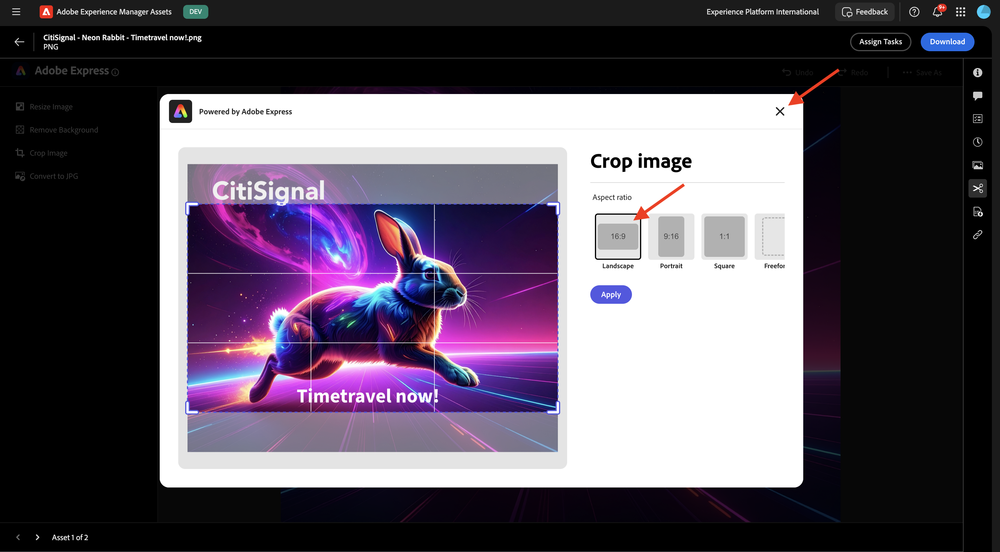

# 1.2.1 AEM Assetsの概要

[https://experience.adobe.com/](https://experience.adobe.com/){target="_blank"} に移動します。 `--aepImsOrgName--` という名前の環境が正しいことを確認します。

**Adobe Experience Manager Assets** を開きます。

割り当てられているAEM Assets CS 環境を選択します。 この場合、選択する環境は `--aepUserLdap-- - CitiSignal dev author` です。

この画像が表示されます。 **Assets** に移動します。

`--aepUserLdap-- - CitiSignal Fiber Campaign` という名前のフォルダーを使用してください。 まだ存在しない場合は、「**フォルダーを作成**」をクリックします。

フォルダーの名前 `--aepUserLdap--` を入力し、「**作成**」をクリックします。

新しく作成したフォルダーを開きます。 前の演習の 1 つで、`CitiSignal - Neon Rabbit - Get On Board Now!.png` と `CitiSignal - Neon Rabbit - Timetravel now!.png` という名前の 2 つの画像を作成しました。 これらの画像がまだない場合は、このフォルダーにアップロードする必要があります。

これらのファイルがもはや存在しない場合は、[ こちら ](./images/CitiSignal_Neon_Rabbit.zip){target="_blank"} からダウンロードすることができます。

**Assetsを追加** をクリックします。

上記の 2 つの画像を選択します。 「**開く**」をクリックします。

**アップロード** をクリックします。

いずれかの画像をクリックして選択します。

**詳細** をクリックします。

これで、特定のファイルの使用可能なメタデータが表示されます。

右側のメニューの「**レンディション**」に移動します。 選択した画像の定義済みレンディションの数と、ダウンロード機能が表示されます。

右側のメニューで、**はさみ** アイコンをクリックします。 Adobe Expressを活用して、使用できる編集アクションが多数あります。 **背景を削除** をクリックします。

数秒後、これに似た情報が表示され、変更を適用するか、新しいファイルをダウンロードすることができます。 ポップアップを閉じます。

クリップ **画像を切り抜き**。

様々な切り抜きサイズのバリエーションをテストできます。

右側のメニューで、**タスク** に移動します。 「**タスクを割り当て**」をクリックします。

**タスクタイトル** を `Review image & approve` に設定します。 自分を割り当てる。 「**作成**」をクリックします。

通知の **表示** をクリックします。

または、画面を更新して、新しく作成したタスクが **関連タスク** リストに表示されることを確認します。 「**開く** ボタンをクリックして、タスクの詳細を表示します。

次のようなメッセージが表示されます。 **承認** をクリックします。

「**承認**」をクリックして確定します。

アセットがAEM Assetsで承認されました。

次の手順：[ 概要とメリット ](./summary.md){target="_blank"}

[Adobe Experience Manager Assets](./aemassets.md){target="_blank"} に戻る

[ すべてのモジュールに戻る ](./../../../overview.md){target="_blank"}
