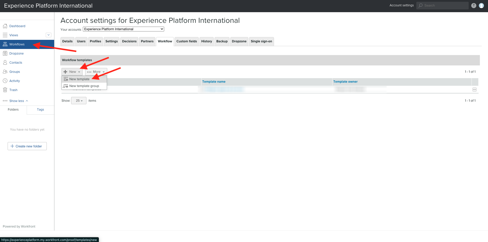
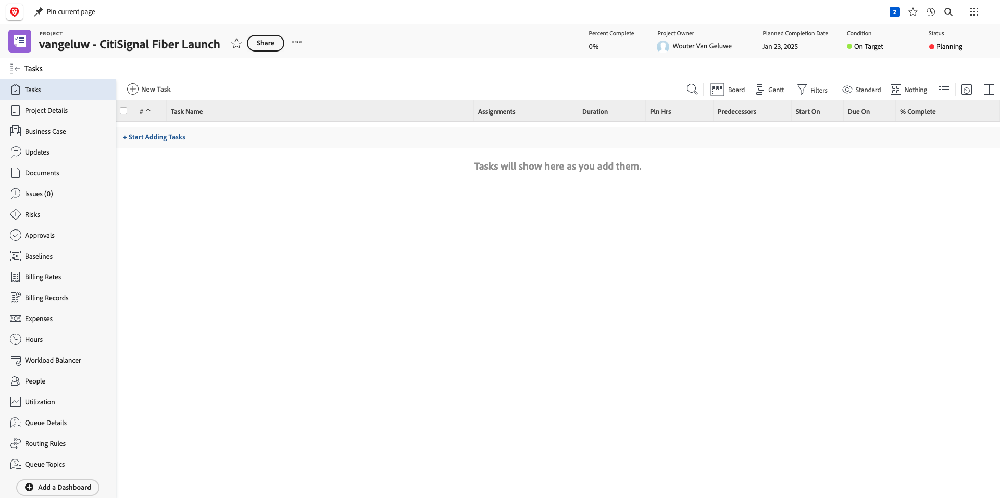
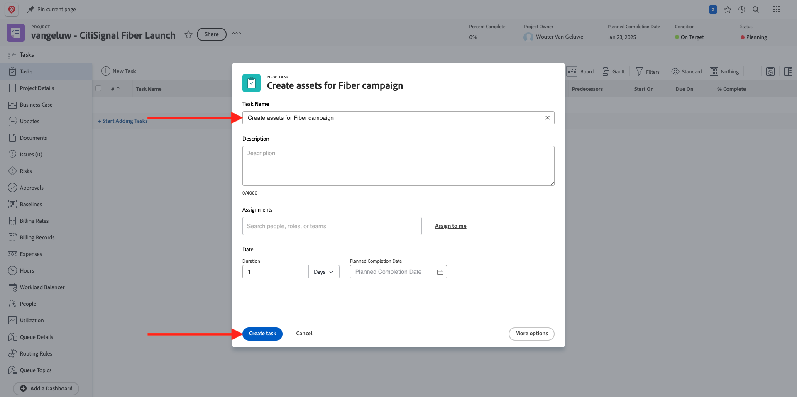
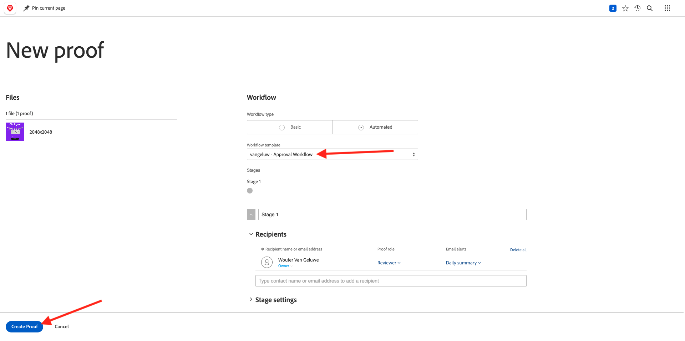

# 1.2.2 Workfrontでのプルーフ

## 1.2.2.1 新しい承認フローの作成

[https://experienceplatform.my.workfront.com/](https://experienceplatform.my.workfront.com/){target="_blank"} に移動します。

9 つのドット **ハンバーガー** アイコンをクリックし、「**プルーフ** を選択します。

**ワークフロー** に移動し、「**+新規」をクリックしてから** 「新規テンプレート **を選択し** す。

**テンプレート名** を `--aepUserLdap-- - Approval Workflow` に設定し、**テンプレート所有者** を自分に設定します。

下にスクロールして、**ステージ**/**ステージ 1** で **Wouter Van Geluwe** を **レビュアーと承認者** の **役割** に追加します。

「**作成**」をクリックします。

これで、基本承認ワークフローを使用する準備が整いました。

## 1.2.2.2 新規プロジェクトの作成

Workfrontのホームページで、「**マイプロジェクト** タブの **新規** をクリックします。 「**空のプロジェクト**」を選択します。

この画像が表示されます。 名前を `--aepUserLdap-- - CitiSignal Fiber Launch` に変更します。

これで、プロジェクトが作成されました。

## 1.2.2.3 新規タスクの作成

タスクの名前 **ファイバーキャンペーンのアセットを作成** を入力します。 **タスクを作成** をクリックします。

この画像が表示されます。

## 1.2.2.4 新しいドキュメントをタスクに追加する承認フローを実行する

「**+新規追加」をクリックし** 「**ドキュメント**」を選択します。

[ このファイル ](./images/2048x2048.png) をデスクトップにダウンロードします。

{width="50px" align="left"}

ファイル **2048 x 2048.png** を選択し、「**開く**」をクリックします。

これで完了です。 「**プルーフを作成**」をクリックして、「**詳細プルーフ**」を選択します。

**新しいプルーフ** ウィンドウで、以前に作成した、`--aepuserLdap-- - Approval Workflow` という名前のワークフローテンプレートを選択します。 **プルーフを作成** をクリックします。

その後、タスクに戻ります。 **割り当て先** ボタンをクリックし、「自分に割り当て **を選択し** す。

「**保存**」をクリックします。

**作業** をクリックします。

**プルーフを開く**」をクリックします

これで、プルーフを確認できます。 「**コメントを追加**」を選択して、ドキュメントの変更を必要とするコメントを追加します。

コメントを入力し、「**投稿**」をクリックします。 「**閉じる**」をクリックします。

次に、役割を **レビュアー** から **レビュアーおよび承認者** に変更する必要があります。 これをおこなうには、タスクに戻り、「**プルーフワークフロー**」をクリックします。

役割を **レビュアー** から **レビュアーおよび承認者** に変更します。

タスクに戻り、プルーフを再度開きます。 これで、「決定する **という新しいボタンが表示され** す。 クリックします。

「**変更が必要です**」を選択し、「**決定を下す**」をクリックします。

その後、あなたはここに戻るべきです。 ここで、提供されたコメントを考慮した 2 つ目の画像をアップロードする必要があります。

[ このファイル ](./images/2048x2048_buynow.png) をデスクトップにダウンロードします。

{width="50px" align="left"}

タスクビューで、承認されなかった古い画像ファイルを選択します。 次に、「**+新規追加**」をクリックし、「**バージョン**」を選択してから、「**ドキュメント**」を選択します。

ファイル「**2048x2048_buynow.png**」を選択し、「**開く**」をクリックします。

これで完了です。 **プルーフを作成** をクリックし、もう一度 **詳細プルーフ** を選択します。

その後、これが表示されます。 Workfrontが以前の承認ワークフローがまだ有効であると想定するので、**ワークフローテンプレート** が事前に選択されるようになりました。 **プルーフを作成** をクリックします。

**プルーフを開く** を選択します。

ファイルの 2 つのバージョンが各ホストの横に表示されるようになりました。

「**決定する**」をクリックし、「**承認済み** を選択して「**決定する**」を再度クリックします。

プルーフのプレビューを閉じます。

その後、承認済みアセットを使用して、タスクビューに戻ります。 次に、このアセットをAEM Assetsに対して共有する必要があります。

**矢印を共有** アイコンをクリックし、AEM Assets統合を選択します。これは、`--aepUserLdap-- - Citi Signal AEM` という名前にする必要があります。

前に作成したフォルダーをダブルクリックします。フォルダーの名前は `--aepUserLdap-- - Workfront Assets` にする必要があります。

**フォルダーを選択** をクリックします。

1～2 分後に、ドキュメントがAEM Assetsに公開されます。 ドキュメント名の横に「AEM」アイコンが表示されます。

**概要を開く** をクリックします。

**メタデータ** に移動すると、次のように表示されます。

**概要** に移動し、「**+追加**」をクリックして説明を追加します。

説明を入力します。 これで、プルーフとドキュメントの設定が完了しました。

## 1.2.2.5 AEM Assetsでファイルを表示する

AEM Assetsの `--aepUserLdap-- - Workfront Assets` というフォルダーに移動します。

画像の下の 3 ドットをクリックし、「**詳細**」を選択します。

その後、WorkfrontとAEM Assetsの統合によって値が自動的に入力された、前に作成したメタデータフォームが表示されます。

[Adobe Workfrontによるワークフロー管理 ](./workfront.md){target="_blank"} に戻る

[ すべてのモジュールに戻る ](./../../../overview.md){target="_blank"}
