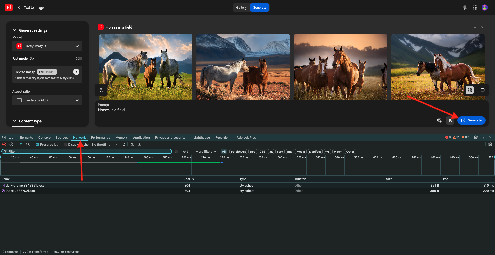

# 1.1.1 Firefly サービスの概要

PostmanとAdobe I/Oを使用して、Adobe Firefly サービス API をクエリする方法を説明します。

## 1.1.1.1 前提条件

この演習を続ける前に、[Adobe I/O プロジェクト ](./../../../modules/getting-started/gettingstarted/ex6.md) の設定を完了し、[Postman](./../../../modules/getting-started/gettingstarted/ex7.md) や [PostBuster](./../../../modules/getting-started/gettingstarted/ex8.md) などの API を操作するアプリケーションも設定しておく必要があります。

## 1.1.1.2 firefly.adobe.com

[https://firefly.adobe.com](https://firefly.adobe.com) に移動します。 **プロファイル** アイコンをクリックし、適切な **アカウント** にログインしていることを確認します。`--aepImsOrgName--` にアクセスする必要があります。 必要に応じて、「**プロファイルを切り替え**」をクリックして、そのアカウントに切り替えます。

{zoomable="yes"}

プロンプト `Horses in a field` を入力し、「**生成**」をクリックします。

{zoomable="yes"}

これに似た情報が表示されます。

{zoomable="yes"}

次に、ブラウザーで **開発者ツール** を開きます。

{zoomable="yes"}

この画像が表示されます。 「**ネットワーク**」タブに移動します。

{zoomable="yes"}

検索語句 **generate** を入力してから、もう一度 **Generate** をクリックします。 すると、**generate-async** という名前のリクエストが表示されます。 リクエストを選択して **ペイロード** に移動すると、リクエストの詳細が表示されます。

{zoomable="yes"}

ここに表示されているリクエストは、Firefly Services のサーバーサイドバックエンドに送信されるリクエストです。 次のようないくつかの重要なパラメーターが含まれています。

- **prompt**:Fireflyで生成する画像の種類を要求するプロンプトです

- **seeds**：このリクエストでは、シードはランダムに生成されました。 Fireflyでは、画像が生成されるたびに、デフォルトでは、シードと呼ばれる乱数を選択してプロセスを開始します。 この乱数は、各画像が一意になる要因に寄与し、様々な画像を生成する場合に最適です。 ただし、複数のリクエストで互いに類似した画像を生成したい場合があります。 例えば、Fireflyの他のオプション（スタイルプリセット、参照画像など）を使用して変更する画像をFireflyが生成する場合、今後の HTTP リクエストでその画像のシードを使用して、今後の画像のランダム性を制限し、変更する画像を絞り込みます。

{zoomable="yes"}

UI を再確認します。 **縦横比** を **横（4:3）** に変更します。

{zoomable="yes"}

「**エフェクト**」までスクロールし、「**テーマ**」に移動して、「コミック **などのエフェクトを選択** ます。

{zoomable="yes"}

**開発者ツール** をブラウザーで再度開きます。 次に、「**生成**」をクリックして、送信するネットワークリクエストを調べます。

{zoomable="yes"}

ネットワークリクエストの詳細を調べると、次の情報が表示されます。

- **prompt** は、以前のリクエストと比較して変更されていません
- **シード** が前のリクエストと比較して変更されていません
- **サイズ** は、**縦横比** の変更に基づいて変更されました。
- **styles** が追加され、選択した **comic_book** 効果への参照が含まれています

{zoomable="yes"}

次の演習では、**seed** のいずれかの数値を使用する必要があります。 選択したシード番号を書き留めます。

次の演習では、Firefly サービスでも同様の操作を行いますが、その後 UI の代わりに API を使用します。 この例では、シード番号は **45781** です。

## 1.1.1.3 Adobe I/O - access_token

**Adobe I/O - OAuth** コレクションで、「**POST - アクセストークンを取得**」という名前のリクエストを選択し、「**送信**」を選択します。 応答には、新しい **accestoken** を含める必要があります。

{zoomable="yes"}

## Firefly サービス API1.1.1.4 テキスト 2 の画像

これで、有効な新しい access_token が用意できたので、最初のリクエストをFirefly Services API に送信する準備が整いました。

**FF - Firefly Services Tech Insiders** コレクションから **POST - Firefly - T2I V3** という名前のリクエストを選択します。

{zoomable="yes"}

応答から画像 URL をコピーし、web ブラウザーで開いて画像を表示します。

{zoomable="yes"}

`horses in a field` を描いた美しい画像が表示されます。

{zoomable="yes"}

リクエスト **POST - Firefly - T2I V3** の **Body** で、「`"promptBiasingLocaleCode": "en-US"`」フィールドに以下を追加し、Firefly サービス UI でランダムに使用されたシード番号の 1 つに変数 `XXX` を置き換えます。 この例では、**seed** 番号は `45781` です。

```json
,
  "seeds": [
    XXX
  ]
```

**送信** をクリックします。 すると、Firefly サービスで生成された新しい画像が記載された応答が届きます。 画像を開いて表示します。

{zoomable="yes"}

使用した **シード** に基づいた、わずかな違いを含む新しい画像が表示されます。

{zoomable="yes"}

次に、リクエスト **POST - Firefly - T2I V3** の **Body** で、以下の **styles** オブジェクトを **seeds** オブジェクトの下に貼り付けます。 これにより、生成された画像のスタイルが **comic_book** に変更されます。

```json
,
  "contentClass": "art",
  "styles": {
    "presets": [
      "comic_book"
    ],
    "strength": 50
  }
```

これで完了です。 「**送信**」をクリックします。

{zoomable="yes"}

画像の URL をクリックして開きます。

{zoomable="yes"}

これで、画像が少し変更されました。 スタイルプリセットを適用すると、シード画像が以前と同じ方法で適用されなくなります。

{zoomable="yes"}

リクエストの **Body** から **seeds** オブジェクトのコードを削除します。 「**送信**」をクリックし、応答から取得する画像 URL をクリックします。

```json
,
  "seeds": [
    XXX
  ]
```

{zoomable="yes"}

これで、画像が少し変わりました。

{zoomable="yes"}


## Firefly サービス API1.1.1.5Gen を展開

**FF - Firefly Services Tech Insiders** コレクションから **POST - Firefly - Gen Expand** という名前のリクエストを選択し、リクエストの **本文** に移動します。

- **サイズ**：目的の解像度を入力します。 ここに入力する値は、画像の元のサイズよりも大きい値にする必要があり、4096 を超えることはできません。
- **image.source.url**：このフィールドには、展開する必要がある画像へのリンクが必要です。 この例では、変数を使用して、前の演習で生成された画像を参照します。

- **水平方向の位置揃え**：指定できる値は、`"center"`、`"left`、`"right"` です。
- **垂直方向の整列**：指定できる値は、`"center"`、`"top`、`"bottom"` です。

{zoomable="yes"}

応答に含まれる画像 URL をクリックします。

{zoomable="yes"}

前の演習で生成した画像が 3999 x 3999 の解像度に拡張されたことがわかります。

{zoomable="yes"}

配置の配置を変更すると、出力も若干異なります。 この例では、プレースメントを **左、下** に変更します。 **送信** をクリックし、生成された画像 URL をクリックして開きます。

{zoomable="yes"}

元の画像が別の場所で使用され、画像全体に影響することがわかります。

{zoomable="yes"}

## 次の手順

[Microsoft Azure と事前署名済み URL を使用したFirefly プロセスの最適化 ](./ex2.md){target="_blank"} に移動します

[Adobe Firefly サービスの概要 ](./firefly-services.md){target="_blank"} に戻ります

[ すべてのモジュール ](./../../../overview.md){target="_blank"} に戻る
