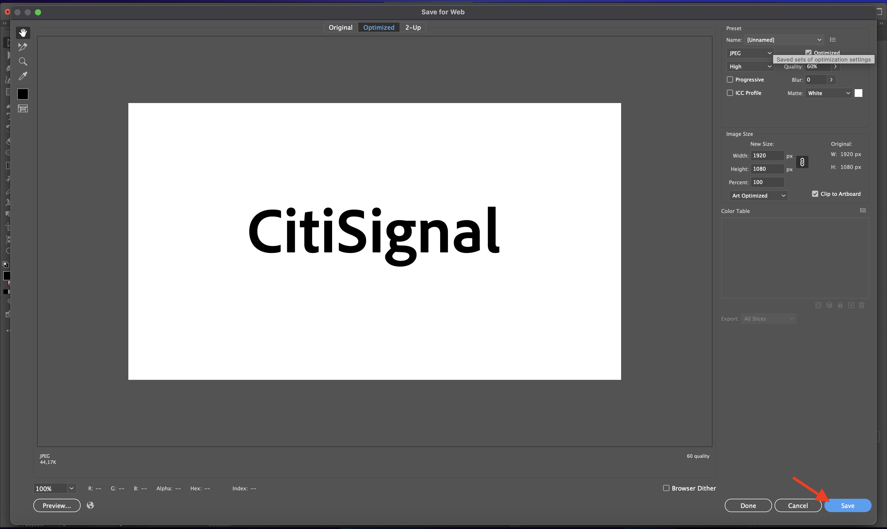
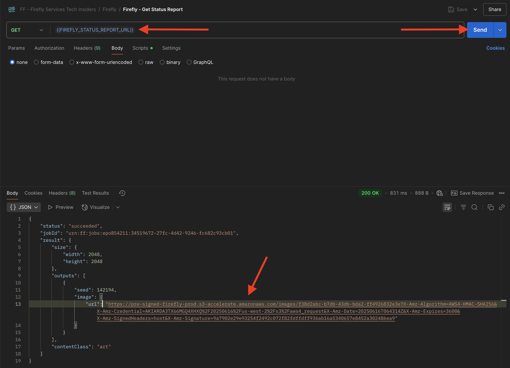
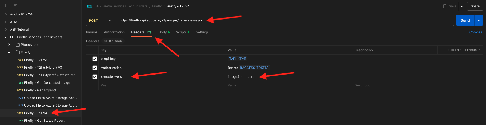
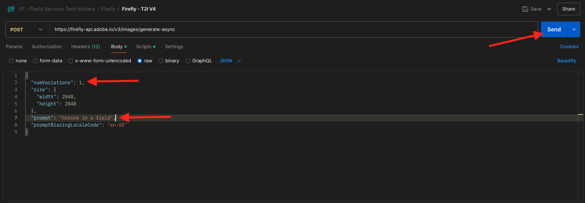

# 1.1.1 Firefly Servicesの概要

PostmanとAdobe I/Oを使用して、Adobe Firefly Services API に対してクエリを実行する方法を説明します。

## 1.1.1.1 前提条件

この演習を続ける前に、[Adobe I/O プロジェクト ](./../../../modules/getting-started/gettingstarted/ex6.md) の設定を完了し、[Postman](./../../../modules/getting-started/gettingstarted/ex7.md) や [PostBuster](./../../../modules/getting-started/gettingstarted/ex8.md) などの API を操作するアプリケーションも設定しておく必要があります。

## 1.1.1.2 API の基本

API リクエストには複数のタイプがあります。

- **GET**：これは、ステータスレポートの取得など、API エンドポイントから情報を取得しようとする場合に使用されます
- **POST**:Adobe Firefly Servicesで新しい画像を生成するなど、新しい処理が必要な場合に使用します
- **PUT**：既存のデータを完全に更新するために使用されます
- **PATCH**：既存のデータを選択的に更新するために使用します
- **DELETE**：データの削除に使用します

API を使用すると、様々な API エンドポイントによって応答コードが返されることにも気付くでしょう。

期待される応答には、5 つの異なるカテゴリがあります。

- **1xx 情報応答**：要求を受信しました。プロセスを続行します
- **2xx 成功**：リクエストは正常に受信、理解、承認されました
- **3xx リダイレクト**：リクエストを完了するには、さらにアクションを実行する必要があります
- **4xx クライアントエラー**: リクエストに正しくない構文が含まれているか、リクエストを実行できません
- **5xx サーバーエラー**: サーバーは明らかに有効なリクエストを満たすことができませんでした

期待される一般的な応答コードの例を次に示します。

- **200 OK**：問題ありません。要求は正常に完了しました
- **201 作成済み**：これは例としてイメージが作成されたことを示します。
- **202 承諾**：問題ありません。要求は承諾され、処理されます
- **401 Unauthorized**：これは適切ではありません。アクセス トークンが無効である可能性があります
- **403 Forbidden 禁止**：これは適切ではありません。実行しようとしているアクションに必要な権限を持っていない可能性があります
- **404 Not Found**：これは適切ではありません。アクセスしようとしている URL が存在しない可能性があります
- **429 Too Many Requests**：これは適切ではありません。短期間に多数のリクエストに送信した可能性があります。 後でもう一度試してください。

## 1.1.1.3 Explore firefly.adobe.com - ステージ 1

それでは、Adobe Firefly Servicesを探索してみましょう。 詳しくは、CitiSignal 画像生成の例から始めます。 CitiSignal デザインチームは、CitiSignal ブランド名のネオンバージョンを生成したいと考えています。 その際は、Adobe Firefly Servicesを使用したいと考えています。

これを実現するために最初に必要なのは、CitiSignal のブランド名が白黒バージョンで、次のようになります。


### 1.1.1.3.1 コンポジション参照画像の作成

[ このサンプル画像 ](./images/CitiSignal.jpg) を使用するか、独自のテキストを作成して実験できます。 Adobe Illustratorで独自の画像ファイルを作成するには、次の手順に従います。 事前定義済みの画像を使用する場合は、以下の節をスキップし、手順 **1.1.1.2.2 画像の生成に進ん** ください。

**Adobe Illustrator** を開きます。 **新規ファイル** をクリックします。


「**Web-Large 1920 x 1080px**」を選択します。 「**作成**」をクリックします。


これで完了です。 **T** テキストアイコンをクリックします。


これで完了です。


フォントタイプを選択したフォントに変更します。この場合、フォントタイプは **Adobe Clean Bold** です。


フォントサイズを選択したサイズに変更します。この場合は **250 pt** です。


これで完了です。


必要に応じてテキストを変更します。この場合は **CitiSignal**。


テキストをファイルの中央に配置します。


**ファイル/エクスポート/Web 用に保存（レガシー）** に移動します。


これで完了です。 「**保存**」をクリックします。



ファイルに名前を付けて、デスクトップに保存します。 「**保存**」をクリックします。


### 1.1.1.3.2 画像の生成

[https://firefly.adobe.com](https://firefly.adobe.com) に移動します。 **プロファイル** アイコンをクリックし、右側の **アカウント** にログインしていることを確認します。`--aepImsOrgName--` にアクセスする必要があります。 必要に応じて、「**プロファイルを切り替え**」をクリックして、そのアカウントに切り替えます。


プロンプト `neon light lettering on a brick wall of a night club` を入力します。 **生成** をクリックします。


すると、これに似たものが表示されます。 これらの画像はまだ役に立ちません。 **構成** の下の **画像をアップロード** をクリックします。


前に作成した画像（ここでは **CitiSignal.jpg** を選択します。 **開く** をクリックしてから、**生成** をクリックします。


すると、これに似たものが表示されます。 コンポジション参照の適用はまだ適切ではありません。 これを変更するには、「**強度**」スライダーを最大値に変更します。 もう一度 **生成** をクリックします。


これで、CitiSignal ブランド名のネオンバージョンを示す画像がいくつか作成されました。これらを使用してさらに繰り返すことができます。


これで、Fireflyを使用して、数分でデザインの問題を解決する方法を学びました。

## 1.1.1.4 Explore firefly.adobe.com - ステージ 2

[https://firefly.adobe.com/generate/image](https://firefly.adobe.com/generate/image) に移動します。 この画像が表示されます。 **モデル** ドロップダウンリストをクリックします。 Adobe Firefly Servicesには 3 つのバージョンがあります。

- Fireflyの画像 3
- Fireflyの画像 4
- Firefly画像 4 Ultra


>[!NOTE]
>
>Firefly Image 3 および Image 4 は、Adobe Firefly Servicesを使用しているすべてのユーザーが利用できますが、Firefly Image 4 Ultra にはFirefly Pro ライセンスが必要です。

この演習では、**Firefly画像 3** をクリックして選択します。


プロンプト `Horses in a field` を入力し、「**生成**」をクリックします。


これに似た情報が表示されます。


次に、ブラウザーで **開発者ツール** を開きます。


この画像が表示されます。 「**ネットワーク**」タブに移動します。 次に、もう一度 **生成** をクリックします。


検索語句 **generate-async** を入力します。 すると、**generate-async** という名前のリクエストが表示されます。 リクエストを選択して **ペイロード** に移動すると、リクエストの詳細が表示されます。


ここに表示されているリクエストは、Firefly Servicesのサーバーサイドバックエンドに送信されるリクエストです。 次のようないくつかの重要なパラメーターが含まれています。

- **prompt**:Fireflyで生成する画像の種類を要求するプロンプトです

- **seeds**：このリクエストでは、シードはランダムに生成されました。 Fireflyでは、画像が生成されるたびに、デフォルトでは、シードと呼ばれる乱数を選択してプロセスを開始します。 この乱数は、各画像が一意になる要因に寄与し、様々な画像を生成する場合に最適です。 ただし、複数のリクエストで互いに類似した画像を生成したい場合があります。 例えば、Fireflyの他のオプション（スタイルプリセット、参照画像など）を使用して変更する画像をFireflyが生成する場合、今後の HTTP リクエストでその画像のシードを使用して、今後の画像のランダム性を制限し、変更する画像を絞り込みます。


UI を再確認します。 **アスペクト比** を **ワイドスクリーン （16:9）** に変更します。


「**エフェクト**」までスクロールし、「**テーマ**」に移動して、「**アールデコ**」などのエフェクトを選択します。


ブラウザーで **開発者ツール** が開いていることを確認します。 次に、「**生成**」をクリックして、送信するネットワークリクエストを調べます。


ネットワークリクエストの詳細を調べると、次の情報が表示されます。

- **prompt** は、以前のリクエストと比較して変更されていません
- **シード** が前のリクエストと比較して変更されました
- **サイズ** は、**縦横比** の変更に基づいて変更されました。
- **styles** が追加され、選択した **art_deco** 効果への参照があります


次の演習では、**seed** のいずれかの数値を使用する必要があります。 選択したシード番号を書き留めます。

>[!NOTE]
>
>シード番号は、「生成 **をクリックしたときに選択される乱数** す。 複数の **Generate** リクエストで生成された画像のルックアンドフィールを統一したい場合は、今後のリクエストで選択する **シード番号** を覚えておき、指定することが重要です。

次の演習では、Firefly Servicesでも同様の操作を行いますが、その後 UI の代わりに API を使用します。 この例では、最初の画像のシード番号が **142194** です。この画像には、2 頭の馬が向き合って見ています。

## 1.1.1.5 Adobe I/O - access_token

**Adobe I/O - OAuth** コレクションで、「**POST - アクセストークンを取得**」という名前のリクエストを選択し、「**送信**」を選択します。 応答には、新しい **accestoken** を含める必要があります。


## 1.1.1.6 Firefly Services API、テキスト 2 画像、画像 3

これで、有効な新しい access_token が用意できたので、最初のリクエストをFirefly Services API に送信する準備が整いました。

**FF - Firefly Services Tech Insiders** コレクションから **POST - Firefly - T2I V3** という名前のリクエストを選択します。 **本文** に移動し、プロンプトを確認します。 「**送信**」をクリックします。

ここで使用しているリクエストは **同期** リクエストであり、数秒以内にリクエストされた画像を含む応答が提供されます。

>[!NOTE]
>
>Firefly Image 4 および Image 4 Ultra のリリースにより、同期リクエストは非推奨（廃止予定）になり、非同期リクエストが優先されます。 このチュートリアルの後半では、非同期リクエストの演習を示します。


応答から画像 URL をコピー（またはクリック）し、web ブラウザーで開いて画像を表示します。


`horses in a field` を描いた美しい画像が表示されます。


リクエスト **POST - Firefly - T2I V3** の **本文** で、フィールド `"promptBiasingLocaleCode": "en-US"` の下に次のコードを追加し、Firefly Services UI でランダムに使用されたシード番号の 1 つに変数 `XXX` を置き換えます。 この例では、**seed** 番号は `142194` です。

```json
,
  "seeds": [
    XXX
  ]
```

**送信** をクリックします。 すると、Firefly Servicesで生成された新しい画像が記載されたレスポンスが届きます。 画像を開いて表示します。


使用した **シード** に基づいた、わずかな違いを含む新しい画像が表示されます。 種 `142194` には 2 頭の馬が向き合って見ていました。


次に、リクエスト **POST - Firefly - T2I V3** の **Body** で、以下の **styles** オブジェクトを **seeds** オブジェクトの下に貼り付けます。 これにより、生成された画像のスタイルが **art_deco** に変更されます。

```json
,
  "contentClass": "art",
  "styles": {
    "presets": [
      "art_deco"
    ],
    "strength": 50
  }
```

これで完了です。 「**送信**」をクリックします。


画像の URL をクリックして開きます。



これで、画像が少し変更されました。 スタイルプリセットを適用すると、シード画像が以前と同じ方法で適用されなくなります。 全体として、生成 AI では、同じ入力パラメーターの組み合わせによって同じ画像が生成されることを保証するのは非常に困難です。


リクエストの **Body** から **seeds** オブジェクトのコードを削除します。 「**送信**」をクリックし、応答から取得する画像 URL をクリックします。

```json
,
  "seeds": [
    XXX
  ]
```


これで、画像が少し変わりました。


## Firefly Services API1.1.1.7Gen を展開

**FF - Firefly技術インサイダー** コレクションから **POST - Firefly Services - Gen Expand** という名前のリクエストを選択し、リクエストの **本文** に移動します。

- **サイズ**：目的の解像度を入力します。 ここに入力する値は、画像の元のサイズよりも大きい値にする必要があり、3999 を超えることはできません。
- **image.source.url**：このフィールドには、展開する必要がある画像へのリンクが必要です。 この例では、変数を使用して、前の演習で生成された画像を参照します。

- **水平方向の位置揃え**：指定できる値は、`"center"`、`"left`、`"right"` です。
- **垂直方向の整列**：指定できる値は、`"center"`、`"top`、`"bottom"` です。


応答に含まれる画像 URL をクリックします。


前の演習で生成した画像が 3999 x 3999 の解像度に拡張されたことがわかります。


配置の配置を変更すると、出力も若干異なります。 この例では、プレースメントを **左、下** に変更します。 **送信** をクリックし、生成された画像 URL をクリックして開きます。


元の画像が別の場所で使用され、画像全体に影響することがわかります。


## 1.1.1.8 Firefly Services API、Text 2 Image、Image 4 &amp; Image 4 Ultra

Firefly Image Model 4 の最近のリリースでは、次の点が改善されました。

- Firefly Image Model 4 は、より高精細な 2K 解像度の出力を提供します。
- Firefly Image Model 4 では、テキストのレンダリング、人間、動物、アーキテクチャが大幅に改善されました。
- Firefly Image Model 4 は、IP に優しく、商業的に安全な生成 AI に対するAdobeの取り組みを継続しています。

Firefly Image Model 4 では、人物や動物、詳細なシーンを撮影した優れた画像を提供します。また、画像モデル 4 Ultra を使用すると、非常にリアルな人物のインタラクション、建築要素、複雑な風景を扱った画像を作成でき&#x200B;す。

### 1.1.1.8.1 image4_standard

**FF - Firefly Services テクニカルインサイダー** コレクションから **POST - Firefly - T2I V4** という名前のリクエストを選択し、リクエストの **ヘッダー** に移動します。

リクエストの URL が、**https://firefly-api.adobe.io/v3/images/generate&rbrace; だった** Firefly Services API, Text 2 Image, Image 3 **リクエストと異なることに気づくでし** う。 この URL は **https://firefly-api.adobe.io/v3/images/generate-async** を指しています。 URL に **-async** が追加されている場合は、非同期エンドポイントを使用しています。

**Header** 変数には、**x-model-version** という新しい変数があります。 これは、Firefly Image 4 および Image 4 Ultra とやり取りする際に必要なヘッダーです。 画像の生成時にFirefly Image 4 または Image 4 Ultra を使用するには、ヘッダーの値を `image4_standard` または `image4_ultra` に設定する必要があります。 この例では、`image4_standard` を使用します。

**x-model-version** を `image4_standard` または `image4_ultra` に設定しない場合、Firefly Servicesは現在、デフォルトで `image3` を使用します。



リクエストの **本文** に移動します。 本文には、4 つの画像のバリエーションがリクエストされていることがわかります。 プロンプトは以前と変わらず、まだ **フィールド内の馬** の生成を求めています。 「**送信**」をクリックします


その後、すぐに応答が返されます。 以前に使用した同期リクエストとは異なり、この応答には生成された画像の画像 URL は含まれません。 これには、起動したジョブのステータスレポートの URL と、実行中のジョブをキャンセルできる別の URL が含まれます。


実行中のジョブのステータスレポートを確認するには、&lbrace;FF - Firefly Services Tech Insiders **コレクションから、&lbrace;0** GET - Firefly - ステータスレポートの取得 **という名前のリクエストを選択します。**&#x200B;クリックして開き、[**送信**] をクリックします。


起動したばかりの画像生成ジョブのステータスレポートが表示されます。 フィールド **status** を確認します。これは、**running** に設定されている場合があり、ジョブがまだ完了していないことを意味します。 この例では、ジョブのステータスが **成功** に設定されています。これは、リクエストした画像が生成されたことを意味します。


応答を少し下にスクロールすると、Adobe Firefly Servicesから返される合計 4 つの画像バリエーションが表示されます。 画像の URL をクリック（またはコピー）して、ブラウザーで開きます。


次に、「フィールドの馬 **の超現実的な画像が表示さ** ます。


### 1.1.1.8.2 image4_ultra

**FF - Firefly Services テクニカルインサイダー** コレクションから **POST - Firefly - T2I V4** という名前のリクエストに戻り、リクエストの **ヘッダー** に移動します。

変数 **x-model-version** を `image4_ultra` に変更します。 この例では、`image4_standard` を使用します。


リクエストの **本文** に移動します。 Firefly Image 4 Ultra と同様に、本体で画像バリエーション数を 1 に変更すると、同時に生成できる画像は 1 つのみです。 プロンプトは以前と変わらず、まだ **フィールド内の馬** の生成を求めています。 「**送信**」をクリックします



応答には、起動したジョブのステータスレポートの URL が再び含まれ、実行中のジョブをキャンセルできる別の URL が含まれます。


実行中のジョブのステータスレポートを確認するには、&lbrace;FF - Firefly Services Tech Insiders **コレクションから、&lbrace;0** GET - Firefly - ステータスレポートの取得 **という名前のリクエストを選択します。**&#x200B;クリックして開き、[**送信**] をクリックします。


起動したばかりの画像生成ジョブのステータスレポートが表示されます。 フィールド **status** を確認します。これは、**running** に設定されている場合があり、ジョブがまだ完了していないことを意味します。 この例では、ジョブのステータスが **成功** に設定されています。これは、リクエストした画像が生成されたことを意味します。


次に、「フィールドの馬 **の超現実的な画像が表示さ** ます。


## 次の手順

[Microsoft Azure と事前署名済み URL を使用したFirefly プロセスの最適化 ](./ex2.md){target="_blank"} に移動します

[Adobe Firefly Servicesの概要 ](./firefly-services.md){target="_blank"} に戻る

[ すべてのモジュール ](./../../../overview.md){target="_blank"} に戻る
