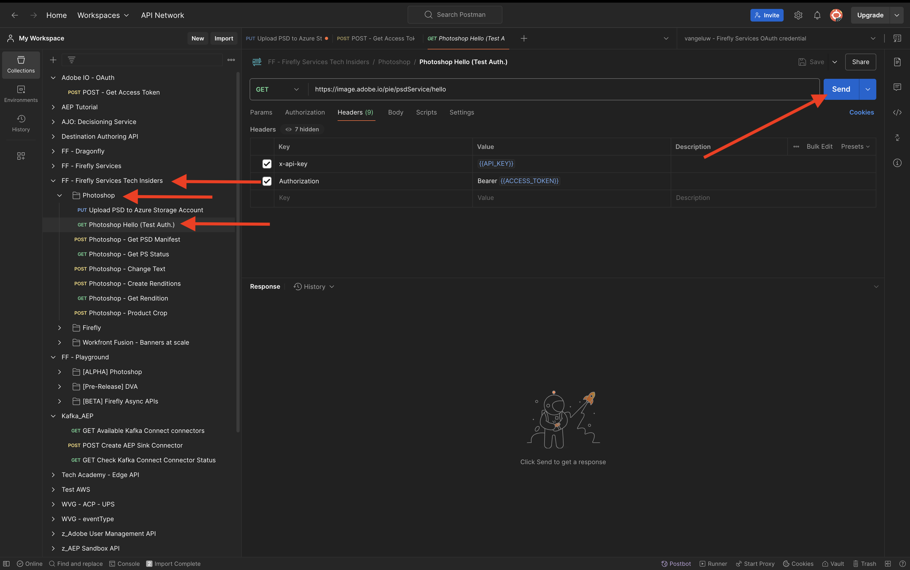
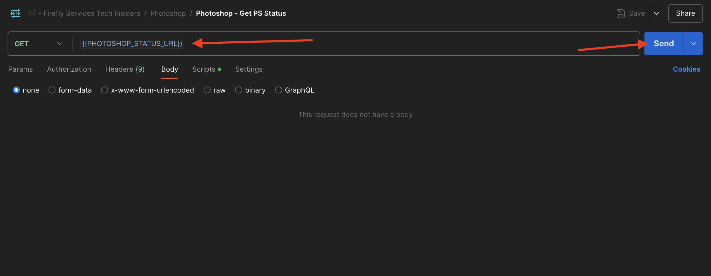

# 1.1.3 Photoshop API の操作

Photoshop API とFirefly Servicesの使用方法について説明します。

## 1.1.3.1 前提条件

この演習を続ける前に、[Adobe I/O プロジェクト ](./../../../modules/getting-started/gettingstarted/ex6.md) の設定を完了し、[Postman](./../../../modules/getting-started/gettingstarted/ex7.md) や [PostBuster](./../../../modules/getting-started/gettingstarted/ex8.md) などの API を操作するアプリケーションも設定しておく必要があります。

## 1.1.3.2 Adobe I/O - access_token

**Adobe I/O - OAuth** コレクションで、「**POST - アクセストークンを取得**」という名前のリクエストを選択し、「**送信**」を選択します。 応答には、新しい **accestoken** を含める必要があります。


## PSD ファイル 1.1.3.3 プログラムで操作する

[citisignal-fiber.psd](./../../../assets/ff/citisignal-fiber.psd){target="_blank"} をデスクトップにダウンロードします。

Photoshopで **citisignal-fiber.psd** を開きます。


**レイヤー** パネルでは、ファイルのデザイナーが各レイヤーに一意の名前を付けました。 PhotoshopでPSD ファイルを開くと、レイヤー情報を表示できますが、プログラムで開くこともできます。

最初の API リクエストをPhotoshop API に送信しましょう。

### Photoshop API - Hello World

次に、Photoshop API のみなさん、すべての権限とアクセス権が正しく設定されているかどうかをテストしましょう。

コレクション **Photoshop** で、リクエスト **Photoshop Hello （テスト認証）を開きます。**。**送信** を選択します。



「Photoshop API へようこそ **という応答が返され** す。


次に、PSD ファイル **citisignal-fiber.psd** をプログラムで操作するには、それをストレージアカウントにアップロードする必要があります。 Azure ストレージエクスプローラーを使用してコンテナに手動でドラッグ&amp;ドロップできますが、今回は API を通じて行う必要があります。

### PSDの Azure へのアップロード

Postmanで、**PSDを Azure ストレージアカウントにアップロード** リクエストを開きます。 前の演習では、Postmanでこれらの環境変数を設定しました。ここでは、これを使用します。

- `AZURE_STORAGE_URL`
- `AZURE_STORAGE_CONTAINER`
- `AZURE_STORAGE_SAS_READ`
- `AZURE_STORAGE_SAS_WRITE`

**PSDを Azure ストレージアカウントにアップロード** リクエストに示すように、URL はこれらの変数を使用するように設定されています。


**Body** で、ファイル **citisignal-fiber.psd** を選択します。


画面は次のようになります。 **送信** を選択します。


この空の応答を Azure から返す必要があります。つまり、ファイルは Azure ストレージアカウントのコンテナに保存されます。


Azure ストレージエクスプローラーを使用してファイルを表示する場合は、必ずフォルダーを更新してください。


### Photoshop API - マニフェストを取得する

次に、PSD ファイルのマニフェストファイルを取得する必要があります。

Postmanで、リクエスト **Photoshop - PSD マニフェストの取得** を開きます。 **本文** に移動します。

本文は次のようになります。

```json
  {
    "inputs": [
      {
        "storage": "external",
        "href": "{{AZURE_STORAGE_URL}}/{{AZURE_STORAGE_CONTAINER}}/citisignal-fiber.psd{{AZURE_STORAGE_SAS_READ}}"
      }
    ],
    "options": {
      "thumbnails": {
        "type": "image/jpeg"
      }
    }
  }
```

**送信** を選択します。

応答に、リンクが表示されます。 Photoshopの操作は完了までに時間がかかる場合があるので、Photoshopでは、ほとんどの受信リクエストに対する応答としてステータスファイルを提供します。 リクエストに何が起こっているかを理解するには、ステータスファイルを読む必要があります。


ステータスファイルを読み取るには、リクエスト **Photoshop - PS ステータスの取得** を開きます。 このリクエストが URL として変数を使用していることを確認できます。この変数は、送信した前のリクエスト（**Photoshop - PSD マニフェストの取得** によって設定された変数です。 変数は、各リクエストの **スクリプト** で設定されます。 **送信** を選択します。



画面は次のようになります。 現在、ステータスは **保留中** に設定されています。これは、プロセスがまだ完了していないことを意味します。


ステータスが **成功** に変わるまで、「**Photoshop - PS ステータスの取得**」でさらに複数回送信を選択します。 これには数分かかることがあります。

応答が使用可能な場合、PSD ファイルのすべてのレイヤーの情報を含んだ json ファイルが表示されます。 レイヤー名やレイヤー ID などを識別できるため、これは役に立つ情報です。


例えば、`2048x2048-cta` というテキストを検索します。 画面は次のようになります。


### Photoshop API - スマートオブジェクトの置換

次に、前の演習の 1 つでFireflyを使用して生成した画像を使用して、citisignal-fiber.psd ファイルの背景を変更する必要があります。

Postmanで、リクエスト **Photoshop - SmartObject Replace を開き****Body** に移動します。

画面は次のようになります。

- まず、入力ファイルを指定します。`citisignal-fiber.psd`
- 次に、変更するレイヤーを指定し、新しい背景ファイルを使用します
- 3 番目に、出力ファイルを指定します。`citisignal-fiber-replacedbg.psd`

```json
  {
    "inputs": [
        {
            "storage": "azure",
            "href": "{{AZURE_STORAGE_URL}}/{{AZURE_STORAGE_CONTAINER}}/citisignal-fiber.psd{{AZURE_STORAGE_SAS_READ}}"
        }
    ],
    "options": {
        "layers": [
            {
                "name": "2048x2048-image",
                "input": {
                    "href": "{{FIREFLY_COMPLETED_ASSET_URL}}",
                    "storage": "external"
                }
            }
        ]
    },
    "outputs": [
        {
            "storage": "azure",
            "href": "{{AZURE_STORAGE_URL}}/{{AZURE_STORAGE_CONTAINER}}/citisignal-fiber-replacedbg.psd{{AZURE_STORAGE_SAS_WRITE}}",
            "type": "vnd.adobe.photoshop",
            "overwrite": true
        }
    ]
}
```

元の入力ファイルを上書きしないので、出力ファイルの名前は異なります。

**送信** を選択します。


前と同じように、応答には、進行状況を追跡するステータスファイルを指すリンクが含まれています。


ステータスファイルを読み取るには、リクエスト **Photoshop - PS ステータスの取得を開き** 「**送信**」を選択します。 ステータスが **成功** に設定されていない場合は、数秒待ってから再度 **送信** を選択します。

出力ファイルのダウンロード URL を選択します。


ファイルをコンピューターにダウンロードした後、**citignal-fiber-replacedbg.psd** を開きます。 背景画像が、次のような同様の画像に変更されたことがわかります。


Azure ストレージエクスプローラーを使用して、コンテナ内でこのファイルを表示することもできます。


### Photoshop API - テキストを変更

次に、API を使用してcall to actionのテキストを変更する必要があります。

Postmanで、リクエスト **Photoshop - Change Text を開き****Body** に移動します。

画面は次のようになります。

- まず、入力ファイル `citisignal-fiber-replacedbg.psd` が指定されます。これは、背景画像を変更したときに前の手順で生成されたファイルです
- 次に、変更するレイヤーを指定し、テキストを変更します。
- 3 番目に、出力ファイルを指定します。`citisignal-fiber-changed-text.psd`

```json
  {
  "inputs": [
    {
      "storage": "external",
      "href": "{{AZURE_STORAGE_URL}}/{{AZURE_STORAGE_CONTAINER}}/citisignal-fiber-replacedbg.psd{{AZURE_STORAGE_SAS_READ}}"
    }
  ],
  "options": {
    "layers": [
      {
        "name": "2048x2048-cta",
        "text": {
          "content": "Get Fiber now!"
        }
      }
    ]
  },
  "outputs": [
    {
      "storage": "azure",
      "href": "{{AZURE_STORAGE_URL}}/{{AZURE_STORAGE_CONTAINER}}/citisignal-fiber-changed-text.psd{{AZURE_STORAGE_SAS_WRITE}}",
      "type": "vnd.adobe.photoshop",
      "overwrite": true
    }
  ]
}
```

元の入力ファイルを上書きしないので、出力ファイルの名前は異なります。

**送信** を選択します。


前と同じように、応答には、進行状況を追跡するステータスファイルを指すリンクが含まれています。


ステータスファイルを読み取るには、リクエスト **Photoshop - PS ステータスの取得を開き** 「**送信**」を選択します。 ステータスが **成功** に設定されていない場合は、数秒待ってから再度 **送信** を選択します。

出力ファイルのダウンロード URL を選択します。


ファイルをコンピューターにダウンロードしたら、**citisignal-fiber-changed-text.psd** を開きます。 call to actionのプレースホルダーが「Get Fibre now **というテキストに置き換えられていることが確認でき** す。


Azure ストレージエクスプローラーを使用して、コンテナ内でこのファイルを表示することもできます。


## 次の手順

[Firefly カスタムモデル API](./ex4.md){target="_blank"} に移動します

[Adobe Firefly Servicesの概要 ](./firefly-services.md){target="_blank"} に戻る

[ すべてのモジュール ](./../../../overview.md){target="_blank"} に戻る