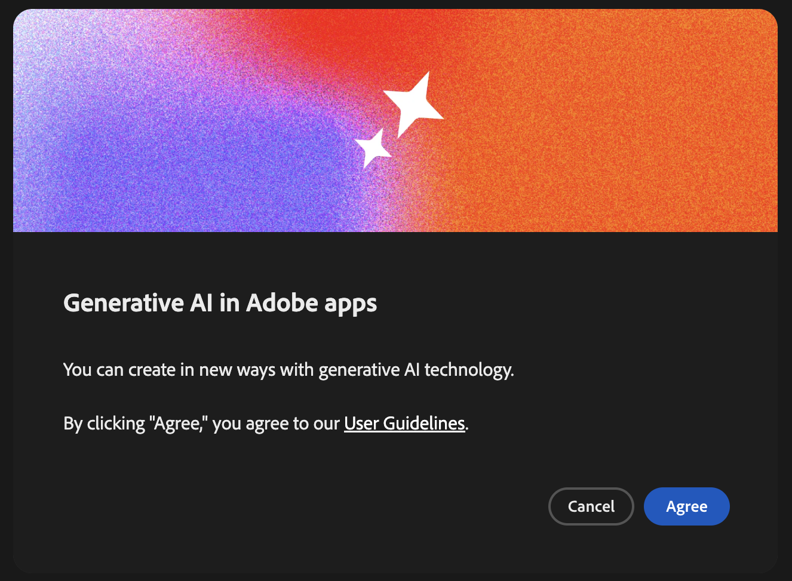
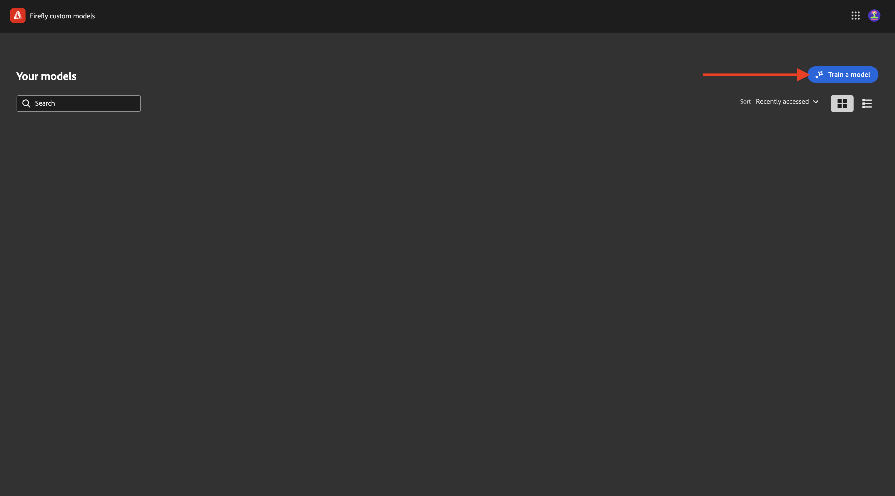
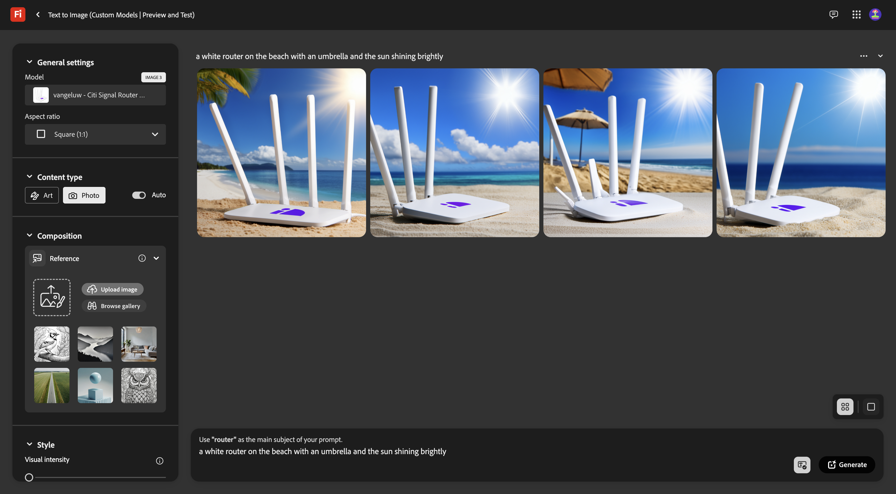

# 1.1.4 Firefly カスタムモデル API

## 1.1.4.1 Firefly カスタムモデルとは

Fireflyのカスタムモデルを使用すると、「テキストから画像へ」機能を使用して、ブランドに合った画像のバリエーションを生成できます。 これらのモデルを独自の画像でトレーニングすることで、ブランドの ID を反映したコンテンツを生成できます。
スタイルやテーマを変換して、新しいアイデアを探索し、様々な環境を視覚化し、革新的なコンテンツを生成し、特定のセグメントに合わせてコンテンツを調整します。

Fireflyのカスタムモデルを使用すると、次のことができます。

- オンブランドのアイデアと概念の作成
- 一貫したスタイルで文字テーマを作成する
- 一貫したブランドスタイルを作成して、キャンペーンを迅速に展開

これを実現するために、Firefly カスタムモデルでは次の機能をサポートしています。

- カスタム件名モデル
- カスタムスタイルモデル

### カスタム件名モデル

特定の対象（オブジェクトやキャラクターなど）に対してカスタムモデルをトレーニングする場合、対象の基本的な機能を特定し、モデルがさまざまなコンテキストや位置でそれらを複製できるようにすることが目標になります。

被写体モデルをトレーニングする際には、次のような特徴を持つ画像を探します。

- オブジェクトの一貫性：被写体と同じメーカーとモデルの画像を提供しながら、被写体が画像間で大きく異なって見えないようにします。 複数の色を混在させず、画像間で共通のテーマやパターンを使用します。 ただし、被写体はシーン、ポーズ、服装、背景によって異なることがあります。
- 被写体にピントを合わせる：被写体に不必要な障害物を与えることなく、ピントを合わせて撮影できます。 被写体を画像の中央付近に置き、画像の面積の 25% 以上を被写体が占めるようにします。
- 環境コンテキスト：さまざまなビューやコンテキストで被写体の画像を提供し、さまざまな照明条件で表示します。 背景が白または透明の画像も使用できますが、より複雑な周囲の画像と混在させることをお勧めします。
- 他のオブジェクトを避ける：背景やキャラクターに関連付けられた大きなアイテムは避けます。 画像に表示される大きな項目はすべてモデルに記憶され、トレーニングデータセットの同じ項目と同様に、生成された画像に表示されます。

### カスタムスタイルモデル

スタイルに基づいてトレーニングされたカスタムモデルは、アセットのルックアンドフィールを識別し、プロンプトが表示されたときに類似の画像を生成します。

有効なスタイル モデルをトレーニングするには：

- 同じような美学を提供：同じルックアンドフィールを維持しながら、様々なシーンやオブジェクトを示す画像を含めます。
- 様々な画像を使用する：不要なオブジェクトや被写体にモデルが焦点を当てすぎないようにするには、できるだけ多くの画像を使用します。
- 固定フレーズの使用は避ける：固定パターンは、他のフレーズよりも重みが大きくなります。 例えば、すべてのキャプションに「背景が黒ベタ塗り」または「かわいい漫画のスタイル」が含まれる場合、モデルはこのフレーズに依存し、このフレーズを使用していないテストプロンプトでは望ましい結果が生成されません。

## カスタムモデルを設定で 1.1.4.2 ます

[https://firefly.adobe.com/](https://firefly.adobe.com/) に移動します。 **カスタムモデル** をクリックします。

{zoomable="yes"}

このメッセージが表示される場合があります。 同意する場合は、「**同意する**」をクリックして続行します。

{zoomable="yes"}

この画像が表示されます。 **モデルのトレーニング** をクリックします。

{zoomable="yes"}

次のフィールドを設定します。

- **名前**：使用する `--aepUserLdap-- - Citi Signal Router Model`
- **トレーニングモード**:**件名（テクニカルプレビュー）** を選択
- **概念**:`router` を入力します。
- **保存先**：ドロップダウンリストを開いて、「**+新規プロジェクトを作成」をクリックします**

{zoomable="yes"}

新しいプロジェクトに `--aepUserLdap-- - Custom Models` という名前を付けます。 「**作成**」をクリックします。

{zoomable="yes"}

この画像が表示されます。 「**続行**」をクリックします。

{zoomable="yes"}

ここで、トレーニングするカスタムモデルの参照画像を指定する必要があります。 **コンピューターから画像を選択** をクリックします。

{zoomable="yes"}

参照画像を [&#x200B; こちら &#x200B;](https://one-adobe-tech-insiders.s3.us-west-2.amazonaws.com/CitiSignal_router.zip) からダウンロードします。 ダウンロードファイルを解凍すると、次の情報が得られます。

{zoomable="yes"}

ダウンロード画像ファイルを含むフォルダーに移動します。 それらをすべて選択し、「**開く** をクリックします。

{zoomable="yes"}

その後、画像が読み込まれていることがわかります。

{zoomable="yes"}

数分後、画像は正しく読み込まれます。 一部の画像にエラーが表示される場合があります。これは、画像のキャプションが生成されていないか、十分な長さがないことが原因です。 各画像をエラーで確認し、要件を満たしてその画像を説明するキャプションを入力します。

{zoomable="yes"}

すべての画像のキャプションが要件を満たしたら、サンプルプロンプトを指定する必要があります。 &#39;router&#39;という単語を使用するプロンプトを入力します。 完了したら、モデルのトレーニングを開始できます。 **トレーニング** をクリックします。

{zoomable="yes"}

その後、これが表示されます。 モデルのトレーニングには、20～30 分以上かかる場合があります。

{zoomable="yes"}

20 ～ 30 分後に、モデルのトレーニングが完了し、公開できるようになります。 「**公開**」をクリックします。

{zoomable="yes"}

もう一度 **公開** をクリックします。

{zoomable="yes"}

**カスタムモデルを共有** ポップアップを閉じます。

{zoomable="yes"}

## UI1.1.4.3 カスタムモデルを使用するには

[https://firefly.adobe.com/cme/train](https://firefly.adobe.com/cme/train) に移動します。 カスタムモデルをクリックして開きます。

{zoomable="yes"}

**プレビューとテスト** をクリックします。

{zoomable="yes"}

次に、実行前に入力したサンプルプロンプトが表示されます。

{zoomable="yes"}

## 1.1.4.4 Firefly Services カスタムモデル API に対してカスタムモデルを有効にする

カスタムモデルは、トレーニングが完了すると、API から使用することもできます。 演習 1.1.1 では、API を使用してFirefly Servicesとやり取りできるようにAdobe I/O プロジェクトを既に設定しています。

[https://firefly.adobe.com/cme/train](https://firefly.adobe.com/cme/train) に移動します。 カスタムモデルをクリックして開きます。

{zoomable="yes"}

3 つのドット **...** をクリックし、「**共有**」をクリックします。

{zoomable="yes"}

Firefly カスタムモデルにアクセスするには、カスタムモデルをAdobe I/O プロジェクトの **テクニカルアカウントメール** に共有する必要があります。

**テクニカルアカウントのメール** を取得するには、[https://developer.adobe.com/console/projects](https://developer.adobe.com/console/projects) にアクセスしてください。 クリックして、`--aepUserLdap-- One Adobe tutorial` という名前のプロジェクトを開きます。

{zoomable="yes"}

**OAuth サーバー間** をクリックします。

{zoomable="yes"}

**テクニカルアカウントのメールアドレス** をクリックしてコピーします。

{zoomable="yes"}

**テクニカルアカウントのメール** を貼り付け、「**編集に招待**」をクリックします。

{zoomable="yes"}

**テクニカルアカウントメール** からカスタムモデルにアクセスできるようになりました。

{zoomable="yes"}

## Firefly Services カ 1.1.4.5 タムモデル API の操作

演習 1.1.1 Firefly Servicesの概要では、[postman-ff.zip](./../../../assets/postman/postman-ff.zip) をローカルデスクトップにダウンロードして、そのコレクションをPostmanに読み込みました。

Postmanを開き、フォルダー **FF - カスタムモデル API** に移動します。

{zoomable="yes"}

リクエスト **1 を開きます。 FF - getCustomModels** と **送信** をクリックします。

{zoomable="yes"}

応答の一部として、以前に作成したカスタムモデル（`--aepUserLdap-- - Citi Signal Router Model` という名前）が表示されます。 フィールド **assetId** は、カスタムモデルの一意の識別子で、次のリクエストで参照されます。

{zoomable="yes"}

リクエスト **2 を開きます。 画像を非同期で生成**. この例では、2 つのバリエーションをカスタムモデルに基づいて生成するようにリクエストします。 この場合は `a white router on a volcano in Africa` のプロンプトを自由に更新してください。

「**送信**」をクリックします。

{zoomable="yes"}

応答には、フィールド **jobId** が含まれています。 これらの 2 つの画像を生成するジョブを実行中です。次のリクエストを使用してステータスを確認できます。

{zoomable="yes"}

リクエスト **3 を開きます。 CM のステータスを取得し** 「送信 **をクリック** ます。 ステータスが実行中に設定されていることがわかります。

{zoomable="yes"}

数分後、リクエスト **3 で再度** 送信 **をクリックします。 CM ステータスの取得**. すると、ステータスが **succeeded** に変更され、出力の一部として 2 つの画像 URL が表示されます。 クリックして両方のファイルを開きます。

{zoomable="yes"}

これは、この例で生成された最初の画像です。

{zoomable="yes"}

これは、この例で生成された 2 番目の画像です。

{zoomable="yes"}

これで、この演習が完了しました。

## 次の手順

[&#x200B; 概要とメリット &#x200B;](./summary.md){target="_blank"} に移動します。

[Photoshop API の操作 &#x200B;](./ex3.md){target="_blank"} に戻る

[Adobe Firefly Servicesの概要 &#x200B;](./firefly-services.md){target="_blank"} に戻る
