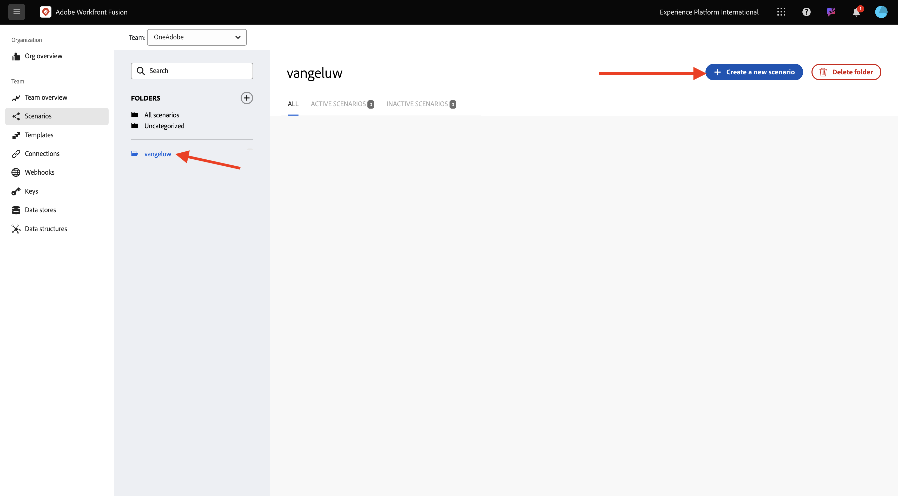
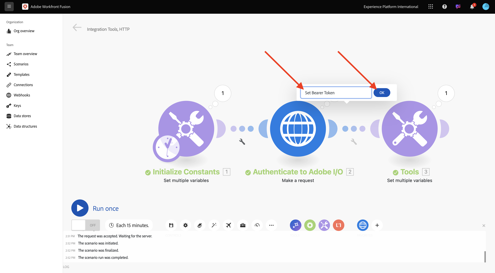

# 1.2.1 Workfront Fusion の概要

Workfront Fusion とAdobe I/Oを使用してAdobe Firefly Services API をクエリする方法を説明します。

## 1.2.1.1 新しいシナリオを作成

[https://experience.adobe.com/](https://experience.adobe.com/){target="_blank"} に移動します。 **Workfront Fusion** を開きます。

**シナリオ** に移動します。

**+ アイコンをクリックして** 作業用の新しいフォルダーを作成します。

フォルダーに `--aepUserLdap--` という名前を付け、「**保存**」を選択します。

フォルダーを選択し、「**新しいシナリオを作成**」を選択します。

空のシナリオが表示されるので、「**ツール**」を選択し、「**複数の変数を設定**」を選択します。

**clock** アイコンを、新しく追加された **複数の変数を設定** の上に移動します。

画面は次のようになります。

疑問符を右クリックし、「**モジュールを削除**」を選択します。

次に、「複数の変数を設定 **を右クリックし** 「**設定**」を選択します。

## Adobe I/O認証 1.2.1.2 設定するには

次に、Adobe I/Oに対して認証するために必要な変数を設定する必要があります。前の演習では、Adobe I/O プロジェクトを作成しました。 Workfront Fusion で、そのAdobe I/O プロジェクトの変数を定義する必要があります。

以下の変数を定義する必要があります。

| キー | 値 |
|:-------------:| :---------------:| 
| `CONST_client_id` | Adobe I/O プロジェクトのクライアント ID |
| `CONST_client_secret` | Adobe I/O プロジェクトのクライアント秘密鍵 |
| `CONST_scope` | Adobe I/O プロジェクトの範囲 |

これらの変数を見つけるには、[https://developer.adobe.com/console/projects](https://developer.adobe.com/console/projects){target="_blank"} に移動して、`--aepUserLdap-- One Adobe tutorial` という名前のAdobe I/O プロジェクトを開きます。

プロジェクトで、「**OAuth サーバー間**」を選択して、上記のキーの値を確認します。

上記のキーと値を使用して、**複数の変数を設定** オブジェクトを設定できます。 **項目を追加** を選択します。

**変数名**:**CONST_client_id** とその **変数値** を入力し、「**追加**」を選択します。

**項目を追加** を選択します。

**変数名**:**CONST_client_secret** とその **変数値** を入力し、「**追加**」を選択します。

**項目を追加** を選択します。

**変数名**:**CONST_scope** とその **変数値** を入力し、「**追加**」を選択します。

**OK** を選択します。

**複数の変数を設定** にポインタを合わせ、大きな **+** アイコンを選択して別のモジュールを追加します。

画面は次のようになります。

検索バーに「**http**」と入力します。 **HTTP** を選択して開きます。

「**リクエストを行う**」を選択します。

| キー | 値 |
|:-------------:| :---------------:| 
| `URL` | `https://ims-na1.adobelogin.com/ims/token/v3` |
| `Method` | `POST` |
| `Body Type` | `x-www-form-urlencoded` |

**項目を追加** を選択します。

次の各値の項目を追加します。

| キー | 値 |
|:-------------:| :---------------:| 
| `client_id` | `CONST_client_id` 用の事前定義済みの変数 |
| `client_secret` | `CONST_client_secret` 用の事前定義済みの変数 |
| `scope` | `CONST_scope` 用の事前定義済みの変数 |
| `grant_type` | `client_credentials` |

`client_id` の設定：

`client_secret` の設定。

`scope` の設定。

`grant_type` の設定。

下にスクロールして、「応答を解析 **チェックボックスをオンに** ます。 **OK** を選択します。

画面は次のようになります。 **1 回実行** を選択します。

シナリオが実行されると、画面は次のようになります。

**複数の変数を設定** オブジェクトの **疑問符** アイコンを選択して、そのオブジェクトが実行されたときに何が起こったかを確認します。

**HTTP - リクエストを行う** オブジェクトの **疑問符** アイコンを選択して、そのオブジェクトが実行されたときに何が起こったかを確認します。 **OUTPUT** で、Adobe I/Oから返される **access_token** を参照してください。

**HTTP - リクエストを行う** にポインタを合わせ、「**+**」アイコンを選択して別のモジュールを追加します。

検索バーで `tools` を検索します。 **ツール** を選択します。

「**複数の変数を設定**」を選択します。

**項目を追加** を選択します。

**変数名** を `bearer_token` に設定します。 動的な **変数値** として「`access_token`」を選択します。 「**追加**」を選択します。

画面は次のようになります。 **OK** を選択します。

**もう一度実行** を選択します。

シナリオを実行したら、最後の **複数の変数を設定** オブジェクトの **疑問符** アイコンを選択します。 access_token が変数 `bearer_token` に格納されていることがわかります。

次に、最初のオブジェクトを右クリックし **複数の値を設定**、「名前を変更 **を選択し** す。

名前を **定数を初期化** に設定します。 **OK** を選択します。

2 番目のオブジェクトの名前を **Adobe I/Oに対する認証** に変更します。 **OK** を選択します。

3 番目のオブジェクトの名前を **ベアラートークンを設定** に変更します。 **OK** を選択します。

画面は次のようになります。

次に、シナリオの名前を `--aepUSerLdap-- - Adobe I/O Authentication` に変更します。

「**保存**」を選択します。

## 次の手順

[Workfront Fusion 内でのAdobe API の使用 ](./ex2.md){target="_blank"} に移動します。

[Workfront Fusion のCreative Workflow Automation に戻る ](./automation.md){target="_blank"}

[ すべてのモジュール ](./../../../overview.md){target="_blank"} に戻る
