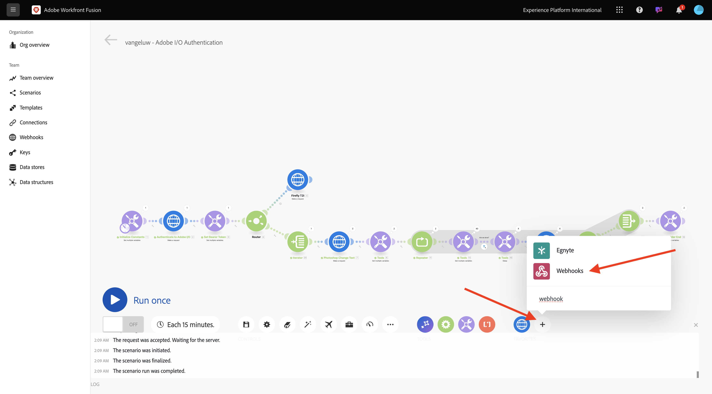
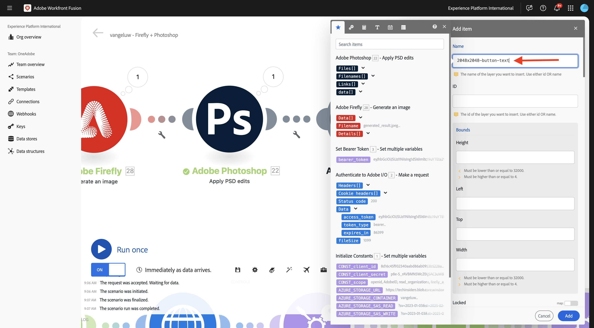
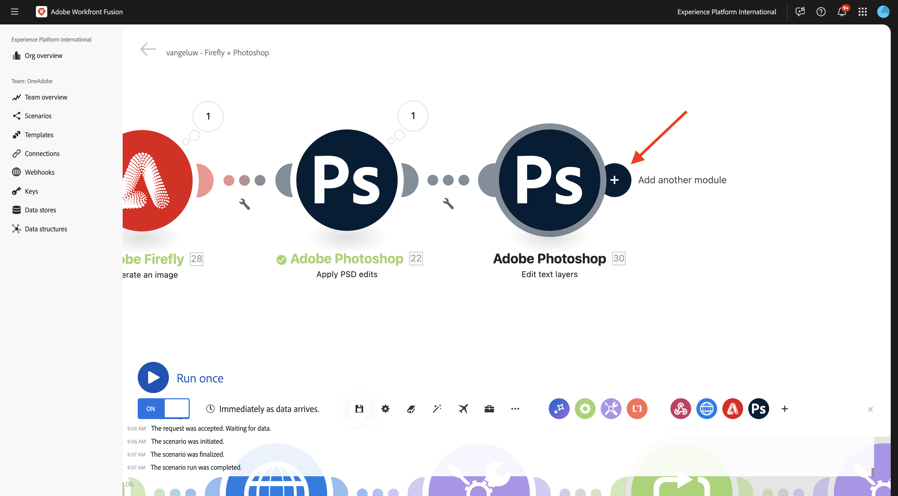
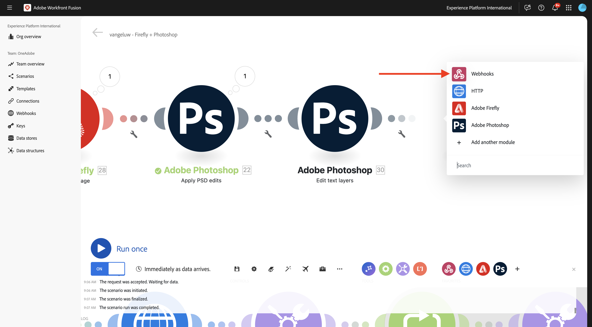

# 1.2.4 コネクタを使用した自動化

次に、Photoshop用Workfront Fusion の標準コネクタの使用を開始し、Firefly Text-2-Image リクエストとPhotoshop リクエストを 1 つのシナリオに接続します。

## 1.2.4.1 変数の更新

コネクタのセットアップを続行する前に、次の変数を **Initialize Constants** モジュールに追加する必要があります。

- `AZURE_STORAGE_URL`
- `AZURE_STORAGE_CONTAINER`
- `AZURE_STORAGE_SAS_READ`
- `AZURE_STORAGE_SAS_WRITE`

最初のノードに戻り、「**定数を初期化**」を選択し、次にこれらの変数ごとに **項目を追加** を選択します。


| キー | 値の例 |
|:-------------:| :---------------:| 
| `AZURE_STORAGE_URL` | `https://vangeluw.blob.core.windows.net` |
| `AZURE_STORAGE_CONTAINER` | `vangeluw` |
| `AZURE_STORAGE_SAS_READ` | `?sv=2023-01-03&st=2025-01-13T07%3A36%3A35Z&se=2026-01-14T07%3A36%3A00Z&sr=c&sp=rl&sig=4r%2FcSJLlt%2BSt9HdFdN0VzWURxRK6UqhB8TEvbWkmAag%3D` |
| `AZURE_STORAGE_SAS_WRITE` | `?sv=2023-01-03&st=2025-01-13T17%3A21%3A09Z&se=2025-01-14T17%3A21%3A09Z&sr=c&sp=racwl&sig=FD4m0YyyqUj%2B5T8YyTFJDi55RiTDC9xKtLTgW0CShps%3D` |

変数を見つけるには、Postmanに戻って **環境変数** を開きます。


これらの値をWorkfront Fusion にコピーし、これら 4 つの変数のそれぞれに新しい項目を追加します。

画面は次のようになります。 **OK** を選択します。


## Webhook1.2.4.2 使用してシナリオをアクティブ化するには

これまでのところ、シナリオを手動で実行してテストしてきました。 次に、Webhook を使用してシナリオを更新し、外部環境からアクティブ化できるようにします。

**+** を選択し、**Webhook** を検索してから **Webhook** を選択します。



**Custom Webhook** を選択します。


**Custom Webhook** モジュールをシナリオの最初にドラッグします。 次に、「**clock**」アイコンを選択し、「**Custom Webhook**」モジュールにドラッグします。


この画像が表示されます。 次に、最初のモジュールの赤い点を、2 番目のモジュールの紫色の点に向かってドラッグします。


この画像が表示されます。 新規、「**カスタム Webhook**」モジュールをクリックします。


「**追加**」をクリックします。


**Webhook 名** を `--aepUserLdap-- - Firefly + Photoshop Webhook` に設定します。 「**保存**」をクリックします。


これで、Webhook URL が使用できるようになります。 **アドレスをクリップボードにコピー** をクリックして、URL をコピーします。


Postmanを開き、コレクションに新しいフォルダーを追加します **FF - Firefly Services テクニカルインサイダー**。


フォルダーに `--aepUserLdap-- - Workfront Fusion` という名前を付けます。


先ほど作成したフォルダーで、3 つのドット **...** を選択し、「**リクエストを追加**」を選択します。


**メソッドタイプ** を **POST** に設定し、Webhook の URL をアドレスバーに貼り付けます。


変数要素を外部ソースからWorkfront Fusion シナリオに提供できるように、カスタム本文を送信する必要があります。

**本文** に移動し、「**生**」を選択します。


以下のテキストをリクエストの本文に貼り付けます。 **送信** を選択します。

```json
{
    "psdTemplate": "citisignal-fiber.psd",
    "xlsFile": "placeholder",
    "prompt":"misty meadows",
    "cta": "Buy this now!",
    "button": "Click here to buy!"
}
```


Workfront Fusion に戻ると、カスタム Webhook に「**正常に決定されました**」というメッセージが表示されます。


## 1.2.4.3 Adobe Firefly コネクタ

**+** アイコンをクリックして、新しいモジュールを追加します。


検索語句 `Adobe Firefly` を入力し、「**Adobe Firefly**」を選択します。


**画像を生成** を選択します。


**Adobe Firefly** モジュールをクリックして開き、「**追加**」をクリックして新しい接続を作成します。


次のフィールドに入力します。

- **接続名**:`--aepUserLdap-- - Firefly connection` を使用します。
- **環境**: **実稼動** を使用します。
- **タイプ**: **個人用アカウント** を使用します。
- **クライアント ID**:**という名前のAdobe I/O プロジェクトから** クライアント ID`--aepUserLdap-- - One Adobe tutorial` をコピーします。
- **クライアント秘密鍵**: **クライアント秘密鍵** を `--aepUserLdap-- - One Adobe tutorial` という名前のAdobe I/O プロジェクトからコピーします。

Adobe I/O プロジェクトの **クライアント ID** と **クライアントシークレット** は、（こちら [ で確認でき ](https://developer.adobe.com/console/projects.){target="_blank"} す。


すべてのフィールドに入力したら、「**続行**」をクリックします。 すると、接続が自動的に検証されます。


次に、受信した **Custom Webhook** によってシナリオに提供される **prompt** 変数を選択します。


**モデルバージョン** **プロンプト** を **image4 standard** に設定します。 「**OK**」をクリックします。


「**保存**」をクリックして変更を保存し、「**1 回実行**」をクリックして設定をテストします。


Postmanに移動し、リクエストのプロンプトを確認して、「**送信**」をクリックします。


「送信」をクリックしたら、Workfront Fusion に戻り、**Adobe Firefly** モジュールのバブルアイコンをクリックして詳細を確認します。


**OUTPUT** から **Details** / **url** に移動し、**Adobe Firefly** で生成された画像の URl を見つけます。


URL をコピーして、ブラウザーで貼り付けます。 Postman リクエストから送信されたプロンプト（この場合は **Misty Meadows** を表す画像が表示されます。


## 1.2.4.2 PSD ファイルの背景の変更

次に、標準搭載のコネクタを使用してシナリオを更新し、よりスマートにします。 また、Fireflyからの出力をFireflyに接続して、Photoshopの「画像を生成」アクションからの出力を使用してPSD ファイルの背景画像が動的に変化するようにします。

この画像が表示されます。 次に、**Adobe Firefly** モジュールにポインタを合わせて、「**+**」アイコンをクリックします。


検索メニューで、「`Photoshop`」と入力して「**Adobe Photoshop**」アクションをクリックします。


**PSDの編集内容を適用** を選択します。


この画像が表示されます。 **追加** をクリックして、Adobe Photoshopへの新しい接続を追加します。


次のように接続を設定します。

- 接続の種類：**Adobe Photoshop （サーバー間）を選択してください**
- 接続名：`--aepUserLdap-- - Adobe I/O` と入力します
- クライアント ID: クライアント ID を貼り付けます
- クライアント秘密鍵：クライアント秘密鍵を貼り付けます

「**続行**」をクリックします。


**クライアント ID** と **クライアントシークレット** を見つけるには、[https://developer.adobe.com/console/home](https://developer.adobe.com/console/home){target="_blank"} に移動し、`--aepUserLdap-- One Adobe tutorial` という名前のAdobe I/O プロジェクトを開きます。 **OAuth サーバー間** に移動して、クライアント ID とクライアントシークレットを検索します。 これらの値をコピーして、Workfront Fusion の接続設定に貼り付けます。


**続行** をクリックすると、資格情報の検証中にポップアップウィンドウが短時間表示されます。 完了したら、次の画面が表示されます。


次に、Fusion で操作するPSD ファイルの場所を入力する必要があります。 **ストレージ** には **Azure** を選択し、**ファイルの場所** には `{{1.AZURE_STORAGE_URL}}/{{1.AZURE_STORAGE_CONTAINER}}/{{1.AZURE_STORAGE_SAS_READ}}` と入力します。 2 番目の `/` の隣にカーソルを置きます。 次に、使用可能な変数を確認し、下にスクロールして変数 **psdTemplate** を見つけます。 変数 **psdTemplate** をクリックして選択します。


この画像が表示されます。


**レイヤー** が表示されるまで下にスクロールします。 **項目を追加** をクリックします。


この画像が表示されます。 次に、ファイルの背景に使用するPhotoshop PSD テンプレートのレイヤーの名前を入力する必要があります。


**citisignal-fiber.psd** ファイルには、背景に使用するレイヤーがあります。 この例では、レイヤーの名前は **2048 x 2048-background** です。


Workfront Fusion ダイアログに、**2048x2048-background** という名前を貼り付けます。


**入力** が表示されるまで下にスクロールします。 ここで、背景レイヤーに挿入する必要があるものを定義する必要があります。 この場合、動的に生成された画像を含む **Adobe Firefly** モジュールの出力を選択する必要があります。

**ストレージ** については、「**外部**」を選択します。 **ファイルの場所** の場合は、`{{XX.details[].url}}`Adobe Firefly **モジュールの出力から変数** をコピーして貼り付ける必要がありますが、変数内の **XX** を、**Adobe Firefly** モジュールのシーケンス番号（この例では **5**）に置き換える必要があります。


次に、**編集** が表示されるまで下にスクロールします。 **編集** を **はい** に設定し、**タイプ** を **レイヤー** に設定します。 「**追加**」をクリックします。


この画像が表示されます。 次に、アクションの出力を定義する必要があります。 **output** の下の **項目を追加** をクリックします。


**ストレージ** の場合は **Azure** を選択し、この `{{1.AZURE_STORAGE_URL}}/{{1.AZURE_STORAGE_CONTAINER}}/citisignal-fiber-replacedbg.psd{{1.AZURE_STORAGE_SAS_WRITE}}` を **ファイルの場所** の下に貼り付けて、**タイプ** の下の **vnd.adobe.photoshop** を選択します。 クリックして **詳細設定を表示** を有効にします。


[**詳細設定**] で、[**はい**] を選択して、同じ名前のファイルを上書きします。
「**追加**」をクリックします。


これで完了です。 「**OK**」をクリックします。


「**保存**」をクリックして変更を保存し、「**1 回実行**」をクリックして設定をテストします。


Postmanに移動し、リクエストのプロンプトを確認して、「**送信**」をクリックします。


この画像が表示されます。 **Adobe Photoshop - PSDの編集を適用** モジュールのバブルをクリックします。


新しいPSD ファイルが正常に生成され、Microsoft Azure ストレージアカウントに保存されたことを確認できます。


## 1.2.4.3 PSD ファイルのテキストレイヤーの変更

次に、**Adobe Photoshop - PSDの編集を適用** モジュールにカーソルを合わせ、「**+**」アイコンをクリックします。


「**Adobe Photoshop**」を選択します。


**テキストレイヤーを編集** を選択します。


この画像が表示されます。 まず、以前に設定済みのAdobe Photoshop接続を選択します（`--aepUserLdap-- Adobe I/O` という名前にする必要があります）。


**入力ファイル** の場合、「入力ファイルストレージ **に** Azure **** を選択し、前のリクエストの出力を必ず選択してください **Adobe Photoshop - PSDの編集を適用**。次のように定義できます。``{{XX.data[].`_links`.renditions[].href}}`` （XX を前のモジュールのシーケンス番号に置き換えます。Adobe Photoshop - PSDの編集を適用）

次に、**レイヤー** の下の「**+項目を追加**」をクリックして、更新する必要があるテキストレイヤーの追加を開始します。


2 つの変更を加える必要があります。ファイル **citisignal-fiber.psd** 内のCTA テキストとボタンテキストを更新する必要があります。

レイヤー名を見つけるには、ファイル **citisignal-fiber.psd** を開きます。 ファイルには、call to actionを含むレイヤーの名前が **2048 x 2048-cta** になっていることがわかります。


ファイル **citisignal-fiber.psd** 内で、call to actionを含むレイヤーの名前が **2048x2048-button-text** になっていることにも注目してください。


まず、レイヤー **2048 x 2048-cta** に対して行う必要がある変更を設定する必要があります。 ダイアログの **名前** の下に、**2048x2048-cta** と入力します。


下にスクロールして **テキスト**/**コンテンツ** を表示します。 Webhook ペイロードから変数 **cta** を選択します。 「**追加**」をクリックします。


この画像が表示されます。 **レイヤー** の下の「**+項目を追加**」をクリックして、更新する必要がある次のテキストレイヤーの追加を開始します。


ダイアログの **Name** の下に、名前 **2048x2048-button-text** を入力します。



下にスクロールして **テキスト**/**コンテンツ** を表示します。 Webhook ペイロードから変数 **button** を選択します。 「**追加**」をクリックします。


この画像が表示されます。


**出力** が表示されるまで下にスクロールします。 **ストレージ** については、「**Azure**」を選択します。 **ファイルの場所** には、次の場所を入力します。 生成される各ファイルの名前が必ず一意になるようにするために使用されるファイル名に、変数 `{{timestamp}}` が追加されることに注意してください。 また、**タイプ** を **vnd.adobe.photoshop** に設定します。

`{{1.AZURE_STORAGE_URL}}/{{1.AZURE_STORAGE_CONTAINER}}/citisignal-fiber-changed-text-{{timestamp}}.psd{{1.AZURE_STORAGE_SAS_WRITE}}`

**タイプ** を **vnd.adobe.photoshop** に設定します。 「**OK**」をクリックします。


「**保存**」をクリックして変更を保存します。


## 1.2.4.4 Webhook 応答

これらの変更をPhotoshop ファイルに適用した後、次に **Webhook レスポンス** を設定する必要があります。

モジュール **Adobe Photoshop - テキストレイヤーを編集にカーソルを合わせ** 「**+**」アイコンをクリックしてください。



`webhooks` を検索し、「**Webhook**」を選択します。



**Webhook 応答** を選択します。


この画像が表示されます。 以下のペイロードを **本文** に貼り付けます。

```json
{
    "newPsdTemplate": ""
}
```


変数 `{{XX.data[]._links.renditions[].href}}` をコピーして貼り付け、**XX** を最後の **Adobe Photoshop - テキストレイヤーを編集** モジュール（この場合は **7** のシーケンス番号に置き換えます。


**詳細設定を表示** のチェックボックスを有効にして、「**項目を追加**」をクリックします。


「**キー**」フィールドに「`Content-Type`」と入力します。 **値** フィールドに「`application/json`」と入力します。 「**追加**」をクリックします。


これで完了です。 「**OK**」をクリックします。


**自動整列** をクリックします。


この画像が表示されます。 「**保存**」をクリックして変更を保存し、「**1 回実行**」をクリックしてシナリオをテストします。


Postmanに戻り、「**送信**」をクリックします。 ここで使用されているプロンプトは **霧の深い牧草地** です。


その後、シナリオがアクティブ化され、しばらくすると、新しく作成されたPSD ファイルの URL を含むレスポンスがPostmanに表示されます。


注意：Workfront Fusion でシナリオを実行したら、各モジュールの上にあるバブルをクリックすると、各モジュールに関する情報を確認できます。


Azure ストレージエクスプローラーを使用すると、Azure ストレージエクスプローラー内で新しく作成したPSD ファイルをダブルクリックして、ファイルを探して開くことができます。


これでファイルは次のようになります。背景は **misty meadows** です。


シナリオを再度実行し、別のプロンプトを使用してPostmanから新しいリクエストを送信すると、シナリオが簡単で再利用可能になったことがわかります。 この例では、新しく使用するプロンプトは **sunny desert** です。


数分後、新しい背景を持つ新しいPSD ファイルが生成されました。


## 次の手順

[1.2.3 Frame.io とWorkfront Fusion に移動します ](./ex3.md){target="_blank"}

[Workfront Fusion のCreative Workflow Automation に戻る ](./automation.md){target="_blank"}

[ すべてのモジュール ](./../../../overview.md){target="_blank"} に戻る
