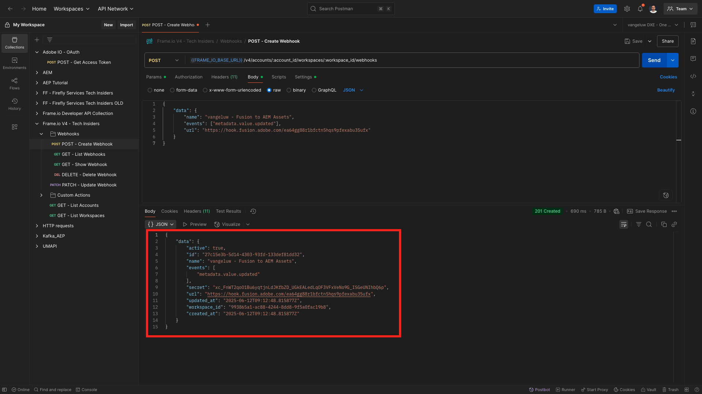
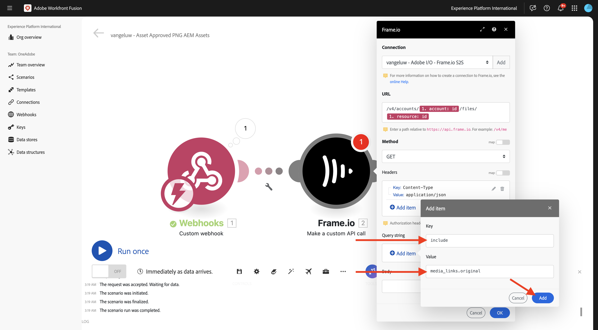
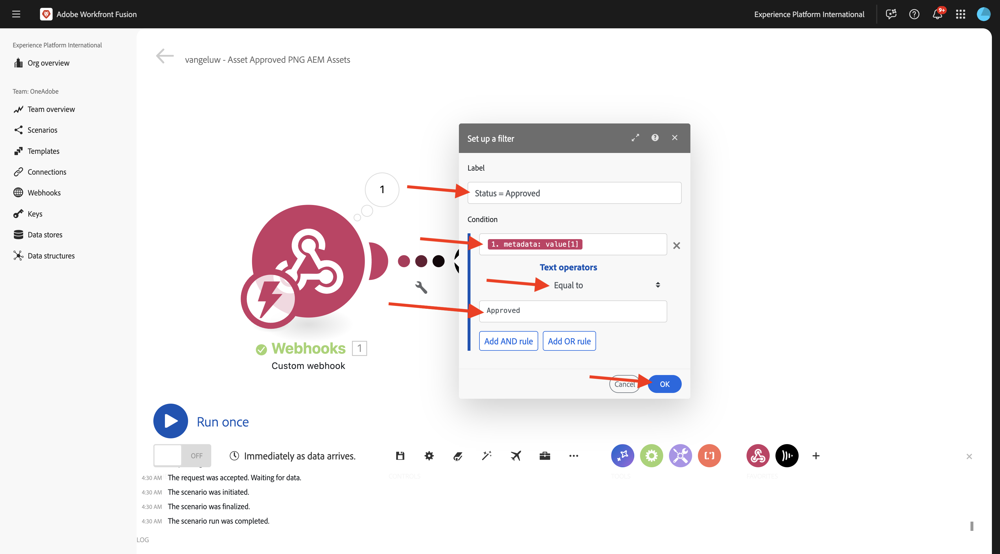
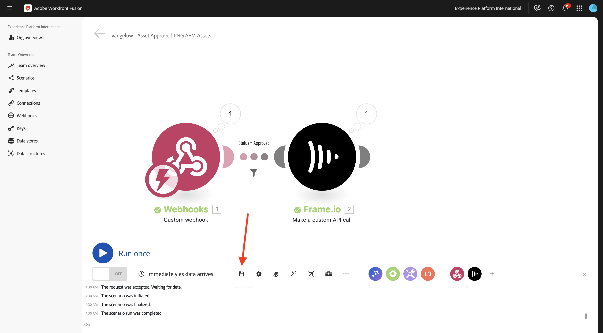
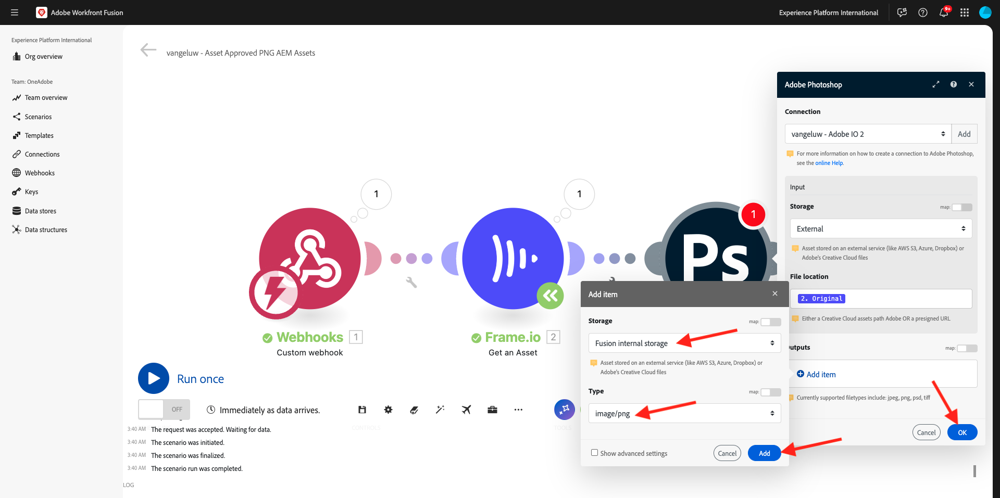
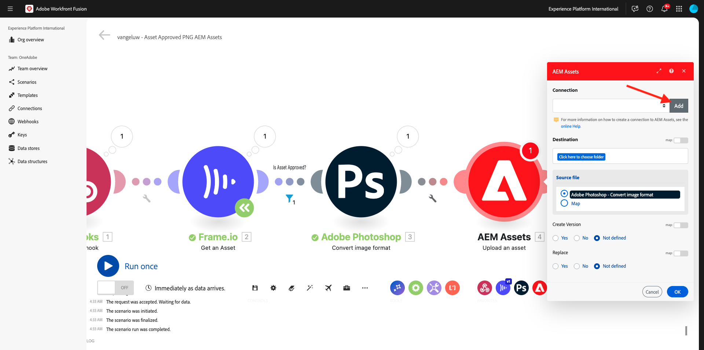
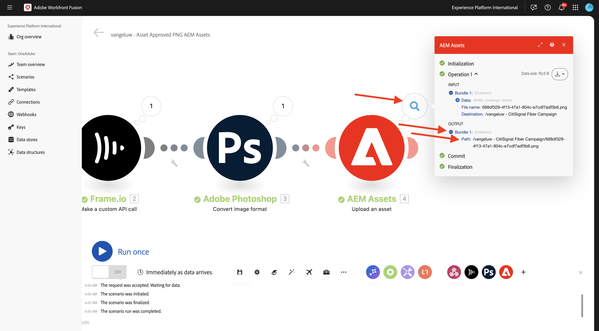

# 1.2.4 Workfront Fusion からAEM Assetsへのフレーム I/O

>[!IMPORTANT]
>
>この演習を完了するには、動作しているAEM Assets CS オーサー環境にアクセスできる必要があります。 演習 [Adobe Experience Manager Cloud ServiceおよびEdge Delivery Servicesに従うと ](./../../../modules/asset-mgmt/module2.1/aemcs.md){target="_blank"} このような環境にアクセスできます。

>[!IMPORTANT]
>
>以前にAEM Assets CS プログラムをオーサー環境で設定している場合は、AEM CS サンドボックスが休止状態になっている可能性があります。 このようなサンドボックスの休止解除には 10～15 分かかるので、後で停止しないように、今すぐ休止解除プロセスを開始することをお勧めします。

前の演習では、Adobe Firefly、Photoshop API およびWorkfront Fusion を使用してAdobe Photoshop PSD ファイルのバリエーションを自動的に生成するシナリオを設定しました。 そのシナリオの出力は、新しいPhotoshop PSD ファイルでした。

ただし、ビジネスチームにはPSD ファイルは必要なく、PNG ファイルまたはJPG ファイルが必要です。 この演習では、新しい自動処理を設定して、フレーム I/O 内のアセットが承認されると PNG ファイルが生成され、その PNG ファイルがAEM Assetsに自動的に保存されるようにします。

## 新 1.2.4.1 いシナリオを作成するには

[https://experience.adobe.com/](https://experience.adobe.com/){target="_blank"} に移動します。 **Workfront Fusion** を開きます。

左側のメニューで、**シナリオ** に移動し、フォルダー `--aepUserLdap--` を選択します。 「**新しいシナリオを作成**」をクリックします。

`--aepUserLdap-- - Asset Approved PNG AEM Assets` という名前を使用します。 次に、**?モジュ** ルに検索語 `webhook` を入力し、「**Webhook**」をクリックします。

**カスタム Webhook** をクリックします。

**追加** をクリックして、新しい Webhook を作成します。

`--aepUserLdap-- - Frame.io Webhook` という名前を使用します。 「**保存**」をクリックします。

この画像が表示されます。 **アドレスをクリップボードにコピー** をクリックします。

## 1.2.4.2 Frame.io での Webhook の設定

Postmanに移動し、コレクション **2}Adobe IO - OAuth** でリクエスト {POST - アクセストークンの取得 **を開きます。**&#x200B;次に、「**送信**」をクリックして、新しい **access_token** をリクエストします。

左側のメニューで、**コレクション** に戻ります。 **Webhook** フォルダーのコレクション **Frame.io V4 - Tech Insiders** でリクエスト **POST - Create Webhook** を開きます。

リクエストの **本文** に移動します。 フィールド **name** を `--aepUserLdap--  - Fusion to AEM Assets` に変更し、フィールド **url** を、Workfront Fusion からコピーした Webhook URL の値に変更します。

「**送信**」をクリックします。

これで、Frame.io V4 カスタムアクションが作成されました。

[https://next.frame.io/project](https://next.frame.io/project){target="_blank"} に移動し、以前に作成したプロジェクト（`--aepUserLdap--` という名前）に移動して、フォルダー **CitiSignal Fiber Campaign** を開きます。 前の演習で作成したアセットが表示されます。

フィールド **ステータス** をクリックし、ステータスを **処理中** に変更します。

Workfront Fusion に戻ります。 接続が **正常に決定** されたことがわかります。

**保存** をクリックして変更を保存し、**1 回実行** をクリックして簡単なテストを実行します。

Frame.io に戻り、「進行中 **フィールドをクリックして、ステータスを** レビューが必要 **に変更し** す。

Workfront Fusion に戻り、「**カスタム Webhook** モジュールのバブルをクリックします。

バブルの詳細ビューには、Frame.io から受信したデータが表示されます。 様々な ID が表示されます。例えば、「**resource.id**」フィールドには、アセットの Frame.io 内の一意の ID **citisignal-fiber.psd** が表示されます。

## 1.2.4.3 Frame.io からアセットの詳細を取得

これで、カスタム Webhook を介して Frame.io とWorkfront Fusion 間の通信が確立されたので、ステータスラベルが更新されたアセットに関する詳細を取得できます。 これを行うには、前の演習と同様に、Workfront Fusion で Frame.io コネクタを再び使用します。

**カスタム Webhook** オブジェクトにポインタを合わせて、「**+**」アイコンをクリックすると、別のモジュールが追加されます。

検索語句 `frame` を入力します。 **Frame.io** をクリックします。

**Frame.io** をクリックします。

「**カスタム API 呼び出しを行う**」をクリックします。

接続が、前の演習で作成したのと同じ接続に設定されており、`--aepUserLdap-- - Adobe I/O - Frame.io S2S` という名前であることを確認します。

モジュール **Frame.io - カスタム API 呼び出しを行う** の設定については、URL `/v4/accounts/{{1.account.id}}/files/{{1.resource.id}}` を使用します。

>[!NOTE]
>
>Workfront Fusion の変数は、`{{1.account.id}}` と `{{1.resource.id}}` の構文を使用して手動で指定できます。 変数内の数値は、シナリオ内のモジュールを参照します。 この例では、シナリオの最初のモジュールが **Webhook** と呼ばれ、シーケンス番号が **1** であることがわかります。 つまり、変数 `{{1.account.id}}` と `{{1.resource.id}}` は、シーケンス番号 1 のモジュールからそのフィールドにアクセスします。 シーケンス番号は異なる場合があるので、変数をコピー/貼り付ける際には注意し、常に使用するシーケンス番号が正しいことを確認してください。

次に、「**クエリ文字列** の下の「**+項目を追加**」をクリックします。

これらの値を入力し、「**追加**」をクリックします。

| キー | 値 |
|:-------------:| :---------------:| 
| `include` | `media_links.original` |

これで、このが得られます。 「**OK**」をクリックします。

「**保存**」をクリックして変更を保存し、「**1 回実行**」をクリックして設定をテストします。

Frame.io に戻り、ステータスを **処理中** に変更します。

Workfront Fusion に戻り、「**Frame.io - カスタム API 呼び出しを行う**」モジュールのバブルをクリックします。 同様の概要が表示されます。

次に、フィルターを設定して、ステータスが **承認済み** のアセットについてのみ PNG ファイルがレンダリングされるようにします。 これを行うには、モジュール **Custom Webhook** と **Frame.io - カスタム API 呼び出しを行う** の間にある **レンチ** アイコンをクリックして、**フィルターを設定** を選択します。

次のフィールドを設定します。

- **ラベル**:`Status = Approved` を使用します。
- **条件**: `{{1.metadata.value[]}}`。
- **基本演算子**:「**次と等しい**」を選択します。
- **値**:`Approved`。

「**OK**」をクリックします。

これで完了です。 「**保存**」をクリックして変更を保存します。

## 1.2.4.4 PNG に変換

モジュール **Frame.io - カスタム API 呼び出しを行う** にカーソルを合わせ、「**+**」アイコンをクリックしてください。

検索語句 `photoshop` を入力し、「**Adobe Photoshop**」をクリックします。

**画像形式を変換** をクリックします。

以前に作成した接続（**という名前** をフィールド `--aepUserLdap-- - Adobe IO` 接続が使用していることを確認します。

**Input** の下で、「**Storage**」フィールドを **External** に設定し、「**File Location**」をモジュールが返す変数 **Original** を使用するように設定します **Frame.io - カスタム API 呼び出しを行う**。

次に、「出力 **の下の「項目を追加****をクリック** ます。

**出力** 設定については、フィールド **ストレージ** を **Fusion 内部ストレージ** に設定し、**タイプ** を **image/png** に設定します。 「**追加**」をクリックします。

「**OK**」をクリックします。

「**保存**」をクリックして変更を保存し、「**1 回実行**」をクリックして設定をテストします。

Frame.io に戻り、「**進行中**」フィールドをクリックして、ステータスを **承認済み** に変更します。

Workfront Fusion に戻ります。 シナリオ内のすべてのモジュールが正常に実行されたことがわかります。 **Adobe Photoshop – 画像フォーマットを変換** モジュールのバブルをクリックします。

**Adobe Photoshop – 画像形式を変換** モジュールの実行の詳細では、PNG ファイルが生成されたことがわかります。 次の手順では、そのファイルをAEM Assets CS に保存します。

## AEM Assets CS での 1.2.4.5 Store PNG

**Adobe Photoshop – 画像形式を変換** モジュールにポインタを合わせて、「**+**」アイコンをクリックします。

検索語句 `aem` を入力し、「**AEM Assets**」を選択します。

**アセットをアップロード** をクリックします。

ここで、AEM Assets CS への接続を設定する必要があります。 「**追加**」をクリックします。

次の設定を使用します。

- **接続の種類**: **AEM Assets as a Cloud Service**。
- **接続名**: `--aepUserLdap-- AEM Assets CS`。
- **インスタンス URL**:AEM Assets CS オーサー環境のインスタンス URL を次のようにコピーします。`https://author-pXXXXX-eXXXXXXX.adobeaemcloud.com`
- **詳細入力オプションにアクセス**:「**JSON を提供**」を選択します。

**テクニカルアカウント資格情報を JSON 形式** で指定する必要があります。 これを行うには、AEM Cloud Managerを使用して従うべき手順がいくつかあります。 その間は、この画面を開いたままにしてください。

[https://my.cloudmanager.adobe.com](https://my.cloudmanager.adobe.com){target="_blank"} に移動します。 選択する組織は `--aepImsOrgName--` です。 次のようなメッセージが表示されます。 クリックしてプログラムを開きます。プログラムの名前は `--aepUserLdap-- - Citi Signal` にします。

3 つのドット「**...**」をクリックし、「**Developer Console**」を選択します。

**Adobeでログイン** をクリックします。

**ツール**/**統合** に移動します。

**新しいテクニカルアカウントを作成** をクリックします。

次のようなメッセージが表示されます。 新しく作成したテクニカルアカウントを開きます。 3 つのドット **...** をクリックし、「**表示**」を選択します。

同様のテクニカルアカウントトークンペイロードが表示されます。 JSON ペイロード全体をクリップボードにコピーします。

Workfront Fusion に戻り、完全な JSON ペイロードを「**JSON 形式のテクニカルアカウント資格情報**」フィールドに貼り付けます。 「**続行**」をクリックします。

接続が検証され、成功すると、AEM Assets モジュールで接続が自動的に選択されます。 次にすることは、フォルダーを設定することです。 演習の一環として、新しい専用フォルダーを作成する必要があります。

新しい専用フォルダーを作成するには、[https://experience.adobe.com](https://experience.adobe.com/){target="_blank"} にアクセスしてください。 適切なExperience Cloud インスタンスが選択されていることを確認します。このインスタンスは `--aepImsOrgName--` である必要があります。 次に、**Experience Manager Assets** をクリックします。

AEM Assets CS 環境で「**選択**」をクリックします。`--aepUserLdap-- - Citi Signal dev` という名前にする必要があります。

**アセット** に移動し、「**フォルダーを作成**」をクリックします。

`--aepUserLdap-- - CitiSignal Fiber Campaign` という名前を入力し、「作成 **をクリックし** す。

これで、フォルダーが作成されました。

Workfront Fusion に戻り、「**ここをクリックしてフォルダーを選択** を選択してから、フォルダー `--aepUserLdap-- - CitiSignal Fiber Campaign` を選択します。

宛先が `--aepUserLdap-- - CitiSignal Fiber Campaign` に設定されていることを確認します。 次に、**Source ファイル** の下で、「**マップ**」を選択します。

**ファイル名** で、変数 `{{3.filenames[1]}}` を選択します。

**データ** の下で、変数 `{{3.files[1]}}` を選択します。

>[!NOTE]
>
>Workfront Fusion の変数は、次の構文を使用して手動で指定できます。`{{3.filenames[1]}}` 変数内の数値は、シナリオ内のモジュールを参照します。 この例では、シナリオの 3 番目のモジュールが **Adobe Photoshop - Convert image format という名前で** シーケンス番号が **3** であることがわかります。 つまり、変数 `{{3.filenames[1]}}` は、シーケンス番号 3 のモジュールからフィールド **filenames[]** にアクセスします。 シーケンス番号は異なる場合があるので、変数をコピー/貼り付ける際には注意し、常に使用するシーケンス番号が正しいことを確認してください。

「**OK**」をクリックします。

「**保存**」をクリックして変更を保存します。

次に、作成したばかりのテクニカルアカウントに特定の権限を設定する必要があります。 アカウントが **Cloud Manager** の **Developer Console** で作成された際には、**読み取り** アクセス権が付与されていましたが、このユースケースでは、**書き込み** アクセス権が必要です。 それには、AEM CS オーサー環境に移動します。

[https://my.cloudmanager.adobe.com](https://my.cloudmanager.adobe.com){target="_blank"} に移動します。 選択する組織は `--aepImsOrgName--` です。 クリックしてプログラムを開きます。プログラムの名前は `--aepUserLdap-- - Citi Signal` にします。 次のようなメッセージが表示されます。 オーサー URL をクリックします。

**Adobeでログイン** をクリックします。

**設定**/**セキュリティ**/**ユーザー** に移動します。

クリックして、テクニカルアカウントユーザーアカウントを開きます。

**グループ** に移動し、このテクニカルアカウントユーザーをグループ **DAM-Users** に追加します。

**保存して閉じる** をクリックします。

Workfront Fusion に戻ります。 「**1 回実行**」をクリックして、シナリオをテストします。

Frame.io に戻り、アセットのステータスが再度 **承認済み** に変更されていることを確認します。

>[!NOTE]
>
>最初に変更を **進行中** または **レビューが必要** に戻してから、**承認済み** に戻す必要があります。

Workfront Fusio シナリオがアクティベートされ、正常に完了します。 **AEM Assets** モジュールのバブルの情報を確認すると、PNG ファイルがAEM Assets CS に正常に保存されていることがわかります。

AEM Assets CS に戻り、フォルダー `--aepUserLdap-- - Frame.io PNG` を開きます。 Workfront Fusion シナリオの一部として生成された PNG ファイルが表示されます。 ファイルをダブルクリックして開きます。

生成された PNG ファイルのメタデータの詳細を確認できるようになりました。

この演習を正常に完了しました。

## 次の手順

[Workfront Fusion を使用したCreative Workflow Automation の概要とメリット ](./summary.md){target="_blank"} に移動します。

[Workfront Fusion のCreative Workflow Automation に戻る ](./automation.md){target="_blank"}

[ すべてのモジュール ](./../../../overview.md){target="_blank"} に戻る
1.2.4