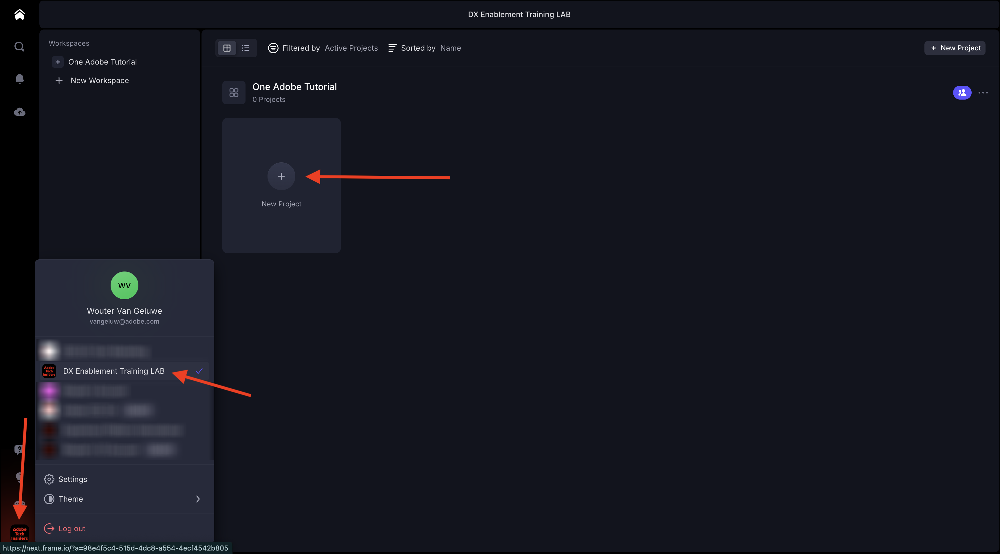
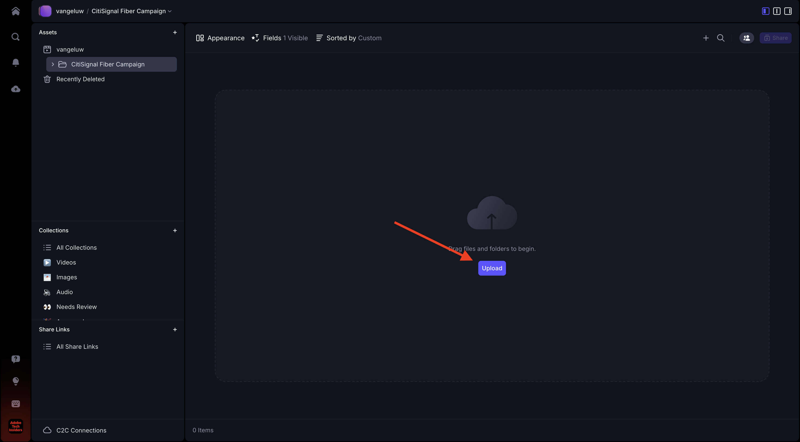
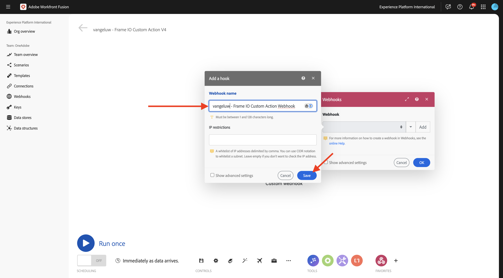
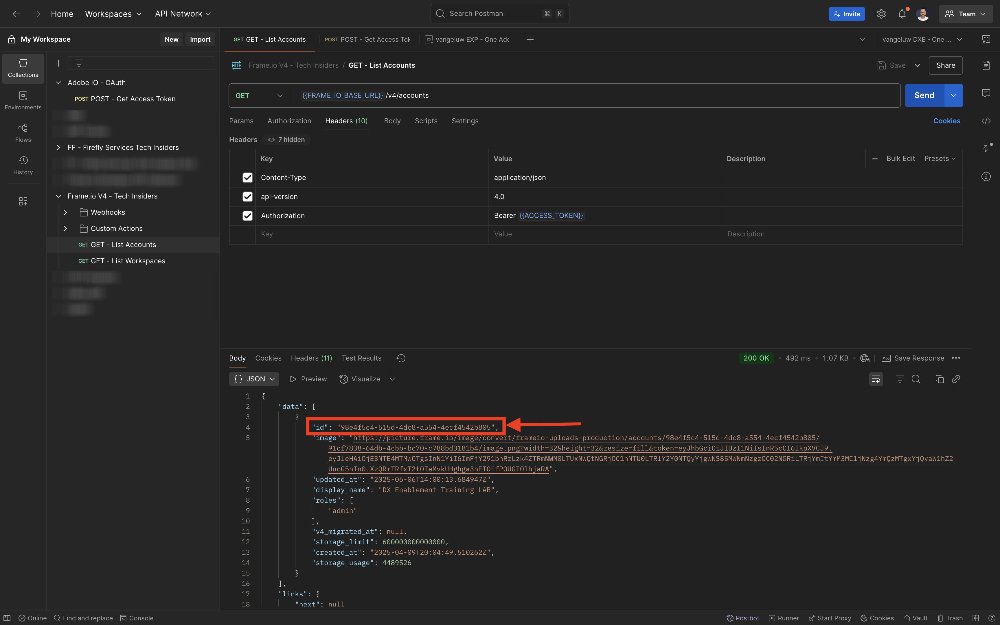
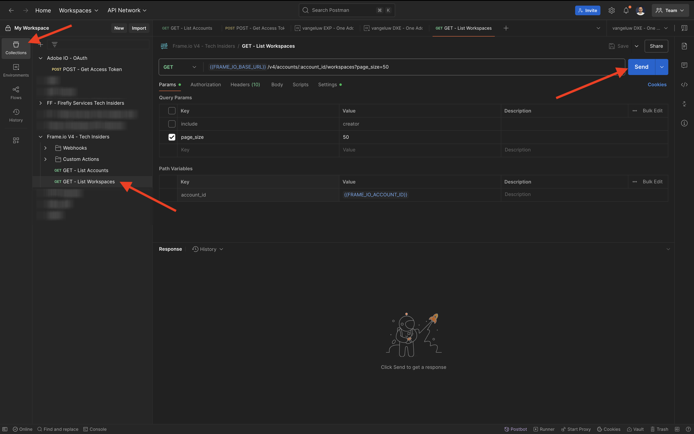
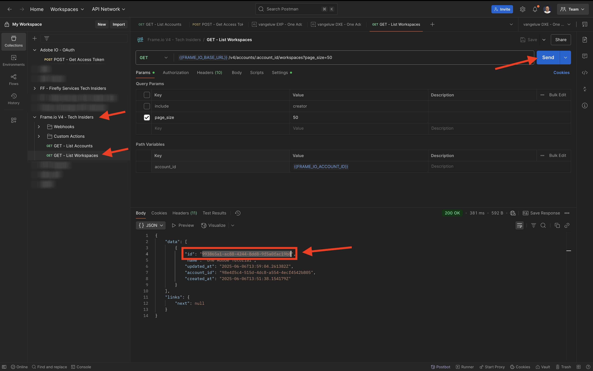
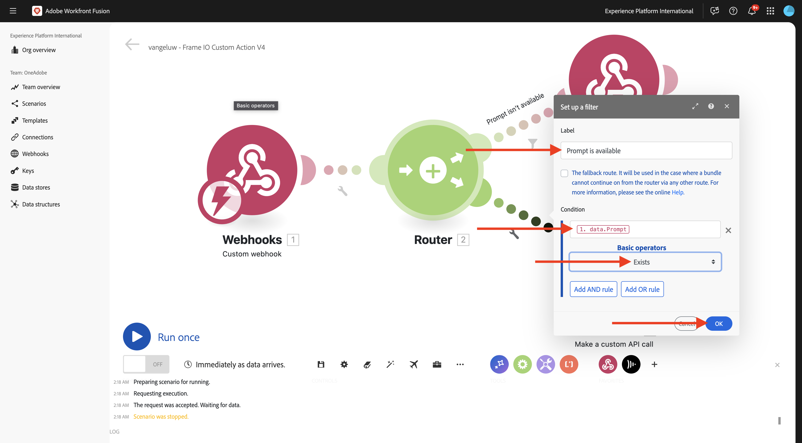
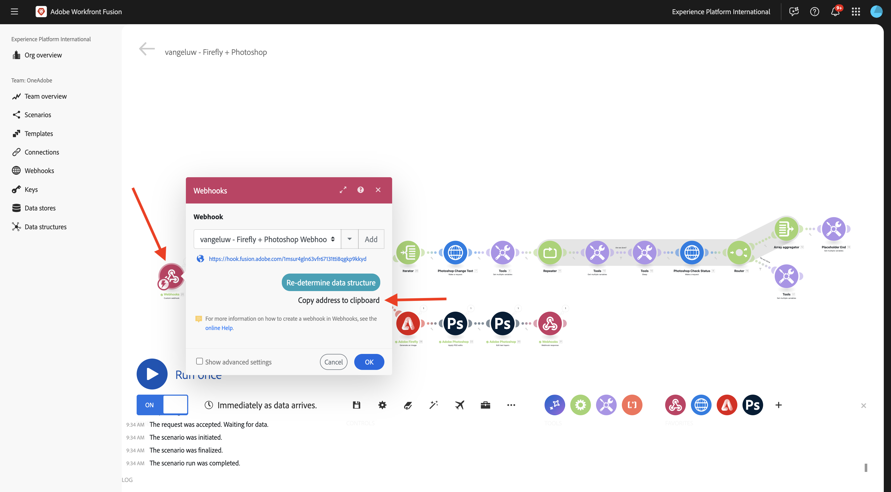
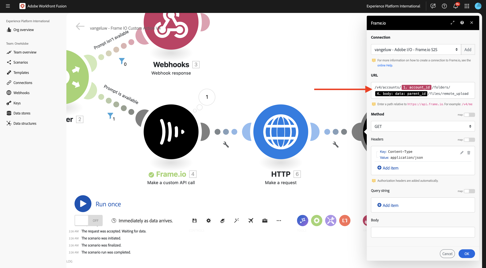
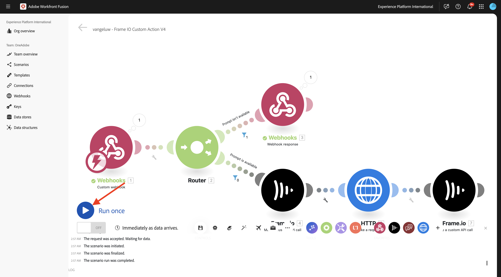

# 1.2.5 Frame.io とWorkfront Fusion

前の演習では、シナリオ `--aepUserLdap-- - Firefly + Photoshop` を設定し、シナリオをトリガーにする受信 Webhook と、シナリオが正常に完了した際の Webhook 応答を設定しました。 次に、Postmanを使用してそのシナリオをトリガーにしました。 Postmanはテストに最適なツールですが、実際のシナリオでは、ビジネスユーザーはPostmanを使用してシナリオをトリガーすることはありません。 代わりに、別のアプリケーションを使用し、他のアプリケーションがWorkfront Fusion でシナリオをアクティブ化することを想定します。 この演習では、Frame.io を使用してまさにこれが行われます。

>[!NOTE]
>
>この演習は、Frame.io V4 用に作成されました。 演習で使用される以下の機能の一部は、現在アルファ版で、まだ一般公開されていません。

## 1.2.5.1 前提条件

この演習を続ける前に、[Frame.io API](./../../../modules/getting-started/gettingstarted/ex6.md) をAdobe I/O プロジェクトに追加するなど **Adobe I/O プロジェクトの設定を完了し**&#x200B;[Postman](./../../../modules/getting-started/gettingstarted/ex7.md) や [PostBuster](./../../../modules/getting-started/gettingstarted/ex8.md) などの API を操作するアプリケーションも設定している必要があります。

## 1.2.5.2 Frame.io へのアクセス

[https://next.frame.io/](https://next.frame.io/){target="_blank"} に移動します。


インスタンスアイコンをクリックして、現在ログインしているインスタンスを確認します。 アクセス権を付与されたインスタンスを選択します。このインスタンスは `--aepImsOrgName--` です。

**+新規プロジェクト** をクリックして、Frame.io で独自のプロジェクトを作成します。



**空白** テンプレートを選択し、プロジェクトの名前 `--aepUserLdap--` を入力します。 **新規プロジェクトを作成** をクリックします。


その後、左側のメニューにプロジェクトが表示されます。 **+** アイコンをクリックし、「**新規フォルダー**」を選択します。


`CitiSignal Fiber Campaign` という名前を入力し、フォルダーをダブルクリックして開きます。


**アップロード** をクリックします。



前の演習のいずれかで、[citisignal-fiber.psd](./../../../assets/ff/citisignal-fiber.psd){target="_blank"} をダウンロードしました。 そのファイルを選択し、「**開く** をクリックします。


新しく作成したフォルダーで、ファイル **citisignal-fiber.psd** を使用できるようになります。


## 1.2.5.3 Workfront Fusion と Frame.io

前の演習では、シナリオ `--aepUserLdap-- - Firefly + Photoshop` を作成しました。これは、カスタム Webhook で開始し、Webhook 応答で終了しました。 その後、Postmanを使用して Webhook の使用をテストしましたが、明らかに、そのようなシナリオのポイントは、外部アプリケーションによって呼び出されることです。 前に述べたように、Frame.io がその演習になりますが、Frame.io と `--aepUserLdap-- - Firefly + Photoshop` の間に、別のWorkfront Fusion シナリオが必要です。 次に、そのシナリオを設定します。

[https://experience.adobe.com/](https://experience.adobe.com/){target="_blank"} に移動します。 **Workfront Fusion** を開きます。


左側のメニューで、**シナリオ** に移動し、フォルダー `--aepUserLdap--` を選択します。 「**新しいシナリオを作成**」をクリックします。


`--aepUserLdap-- - Frame IO Custom Action V4` という名前を使用します。


キャンバスで **疑問符オブジェクト** をクリックします。 検索ボックスにテキスト `webhook` を入力し、「**Webhook**」をクリックします。


**カスタム Webhook** をクリックします。


**追加** をクリックして、新しい Webhook URL を作成します。


**Webhook 名** には、`--aepUserLdap-- - Frame IO Custom Action Webhook` を使用します。 「**保存**」をクリックします。



この画像が表示されます。 次の手順で必要になるので、この画面は開いたままにしておきます。 次の手順で、「**アドレスをクリップボードにコピー**」をクリックして、Webhook URL をコピーする必要があります。


## 1.2.5.4 Frame.io V4 カスタムアクション API

Postmanに移動し、コレクション **2&rbrace;Adobe IO - OAuth** でリクエスト &lbrace;POST - アクセストークンの取得 **を開きます。**&#x200B;**Params** の下のフィールド **範囲** を確認します。 フィールド **範囲** には、範囲 `frame.s2s.all` を含める必要があります。 見つからない場合は、追加してください。 次に、「**送信**」をクリックして、新しい **access_token** をリクエストします。


次に、コレクション **Frame.io V4 - Tech Insiders** のリクエスト **0&rbrace;GET - アカウントのリスト &rbrace; を開きます。**「**送信**」をクリックします。


すると、1 つ以上のアカウントを含んだ類似の応答が表示されます。 応答を確認し、使用している Frame.io V4 アカウントのフィールド **id** を見つけます。 アカウントの名前は Frame.io V4 ユーザーインターフェイスで確認できます。


フィールド **id** の値をコピーします。



左側のメニューで、**環境** に移動し、使用している環境を選択します。 変数 **`FRAME_IO_ACCOUNT_ID`** を見つけ、前のリクエストから取得した **id** を **初期値** 列と **現在の値** 列の両方に貼り付けます。 「**保存**」をクリックします。


左側のメニューで、**コレクション** に戻ります。 コレクション **Frame.io V4 - Tech Insiders** でリクエスト **0&rbrace;GET - ワークスペースのリストを開きます。**「**送信**」をクリックします。



すると、1 つ以上のアカウントを含んだ類似の応答が表示されます。 応答を確認し、使用している Frame.io V4 Workspaceのフィールド **id** を見つけます。 フィールド **id** の値をコピーします。



左側のメニューで、**環境** に移動し、使用している環境を選択します。 変数 **`FRAME_IO_WORKSPACE_ID`** を見つけ、前のリクエストから取得した **id** を **初期値** 列と **現在の値** 列の両方に貼り付けます。 「**保存**」をクリックします。


左側のメニューで、**コレクション** に戻ります。 **Frame.io V4 - Tech Insiders** コレクションの **POST - カスタムアクションを作成** リクエストを **カスタムアクション** フォルダーで開きます。

リクエストの **本文** に移動します。 フィールド **name** を `--aepUserLdap--  - Frame.io Custom Action V4` に変更し、フィールド **url** を、Workfront Fusion からコピーした Webhook URL の値に変更します。

「**送信**」をクリックします。


これで、Frame.io V4 カスタムアクションが作成されました。


[https://next.frame.io/](https://next.frame.io/){target="_blank"} に戻り、プロジェクト `--aepUserLdap--` で作成したフォルダー **CitiSignal Fiber Campaign** に移動します。 ページを更新します。


ページを更新したら、アセット **citisignal-fiber.psd** の 3 ドット **...** をクリックして、**カスタムアクション** メニューを開きます。 表示されるメニューに、前の手順で作成したカスタムアクションが表示されます。 「カスタムアクション」 `--aepUserLdap-- - Frame IO Custom Action Fusion V4` タンをクリックします。


すると、同様の **カスタムアクション** ポップアップが表示されます。 このポップアップは、Frame.io とWorkfront Fusion 間のやり取りの結果です。


画面をWorkfront Fusion に戻します。 **正常に決定されました** がカスタム Webhook オブジェクトに表示されます。 「**OK**」をクリックします。


**Run Once** をクリックしてテストモードを有効にし、Frame.io との通信を再度テストします。


Frame.io に戻り、カスタムアクション `--aepUserLdap-- - Frame IO Custom Action Fusion V4` ードをもう一度クリックします。


画面をWorkfront Fusion に戻します。 緑のチェックマークと、バブルが **1** と表示されています。 バブルをクリックして詳細を確認します。


バブルの詳細ビューには、Frame.io から受信したデータが表示されます。 様々な ID が表示されます。例えば、「**resource.id**」フィールドには、アセットの Frame.io 内の一意の ID **citisignal-fiber.psd** が表示されます。


Frame.io とWorkfront Fusion の通信が確立されたので、設定を続行できます。

## 1.2.5.5 Frame.io へのカスタムフォーム応答の提供

Frame.io でカスタムアクションが呼び出されると、Frame.io はWorkfront Fusion から応答を受け取ることを想定します。 前の演習で作成したシナリオを思い出すと、標準のPhotoshop PSD ファイルを更新するには多数の変数が必要です。 これらの変数は、使用したペイロードで定義されます。

```json
{
    "psdTemplate": "citisignal-fiber.psd",
    "xlsFile": "placeholder",
    "prompt":"misty meadows",
    "cta": "Buy this now!",
    "button": "Click here to buy!"
}
```

したがって、シナリオ `--aepUserLdap-- - Firefly + Photoshop` が正常に実行されるには、**prompt**、**cta**、**button**&#x200B;**psdTemplate** などのフィールドが必要です。

最初の 3 つのフィールド **prompt**、**cta**、**button** には、ユーザーがカスタムアクションを呼び出す際に Frame.io で収集する必要があるユーザー入力が必要です。 そのため、Workfront Fusion 内でまず行う必要があるのは、これらの変数が使用可能かどうかを確認することです。使用可能でない場合は、Workfront Fusion は Frame.io に返信してそれらの変数の入力を求めます。 これを実現するには、Frame.io のフォームを使用します。

Workfront Fusion に戻り、シナリオ `--aepUserLdap-- - Frame IO Custom Action` ードを開きます。 **カスタム Webhook** オブジェクトにポインタを合わせて、「**+**」アイコンをクリックすると、別のモジュールが追加されます。


`Flow Control` を検索し、「**フロー制御**」をクリックします。


**Router** をクリックして選択します。


この画像が表示されます。


**をクリックするオブジェクト** クリックし、「**Webhook** を選択します。


**Webhook 応答** を選択します。


この画像が表示されます。


以下の JSON コードをコピーして、「**本文** フィールドに貼り付けます。


```json
{
  "title": "What do you want Firefly to generate?",
  "description": "Enter your Firefly prompt.",
  "fields": [
    {
      "type": "text",
      "label": "Prompt",
      "name": "Prompt",
      "value": ""
    },
    {
      "type": "text",
      "label": "CTA Text",
      "name": "CTA Text",
      "value": ""
    },
    {
      "type": "text",
      "label": "Button Text",
      "name": "Button Text",
      "value": ""
    }
  ]
}
```

アイコンをクリックして、JSON コードをクリーンアップし美しくします。 次に、「**OK**」をクリックします。


「**保存**」をクリックして変更を保存します。


次に、フィルターを設定して、プロンプトがない場合にのみシナリオのこのパスが実行されるようにする必要があります。 **レンチ** アイコンをクリックし、「**フィルターを設定**」を選択します。


次のフィールドを設定します。

- **ラベル**:`Prompt isn't available` を使用します。
- **条件**:`{{1.data.Prompt}}` を使用します。
- **基本演算子**：選択 **存在しません**。

>[!NOTE]
>
>Workfront Fusion の変数は、次の構文を使用して手動で指定できます。`{{1.data.Prompt}}` 変数内の数値は、シナリオ内のモジュールを参照します。 この例では、シナリオの最初のモジュールが **Webhook** と呼ばれ、シーケンス番号が **1** であることがわかります。 これは、変数 `{{1.data.Prompt}}` が、シーケンス番号 1 のモジュールからフィールド **data.Prompt** にアクセスすることを意味します。 シーケンス番号は異なる場合があるので、変数をコピー/貼り付ける際には注意し、常に使用するシーケンス番号が正しいことを確認してください。

「**OK**」をクリックします。


この画像が表示されます。 最初に **保存** アイコンをクリックし、次に **1 回実行** をクリックして、シナリオをテストします。


この画像が表示されます。


Frame.io に戻り、アセット **citisignal-fiber.psd** のカスタムアクション `--aepUserLdap-- - Frame IO Custom Action Fusion` ージをもう一度クリックします。


Frame.io 内にプロンプトが表示されます。 まだフィールドに入力せず、フォームも送信しません。 このプロンプトは、先ほど設定したWorkfront Fusion からの応答に基づいて表示されます。


Workfront Fusion に戻り、「**Webhook response**」モジュールのバブルをクリックします。 **INPUT** の下に、フォームの JSON ペイロードを含む本文が表示されます。 もう一度 **実行** をクリックします。


このメッセージが再び表示されます。


Frame.io に戻り、指示に従ってフィールドに入力します。

- **プロンプト**：宇宙を走る未来のレーザー光
- **CTA**：今すぐタイムトラベルへ！
- **ボタンテキスト**：ボードに乗る！

「**送信**」をクリックします。


Frame.io に次のようなポップアップが表示されます。


Workfront Fusion に戻り、「**カスタム Webhook** モジュールのバブルをクリックします。 操作 1 の **OUTPUT** の下に、**Button Text**、**CTA Text** **、&lbrace;Prompt** などのフィールドを含む新しい **data** オブジェクトが表示されるようになりました。 シナリオで利用できるこれらのユーザー入力変数を使用すれば、設定を続行するのに十分です。


## 1.2.5.6 Frame.io からファイルの場所を取得

前に述べたように、このシナリオを機能させるには、**prompt**、**cta**、**button**&#x200B;**psdTemplate** などのフィールドが必要です。 最初の 3 つのフィールドは既に使用可能になっていますが、使用する **psdTemplate** はまだ見つかりません。 **psdTemplate** は、ファイル **citisignal-fiber.psd** が Frame.io でホストされているので、Frame.io の場所を参照するようになりました。 ファイルの場所を取得するには、Workfront Fusion で Frame.io 接続を設定して使用する必要があります。

Workfront Fusion に戻り、シナリオ `--aepUserLdap-- - Frame IO Custom Action V4` ードを開きます。 **にカーソルを合わせますか？モジュール**、「**+**」アイコンをクリックして別のモジュールを追加し、`frame` を検索します。 **Frame.io** をクリックします。


**Frame.io** をクリックします。


「**カスタム API 呼び出しを行う**」をクリックします。


Frame.io 接続を使用するには、まず設定する必要があります。 「**追加**」をクリックします。


**接続タイプ**&#x200B;**IMS サーバーからサーバーへ** を選択し、`--aepUserLdap-- - Adobe I/O - Frame.io S2S` という名前を入力します。


次に、**クライアント ID** と、「はじめに **モジュールの一部として設定したAdobe I/O プロジェクトの**&#x200B;**クライアント秘密鍵** を入力する必要があります。 Adobe I/O プロジェクトの **クライアント ID** と **クライアントシークレット** は、（こちら [ で確認でき ](https://developer.adobe.com/console/projects.){target="_blank"} す。


Workfront Fusion のシナリオに戻ります。 **クライアント ID** と **クライアント秘密鍵** の値を、接続設定ウィンドウのそれぞれのフィールドに貼り付けます。 **続行** をクリックします。 接続はWorkfront Fusion でテストされます。


接続が正常にテストされた場合は、**接続** に自動的に表示されます。 これで接続が正常に完了しました。設定を完了して、ファイルの場所を含む Frame.io からすべてのアセットの詳細を取得する必要があります。 これを行うには、**リソース ID** を使用する必要があります。


フィールド **リソース ID** は、最初の **カスタム Webhook** 通信の一環として Frame.io からWorkfront Fusion に共有され、「**resource.id**」フィールドにあります。

モジュール **Frame.io - カスタム API 呼び出しを行う** の設定については、URL `/v4/accounts/{{1.account_id}}/files/{{1.resource.id}}` を使用します。

>[!NOTE]
>
>Workfront Fusion の変数は、`{{1.account_id}}` と `{{1.resource.id}}` の構文を使用して手動で指定できます。 変数内の数値は、シナリオ内のモジュールを参照します。 この例では、シナリオの最初のモジュールが **Webhook** と呼ばれ、シーケンス番号が **1** であることがわかります。 つまり、変数 `{{1.account_id}}` と `{{1.resource.id}}` は、シーケンス番号 1 のモジュールからそのフィールドにアクセスします。 シーケンス番号は異なる場合があるので、変数をコピー/貼り付ける際には注意し、常に使用するシーケンス番号が正しいことを確認してください。

次に、「**クエリ文字列** の下の「**+項目を追加**」をクリックします。


これらの値を入力し、「**追加**」をクリックします。

| キー | 値 |
|:-------------:| :---------------:| 
| `include` | `media_links.original` |


これで、このが得られます。 「**OK**」をクリックします。


次に、フィルターを設定して、プロンプトがない場合にのみシナリオのこのパスが実行されるようにする必要があります。 **レンチ** アイコンをクリックし、「**フィルターを設定**」を選択します。


次のフィールドを設定します。

- **ラベル**:`Prompt is available` を使用します。
- **条件**:`{{1.data.Prompt}}` を使用します。
- **基本演算子**:**存在** を選択します。

>[!NOTE]
>
>Workfront Fusion の変数は、次の構文を使用して手動で指定できます。`{{1.data.Prompt}}` 変数内の数値は、シナリオ内のモジュールを参照します。 この例では、シナリオの最初のモジュールが **Webhook** と呼ばれ、シーケンス番号が **1** であることがわかります。 これは、変数 `{{1.data.Prompt}}` が、シーケンス番号 1 のモジュールからフィールド **data.Prompt** にアクセスすることを意味します。 シーケンス番号は異なる場合があるので、変数をコピー/貼り付ける際には注意し、常に使用するシーケンス番号が正しいことを確認してください。

「**OK**」をクリックします。



これが表示されます。 変更を保存し、「**1 回実行**」をクリックしてシナリオをテストします。


Frame.io に戻り、アセット **citisignal-fiber.psd** のカスタムアクション `--aepUserLdap-- - Frame IO Custom Action Fusion V4` ージをもう一度クリックします。


Frame.io 内にプロンプトが表示されます。 まだフィールドに入力せず、フォームも送信しません。 このプロンプトは、先ほど設定したWorkfront Fusion からの応答に基づいて表示されます。


Workfront Fusion に戻ります。 もう一度 **実行** をクリックします。


Frame.io に戻り、指示に従ってフィールドに入力します。 「**送信**」をクリックします。

- **プロンプト**：宇宙を走る未来のレーザー光
- **CTA**：今すぐタイムトラベルへ！
- **ボタンテキスト**：ボードに乗る！


Workfront Fusion に戻り、「**Frame.io - カスタム API 呼び出しを行う**」モジュールのバブルをクリックします。


**OUTPUT**/**Body**/**data** の下に、特定のアセットに関する多くのメタデータ **citisignal-fiber.psd** が表示されるようになりました。


このユースケースに必要な特定の情報は、ファイル **citisignal-fiber.psd** の場所 URL です。これを見つけるには、フィールド **media_links**/**Original**/**download_url** までスクロールします。


これで、このユースケースが機能するために必要なすべての情報（**prompt**、**cta**、**button** および **psdTemplate**）が使用可能になりました。

## 1.2.5.7 Workfrontを呼び出しシナリオ

前の演習では、シナリオ `--aepUserLdap-- - Firefly + Photoshop` を設定しました。 次に、そのシナリオに小さな変更を加える必要があります。

別のタブでシナリオ `--aepUserLdap-- - Firefly + Photoshop` を開き、最初の **Adobe Photoshop - PSDの編集内容を適用** モジュールをクリックします。 これで、入力ファイルがMicrosoft Azure の動的な場所を使用するように設定されていることがわかります。 このユースケースでは、入力ファイルはMicrosoft Azure に保存されなくなり、代わりに Frame.io ストレージを使用するので、これらの設定を変更する必要があります。


**ストレージ** を **外部** に変更し、**ファイルの場所** を受信した **カスタム Webhook** モジュールから取得した **psdTemplate** 変数のみを使用するように変更します。 「**OK**」をクリックし、「**保存**」をクリックして変更を保存します。


**カスタム Webhook** モジュールをクリックし、「**アドレスをクリップボードにコピー**」をクリックします。 他のシナリオで使用する必要があるので、URL をコピーする必要があります。



シナリオ `--aepUserLdap-- - Frame IO Custom Action V4` ージに戻ります。 **Frame.io - カスタム API 呼び出しを行う** モジュールにカーソルを合わせて、「**+**」アイコンをクリックしてください。


`http` と入力し、「**HTTP**」をクリックします。


「**リクエストを行う**」を選択します。


カスタム Webhook の URL を「**URL**」フィールドに貼り付けます。 **メソッド** を **POST** に設定します。


**本文タイプ** を **Raw** に、**コンテンツタイプ** を **JSON （application/json）** に設定します。
以下の JSON ペイロードを「コンテンツをリクエスト **フィールドに貼り付け**&#x200B;**応答を解析** のチェックボックスを有効にします。

```json
{
    "psdTemplate": "citisignal-fiber.psd",
    "xlsFile": "placeholder",
    "prompt":"misty meadows",
    "cta": "Buy this now!",
    "button": "Click here to buy!"
}
```

これで静的ペイロードが設定されましたが、以前に収集した変数を使用して動的にする必要があります。


**psdTemplate** フィールドについては、静的変数 **citisignal-fiber.psd** を変数 **`Body > data > media_links > original > download_url`** に置き換えます。


**prompt**、**cta** および **button** フィールドについては、Frame.io からの受信 Webhook リクエストによってシナリオに挿入された動的変数で静的変数を置き換えます。これらのフィールドは、**data.Prompt**、**data.CTA Text** および **data.Button Text** です。

また、「応答を解析 **のチェックボックスを有効に** ます。

「**OK**」をクリックします。


「**保存**」をクリックして変更を保存します。


## 1.2.5.8 Frame.io に新しいアセットを保存

他のWorkfront Fusion シナリオを呼び出すと、結果は、使用可能な新しいPhotoshop PSD テンプレートになります。 そのPSD ファイルを Frame.io に再度保存する必要があります。これは、このシナリオの最後の手順です。

「**HTTP - リクエストを行う**」モジュールにポインタを合わせて、「**+**」アイコンをクリックします。


**Frame.io** を選択します。


**カスタム API 呼び出しを行う** を選択します。


Frame.io 接続が自動的に選択されます。


モジュール **Frame.io - カスタム API 呼び出しを行う** の設定については、URL `/v4/accounts/{{1.account_id}}/folders/{{4.body.data.parent_id}}/files/remote_upload` を使用します。

上記の URL の XXX をフォルダーの ID に置き換える必要があります

>[!NOTE]
>
>前述のように、Workfront Fusion の変数は、`{{1.account_id}}` および `{{4.body.data.parent_id}}` の構文を使用して手動で指定できます。 変数内の数値は、シナリオ内のモジュールを参照します。
>&#x200B;>この例では、シナリオの最初のモジュールが **Webhook** と呼ばれ、シーケンス番号が **1** であることがわかります。 つまり、変数 `{{1.account_id}}` は、シーケンス番号 1 のモジュールからそのフィールドにアクセスします。
>&#x200B;>この例では、シナリオの 4 番目のモジュールが **Frame.io - カスタム API 呼び出しを行う** という名前で、シーケンス番号は **4** であることがわかります。 つまり、変数 `{{4.body.data.parent_id}}` は、シーケンス番号 4 のモジュールからそのフィールドにアクセスします。
>&#x200B;>モジュールのシーケンス番号が異なる場合、上記の URL の変数を更新して、正しいモジュールにリンクさせる必要があります。



フィールド **メソッド** を **POST** に変更します。

以下の JSON スニペットをコピーして、「**本文**」フィールドに貼り付けます。

```json
{
  "data": {
    "name": "citisignal-fiber-{{timestamp}}.psd",
    "source_url": "{{6.data.newPsdTemplate}}"
  }
}
```

>[!NOTE]
>
>Workfront Fusion の変数は、次の構文を使用して手動で指定できます。`{{6.data.newPsdTemplate}}` 変数内の数値は、シナリオ内のモジュールを参照します。 この例では、シナリオの 6 番目のモジュールが **HTTP - リクエストを行う** と呼ばれ、シーケンス番号が **6** であることがわかります。 これは、変数 `{{6.data.newPsdTemplate}}` が、シーケンス番号 6 のモジュールからフィールド **data.newPsdTemplate** にアクセスすることを意味します。
>&#x200B;>モジュールのシーケンス番号が異なる場合、上記の URL の変数を更新して、正しいモジュールにリンクさせる必要があります。

「**OK**」をクリックします。


「**保存**」をクリックして変更を保存します。


## 1.2.5.9 エンドツーエンドのユースケースのテスト

シナリオ `--aepUserLdap-- - Frame IO Custom Action` ージで「**1 回実行**」をクリックします。


Frame.io に戻り、アセット **citisignal-fiber.psd** のカスタムアクション `--aepUserLdap-- - Frame IO Custom Action Fusion V4` ージをもう一度クリックします。


Frame.io 内にプロンプトが表示されます。 まだフィールドに入力せず、フォームも送信しません。 このプロンプトは、先ほど設定したWorkfront Fusion からの応答に基づいて表示されます。


Workfront Fusion に戻ります。 シナリオ `--aepUserLdap-- - Frame IO Custom Action V4` ージで「**1 回実行**」をクリックします。



Workfront Fusion で、シナリオ `--aepUserLdap-- - Firefly + Photoshop` を開き、そのシナリオで **1 回実行** をクリックします。


Frame.io に戻り、指示に従ってフィールドに入力します。 「**送信**」をクリックします。

- **プロンプト**：宇宙を走る未来のレーザー光
- **CTA**：今すぐタイムトラベルへ！
- **ボタンテキスト**：ボードに乗る！


1～2 分後に、Frame.io に新しいアセットが自動的に表示されます。 新しいアセットをダブルクリックして開きます。


これで、すべてのユーザー入力変数が自動的に適用されたことを明確に確認できます。


この演習を正常に完了しました。

## 次の手順

[1.2.6 Frame.io から Fusion に移動して、AEM Assetsに移動します ](./ex6.md){target="_blank"}

[Workfront Fusion のCreative Workflow Automation に戻る ](./automation.md){target="_blank"}

[ すべてのモジュール ](./../../../overview.md){target="_blank"} に戻る

