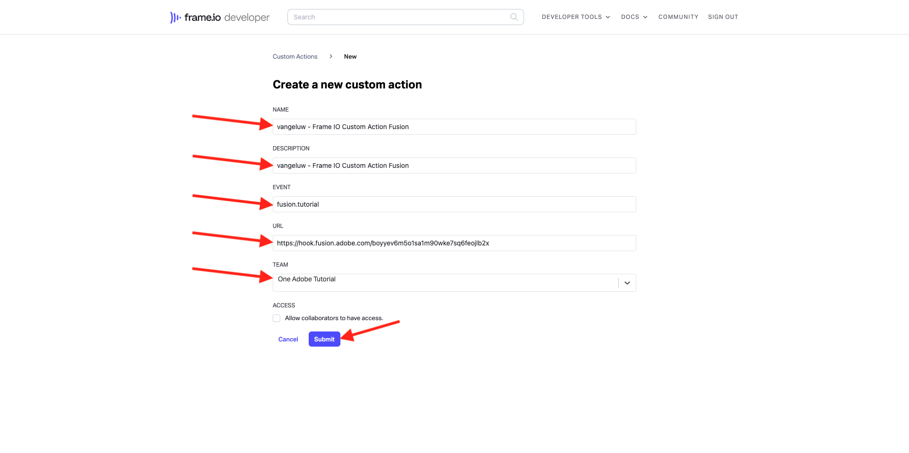

# 1.2.5 フレーム I/O とWorkfront Fusion

前の演習では、シナリオ `--aepUserLdap-- - Firefly + Photoshop` を設定し、シナリオをトリガーにする受信 Webhook と、シナリオが正常に完了した際の Webhook 応答を設定しました。 次に、Postmanを使用してそのシナリオをトリガーにしました。 Postmanはテストに最適なツールですが、実際のシナリオでは、ビジネスユーザーはPostmanを使用してシナリオをトリガーすることはありません。 代わりに、別のアプリケーションを使用し、他のアプリケーションがWorkfront Fusion でシナリオをアクティブ化することを想定します。 この演習では、フレーム I/O を使用してまさにこれが行われます。

## フレーム I/O へのアクセス 1.2.5.1

>[!NOTE]
>
>この演習を正常に完了するには、フレーム I/O アカウントの管理者ユーザーである必要があります。 次の演習は、フレーム I/O V3 用に作成されたもので、後の段階でフレーム I/O V4 用に更新されます。

[https://app.frame.io/projects](https://app.frame.io/projects) に移動します。

**+ アイコンをクリックして** フレーム I/O で独自のプロジェクトを作成します。

名前 `--aepUserLdap--` を入力し、[ **作成プロジェクト**] をクリックします。

その後、左側のメニューにプロジェクトが表示されます。
前の演習の 1 つで、[citisignal-fiber.psd](./../../../assets/ff/citisignal-fiber.psd){target="_blank"} をデスクトップにダウンロードしました。 そのファイルを選択し、作成したプロジェクトフォルダーにドラッグ&amp;ドロップします。

## 1.2.5.2 Workfront Fusion とフレーム I/O

前の演習では、シナリオ `--aepUserLdap-- - Firefly + Photoshop` を作成しました。これは、カスタム Webhook で開始し、Webhook 応答で終了しました。 その後、Postmanを使用して Webhook の使用をテストしましたが、明らかに、そのようなシナリオのポイントは、外部アプリケーションによって呼び出されることです。 前に述べたように、フレーム I/O はその演習になりますが、フレーム I/O と `--aepUserLdap-- - Firefly + Photoshop` の間に、別のWorkfront Fusion シナリオが必要です。 次に、そのシナリオを設定します。

左側のメニューで、**シナリオ** に移動し、フォルダー `--aepUserLdap--` を選択します。 「**新しいシナリオを作成**」をクリックします。

`--aepUserLdap-- - Frame IO Custom Action` という名前を使用します。

キャンバスで **疑問符オブジェクト** をクリックします。 検索ボックスにテキスト `webhook` を入力し、「**Webhook**」をクリックします。

**カスタム Webhook** をクリックします。

**追加** をクリックして、新しい Webhook URL を作成します。

**Webhook 名**&#x200B;には、`--aepUserLdap-- - Frame IO Custom Action Webhook` を使用します。「**保存**」をクリックします。

そうすると、次のように表示されます。 この画面は、次の手順で必要になるため、そのままにしておいてください。 次の手順で、「**アドレスをクリップボードにコピー**」をクリックして、Webhook URL をコピーする必要があります。

[https://developer.frame.io/](https://developer.frame.io/) に移動します。 **デベロッパーツール** をクリックし、「**カスタムアクション**」を選択します。

**カスタムアクションを作成** をクリックします。

次の値を入力します。

- **NAME**：使用 `vangeluw - Frame IO Custom Action Fusion`
- **説明**:`vangeluw - Frame IO Custom Action Fusion` を使用します
- **EVENT**:`fusion.tutorial` を使用します。
- **URL**:Workfront Fusion で作成したばかりの Webhook の URL を入力します
- **チーム**：適切なフレーム I/O チーム（この例では **One Adobe チュートリアル** を選択します。

「**送信**」をクリックします。

そうすると、次のように表示されます。

[https://app.frame.io/projects](https://app.frame.io/projects) に戻ります。 ページを更新します。

ページを更新したら、アセット **citisignal-fiber.psd** の 3 ドット **...** をクリックします。 表示されるメニューに、前の手順で作成したカスタムアクションが表示されます。 「カスタムアクション」 `vangeluw - Frame IO Custom Action Fusion` タンをクリックします。

その後、同様の **Success!ポップアップ**。 このポップアップは、Frame I/O とWorkfront Fusion 間のやり取りの結果です。

画面をWorkfront Fusion に戻します。 **正常に決定されました** がカスタム Webhook オブジェクトに表示されます。 「**OK**」をクリックします。

**Run Once** をクリックしてテストモードを有効にし、フレーム I/O との通信を再度テストします。

フレーム I/O に戻り、カスタム アクション `vangeluw - Frame IO Custom Action Fusion` をもう一度クリックします。

画面をWorkfront Fusion に戻します。 緑のチェックマークと、バブルが **1** と表示されています。 バブルをクリックして詳細を確認します。

バブルの詳細表示には、フレーム I/O から受信したデータが表示されます。様々な ID が表示されます。例えば、「resource.id **フィールドには、アセットのフレーム I/O 内の一意の ID が表示されます** citisignal-fiber **psd**

これで、フレーム I/O と Workfront Fusion の間で通信が確立されたので、設定を続行できます。

## 1.2.5.3 フレーム I/O に対するカスタムフォームの応答を提供する。

## 次の手順

AEM Assetsへの Fusion への [1.2.6 フレーム I/O に移動する ](./ex6.md){target="_blank"}

[Workfront Fusion のCreative Workflow Automation に戻る ](./automation.md){target="_blank"}

[ すべてのモジュール ](./../../../overview.md){target="_blank"} に戻る

