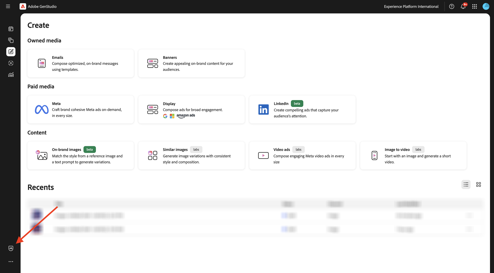
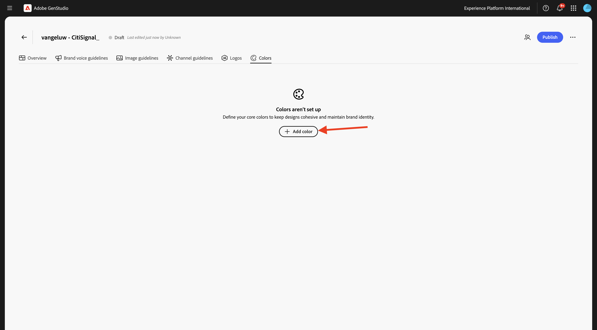
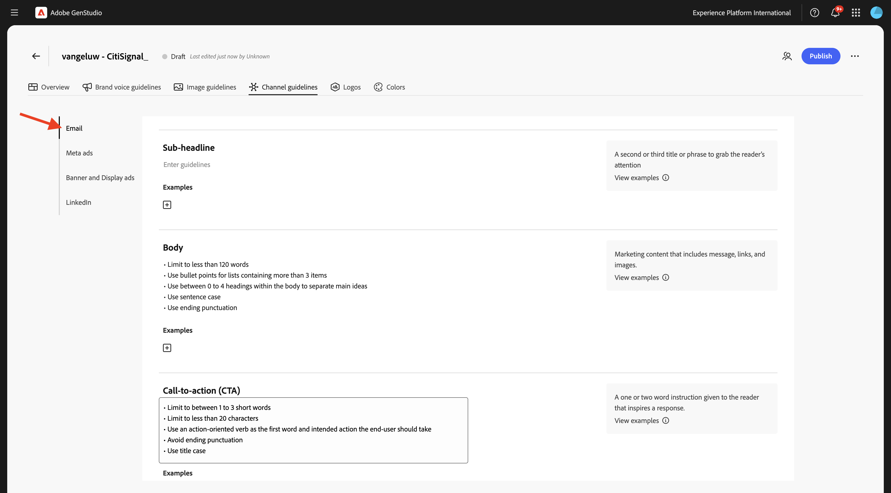

# 1.3.1 設定：ブランド

[https://experience.adobe.com/](https://experience.adobe.com/){target="_blank"} に移動します。 **GenStudio** を開きます。


この画像が表示されます。


GenStudio for Performance Marketingを使用するために最初にすべきことは、ブランドを設定することです。 **ブランド** アイコンをクリックします。



「**+ ブランドを追加**」をクリックします。


ブランドの名前 `--aepUserLdap-- - CitiSignal` を入力します。 「**手動で追加**」を選択し、「**ブランドを追加**」をクリックします。


## 1.3.1.1 Colors

この画像が表示されます。 **カラー** をクリックします。


「**+色を追加**」をクリックします。



追加できるカラーは次の 4 つです。

- `#8821F4`
- `#14161A`
- `#EEEEEE`
- `#FF006C`

カラー `#8821F4` の 16 進コードを入力します。 「**追加**」をクリックします。


「**+色を追加**」をクリックします。


カラー `#14161A` の 16 進コードを入力します。 「**追加**」をクリックします。


「**+色を追加**」をクリックします。


カラー `#EEEEEE ` の 16 進コードを入力します。 「**追加**」をクリックします。


「**+色を追加**」をクリックします。


カラー `#FF006C ` の 16 進コードを入力します。 「**追加**」をクリックします。


これで、このが得られます。


## 1.3.1.2 ロゴ

ファイル [CitiSignal-GSPeM-assets.zip](../../../assets/gspem/CitiSignal-GSPeM-assets.zip) をデスクトップにダウンロードして解凍します。


次に、**ロゴ** に移動します。 「**+ ロゴを追加**」をクリックします。


**参照** をクリックします。


フォルダー **CitiSignal-GSPeM-assets**/**logos** に移動し、これらのファイルを選択します。 「**開く**」をクリックします。


これで完了です。 **ロゴを追加** をクリックします。


これで完了です。


## 1.3.1.3 ブランドの音声ガイドライン

次に、**ブランドの音声ガイドライン** に移動します。


**トーンとボイス** の場合は、次を使用します。

```
• Convey a sense of exploration and adventure
• Be authentic and conversational
• Evoke excitement and curiosity
• Speak honestly and straightforwardly
• Be approachable and relatable
• Use everyday language
```


**ブランド値** には、次を使用します。

```
• Inspirational
• Sustainability
• Quality
• Durability
• Functionality
• Reliability
• Community-oriented
• Be inclusive and welcome diversity
• Encourage active lifestyles
• Promote discovery
```


**エディトリアルガイドライン** については、次を使用します。

```
• Keep sentences concise and impactful
• Use active voice
• Lists, bullets, and series should be consistent — either they all start with a noun, or they all start with a verb
• Use serial commas
```


**編集上の制限** については、次を使用します。

```
• Avoid activity-specific jargon unless it’s widely adopted
• Avoid promoting the skill level or experience level of the user of our outdoor equipment
• Avoid technical language or jargon
```


## 1.3.1.4 画像ガイドライン

次に、**画像のガイドライン** に移動します。


**コンテンツタイプ** を **アート** に設定し、**説明** に次を使用します。

```
Capture candid, unposed shots of real people and futuristic animals engaging with technology in their daily lives to convey authenticity and relatability.
```


**構成** には、次を使用します。

```
Focus on the experiences, speed and emotions of using technology, rather than just the products themselves.
```


**環境** の場合は、次を使用します。

```
Highlight futuristic, clean, and professional settings that reflect innovation and connectivity.
```


**カラー** には、次を使用します。

```
Use a palette inspired by technology, including sleek metallics, cool purple and blue, and neutral tones.
```


**照明** の場合は、次を使用します。

```
Utilize bright, natural lighting to create a welcoming and dynamic atmosphere.
```


**ムード** には、次を使用します。

```
Each image should evoke a feeling of speed, innovation and being part of the future.
```


**制限** については、次を使用します。

```
Avoid cluttered or busy backgrounds that detract from the main subject.
```


## 1.3.1.4 チャネルガイドライン

次に、**チャネルガイドライン** に移動します。


**メール** の場合は、次の値を使用します。

- **一般**

```
• Use simple, short sentences
• Be clear and concise
• Invoke a sense of adventure and exploration
```

- **件名**

```
• Limit to less than 8 words
• Provide specific details about what’s inside the email
• Use sentence case
• Do not use end punctuation
```

- **プリヘッダー**

```
• Limit to less than 80 characters
• Provide specific details about what’s inside the email
• Use sentence case
• Use ending punctuation
```

- **見出し**

```
• Limit to less than 12 words
• Generate excitement through compelling and exciting statements
• Use sentence case
```

- **サブ見出し**：現時点では空のままにします

- **本文**

```
• Limit to less than 120 words
• Use bullet points for lists containing more than 3 items
• Use between 0 to 4 headings within the body to separate main ideas
• Use sentence case
• Use ending punctuation
```

- **Call-to-action（CTA）**

```
• Limit to between 1 to 3 short words
• Limit to less than 20 characters
• Use an action-oriented verb as the first word and intended action the end-user should take
• Avoid ending punctuation
• Use title case
```



**メタ広告** には、次の値を使用します。

- **一般**

```
• Use simple, short sentences
• Be clear and concise
• Invoke a sense of adventure and exploration
• Make product names prominent
• Use community-building concepts and language
```

- **見出し**

```
• Limit  to less than 8 words
• Limit to less than 27 characters
• Make it clear what action the reader should take
• Use sentence case
• Avoid ending punctuation
```

- **本文**

```
• Limit to less than 125 characters
• Use sentence case
• Use ending punctuation
```

- **画像上のテキスト**：現時点では空のままにします


**バナー広告とディスプレイ広告** には、次の値を使用します。

- **一般**

```
• Make readers feel inspired, interested, and sure of the next step
• Avoid word repetition
• Make product names prominent
```

- **見出し**

```
• Clearly state the main benefit of the offer
• Use sentence case
• Use ending punctuation
• Limit to less than 60 characters
```

- **サブ見出し**：現時点では空のままにします

- **本文**

```
• Communicate the benefits of clicking into the offer
• Use sentence case
• Use ending punctuation
```

- **Call-to-action（CTA）**

```
• Limit to between 1 to 3 short words
• Limit to less than 20 characters
• Use an action-oriented verb as the first word
• Use title case
• Avoid ending punctuation
```


**LinkedIn** の場合は、次の値を使用します。

- **一般**：現時点では空のままにします

- **見出し**：今のところ空のままにします

- **説明**：今のところ空のままにします

- **紹介テキスト**：現時点では空のままにします

- **画像上のテキスト**：現時点では空のままにします


最後に、**概要** に移動します。 これで、設定したすべての内容の概要が表示されます。 最後に行うことは一つある。 **このブランドを使用するタイミング** の下の「**+追加**」をクリックします。


以下のテキストを入力し、「**変更を保存**」をクリックします。

```
This is the default brand for CitiSignal marketing campaign. Use the CitiSignal brand for all brand and product campaigns that don't require specific guidelines.
```


「**公開**」をクリックします。


もう一度 **公開** をクリックします。


ブランドが公開され、このブランドを使用してブランドコンテンツを作成できるようになりました。 「**完了**」をクリックします。


## 次の手順

[ 設定：ペルソナ、製品、テンプレート ](./ex2.md){target="_blank"} に移動します。

[GenStudio for Performance Marketing](./genstudio.md){target="_blank"} に戻る

[ すべてのモジュール ](./../../../overview.md){target="_blank"} に戻る
