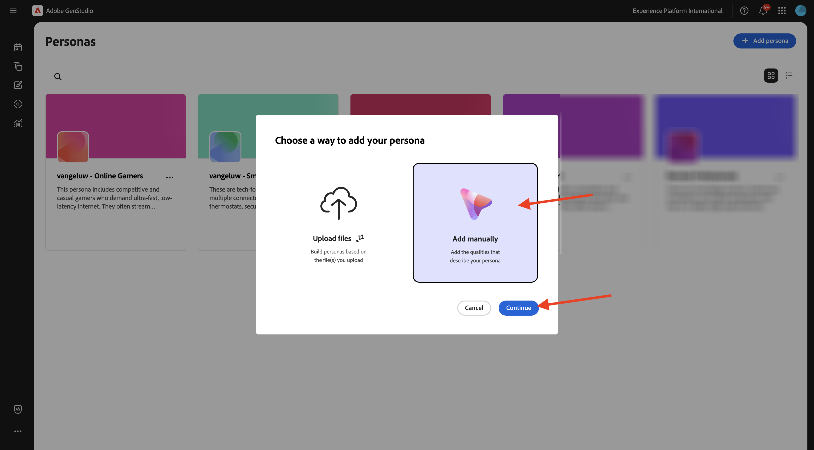
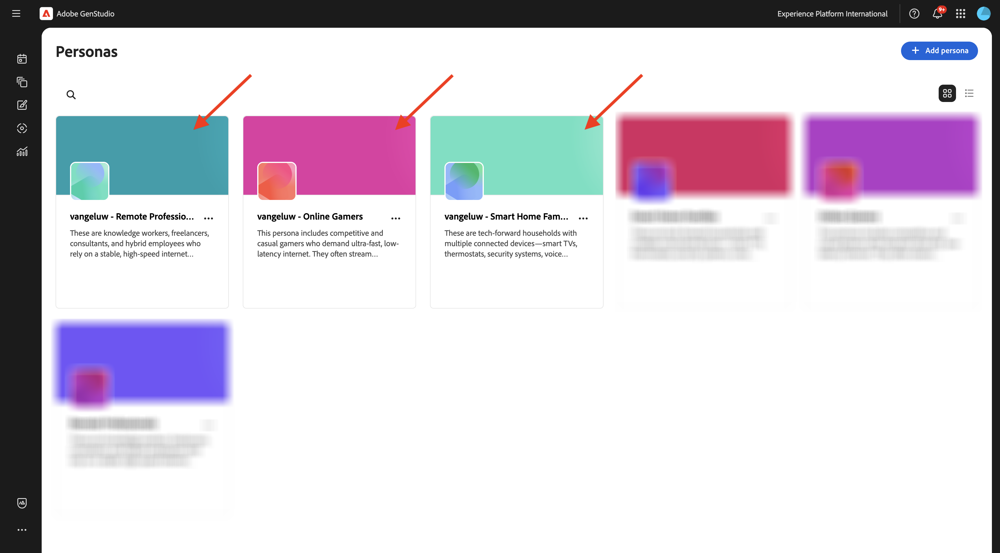
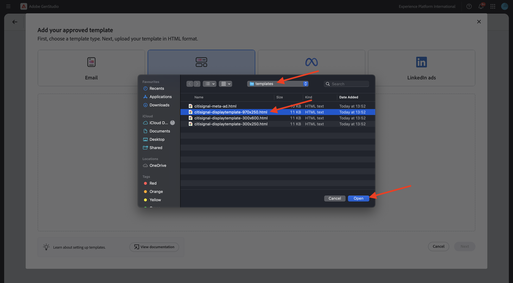
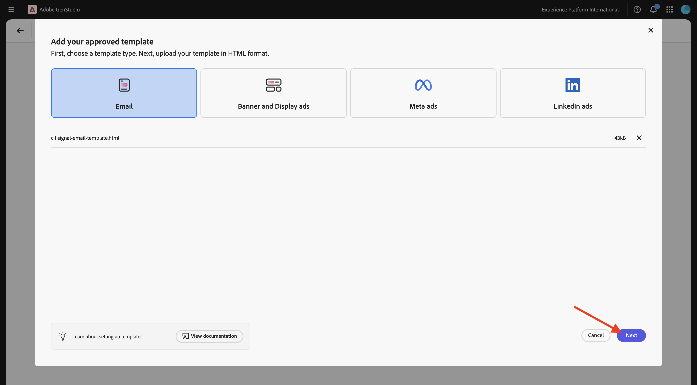

# 1.3.2 設定：ペルソナ、製品、テンプレート

この演習では、GenStudio for Performance Marketingでペルソナ、製品、テンプレートを設定します。

## 1.3.2.1 製品

GenStudio for Performance Marketingの商品では、商品の仕様、利点および差別化要因に関する深い理解を活用して、効果的なコンテンツを生成します。

製品は、画像、説明、価値提案など、特定の製品のすべての要素を包含し、統一されたブランド表現を作成します。 Adobeの高度な AI テクノロジーを活用して、GenStudio for Performance Marketingのガイドライン（ブランド、製品、ペルソナ）が連携して、製品の強みを示し、すべてのメッセージング間で一貫性を確保する、説得力のあるコンテンツを生成します。

独自の製品の作成を開始するには、3 つのドット **...をクリックし** 「**製品**」を選択します。


「**+製品を追加**」をクリックします。


「**手動で追加**」を選択し、「**続行**」をクリックします。


この画像が表示されます。


製品名は us `--aepUserLdap-- - CitiSignal Mobile Flex Plan` です。

フィールド **説明** に次を使用します。

```
CitiSignal Mobile Flex is a next-gen 5G mobile plan that adapts to your lifestyle. Choose from Unlimited, Family Share, or Data Saver tiers, with optional add-ons like international roaming, hotspot tethering, and SmartFamily™ parental controls. All plans include priority access to CitiSignal’s 5G UltraWide network and seamless integration with CitiSignal Fiber for unified billing, shared data pools, and SmartSwitch™ connectivity. 
```

フィールド **価値提案** に次を使用します。

```
A mobile plan that flexes with your life—fast, fair, and fully connected to your world.
```

フィールド **メッセージング環境設定** で、次を使用します。

```
Remote Professionals: “Work from anywhere with a mobile plan that’s as flexible as your schedule.”
Online Gamers: “Unlimited 5G. No throttling. Just pure performance—on the go.”
Smart Home Families: “One plan. One bill. One less thing to worry about.”
```

製品の設定は次のようになります。 **戻る** アイコンをクリックします。


「**+製品を追加**」をクリックします。


「**手動で追加**」を選択し、「**続行**」をクリックします。


この画像が表示されます。


製品名は us `--aepUserLdap-- - CitiSignal Fiber Max` です。

フィールド **説明** に次を使用します。

```
CitiSignal Fiber Max is our premium residential internet plan, engineered for households that demand uncompromising speed, stability, and coverage. With symmetrical speeds up to 2 Gbps, it’s ideal for remote professionals juggling Zoom calls and cloud apps, gamers chasing millisecond precision, and families running dozens of smart devices. The plan includes a Wi-Fi 6E router, optional mesh extenders for whole-home coverage, and proactive network monitoring. 
```

フィールド **価値提案** に次を使用します。

```
Power your work, play, and home with the fastest, most reliable fiber internet—built for the way you live today and tomorrow.
```

フィールド **メッセージング環境設定** で、次を使用します。

```
Remote Professionals: “Stay connected, stay productive—no matter how many meetings or megabytes your day demands.”
Online Gamers: “Zero lag. Zero mercy. Dominate with 2 Gbps fiber and ultra-low ping.”
Smart Home Families: “Every room. Every device. Always on. Welcome to whole-home harmony.”
```

製品の設定は次のようになります。 **戻る** アイコンをクリックします。


設定した 2 つの製品が表示されます。


## 1.3.2.2 ペルソナ

ペルソナは、顧客の情報、興味、問題点、好み、行動特性など、顧客セグメントを真に描写します。

GenStudio for Performance Marketingは、ガイドライン（ブランド、製品、ペルソナ）とAdobeのジェネレーティブ AI テクノロジーの力を活用して、ターゲット顧客に合わせてパーソナライズされたマーケティングコンテンツをキュレーション&#x200B;ます。

ペルソナの作成を開始するには、3 つのドット **...をクリックし** 「**ペルソナ**」を選択します。


「**+ ペルソナを追加**」をクリックします。


「**手動で追加**」を選択し、「**続行**」をクリックします。


この画像が表示されます。


ペルソナ名は、us `--aepUserLdap-- - Smart Home Families` です。

フィールド **説明** に次を使用します。

```
These are tech-forward households with multiple connected devices—smart TVs, thermostats, security systems, voice assistants, and more. They value convenience, automation, and seamless connectivity across the home. They often have children and are concerned about online safety, parental controls, and whole-home coverage.
```

フィールド **メッセージング環境設定** で、次を使用します。

```
Friendly, family-oriented tone
Visuals showing whole-home coverage and device compatibility
Messaging that highlights security, parental controls, and easy setup
Bundled offers (e.g., mesh Wi-Fi, smart home consultations)
How-to content or setup guides for non-tech-savvy users
```

ペルソナ設定は次のようになります。 **戻る** アイコンをクリックします。


「**+ ペルソナを追加**」をクリックします。


「**手動で追加**」を選択し、「**続行**」をクリックします。


この画像が表示されます。


ペルソナ名は、us `--aepUserLdap-- - Online Gamers` です。

フィールド **説明** に次を使用します。

```
This persona includes competitive and casual gamers who demand ultra-fast, low-latency internet. They often stream gameplay, participate in multiplayer matches, and use voice chat platforms. They are highly sensitive to lag, jitter, and packet loss, and they’re vocal about their experiences online. Many are early adopters of new tech and value performance above all else.
```

フィールド **メッセージング環境設定** で、次を使用します。

```
Bold, energetic tone with gaming lingo
Metrics like ping time, jitter, and upload/download speeds
Visuals showing latency improvements or side-by-side comparisons
Endorsements from gaming influencers or esports teams
Promotions tied to gaming platforms or bundles (e.g., free months of Xbox Game Pass)
```

ペルソナ設定は次のようになります。 **戻る** アイコンをクリックします。


「**+ ペルソナを追加**」をクリックします。


「**手動で追加**」を選択し、「**続行**」をクリックします。



この画像が表示されます。


ペルソナ名は、us `--aepUserLdap-- - Remote Professionals` です。

フィールド **説明** に次を使用します。

```
These are knowledge workers, freelancers, consultants, and hybrid employees who rely on a stable, high-speed internet connection to maintain productivity from home. Their workdays are filled with video calls, cloud-based collaboration, and large file transfers. They often use multiple devices simultaneously and expect seamless performance across all of them. Many are tech-savvy and value proactive customer support and service transparency.
```

フィールド **メッセージング環境設定** で、次を使用します。

```
Clear, professional tone with a focus on productivity and reliability
Testimonials or case studies from similar professionals
Visuals like speed comparison charts and uptime guarantees
Emphasis on 24/7 support and service-level agreements
Messaging that highlights “work-from-anywhere” flexibility
```

ペルソナ設定は次のようになります。 **戻る** アイコンをクリックします。


設定した 3 人のペルソナが表示されます。



## 1.3.2.3 テンプレート

GenStudio for Performance Marketingを使用すると、コンテンツ作成者は、テンプレートを使用して、一貫性のあるオンブランドマーケティングコンテンツをすばやく作成できます。 テンプレートは、事前設定済みのレイアウトとデザイン要素を含む出発点を提供することで、新しいコンテンツの生成に必要な時間と労力を大幅に削減します。

GenStudio for Performance Marketingではアプリケーション内でテンプレートを直接作成することはできませんが、Adobe InDesign、Illustrator、Express などの一般的なデザインツールを使用して、テンプレートを簡単にデザインおよび準備できます。 デザインが完成したら、GenStudio for Performance Marketingで使用できるように調整できます。 この演習では、多数の事前定義済みテンプレートをGenStudio for Performance Marketingに読み込みます。

前の演習では、ファイル [CitiSignal-GSPeM-assets.zip](../../../assets/gspem/CitiSignal-GSPeM-assets.zip) をデスクトップにダウンロードして解凍しました。 このフォルダーには 4 つのサンプルテンプレートが含まれており、GenStudioで読み込む必要があります。


### メタテンプレート

**コンテンツ**/**テンプレート** に移動します。 「**+ テンプレートを追加**」をクリックします。


**メタ広告** を選択し、「**参照** をクリックします。


ダウンロードした **CitiSignal-GSPeM-assets** ファイルを含むフォルダーで、**templates** フォルダーに移動します。 ファイル **citignal-meta-ad.html** を選択し、「**開く**」をクリックします。


この画像が表示されます。 「**次へ**」をクリックします。


「**次へ**」をクリックします。


フィールド **テンプレート名** に使用します。
を `--aepUserLdap---citisignal-meta-ad` リックして、アスペクト比を **1:1** に設定します。 **テンプレートを公開** をクリックします。


これで、テンプレートが保存され、テンプレートライブラリで使用できるようになりました。


### バナー広告テンプレートの表示

「**+ テンプレートを追加**」をクリックします。


**バナーとディスプレイ広告** を選択し、「**参照** をクリックします。


ダウンロードした **CitiSignal-GSPeM-assets** ファイルを含むフォルダーで、**templates** フォルダーに移動します。 ファイル **citisignal-displaytemplate-300x250.html** を選択して、「**開く**」をクリックします。


この画像が表示されます。 「**次へ**」をクリックします。


「**次へ**」をクリックします。


フィールド **テンプレート名** に使用します。
`--aepUserLdap---citisignal-displaytemplate-300x250` 広告の幅 **と** 広告の高さ **を** 300x250 **に** 定して設定します。 **テンプレートを公開** をクリックします。


これで、テンプレートが保存され、テンプレートライブラリで使用できるようになりました。


「**+ テンプレートを追加**」をクリックします。


**バナーとディスプレイ広告** を選択し、「**参照** をクリックします。


ダウンロードした **CitiSignal-GSPeM-assets** ファイルを含むフォルダーで、**templates** フォルダーに移動します。 ファイル **citisignal-displaytemplate-300x600.html** を選択して、「**開く**」をクリックします。


この画像が表示されます。 「**次へ**」をクリックします。


「**次へ**」をクリックします。


フィールド **テンプレート名** に使用します。
`--aepUserLdap---citisignal-displaytemplate-300x600` 広告の幅 **と** 広告の高さ **を** 300x600 **に** 定して設定します。 **テンプレートを公開** をクリックします。


これで、テンプレートが保存され、テンプレートライブラリで使用できるようになりました。


「**+ テンプレートを追加**」をクリックします。


**バナーとディスプレイ広告** を選択し、「**参照** をクリックします。


ダウンロードした **CitiSignal-GSPeM-assets** ファイルを含むフォルダーで、**templates** フォルダーに移動します。 ファイル **citisignal-displaytemplate-970x250.html** を選択し、「**開く**」をクリックします。



この画像が表示されます。 「**次へ**」をクリックします。


「**次へ**」をクリックします。


フィールド **テンプレート名** に使用します。
`--aepUserLdap---citisignal-displaytemplate-970x250` 広告の幅 **と** 広告の高さ **を** 970x250 **に** 定して設定します。 **テンプレートを公開** をクリックします。


これで、テンプレートが保存され、テンプレートライブラリで使用できるようになりました。


### メールテンプレート

「**+ テンプレートを追加**」をクリックします。


「**メール**」を選択し、「**参照**」をクリックします。


ダウンロードした **CitiSignal-GSPeM-assets** ファイルを含むフォルダーで、**templates** フォルダーに移動します。 ファイル **citisignal-email-template.html** を選択し、「**開く**」をクリックします。


この画像が表示されます。 「**次へ**」をクリックします。



「**次へ**」をクリックします。


フィールド **テンプレート名** に使用します。
`--aepUserLdap---citisignal-email-template`。

**テンプレートを公開** をクリックします。


これで、テンプレートが保存され、テンプレートライブラリで使用できるようになりました。


これで、次の演習に必要なテンプレートが設定されました。

## 次の手順

[Meta に対するキャンペーンのアクティブ化 &#x200B;](./ex3.md){target="_blank"} に移動します

[GenStudio for Performance Marketing](./genstudio.md){target="_blank"} に戻る

[&#x200B; すべてのモジュール &#x200B;](./../../../overview.md){target="_blank"} に戻る
