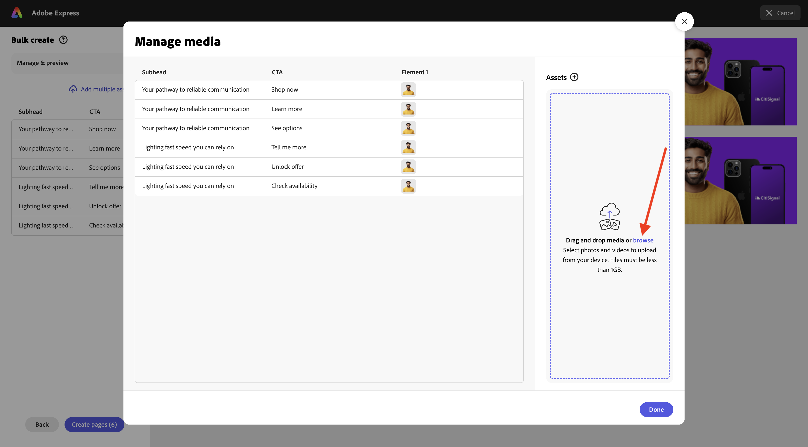

# 1.3.3 Adobe ExpressでのAssetsの一括作成

この演習を開始する前に、[https://tech-insiders.s3.us-west-2.amazonaws.com/one-adobe/Adobe_Express.zipから必要なアセットをダウンロードし ](https://tech-insiders.s3.us-west-2.amazonaws.com/one-adobe/Adobe_Express.zip){target="_blank"} デスクトップに解凍します。

## 基本アセッ 1.3.3.1 を作成するには

[https://new.express.adobe.com/](https://new.express.adobe.com/){target="_blank"} に移動します。 **+** アイコンをクリックして、新しい **画像** を作成します。

**写真** を選択してから、**メディアをアップロード** を選択します。

デスクトップに移動し、以前にダウンロードしたアセットを含む **0&rbrace;Adobe_Express&rbrace; フォルダーに移動します。**&#x200B;ファイル **banner.png** を選択し、「**開く**」をクリックします。

この画像が表示されます。 **画像を編集** を選択します。

次に、**メディア** に移動し、**画像をアップロード** を選択します。 デスクトップに移動し、以前にダウンロードしたアセットを含む **0&rbrace;Adobe_Express&rbrace; フォルダーに移動します。**&#x200B;ファイル **man.png** を選択し、「**開く** をクリックします。

この画像が表示されます。

次に、**CitiSignal** ロゴを追加する必要があります。 **ブランド** に移動し、白い CitiSignal ロゴを選択します。 3 つのドット **...** をクリックし、「**配置**」を選択します。

CitiSignal ロゴ画像の場所を調整して、下の画像の同じ位置を反映させます。

**テキスト** に移動し、「**テキストを追加** をクリックします。

新しいテキストボックスに、テキスト `Empowering Connections` を追加します。 次の図に示すように、テキストボックスを同様の場所にドラッグします。 次に、**Brands**/**Fonts** に移動します。 3 番目のフォントの 3 つのドット **...** をクリックし、「**適用**」をクリックします。

次に、フォントカラーを **白** に変更します。

もう一度 **テキスト** に移動し、「**テキストを追加** をクリックします。

新しいテキストボックスに、テキスト `Your pathway to reliable communication` を入力します。 テキストボックスの場所を、前のテキストボックスの下に移動します（以下の画像のように）。

**Brands**/**Fonts** に移動し、2 番目のフォントの 3 つのドット **...** をクリックします。 次に、「**適用** をクリックします。

これで完了です。 次に、**要素**、**図形** の順に移動し、角丸長方形をクリックします。

その後、画像に新しい丸い長方形のシェイプが表示されます。 ボタンのように見えるようにサイズと位置を調整します。 次に、角丸長方形の色を **黒** に変更します。

もう一度 **テキスト** に移動し、「**テキストを追加** をクリックします。

新しいテキストボックスにテキスト `Shop now` を入力し、ボタンの中央に配置するテキストボックスの位置を変更します。 **Brands**/**Fonts** に移動し、3 つ目のフォントの 3 つのドット **...** をクリックします。 次に、「**適用** をクリックします。

この画像が表示されます。

## Adobe Expressでの 1.3.3.2 の一括作成

次に、「**一括作成**」をクリックします。

この画像が表示されます。 **参照** をクリックします。

デスクトップに移動し、以前にダウンロードしたアセットを含むフォルダー **2&rbrace;Adobe_Express** の **Express Bulk Create」フォルダーに移動します。**&#x200B;ファイル **CTA-options.csv** を選択し、「**開く** をクリックします。

この画像が表示されます。 「**次へ**」をクリックします。

**要素を接続** をクリックします。

「信頼できる通信への道筋 **というテキストを含むテキストボックスを選択** ます。 次に、「**要素 1**」ボタンをクリックし、CSV ファイルのフィールド（この場合はフィールド **Subhead** にリンクします。

次に、「今すぐ購入 **というテキストを含むテキストボックス** 選択します。

次に、「**要素 1**」ボタンをクリックし、CSV ファイルのフィールド（この場合はフィールド **CTA** にリンクします。

この画像が表示されます。 次に、人物の画像をクリックします。

ボタン **要素 1** をクリックします。

このポップアップが表示されます。 **参照** をクリックします。

デスクトップに移動し、以前にダウンロードしたアセットを含むフォルダー **2&rbrace;Adobe_Express** の **Express Bulk Create」フォルダーに移動します。** 6～7 の画像ファイルを選択し、「**開く**」をクリックします。

その後、これが表示されます。 アセットの各バリエーションに別の画像をドラッグ&amp;ドロップします。 「**完了**」をクリックします。

生成される画像のバリエーションが表示されます。 **ページを作成** をクリックします。

これでバリエーションの準備が整ったので、各バリエーションを個別に調べて、確認および検証できます。

これで、この演習が完了しました。

## 次の手順

[ 概要とメリット ](./summary.md){target="_blank"} に移動します。

[Adobe ExpressとAdobe Experience Cloud](./express.md){target="_blank"} に戻る

[ すべてのモジュール ](./../../../overview.md){target="_blank"} に戻る